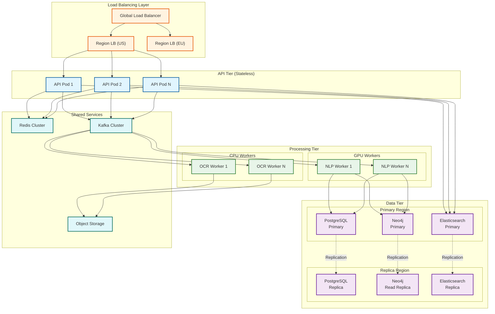
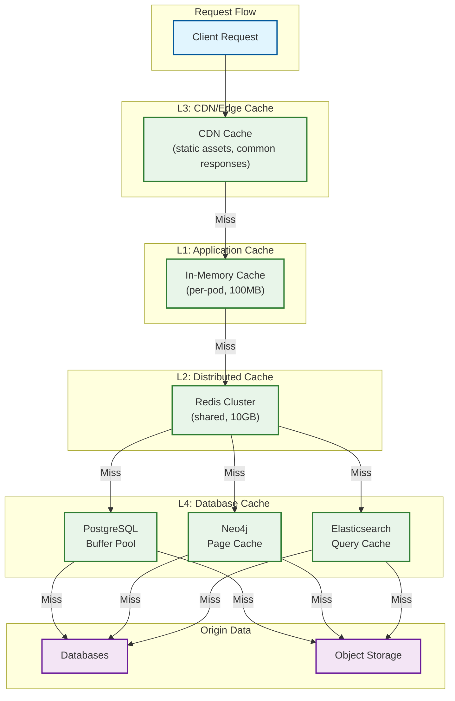
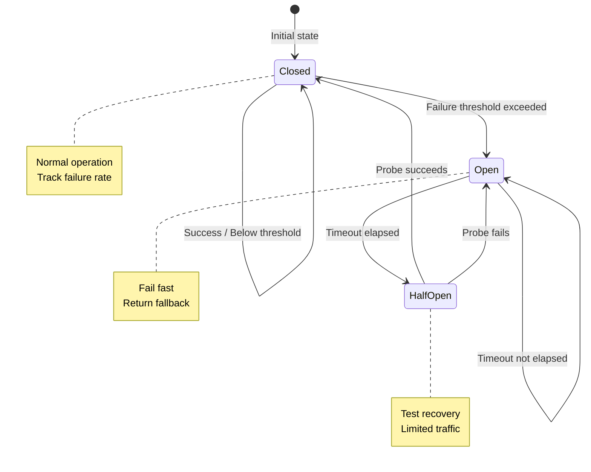
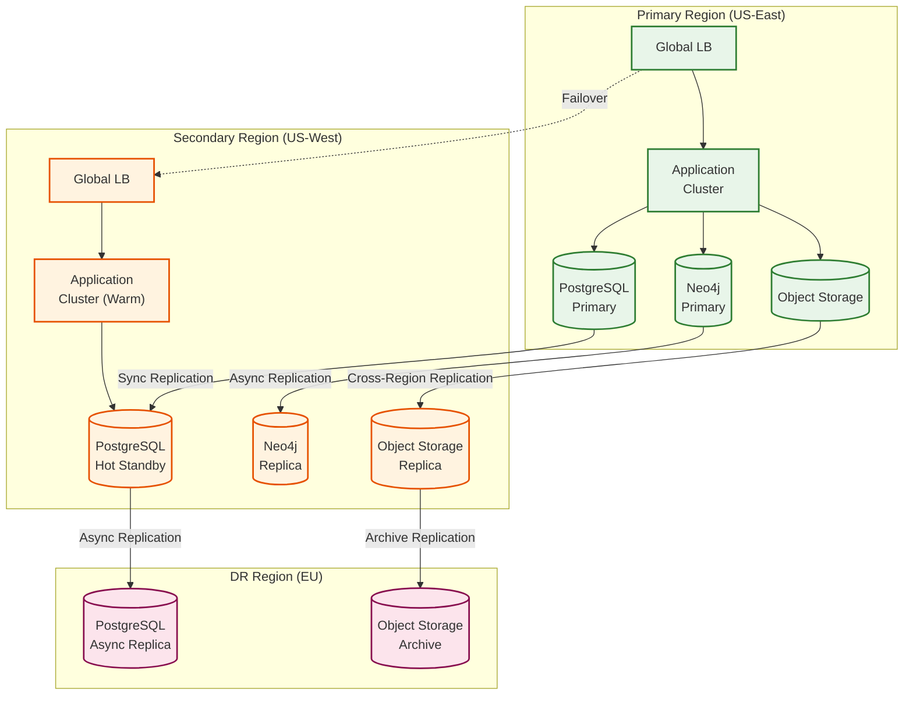

# Scalability and Reliability

## Table of Contents
- [Scalability Strategy](#scalability-strategy)
- [Caching Architecture](#caching-architecture)
- [Reliability Patterns](#reliability-patterns)
- [Disaster Recovery](#disaster-recovery)
- [Capacity Planning](#capacity-planning)

---

## Scalability Strategy

### Horizontal Scaling Architecture



### Scaling Dimensions

| Component | Scaling Type | Trigger | Scale Factor |
|-----------|--------------|---------|--------------|
| **API Servers** | Horizontal | CPU > 70% or QPS > threshold | +2 pods |
| **OCR Workers** | Horizontal | Queue depth > 100 | +1 worker per 50 items |
| **NLP Workers** | Horizontal (GPU) | GPU utilization > 80% | +1 GPU node |
| **PostgreSQL** | Vertical + Read Replicas | Connection saturation | Add read replica |
| **Neo4j** | Read Replicas + Sharding | Query latency > 100ms | Shard by jurisdiction |
| **Elasticsearch** | Horizontal (Shards) | Index size > 50GB | Add shards |
| **Redis** | Cluster mode | Memory > 80% | Add cluster nodes |
| **Kafka** | Partitions | Consumer lag > 1000 | Increase partitions |

### Auto-Scaling Configuration

```yaml
# Kubernetes HPA for API Tier
apiVersion: autoscaling/v2
kind: HorizontalPodAutoscaler
metadata:
  name: legal-api-hpa
spec:
  scaleTargetRef:
    apiVersion: apps/v1
    kind: Deployment
    name: legal-api
  minReplicas: 3
  maxReplicas: 20
  metrics:
    - type: Resource
      resource:
        name: cpu
        target:
          type: Utilization
          averageUtilization: 70
    - type: Pods
      pods:
        metric:
          name: http_requests_per_second
        target:
          type: AverageValue
          averageValue: 100
  behavior:
    scaleUp:
      stabilizationWindowSeconds: 60
      policies:
        - type: Pods
          value: 2
          periodSeconds: 60
    scaleDown:
      stabilizationWindowSeconds: 300
      policies:
        - type: Percent
          value: 10
          periodSeconds: 60

---
# KEDA Scaler for Processing Workers
apiVersion: keda.sh/v1alpha1
kind: ScaledObject
metadata:
  name: ocr-worker-scaler
spec:
  scaleTargetRef:
    name: ocr-worker
  minReplicaCount: 2
  maxReplicaCount: 50
  triggers:
    - type: kafka
      metadata:
        bootstrapServers: kafka:9092
        consumerGroup: ocr-workers
        topic: document-processing
        lagThreshold: "100"
```

### Database Scaling Strategy

#### PostgreSQL Sharding (Tenant-based)

```
SHARDING_STRATEGY:
  type: TENANT_BASED
  shard_key: tenant_id
  shard_count: 16
  routing:
    method: HASH
    function: consistent_hash(tenant_id) % shard_count

SHARD_ASSIGNMENT:
  Shard 0-3:   US Enterprise tenants
  Shard 4-7:   US Mid-market tenants
  Shard 8-11:  EU tenants (GDPR isolated)
  Shard 12-15: APAC tenants

CROSS_SHARD_QUERIES:
  # Rare - only for platform analytics
  # Use scatter-gather pattern
  ALGORITHM CrossShardQuery(query):
      results = []
      FOR shard IN active_shards:
          partial = execute_on_shard(shard, query)
          results.append(partial)
      RETURN merge_results(results)
```

#### Neo4j Sharding (Jurisdiction-based)

```
GRAPH_SHARDS:
  us_federal:
    content: US Federal law, SEC, FTC regulations
    size: ~10M nodes
    read_replicas: 2

  us_state:
    content: State-specific law (NY, DE, CA)
    size: ~30M nodes
    read_replicas: 3

  eu_uk:
    content: EU regulations, UK law
    size: ~15M nodes
    read_replicas: 2
    location: EU (GDPR)

  apac:
    content: APAC jurisdictions
    size: ~5M nodes
    read_replicas: 1

CROSS_SHARD_RESOLUTION:
  # When contract spans jurisdictions
  ALGORITHM MultiJurisdictionQuery(jurisdictions):
      relevant_shards = map_jurisdictions_to_shards(jurisdictions)
      results = parallel_query(relevant_shards, query)
      RETURN merge_legal_knowledge(results)
```

---

## Caching Architecture

### Multi-Level Cache Design



### Cache Configuration

| Cache Layer | Purpose | TTL | Size | Eviction |
|-------------|---------|-----|------|----------|
| **L1 In-Memory** | Hot data per pod | 60s | 100MB/pod | LRU |
| **L2 Redis** | Shared hot data | 10min | 10GB | LRU + TTL |
| **L3 CDN** | Static + common responses | 1hr | Unlimited | TTL |
| **Clause Pattern Cache** | Common clause templates | 24hr | 1GB | LFU |
| **Explanation Cache** | Pre-computed explanations | 1hr | 2GB | LRU |
| **Search Result Cache** | Legal research results | 30min | 500MB | LRU |

### Cache Key Design

```
# Contract data
contract:{tenant_id}:{contract_id}:summary
contract:{tenant_id}:{contract_id}:clauses
contract:{tenant_id}:{contract_id}:risks

# Clause patterns (tenant-agnostic for common patterns)
clause_pattern:{pattern_hash}:extraction
clause_pattern:{pattern_hash}:classification

# Explanations
explanation:{source_type}:{source_id}:{context_hash}

# Legal research
research:{query_hash}:{jurisdiction}:{date_range}

# Playbook comparison
playbook_comparison:{clause_hash}:{playbook_id}:{playbook_version}

# User session
session:{user_id}:recent_contracts
session:{user_id}:recent_searches
```

### Cache Invalidation Strategy

```
ALGORITHM InvalidateContractCache(contract_id, change_type):
    tenant_id = get_tenant(contract_id)

    // Direct invalidation
    invalidate(f"contract:{tenant_id}:{contract_id}:*")

    // Dependent invalidations
    IF change_type IN ["CLAUSE_UPDATE", "FULL_UPDATE"]:
        // Invalidate clause-based caches
        clauses = get_clause_ids(contract_id)
        FOR clause_id IN clauses:
            invalidate(f"explanation:CLAUSE:{clause_id}:*")

        // Invalidate matter-level aggregations
        matter_id = get_matter(contract_id)
        IF matter_id:
            invalidate(f"matter:{tenant_id}:{matter_id}:summary")

    IF change_type == "PLAYBOOK_CHANGE":
        // Invalidate all playbook comparisons for this playbook
        playbook_id = get_affected_playbook(contract_id)
        invalidate(f"playbook_comparison:*:{playbook_id}:*")

    // Publish invalidation event for distributed caches
    publish_event("cache_invalidation", {
        "contract_id": contract_id,
        "tenant_id": tenant_id,
        "change_type": change_type,
        "timestamp": now()
    })
```

---

## Reliability Patterns

### Circuit Breaker Implementation



```
CIRCUIT_BREAKER_CONFIG:
  llm_gateway:
    failure_threshold: 50%        # Open after 50% failure rate
    sample_size: 20               # Over last 20 requests
    timeout: 60s                  # Time in open state
    half_open_requests: 3         # Probes before closing
    fallback: use_cached_or_template

  ocr_service:
    failure_threshold: 30%
    sample_size: 50
    timeout: 30s
    half_open_requests: 5
    fallback: queue_for_retry

  knowledge_graph:
    failure_threshold: 40%
    sample_size: 100
    timeout: 45s
    half_open_requests: 10
    fallback: use_cached_results

ALGORITHM CircuitBreakerCall(service, request):
    breaker = get_circuit_breaker(service)

    IF breaker.state == OPEN:
        IF breaker.timeout_elapsed():
            breaker.state = HALF_OPEN
        ELSE:
            RETURN breaker.fallback(request)

    TRY:
        response = call_service(service, request)
        breaker.record_success()

        IF breaker.state == HALF_OPEN:
            breaker.probe_successes += 1
            IF breaker.probe_successes >= breaker.half_open_threshold:
                breaker.state = CLOSED
                breaker.reset_counters()

        RETURN response

    CATCH ServiceError:
        breaker.record_failure()

        IF breaker.state == HALF_OPEN:
            breaker.state = OPEN
            breaker.reset_timeout()

        ELIF breaker.failure_rate() > breaker.threshold:
            breaker.state = OPEN
            breaker.set_timeout()

        RETURN breaker.fallback(request)
```

### Bulkhead Pattern

```
BULKHEAD_CONFIGURATION:
  # Separate resource pools for different workloads
  pools:
    real_time_analysis:
      threads: 50
      queue_size: 100
      timeout: 30s
      priority: HIGH

    batch_due_diligence:
      threads: 20
      queue_size: 500
      timeout: 300s
      priority: NORMAL

    legal_research:
      threads: 30
      queue_size: 200
      timeout: 60s
      priority: NORMAL

    background_processing:
      threads: 10
      queue_size: 1000
      timeout: 600s
      priority: LOW

  isolation:
    # Real-time cannot be starved by batch
    real_time_analysis:
      min_threads: 30  # Always available
      max_queue_wait: 5s

    # Batch can use excess capacity
    batch_due_diligence:
      min_threads: 5
      can_borrow_from: [background_processing]
```

### Retry Strategy with Exponential Backoff

```
RETRY_CONFIGURATION:
  llm_api:
    max_retries: 3
    initial_delay: 1s
    max_delay: 30s
    multiplier: 2
    jitter: 0.1  # ±10%
    retryable_errors: [TIMEOUT, RATE_LIMITED, SERVER_ERROR]

  database:
    max_retries: 5
    initial_delay: 100ms
    max_delay: 5s
    multiplier: 2
    jitter: 0.2
    retryable_errors: [DEADLOCK, CONNECTION_LOST, TEMPORARY_FAILURE]

  external_services:
    max_retries: 3
    initial_delay: 500ms
    max_delay: 15s
    multiplier: 2
    jitter: 0.1
    retryable_errors: [TIMEOUT, UNAVAILABLE]

ALGORITHM RetryWithBackoff(operation, config):
    attempts = 0
    last_error = None

    WHILE attempts < config.max_retries:
        TRY:
            RETURN operation()
        CATCH error:
            IF NOT is_retryable(error, config.retryable_errors):
                RAISE error

            last_error = error
            attempts += 1

            IF attempts >= config.max_retries:
                RAISE MaxRetriesExceeded(last_error)

            // Calculate delay with exponential backoff + jitter
            base_delay = min(
                config.initial_delay * (config.multiplier ** attempts),
                config.max_delay
            )
            jitter_range = base_delay * config.jitter
            actual_delay = base_delay + random(-jitter_range, +jitter_range)

            log_retry(operation, attempts, actual_delay, error)
            sleep(actual_delay)
```

### Graceful Degradation Matrix

| Component Failure | Degradation Strategy | User Impact |
|-------------------|---------------------|-------------|
| **LLM API Down** | Use cached explanations, template-based fallback | Explanations less detailed |
| **OCR Service Down** | Queue documents, manual upload option | Processing delayed |
| **Knowledge Graph Down** | Use cached queries, disable cross-reference | Research limited |
| **Vector DB Down** | Fall back to keyword search | Similarity search unavailable |
| **Primary DB Down** | Fail over to replica (read-only mode) | No new uploads |
| **Cache Down** | Direct DB queries (degraded performance) | Higher latency |

```
ALGORITHM GracefulDegradation(request, failed_component):
    degradation_mode = get_degradation_mode(failed_component)

    SWITCH degradation_mode:
        CASE "LLM_FALLBACK":
            // Use template-based explanation
            explanation = generate_template_explanation(request)
            explanation.metadata.degraded = True
            explanation.metadata.reason = "AI service temporarily unavailable"
            RETURN explanation

        CASE "SEARCH_FALLBACK":
            // Fall back to keyword search
            results = keyword_search(request.query)
            results.metadata.degraded = True
            results.metadata.note = "Semantic search unavailable, using keyword match"
            RETURN results

        CASE "READ_ONLY_MODE":
            IF request.is_write:
                queue_for_later(request)
                RETURN AcceptedResponse(
                    message = "Request queued for processing when service recovers",
                    eta = estimated_recovery_time()
                )
            ELSE:
                RETURN serve_from_replica(request)

        CASE "OFFLINE_MODE":
            // For critical features, provide cached last-known-good
            cached = get_cached_response(request)
            IF cached:
                cached.metadata.stale = True
                RETURN cached
            ELSE:
                RETURN ServiceUnavailableResponse(
                    retry_after = estimated_recovery_time()
                )
```

---

## Disaster Recovery

### Recovery Objectives

| Tier | RTO | RPO | Scope |
|------|-----|-----|-------|
| **Tier 1** (Critical) | 15 min | 0 (sync replication) | User data, contracts, audit logs |
| **Tier 2** (Important) | 1 hour | 15 min | Analysis results, cache |
| **Tier 3** (Standard) | 4 hours | 1 hour | Knowledge graph, search index |
| **Tier 4** (Rebuild) | 24 hours | N/A | Derived data, analytics |

### Multi-Region Failover Architecture



### Failover Procedures

```
PROCEDURE AutomatedFailover(failure_detection):
    // Phase 1: Detection and Decision (0-2 minutes)
    IF health_check_failures >= 3 AND across_multiple_monitors:
        incident = create_incident(severity=CRITICAL)
        notify_oncall(incident)

        IF automated_failover_enabled:
            decision = PROCEED_WITH_FAILOVER
        ELSE:
            decision = await_human_approval(timeout=5min)

    // Phase 2: Preparation (2-5 minutes)
    IF decision == PROCEED_WITH_FAILOVER:
        // Stop writes to primary
        set_primary_read_only()

        // Verify replica is caught up
        lag = check_replication_lag()
        IF lag > acceptable_lag:
            wait_for_catchup(timeout=2min)

        // Verify secondary health
        IF NOT verify_secondary_health():
            ABORT_FAILOVER("Secondary unhealthy")

    // Phase 3: Failover Execution (5-10 minutes)
        // Promote replica to primary
        promote_replica_to_primary()

        // Update DNS/load balancer
        update_traffic_routing(new_primary=secondary)

        // Verify new primary is accepting traffic
        run_smoke_tests(secondary)

    // Phase 4: Verification (10-15 minutes)
        // Monitor error rates
        monitor_error_rates(threshold=1%, duration=5min)

        // Verify data integrity
        run_integrity_checks()

        // Update incident status
        update_incident(status="MITIGATED")

    // Phase 5: Communication
        notify_stakeholders(incident, resolution)
        schedule_postmortem(incident)
```

### Backup Strategy

| Data Type | Backup Method | Frequency | Retention | Storage |
|-----------|--------------|-----------|-----------|---------|
| **Contracts** | Incremental snapshot | Continuous | 7 years | Cross-region S3 |
| **Database** | WAL archiving + daily full | Continuous + daily | 30 days | Cross-region S3 |
| **Knowledge Graph** | Neo4j backup | Daily | 14 days | Cross-region S3 |
| **Audit Logs** | Immutable append | Continuous | 7 years | WORM storage |
| **Search Index** | Snapshot | Daily | 7 days | Same region |
| **Configuration** | Git versioned | On change | Indefinite | Git repository |

### Recovery Runbooks

```
RUNBOOK: Database_Recovery

1. ASSESS SITUATION
   - Determine failure type: corruption, deletion, hardware failure
   - Identify affected data scope
   - Notify stakeholders

2. PREPARE RECOVERY
   - Select appropriate backup based on RPO
   - Provision recovery environment (if needed)
   - Verify backup integrity: checksums, test restore

3. EXECUTE RECOVERY
   IF failure_type == "CORRUPTION":
       - Restore from last known good backup
       - Replay WAL logs up to corruption point
       - Validate data consistency

   IF failure_type == "DELETION":
       - Use point-in-time recovery (PITR)
       - Restore deleted records
       - Merge with current data

   IF failure_type == "HARDWARE_FAILURE":
       - Promote replica to primary
       - Rebuild failed node
       - Re-establish replication

4. VERIFY RECOVERY
   - Run data integrity checks
   - Compare record counts
   - Validate recent transactions
   - Run application smoke tests

5. RESUME OPERATIONS
   - Remove read-only mode
   - Verify application connectivity
   - Monitor for anomalies
   - Update incident status

6. POST-RECOVERY
   - Document lessons learned
   - Update runbook if needed
   - Schedule postmortem
```

---

## Capacity Planning

### Growth Projections

| Metric | Year 1 | Year 2 | Year 3 | Year 5 |
|--------|--------|--------|--------|--------|
| **Tenants** | 50 | 150 | 400 | 1,000 |
| **Monthly Active Users** | 2,500 | 10,000 | 35,000 | 100,000 |
| **Contracts/Month** | 250K | 1M | 4M | 15M |
| **Storage (Cumulative)** | 5 TB | 25 TB | 100 TB | 500 TB |
| **Peak QPS** | 100 | 500 | 2,000 | 10,000 |
| **Knowledge Graph Nodes** | 50M | 200M | 500M | 1B |

### Infrastructure Scaling Plan

| Component | Year 1 | Year 3 | Year 5 |
|-----------|--------|--------|--------|
| **API Servers** | 6 pods | 30 pods | 100 pods |
| **GPU Workers** | 4 nodes (16 GPUs) | 16 nodes (64 GPUs) | 50 nodes (200 GPUs) |
| **PostgreSQL** | 1 primary + 2 replicas | 8 shards + replicas | 32 shards + replicas |
| **Neo4j** | 3-node cluster | 3 sharded clusters | 10 sharded clusters |
| **Elasticsearch** | 3 nodes, 6 shards | 12 nodes, 24 shards | 50 nodes, 100 shards |
| **Redis** | 6-node cluster | 18-node cluster | 50-node cluster |
| **Kafka** | 3 brokers | 9 brokers | 30 brokers |

### Cost Optimization Strategies

| Strategy | Savings | Implementation |
|----------|---------|----------------|
| **Reserved Instances** | 30-50% | 1-3 year commitments for base load |
| **Spot Instances** | 60-70% | Batch processing, non-critical workloads |
| **Auto-scaling** | 20-30% | Scale down during off-peak |
| **Tiered Storage** | 40-60% | Archive old documents to cold storage |
| **Caching** | 30-40% | Reduce compute for repeated operations |
| **Model Optimization** | 20-30% | Quantized models, batched inference |

### Capacity Alerts

| Alert | Threshold | Action |
|-------|-----------|--------|
| **CPU Utilization** | > 80% for 5 min | Scale out API/workers |
| **Memory Utilization** | > 85% for 5 min | Investigate + scale |
| **Disk Usage** | > 75% | Add storage, archive old data |
| **Database Connections** | > 80% of max | Add read replicas |
| **Queue Depth** | > 1000 items for 10 min | Scale consumers |
| **Cache Hit Rate** | < 80% | Increase cache size, review keys |
| **Error Rate** | > 1% for 5 min | Investigate, potential incident |
