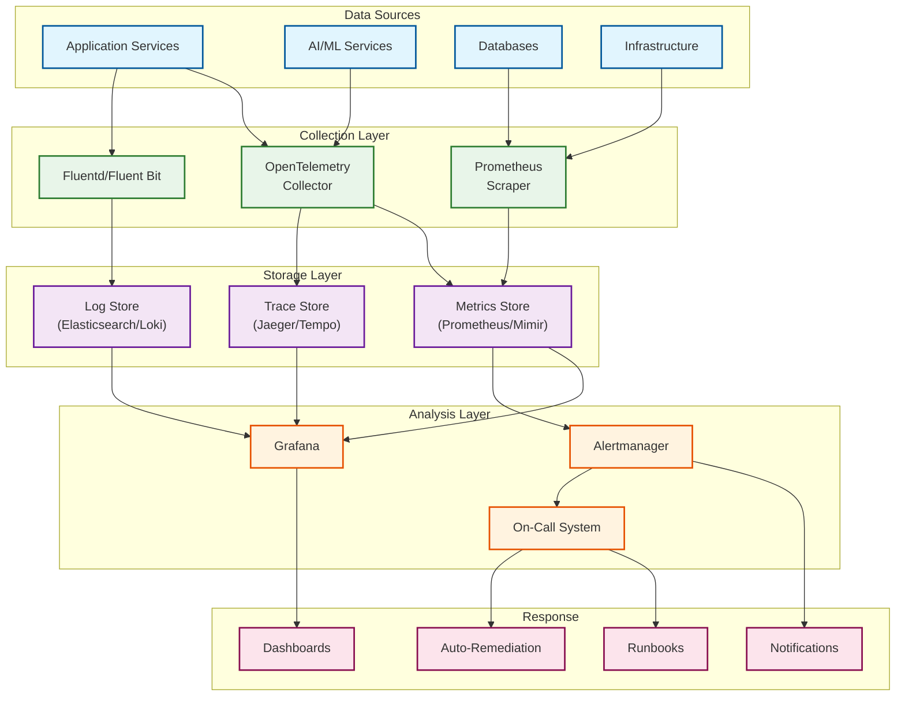
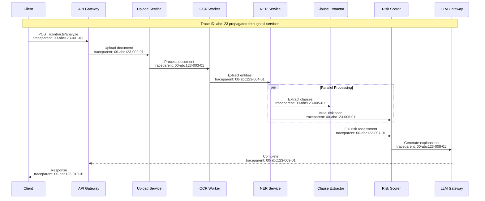

# Observability

## Table of Contents
- [Observability Strategy](#observability-strategy)
- [Metrics](#metrics)
- [Logging](#logging)
- [Distributed Tracing](#distributed-tracing)
- [Alerting](#alerting)
- [Dashboards](#dashboards)
- [Legal AI-Specific Observability](#legal-ai-specific-observability)

---

## Observability Strategy

### Three Pillars Architecture



### Observability Goals

| Goal | Target | Measurement |
|------|--------|-------------|
| **Mean Time to Detect (MTTD)** | < 5 minutes | Alert latency from incident start |
| **Mean Time to Acknowledge (MTTA)** | < 15 minutes | Time to human response |
| **Mean Time to Resolve (MTTR)** | < 1 hour | Critical issues |
| **Alert Noise Ratio** | < 10% false positives | Alert accuracy |
| **Log Coverage** | > 99% of requests | Log completeness |
| **Trace Sampling** | 100% for errors, 10% normal | Trace availability |

---

## Metrics

### USE Method (Utilization, Saturation, Errors)

| Resource | Utilization | Saturation | Errors |
|----------|-------------|------------|--------|
| **API Servers** | CPU %, Memory % | Request queue depth | HTTP 5xx rate |
| **GPU Workers** | GPU utilization % | Job queue depth | Inference failures |
| **Database** | Connection pool %, CPU | Lock wait time | Query errors |
| **Cache** | Memory %, Hit rate | Eviction rate | Connection errors |
| **Queue** | Throughput vs capacity | Consumer lag | Dead letter count |

### RED Method (Rate, Errors, Duration)

| Service | Rate | Errors | Duration |
|---------|------|--------|----------|
| **Contract Analysis API** | requests/sec | error rate % | p50, p95, p99 latency |
| **Clause Extraction** | clauses/sec | extraction failures | processing time |
| **Risk Assessment** | assessments/sec | scoring failures | analysis time |
| **Legal Research** | queries/sec | search failures | response time |
| **LLM Gateway** | tokens/sec | API errors | token generation time |

### Legal AI-Specific Metrics

```yaml
# Accuracy Metrics
clause_extraction_accuracy:
  type: gauge
  labels: [clause_type, document_type]
  description: "F1 score for clause extraction by type"
  target: "> 0.95"

risk_detection_precision:
  type: gauge
  labels: [risk_category]
  description: "Precision of risk detection"
  target: "> 0.90"

citation_verification_rate:
  type: gauge
  labels: [source_type]
  description: "Percentage of citations successfully verified"
  target: "> 0.99"

# Quality Metrics
attorney_override_rate:
  type: gauge
  labels: [extraction_type, model_version]
  description: "Rate at which attorneys override AI decisions"
  target: "< 0.10"

explanation_completeness:
  type: gauge
  labels: [explanation_type]
  description: "Percentage of outputs with complete explanations"
  target: "= 1.0"

hallucination_detection_rate:
  type: counter
  labels: [detection_method]
  description: "Rate of detected AI hallucinations"

# Compliance Metrics
privilege_classification_accuracy:
  type: gauge
  description: "Accuracy of automatic privilege classification"
  target: "> 0.95"

audit_log_completeness:
  type: gauge
  description: "Percentage of actions with complete audit logs"
  target: "= 1.0"

pii_detection_rate:
  type: gauge
  labels: [pii_type]
  description: "Detection rate for PII types"

# Business Metrics
contracts_processed_total:
  type: counter
  labels: [tenant_id, document_type, status]
  description: "Total contracts processed"

due_diligence_completion_time:
  type: histogram
  labels: [project_size_bucket]
  description: "Time to complete due diligence projects"
  buckets: [1h, 2h, 4h, 8h, 24h, 48h]

cost_per_contract:
  type: gauge
  labels: [processing_type]
  description: "Average cost per contract analysis"
```

### SLI/SLO Definitions

| SLI | Definition | SLO | Error Budget |
|-----|------------|-----|--------------|
| **Availability** | Successful requests / Total requests | 99.9% | 43.2 min/month |
| **Latency (Contract Review)** | P99 response time < 60s | 99% | 1% of requests can exceed |
| **Latency (Research)** | P99 response time < 10s | 99% | 1% of requests can exceed |
| **Clause Extraction Accuracy** | F1 score on sampled batch | > 95% | 5% can be below |
| **Explainability Coverage** | Outputs with explanations | 100% | 0 tolerance |
| **Privilege Breach Rate** | Unauthorized access / Total access | 0% | 0 tolerance |

---

## Logging

### Log Levels and Categories

| Level | Usage | Retention | Examples |
|-------|-------|-----------|----------|
| **ERROR** | Failures requiring attention | 90 days | API errors, processing failures |
| **WARN** | Potential issues | 30 days | Degraded performance, retries |
| **INFO** | Significant events | 14 days | Request completion, state changes |
| **DEBUG** | Diagnostic information | 7 days (sampled) | Detailed processing steps |
| **TRACE** | Fine-grained debugging | On-demand | Token-level processing |

### Structured Log Format

```json
{
  "timestamp": "2026-01-29T14:30:00.123Z",
  "level": "INFO",
  "service": "clause-extraction-service",
  "version": "2.3.1",
  "environment": "production",

  "trace_id": "abc123def456",
  "span_id": "789ghi012",
  "parent_span_id": "456jkl789",

  "tenant_id": "tenant-123",
  "user_id": "user-456",
  "request_id": "req-789",

  "event": "clause_extracted",
  "message": "Successfully extracted clause",

  "context": {
    "contract_id": "contract-abc",
    "clause_type": "INDEMNIFICATION",
    "clause_id": "clause-xyz",
    "confidence": 0.94,
    "processing_time_ms": 234,
    "model_version": "legal-bert-v3.2"
  },

  "metrics": {
    "tokens_processed": 1250,
    "clauses_in_document": 45,
    "current_clause_index": 12
  }
}
```

### Log Aggregation Queries

```
# Find all errors for a specific contract
{tenant_id="tenant-123"} |= "contract-abc" | level="ERROR"

# Track processing pipeline for a request
{trace_id="abc123def456"} | sort by timestamp

# Analyze clause extraction performance by type
sum by (clause_type) (
  rate({service="clause-extraction-service"}
    | json
    | event="clause_extracted"
    | processing_time_ms > 1000
  [5m])
)

# Find privilege classification mismatches
{service="privilege-classifier"}
  | json
  | event="classification_override"
  | auto_classification != final_classification

# Audit trail for specific document
{tenant_id="tenant-123", event=~".*contract-abc.*"}
  | json
  | sort by timestamp
```

### Sensitive Data Handling in Logs

```
LOG_SANITIZATION_RULES:
  # Never log these
  prohibited:
    - document_content
    - clause_text (except truncated)
    - pii_values
    - api_keys
    - passwords
    - session_tokens

  # Mask these
  masked:
    - email: "j***@example.com"
    - phone: "***-***-1234"
    - ssn: "***-**-6789"
    - ip_address: "192.168.*.*"  # Internal IPs only

  # Truncate these
  truncated:
    - clause_text: first 50 chars + "..."
    - error_message: first 200 chars
    - query_text: first 100 chars

  # Hash these for correlation
  hashed:
    - user_id_external: SHA256
    - document_name: SHA256
```

---

## Distributed Tracing

### Trace Context Propagation



### Span Attributes

```yaml
# Standard OpenTelemetry attributes
standard_attributes:
  service.name: string
  service.version: string
  deployment.environment: string

# Custom legal tech attributes
legal_tech_attributes:
  legal.tenant_id: string
  legal.matter_id: string
  legal.document_id: string
  legal.document_type: string
  legal.privilege_level: string

  ai.model_name: string
  ai.model_version: string
  ai.confidence_score: float
  ai.tokens_input: int
  ai.tokens_output: int
  ai.cost_usd: float

  extraction.clause_type: string
  extraction.clause_count: int
  extraction.accuracy_sample: float

  compliance.privilege_checked: boolean
  compliance.audit_logged: boolean
```

### Sampling Strategy

```yaml
sampling_config:
  # Always sample these
  always_sample:
    - http.status_code >= 400  # All errors
    - ai.confidence_score < 0.7  # Low confidence
    - legal.privilege_level == "PRIVILEGED"  # Privileged access
    - processing_time_ms > 10000  # Slow requests

  # Probabilistic sampling for normal traffic
  probabilistic:
    default_rate: 0.10  # 10% of normal requests
    per_service_rates:
      api-gateway: 0.05
      clause-extraction: 0.20  # Higher for ML services
      llm-gateway: 0.30  # Track AI costs

  # Head-based vs tail-based
  strategy: "tail-based"  # Decide after seeing full trace
  tail_sampling_policies:
    - name: error-traces
      type: status_code
      status_code: ERROR
      sample_rate: 1.0

    - name: slow-traces
      type: latency
      threshold_ms: 5000
      sample_rate: 1.0

    - name: high-value
      type: string_attribute
      key: legal.document_type
      values: ["MERGER", "IPO"]
      sample_rate: 1.0
```

---

## Alerting

### Alert Categories

| Category | Severity | Response Time | Notification |
|----------|----------|---------------|--------------|
| **P1 - Critical** | Service down, data breach | 5 min | Page on-call, notify management |
| **P2 - High** | Degraded performance, accuracy drop | 15 min | Page on-call |
| **P3 - Medium** | Non-critical failures, warnings | 1 hour | Slack notification |
| **P4 - Low** | Informational, capacity planning | Next business day | Email digest |

### Alert Definitions

```yaml
alerts:
  # P1 - Critical
  - name: PrivilegeBreachDetected
    severity: P1
    condition: |
      sum(rate(privilege_access_denied_total{reason="unauthorized"}[5m])) > 0
    for: 1m
    annotations:
      summary: "Potential privilege breach detected"
      runbook: "https://runbooks/privilege-breach"
    labels:
      team: security
      escalate: immediate

  - name: ServiceDown
    severity: P1
    condition: |
      up{job="legal-api"} == 0
    for: 2m
    annotations:
      summary: "Legal API service is down"
      runbook: "https://runbooks/service-down"

  # P2 - High
  - name: ClauseExtractionAccuracyDrop
    severity: P2
    condition: |
      clause_extraction_accuracy < 0.90
    for: 15m
    annotations:
      summary: "Clause extraction accuracy below 90%"
      runbook: "https://runbooks/accuracy-drop"
    labels:
      team: ml

  - name: HighLatency
    severity: P2
    condition: |
      histogram_quantile(0.99,
        rate(http_request_duration_seconds_bucket{service="contract-analysis"}[5m])
      ) > 60
    for: 10m
    annotations:
      summary: "Contract analysis P99 latency > 60s"

  - name: AttorneyOverrideRateHigh
    severity: P2
    condition: |
      attorney_override_rate > 0.15
    for: 1h
    annotations:
      summary: "Attorney override rate exceeds 15%"
      description: "AI outputs are being overridden frequently, investigate model quality"

  # P3 - Medium
  - name: LLMCostSpike
    severity: P3
    condition: |
      sum(rate(llm_cost_usd_total[1h])) > 2 * avg_over_time(sum(rate(llm_cost_usd_total[1h]))[7d:1h])
    for: 30m
    annotations:
      summary: "LLM costs 2x above weekly average"

  - name: QueueBacklog
    severity: P3
    condition: |
      kafka_consumer_lag{topic="document-processing"} > 1000
    for: 15m
    annotations:
      summary: "Document processing queue backlog > 1000"

  # P4 - Low
  - name: StorageApproachingLimit
    severity: P4
    condition: |
      (disk_used_bytes / disk_total_bytes) > 0.75
    for: 24h
    annotations:
      summary: "Storage utilization approaching 75%"
```

### On-Call Rotation

```yaml
on_call_schedule:
  primary:
    rotation: weekly
    teams:
      - platform-engineering
      - ml-engineering
    escalation_timeout: 15m

  secondary:
    rotation: weekly
    teams:
      - platform-leads
      - ml-leads
    escalation_timeout: 30m

  management:
    condition: P1 not resolved in 1 hour
    notify:
      - engineering-director
      - cto

  security_specific:
    trigger: security-related alerts
    team: security-oncall
    escalation: security-lead (15m), ciso (30m)
```

---

## Dashboards

### Executive Dashboard

| Panel | Metrics | Refresh |
|-------|---------|---------|
| **Platform Health** | Availability %, Error rate | 1 min |
| **Active Users** | DAU, concurrent sessions | 5 min |
| **Contracts Processed** | Daily count, trend | 5 min |
| **AI Accuracy** | Clause F1, Risk precision | 1 hour |
| **Compliance Status** | Audit completeness, breaches | 5 min |
| **Cost Overview** | LLM spend, compute costs | 1 hour |

### Operations Dashboard

```
+------------------+------------------+------------------+
|  Request Rate    |  Error Rate      |  Latency P99     |
|  [Graph]         |  [Graph]         |  [Graph]         |
+------------------+------------------+------------------+
|  Service Health Matrix                                |
|  [API: OK] [OCR: OK] [NER: OK] [LLM: DEGRADED]       |
+------------------+------------------+------------------+
|  Queue Depths    |  Worker Status   |  Cache Hit Rate  |
|  [Graph]         |  [Status]        |  [Gauge]         |
+------------------+------------------+------------------+
|  Recent Errors (Top 10)                               |
|  [Table: timestamp, service, error, count]            |
+------------------+------------------+------------------+
|  Active Traces (Slow requests)                        |
|  [List: trace_id, duration, status]                   |
+------------------+------------------+------------------+
```

### AI/ML Dashboard

```
+------------------+------------------+------------------+
|  Model Accuracy Trends                                |
|  [Clause Extraction F1] [Risk Precision] [NER F1]    |
+------------------+------------------+------------------+
|  Confidence Distribution |  Attorney Override Rate  |
|  [Histogram]             |  [Trend Graph]           |
+------------------+------------------+------------------+
|  LLM Performance                                      |
|  [Tokens/sec] [Latency] [Cost/request]               |
+------------------+------------------+------------------+
|  Hallucination Detection                              |
|  [Detected count] [By type] [Trend]                  |
+------------------+------------------+------------------+
|  Model Version Comparison                             |
|  [A/B Test Results] [Accuracy Delta]                 |
+------------------+------------------+------------------+
|  Explanation Quality                                  |
|  [Completeness %] [Citation Accuracy] [User Ratings] |
+------------------+------------------+------------------+
```

### Compliance Dashboard

```
+------------------+------------------+------------------+
|  Privilege Classifications Today                      |
|  [Privileged: X] [Work Product: Y] [Confidential: Z] |
+------------------+------------------+------------------+
|  Access Audit Summary  |  PII Detection Summary     |
|  [By user role]        |  [By PII type]             |
+------------------+------------------+------------------+
|  Legal Holds Active    |  DSR Requests              |
|  [Count by status]     |  [Open/Closed/Overdue]     |
+------------------+------------------+------------------+
|  Security Events (Last 24h)                           |
|  [Failed logins] [Permission denials] [Anomalies]    |
+------------------+------------------+------------------+
|  Audit Log Completeness                               |
|  [Coverage %] [Missing logs by service]              |
+------------------+------------------+------------------+
```

---

## Legal AI-Specific Observability

### Explainability Monitoring

```yaml
explainability_metrics:
  # Coverage
  - name: explanation_coverage
    description: "Percentage of AI outputs with explanations"
    query: |
      sum(outputs_with_explanation) / sum(total_ai_outputs)
    target: 1.0

  # Quality
  - name: explanation_citation_accuracy
    description: "Percentage of citations that verify successfully"
    query: |
      sum(verified_citations) / sum(total_citations)
    target: 0.99

  # Completeness
  - name: explanation_reasoning_steps
    description: "Average reasoning steps per explanation"
    query: |
      avg(reasoning_steps_count)
    baseline: 3-5 steps

  # User satisfaction
  - name: explanation_helpfulness_rating
    description: "User rating of explanation helpfulness (1-5)"
    query: |
      avg(user_explanation_rating)
    target: "> 4.0"
```

### Hallucination Detection Monitoring

```yaml
hallucination_detection:
  metrics:
    - name: hallucination_rate
      description: "Rate of detected hallucinations per 1000 outputs"
      alert_threshold: "> 5"

    - name: citation_fabrication_rate
      description: "Fake citations detected"
      alert_threshold: "> 0"
      severity: P2

    - name: fact_inconsistency_rate
      description: "Facts inconsistent with source documents"
      alert_threshold: "> 2%"

  detection_methods:
    citation_verification:
      - Check case citations against legal databases
      - Verify statute references
      - Validate quoted text against source

    fact_checking:
      - Cross-reference extracted facts with source
      - Detect contradictions within explanation
      - Flag impossible dates or values

    confidence_calibration:
      - Compare stated confidence vs actual accuracy
      - Track calibration drift over time
```

### Model Performance Tracking

```yaml
model_performance_tracking:
  clause_extraction:
    primary_metric: f1_score
    secondary_metrics: [precision, recall]
    breakdown_by: [clause_type, document_type]
    sample_size: 100 per day
    review_cadence: weekly

  risk_detection:
    primary_metric: precision
    secondary_metrics: [recall, auc]
    breakdown_by: [risk_category, severity]
    sample_size: 50 per day
    review_cadence: weekly

  ner:
    primary_metric: f1_score
    breakdown_by: [entity_type]
    sample_size: 200 per day
    review_cadence: bi-weekly

  regression_detection:
    compare_against: previous_version
    threshold: -2% accuracy
    action: alert + rollback consideration
```

### Cost Attribution

```yaml
cost_tracking:
  llm_costs:
    dimensions:
      - tenant_id
      - model_name
      - operation_type (extraction, explanation, research)
      - document_type
    metrics:
      - tokens_input
      - tokens_output
      - cost_usd
    aggregations:
      - per_contract
      - per_tenant_daily
      - per_operation_type

  compute_costs:
    dimensions:
      - service
      - tenant_id
    metrics:
      - cpu_seconds
      - gpu_seconds
      - memory_gb_hours
    pricing:
      cpu_per_hour: $0.05
      gpu_per_hour: $0.50
      memory_gb_per_hour: $0.01

  storage_costs:
    dimensions:
      - tenant_id
      - data_type (documents, embeddings, cache)
    metrics:
      - storage_gb
      - retrieval_operations
    pricing:
      standard_gb_month: $0.023
      archive_gb_month: $0.004
```
