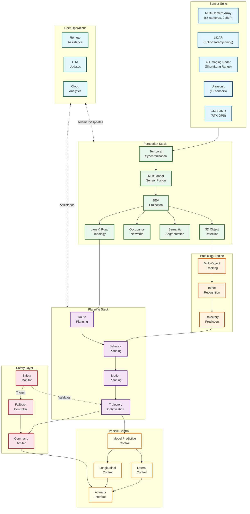

# AI-Native Autonomous Vehicle Platform

## Overview

An **AI-Native Autonomous Vehicle Platform** is a comprehensive software and hardware system that enables vehicles to perceive their environment, predict the behavior of other road users, plan safe trajectories, and execute precise vehicle control—all without human intervention. Modern platforms like Waymo Driver, Tesla FSD, and NVIDIA DRIVE leverage deep learning throughout the stack, replacing hand-coded rules with learned models trained on billions of miles of driving data.

The platform processes multi-modal sensor inputs (cameras, LiDAR, radar, ultrasonic) at rates exceeding 1.5 GB/s, fuses them into a unified world representation, and produces actuator commands within 100ms end-to-end latency. Safety-critical design patterns ensure fail-operational behavior through redundant compute, sensors, and actuators.

---

## Key Characteristics

| Characteristic | Value | System Implication |
|----------------|-------|-------------------|
| **Latency Sensitivity** | Critical (<100ms E2E) | Deterministic real-time execution, hardware timestamps |
| **Safety Criticality** | ASIL-D (highest automotive) | Redundant systems, fail-operational architecture |
| **Compute Requirements** | 200-2000+ TOPS | Specialized automotive SoCs (DRIVE Orin/Thor) |
| **Data Throughput** | ~1.6 GB/s sensor input | High-bandwidth interconnects, on-chip processing |
| **Sensor Modality** | Multi-modal fusion | Camera, LiDAR, radar, ultrasonic, GNSS/IMU |
| **Operational Domain** | ODD-specific (highway, urban, all-weather) | Clearly defined boundaries, graceful degradation |
| **Regulatory Compliance** | ISO 26262, SOTIF, UNECE R157 | Safety case documentation, certification |

---

## Complexity Rating

**`Very High`**

### Justification

1. **Hard Real-Time Constraints**: Perception-to-actuation must complete within 100ms with human lives at stake
2. **Multi-Sensor Fusion**: Temporal synchronization and spatial calibration across 8+ cameras, LiDAR, radar, ultrasonic
3. **Learned Perception Models**: Deep neural networks must be validated for safety certification (ISO/PAS 8800)
4. **Multi-Agent Prediction**: Forecasting trajectories for dozens of dynamic agents with interaction modeling
5. **Motion Planning Under Uncertainty**: Generating collision-free trajectories respecting traffic rules and comfort
6. **Fail-Operational Redundancy**: ASIL-D requires redundant compute, sensors, and actuators with <100ms switchover
7. **Massive Simulation Requirements**: Billions of simulated miles needed for validation (Waymo SimulationCity)
8. **Regulatory Complexity**: Compliance across ISO 26262, ISO 21448 (SOTIF), UNECE R157, regional standards

---

## Platform Comparison (2025-2026)

| Platform | Architecture | Sensors | Compute | Key Differentiator | SAE Level |
|----------|--------------|---------|---------|-------------------|-----------|
| **Waymo Driver** | Modular, multi-sensor | LiDAR + cameras + radar | Custom TPU + CPU | 100M+ miles, SafetyFirst methodology | L4 (robotaxi) |
| **Tesla FSD v12+** | End-to-end neural | Vision-only (8 cameras) | HW3/HW4 (144-720 TOPS) | Occupancy networks, fleet learning | L2+ (supervised) |
| **NVIDIA DRIVE** | Full-stack platform | Multi-modal configurable | Orin (254 TOPS), Thor (2000 TFLOPS) | Alpamayo VLA, Omniverse simulation | L2-L4 (OEM) |
| **Mobileye** | Camera-first, RSS | Cameras + radar (optional LiDAR) | EyeQ6 (34 TOPS) | Responsibility-Sensitive Safety | L2-L4 |
| **Cruise** | Modular with LLMs | LiDAR + cameras + radar | Custom | Urban focus (paused 2024) | L4 |
| **Pony.ai** | Multi-sensor, NVIDIA-based | LiDAR + cameras + radar | 3x OrinX (1016 TOPS) | China + US deployment | L4 |

---

## Key Metrics Summary

| Metric | Target | Critical Threshold | Measurement |
|--------|--------|-------------------|-------------|
| **Perception Latency** | < 50ms | > 100ms | Sensor capture to detection output |
| **End-to-End Latency** | < 100ms | > 150ms | Sensor capture to actuator command |
| **3D Detection mAP** | > 70% | < 60% | nuScenes/Waymo benchmark |
| **Trajectory Prediction ADE** | < 1.5m @3s | > 2.5m | Average Displacement Error |
| **Disengagement Rate** | < 0.1/1000 mi | > 1/1000 mi | Within defined ODD |
| **System Availability** | 99.99% | < 99.9% | Operational uptime |
| **MTBF (Hardware)** | > 10,000 hours | < 5,000 hours | Mean Time Between Failures |
| **False Positive Rate** | < 0.01/100 mi | > 0.1/100 mi | Phantom braking events |

---

## Architecture Overview

---

## Core Capabilities

### 1. Perception Stack
- **3D Object Detection**: Vehicles, pedestrians, cyclists, debris within 200m range
- **Semantic Segmentation**: Road surface, lane markings, drivable area
- **Occupancy Networks**: 3D volumetric representation (Tesla-style)
- **Lane & Road Topology**: Lane graph, traffic signs, signals

### 2. Sensor Fusion
- **BEV Projection**: Lift-splat-shoot for camera to BEV transformation
- **Multi-Modal Fusion**: Camera + LiDAR + radar feature fusion
- **Temporal Fusion**: Recurrent features across frames
- **Calibration Management**: Online extrinsic refinement

### 3. Behavior Prediction
- **Transformer-Based Prediction**: Wayformer-style attention mechanisms
- **Multi-Agent Interaction**: Social attention for coupled predictions
- **Multi-Modal Outputs**: K trajectory hypotheses with confidence scores
- **Intent Recognition**: Turn signals, lane positioning, velocity patterns

### 4. Motion Planning
- **Hybrid Approach**: Classical optimization with learned cost functions
- **Lattice-Based Sampling**: Candidate trajectory generation
- **Diffusion Planners**: DiffusionDrive, PRESTO for learned planning
- **Safety Constraints**: Time-to-collision, safe stopping distance

### 5. Vehicle Control
- **Model Predictive Control**: Receding horizon optimization
- **Lateral Control**: Steering angle commands with stability
- **Longitudinal Control**: Acceleration/braking with comfort constraints
- **Control-by-Imitation**: Learning from human driving data

### 6. Localization
- **HD Map Matching**: Lane-relative positioning
- **Mapless Approaches**: Tesla-style online map generation
- **GNSS/IMU Fusion**: RTK GPS with inertial integration
- **Visual Localization**: Feature-based place recognition

### 7. Simulation & Validation
- **Digital Twin Testing**: NVIDIA Omniverse, Waymo SimulationCity
- **Scenario Generation**: Edge case mining, adversarial scenarios
- **Closed-Loop Simulation**: Full stack testing in virtual environment
- **Hardware-in-Loop**: Real compute with simulated sensors

### 8. Fleet Operations
- **Remote Assistance**: Human operators providing context
- **OTA Updates**: Software deployment without physical access
- **Telemetry Collection**: Continuous performance monitoring
- **Continuous Learning**: Fleet data to model improvement loop

---

## Document Navigation

| Document | Description |
|----------|-------------|
| [01 - Requirements & Estimations](./01-requirements-and-estimations.md) | Functional/non-functional requirements, capacity planning, SLOs |
| [02 - High-Level Design](./02-high-level-design.md) | System architecture, data flows, key decisions |
| [03 - Low-Level Design](./03-low-level-design.md) | Data models, APIs, algorithms (pseudocode) |
| [04 - Deep Dive & Bottlenecks](./04-deep-dive-and-bottlenecks.md) | Critical components, race conditions, bottleneck analysis |
| [05 - Scalability & Reliability](./05-scalability-and-reliability.md) | Scaling strategies, fault tolerance, disaster recovery |
| [06 - Security & Compliance](./06-security-and-compliance.md) | Safety standards, threat model, regulatory compliance |
| [07 - Observability](./07-observability.md) | Metrics, logging, tracing, alerting |
| [08 - Interview Guide](./08-interview-guide.md) | 45-min pacing, trap questions, trade-offs |

---

## Technology Stack Reference

| Layer | Technologies | Notes |
|-------|--------------|-------|
| **Compute** | NVIDIA DRIVE Orin/Thor, Tesla HW3/HW4, Qualcomm Ride | Automotive-grade SoCs |
| **Sensors** | Continental ARS540 (radar), Luminar Iris (LiDAR), Sony IMX sensors | Production-ready |
| **Perception** | BEVFormer, PointPillars, Occupancy Networks | Transformer + CNN hybrid |
| **Prediction** | Wayformer, Motion Transformer, HiVT | Attention-based |
| **Planning** | Lattice planners, DiffusionDrive, PRESTO | Hybrid classical/learned |
| **Control** | MPC, Stanley controller, pure pursuit | Real-time optimization |
| **Simulation** | NVIDIA Omniverse, CARLA, Waymo SimulationCity | High-fidelity digital twin |
| **RTOS** | QNX, AUTOSAR Adaptive, Linux RT | Deterministic execution |

---

## Related System Designs

| Topic | Relevance |
|-------|-----------|
| [2.13 - Edge AI/ML Inference](../2.13-edge-ai-ml-inference/00-index.md) | On-device model deployment |
| [3.14 - Vector Database](../3.14-vector-database/00-index.md) | HD map storage and retrieval |
| [3.17 - AI Agent Orchestration](../3.17-ai-agent-orchestration-platform/00-index.md) | Multi-component coordination |
| [3.22 - AI Guardrails & Safety](../3.22-ai-guardrails-safety-system/00-index.md) | Safety constraint enforcement |
| [3.24 - Multi-Agent Orchestration](../3.24-multi-agent-orchestration-platform/00-index.md) | Multi-vehicle coordination |

---

## Quick Reference Card

### Latency Budget

| Stage | Budget | Cumulative |
|-------|--------|------------|
| Sensor Capture | 0ms | 0ms |
| ISP Processing | 5ms | 5ms |
| Perception Inference | 30ms | 35ms |
| Sensor Fusion | 10ms | 45ms |
| Prediction | 15ms | 60ms |
| Planning | 25ms | 85ms |
| Control | 10ms | 95ms |
| Actuator Command | 5ms | 100ms |

### Safety Standards

| Standard | Scope | Key Requirement |
|----------|-------|-----------------|
| **ISO 26262** | Functional Safety | ASIL-D for collision avoidance |
| **ISO 21448 (SOTIF)** | Intended Functionality | Perception limitation analysis |
| **ISO/PAS 8800** | AI Safety | ML model validation |
| **UNECE R157** | ALKS Regulation | L3 highway automation |
| **UL 4600** | Safety Case | Comprehensive safety argumentation |

### SAE Automation Levels

| Level | Name | Driver Role | Example |
|-------|------|-------------|---------|
| L0 | No Automation | Full control | Manual driving |
| L1 | Driver Assistance | Hands on | Adaptive cruise |
| L2 | Partial Automation | Eyes on | Tesla Autopilot (current) |
| L3 | Conditional Automation | Ready to intervene | Honda Sensing Elite |
| L4 | High Automation | No intervention (in ODD) | Waymo robotaxi |
| L5 | Full Automation | No intervention (anywhere) | Not yet achieved |
