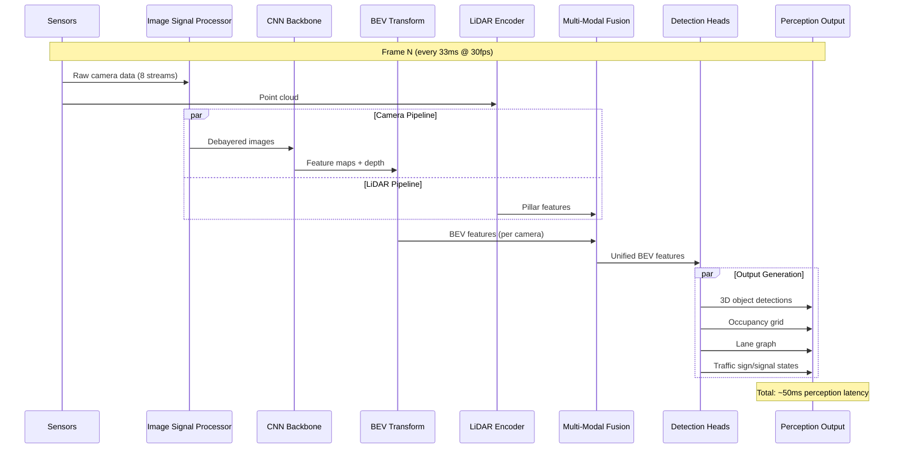
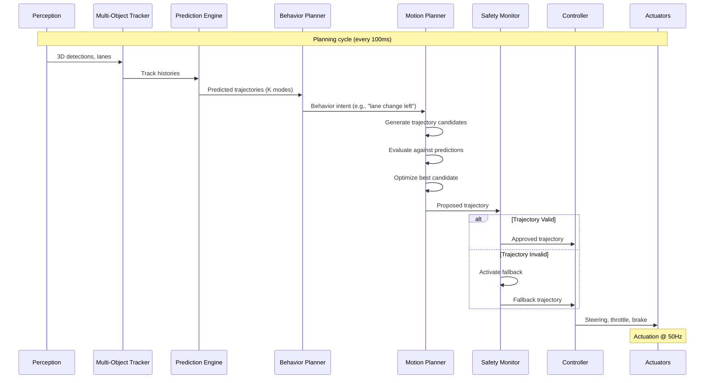
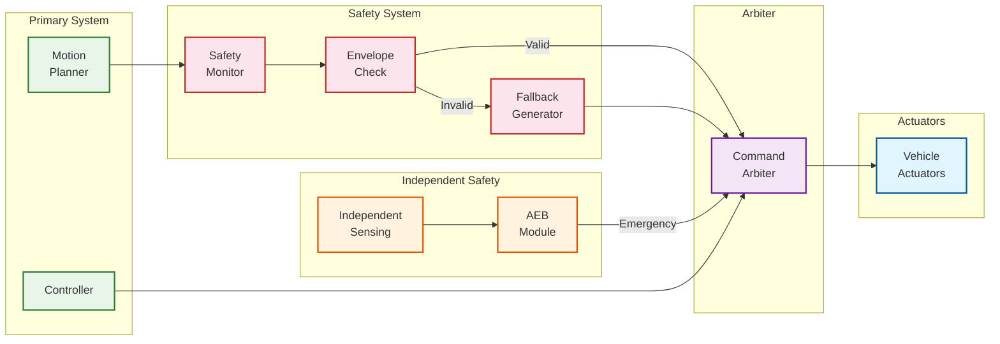
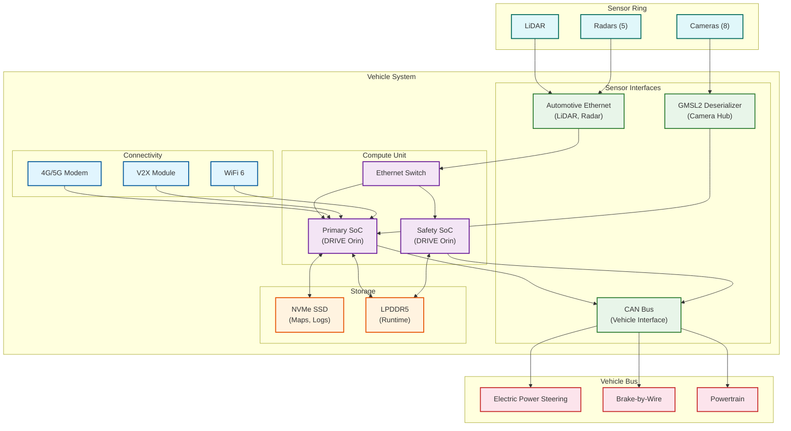
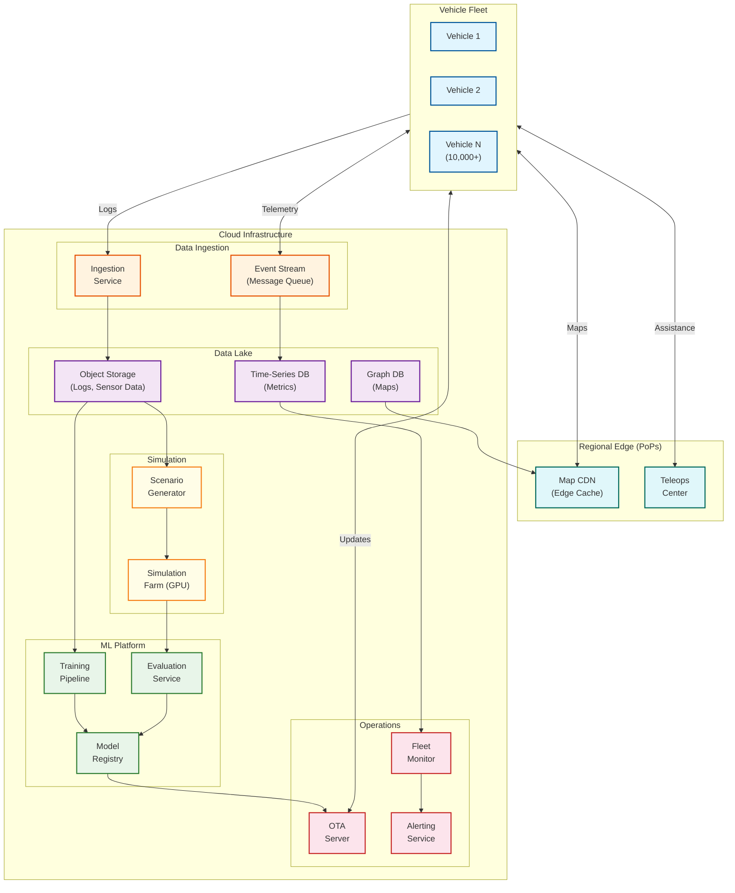

# High-Level Design

## System Architecture

### Complete Architecture Diagram

```mermaid
flowchart TB
    subgraph SensorLayer["Sensor Layer"]
        direction LR
        subgraph Cameras["Camera Array"]
            FC["Front Center<br/>Wide + Telephoto"]
            FL["Front Left"]
            FR["Front Right"]
            SL["Side Left"]
            SR["Side Right"]
            RL["Rear Left"]
            RR["Rear Right"]
            RC["Rear Center"]
        end
        subgraph RangeSensors["Range Sensors"]
            LIDAR["LiDAR<br/>(Solid-State)"]
            RADAR_F["Front Radar<br/>(Long Range)"]
            RADAR_C["Corner Radars<br/>(4x Short Range)"]
            USS["Ultrasonic<br/>(12x)"]
        end
        subgraph Positioning["Positioning"]
            GNSS["GNSS Receiver<br/>(RTK)"]
            IMU["IMU<br/>(6-DOF)"]
            WHEEL["Wheel Odometry"]
        end
    end

    subgraph ProcessingLayer["Sensor Processing Layer"]
        ISP["Image Signal<br/>Processor"]
        PCP["Point Cloud<br/>Preprocessor"]
        RSP["Radar Signal<br/>Processor"]
        SYNC["Time<br/>Synchronization"]
    end

    subgraph PerceptionLayer["Perception Layer"]
        subgraph CameraPerception["Camera Perception"]
            BACKBONE["CNN Backbone<br/>(ResNet/EfficientNet)"]
            DET2D["2D Detection"]
            DEPTH["Depth Estimation"]
            SEG2D["2D Segmentation"]
        end
        subgraph LidarPerception["LiDAR Perception"]
            VOXEL["Voxelization"]
            DET3D_L["3D Detection<br/>(PointPillars)"]
        end
        subgraph Fusion["Sensor Fusion"]
            BEV["BEV Transform<br/>(Lift-Splat)"]
            FUSE["Multi-Modal<br/>Fusion"]
            TEMPORAL["Temporal<br/>Aggregation"]
        end
        subgraph Outputs["Perception Outputs"]
            OBJ3D["3D Objects"]
            OCC["Occupancy Grid"]
            LANES["Lane Graph"]
            SIGNS["Traffic Signs"]
        end
    end

    subgraph PredictionLayer["Prediction Layer"]
        TRACK["Multi-Object<br/>Tracker"]
        ENCODER["Agent<br/>Encoder"]
        MAP_ENC["Map<br/>Encoder"]
        SOCIAL["Social<br/>Attention"]
        TRAJ_DEC["Trajectory<br/>Decoder"]
        INTENT["Intent<br/>Classifier"]
    end

    subgraph PlanningLayer["Planning Layer"]
        subgraph RoutePlanning["Route Planning"]
            ROUTE["Global Route<br/>Planner"]
            MISSION["Mission<br/>Manager"]
        end
        subgraph BehaviorPlanning["Behavior Planning"]
            FSM["Behavior<br/>State Machine"]
            DECISION["Decision<br/>Module"]
        end
        subgraph MotionPlanning["Motion Planning"]
            SAMPLE["Trajectory<br/>Sampling"]
            COST["Cost<br/>Evaluation"]
            OPTIM["Trajectory<br/>Optimization"]
        end
    end

    subgraph ControlLayer["Control Layer"]
        MPC["Model Predictive<br/>Controller"]
        LAT_CTRL["Lateral<br/>Controller"]
        LONG_CTRL["Longitudinal<br/>Controller"]
        ACT_IF["Actuator<br/>Interface"]
    end

    subgraph SafetyLayer["Safety Layer"]
        SAFETY_MON["Safety<br/>Monitor"]
        ENVELOPE["Safety<br/>Envelope"]
        FALLBACK["Fallback<br/>Controller"]
        ARBITER["Command<br/>Arbiter"]
        AEB["Automatic<br/>Emergency Braking"]
    end

    subgraph LocalizationLayer["Localization"]
        LOC_FUSE["Localization<br/>Fusion"]
        HD_MAP["HD Map<br/>Matching"]
        SLAM["Visual<br/>SLAM"]
    end

    subgraph Actuators["Vehicle Actuators"]
        STEER["Steering<br/>System"]
        BRAKE["Brake<br/>System"]
        THROTTLE["Throttle<br/>System"]
        GEAR["Gear<br/>Selector"]
    end

    subgraph FleetOps["Fleet Operations"]
        TELEM["Telemetry<br/>Upload"]
        OTA["OTA Update<br/>Manager"]
        REMOTE["Remote<br/>Assistance"]
        CLOUD["Cloud<br/>Analytics"]
    end

    %% Sensor Flow
    Cameras --> ISP
    LIDAR --> PCP
    RADAR_F & RADAR_C --> RSP
    Positioning --> LOC_FUSE

    %% Processing Flow
    ISP --> BACKBONE
    BACKBONE --> DET2D & DEPTH & SEG2D
    DET2D & DEPTH --> BEV

    PCP --> VOXEL --> DET3D_L
    RSP --> FUSE

    BEV --> FUSE
    DET3D_L --> FUSE
    FUSE --> TEMPORAL
    TEMPORAL --> OBJ3D & OCC & LANES & SIGNS

    %% Prediction Flow
    OBJ3D --> TRACK --> ENCODER
    LANES --> MAP_ENC
    ENCODER --> SOCIAL
    MAP_ENC --> SOCIAL
    SOCIAL --> TRAJ_DEC --> INTENT

    %% Planning Flow
    INTENT --> DECISION
    LANES --> ROUTE --> MISSION --> FSM
    FSM --> DECISION
    DECISION --> SAMPLE --> COST --> OPTIM

    %% Control Flow
    OPTIM --> MPC --> LAT_CTRL & LONG_CTRL
    LAT_CTRL & LONG_CTRL --> ACT_IF

    %% Safety Flow
    OPTIM --> SAFETY_MON
    OBJ3D --> AEB
    SAFETY_MON --> ENVELOPE
    ENVELOPE -->|Valid| ARBITER
    ENVELOPE -->|Invalid| FALLBACK --> ARBITER
    AEB --> ARBITER
    ARBITER --> ACT_IF

    %% Actuator Output
    ACT_IF --> STEER & BRAKE & THROTTLE & GEAR

    %% Localization
    HD_MAP --> LOC_FUSE
    SLAM --> LOC_FUSE
    LOC_FUSE --> ROUTE
    LOC_FUSE --> BEV

    %% Fleet Ops
    OBJ3D & OPTIM -.-> TELEM
    CLOUD -.-> OTA
    REMOTE -.-> DECISION

    classDef sensor fill:#e1f5fe,stroke:#01579b,stroke-width:2px
    classDef process fill:#e3f2fd,stroke:#1565c0,stroke-width:2px
    classDef perception fill:#e8f5e9,stroke:#2e7d32,stroke-width:2px
    classDef prediction fill:#fff3e0,stroke:#e65100,stroke-width:2px
    classDef planning fill:#f3e5f5,stroke:#6a1b9a,stroke-width:2px
    classDef control fill:#fffde7,stroke:#f57f17,stroke-width:2px
    classDef safety fill:#fce4ec,stroke:#c62828,stroke-width:2px
    classDef localization fill:#e0f2f1,stroke:#00695c,stroke-width:2px
    classDef actuator fill:#fafafa,stroke:#616161,stroke-width:2px
    classDef fleet fill:#e0f7fa,stroke:#00695c,stroke-width:2px

    class FC,FL,FR,SL,SR,RL,RR,RC,LIDAR,RADAR_F,RADAR_C,USS,GNSS,IMU,WHEEL sensor
    class ISP,PCP,RSP,SYNC process
    class BACKBONE,DET2D,DEPTH,SEG2D,VOXEL,DET3D_L,BEV,FUSE,TEMPORAL,OBJ3D,OCC,LANES,SIGNS perception
    class TRACK,ENCODER,MAP_ENC,SOCIAL,TRAJ_DEC,INTENT prediction
    class ROUTE,MISSION,FSM,DECISION,SAMPLE,COST,OPTIM planning
    class MPC,LAT_CTRL,LONG_CTRL,ACT_IF control
    class SAFETY_MON,ENVELOPE,FALLBACK,ARBITER,AEB safety
    class LOC_FUSE,HD_MAP,SLAM localization
    class STEER,BRAKE,THROTTLE,GEAR actuator
    class TELEM,OTA,REMOTE,CLOUD fleet
```

---

## Component Overview

### Sensor Layer

| Component | Purpose | Key Specs | Latency Budget |
|-----------|---------|-----------|----------------|
| **Front Cameras (3)** | Forward perception, traffic lights | 8MP, 120° + 35° FOV | 5ms (ISP) |
| **Side Cameras (4)** | Lane change, intersection | 2MP, 90° FOV | 5ms (ISP) |
| **Rear Camera** | Reversing, rear traffic | 2MP, 120° FOV | 5ms (ISP) |
| **LiDAR** | 3D structure, depth ground truth | 128 beams, 200m range | 10ms (preprocessing) |
| **Front Radar** | Long-range velocity | 250m range, 4D imaging | 5ms |
| **Corner Radars (4)** | Cross-traffic, blind spots | 80m range | 5ms |
| **Ultrasonics (12)** | Parking, low-speed proximity | 5m range | 1ms |
| **GNSS/IMU** | Global position, orientation | RTK, 100 Hz | 1ms |

### Perception Layer

| Component | Input | Output | Latency |
|-----------|-------|--------|---------|
| **Image Signal Processor** | Raw camera data | Debayered, HDR images | 5ms |
| **CNN Backbone** | Camera images (8x) | Feature maps | 15ms |
| **Depth Estimation** | Feature maps | Per-pixel depth | 5ms |
| **BEV Transform** | 2D features + depth | BEV feature grid | 5ms |
| **LiDAR Encoder** | Point cloud | Pillar features | 8ms |
| **Multi-Modal Fusion** | BEV + LiDAR + Radar | Unified BEV features | 5ms |
| **Detection Heads** | Fused features | 3D boxes, segmentation | 7ms |
| **Temporal Aggregation** | Current + past features | Stabilized output | 3ms |

### Prediction Layer

| Component | Input | Output | Latency |
|-----------|-------|--------|---------|
| **Multi-Object Tracker** | Detections, tracks | Updated tracks | 3ms |
| **Agent Encoder** | Track history (N frames) | Agent embeddings | 4ms |
| **Map Encoder** | Lane graph, topology | Map embeddings | 3ms |
| **Social Attention** | All agent embeddings | Interaction features | 5ms |
| **Trajectory Decoder** | Agent + map + social | K trajectories per agent | 5ms |

### Planning Layer

| Component | Input | Output | Latency |
|-----------|-------|--------|---------|
| **Route Planner** | Destination, map | Global route | 100ms (async) |
| **Behavior FSM** | Route, traffic state | Behavior intent | 5ms |
| **Decision Module** | Intent, predictions | Maneuver selection | 5ms |
| **Trajectory Sampler** | Maneuver, constraints | Candidate trajectories | 8ms |
| **Cost Evaluator** | Candidates, predictions | Scored trajectories | 5ms |
| **Trajectory Optimizer** | Best candidate | Refined trajectory | 7ms |

### Control Layer

| Component | Input | Output | Latency |
|-----------|-------|--------|---------|
| **MPC Controller** | Reference trajectory | Optimal control sequence | 5ms |
| **Lateral Controller** | Control sequence | Steering commands | 2ms |
| **Longitudinal Controller** | Control sequence | Throttle/brake commands | 2ms |
| **Actuator Interface** | Commands | CAN messages | 1ms |

### Safety Layer

| Component | Purpose | Response Time |
|-----------|---------|---------------|
| **Safety Monitor** | Validate planned trajectory | Continuous |
| **Safety Envelope** | Check kinematic/collision bounds | 2ms |
| **Fallback Controller** | Generate safe trajectory | 10ms |
| **Command Arbiter** | Select valid command source | 1ms |
| **AEB System** | Emergency braking | 50ms (independent) |

---

## Data Flow Diagrams

### Perception Pipeline Sequence

### Planning Data Flow

### Safety Architecture Flow

---

## Key Architectural Decisions

### Decision 1: End-to-End vs. Modular Architecture

| Aspect | End-to-End (Tesla FSD v12) | Modular (Waymo) | Hybrid (Recommended) |
|--------|---------------------------|------------------|---------------------|
| **Description** | Single neural network from pixels to controls | Separate perception, prediction, planning modules | Modular with learned components |
| **Pros** | Holistic optimization, no interface losses, simpler deployment | Interpretable, testable, debuggable | Best of both worlds |
| **Cons** | Black box, hard to validate for safety certification | Interface overhead, suboptimal local decisions | Implementation complexity |
| **Training** | Imitation learning from human driving | Supervised per-module | Mixed approach |
| **Debugging** | Difficult (attention visualization helps) | Straightforward | Moderate |
| **Safety Certification** | Challenging (ISO/PAS 8800 emerging) | Established methods | Balanced |

**Recommendation**: Hybrid architecture with modular perception and planning, but learned cost functions and prediction models. This allows interpretable intermediate representations while leveraging neural networks for complex reasoning.

### Decision 2: Sensor Configuration

| Aspect | Vision-Only (Tesla) | Multi-Sensor (Waymo) | Recommendation |
|--------|---------------------|----------------------|----------------|
| **Cost** | $500-1000 | $5000-15000 | Depends on target market |
| **Redundancy** | Low (single modality) | High (diverse physics) | Multi-sensor for L4 |
| **Night Performance** | Limited (needs IR) | Robust (LiDAR + radar) | Multi-sensor preferred |
| **Weather Performance** | Challenged (rain, fog) | Robust (radar sees through) | Multi-sensor preferred |
| **Depth Accuracy** | ~5% error (learned) | ~2cm (LiDAR direct) | LiDAR for precision |
| **Maintenance** | Low | Higher (calibration) | Consider operational cost |
| **Form Factor** | Minimal | Larger (roof pod typical) | Vehicle integration |

**Recommendation**:
- **L2 ADAS**: Vision-primary with radar backup for AEB
- **L3 Highway**: Vision + radar + optional LiDAR
- **L4 Robotaxi**: Full multi-sensor (cameras + LiDAR + radar) for redundancy and all-condition operation

### Decision 3: Compute Architecture

| Aspect | Single SoC | Dual SoC (Recommended) | Multi-SoC (3+) |
|--------|-----------|------------------------|----------------|
| **Failure Mode** | Single point of failure | Graceful degradation | Full redundancy |
| **Cost** | Lower | Moderate | Higher |
| **Power** | 50-100W | 100-200W | 200-400W |
| **Complexity** | Simple | Moderate | Complex |
| **ASIL Compliance** | ASIL-B max | ASIL-D capable | ASIL-D certified |

**Recommendation**: Dual SoC architecture for L4:
- **Primary SoC**: Full perception + planning pipeline
- **Secondary SoC**: Independent safety monitoring + fallback controller
- **Hot standby**: Secondary can take over within 100ms

### Decision 4: Mapping Strategy

| Aspect | HD Map Dependent | Mapless (Tesla) | Hybrid (Recommended) |
|--------|-----------------|------------------|---------------------|
| **Localization** | Lane-relative, cm accuracy | Online inference, m accuracy | Best available |
| **Scalability** | Requires map maintenance | Unlimited geographic reach | Practical balance |
| **Edge Cases** | Pre-mapped scenarios | Must handle novel roads | Combined strength |
| **Cost** | Map licensing fees | No external dependency | Selective map use |
| **Update Frequency** | Weekly/monthly | Real-time | Crowdsourced updates |

**Recommendation**: Mapless-primary with HD map enhancement:
- Online lane perception as primary source
- HD maps used where available for:
  - Complex interchanges
  - Speed limits
  - Traffic signal locations
- Crowdsourced updates from fleet

### Decision 5: Planning Approach

| Aspect | Classical (Optimization) | Learned (Neural) | Hybrid (Recommended) |
|--------|--------------------------|------------------|---------------------|
| **Interpretability** | High (explicit cost function) | Low (learned weights) | Moderate |
| **Validation** | Formal methods possible | Statistical validation | Mixed approach |
| **Performance** | Good in structured scenarios | Better in complex interactions | Combined strength |
| **Adaptability** | Manual tuning | Data-driven improvement | Learned costs, explicit constraints |

**Recommendation**: Hybrid planning:
- **Trajectory generation**: Classical lattice/polynomial sampling
- **Cost function**: Learned from human driving data
- **Collision checking**: Explicit geometric constraints
- **Optimization**: MPC with learned terminal costs

---

## Technology Choices

### Compute Platform

| Component | Primary | Alternative | Selection Criteria |
|-----------|---------|-------------|-------------------|
| **Primary SoC** | NVIDIA DRIVE Orin (254 TOPS) | Qualcomm Snapdragon Ride | Ecosystem, TOPS, power |
| **Safety SoC** | NVIDIA DRIVE Orin (lower power mode) | TI TDA4 | ASIL-D certification |
| **Future** | NVIDIA DRIVE Thor (2000 TFLOPS) | - | Unified compute |

### Sensors

| Sensor Type | Primary Choice | Alternative | Selection Criteria |
|-------------|---------------|-------------|-------------------|
| **Cameras** | Sony IMX490 (8MP HDR) | OnSemi AR0820 | Dynamic range, resolution |
| **LiDAR** | Luminar Iris (solid-state) | Hesai AT128 | Range, reliability, cost |
| **Radar (front)** | Continental ARS540 (4D) | Aptiv | Angular resolution |
| **Radar (corner)** | Continental SRR520 | Bosch | Coverage, cost |
| **GNSS** | u-blox F9P (RTK) | Trimble | RTK accuracy, cost |
| **IMU** | Bosch SMI230 | Analog Devices | Automotive grade |

### Software Stack

| Layer | Technology | Alternatives |
|-------|------------|--------------|
| **RTOS** | QNX Neutrino | AUTOSAR Adaptive, Linux RT |
| **Middleware** | NVIDIA DriveWorks, ROS 2 | Apex.AI, custom |
| **Deep Learning** | TensorRT (inference) | TVM, ONNX Runtime |
| **Training** | PyTorch | TensorFlow |
| **Simulation** | NVIDIA Omniverse, CARLA | Waymo SimulationCity |

---

## Deployment Architecture

### In-Vehicle Deployment

### Fleet Infrastructure

---

## Architecture Checklist

| Decision | Choice | Justification |
|----------|--------|---------------|
| ✅ Sync vs Async | Sync for safety-critical, async for fleet ops | Real-time constraints |
| ✅ Event-driven vs Request-response | Request-response for in-vehicle, event-driven for cloud | Latency requirements |
| ✅ Push vs Pull | Push for telemetry, pull for maps/OTA | Bandwidth optimization |
| ✅ Stateless vs Stateful | Stateful (tracking state, temporal fusion) | Temporal reasoning required |
| ✅ Read-heavy vs Write-heavy | Balanced (continuous sensing and planning) | Streaming workload |
| ✅ Real-time vs Batch | Real-time in-vehicle, batch for training | Operational vs learning |
| ✅ Edge vs Origin | Edge (all processing in-vehicle) | Latency, connectivity |
