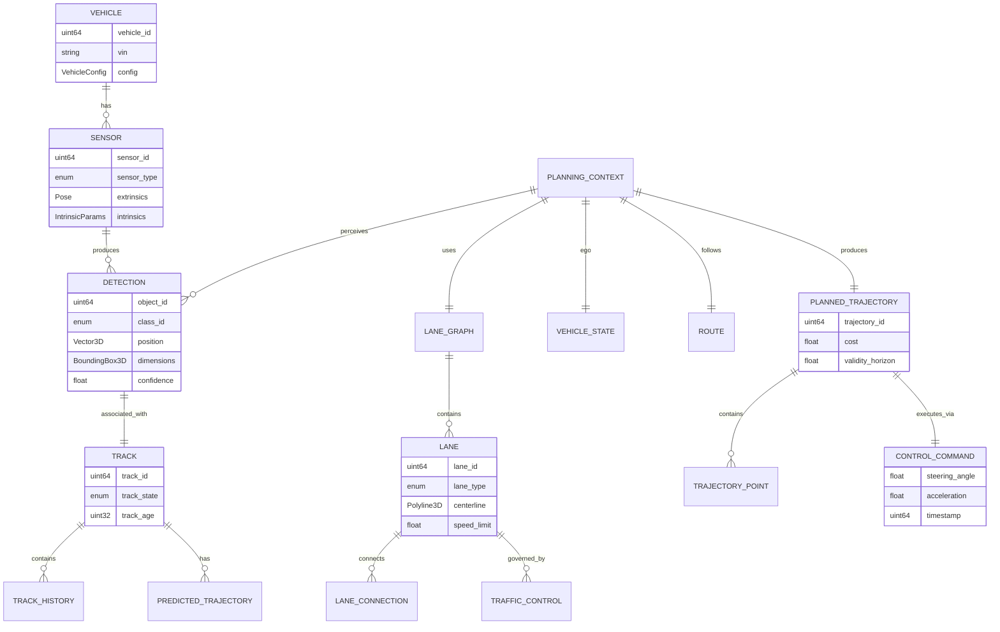
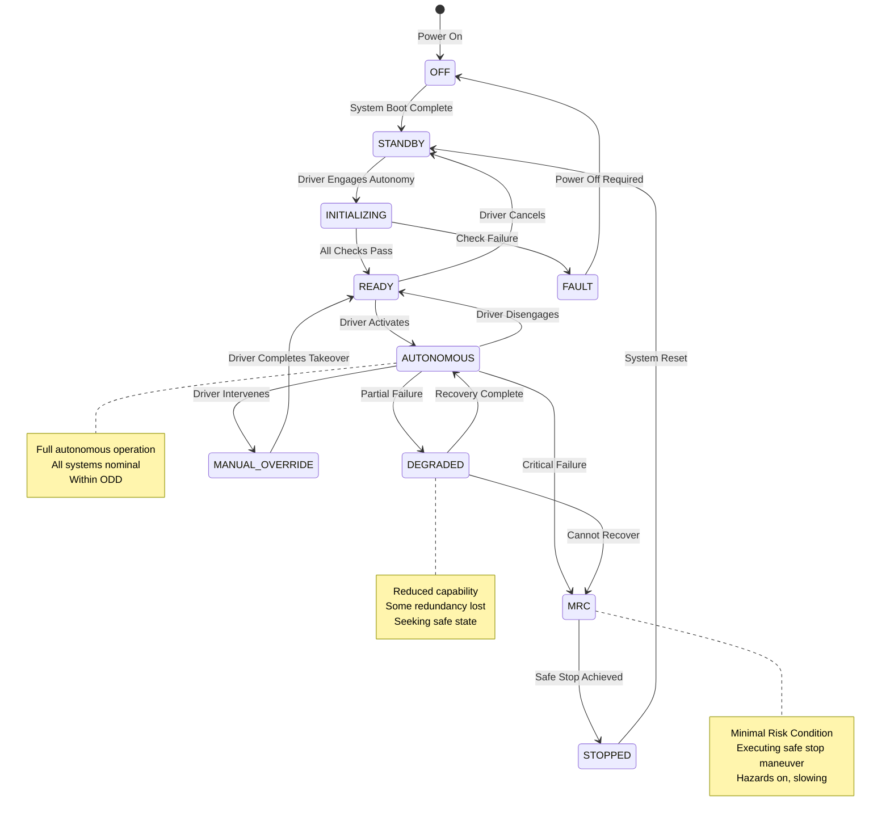
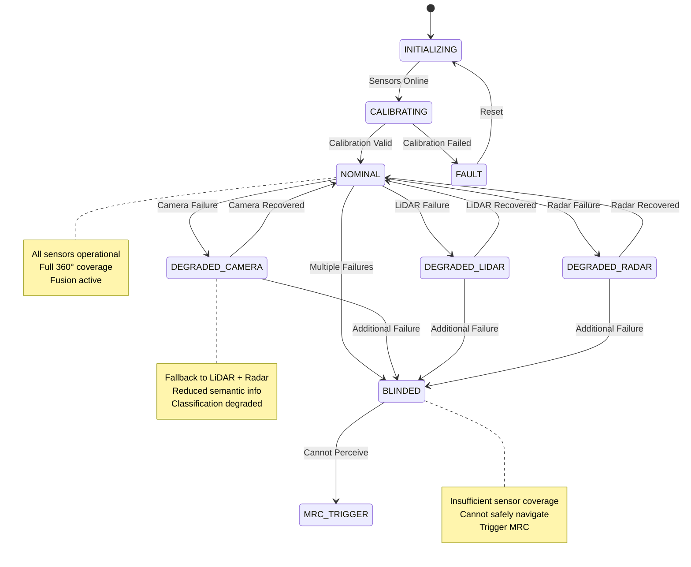

# Low-Level Design

## Data Models

### Core Perception Data Structures

```yaml
# 3D Detected Object
DetectedObject:
  object_id: uint64                    # Unique identifier for tracking
  class_id: enum                       # VEHICLE, PEDESTRIAN, CYCLIST, TRUCK, BUS, MOTORCYCLE, ANIMAL, DEBRIS, UNKNOWN
  subclass: enum                       # CAR, SUV, SEDAN, etc. (vehicle subtypes)

  # Spatial properties
  position: Vector3D                   # Center position in ego frame (x, y, z meters)
  dimensions: BoundingBox3D            # Length, width, height (meters)
  orientation: Quaternion              # Rotation in ego frame
  heading: float                       # Yaw angle (radians)

  # Dynamic properties
  velocity: Vector3D                   # Linear velocity (m/s)
  acceleration: Vector3D               # Linear acceleration (m/s²)
  angular_velocity: float              # Yaw rate (rad/s)

  # Confidence and metadata
  confidence: float                    # [0, 1] detection confidence
  existence_probability: float         # [0, 1] probability object exists
  occlusion_state: enum                # NOT_OCCLUDED, PARTIALLY_OCCLUDED, MOSTLY_OCCLUDED
  sensor_sources: list[SensorID]       # Contributing sensors

  # Tracking info
  track_id: uint64                     # Persistent track identifier
  track_age: uint32                    # Frames since track started
  track_state: enum                    # TENTATIVE, CONFIRMED, LOST

  # Timestamps
  timestamp: uint64                    # Nanoseconds since epoch
  sensor_timestamp: uint64             # Original sensor capture time


# 3D Bounding Box
BoundingBox3D:
  length: float                        # X dimension (meters)
  width: float                         # Y dimension (meters)
  height: float                        # Z dimension (meters)
  anchor_point: enum                   # CENTER, BOTTOM_CENTER, REAR_AXLE


# Occupancy Grid (Tesla-style)
OccupancyGrid:
  grid_config:
    resolution: float                  # Meters per cell (e.g., 0.2m)
    x_size: int                        # Grid size in X (e.g., 200 = 40m)
    y_size: int                        # Grid size in Y (e.g., 200 = 40m)
    z_size: int                        # Grid size in Z (e.g., 16 = 3.2m)
    origin: Pose                       # Grid origin in ego frame

  cells: Array3D[OccupancyCell]        # Voxel grid
  timestamp: uint64


OccupancyCell:
  occupancy_probability: float         # [0, 1] probability cell is occupied
  semantic_class: enum                 # EMPTY, GROUND, VEHICLE, PEDESTRIAN, BUILDING, VEGETATION, etc.
  velocity: Vector3D                   # Optional: estimated cell velocity
  confidence: float


# Lane Graph
LaneGraph:
  lanes: list[Lane]
  lane_connections: list[LaneConnection]
  traffic_controls: list[TrafficControl]
  road_boundaries: list[RoadBoundary]
  timestamp: uint64


Lane:
  lane_id: uint64
  lane_type: enum                      # DRIVING, PARKING, SHOULDER, BIKE, TURN, BUS

  # Geometry
  centerline: Polyline3D               # Ordered waypoints
  left_boundary: Polyline3D
  right_boundary: Polyline3D
  width: float                         # Average width (meters)

  # Properties
  speed_limit: float                   # m/s, 0 if unknown
  direction: enum                      # FORWARD, BACKWARD, BIDIRECTIONAL
  curvature: list[float]               # Per-waypoint curvature

  # Relationships
  left_neighbor: uint64                # Adjacent lane ID (0 if none)
  right_neighbor: uint64
  predecessors: list[uint64]           # Upstream lanes
  successors: list[uint64]             # Downstream lanes


LaneConnection:
  from_lane: uint64
  to_lane: uint64
  connection_type: enum                # MERGE, SPLIT, TURN_LEFT, TURN_RIGHT, U_TURN, STRAIGHT


TrafficControl:
  control_id: uint64
  control_type: enum                   # STOP_SIGN, YIELD_SIGN, TRAFFIC_LIGHT, SPEED_LIMIT
  position: Vector3D
  associated_lanes: list[uint64]
  current_state: enum                  # GREEN, YELLOW, RED, UNKNOWN (for signals)
  confidence: float
```

### Prediction Data Structures

```yaml
# Agent Track History
TrackHistory:
  agent_id: uint64
  track_id: uint64
  object_class: enum

  # Historical states (last N frames, e.g., 2 seconds @ 10Hz = 20 frames)
  states: list[AgentState]

  # Current state (most recent)
  current_state: AgentState


AgentState:
  timestamp: uint64
  position: Vector2D                   # x, y in world frame
  velocity: Vector2D                   # vx, vy
  acceleration: Vector2D               # ax, ay
  heading: float                       # radians
  yaw_rate: float                      # rad/s
  length: float
  width: float


# Predicted Trajectories
PredictedTrajectories:
  agent_id: uint64
  predictions: list[TrajectoryMode]
  timestamp: uint64


TrajectoryMode:
  mode_id: int                         # 0 to K-1
  probability: float                   # Mode probability, sum = 1
  trajectory: list[TrajectoryPoint]    # Future waypoints
  intent: enum                         # KEEP_LANE, LANE_CHANGE_LEFT, LANE_CHANGE_RIGHT, TURN, STOP


TrajectoryPoint:
  timestamp_offset: float              # Seconds from prediction time
  position: Vector2D                   # x, y in world frame
  velocity: Vector2D                   # vx, vy
  heading: float
  covariance: Matrix2x2                # Position uncertainty
```

### Planning Data Structures

```yaml
# Planning Context (input to planner)
PlanningContext:
  ego_state: VehicleState
  detected_objects: list[DetectedObject]
  predicted_trajectories: dict[uint64, PredictedTrajectories]
  lane_graph: LaneGraph
  route: Route
  localization: LocalizationResult
  traffic_state: TrafficState
  timestamp: uint64


VehicleState:
  position: Vector3D                   # World frame
  velocity: Vector3D                   # World frame
  acceleration: Vector3D
  orientation: Quaternion
  heading: float
  steering_angle: float
  yaw_rate: float
  gear: enum                           # PARK, REVERSE, NEUTRAL, DRIVE


Route:
  waypoints: list[RouteWaypoint]
  total_distance: float
  estimated_time: float
  current_segment: int


RouteWaypoint:
  position: Vector2D
  lane_id: uint64
  speed_limit: float
  maneuver: enum                       # STRAIGHT, TURN_LEFT, TURN_RIGHT, MERGE, EXIT


# Planned Trajectory (output from planner)
PlannedTrajectory:
  trajectory_id: uint64
  points: list[TrajectoryPoint]
  cost: float
  validity_horizon: float              # Seconds trajectory is valid
  constraints_satisfied: bool
  timestamp: uint64


TrajectoryPoint:
  time_offset: float                   # Seconds from trajectory start
  position: Vector2D
  heading: float
  velocity: float                      # Scalar speed
  acceleration: float                  # Scalar acceleration
  curvature: float
  jerk: float                          # For comfort evaluation


# Control Command
ControlCommand:
  steering_angle: float                # Radians
  steering_rate: float                 # Rad/s (for rate limiting)
  acceleration: float                  # m/s² (positive = accelerate, negative = brake)
  target_velocity: float               # m/s
  gear_request: enum
  timestamp: uint64
```

### Entity-Relationship Diagram



---

## Core Algorithms

### Algorithm 1: BEV Sensor Fusion

```
ALGORITHM BEVSensorFusion(camera_images, lidar_points, radar_detections, calibration):
    """
    Fuse multi-modal sensor data into unified Bird's Eye View representation.
    Combines camera lift-splat-shoot with LiDAR PointPillars and radar features.

    Time Complexity: O(H*W*D + N_lidar + N_radar) per frame
    Space Complexity: O(BEV_X * BEV_Y * C) for feature grid
    """

    INPUT:
        camera_images: list[Tensor]          # [N_cameras, H, W, 3]
        lidar_points: PointCloud             # [N_points, 4] (x, y, z, intensity)
        radar_detections: list[RadarPoint]   # [N_radar, 6] (x, y, z, vx, vy, rcs)
        calibration: CalibrationData         # Extrinsics and intrinsics

    OUTPUT:
        bev_features: Tensor                 # [BEV_X, BEV_Y, C_fused]
        detections: list[DetectedObject]
        occupancy: OccupancyGrid

    CONSTANTS:
        BEV_RESOLUTION = 0.2                 # meters per cell
        BEV_X_RANGE = [-50, 50]              # meters
        BEV_Y_RANGE = [-50, 50]              # meters
        BEV_Z_RANGE = [-3, 5]                # meters
        DEPTH_BINS = 80                      # Discretized depth levels

    BEGIN:
        // ============================================
        // STEP 1: Camera Feature Extraction
        // ============================================

        camera_features = []
        FOR each camera_idx, image IN enumerate(camera_images):
            // Extract multi-scale features with shared backbone
            features = CNNBackbone(image)    # e.g., EfficientNet, ResNet
            camera_features.append(features)

        // ============================================
        // STEP 2: Depth Prediction (per camera)
        // ============================================

        depth_distributions = []
        FOR each camera_idx, features IN enumerate(camera_features):
            // Predict categorical depth distribution per pixel
            // Output: [H/8, W/8, DEPTH_BINS]
            depth_dist = DepthNet(features)
            depth_dist = softmax(depth_dist, dim=-1)
            depth_distributions.append(depth_dist)

        // ============================================
        // STEP 3: Lift to 3D Frustum (Lift-Splat-Shoot)
        // ============================================

        ego_features_list = []
        FOR each camera_idx IN range(N_cameras):
            features = camera_features[camera_idx]
            depth_dist = depth_distributions[camera_idx]

            // Create depth bins (e.g., 1m to 60m in 80 bins)
            depth_bins = linspace(1.0, 60.0, DEPTH_BINS)

            // Outer product: [H, W, C] x [H, W, D] -> [H, W, D, C]
            frustum_features = outer_product(features, depth_dist)

            // Unproject pixels to 3D using camera intrinsics
            // For each pixel (u, v) and depth d:
            //   X = (u - cx) * d / fx
            //   Y = (v - cy) * d / fy
            //   Z = d
            pixel_coords = create_pixel_grid(H, W)
            cam_coords = unproject_to_camera_frame(pixel_coords, depth_bins, calibration.intrinsics[camera_idx])

            // Transform to ego vehicle frame
            T_ego_cam = calibration.extrinsics[camera_idx]
            ego_coords = transform_points(cam_coords, T_ego_cam)

            // Associate features with 3D coordinates
            ego_features_list.append((ego_coords, frustum_features))

        // ============================================
        // STEP 4: Splat onto BEV Grid
        // ============================================

        // Initialize BEV grid
        bev_grid_size = (
            int((BEV_X_RANGE[1] - BEV_X_RANGE[0]) / BEV_RESOLUTION),
            int((BEV_Y_RANGE[1] - BEV_Y_RANGE[0]) / BEV_RESOLUTION)
        )
        camera_bev = zeros([bev_grid_size[0], bev_grid_size[1], C_camera])

        FOR each (ego_coords, frustum_features) IN ego_features_list:
            // Voxelize and pool features
            FOR each point_idx IN range(len(ego_coords)):
                x, y, z = ego_coords[point_idx]

                // Check bounds
                IF x < BEV_X_RANGE[0] OR x > BEV_X_RANGE[1]:
                    CONTINUE
                IF y < BEV_Y_RANGE[0] OR y > BEV_Y_RANGE[1]:
                    CONTINUE

                // Compute BEV cell indices
                bev_x = int((x - BEV_X_RANGE[0]) / BEV_RESOLUTION)
                bev_y = int((y - BEV_Y_RANGE[0]) / BEV_RESOLUTION)

                // Accumulate features (pillar pooling)
                camera_bev[bev_x, bev_y] += frustum_features[point_idx]

        // ============================================
        // STEP 5: LiDAR to BEV (PointPillars)
        // ============================================

        // Create pillars from point cloud
        pillars, pillar_indices = create_pillars(
            lidar_points,
            max_points_per_pillar=32,
            max_pillars=12000,
            x_range=BEV_X_RANGE,
            y_range=BEV_Y_RANGE
        )

        // Encode pillar features
        // Input: [N_pillars, max_points, 9] (x, y, z, intensity, xc, yc, zc, xp, yp)
        // Output: [N_pillars, C_pillar]
        pillar_features = PillarFeatureNet(pillars)

        // Scatter to BEV grid
        lidar_bev = zeros([bev_grid_size[0], bev_grid_size[1], C_lidar])
        FOR each pillar_idx, (bev_x, bev_y) IN enumerate(pillar_indices):
            lidar_bev[bev_x, bev_y] = pillar_features[pillar_idx]

        // ============================================
        // STEP 6: Radar to BEV
        // ============================================

        radar_bev = zeros([bev_grid_size[0], bev_grid_size[1], C_radar])
        FOR each radar_point IN radar_detections:
            x, y, z, vx, vy, rcs = radar_point

            bev_x = int((x - BEV_X_RANGE[0]) / BEV_RESOLUTION)
            bev_y = int((y - BEV_Y_RANGE[0]) / BEV_RESOLUTION)

            IF 0 <= bev_x < bev_grid_size[0] AND 0 <= bev_y < bev_grid_size[1]:
                // Encode radar features (velocity is key!)
                radar_features = [vx, vy, rcs, 1.0]  # Include occupancy flag
                radar_bev[bev_x, bev_y] = max(radar_bev[bev_x, bev_y], radar_features)

        // ============================================
        // STEP 7: Multi-Modal Fusion
        // ============================================

        // Concatenate all modalities
        // Camera: rich semantic features
        // LiDAR: precise geometry
        // Radar: velocity information
        concatenated = concat([camera_bev, lidar_bev, radar_bev], dim=-1)

        // Fusion network (convolutions + attention)
        bev_features = FusionConvNet(concatenated)

        // ============================================
        // STEP 8: Detection Heads
        // ============================================

        // Object detection head
        detection_heatmap = DetectionHead(bev_features)
        detections = decode_detections(detection_heatmap)

        // Occupancy head
        occupancy_logits = OccupancyHead(bev_features)
        occupancy = decode_occupancy(occupancy_logits)

        RETURN bev_features, detections, occupancy
    END


FUNCTION create_pillars(points, max_points_per_pillar, max_pillars, x_range, y_range):
    """
    Group LiDAR points into vertical pillars for efficient processing.
    """
    pillar_size = 0.2  # meters

    pillars = []
    pillar_indices = []
    pillar_map = {}  # (bev_x, bev_y) -> pillar_idx

    FOR each point IN points:
        x, y, z, intensity = point

        // Compute pillar index
        bev_x = int((x - x_range[0]) / pillar_size)
        bev_y = int((y - y_range[0]) / pillar_size)
        key = (bev_x, bev_y)

        IF key NOT IN pillar_map:
            IF len(pillars) >= max_pillars:
                CONTINUE
            pillar_map[key] = len(pillars)
            pillars.append([])
            pillar_indices.append((bev_x, bev_y))

        pillar_idx = pillar_map[key]
        IF len(pillars[pillar_idx]) < max_points_per_pillar:
            // Augment point with centroid offsets
            pillar_center_x = bev_x * pillar_size + x_range[0]
            pillar_center_y = bev_y * pillar_size + y_range[0]
            augmented = [x, y, z, intensity,
                        x - pillar_center_x, y - pillar_center_y, z,
                        x - mean_x, y - mean_y]  # Computed after
            pillars[pillar_idx].append(augmented)

    RETURN pad_pillars(pillars, max_points_per_pillar), pillar_indices
```

### Algorithm 2: Transformer Trajectory Prediction (Wayformer-style)

```
ALGORITHM TrajectoryPrediction(agent_histories, lane_graph, ego_state):
    """
    Predict future trajectories for all agents using attention-based architecture.
    Based on Wayformer: attention for scene encoding, cross-attention for decoding.

    Time Complexity: O(N_agents² * T + N_agents * N_lanes) for attention
    Space Complexity: O(N_agents * d_model) for embeddings
    """

    INPUT:
        agent_histories: dict[uint64, TrackHistory]  # Past states per agent
        lane_graph: LaneGraph                         # Road topology
        ego_state: VehicleState                       # Ego vehicle state

    OUTPUT:
        predictions: dict[uint64, PredictedTrajectories]  # K trajectories per agent

    CONSTANTS:
        HISTORY_LENGTH = 20                # 2 seconds at 10Hz
        PREDICTION_HORIZON = 80            # 8 seconds at 10Hz
        K_MODES = 6                         # Number of trajectory hypotheses
        D_MODEL = 256                       # Embedding dimension
        N_HEADS = 8                         # Attention heads
        N_LAYERS = 4                        # Transformer layers

    BEGIN:
        // ============================================
        // STEP 1: Encode Agent Histories
        // ============================================

        agent_embeddings = {}
        agent_ids = list(agent_histories.keys())

        FOR each agent_id IN agent_ids:
            history = agent_histories[agent_id]

            // Extract state sequence [T, state_dim]
            // state = [x, y, vx, vy, ax, ay, heading, yaw_rate, length, width]
            state_sequence = []
            FOR each state IN history.states[-HISTORY_LENGTH:]:
                state_vec = [
                    state.position.x, state.position.y,
                    state.velocity.x, state.velocity.y,
                    state.acceleration.x, state.acceleration.y,
                    cos(state.heading), sin(state.heading),
                    state.yaw_rate,
                    state.length, state.width
                ]
                state_sequence.append(state_vec)

            // Pad if history shorter than expected
            WHILE len(state_sequence) < HISTORY_LENGTH:
                state_sequence.insert(0, zeros(11))

            // Temporal encoding with positional embeddings
            state_tensor = Tensor(state_sequence)  # [T, 11]
            pos_encoding = get_positional_encoding(HISTORY_LENGTH, D_MODEL)

            // Project to embedding space
            agent_embed = AgentMLP(state_tensor)  # [T, D_MODEL]
            agent_embed = agent_embed + pos_encoding

            // Self-attention over time
            agent_embed = TemporalTransformer(agent_embed)  # [T, D_MODEL]

            // Pool to single embedding (mean or last)
            agent_embeddings[agent_id] = mean(agent_embed, dim=0)  # [D_MODEL]

        // ============================================
        // STEP 2: Encode Lane Graph
        // ============================================

        lane_embeddings = []
        lane_positions = []

        FOR each lane IN lane_graph.lanes:
            // Sample waypoints along centerline
            waypoints = sample_polyline(lane.centerline, num_points=20)

            // Lane features
            lane_features = []
            FOR each wp IN waypoints:
                feat = [
                    wp.x, wp.y, wp.z,
                    lane.speed_limit / 30.0,  # Normalized
                    encode_lane_type(lane.lane_type),  # One-hot
                    lane.curvature[idx] if idx < len(lane.curvature) else 0
                ]
                lane_features.append(feat)

            lane_tensor = Tensor(lane_features)  # [20, feat_dim]
            lane_embed = LaneMLP(lane_tensor)    # [20, D_MODEL]
            lane_embed = LaneTransformer(lane_embed)

            lane_embeddings.append(mean(lane_embed, dim=0))  # [D_MODEL]
            lane_positions.append(mean(waypoints))

        lane_embeddings = stack(lane_embeddings)  # [N_lanes, D_MODEL]

        // ============================================
        // STEP 3: Cross-Attention: Agents <-> Lanes
        // ============================================

        agent_embed_tensor = stack([agent_embeddings[aid] for aid in agent_ids])  # [N_agents, D_MODEL]

        // Agents attend to nearby lanes
        FOR layer IN range(N_LAYERS // 2):
            agent_embed_tensor = CrossAttention(
                query=agent_embed_tensor,
                key=lane_embeddings,
                value=lane_embeddings,
                mask=compute_distance_mask(agent_ids, lane_positions, threshold=50.0)
            )

        // Update agent embeddings
        FOR i, agent_id IN enumerate(agent_ids):
            agent_embeddings[agent_id] = agent_embed_tensor[i]

        // ============================================
        // STEP 4: Social Attention (Agent-to-Agent)
        // ============================================

        // Compute pairwise distances for attention masking
        positions = [agent_histories[aid].current_state.position for aid in agent_ids]
        distance_matrix = compute_pairwise_distances(positions)
        social_mask = distance_matrix < 30.0  # Attend to agents within 30m

        FOR layer IN range(N_LAYERS // 2):
            agent_embed_tensor = SocialAttention(
                query=agent_embed_tensor,
                key=agent_embed_tensor,
                value=agent_embed_tensor,
                mask=social_mask
            )

        // ============================================
        // STEP 5: Decode Multi-Modal Trajectories
        // ============================================

        predictions = {}

        FOR i, agent_id IN enumerate(agent_ids):
            agent_embed = agent_embed_tensor[i]  # [D_MODEL]

            trajectory_modes = []

            FOR mode_idx IN range(K_MODES):
                // Learnable mode query
                mode_query = ModeEmbedding(mode_idx)  # [D_MODEL]

                // Combine agent embedding with mode
                decoder_input = agent_embed + mode_query

                // Autoregressive decoding
                trajectory = []
                hidden = decoder_input

                FOR t IN range(PREDICTION_HORIZON):
                    // Predict next state delta
                    delta = TrajectoryMLP(hidden)  # [5]: dx, dy, dvx, dvy, dheading

                    IF t == 0:
                        current = agent_histories[agent_id].current_state
                        pred_x = current.position.x + delta[0]
                        pred_y = current.position.y + delta[1]
                    ELSE:
                        pred_x = trajectory[-1].position.x + delta[0]
                        pred_y = trajectory[-1].position.y + delta[1]

                    trajectory.append(TrajectoryPoint(
                        timestamp_offset=t * 0.1,  # 10Hz
                        position=Vector2D(pred_x, pred_y),
                        velocity=Vector2D(delta[2], delta[3]),
                        heading=delta[4],
                        covariance=predict_covariance(hidden)
                    ))

                    // Update hidden state with GRU
                    hidden = GRUCell(hidden, concat([delta, mode_query]))

                // Predict mode probability
                mode_prob = ModeClassifier(agent_embed, mode_query)

                // Infer intent from trajectory
                intent = classify_intent(trajectory, lane_graph)

                trajectory_modes.append(TrajectoryMode(
                    mode_id=mode_idx,
                    probability=mode_prob,
                    trajectory=trajectory,
                    intent=intent
                ))

            // Normalize probabilities
            total_prob = sum([m.probability for m in trajectory_modes])
            FOR m IN trajectory_modes:
                m.probability /= total_prob

            predictions[agent_id] = PredictedTrajectories(
                agent_id=agent_id,
                predictions=trajectory_modes,
                timestamp=now()
            )

        RETURN predictions
    END


FUNCTION classify_intent(trajectory, lane_graph):
    """
    Classify trajectory intent based on relationship to lanes.
    """
    start_pos = trajectory[0].position
    end_pos = trajectory[-1].position

    // Find closest lanes at start and end
    start_lane = find_closest_lane(start_pos, lane_graph)
    end_lane = find_closest_lane(end_pos, lane_graph)

    IF start_lane == end_lane:
        RETURN KEEP_LANE

    lateral_displacement = compute_lateral_offset(start_pos, end_pos, start_lane)

    IF lateral_displacement > 1.5:
        RETURN LANE_CHANGE_LEFT
    ELSE IF lateral_displacement < -1.5:
        RETURN LANE_CHANGE_RIGHT
    ELSE IF is_turn(start_lane, end_lane, lane_graph):
        RETURN TURN
    ELSE:
        RETURN KEEP_LANE
```

### Algorithm 3: Motion Planning with Safety Constraints

```
ALGORITHM SafeMotionPlanning(planning_context, safety_config):
    """
    Generate collision-free, comfortable trajectory using lattice sampling
    and cost optimization with explicit safety constraints.

    Time Complexity: O(N_candidates * N_agents * T) for collision checking
    Space Complexity: O(N_candidates * T) for trajectory storage
    """

    INPUT:
        planning_context: PlanningContext
        safety_config: SafetyConfig

    OUTPUT:
        optimal_trajectory: PlannedTrajectory
        planning_status: enum  # SUCCESS, FALLBACK, EMERGENCY_STOP

    CONSTANTS:
        PLANNING_HORIZON = 5.0             # seconds
        TRAJECTORY_DT = 0.1                # 10Hz waypoints
        N_LATERAL_SAMPLES = 7              # -3m to +3m
        N_LONGITUDINAL_PROFILES = 5        # Different speed profiles
        MIN_TTC = 2.0                       # Minimum time-to-collision
        MAX_DECEL = -4.0                    # m/s² (comfort limit)
        EMERGENCY_DECEL = -8.0             # m/s² (hard braking)

    BEGIN:
        ego_state = planning_context.ego_state
        predictions = planning_context.predicted_trajectories
        lane_graph = planning_context.lane_graph
        route = planning_context.route

        // ============================================
        // STEP 1: Generate Reference Path from Route
        // ============================================

        reference_path = generate_reference_path(
            ego_state.position,
            route,
            lane_graph,
            horizon=PLANNING_HORIZON + 20  # Extra for lookahead
        )

        // ============================================
        // STEP 2: Generate Lateral Offset Samples
        // ============================================

        lateral_offsets = linspace(-3.0, 3.0, N_LATERAL_SAMPLES)  # meters

        // Filter offsets that violate lane boundaries
        valid_offsets = []
        FOR offset IN lateral_offsets:
            IF is_within_drivable_area(reference_path, offset, lane_graph):
                valid_offsets.append(offset)

        // ============================================
        // STEP 3: Generate Longitudinal Profiles
        // ============================================

        current_speed = norm(ego_state.velocity)
        target_speed = get_speed_limit(ego_state.position, lane_graph)

        speed_profiles = []

        // Profile 1: Maintain current speed
        speed_profiles.append(ConstantSpeedProfile(current_speed))

        // Profile 2: Accelerate to target
        IF current_speed < target_speed:
            speed_profiles.append(AccelerateProfile(current_speed, target_speed, accel=1.5))

        // Profile 3: Decelerate (e.g., approaching stop)
        speed_profiles.append(DecelerateProfile(current_speed, 0, decel=-2.0))

        // Profile 4: Follow lead vehicle
        lead_vehicle = find_lead_vehicle(ego_state, predictions)
        IF lead_vehicle IS NOT None:
            speed_profiles.append(FollowProfile(current_speed, lead_vehicle))

        // Profile 5: Emergency preparedness (slower)
        speed_profiles.append(ConstantSpeedProfile(current_speed * 0.8))

        // ============================================
        // STEP 4: Generate Candidate Trajectories
        // ============================================

        candidates = []

        FOR offset IN valid_offsets:
            FOR speed_profile IN speed_profiles:
                trajectory = generate_trajectory(
                    ego_state,
                    reference_path,
                    offset,
                    speed_profile,
                    horizon=PLANNING_HORIZON,
                    dt=TRAJECTORY_DT
                )

                IF trajectory IS NOT None:
                    candidates.append(trajectory)

        // ============================================
        // STEP 5: Collision Checking
        // ============================================

        safe_candidates = []

        FOR candidate IN candidates:
            is_safe = True
            min_ttc = INFINITY

            // Check against all predicted agents
            FOR agent_id, agent_predictions IN predictions.items():
                // Check against most likely modes
                FOR mode IN agent_predictions.predictions[:3]:
                    IF mode.probability < 0.1:
                        CONTINUE

                    collision_result = check_trajectory_collision(
                        candidate,
                        mode.trajectory,
                        ego_dimensions=VehicleDimensions(length=4.5, width=2.0),
                        agent_dimensions=get_agent_dimensions(agent_id)
                    )

                    IF collision_result.collides:
                        is_safe = False
                        BREAK

                    min_ttc = min(min_ttc, collision_result.ttc)

                IF NOT is_safe:
                    BREAK

            // Check static obstacles
            IF is_safe:
                static_collision = check_static_collision(candidate, planning_context.detected_objects)
                IF static_collision:
                    is_safe = False

            // Check TTC threshold
            IF is_safe AND min_ttc < MIN_TTC:
                is_safe = False

            IF is_safe:
                candidate.min_ttc = min_ttc
                safe_candidates.append(candidate)

        // ============================================
        // STEP 6: Cost Evaluation
        // ============================================

        IF len(safe_candidates) == 0:
            // No safe trajectory found - trigger fallback
            RETURN generate_emergency_trajectory(ego_state), FALLBACK

        FOR candidate IN safe_candidates:
            candidate.cost = compute_trajectory_cost(
                candidate,
                reference_path,
                predictions,
                weights={
                    "progress": 1.0,           # Distance along route
                    "lateral_deviation": 0.5,  # Stay centered
                    "speed_tracking": 0.3,     # Match target speed
                    "comfort_accel": 0.4,      # Limit acceleration
                    "comfort_jerk": 0.6,       # Limit jerk
                    "safety_margin": 0.8,      # Distance to obstacles
                    "lane_change_penalty": 0.2 # Discourage unnecessary changes
                }
            )

        // ============================================
        // STEP 7: Select and Refine Optimal Trajectory
        // ============================================

        // Sort by cost
        safe_candidates.sort(key=lambda t: t.cost)
        best_candidate = safe_candidates[0]

        // Refine with optimization (optional)
        refined_trajectory = optimize_trajectory(
            best_candidate,
            reference_path,
            predictions,
            constraints={
                "max_accel": 3.0,
                "max_decel": MAX_DECEL,
                "max_jerk": 2.5,
                "max_lateral_accel": 3.0,
                "max_curvature": 0.2
            }
        )

        // ============================================
        // STEP 8: Final Safety Validation
        // ============================================

        IF NOT validate_trajectory_safety(refined_trajectory, safety_config):
            // Optimization violated constraints - use unrefined
            refined_trajectory = best_candidate

            IF NOT validate_trajectory_safety(refined_trajectory, safety_config):
                // Still unsafe - emergency stop
                RETURN generate_emergency_trajectory(ego_state), EMERGENCY_STOP

        RETURN refined_trajectory, SUCCESS
    END


FUNCTION compute_trajectory_cost(trajectory, reference, predictions, weights):
    """
    Compute weighted cost for trajectory evaluation.
    """
    total_cost = 0.0

    // Progress cost (negative = reward for progress)
    progress = compute_route_progress(trajectory, reference)
    total_cost -= weights["progress"] * progress

    // Lateral deviation cost
    lateral_error = compute_lateral_error(trajectory, reference)
    total_cost += weights["lateral_deviation"] * sum(lateral_error²)

    // Speed tracking cost
    target_speeds = get_target_speeds(reference)
    speed_error = [abs(t.velocity - target) for t, target in zip(trajectory.points, target_speeds)]
    total_cost += weights["speed_tracking"] * sum(speed_error)

    // Comfort costs
    accelerations = [p.acceleration for p in trajectory.points]
    jerks = compute_jerk(accelerations, dt=0.1)
    total_cost += weights["comfort_accel"] * sum(abs(a) for a in accelerations)
    total_cost += weights["comfort_jerk"] * sum(abs(j) for j in jerks)

    // Safety margin cost (inverse distance to obstacles)
    min_distances = compute_min_distances(trajectory, predictions)
    total_cost += weights["safety_margin"] * sum(1.0 / max(d, 1.0) for d in min_distances)

    RETURN total_cost
```

### Algorithm 4: Model Predictive Control

```
ALGORITHM MPCControl(reference_trajectory, vehicle_state, vehicle_model):
    """
    Generate optimal steering and acceleration commands using MPC.
    Solves a quadratic programming problem at each timestep.

    Time Complexity: O(N³) for QP solver with N horizon steps
    Space Complexity: O(N * state_dim) for optimization variables
    """

    INPUT:
        reference_trajectory: PlannedTrajectory
        vehicle_state: VehicleState
        vehicle_model: VehicleDynamicsModel

    OUTPUT:
        control: ControlCommand

    CONSTANTS:
        N = 20                    # Prediction horizon steps
        DT = 0.05                 # Control timestep (50Hz)
        STATE_DIM = 5             # [x, y, heading, velocity, steering]
        CONTROL_DIM = 2           # [steering_rate, acceleration]

    BEGIN:
        // ============================================
        // STEP 1: Extract Current State
        // ============================================

        x0 = [
            vehicle_state.position.x,
            vehicle_state.position.y,
            vehicle_state.heading,
            norm(vehicle_state.velocity),
            vehicle_state.steering_angle
        ]

        // ============================================
        // STEP 2: Sample Reference Trajectory
        // ============================================

        x_ref = []
        FOR k IN range(N):
            t = k * DT
            ref_point = interpolate_trajectory(reference_trajectory, t)
            x_ref.append([
                ref_point.position.x,
                ref_point.position.y,
                ref_point.heading,
                ref_point.velocity,
                0  # Desired steering angle (computed from curvature)
            ])

        // Compute desired steering from path curvature
        FOR k IN range(N):
            curvature = x_ref[k].curvature if hasattr else compute_curvature(x_ref, k)
            // Kinematic bicycle model: steering = atan(L * curvature)
            L = vehicle_model.wheelbase
            x_ref[k][4] = atan(L * curvature)

        // ============================================
        // STEP 3: Define Cost Matrices
        // ============================================

        // State cost matrix Q (tracking error weights)
        Q = diag([
            10.0,   # x position error
            10.0,   # y position error
            5.0,    # heading error
            2.0,    # velocity error
            1.0     # steering angle error
        ])

        // Terminal state cost Qf (encourage reaching goal)
        Qf = 2 * Q

        // Control cost matrix R (penalize large inputs)
        R = diag([
            1.0,    # steering rate
            0.5     # acceleration
        ])

        // Control rate cost S (penalize jerky inputs)
        S = diag([
            5.0,    # steering rate change
            2.0     # jerk (acceleration change)
        ])

        // ============================================
        // STEP 4: Linearize Vehicle Dynamics
        // ============================================

        // Kinematic bicycle model (linearized around reference)
        // x[k+1] = A * x[k] + B * u[k]

        A_list = []
        B_list = []

        FOR k IN range(N):
            v_ref = x_ref[k][3]
            theta_ref = x_ref[k][2]
            delta_ref = x_ref[k][4]

            // State transition matrix
            A = [
                [1, 0, -v_ref * sin(theta_ref) * DT, cos(theta_ref) * DT, 0],
                [0, 1,  v_ref * cos(theta_ref) * DT, sin(theta_ref) * DT, 0],
                [0, 0, 1, tan(delta_ref) / L * DT, v_ref / (L * cos(delta_ref)²) * DT],
                [0, 0, 0, 1, 0],
                [0, 0, 0, 0, 1]
            ]

            // Control input matrix
            B = [
                [0, 0],
                [0, 0],
                [0, 0],
                [0, DT],       # acceleration affects velocity
                [DT, 0]        # steering rate affects steering
            ]

            A_list.append(A)
            B_list.append(B)

        // ============================================
        // STEP 5: Formulate QP Problem
        // ============================================

        // Decision variables: U = [u_0, u_1, ..., u_{N-1}] (N * CONTROL_DIM)
        // States predicted: X = [x_1, x_2, ..., x_N] (computed from U)

        // Cost function:
        // J = sum_{k=0}^{N-1} [(x_k - x_ref_k)' Q (x_k - x_ref_k) + u_k' R u_k + du_k' S du_k]
        //     + (x_N - x_ref_N)' Qf (x_N - x_ref_N)

        // This is converted to standard QP form: min 0.5 * U' H U + f' U
        // Subject to: A_ineq U <= b_ineq (constraints)

        H, f = build_qp_cost_matrices(Q, Qf, R, S, x0, x_ref, A_list, B_list, N)

        // ============================================
        // STEP 6: Define Constraints
        // ============================================

        // Input constraints
        u_min = [-0.5, -4.0]    # [steering_rate_min (rad/s), accel_min (m/s²)]
        u_max = [0.5, 3.0]      # [steering_rate_max, accel_max]

        // State constraints (derived from inputs via dynamics)
        x_min = [-INF, -INF, -INF, 0, -0.6]   # min velocity 0, max steering ±0.6 rad
        x_max = [INF, INF, INF, 30, 0.6]       # max velocity 30 m/s

        // Control rate constraints (comfort)
        du_max = [0.2, 1.5]     # Max change per step

        A_ineq, b_ineq = build_constraint_matrices(
            u_min, u_max, x_min, x_max, du_max,
            x0, A_list, B_list, N
        )

        // ============================================
        // STEP 7: Solve QP
        // ============================================

        // Use active-set or interior-point QP solver
        U_optimal = solve_qp(H, f, A_ineq, b_ineq)

        IF U_optimal IS None:
            // QP infeasible - return safe default
            RETURN ControlCommand(
                steering_angle=vehicle_state.steering_angle,
                steering_rate=0,
                acceleration=-2.0,  # Gentle braking
                timestamp=now()
            )

        // ============================================
        // STEP 8: Extract First Control
        // ============================================

        u0 = U_optimal[0:CONTROL_DIM]
        steering_rate = u0[0]
        acceleration = u0[1]

        // Compute resulting steering angle
        new_steering = vehicle_state.steering_angle + steering_rate * DT
        new_steering = clamp(new_steering, -0.6, 0.6)

        control = ControlCommand(
            steering_angle=new_steering,
            steering_rate=steering_rate,
            acceleration=acceleration,
            target_velocity=vehicle_state.velocity + acceleration * DT,
            timestamp=now()
        )

        RETURN control
    END
```

---

## State Machines

### Vehicle Autonomy State Machine



### Perception System State Machine



---

## API Specifications

### Perception Service API

```yaml
service PerceptionService:

  # Process single frame of sensor data
  rpc ProcessFrame(PerceptionRequest) returns (PerceptionResponse):
    description: "Main perception pipeline entry point"
    latency_budget: 50ms

  # Get current perception state
  rpc GetPerceptionState(Empty) returns (PerceptionState):
    description: "Query current perception status"

  # Stream perception outputs
  rpc StreamPerception(Empty) returns (stream PerceptionResponse):
    description: "Continuous perception output stream at 10Hz"


message PerceptionRequest:
  uint64 timestamp                     # Frame timestamp (ns)
  repeated CameraFrame cameras         # 8 camera images
  PointCloud lidar                     # LiDAR point cloud
  repeated RadarDetection radar        # Radar detections
  VehicleState ego_state               # Current vehicle state


message PerceptionResponse:
  uint64 timestamp
  repeated DetectedObject objects      # 3D detections
  OccupancyGrid occupancy              # Voxel occupancy
  LaneGraph lanes                      # Lane topology
  repeated TrafficSignal signals       # Traffic light states
  PerceptionMetrics metrics            # Latency, confidence


message PerceptionState:
  enum Status:
    NOMINAL
    DEGRADED_CAMERA
    DEGRADED_LIDAR
    DEGRADED_RADAR
    BLINDED
    FAULT

  Status status
  repeated SensorHealth sensor_health
  float fps
  float latency_p99_ms
```

### Planning Service API

```yaml
service PlanningService:

  # Generate trajectory for current situation
  rpc Plan(PlanningRequest) returns (PlanningResponse):
    description: "Generate safe trajectory"
    latency_budget: 100ms

  # Emergency stop request
  rpc EmergencyStop(EmergencyRequest) returns (EmergencyResponse):
    description: "Trigger immediate safe stop"
    latency_budget: 10ms

  # Update route
  rpc SetRoute(RouteRequest) returns (RouteResponse):
    description: "Set navigation destination"


message PlanningRequest:
  uint64 timestamp
  VehicleState ego_state
  repeated DetectedObject objects
  PredictedTrajectories predictions
  LaneGraph lanes
  Route current_route


message PlanningResponse:
  uint64 timestamp
  PlannedTrajectory trajectory
  PlanningStatus status                # SUCCESS, FALLBACK, EMERGENCY
  PlanningMetrics metrics


message PlannedTrajectory:
  uint64 trajectory_id
  repeated TrajectoryPoint points
  float cost
  float validity_horizon_s
  bool constraints_satisfied
```

### Control Service API

```yaml
service ControlService:

  # Execute trajectory via MPC
  rpc ExecuteTrajectory(TrajectoryRequest) returns (ControlResponse):
    description: "Generate control commands for trajectory"
    latency_budget: 20ms

  # Direct control override (for testing)
  rpc DirectControl(DirectControlRequest) returns (ControlResponse):
    description: "Bypass planning with direct commands"

  # Get actuator status
  rpc GetActuatorStatus(Empty) returns (ActuatorStatus):
    description: "Query actuator health and state"


message TrajectoryRequest:
  PlannedTrajectory trajectory
  VehicleState current_state


message ControlResponse:
  uint64 timestamp
  ControlCommand command
  ControlStatus status                 # EXECUTING, FALLBACK, ERROR


message ControlCommand:
  float steering_angle_rad             # Target steering [-0.6, 0.6]
  float steering_rate_rad_s            # Steering rate
  float acceleration_m_s2              # Target acceleration [-8, 3]
  float target_velocity_m_s            # Target speed
  GearCommand gear                     # P, R, N, D
```
