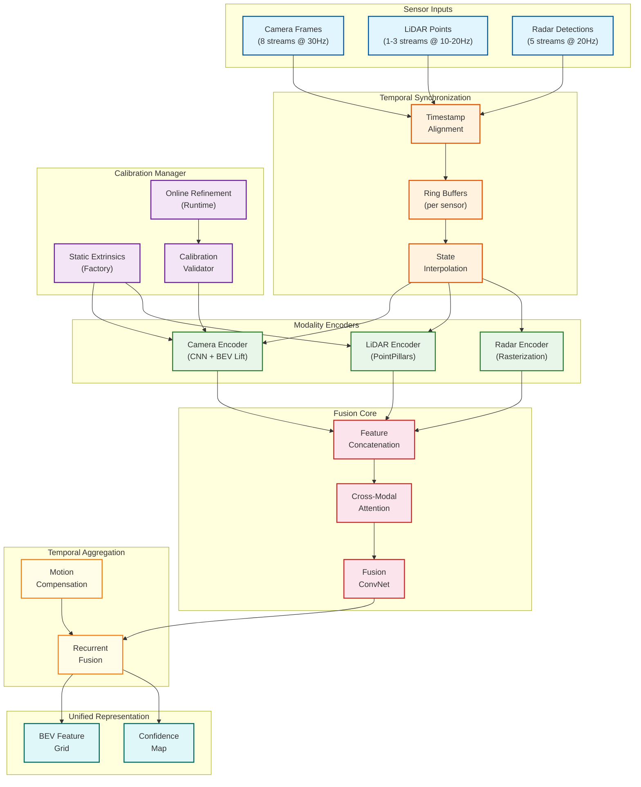
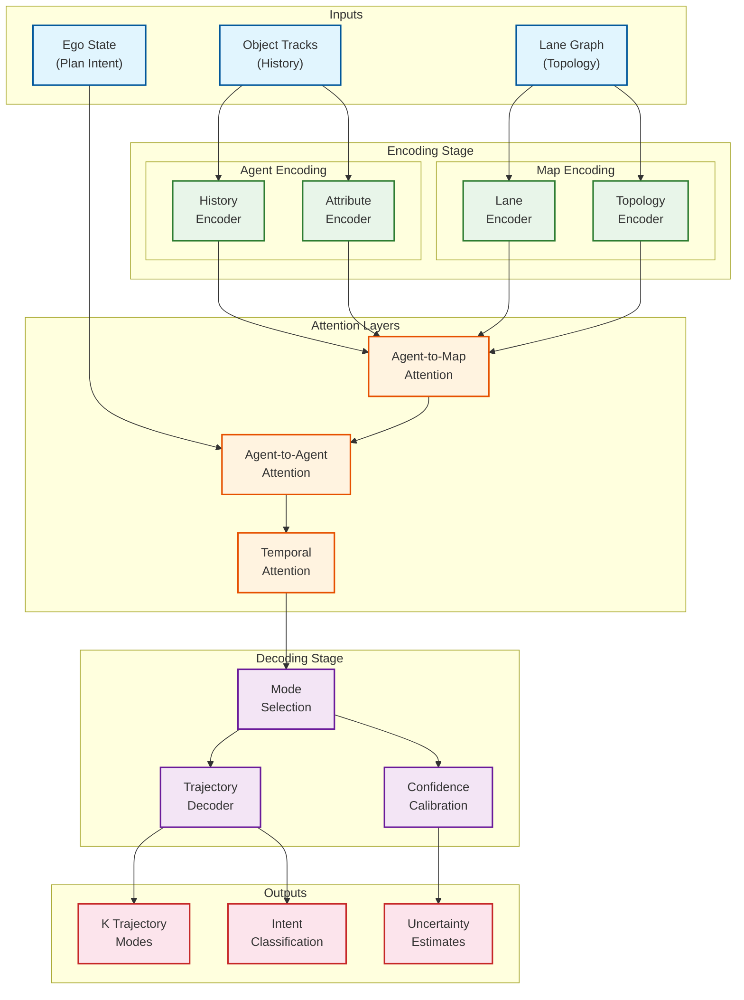
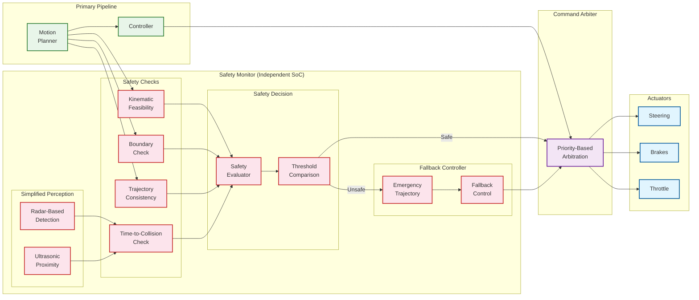

# Deep Dive and Bottlenecks

## Critical Component #1: Sensor Fusion Engine

### Why Critical

The Sensor Fusion Engine is the foundation of all autonomous vehicle perception. It combines data from cameras, LiDAR, radar, and ultrasonic sensors into a unified world representation. Failures in this component directly cascade to prediction and planning, potentially causing unsafe decisions.

| Criticality Factor | Impact |
|-------------------|--------|
| **Single Point of Integration** | All perception depends on fusion output |
| **Temporal Alignment** | Sensors operate at different frequencies (cameras 30Hz, LiDAR 10-20Hz, radar 20Hz) |
| **Spatial Calibration** | Sub-centimeter calibration errors compound over distance |
| **Real-Time Constraint** | Must complete within 15ms to meet E2E latency budget |
| **Redundancy Enabler** | Fusion allows graceful degradation when sensors fail |

### Internal Architecture



### Algorithm Details

#### Temporal Synchronization

```
ALGORITHM TemporalSync(sensor_streams):
    """
    Align sensor data to common timestamp using interpolation.
    """

    // Each sensor has different frequency
    // Camera: 30 Hz (33ms period)
    // LiDAR: 10-20 Hz (50-100ms period)
    // Radar: 20 Hz (50ms period)

    target_timestamp = get_latest_common_timestamp(sensor_streams)
    sync_tolerance = 10ms  // Maximum allowed temporal offset

    synchronized_data = {}

    FOR each sensor IN sensor_streams:
        // Find frames bracketing target timestamp
        frame_before = find_frame_before(sensor.buffer, target_timestamp)
        frame_after = find_frame_after(sensor.buffer, target_timestamp)

        IF frame_before IS None OR frame_after IS None:
            // Sensor data missing - use last known with confidence decay
            synchronized_data[sensor.id] = {
                data: sensor.last_valid,
                confidence: compute_decay(now() - sensor.last_timestamp),
                is_interpolated: True
            }
            CONTINUE

        // Check if within tolerance
        IF abs(frame_before.timestamp - target_timestamp) > sync_tolerance:
            // Large gap - apply motion compensation
            motion = estimate_ego_motion(frame_before.timestamp, target_timestamp)
            compensated = apply_motion_compensation(frame_before, motion)
            synchronized_data[sensor.id] = {
                data: compensated,
                confidence: 0.8,
                is_interpolated: True
            }
        ELSE:
            // Linear interpolation for continuous data (radar, LiDAR)
            alpha = (target_timestamp - frame_before.timestamp) /
                    (frame_after.timestamp - frame_before.timestamp)
            interpolated = interpolate(frame_before, frame_after, alpha)
            synchronized_data[sensor.id] = {
                data: interpolated,
                confidence: 1.0,
                is_interpolated: alpha > 0.01
            }

    RETURN synchronized_data, target_timestamp
```

#### Online Calibration Refinement

```
ALGORITHM OnlineCalibrationRefinement(camera_features, lidar_points, current_calib):
    """
    Refine extrinsic calibration using cross-modal consistency.
    """

    // Project LiDAR points to camera image
    projected_points = project_lidar_to_camera(lidar_points, current_calib)

    // Extract edges/features from camera
    camera_edges = detect_edges(camera_features)

    // Find corresponding LiDAR depth discontinuities
    lidar_edges = find_depth_discontinuities(lidar_points)

    // Compute alignment error
    error = compute_edge_alignment_error(camera_edges, projected_lidar_edges)

    IF error > REFINEMENT_THRESHOLD:
        // Optimize extrinsics to minimize reprojection error
        delta_transform = optimize_extrinsics(
            camera_edges,
            lidar_edges,
            current_calib,
            max_iterations=10,
            learning_rate=0.001
        )

        // Validate refinement is reasonable
        IF norm(delta_transform.translation) < 0.05 AND
           angle(delta_transform.rotation) < 0.5 degrees:
            new_calib = apply_delta(current_calib, delta_transform)
            RETURN new_calib, is_valid=True
        ELSE:
            // Large change suggests problem - don't apply
            log_warning("Calibration drift detected, flagging for inspection")
            RETURN current_calib, is_valid=False

    RETURN current_calib, is_valid=True
```

### Failure Modes and Mitigations

| Failure Mode | Detection Method | Impact | Mitigation |
|--------------|------------------|--------|------------|
| **Camera Dropout** | Missing frames, frozen image | Loss of semantic understanding | Fall back to LiDAR + radar; reduce ODD |
| **LiDAR Failure** | No points, pattern anomaly | Loss of precise geometry | Rely on stereo/mono depth from cameras |
| **Radar Failure** | Missing detections | Loss of velocity ground truth | Use optical flow for velocity |
| **Calibration Drift** | Reprojection error increase | Phantom/missed objects | Online recalibration; flag degradation |
| **Temporal Misalignment** | Timestamp validation failure | Incorrect object positions | Increase sync tolerance; motion compensation |
| **Weather Degradation** | Reduced detection confidence | Partial blindness | Reduce speed; increase safety margins |
| **Sensor Occlusion** | Coverage analysis | Blind spots | Fuse data from adjacent sensors |

### Performance Characteristics

| Metric | Target | Typical | Worst Case |
|--------|--------|---------|------------|
| Fusion latency | < 15ms | 10ms | 18ms |
| Memory bandwidth | < 20 GB/s | 15 GB/s | 25 GB/s |
| GPU utilization | < 60% | 45% | 70% |
| Calibration drift detection | < 1s | 500ms | 2s |
| Degradation detection | < 100ms | 50ms | 150ms |

---

## Critical Component #2: Behavior Prediction System

### Why Critical

The Behavior Prediction System forecasts the future trajectories of all detected agents. Planning decisions are directly dependent on these predictions—incorrect forecasts lead to overly conservative (traffic blocking) or dangerously aggressive (collision risk) behavior.

| Criticality Factor | Impact |
|-------------------|--------|
| **Safety Foundation** | Collision avoidance depends on accurate prediction |
| **Multi-Agent Interactions** | Must model coupled behaviors (yielding, merging) |
| **Multi-Modal Futures** | Same situation can have multiple valid outcomes |
| **Long-Tail Scenarios** | Rare behaviors (jaywalking, U-turns) must be handled |
| **Real-Time Constraint** | Must predict all agents within 20ms |

### Internal Architecture



### Key Technical Challenges

#### 1. Multi-Modal Predictions

Agents can take multiple valid future actions (continue straight, turn left, stop). The system must:

```
CHALLENGE: Predict K=6 diverse, plausible trajectory modes

SOLUTION: Learned Mode Anchors
- Pre-define K latent mode vectors (learned during training)
- Each mode captures a behavior archetype (accelerate, brake, lane change)
- Decode trajectories conditioned on mode

METRICS:
- minADE: Average Displacement Error of best mode (1.0-1.5m @ 3s)
- minFDE: Final Displacement Error of best mode (2.0-3.0m @ 3s)
- MR: Miss Rate (% where no mode within 2m of ground truth)
- Coverage: % of ground truth behaviors captured by any mode
```

#### 2. Social Interactions

Agents influence each other (car yields to pedestrian, vehicles negotiate at intersection).

```
CHALLENGE: Capture interdependent futures

SOLUTION: Factorized Attention
1. First pass: Independent marginal predictions per agent
2. Second pass: Conditional predictions given other agents' marginals
3. Iterate to convergence or use joint scene-level decoding

EXAMPLE: Intersection negotiation
- Vehicle A and Pedestrian B approaching
- Marginal: A continues, B crosses
- Conditional: A predicts B will cross → A slows
- Conditional: B predicts A will slow → B continues
- Joint: A yields, B crosses (resolved prediction)
```

#### 3. Long-Tail Events

Rare behaviors (sudden stops, jaywalking, emergency vehicles) have high safety importance but low frequency in training data.

```
CHALLENGE: Handle rare but critical behaviors

SOLUTION: Multi-pronged approach
1. Oversampling: Replay rare events more frequently in training
2. Synthetic generation: Generate edge cases via simulation
3. Uncertainty awareness: Flag low-confidence predictions
4. Defensive planning: Plan against worst-case predictions, not just most-likely

METRICS:
- Recall on rare events: > 95%
- False positive rate: < 5%
- Time to detect anomaly: < 200ms
```

### Failure Modes and Mitigations

| Failure Mode | Detection | Impact | Mitigation |
|--------------|-----------|--------|------------|
| **Overconfident Wrong Prediction** | Calibration drift monitoring | Collision if planner trusts | Confidence calibration; planner safety margins |
| **Missed Rare Maneuver** | Post-hoc analysis; scenario coverage | Collision | Defensive planning; assume worst case |
| **Prediction Instability** | Temporal consistency check | Jerky ego behavior | Temporal smoothing; hysteresis |
| **Mode Collapse** | Diversity metrics | Miss valid futures | Diverse sampling; repulsion loss |
| **Computational Timeout** | Watchdog | Stale predictions | Prioritize nearby agents; simplify model |
| **New Object Class** | Classification uncertainty | Unpredictable behavior | Conservative assumptions |

### Performance Characteristics

| Metric | Target | Typical | Notes |
|--------|--------|---------|-------|
| Prediction latency | < 20ms | 15ms | For 50 agents |
| minADE @ 3s | < 1.5m | 1.2m | Average across modes |
| minFDE @ 3s | < 3.0m | 2.5m | End point error |
| Miss Rate @ 2m | < 15% | 12% | Waymo benchmark |
| Confidence calibration | ECE < 0.05 | 0.03 | Expected calibration error |

---

## Critical Component #3: Safety Monitor and Fallback Controller

### Why Critical

The Safety Monitor is the last line of defense against unsafe behavior. It operates independently of the main planning pipeline and has authority to override planned trajectories. For ASIL-D compliance, this component must function correctly even when the primary system fails.

| Criticality Factor | Impact |
|-------------------|--------|
| **Last Defense** | Only barrier between faulty plan and vehicle actuators |
| **Independence** | Must not share failure modes with primary system |
| **ASIL-D Requirement** | Highest automotive safety integrity level |
| **Fail-Operational** | Must maintain safe operation during failures |
| **Sub-100ms Response** | Safety response must be fast |

### Internal Architecture



### Safety Envelope Definition

The Safety Envelope defines bounds within which the vehicle can operate safely:

```
SAFETY_ENVELOPE:
    // Time-to-Collision
    min_ttc: 1.5 seconds                    # Minimum TTC to any obstacle
    emergency_ttc: 0.5 seconds              # Trigger AEB

    // Kinematic Limits
    max_longitudinal_accel: 3.0 m/s²        # Comfort acceleration
    max_longitudinal_decel: -4.0 m/s²       # Comfort braking
    emergency_decel: -8.0 m/s²              # Maximum braking
    max_lateral_accel: 3.0 m/s²             # Cornering limit
    max_jerk: 2.5 m/s³                      # Comfort jerk

    // Trajectory Bounds
    max_curvature: 0.2 rad/m                # Steering limit
    max_curvature_rate: 0.1 rad/m/s         # Steering rate limit

    // Positional Bounds
    max_lateral_deviation: 1.0 m            # From lane center
    min_clearance: 0.5 m                    # To obstacles

    // Temporal Consistency
    max_trajectory_divergence: 2.0 m        # Between consecutive plans
    max_heading_change: 30°/s               # Heading rate
```

### Safety Check Algorithms

```
ALGORITHM SafetyEnvelopeCheck(planned_trajectory, perception, envelope):
    """
    Validate planned trajectory against safety envelope.
    Returns SAFE, MARGINAL, or UNSAFE.
    """

    violations = []

    // Check 1: Time-to-Collision
    FOR each obstacle IN perception.obstacles:
        ttc = compute_ttc(planned_trajectory, obstacle)
        IF ttc < envelope.emergency_ttc:
            RETURN UNSAFE, "Critical TTC violation: {ttc}s"
        ELSE IF ttc < envelope.min_ttc:
            violations.append(("TTC", ttc))

    // Check 2: Kinematic Feasibility
    FOR each point IN planned_trajectory.points:
        IF abs(point.acceleration) > envelope.max_longitudinal_accel:
            violations.append(("Acceleration", point.acceleration))
        IF abs(point.lateral_accel) > envelope.max_lateral_accel:
            violations.append(("Lateral Accel", point.lateral_accel))
        IF abs(point.jerk) > envelope.max_jerk:
            violations.append(("Jerk", point.jerk))
        IF abs(point.curvature) > envelope.max_curvature:
            violations.append(("Curvature", point.curvature))

    // Check 3: Boundary Compliance
    FOR each point IN planned_trajectory.points:
        distance_to_boundary = compute_boundary_distance(point, perception.lanes)
        IF distance_to_boundary < 0:  # Outside drivable area
            RETURN UNSAFE, "Trajectory exits drivable area"
        IF distance_to_boundary < envelope.min_clearance:
            violations.append(("Boundary", distance_to_boundary))

    // Check 4: Trajectory Consistency
    IF previous_trajectory IS NOT None:
        divergence = compute_trajectory_divergence(planned_trajectory, previous_trajectory)
        IF divergence > envelope.max_trajectory_divergence:
            violations.append(("Consistency", divergence))

    // Evaluate overall safety
    IF len(violations) == 0:
        RETURN SAFE, None
    ELSE IF all violations are minor:
        RETURN MARGINAL, violations
    ELSE:
        RETURN UNSAFE, violations


ALGORITHM FallbackTrajectory(current_state, perception, fallback_type):
    """
    Generate safe fallback trajectory when primary planning fails.
    """

    IF fallback_type == GRADUAL_STOP:
        // Comfortable deceleration to stop
        decel = -2.0 m/s²
        stopping_distance = current_state.velocity² / (2 * abs(decel))

        trajectory = generate_stopping_trajectory(
            current_state,
            decel=decel,
            max_distance=stopping_distance
        )

    ELSE IF fallback_type == EMERGENCY_STOP:
        // Maximum safe deceleration
        decel = -6.0 m/s²  # Less than AEB max for controllability

        trajectory = generate_stopping_trajectory(
            current_state,
            decel=decel,
            steering_hold=True  # Don't change steering during emergency stop
        )

    ELSE IF fallback_type == LANE_KEEP:
        // Continue in current lane at reduced speed
        trajectory = generate_lane_following_trajectory(
            current_state,
            perception.current_lane,
            target_speed=current_state.velocity * 0.5,
            horizon=3.0 seconds
        )

    // Validate fallback is actually safe
    safety_check = SafetyEnvelopeCheck(trajectory, perception, RELAXED_ENVELOPE)
    IF safety_check == UNSAFE:
        // Even fallback is unsafe - emergency stop
        RETURN generate_emergency_stop(current_state)

    RETURN trajectory
```

### Failure Modes and Responses

| Scenario | Detection | Response | Response Time |
|----------|-----------|----------|---------------|
| **Primary planner timeout** | Watchdog (100ms) | Activate fallback planner | 10ms |
| **Invalid trajectory received** | Envelope check | Reject, use last safe + gradual stop | 5ms |
| **Sensor blindness** | Coverage monitoring | Gradual stop, hazards on | 50ms |
| **Imminent collision detected** | TTC < 0.5s | AEB activation | 50ms |
| **Actuator failure** | Feedback monitoring | Attempt secondary actuator | 20ms |
| **Primary compute failure** | Heartbeat loss | Safety SoC takes control | 100ms |
| **Complete power loss** | Voltage monitoring | Mechanical brake, hazards | 10ms |

### Independence Guarantee

To satisfy ASIL-D, the Safety Monitor must be independent:

| Aspect | Primary System | Safety Monitor |
|--------|----------------|----------------|
| **Compute Hardware** | DRIVE Orin (Primary) | DRIVE Orin (Secondary) or TI TDA4 |
| **Power Supply** | Main battery | Separate power domain |
| **Sensors** | Full suite | Radar + Ultrasonic (diverse) |
| **Software** | Complex ML models | Simple rule-based logic |
| **Network** | Shared Ethernet | Dedicated CAN or Ethernet |
| **Failure Mode** | Complex, varied | Simple, well-analyzed |

---

## Bottleneck Analysis

### Top Bottlenecks

| Rank | Bottleneck | Current | Target | Impact | Solution |
|------|------------|---------|--------|--------|----------|
| 1 | **Camera CNN Inference** | 40ms | 30ms | E2E latency | TensorRT, INT8 quantization |
| 2 | **BEV Feature Generation** | 20ms | 12ms | Perception latency | Optimized scatter, memory pooling |
| 3 | **LiDAR Preprocessing** | 15ms | 8ms | Fusion delay | CUDA kernels, GPU upload overlap |
| 4 | **Trajectory Optimization** | 25ms | 15ms | Planning latency | Warm-start QP, simplified model |
| 5 | **Memory Bandwidth** | 80% util | 60% util | Thermal, power | Feature compression, pruning |

### Bottleneck 1: Camera CNN Inference

**Problem**: Processing 8 camera streams through a shared backbone takes 40ms, consuming half the perception latency budget.

**Root Cause**:
- Large input resolution (2MP per camera = 16MP total)
- Deep backbone (ResNet-50 or EfficientNet-B5)
- Memory bandwidth for feature maps

**Solutions**:

```
OPTIMIZATION 1: TensorRT Optimization
- Convert PyTorch model to TensorRT engine
- Enable FP16/INT8 precision
- Fuse batch normalization into convolutions
- Expected speedup: 1.5-2x

OPTIMIZATION 2: Resolution Scaling
- Process at half resolution for initial detection
- Run full resolution only in ROIs
- Expected speedup: 2-3x for initial pass

OPTIMIZATION 3: Temporal Reuse
- Not all cameras change significantly between frames
- Reuse backbone features when motion is low
- Expected speedup: 1.3x average

OPTIMIZATION 4: Multi-Stream Processing
- Use CUDA streams to overlap cameras
- Process in batches of 4 (front/rear)
- Expected speedup: 1.2x
```

### Bottleneck 2: BEV Feature Generation

**Problem**: Lifting 2D camera features to 3D and splatting to BEV grid is memory-intensive.

**Root Cause**:
- Outer product creates H×W×D×C tensor (~1GB)
- Voxel pooling has random access patterns
- Multiple camera views must be accumulated

**Solutions**:

```
OPTIMIZATION 1: Efficient Lift-Splat
- Pre-compute camera-to-BEV mappings
- Use scatter_nd with pre-indexed buffers
- Expected speedup: 1.5x

OPTIMIZATION 2: Depth Discretization
- Reduce depth bins from 80 to 48
- Minimal accuracy loss for <100m objects
- Expected speedup: 1.7x memory, 1.3x compute

OPTIMIZATION 3: Sparse Operations
- Only process non-empty BEV cells
- Use sparse tensor representations
- Expected speedup: Variable (1.2-2x based on scene)
```

### Bottleneck 3: Trajectory Optimization

**Problem**: QP solver for MPC takes 25ms per planning cycle.

**Root Cause**:
- Dense QP with N×(state+control) variables
- Cold-start every cycle
- High accuracy requirements

**Solutions**:

```
OPTIMIZATION 1: Warm Starting
- Initialize from previous solution
- Shift and extrapolate
- Expected speedup: 2-3x

OPTIMIZATION 2: Active Set Caching
- Cache active constraint set
- Only recompute when constraints change
- Expected speedup: 1.5x

OPTIMIZATION 3: Horizon Reduction
- Use N=15 instead of N=20
- Compensate with higher control rate
- Expected speedup: 1.8x

OPTIMIZATION 4: Simplified Dynamics
- Use kinematic bicycle model instead of dynamic
- Valid at lower speeds
- Expected speedup: 1.3x
```

---

## Race Conditions and Concurrency Issues

### Race Condition #1: Sensor Frame Ordering

**Problem**: Sensors publish asynchronously. A later LiDAR frame might arrive before an earlier camera frame due to processing delays.

**Symptom**: Objects appear to jump or duplicate.

**Solution**:
```
SOLUTION: Timestamped Ring Buffers with Watermarking

1. Each sensor writes to dedicated ring buffer with hardware timestamps
2. Fusion waits for "watermark" - minimum timestamp present in all buffers
3. Only process frames with timestamps ≤ watermark
4. Discard late arrivals that miss the window

IMPLEMENTATION:
- Buffer size: 200ms of data per sensor
- Watermark advance: Every 33ms (camera frame period)
- Late arrival tolerance: 50ms (then dropped)
```

### Race Condition #2: Planning-Control Handoff

**Problem**: Controller reads trajectory while planner is writing new one. Partial reads cause erratic behavior.

**Symptom**: Vehicle stutters or makes sudden corrections.

**Solution**:
```
SOLUTION: Double Buffering with Atomic Swap

1. Planner writes to "back buffer"
2. When complete, atomic pointer swap to make it "front buffer"
3. Controller always reads from front buffer
4. No locking required - lock-free operation

IMPLEMENTATION:
- Two trajectory buffers: A and B
- Atomic<TrajectoryBuffer*> current_trajectory
- Planner: writes to inactive, then swap
- Controller: reads from current_trajectory pointer
```

### Race Condition #3: State Estimation Update

**Problem**: Localization updates vehicle state while controller is computing. Controller uses stale state.

**Symptom**: Control lag, oscillations.

**Solution**:
```
SOLUTION: Copy-on-Read with Sequence Numbers

1. Localization publishes state with monotonic sequence number
2. Controller copies state and sequence at start of cycle
3. At end of cycle, verify sequence hasn't advanced too far
4. If stale (>2 sequences), abort and recompute

IMPLEMENTATION:
- atomic<uint64_t> state_sequence
- Controller checks sequence_before == sequence_after
- If mismatch and delta > threshold, retry
```

### Race Condition #4: OTA Update During Operation

**Problem**: Software update while vehicle is driving could cause undefined behavior.

**Solution**:
```
SOLUTION: Update State Machine

1. OTA updates only applied when vehicle is PARKED
2. Updates downloaded in background while driving
3. Validation occurs before activation
4. Activation requires driver confirmation and safe state

STATES:
- DOWNLOAD_PENDING: Background download
- DOWNLOAD_COMPLETE: Ready to validate
- VALIDATION_PENDING: Integrity and compatibility checks
- READY_TO_ACTIVATE: Waiting for safe state + consent
- ACTIVATING: Applying update (vehicle parked)
- ROLLBACK_AVAILABLE: 24-hour window to revert
```

### Thread Safety Requirements

| Component | Threading Model | Synchronization |
|-----------|-----------------|-----------------|
| Sensor buffers | Single-writer, multi-reader | Lock-free ring buffer |
| Perception output | Single-writer | Atomic pointer swap |
| Track database | Multi-writer | Reader-writer lock |
| Trajectory buffer | Single-writer, single-reader | Double buffer |
| Vehicle state | Single-writer, multi-reader | Copy-on-read |
| Configuration | Write rarely, read often | RCU (Read-Copy-Update) |
