# Scalability and Reliability

## Scalability Strategy

### On-Vehicle Scaling

Unlike cloud systems, on-vehicle compute is **fixed at deployment time**. Scaling must occur through efficiency improvements rather than adding resources.

| Strategy | Approach | Benefit |
|----------|----------|---------|
| **Model Optimization** | TensorRT, INT8 quantization, pruning | 2-4x inference speedup |
| **Temporal Reuse** | Skip redundant computation on static scenes | 20-40% compute savings |
| **Dynamic Resolution** | Reduce resolution for distant objects | 30-50% bandwidth savings |
| **Feature Caching** | Reuse backbone features across heads | 15-25% memory savings |
| **Workload Prioritization** | Process nearby objects first | Guaranteed latency for critical |

#### Compute Budget Management

```
ALGORITHM DynamicComputeBudget(scene_complexity, remaining_latency):
    """
    Adapt computation based on available time and scene complexity.
    """

    total_budget = 100ms  // E2E target
    elapsed = get_elapsed_time()
    remaining = total_budget - elapsed

    // Perception budget: 50ms nominal
    IF scene_complexity == HIGH:
        // Many objects, complex scene
        perception_budget = min(55ms, remaining * 0.5)
        use_full_resolution = True
        max_objects = 100

    ELSE IF scene_complexity == MEDIUM:
        perception_budget = 45ms
        use_full_resolution = True
        max_objects = 75

    ELSE:  // LOW complexity
        perception_budget = 35ms
        use_full_resolution = False  // Half resolution sufficient
        max_objects = 50

    // Prediction budget: 20ms nominal
    prediction_budget = min(20ms, remaining - perception_budget - 30ms)
    IF prediction_budget < 10ms:
        // Not enough time - reduce prediction horizon
        prediction_horizon = 3.0s  // Instead of 8s
        prediction_modes = 3       // Instead of 6

    // Planning budget: 30ms nominal
    planning_budget = remaining - perception_budget - prediction_budget

    RETURN ComputeAllocation(perception_budget, prediction_budget, planning_budget)
```

### Fleet Scaling

Fleet operations infrastructure must scale horizontally to support thousands of vehicles.

```mermaid
flowchart TB
    subgraph Vehicles["Vehicle Fleet (N vehicles)"]
        V1["Vehicle 1"]
        V2["Vehicle 2"]
        VN["Vehicle N"]
    end

    subgraph Ingestion["Ingestion Layer"]
        LB["Load Balancer"]
        KAFKA["Message Queue<br/>(Partitioned)"]
    end

    subgraph Processing["Processing Layer"]
        subgraph Telemetry["Telemetry Processing"]
            TP1["Processor 1"]
            TP2["Processor 2"]
            TPN["Processor N"]
        end
        subgraph Analytics["Real-time Analytics"]
            FLINK["Stream<br/>Processing"]
        end
    end

    subgraph Storage["Storage Layer"]
        subgraph Hot["Hot Storage (7 days)"]
            TS["Time-Series DB<br/>(Metrics)"]
            ES["Search Index<br/>(Logs)"]
        end
        subgraph Warm["Warm Storage (90 days)"]
            S3W["Object Storage"]
        end
        subgraph Cold["Cold Storage (7 years)"]
            GLACIER["Archive Storage"]
        end
    end

    subgraph Services["Application Services"]
        FLEET["Fleet<br/>Dashboard"]
        OTA["OTA<br/>Service"]
        TELEOPS["Teleops<br/>Service"]
        ML["ML Training<br/>Pipeline"]
    end

    Vehicles --> LB --> KAFKA
    KAFKA --> Telemetry
    KAFKA --> FLINK

    Telemetry --> TS
    Telemetry --> ES
    Telemetry --> S3W

    S3W --> GLACIER

    TS --> FLEET
    S3W --> ML
    OTA --> Vehicles
    TELEOPS <--> Vehicles

    classDef vehicle fill:#e1f5fe,stroke:#01579b,stroke-width:2px
    classDef ingestion fill:#fff3e0,stroke:#e65100,stroke-width:2px
    classDef processing fill:#e8f5e9,stroke:#2e7d32,stroke-width:2px
    classDef storage fill:#f3e5f5,stroke:#6a1b9a,stroke-width:2px
    classDef service fill:#fce4ec,stroke:#c62828,stroke-width:2px

    class V1,V2,VN vehicle
    class LB,KAFKA ingestion
    class TP1,TP2,TPN,FLINK processing
    class TS,ES,S3W,GLACIER storage
    class FLEET,OTA,TELEOPS,ML service
```



#### Fleet Scaling Dimensions

| Component | Scaling Trigger | Scaling Method | Capacity Target |
|-----------|-----------------|----------------|-----------------|
| **Telemetry Ingestion** | Messages/sec > threshold | Add Kafka partitions + consumers | 1M messages/sec |
| **Log Storage** | Storage utilization > 70% | Add storage nodes | 100 PB |
| **Time-Series DB** | Query latency > 100ms | Add read replicas | 10M metrics/sec |
| **OTA Distribution** | Download queue length | Add CDN edge nodes | 100 Gbps |
| **ML Training** | GPU queue wait > 1hr | Add GPU instances | 1000 GPUs |
| **Teleops Centers** | Calls waiting > 10 | Add operator seats | 1000 concurrent |

### Simulation Scaling

Simulation is essential for validation and must scale to billions of miles equivalent.

| Scaling Approach | Description | Throughput |
|------------------|-------------|------------|
| **Parallel Scenarios** | Run multiple scenarios simultaneously | 1000x real-time per GPU |
| **Distributed Simulation** | Shard world across nodes | 10,000 agents per cluster |
| **Cloud Burst** | Scale out during validation campaigns | 10,000 GPUs on-demand |
| **Replay Acceleration** | Replay logged data faster than real-time | 100x speedup |

---

## Reliability Patterns

### Fail-Operational Architecture

For L4 autonomous driving, the vehicle must continue operating safely even when components fail. This requires fail-operational (not just fail-safe) design.


### Redundancy Requirements by ASIL Level

| Component | ASIL-B (L2) | ASIL-C (L3) | ASIL-D (L4) |
|-----------|-------------|-------------|-------------|
| **Compute** | Single SoC | Dual SoC (degraded) | Dual SoC (fail-operational) |
| **Cameras** | Single per direction | Overlap coverage | Redundant per critical zone |
| **LiDAR** | Optional | Single | Dual or N/A if vision-sufficient |
| **Radar** | Front only | Front + rear | 360° coverage |
| **Steering** | Single EPS | Single + monitoring | Dual EPS motors |
| **Braking** | Single BBW | Single + hydraulic backup | Dual BBW + hydraulic |
| **Power** | Single 12V | Single with monitoring | Dual power domains |
| **Network** | Single CAN/Ethernet | Ring topology | Dual redundant networks |

### Redundancy Strategies

#### 1. Hot Standby

Backup system runs in parallel, ready to take over instantly.

```
PATTERN: Hot Standby Compute

PRIMARY_SoC:
    - Runs full autonomy stack
    - Sends heartbeat every 10ms
    - Outputs commands to arbiter

BACKUP_SoC:
    - Runs identical software stack
    - Monitors primary heartbeat
    - Computes trajectories in parallel
    - Commands in shadow mode

ARBITER:
    - Receives commands from both
    - Uses primary unless:
        1. Primary heartbeat missing > 50ms
        2. Primary output fails safety check
        3. Outputs diverge significantly

SWITCHOVER:
    - Detection: < 50ms
    - Switch: < 10ms
    - Total: < 60ms (within 100ms budget)
```

#### 2. Diverse Redundancy

Use different implementations to avoid common-mode failures.

```
PATTERN: Diverse Perception

CAMERA_PIPELINE:
    - CNN-based detection
    - Trained on labeled data
    - Good for classification

LIDAR_PIPELINE:
    - Point cloud clustering
    - Geometry-based detection
    - Good for precise positioning

RADAR_PIPELINE:
    - Peak detection + CFAR
    - Doppler-based classification
    - Good for velocity, weather immunity

FUSION:
    - Agree: High confidence
    - 2/3 Agree: Medium confidence, flag minority
    - Disagree: Low confidence, conservative action
```

#### 3. Graceful Degradation

Reduce capability while maintaining safety when partial failures occur.

```
DEGRADATION_LEVELS:

LEVEL_0 (NOMINAL):
    - All systems operational
    - Full ODD (highway + urban)
    - Normal speeds

LEVEL_1 (REDUCED):
    - Single sensor type failed
    - Reduced ODD (highway only)
    - Speed limit: 80% of normal
    - Alert user, continue to destination

LEVEL_2 (LIMITED):
    - Multiple sensor failures
    - Minimal ODD (current lane only)
    - Speed limit: 50% of normal
    - Seek safe stopping location

LEVEL_3 (MRC):
    - Critical system failure
    - No autonomous capability
    - Execute safe stop
    - Hazard lights, pull to shoulder
```

### Circuit Breaker Patterns

Prevent cascade failures from external dependencies.

| Dependency | Circuit Breaker Policy | Fallback |
|------------|----------------------|----------|
| **Cloud Connectivity** | Open after 3 failures in 30s | Continue autonomous, buffer telemetry |
| **Map Server** | Open after 5 failures in 60s | Use cached maps (up to 30 days old) |
| **GNSS Signal** | Open after 10s loss | Dead reckoning with IMU + wheel odometry |
| **Teleops Service** | Open after 30s no response | Achieve MRC autonomously |
| **V2X Infrastructure** | Open if no messages in 60s | Rely on on-board sensors only |

```
ALGORITHM CircuitBreaker(dependency, request):
    """
    Prevent repeated calls to failing dependency.
    """

    IF circuit_state[dependency] == OPEN:
        IF time_since_open > RECOVERY_TIMEOUT:
            circuit_state[dependency] = HALF_OPEN
        ELSE:
            RETURN fallback_value[dependency]

    IF circuit_state[dependency] == HALF_OPEN:
        // Try single request
        result = try_request(dependency, request)
        IF result.success:
            circuit_state[dependency] = CLOSED
            failure_count[dependency] = 0
            RETURN result
        ELSE:
            circuit_state[dependency] = OPEN
            open_time[dependency] = now()
            RETURN fallback_value[dependency]

    // CLOSED state - normal operation
    result = try_request(dependency, request)
    IF NOT result.success:
        failure_count[dependency] += 1
        IF failure_count[dependency] >= FAILURE_THRESHOLD:
            circuit_state[dependency] = OPEN
            open_time[dependency] = now()
        RETURN fallback_value[dependency]

    failure_count[dependency] = 0
    RETURN result
```

### Retry Strategies

```
RETRY_POLICIES:

SENSOR_READ:
    max_retries: 1
    delay: 0 (immediate)
    backoff: none
    rationale: Real-time; stale data is useless

CLOUD_UPLOAD:
    max_retries: 5
    delay: 1s initial
    backoff: exponential (1s, 2s, 4s, 8s, 16s)
    rationale: Eventually consistent; queue locally

MAP_FETCH:
    max_retries: 3
    delay: 100ms
    backoff: linear (100ms, 200ms, 300ms)
    rationale: Need data but can use cache

OTA_DOWNLOAD:
    max_retries: 10
    delay: 60s
    backoff: exponential with jitter
    rationale: Large file; bandwidth-conscious
```

---

## Caching Architecture

### On-Vehicle Caches

| Cache | Size | TTL | Contents | Eviction |
|-------|------|-----|----------|----------|
| **Model Weights** | 4-8 GB | Permanent | Neural network parameters | Update on OTA |
| **HD Map Tiles** | 50-100 GB | 30 days | Lane geometry, signals | LRU by distance |
| **Route Cache** | 1 GB | 1 hour | Pre-computed routes | Trip end |
| **Feature Cache** | 2 GB | 5 frames | Backbone features | Temporal window |
| **Track Cache** | 500 MB | 30s | Object track history | Track death |

### Fleet Caches

| Cache | Technology | Size | Hit Rate Target |
|-------|------------|------|-----------------|
| **Map Tiles CDN** | Edge servers | 10 TB per PoP | > 95% |
| **Model Registry** | Container registry | 500 GB | > 99% |
| **Telemetry Query** | Redis cluster | 1 TB | > 80% |
| **Simulation Assets** | Object storage cache | 50 TB | > 90% |

---

## Disaster Recovery

### Vehicle-Level Recovery

| Scenario | Detection | Recovery Action | RTO | RPO |
|----------|-----------|-----------------|-----|-----|
| **Primary compute crash** | Watchdog timeout | Switch to backup compute | 60ms | 0 (stateless) |
| **All cameras fail** | No frames + self-test | Degrade to LiDAR + radar mode | 100ms | N/A |
| **Power brown-out** | Voltage < 10V | Emergency stop on reserve | 200ms | Buffer to flash |
| **Software exception** | Exception handler | Restart process, use backup | 500ms | Last valid state |
| **Corrupted model** | Inference anomaly | Load backup model from flash | 5s | Previous version |

### Fleet-Level Recovery

| Scenario | Impact | Recovery | RTO | RPO |
|----------|--------|----------|-----|-----|
| **Cloud region failure** | Telemetry buffered, no new OTA | Failover to secondary region | 5 min | 1 hour |
| **Map database corruption** | Vehicles use cached maps | Restore from backup + rebuild | 1 hour | 24 hours |
| **ML pipeline failure** | No new model training | Repair pipeline; vehicles unaffected | 24 hours | N/A |
| **Security breach** | Potential fleet compromise | Revoke credentials, OTA security patch | 1 hour (critical) | N/A |

### Backup Strategies

```
VEHICLE_BACKUP:
    Software:
        - Primary image on SSD partition A
        - Backup image on SSD partition B
        - Recovery image in protected flash
        - Rollback via A/B partition swap

    Data:
        - Critical logs: Write-ahead to flash
        - Telemetry: Buffer 24 hours locally
        - Maps: Cached locally, updated when connected

    Models:
        - Active model in GPU memory
        - Backup model on SSD
        - Fallback model in protected flash (verified safe)

FLEET_BACKUP:
    Frequency:
        - Database: Continuous replication + daily snapshots
        - Object storage: Cross-region replication
        - Configuration: Git versioned + hourly backup

    Retention:
        - Safety-critical logs: 7 years (regulatory)
        - Telemetry: 90 days hot, 2 years warm, 7 years cold
        - Models: All versions retained
```

---

## Multi-Region Deployment

### Geographic Distribution


### Data Residency

| Data Type | Residency Rule | Reason |
|-----------|---------------|--------|
| **Vehicle Telemetry** | Process in region, store in region | GDPR, data sovereignty |
| **Camera Images** | Process locally, delete after 72h | Privacy |
| **Safety Logs** | Store in region, replicate anonymized | Regulatory |
| **ML Training Data** | Centralized after anonymization | Efficiency |
| **Maps** | Global with regional caching | Performance |
| **Models** | Global distribution from central registry | Consistency |

---

## Capacity Planning

### Growth Projections

| Metric | Year 1 | Year 2 | Year 3 | Year 5 |
|--------|--------|--------|--------|--------|
| **Fleet Size** | 1,000 | 5,000 | 20,000 | 100,000 |
| **Daily Miles** | 50K | 250K | 1M | 5M |
| **Telemetry (TB/day)** | 0.5 | 2.5 | 10 | 50 |
| **Simulation (GPU-hours/day)** | 1,000 | 5,000 | 20,000 | 100,000 |
| **Cloud Spend ($/month)** | $100K | $500K | $2M | $10M |

### Scaling Thresholds

| Component | Trigger | Action |
|-----------|---------|--------|
| **Ingestion Pipeline** | Lag > 5 min | Add Kafka partitions + consumers |
| **Storage** | 70% capacity | Expand cluster |
| **Time-Series DB** | P99 latency > 500ms | Add read replicas |
| **ML Training** | Queue > 24h | Provision more GPUs |
| **Teleops** | Wait time > 2 min | Add operator capacity |
| **CDN** | Cache hit < 90% | Add edge locations |
