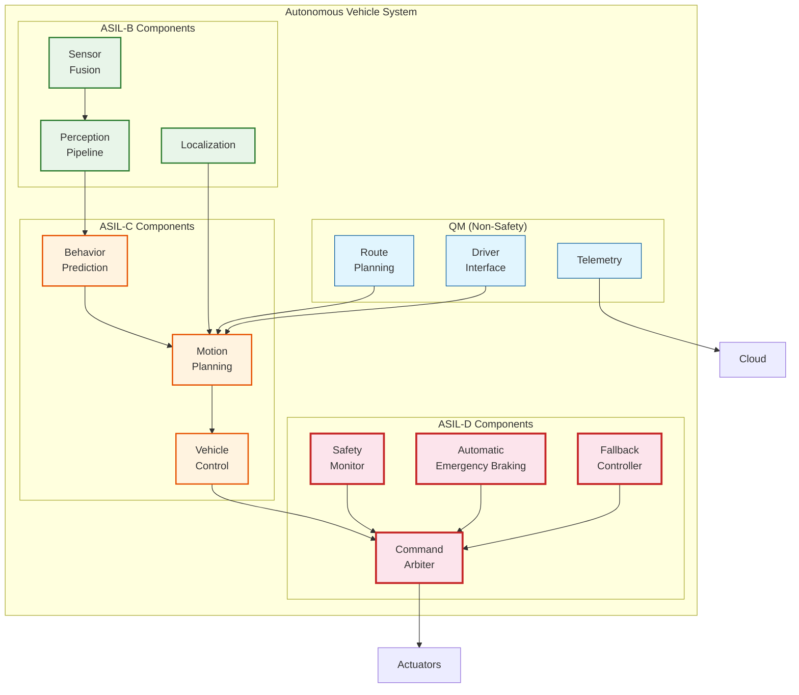
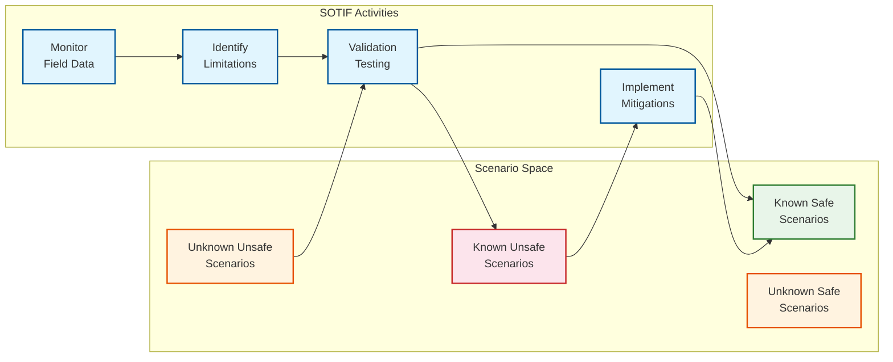
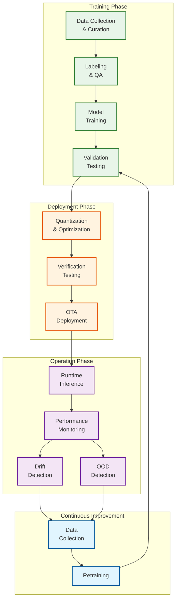
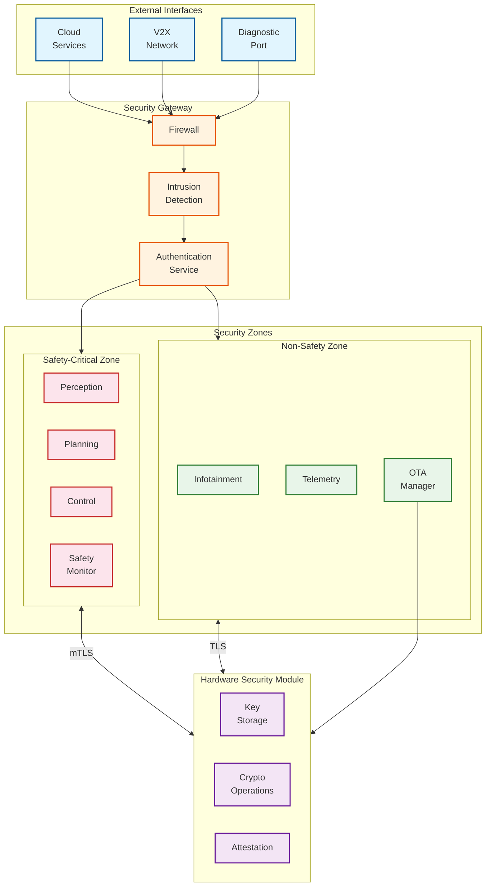

# Security and Compliance

## Functional Safety (ISO 26262)

### Overview

ISO 26262 is the international standard for functional safety of road vehicles. It defines Automotive Safety Integrity Levels (ASIL) from A (lowest) to D (highest), based on severity, exposure, and controllability of potential hazards.

### ASIL Decomposition



### ASIL Assignment Rationale

| Component | ASIL | Severity | Exposure | Controllability | Justification |
|-----------|------|----------|----------|-----------------|---------------|
| **AEB System** | D | S3 (life-threatening) | E4 (high) | C3 (uncontrollable) | Direct collision avoidance |
| **Fallback Controller** | D | S3 | E4 | C3 | Last line of defense |
| **Command Arbiter** | D | S3 | E4 | C3 | Controls all actuators |
| **Safety Monitor** | D | S3 | E4 | C3 | Validates all commands |
| **Motion Planning** | C | S3 | E3 (medium) | C2 (partly controllable) | Driver can intervene (L2-L3) |
| **Vehicle Control** | C | S3 | E3 | C2 | Output bounded by safety monitor |
| **Behavior Prediction** | C | S2 (severe) | E3 | C2 | Incorrect prediction affects planning |
| **Perception** | B | S2 | E3 | C1 (controllable) | Multiple redundant sensors |
| **Localization** | B | S2 | E2 (low) | C1 | Failure detectable |
| **Sensor Fusion** | B | S2 | E2 | C1 | Redundancy across modalities |
| **Route Planning** | QM | S1 (light) | E2 | C1 | Non-safety-critical |

### Safety Requirements by ASIL

| ASIL | Hardware Metric (PMHF) | Diagnostic Coverage | Development Process |
|------|------------------------|---------------------|---------------------|
| **D** | < 10 FIT (10⁻⁸/hr) | > 99% | Full safety lifecycle |
| **C** | < 100 FIT | > 97% | Extensive verification |
| **B** | < 1000 FIT | > 90% | Systematic approach |
| **A** | < 10000 FIT | > 60% | Basic requirements |
| **QM** | No target | No target | Standard development |

*FIT = Failures In Time (failures per 10⁹ hours)*

### Safety Mechanisms

| Mechanism | Purpose | Applied To |
|-----------|---------|------------|
| **Redundancy** | Tolerate single failures | Compute, sensors, actuators |
| **Diversity** | Avoid common-mode failures | Sensor modalities, software |
| **Monitoring** | Detect failures | All safety-critical components |
| **Partitioning** | Isolate failures | Software, memory, network |
| **Watchdog** | Detect hangs | All processors |
| **CRC/ECC** | Detect data corruption | Memory, communication |
| **Plausibility Checks** | Detect sensor errors | All sensor inputs |

---

## SOTIF (ISO 21448)

### Safety of the Intended Functionality

SOTIF addresses hazards that occur even when the system functions correctly—arising from limitations in perception, decision-making, or unexpected operating conditions.

### SOTIF Analysis Framework



### Perception Limitations

| Limitation | Triggering Condition | Potential Hazard | Mitigation |
|------------|---------------------|------------------|------------|
| **Sun Glare** | Low sun angle, reflections | Missed detection | IR cameras, dynamic exposure |
| **Rain/Fog** | Precipitation > 10mm/hr | Reduced range | Radar fallback, reduced ODD |
| **Low Contrast** | Night, shadow transitions | Missed pedestrians | Thermal cameras, LiDAR |
| **Occlusion** | Parked vehicles, pillars | Hidden pedestrians | Prediction-based caution |
| **Unusual Objects** | Debris, animals, wheelchairs | Misclassification | OOD detection, conservative behavior |
| **Adversarial Inputs** | Modified signs, stickers | Wrong classification | Multi-sensor voting |

### Prediction Limitations

| Limitation | Triggering Condition | Potential Hazard | Mitigation |
|------------|---------------------|------------------|------------|
| **Rare Maneuvers** | U-turns, emergency stops | Incorrect trajectory | Defensive planning margins |
| **Intent Ambiguity** | No turn signal, hesitation | Wrong prediction | Multi-modal predictions |
| **Social Interactions** | Yielding patterns, eye contact | Misread intent | Conservative assumptions |
| **OOD Behaviors** | Unusual vehicle types, emergencies | No valid prediction | Flag uncertainty, increase caution |

### SOTIF Verification

| Method | Coverage | Application |
|--------|----------|-------------|
| **Simulation Testing** | Billions of miles | Systematic scenario exploration |
| **Closed-Course Testing** | Thousands of scenarios | Repeatable edge cases |
| **Public Road Testing** | Millions of miles | Naturalistic exposure |
| **Shadow Mode** | Continuous | Compare predictions to human driver |
| **Post-Deployment Monitoring** | Continuous | Detect unknown scenarios |

---

## AI Safety (ISO/PAS 8800)

### ML-Specific Safety Requirements

ISO/PAS 8800 (2024) provides guidance for functional safety of AI/ML in road vehicles, complementing ISO 26262.

### ML Lifecycle Safety



### Data Quality Requirements

| Requirement | Description | Verification |
|-------------|-------------|--------------|
| **Diversity** | Cover all ODD conditions | Geographic, weather, time distribution |
| **Accuracy** | Labels match ground truth | Multi-annotator agreement > 95% |
| **Completeness** | All relevant classes present | Class coverage analysis |
| **Balance** | Adequate samples per class | Class distribution metrics |
| **Relevance** | Data matches deployment domain | Domain gap analysis |
| **Freshness** | Recent data reflecting current conditions | Date-based validation |

### Model Robustness

| Robustness Type | Testing Method | Acceptance Criteria |
|-----------------|----------------|---------------------|
| **Weather Robustness** | Augmentation (rain, fog, snow) | < 5% accuracy drop |
| **Lighting Robustness** | Day/night/twilight testing | < 3% accuracy drop |
| **Sensor Noise** | Inject realistic noise | < 2% accuracy drop |
| **Adversarial Robustness** | Adversarial perturbations | < 1% success rate for attacks |
| **Distribution Shift** | Test on held-out domains | < 10% performance drop |

### Out-of-Distribution (OOD) Detection

```
ALGORITHM OODDetection(input, model, thresholds):
    """
    Detect when input is outside training distribution.
    Critical for safety - flag uncertain situations.
    """

    // Method 1: Softmax Confidence
    logits = model.forward(input)
    confidence = max(softmax(logits))
    IF confidence < thresholds.min_confidence:
        flags.add("LOW_CONFIDENCE")

    // Method 2: Energy Score
    energy = -logsumexp(logits)
    IF energy > thresholds.max_energy:
        flags.add("HIGH_ENERGY")

    // Method 3: Feature Distance
    features = model.extract_features(input)
    distance = min_distance_to_training_manifold(features)
    IF distance > thresholds.max_distance:
        flags.add("FAR_FROM_TRAINING")

    // Method 4: Ensemble Disagreement
    predictions = [m.predict(input) FOR m IN ensemble]
    disagreement = compute_disagreement(predictions)
    IF disagreement > thresholds.max_disagreement:
        flags.add("ENSEMBLE_DISAGREES")

    // Aggregate decision
    IF len(flags) >= 2:
        RETURN OOD_DETECTED, flags
    ELSE IF len(flags) == 1:
        RETURN OOD_POSSIBLE, flags
    ELSE:
        RETURN IN_DISTRIBUTION, []
```

---

## Cybersecurity

### Threat Model (STRIDE Analysis)

| Threat | AV-Specific Example | Risk | Mitigation |
|--------|---------------------|------|------------|
| **Spoofing** | Fake LiDAR points, GPS spoofing | High | Multi-sensor cross-validation |
| **Tampering** | Modified firmware, CAN injection | Critical | Secure boot, message authentication |
| **Repudiation** | Falsified driving logs | Medium | Tamper-evident logging, digital signatures |
| **Information Disclosure** | Location tracking, route inference | Medium | Data encryption, access controls |
| **Denial of Service** | Sensor jamming, network flooding | High | Redundancy, intrusion detection |
| **Elevation of Privilege** | Remote code execution | Critical | Sandboxing, least privilege |

### Security Architecture



### Security Controls

| Control | Implementation | Standard |
|---------|---------------|----------|
| **Secure Boot** | Hardware root of trust, signed images | ISO/SAE 21434 |
| **Code Signing** | All executables signed | UN R156 |
| **Network Segmentation** | Safety-critical isolated | ISO 26262 |
| **CAN Authentication** | SecOC (Secure On-board Communication) | AUTOSAR |
| **TLS 1.3** | All external communication | Industry standard |
| **Key Management** | HSM-backed key storage | FIPS 140-3 |
| **OTA Security** | Signed updates, rollback protection | UN R155/R156 |
| **Intrusion Detection** | Anomaly detection on CAN + Ethernet | ISO/SAE 21434 |

### Penetration Testing Requirements

| Test Type | Frequency | Scope |
|-----------|-----------|-------|
| **External Penetration** | Quarterly | Cloud APIs, V2X, cellular |
| **Internal Penetration** | Semi-annually | CAN bus, Ethernet, diagnostic |
| **Firmware Analysis** | Per release | Secure boot chain, signed images |
| **Side-Channel Analysis** | Annually | HSM, cryptographic operations |
| **Social Engineering** | Annually | Fleet operations, teleops |

---

## Regulatory Compliance

### Global Regulatory Landscape

| Regulation | Region | Scope | Key Requirements |
|------------|--------|-------|------------------|
| **UN R157 (ALKS)** | Europe/global | L3 highway automation | Type approval, ODD limits, handoff |
| **UN R155** | Europe/global | Cybersecurity | CSMS certification |
| **UN R156** | Europe/global | Software updates | SUMS certification |
| **NHTSA AV STEP** | USA | L4-L5 framework | Voluntary safety assessment |
| **AFGBV** | Germany | L4 operation | Technical supervision, operational area |
| **GB/T Standards** | China | L3-L4 testing | National certification |

### UN R157 (ALKS) Compliance

| Requirement | Implementation |
|-------------|----------------|
| **Speed Limit** | Max 130 km/h in initial ODD |
| **Lane Keeping** | Maintain position within lane |
| **Object Detection** | Detect vehicles, pedestrians, cyclists |
| **Driver Monitoring** | Monitor attention, request handoff |
| **Transition Demand** | 10 second handoff request |
| **MRC** | Achieve safe stop if no handoff |
| **Data Recording** | Log events for 6 months |

### Compliance Documentation

| Document | Purpose | Retention |
|----------|---------|-----------|
| **Safety Case** | Argumentation for safety | Lifetime of product |
| **FMEA/FMEDA** | Failure modes and effects | Per revision |
| **SOTIF Analysis** | Intended functionality safety | Per revision |
| **Test Reports** | Verification evidence | 10 years |
| **Incident Reports** | Post-incident analysis | 10 years |
| **Training Records** | Personnel qualification | 10 years |
| **Change Logs** | Traceability | Lifetime |

### Safety Case Structure (GSN)

```
SAFETY_CASE_STRUCTURE:

Goal_0: The AV system is acceptably safe for deployment in defined ODD

  Strategy_1: Argue over safety requirements decomposition

    Goal_1.1: Functional safety requirements satisfied (ISO 26262)
      Evidence: FMEA, FMEDA, ASIL decomposition, test reports

    Goal_1.2: Intended functionality is safe (SOTIF)
      Evidence: SOTIF analysis, simulation results, field test data

    Goal_1.3: AI/ML components are safe (ISO/PAS 8800)
      Evidence: Data quality report, robustness testing, OOD analysis

  Strategy_2: Argue over operational evidence

    Goal_2.1: Sufficient testing completed
      Evidence: Simulation miles, closed-course tests, public road miles

    Goal_2.2: Safety performance exceeds human baseline
      Evidence: Collision statistics, disengagement analysis

    Goal_2.3: Continuous monitoring demonstrates safety
      Evidence: Fleet telemetry, incident reports, trend analysis

  Context: ODD definition, vehicle configuration, software version
  Assumptions: Proper maintenance, trained operators (if applicable)
```

---

## Data Privacy

### Personal Data Handling

| Data Type | Classification | Retention | Protection |
|-----------|---------------|-----------|------------|
| **Camera Images** | PII (faces, plates) | 72 hours max | Encryption, access control |
| **Location History** | PII | 30 days (anonymized after) | Encryption, minimization |
| **Voice Commands** | PII | 7 days | Encryption, consent |
| **Biometrics** | Sensitive PII | Per session only | On-device only, no upload |
| **Driving Behavior** | Pseudonymous | 2 years | Aggregation, anonymization |
| **Safety Events** | May contain PII | 7 years | Redaction for sharing |

### GDPR Compliance (EU)

| Principle | Implementation |
|-----------|----------------|
| **Lawful Basis** | Legitimate interest (safety), consent (optional features) |
| **Data Minimization** | Collect only necessary data, purge after use |
| **Purpose Limitation** | Use only for stated purposes (safety, improvement) |
| **Accuracy** | Automated quality checks, correction mechanisms |
| **Storage Limitation** | Defined retention periods, automated deletion |
| **Security** | Encryption, access controls, audit logs |
| **Rights** | Access, rectification, erasure (where applicable) |

### Privacy-Preserving ML

| Technique | Application | Benefit |
|-----------|-------------|---------|
| **Federated Learning** | Model training on-device | Data stays on vehicle |
| **Differential Privacy** | Aggregate analytics | Individual privacy protected |
| **On-Device Processing** | Face/object detection | No raw images uploaded |
| **Data Anonymization** | Research datasets | Remove identifying info |
| **Synthetic Data** | Training augmentation | No real personal data |
