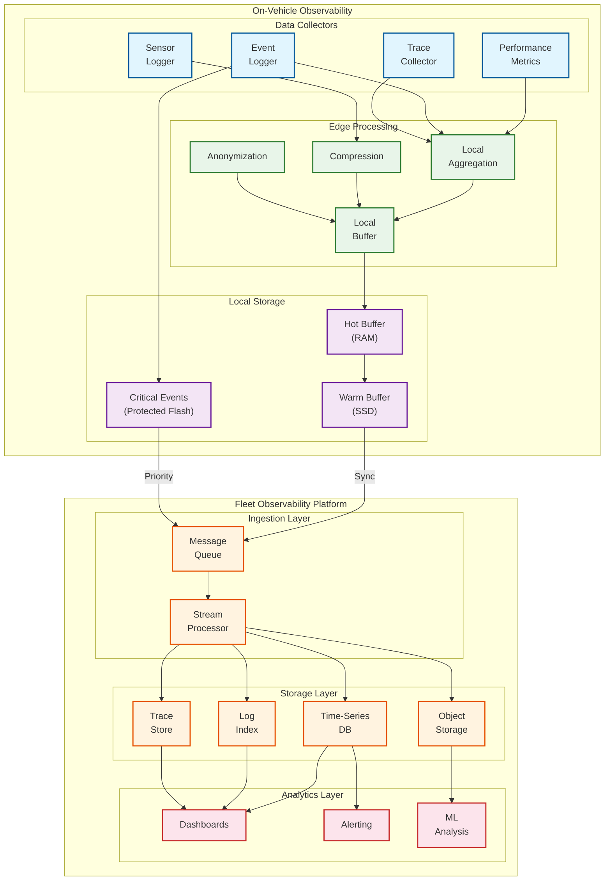
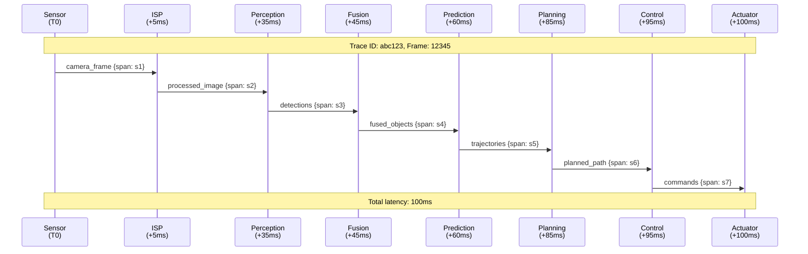
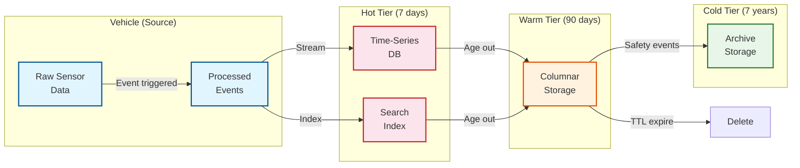

# Observability

## Observability Strategy

### The Three Pillars for AV Systems

Observability in autonomous vehicles presents unique challenges compared to traditional software systems:

| Challenge | Implication | Approach |
|-----------|-------------|----------|
| **Real-Time Constraints** | Cannot impact driving performance | Asynchronous, lock-free logging |
| **Safety-Critical** | Must capture all safety events | Write-ahead logging, battery backup |
| **Data Volume** | 1.6 GB/s sensor data | Selective logging, edge compression |
| **Privacy** | Contains PII (faces, locations) | On-device anonymization |
| **Offline Operation** | No guaranteed connectivity | Local buffering, sync when connected |
| **Regulatory** | 7-year retention for safety | Tamper-evident, long-term storage |

### Observability Architecture



---

## Metrics

### Perception Metrics

| Metric | Description | Target | Alert Threshold |
|--------|-------------|--------|-----------------|
| `perception.latency_ms` | Frame processing time | P50 < 35ms | P99 > 55ms |
| `perception.detection_rate` | Objects detected / ground truth | > 95% | < 90% |
| `perception.false_positive_rate` | Phantom detections / total | < 0.5% | > 1% |
| `perception.tracking_continuity` | Tracks maintained across frames | > 99% | < 95% |
| `perception.fusion_confidence` | Sensor agreement score | > 0.9 | < 0.7 |
| `perception.sensor_health` | Sensor operational status | All healthy | Any degraded |

### Prediction Metrics

| Metric | Description | Target | Alert Threshold |
|--------|-------------|--------|-----------------|
| `prediction.latency_ms` | Prediction computation time | P50 < 15ms | P99 > 25ms |
| `prediction.min_ade_3s` | Min Average Displacement Error | < 1.5m | > 2.5m |
| `prediction.min_fde_3s` | Min Final Displacement Error | < 3.0m | > 4.5m |
| `prediction.miss_rate` | Predictions > 2m from truth | < 15% | > 25% |
| `prediction.calibration_error` | Expected vs observed confidence | ECE < 0.05 | > 0.1 |
| `prediction.coverage` | Ground truth covered by modes | > 90% | < 80% |

### Planning Metrics

| Metric | Description | Target | Alert Threshold |
|--------|-------------|--------|-----------------|
| `planning.cycle_time_ms` | Planning iteration time | < 100ms | > 120ms |
| `planning.valid_trajectory_rate` | Valid trajectories / attempts | > 99.9% | < 99% |
| `planning.comfort_score` | Based on jerk, accel | > 0.8 | < 0.6 |
| `planning.safety_margin` | Min distance to obstacles | > 2m | < 1m |
| `planning.route_adherence` | Following intended route | > 99% | < 95% |
| `planning.fallback_activations` | Fallback per hour | < 0.01 | > 0.1 |

### Control Metrics

| Metric | Description | Target | Alert Threshold |
|--------|-------------|--------|-----------------|
| `control.lateral_error_m` | Distance from planned path | < 0.1m | > 0.3m |
| `control.heading_error_rad` | Angle from planned heading | < 0.05 rad | > 0.1 rad |
| `control.velocity_error_mps` | Speed tracking error | < 0.5 m/s | > 1.5 m/s |
| `control.mpc_solve_time_ms` | QP solver time | < 5ms | > 10ms |
| `control.actuator_latency_ms` | Command to actuation | < 20ms | > 50ms |

### Safety Metrics

| Metric | Description | Target | Alert Threshold |
|--------|-------------|--------|-----------------|
| `safety.disengagements_per_1000mi` | Manual takeovers | < 0.1 | > 0.5 |
| `safety.aeb_activations` | Emergency braking events | Track all | Investigate all |
| `safety.near_miss_events` | TTC < 1s without contact | 0 | Any |
| `safety.fallback_activations` | Safety fallback triggered | < 0.01/hr | > 0.1/hr |
| `safety.mrc_events` | Minimal Risk Condition | 0 | Any |
| `safety.collisions` | Any contact events | 0 | Any |

### System Health Metrics

| Metric | Description | Target | Alert Threshold |
|--------|-------------|--------|-----------------|
| `system.cpu_utilization` | Primary SoC CPU | < 70% | > 85% |
| `system.gpu_utilization` | Primary SoC GPU | < 80% | > 90% |
| `system.memory_utilization` | RAM usage | < 80% | > 90% |
| `system.temperature_c` | SoC junction temperature | < 85°C | > 95°C |
| `system.power_w` | Total compute power | < 150W | > 180W |
| `system.storage_available_gb` | Free SSD space | > 20GB | < 10GB |

---

## Logging

### Event Categories

| Category | Level | Retention | Contents | Storage |
|----------|-------|-----------|----------|---------|
| **SAFETY** | Critical | 7 years | Collisions, near-misses, AEB, MRC | Protected flash + cloud |
| **DISENGAGEMENT** | High | 7 years | Manual takeovers, fallback events | Flash + cloud |
| **ANOMALY** | High | 90 days | Sensor failures, perception anomalies | SSD + cloud |
| **OPERATIONAL** | Medium | 30 days | Route changes, passenger interactions | SSD + cloud |
| **DIAGNOSTIC** | Low | 7 days | Component health, performance stats | SSD, selective cloud |
| **DEBUG** | Trace | 24 hours | Detailed processing info | RAM circular buffer |

### Log Format (Structured JSON)

```json
{
  "timestamp_ns": 1706000000000000000,
  "timestamp_utc": "2026-01-23T12:00:00.000Z",
  "vehicle_id": "AV-001234",
  "software_version": "2.4.1-release",

  "module": "perception.detection",
  "level": "INFO",
  "event_type": "OBJECT_DETECTED",

  "data": {
    "object_id": 42,
    "class": "PEDESTRIAN",
    "confidence": 0.94,
    "position": {"x": 15.3, "y": -2.1, "z": 0.0},
    "velocity": {"x": 1.2, "y": 0.0, "z": 0.0},
    "distance_m": 15.5,
    "ttc_s": 12.9
  },

  "context": {
    "ego_velocity_mps": 8.3,
    "ego_position": {"lat": 37.4220, "lon": -122.0841},
    "weather": "CLEAR",
    "lighting": "DAYLIGHT",
    "road_type": "URBAN"
  },

  "trace_id": "abc123def456",
  "span_id": "span789"
}
```

### Safety Event Log (Extended)

```json
{
  "timestamp_ns": 1706000000000000000,
  "vehicle_id": "AV-001234",

  "event_type": "AEB_ACTIVATION",
  "severity": "CRITICAL",

  "trigger": {
    "object_id": 42,
    "object_class": "PEDESTRIAN",
    "ttc_at_trigger_s": 0.8,
    "distance_at_trigger_m": 8.5,
    "relative_velocity_mps": 10.6
  },

  "ego_state_at_trigger": {
    "velocity_mps": 10.6,
    "acceleration_mps2": -0.5,
    "steering_angle_rad": 0.02,
    "position": {"lat": 37.4220, "lon": -122.0841},
    "heading_rad": 1.57
  },

  "response": {
    "commanded_decel_mps2": -8.0,
    "response_time_ms": 45,
    "stopping_distance_m": 7.0,
    "outcome": "COLLISION_AVOIDED"
  },

  "sensor_snapshot": {
    "cameras": ["snapshot_cam_front_0001.jpg"],
    "lidar": ["snapshot_lidar_0001.pcd"],
    "radar": ["snapshot_radar_0001.json"]
  },

  "perception_state": {
    "all_objects": [...],
    "occupancy_grid": "snapshot_occupancy_0001.bin"
  }
}
```

### Log Retention Policy

```yaml
retention_policy:
  safety_events:
    local_retention: 90 days
    cloud_retention: 7 years
    replication: 3 copies, 2 regions
    encryption: AES-256, immutable

  disengagements:
    local_retention: 30 days
    cloud_retention: 7 years
    trigger: Automatic on event

  diagnostic:
    local_retention: 7 days
    cloud_retention: 90 days
    sampling: 100% for anomalies, 10% routine

  debug:
    local_retention: 24 hours (circular buffer)
    cloud_retention: On-demand only
    trigger: Manual or anomaly-triggered dump
```

---

## Distributed Tracing

### Trace Pipeline



### Trace Schema

```yaml
trace:
  trace_id: "abc123def456"
  frame_id: 12345
  start_time_ns: 1706000000000000000

  spans:
    - span_id: "s1_sensor"
      parent_id: null
      operation: "sensor_capture"
      start_offset_ms: 0
      duration_ms: 1
      attributes:
        sensor_type: "camera"
        camera_id: "front_center"

    - span_id: "s2_isp"
      parent_id: "s1_sensor"
      operation: "image_processing"
      start_offset_ms: 1
      duration_ms: 4
      attributes:
        resolution: "1920x1080"

    - span_id: "s3_perception"
      parent_id: "s2_isp"
      operation: "perception_inference"
      start_offset_ms: 5
      duration_ms: 30
      attributes:
        model_version: "det_v2.4"
        objects_detected: 12
        gpu_time_ms: 22

    - span_id: "s4_fusion"
      parent_id: "s3_perception"
      operation: "sensor_fusion"
      start_offset_ms: 35
      duration_ms: 10
      attributes:
        modalities_fused: ["camera", "lidar", "radar"]
        fusion_confidence: 0.95

    - span_id: "s5_prediction"
      parent_id: "s4_fusion"
      operation: "trajectory_prediction"
      start_offset_ms: 45
      duration_ms: 15
      attributes:
        agents_predicted: 8
        modes_per_agent: 6

    - span_id: "s6_planning"
      parent_id: "s5_prediction"
      operation: "motion_planning"
      start_offset_ms: 60
      duration_ms: 25
      attributes:
        candidates_evaluated: 35
        selected_cost: 12.5

    - span_id: "s7_control"
      parent_id: "s6_planning"
      operation: "vehicle_control"
      start_offset_ms: 85
      duration_ms: 10
      attributes:
        mpc_iterations: 3
        steering_command_rad: 0.05

  total_latency_ms: 95
  latency_status: "OK"  # OK, WARNING, CRITICAL
```

### Latency Analysis Queries

```sql
-- Find frames with high E2E latency
SELECT
  trace_id,
  frame_id,
  total_latency_ms,
  MAX(CASE WHEN operation = 'perception_inference' THEN duration_ms END) as perception_ms,
  MAX(CASE WHEN operation = 'motion_planning' THEN duration_ms END) as planning_ms
FROM traces
WHERE timestamp > NOW() - INTERVAL '1 hour'
  AND total_latency_ms > 100
ORDER BY total_latency_ms DESC
LIMIT 100;

-- Identify bottleneck stages
SELECT
  operation,
  AVG(duration_ms) as avg_ms,
  PERCENTILE_CONT(0.50) WITHIN GROUP (ORDER BY duration_ms) as p50_ms,
  PERCENTILE_CONT(0.95) WITHIN GROUP (ORDER BY duration_ms) as p95_ms,
  PERCENTILE_CONT(0.99) WITHIN GROUP (ORDER BY duration_ms) as p99_ms
FROM spans
WHERE timestamp > NOW() - INTERVAL '1 hour'
GROUP BY operation
ORDER BY p99_ms DESC;
```

---

## Alerting

### Alert Severity Levels

| Severity | Response Time | Notification | Example |
|----------|---------------|--------------|---------|
| **P1 (Critical)** | Immediate | Page on-call, escalate | Collision, fleet-wide issue |
| **P2 (High)** | 1 hour | Page on-call | Safety metric degradation |
| **P3 (Medium)** | 4 hours | Slack notification | Performance regression |
| **P4 (Low)** | Next business day | Email | Minor anomaly |

### Alert Definitions

```yaml
alerts:
  # P1 - Critical
  - name: CollisionDetected
    severity: P1
    condition: safety.collisions > 0
    for: 0s  # Immediate
    labels:
      team: safety
    actions:
      - page_oncall
      - create_incident
      - preserve_vehicle_logs
      - notify_leadership

  - name: FleetWidePerceptionDegradation
    severity: P1
    condition: avg(perception.detection_rate) < 0.85 FOR 5m
    labels:
      team: perception
    actions:
      - page_oncall
      - check_for_software_regression

  # P2 - High
  - name: HighDisengagementRate
    severity: P2
    condition: rate(safety.disengagements[1h]) > 0.5 per 1000 miles
    for: 30m
    labels:
      team: autonomy
    actions:
      - page_oncall
      - investigate_root_cause

  - name: PerceptionLatencyHigh
    severity: P2
    condition: perception.latency_ms:p99 > 70
    for: 15m
    labels:
      team: perception
    actions:
      - notify_channel
      - check_compute_health

  # P3 - Medium
  - name: PredictionAccuracyDegraded
    severity: P3
    condition: prediction.min_ade_3s > 2.0
    for: 1h
    labels:
      team: prediction
    actions:
      - notify_channel
      - schedule_investigation

  - name: StorageNearCapacity
    severity: P3
    condition: system.storage_available_gb < 15
    for: 30m
    labels:
      team: platform
    actions:
      - notify_channel
      - trigger_log_rotation

  # P4 - Low
  - name: MinorSensorAnomaly
    severity: P4
    condition: count(sensor.anomaly_events[1h]) > 10
    for: 1h
    labels:
      team: sensors
    actions:
      - create_ticket
```

### Runbook Reference

| Alert | Runbook | Key Steps |
|-------|---------|-----------|
| `CollisionDetected` | `runbooks/collision.md` | 1. Confirm incident 2. Secure logs 3. Preserve physical evidence 4. Notify stakeholders |
| `HighDisengagementRate` | `runbooks/disengagement.md` | 1. Identify vehicles affected 2. Check software version 3. Analyze patterns 4. Consider rollback |
| `PerceptionLatencyHigh` | `runbooks/perception_latency.md` | 1. Check GPU health 2. Verify model version 3. Analyze trace bottlenecks 4. Consider compute scaling |

---

## Dashboards

### Fleet Operations Dashboard

| Panel | Visualization | Data Source | Refresh |
|-------|---------------|-------------|---------|
| **Fleet Map** | Geo map with vehicle locations | Live telemetry | 5s |
| **Active Vehicles** | Counter | Heartbeat service | 10s |
| **System Health** | Status grid (green/yellow/red) | Aggregated metrics | 30s |
| **Disengagement Trend** | Time series | Safety database | 1m |
| **Active Alerts** | Alert list | Alertmanager | 10s |
| **OTA Rollout Status** | Progress bar | OTA service | 30s |

### Safety Dashboard

| Panel | Visualization | Description |
|-------|---------------|-------------|
| **Collision Events** | Counter + timeline | All collision events with details |
| **Near-Miss Heatmap** | Geo heatmap | Geographic distribution of near-misses |
| **Disengagement by Cause** | Pie chart | Breakdown by root cause |
| **AEB Activations** | Time series | Emergency braking over time |
| **Safety Margin Distribution** | Histogram | Closest approach distances |
| **TTC Distribution** | Histogram | Time-to-collision metrics |

### Performance Dashboard

| Panel | Visualization | Description |
|-------|---------------|-------------|
| **E2E Latency Histogram** | Heatmap | Latency distribution over time |
| **Pipeline Stage Latency** | Stacked area | Per-stage breakdown |
| **Detection Accuracy** | Time series | mAP trend |
| **Prediction Error** | Time series | ADE/FDE trend |
| **Compute Utilization** | Line chart | CPU/GPU/memory usage |
| **Thermal Status** | Gauge | Current temperatures |

### Individual Vehicle Dashboard

| Panel | Visualization | Description |
|-------|---------------|-------------|
| **Live Camera Feed** | Video (opt-in) | Current perception view |
| **3D Scene Visualization** | 3D view | Detections, predictions, plan |
| **Recent Events** | Event log | Last 100 events |
| **Sensor Status** | Status indicators | Per-sensor health |
| **Current Metrics** | Gauge array | Key real-time metrics |
| **Trip Summary** | Statistics | Distance, time, events |

---

## Data Retention and Archival

### Retention Schedule

| Data Type | Hot (Query) | Warm (Archive) | Cold (Compliance) |
|-----------|-------------|----------------|-------------------|
| **Metrics** | 30 days | 1 year | 7 years (aggregated) |
| **Logs (routine)** | 7 days | 90 days | N/A |
| **Logs (safety)** | 90 days | 7 years | 7 years |
| **Traces** | 7 days | 30 days | On-demand |
| **Sensor snapshots** | 7 days | 90 days (events only) | 7 years (safety) |
| **Full sensor logs** | N/A (not uploaded) | N/A | On-demand retrieval |

### Data Lifecycle


