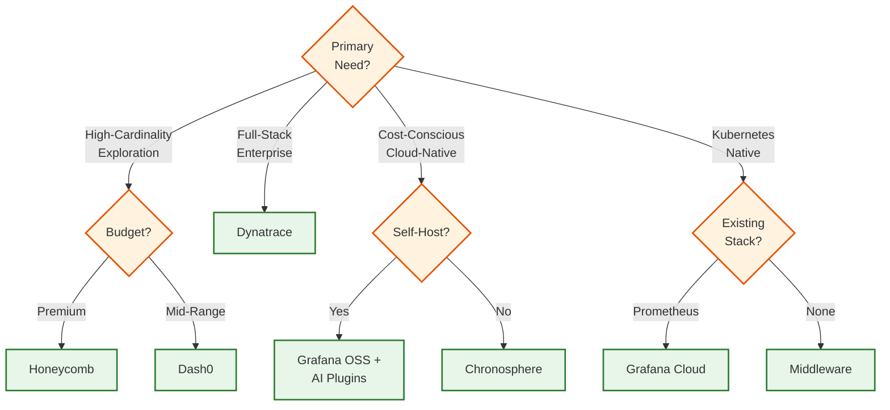
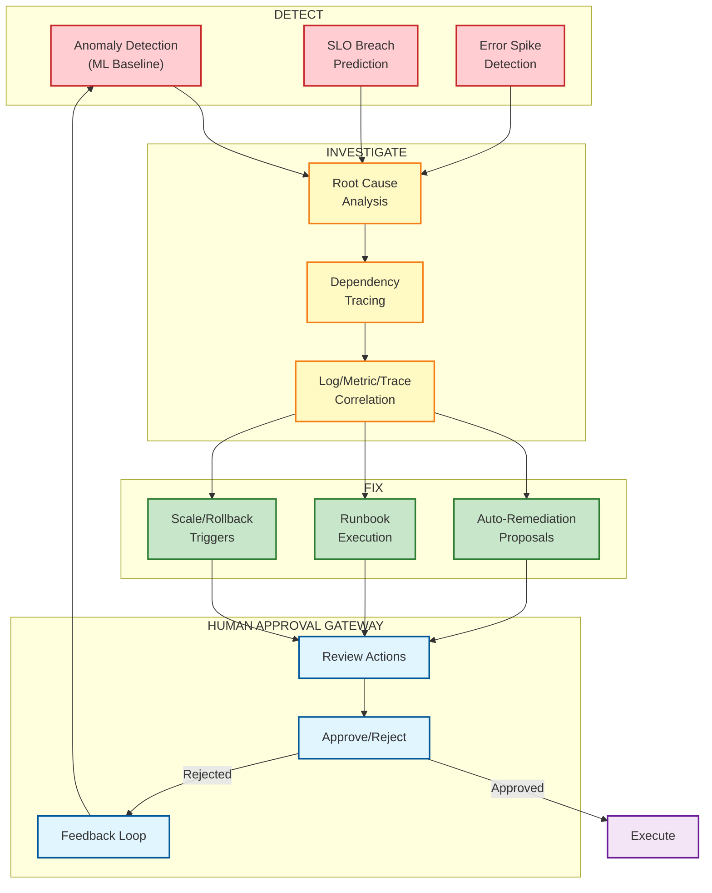
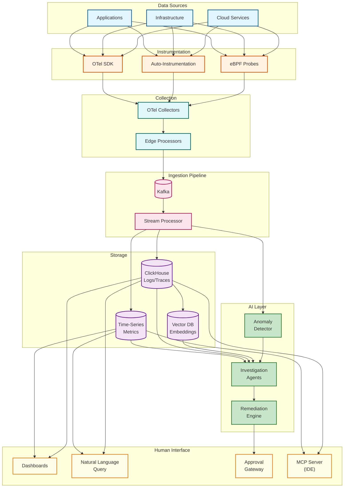

# AI-Native Proactive Observability Platform

## System Overview

An AI-Native Proactive Observability Platform represents a fundamental paradigm shift from traditional monitoring to autonomous, intelligent observability. Built on OpenTelemetry's unified telemetry (metrics, logs, traces), these platforms use AI agents to automatically detect anomalies, investigate root causes, and execute remediation with human approval.

The key transformation is that **engineers become supervisors rather than firefighters**. Instead of manually sifting through dashboards during incidents, engineers oversee AI agents that proactively identify issues before customer impact, correlate signals across the stack, and propose fixes that await human approval before execution.

**Reference Platforms:** Honeycomb (Canvas), Dynatrace (Davis AI), Grafana (AI Assistant), Dash0 (Agent0), Chronosphere, Middleware

**Complexity Rating:** `High`

---

## Quick Navigation

| Document | Description |
|----------|-------------|
| [01 - Requirements & Estimations](./01-requirements-and-estimations.md) | Functional/non-functional requirements, cardinality challenges, scale |
| [02 - High-Level Design](./02-high-level-design.md) | OpenTelemetry pipeline, AI inference layer, agent orchestration |
| [03 - Low-Level Design](./03-low-level-design.md) | Data models, correlation schema, anomaly models, APIs |
| [04 - Deep Dive & Bottlenecks](./04-deep-dive-and-bottlenecks.md) | High-cardinality, ML baseline drift, multi-agent coordination |
| [05 - Scalability & Reliability](./05-scalability-and-reliability.md) | Collector scaling, AI inference, global distribution |
| [06 - Security & Compliance](./06-security-and-compliance.md) | PII handling, access control, audit trails, SOC2/GDPR |
| [07 - Observability](./07-observability.md) | Meta-observability (observing the observer), AI model health |
| [08 - Interview Guide](./08-interview-guide.md) | Pacing, trap questions, trade-off discussions |

---

## The Paradigm Shift: Engineers as Supervisors

```
┌─────────────────────────────────────────────────────────────────────────┐
│                    TRADITIONAL VS AI-NATIVE OBSERVABILITY               │
├─────────────────────────────────────────────────────────────────────────┤
│                                                                         │
│  TRADITIONAL (Reactive)              AI-NATIVE (Proactive)              │
│  ─────────────────────               ──────────────────────             │
│                                                                         │
│  Alert fires → Engineer wakes up     AI detects anomaly before alert    │
│       ↓                                     ↓                           │
│  Manual dashboard browsing           Autonomous investigation           │
│       ↓                                     ↓                           │
│  Trial-and-error debugging           AI correlates across signals       │
│       ↓                                     ↓                           │
│  Identify root cause (30-60 min)     Root cause + proposed fix          │
│       ↓                                     ↓                           │
│  Manual remediation                  Human approves → Auto-remediate    │
│       ↓                                     ↓                           │
│  Post-incident review                Continuous learning feedback       │
│                                                                         │
│  MTTR: 30-60 minutes                 MTTR: 2-5 minutes                  │
│  Engineer: Firefighter               Engineer: Supervisor               │
│                                                                         │
└─────────────────────────────────────────────────────────────────────────┘
```

---

## Key Characteristics

| Characteristic | Description |
|----------------|-------------|
| **OpenTelemetry-Native** | Built on OTel unified telemetry (metrics, logs, traces) with OTLP protocol and semantic conventions |
| **High-Cardinality First** | Designed for arbitrary dimensions per event, not just predefined metrics; enables exploration |
| **Autonomous Agents** | AI agents that detect, investigate, and propose fixes autonomously |
| **Human-in-the-Loop** | Critical actions require human approval; engineers supervise rather than execute |
| **Proactive Detection** | ML learns "normal" baselines and surfaces deviations before customer impact |
| **Correlation Engine** | Automatically links metrics, logs, and traces via TraceID/SpanID/CorrelationID |
| **Query-Driven Exploration** | Explore data with ad-hoc queries instead of predefined dashboards |
| **IDE Integration** | MCP servers enable AI-powered debugging directly in IDEs (Claude Code, Cursor) |

---

## Platform Comparison (2025-2026)

| Platform | AI Capability | OTel Support | Cardinality | Autonomous Fix | Deployment |
|----------|---------------|--------------|-------------|----------------|------------|
| **Honeycomb** | Canvas (co-pilot), BubbleUp | Native | Excellent | Via MCP/IDE | SaaS |
| **Dynatrace** | Davis AI (deterministic) | Native | Good | Yes (Davis CoPilot) | SaaS/On-prem |
| **Grafana Cloud** | AI Assistant, Sift | Native | Good | Partial | SaaS/OSS |
| **Dash0** | Agent0 (guild of agents) | Native | Excellent | Yes | SaaS |
| **Chronosphere** | Telemetry Pipeline | Native | Excellent | No | SaaS |
| **Middleware** | Ops AI Co-Pilot | Native | Good | Yes | SaaS |
| **New Relic** | AI Monitoring | Native | Good | Partial | SaaS |

### Platform Selection Decision Tree



---

## Autonomous Agent Architecture

The core innovation is the **Detect → Investigate → Fix** pipeline with human approval gates:



---

## OpenTelemetry Foundation

The platform is built on the three pillars of observability, unified through OpenTelemetry:

### The Three Pillars + Correlation

| Pillar | What It Captures | Key Attributes | Storage |
|--------|------------------|----------------|---------|
| **Metrics** | Aggregated measurements (counters, gauges, histograms) | `service.name`, `http.status_code`, custom dimensions | Time-series DB (Prometheus, InfluxDB) |
| **Logs** | Discrete events with structured/unstructured data | `trace_id`, `span_id`, `severity`, `message` | Columnar (ClickHouse) or Search (OpenSearch) |
| **Traces** | Distributed request flow across services | `trace_id`, `span_id`, `parent_span_id`, timing | Columnar (ClickHouse, Jaeger) |

### Correlation: The Magic Glue

```
┌────────────────────────────────────────────────────────────────┐
│                     CORRELATION CONTEXT                        │
├────────────────────────────────────────────────────────────────┤
│                                                                │
│  trace_id: abc123def456                                        │
│  span_id: span789                                              │
│  parent_span_id: span456                                       │
│  service.name: checkout-service                                │
│  user.id: user_42                                              │
│  request.id: req_xyz                                           │
│                                                                │
│  ┌─────────┐     ┌─────────┐     ┌─────────┐                  │
│  │ METRICS │────▶│ TRACES  │◀────│  LOGS   │                  │
│  │ p99=2.3s│     │ span:   │     │ ERROR:  │                  │
│  │ errors: │     │ 2100ms  │     │ timeout │                  │
│  │ 5/sec   │     │         │     │         │                  │
│  └─────────┘     └─────────┘     └─────────┘                  │
│       │               │               │                        │
│       └───────────────┼───────────────┘                        │
│                       ▼                                        │
│              UNIFIED INVESTIGATION                             │
│              "Why is checkout slow?"                           │
│                                                                │
└────────────────────────────────────────────────────────────────┘
```

---

## Core Capabilities

### 1. Proactive Anomaly Detection

| Method | Description | Use Case |
|--------|-------------|----------|
| **ML Baseline Learning** | Learns "normal" patterns per service/endpoint | Detect deviations without manual thresholds |
| **Multidimensional Baselining** | Baselines across multiple dimensions (time, geography, user segment) | Handle complex seasonality |
| **Dynamic Thresholds** | Thresholds adjust based on learned patterns | Reduce false positives |
| **Predictive Alerts** | Forecast breaches before they happen | Prevent customer impact |

### 2. AI-Powered Debugging

| Capability | Description |
|------------|-------------|
| **BubbleUp Correlation** | Automatically identify dimensions that explain anomalies (Honeycomb) |
| **Root Cause Graphs** | Visual dependency tracing to pinpoint failure origin |
| **Natural Language Queries** | "Why are checkout errors increasing?" → AI investigates |
| **Code-Level Attribution** | Link issues to specific code changes/deployments |

### 3. Autonomous Remediation (with Human Approval)

| Action Type | Example | Approval Level |
|-------------|---------|----------------|
| **Informational** | Create incident ticket | Auto-approved |
| **Low Risk** | Scale up replicas | Single approver |
| **Medium Risk** | Rollback deployment | Team lead approval |
| **High Risk** | Database failover | SRE + Manager approval |

### 4. IDE Integration (MCP Servers)

Modern platforms expose observability data to AI-powered IDEs:

| Platform | Integration | Capabilities |
|----------|-------------|--------------|
| **Honeycomb** | MCP Server | Query traces, analyze SLOs, visualize data in Claude Code/Cursor |
| **Grafana** | Plugin | Embed dashboards, query metrics from IDE |
| **Datadog** | Extension | View APM data, create monitors from IDE |

---

## Architecture Overview



---

## Key Metrics Reference

### Latency Targets

| Operation | P50 | P95 | P99 |
|-----------|-----|-----|-----|
| OTel SDK overhead | 1ms | 3ms | 5ms |
| Event ingestion (end-to-end) | 500ms | 2s | 5s |
| Anomaly detection latency | 10s | 30s | 60s |
| Query (recent data < 1h) | 50ms | 200ms | 500ms |
| Query (historical > 7d) | 500ms | 2s | 5s |
| AI investigation completion | 30s | 2min | 5min |
| Natural language query | 2s | 5s | 10s |

### Throughput Targets

| Metric | Target | Notes |
|--------|--------|-------|
| Event ingestion rate | 1M+ events/sec | Per cluster |
| Unique time series | 100M+ | High-cardinality support |
| Active traces | 10M+ concurrent | Long-running agent support |
| AI queries/sec | 1K+ | Natural language + programmatic |
| Remediation actions/hour | 100+ | With approval pipeline |

### Storage Efficiency

| Data Type | Compression | Retention (Default) |
|-----------|-------------|---------------------|
| Metrics | 10-15x | 13 months |
| Traces | 8-12x | 7-30 days |
| Logs | 5-10x | 30-90 days |
| AI Investigation History | 3-5x | 1 year |

---

## Interview Checklist

### Must Know
- [ ] OpenTelemetry architecture (SDK, Collector, OTLP, semantic conventions)
- [ ] Three pillars of observability and how correlation IDs link them
- [ ] High-cardinality problem and why traditional metrics systems struggle
- [ ] Difference between reactive monitoring and proactive observability
- [ ] Autonomous agent architecture: Detect → Investigate → Fix pipeline
- [ ] Why human approval is critical for autonomous remediation

### Should Know
- [ ] ML baseline learning for anomaly detection (vs static thresholds)
- [ ] BubbleUp-style automatic correlation analysis
- [ ] SLO-based reliability engineering (SLI, SLO, Error Budget)
- [ ] How MCP servers enable IDE integration for observability
- [ ] Trade-offs: Query speed vs storage cost vs cardinality

### Nice to Know
- [ ] Specific platform implementations (Honeycomb Canvas, Dynatrace Davis)
- [ ] eBPF-based instrumentation for zero-code observability
- [ ] Vector embeddings for semantic log search
- [ ] Multi-agent orchestration patterns (Dash0 Agent0 guild)

---

## Related Systems

| System | Relationship |
|--------|--------------|
| [15.1 Metrics & Monitoring System](../15.1-metrics-monitoring-system/00-index.md) | Traditional metrics infrastructure this system builds upon |
| [15.2 Distributed Tracing System](../15.2-distributed-tracing-system/00-index.md) | Core tracing patterns, span propagation |
| [15.3 Log Aggregation System](../15.3-log-aggregation-system/00-index.md) | Log ingestion and indexing fundamentals |
| [15.4 eBPF-based Observability Platform](../15.4-ebpf-observability-platform/00-index.md) | Zero-instrumentation data collection |
| [3.11 AIOps System](../3.11-aiops-system/00-index.md) | Automated remediation patterns |
| [3.25 AI Observability & LLMOps Platform](../3.25-ai-observability-llmops-platform/00-index.md) | LLM-specific observability |
| [3.24 Multi-Agent Orchestration Platform](../3.24-multi-agent-orchestration-platform/00-index.md) | Agent coordination patterns |

---

## References

### Platform Documentation
- [Honeycomb Platform](https://docs.honeycomb.io/)
- [Honeycomb Canvas & MCP](https://www.honeycomb.io/blog/honeycomb-introduces-developer-interface-future-with-ai-native-observability-suite)
- [Dynatrace Davis AI](https://docs.dynatrace.com/docs/platform/davis-ai)
- [Grafana AI Tools](https://grafana.com/products/cloud/ai-tools-for-observability/)
- [Dash0 Agent0](https://www.dash0.com/)
- [Chronosphere](https://chronosphere.io/docs/)

### Standards
- [OpenTelemetry Documentation](https://opentelemetry.io/docs/)
- [OpenTelemetry Semantic Conventions](https://opentelemetry.io/docs/specs/semconv/)
- [OTLP Specification](https://opentelemetry.io/docs/specs/otlp/)

### Industry Analysis
- [CNCF: OpenTelemetry Unified Observability 2025](https://www.cncf.io/blog/2025/11/27/from-chaos-to-clarity-how-opentelemetry-unified-observability-across-clouds/)
- [Gartner Magic Quadrant for Observability 2025](https://www.gartner.com/en/documents/5605595)
- [AI Observability Trends 2026 - Middleware](https://middleware.io/blog/how-ai-based-insights-can-change-the-observability/)
