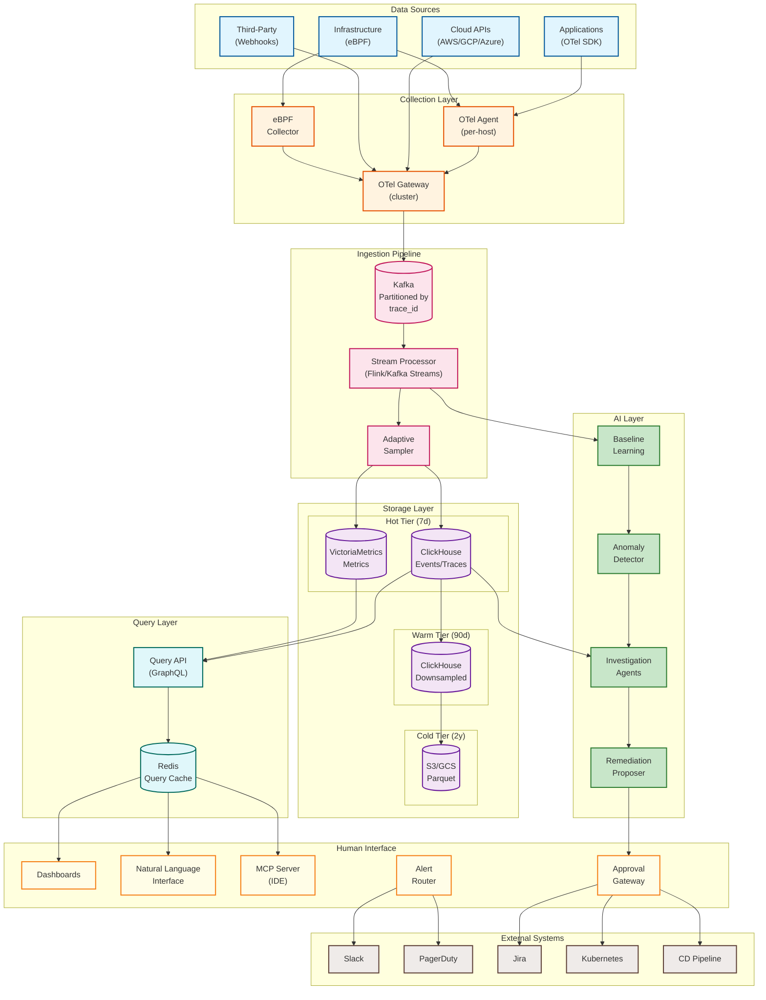
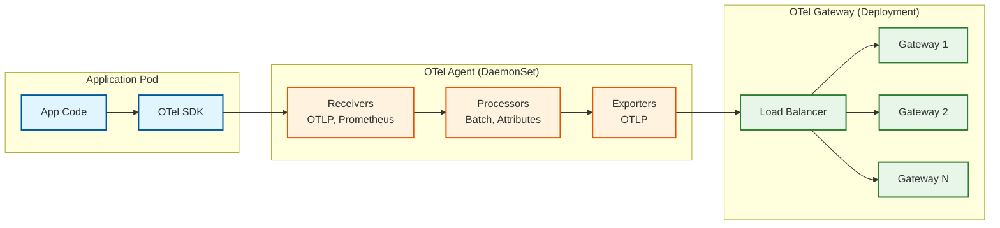
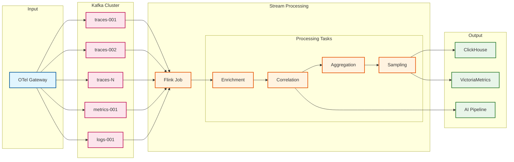
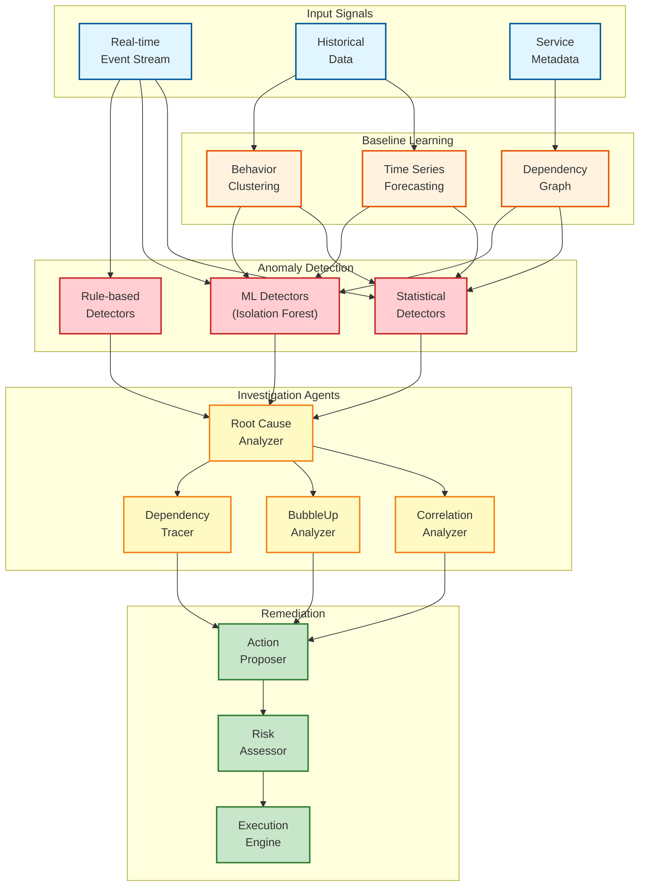
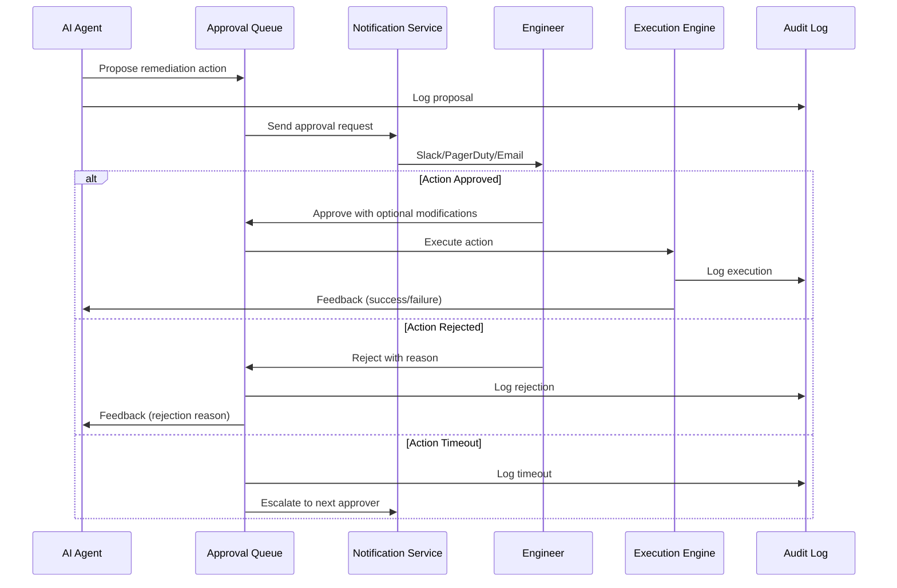
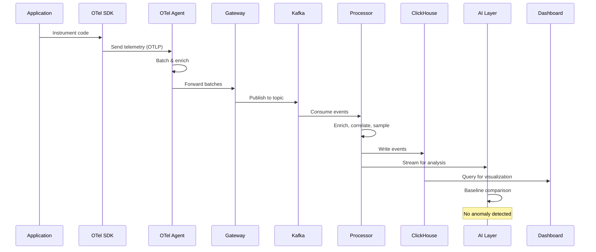
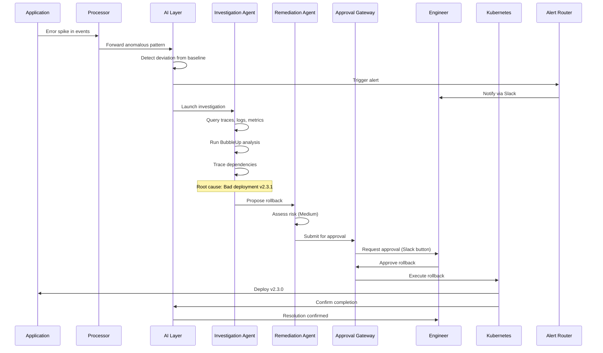
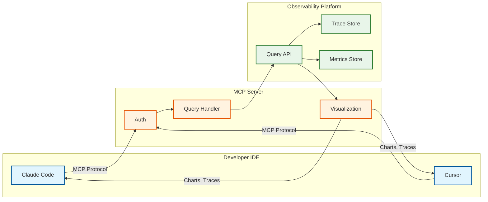

[← Back to Index](./00-index.md)

# High-Level Design

## System Architecture



---

## Component Overview

### 1. Data Sources

| Source Type | Protocol | Data Type | Example |
|-------------|----------|-----------|---------|
| **Applications** | OTLP (gRPC/HTTP) | Traces, Logs, Metrics | Java app with OTel SDK |
| **Infrastructure** | eBPF, OTLP | System metrics, Network traces | Linux kernel events |
| **Cloud APIs** | REST/Webhooks | Cloud events, Audit logs | AWS CloudTrail, GCP Audit |
| **Third-Party** | Webhooks, APIs | Deployment events, Incidents | GitHub, PagerDuty |

### 2. Collection Layer



**OTel Collector Configuration:**

```yaml
receivers:
  otlp:
    protocols:
      grpc:
        endpoint: 0.0.0.0:4317
      http:
        endpoint: 0.0.0.0:4318

processors:
  batch:
    timeout: 1s
    send_batch_size: 1000
  attributes:
    actions:
      - key: deployment.environment
        value: production
        action: upsert
  resource:
    attributes:
      - key: service.instance.id
        from_attribute: host.name
        action: upsert

exporters:
  otlp:
    endpoint: gateway.observability:4317
    compression: zstd

service:
  pipelines:
    traces:
      receivers: [otlp]
      processors: [batch, attributes, resource]
      exporters: [otlp]
    metrics:
      receivers: [otlp]
      processors: [batch, resource]
      exporters: [otlp]
    logs:
      receivers: [otlp]
      processors: [batch, attributes]
      exporters: [otlp]
```

### 3. Ingestion Pipeline



**Key Processing Steps:**

| Step | Purpose | Example |
|------|---------|---------|
| **Enrichment** | Add metadata (geo, service graph) | Add `region: us-west-2` based on IP |
| **Correlation** | Link metrics/logs to traces | Attach `trace_id` to log records |
| **Aggregation** | Pre-compute common aggregates | P50/P95/P99 latency per endpoint |
| **Sampling** | Reduce storage while keeping interesting data | Keep 100% errors, sample 1% success |

### 4. Storage Layer

#### Tiered Storage Architecture

```
┌─────────────────────────────────────────────────────────────────┐
│                        STORAGE TIERS                            │
├─────────────────────────────────────────────────────────────────┤
│                                                                 │
│  HOT TIER (7 days)                                              │
│  ├── ClickHouse (Events/Traces)                                 │
│  │   - Full resolution                                          │
│  │   - NVMe SSD storage                                         │
│  │   - P99 query < 500ms                                        │
│  └── VictoriaMetrics (Metrics)                                  │
│      - Full resolution time series                              │
│      - Optimized for range queries                              │
│                                                                 │
│  WARM TIER (90 days)                                            │
│  └── ClickHouse (Downsampled)                                   │
│      - 10x downsampled (1min → 10min resolution)                │
│      - HDD storage                                              │
│      - P99 query < 5s                                           │
│                                                                 │
│  COLD TIER (2 years)                                            │
│  └── Object Storage (Parquet)                                   │
│      - 100x downsampled (1min → 1hr resolution)                 │
│      - S3/GCS                                                   │
│      - Query via Spark/Trino                                    │
│                                                                 │
└─────────────────────────────────────────────────────────────────┘
```

#### ClickHouse Schema

```sql
-- Events table (wide events with high cardinality)
CREATE TABLE events (
    timestamp DateTime64(3),
    trace_id String,
    span_id String,
    parent_span_id String,
    service_name LowCardinality(String),
    operation_name String,
    duration_ns UInt64,
    status_code LowCardinality(String),

    -- High-cardinality dimensions stored as Map
    attributes Map(String, String),

    -- Numeric attributes for aggregations
    numeric_attributes Map(String, Float64),

    -- Resource attributes
    resource_attributes Map(String, String),

    -- Correlation
    correlation_id String,

    INDEX idx_trace_id trace_id TYPE bloom_filter GRANULARITY 1,
    INDEX idx_service service_name TYPE set(100) GRANULARITY 1
)
ENGINE = MergeTree()
PARTITION BY toDate(timestamp)
ORDER BY (service_name, operation_name, timestamp)
TTL timestamp + INTERVAL 7 DAY TO VOLUME 'warm',
    timestamp + INTERVAL 90 DAY TO VOLUME 'cold'
SETTINGS index_granularity = 8192;
```

### 5. AI Layer



### 6. Human Approval Workflow



**Approval Tiers:**

| Risk Level | Examples | Required Approvers | Timeout |
|------------|----------|-------------------|---------|
| **Info** | Create ticket, send notification | Auto-approved | - |
| **Low** | Scale up pods, increase limits | Any team member | 15 min |
| **Medium** | Rollback deployment, restart service | Team lead | 30 min |
| **High** | Database failover, drain node | SRE + Manager | 1 hour |
| **Critical** | Multi-region failover | VP Engineering | 2 hours |

---

## Data Flow: End-to-End

### Normal Operation Flow



### Incident Detection Flow



---

## OpenTelemetry Integration

### Collector Deployment Patterns

| Pattern | Use Case | Pros | Cons |
|---------|----------|------|------|
| **No Collector (Direct)** | Development | Simple setup | No batching, no reliability |
| **Agent (DaemonSet)** | Production K8s | Local buffering, low latency | Resource overhead per node |
| **Gateway (Deployment)** | Centralized processing | Easier management | Single point of failure |
| **Agent + Gateway** | Enterprise | Best of both | More complex |

### Recommended Pattern: Agent + Gateway

```
┌─────────────────────────────────────────────────────────────────┐
│                     KUBERNETES CLUSTER                          │
├─────────────────────────────────────────────────────────────────┤
│                                                                 │
│  Node 1                    Node 2                    Node N     │
│  ┌─────────────────┐      ┌─────────────────┐      ┌─────────┐ │
│  │ App Pod 1       │      │ App Pod 3       │      │ ...     │ │
│  │ App Pod 2       │      │ App Pod 4       │      │         │ │
│  │ OTel Agent      │      │ OTel Agent      │      │ Agent   │ │
│  │ (DaemonSet)     │      │ (DaemonSet)     │      │         │ │
│  └────────┬────────┘      └────────┬────────┘      └────┬────┘ │
│           │                        │                     │      │
│           └────────────────────────┼─────────────────────┘      │
│                                    ▼                            │
│                         ┌──────────────────┐                    │
│                         │ OTel Gateway     │                    │
│                         │ (Deployment,     │                    │
│                         │  3 replicas)     │                    │
│                         └────────┬─────────┘                    │
│                                  │                              │
└──────────────────────────────────┼──────────────────────────────┘
                                   │
                                   ▼
                          ┌────────────────┐
                          │ Kafka / Backend │
                          └────────────────┘
```

### Correlation Context Propagation

```
┌─────────────────────────────────────────────────────────────────┐
│                    TRACE CONTEXT PROPAGATION                    │
├─────────────────────────────────────────────────────────────────┤
│                                                                 │
│  Service A (Frontend)                                           │
│  ┌─────────────────────────────────────────────────────────┐   │
│  │ trace_id: abc123                                         │   │
│  │ span_id: span_001                                        │   │
│  │ baggage: {user_id: u42, session_id: sess789}             │   │
│  └─────────────────────────────────────────────────────────┘   │
│                          │                                      │
│                          │ HTTP Header:                         │
│                          │ traceparent: 00-abc123-span_001-01   │
│                          │ baggage: user_id=u42,session_id=...  │
│                          ▼                                      │
│  Service B (API)                                                │
│  ┌─────────────────────────────────────────────────────────┐   │
│  │ trace_id: abc123 (inherited)                             │   │
│  │ span_id: span_002                                        │   │
│  │ parent_span_id: span_001                                 │   │
│  │ baggage: {user_id: u42, session_id: sess789}             │   │
│  └─────────────────────────────────────────────────────────┘   │
│                          │                                      │
│                          ▼                                      │
│  Service C (Database)                                           │
│  ┌─────────────────────────────────────────────────────────┐   │
│  │ trace_id: abc123 (inherited)                             │   │
│  │ span_id: span_003                                        │   │
│  │ parent_span_id: span_002                                 │   │
│  └─────────────────────────────────────────────────────────┘   │
│                                                                 │
│  LOG RECORD (any service):                                      │
│  {                                                              │
│    "timestamp": "2026-01-15T10:30:00Z",                         │
│    "severity": "ERROR",                                         │
│    "message": "Database timeout",                               │
│    "trace_id": "abc123",   ← Links to trace                     │
│    "span_id": "span_003",  ← Links to specific span             │
│    "user_id": "u42"        ← From baggage                       │
│  }                                                              │
│                                                                 │
└─────────────────────────────────────────────────────────────────┘
```

---

## Key Design Decisions

### 1. Event-Based vs Metric-Based

| Decision | **Event-Based (Wide Events)** |
|----------|-------------------------------|
| Rationale | Enables high-cardinality queries, BubbleUp analysis, and flexible exploration without predefined dimensions |
| Trade-off | Higher storage cost, requires columnar DB (ClickHouse) |
| Alternative | Pre-aggregated metrics (Prometheus) - lower cost but limited exploration |

### 2. Autonomous Agents with Human Approval

| Decision | **AI proposes, Human approves** |
|----------|--------------------------------|
| Rationale | Balances automation speed with safety; builds trust gradually |
| Trade-off | Slower than fully autonomous; requires on-call availability |
| Alternative | Fully autonomous remediation - faster but higher risk |

### 3. OpenTelemetry as Foundation

| Decision | **OTel-native, vendor-neutral** |
|----------|--------------------------------|
| Rationale | Industry standard, avoids vendor lock-in, rich ecosystem |
| Trade-off | Less optimized than proprietary agents |
| Alternative | Proprietary agents (Datadog, New Relic) - better integration but lock-in |

### 4. Tiered Storage

| Decision | **Hot/Warm/Cold tiers** |
|----------|------------------------|
| Rationale | Balances query performance with cost; most queries hit recent data |
| Trade-off | Complex data lifecycle management |
| Alternative | Single tier - simpler but expensive or slow |

### 5. Stream Processing for AI

| Decision | **Real-time stream processing with Flink** |
|----------|-------------------------------------------|
| Rationale | Low-latency anomaly detection, continuous learning |
| Trade-off | Operational complexity of stream processing |
| Alternative | Batch processing - simpler but delayed detection |

---

## Integration Points

### External System Integrations

| System | Integration Type | Purpose |
|--------|-----------------|---------|
| **Kubernetes** | API, Webhooks | Auto-scaling, rollbacks, pod restarts |
| **CD Pipelines** | API (ArgoCD, Spinnaker) | Deployment rollbacks, canary adjustments |
| **Incident Management** | API (PagerDuty, Opsgenie) | Alert routing, incident creation |
| **Chat** | API (Slack, Teams) | Notifications, approval buttons |
| **Ticketing** | API (Jira, ServiceNow) | Auto-create tickets for investigations |
| **Cloud Providers** | API (AWS, GCP, Azure) | Cloud resource scaling, events |

### MCP Server for IDE Integration



**Example MCP Interaction:**

```
Developer: "Why is the checkout service slow today?"

MCP Server:
1. Queries metrics for checkout service latency
2. Finds P99 increased from 200ms to 2.1s at 10:30 AM
3. Retrieves sample slow traces
4. Runs BubbleUp analysis
5. Returns: "Slowdown correlated with deployment v2.3.1 at 10:28 AM.
   87% of slow requests have attribute 'payment_provider=stripe_v3'.
   Recommendation: Rollback or investigate Stripe API changes."
```
