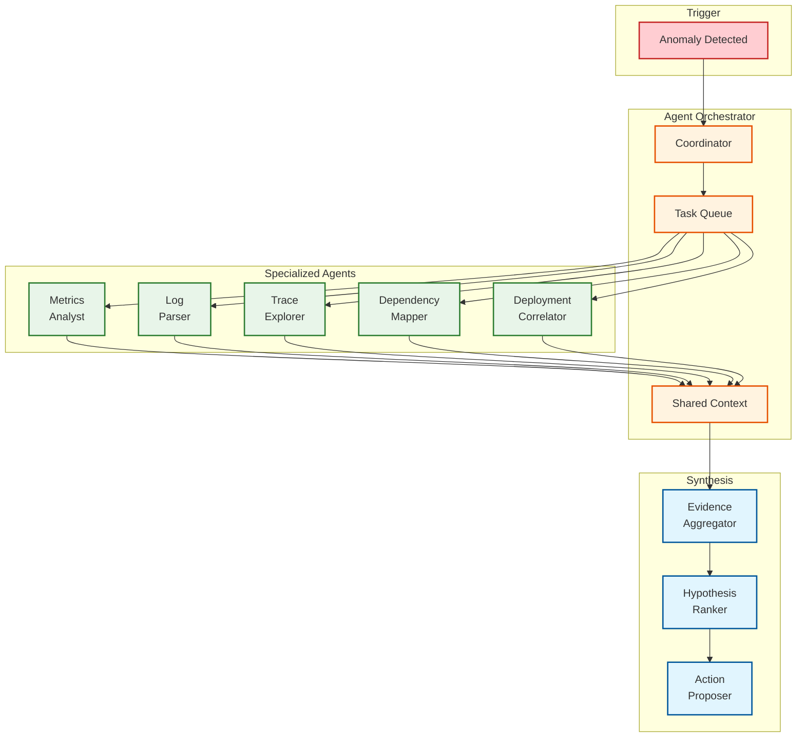

[← Back to Index](./00-index.md)

# Deep Dive & Bottlenecks

## Critical Challenge 1: High-Cardinality Data Management

### The Problem

Traditional metrics systems (Prometheus, InfluxDB) pre-aggregate data into time series. Each unique combination of labels creates a new series:

```
# With 3 labels, each with limited values = manageable
http_requests{service="api", status="200", region="us-west"} → ~100 series

# With high-cardinality labels = explosion
http_requests{service="api", user_id="u123", request_id="req456", trace_id="abc"} → billions of series
```

**Why it matters:**
- Cardinality explosion causes memory exhaustion
- Query performance degrades exponentially
- Storage costs become prohibitive
- Prometheus/InfluxDB simply refuse high-cardinality data

### Solution: Event-Based Architecture

Instead of pre-aggregating into metrics, store **wide events** and compute aggregations at query time:

```
┌─────────────────────────────────────────────────────────────────┐
│                    METRICS vs EVENTS                            │
├─────────────────────────────────────────────────────────────────┤
│                                                                 │
│  METRICS APPROACH (Prometheus)                                  │
│  ─────────────────────────────                                  │
│                                                                 │
│  Time series created at ingestion:                              │
│  http_duration_bucket{le="0.1", service="api"} 5000             │
│  http_duration_bucket{le="0.5", service="api"} 9000             │
│  http_duration_bucket{le="1.0", service="api"} 9900             │
│                                                                 │
│  ✗ Cannot add new dimensions after the fact                     │
│  ✗ Cardinality must be known upfront                           │
│  ✓ Fast queries (pre-aggregated)                               │
│  ✓ Low storage cost                                            │
│                                                                 │
│  ─────────────────────────────────────────────────────────────  │
│                                                                 │
│  EVENTS APPROACH (Honeycomb/ClickHouse)                        │
│  ──────────────────────────────────────                        │
│                                                                 │
│  Individual events stored:                                      │
│  {ts: T1, service: "api", duration: 0.05, user: "u1", ...}     │
│  {ts: T2, service: "api", duration: 0.45, user: "u2", ...}     │
│  {ts: T3, service: "api", duration: 0.85, user: "u1", ...}     │
│                                                                 │
│  ✓ Query any dimension, even ones added later                  │
│  ✓ Unlimited cardinality                                       │
│  ✗ Queries compute aggregations (slower)                       │
│  ✗ Higher storage cost                                         │
│                                                                 │
└─────────────────────────────────────────────────────────────────┘
```

### ClickHouse Optimizations for High Cardinality

```sql
-- Use LowCardinality for dimensions with <10K unique values
-- Dramatically reduces memory and improves compression
CREATE TABLE events (
    service_name LowCardinality(String),  -- ~100 services
    region LowCardinality(String),         -- ~10 regions
    status_code LowCardinality(String),    -- ~50 codes

    -- Use Map for truly high-cardinality attributes
    attributes Map(LowCardinality(String), String),

    -- Materialized columns for frequently queried high-cardinality
    user_id String MATERIALIZED attributes['user.id'],

    -- Bloom filter index for trace_id lookups
    trace_id FixedString(32),
    INDEX idx_trace bloom_filter(0.01) GRANULARITY 1
)
ENGINE = MergeTree()
ORDER BY (service_name, toStartOfHour(timestamp), cityHash64(trace_id))
SETTINGS index_granularity = 8192;
```

**Key Techniques:**

| Technique | Use Case | Impact |
|-----------|----------|--------|
| `LowCardinality` | Dimensions < 10K values | 10x compression, 5x query speed |
| `Map` columns | Arbitrary attributes | Flexible schema, moderate overhead |
| Bloom filters | Point lookups (trace_id) | 100x faster lookups |
| Materialized columns | Frequently queried high-cardinality | Query-time extraction avoided |
| Projection tables | Common aggregations | Pre-computed rollups |

### Cardinality Monitoring

```sql
-- Monitor cardinality growth
SELECT
    toDate(timestamp) as date,
    uniqExact(user_id) as unique_users,
    uniqExact(trace_id) as unique_traces,
    uniqExact(tuple(service_name, http_method, http_status_code)) as metric_cardinality
FROM events
WHERE timestamp > now() - INTERVAL 7 DAY
GROUP BY date
ORDER BY date;
```

---

## Critical Challenge 2: ML Baseline Drift

### The Problem

Learned baselines become stale as systems evolve:
- New deployments change performance characteristics
- Business patterns shift (new features, user growth)
- Seasonal variations require continuous adaptation
- Concept drift makes old models inaccurate

### Solution: Continuous Baseline Learning

```
┌─────────────────────────────────────────────────────────────────┐
│                   BASELINE LEARNING PIPELINE                    │
├─────────────────────────────────────────────────────────────────┤
│                                                                 │
│  ┌──────────────┐    ┌──────────────┐    ┌──────────────┐      │
│  │ Raw Events   │───▶│ Feature      │───▶│ Baseline     │      │
│  │ (Real-time)  │    │ Extraction   │    │ Model        │      │
│  └──────────────┘    └──────────────┘    └──────┬───────┘      │
│                                                  │              │
│                                                  ▼              │
│  ┌──────────────────────────────────────────────────────────┐  │
│  │                    MODEL REGISTRY                         │  │
│  │                                                           │  │
│  │  checkout-service/latency/v1.2 (active, trained 1h ago)  │  │
│  │  checkout-service/latency/v1.1 (shadow, trained 25h ago) │  │
│  │  checkout-service/error_rate/v1.0 (active, trained 2d)   │  │
│  │                                                           │  │
│  └──────────────────────────────────────────────────────────┘  │
│                                                  │              │
│                       ┌──────────────────────────┤              │
│                       │                          │              │
│                       ▼                          ▼              │
│  ┌──────────────────────────┐   ┌──────────────────────────┐  │
│  │ SHADOW EVALUATION        │   │ DRIFT DETECTION          │  │
│  │                          │   │                          │  │
│  │ Compare predictions:     │   │ Monitor:                 │  │
│  │ • v1.2 vs v1.1           │   │ • Prediction accuracy    │  │
│  │ • Measure accuracy       │   │ • Feature distribution   │  │
│  │ • Promote if better      │   │ • Alert on drift         │  │
│  └──────────────────────────┘   └──────────────────────────┘  │
│                                                                 │
└─────────────────────────────────────────────────────────────────┘
```

### Handling Known Events

The system must distinguish between legitimate changes and anomalies:

```python
class BaselineManager:
    """
    Manages baseline models with awareness of planned events.
    """

    def __init__(self):
        self.known_events = KnownEventsRegistry()
        self.models = ModelRegistry()

    def should_update_baseline(self, service: str, event_type: str) -> bool:
        """
        Determine if current data should update the baseline.
        """
        # Don't update during known maintenance
        if self.known_events.is_maintenance_window(service):
            return False

        # Don't update during active incidents
        if self.incident_manager.has_active_incident(service):
            return False

        # Don't update right after deployments (wait for stabilization)
        last_deploy = self.deployments.get_last_deployment(service)
        if last_deploy and (now() - last_deploy.time) < STABILIZATION_WINDOW:
            return False

        return True

    def adjust_for_known_event(self, prediction: float, service: str) -> float:
        """
        Adjust baseline prediction for known events like sales, holidays.
        """
        events = self.known_events.get_active_events(service)

        for event in events:
            if event.type == "black_friday":
                prediction *= event.expected_multiplier  # e.g., 10x traffic
            elif event.type == "maintenance":
                prediction = None  # Suppress alerting

        return prediction
```

### Drift Detection

```python
class DriftDetector:
    """
    Detects when baseline models have drifted from reality.
    """

    def check_drift(self, model: BaselineModel, recent_data: DataFrame) -> DriftReport:
        # 1. Feature drift: Has input distribution changed?
        feature_drift = self.kolmogorov_smirnov_test(
            model.training_features,
            recent_data.features
        )

        # 2. Prediction drift: Are predictions consistently wrong?
        predictions = model.predict(recent_data.timestamps)
        actuals = recent_data.values
        prediction_error = mean_absolute_percentage_error(actuals, predictions)

        # 3. Concept drift: Has the relationship changed?
        recent_model = self.train_mini_model(recent_data)
        concept_drift = self.compare_model_behavior(model, recent_model)

        return DriftReport(
            feature_drift=feature_drift,
            prediction_error=prediction_error,
            concept_drift=concept_drift,
            needs_retrain=any([
                feature_drift.p_value < 0.01,
                prediction_error > 0.3,
                concept_drift.divergence > 0.5
            ])
        )
```

---

## Critical Challenge 3: False Positive Reduction

### The Problem

Alert fatigue kills observability effectiveness:
- Too many alerts → Engineers ignore them
- Missed real issues → Customer impact
- Trust erosion → Teams disable alerting

**Industry benchmarks:**
- Traditional monitoring: 30-50% false positive rate
- Target for AI-native: < 5% false positive rate

### Solution: Multi-Signal Correlation

```
┌─────────────────────────────────────────────────────────────────┐
│              FALSE POSITIVE REDUCTION PIPELINE                  │
├─────────────────────────────────────────────────────────────────┤
│                                                                 │
│  SIGNAL 1: Metric Anomaly                                       │
│  ┌─────────────────────────────────────────────────────────┐   │
│  │ p99 latency: 200ms → 2100ms (10.5x deviation)           │   │
│  │ Confidence: 0.85                                         │   │
│  └─────────────────────────────────────────────────────────┘   │
│                          │                                      │
│                          ▼                                      │
│  SIGNAL 2: Error Rate Correlation                               │
│  ┌─────────────────────────────────────────────────────────┐   │
│  │ Error rate: 0.1% → 5% (50x increase)                    │   │
│  │ Correlation with latency spike: 0.92                     │   │
│  │ Confidence boost: +0.08                                  │   │
│  └─────────────────────────────────────────────────────────┘   │
│                          │                                      │
│                          ▼                                      │
│  SIGNAL 3: Dependency Health                                    │
│  ┌─────────────────────────────────────────────────────────┐   │
│  │ Upstream services: All healthy                           │   │
│  │ Downstream services: 2 showing elevated latency          │   │
│  │ Indicates: Source of problem, not victim                 │   │
│  │ Confidence boost: +0.05                                  │   │
│  └─────────────────────────────────────────────────────────┘   │
│                          │                                      │
│                          ▼                                      │
│  SIGNAL 4: User Impact                                         │
│  ┌─────────────────────────────────────────────────────────┐   │
│  │ Affected users: 15,000 (based on trace sampling)        │   │
│  │ Customer tier: Premium users over-represented (2.1x)    │   │
│  │ Revenue impact estimate: $25,000/hour                   │   │
│  └─────────────────────────────────────────────────────────┘   │
│                          │                                      │
│                          ▼                                      │
│  FINAL DECISION                                                │
│  ┌─────────────────────────────────────────────────────────┐   │
│  │ Combined confidence: 0.98                                │   │
│  │ Threshold: 0.80                                          │   │
│  │ Decision: ALERT (High severity)                          │   │
│  └─────────────────────────────────────────────────────────┘   │
│                                                                 │
└─────────────────────────────────────────────────────────────────┘
```

### Suppression Rules

```python
class AlertSuppressor:
    """
    Intelligent suppression of likely false positives.
    """

    SUPPRESSION_RULES = [
        # Suppress during known maintenance windows
        SuppressionRule(
            name="maintenance_window",
            condition=lambda ctx: ctx.known_events.is_maintenance(),
            action="suppress"
        ),

        # Suppress if similar alert within cooldown period
        SuppressionRule(
            name="cooldown",
            condition=lambda ctx: ctx.recent_alerts.similar_within(minutes=15),
            action="dedupe"
        ),

        # Suppress if deployment just started (give time to stabilize)
        SuppressionRule(
            name="deployment_grace_period",
            condition=lambda ctx: ctx.deployments.within_grace_period(minutes=5),
            action="delay",
            delay_minutes=5
        ),

        # Suppress low-impact anomalies outside business hours
        SuppressionRule(
            name="off_hours_low_impact",
            condition=lambda ctx: (
                not ctx.is_business_hours() and
                ctx.anomaly.impact_estimate < 1000  # < $1000/hour
            ),
            action="downgrade_severity"
        ),

        # Suppress if all upstream dependencies are down (victim, not cause)
        SuppressionRule(
            name="dependency_victim",
            condition=lambda ctx: ctx.all_upstreams_unhealthy(),
            action="suppress",
            note="Service is victim of upstream failure"
        )
    ]

    def evaluate(self, anomaly: Anomaly, context: AlertContext) -> SuppressionDecision:
        for rule in self.SUPPRESSION_RULES:
            if rule.condition(context):
                return SuppressionDecision(
                    rule=rule.name,
                    action=rule.action,
                    note=getattr(rule, 'note', None)
                )

        return SuppressionDecision(action="alert")
```

### Feedback Loop for Continuous Improvement

```python
class AlertQualityTracker:
    """
    Tracks alert quality and adjusts thresholds based on feedback.
    """

    def record_feedback(self, alert_id: str, feedback: Feedback):
        """Record human feedback on alert quality."""
        self.feedback_store.save(alert_id, feedback)

        # Update model based on feedback
        if feedback.was_false_positive:
            self.false_positive_count += 1
            self.adjust_threshold(alert_id, direction="increase")
        elif feedback.was_missed_incident:
            self.missed_incident_count += 1
            self.adjust_threshold(alert_id, direction="decrease")

    def get_quality_metrics(self, time_range: TimeRange) -> QualityMetrics:
        alerts = self.get_alerts(time_range)
        feedback = self.get_feedback(time_range)

        return QualityMetrics(
            total_alerts=len(alerts),
            true_positives=feedback.count(was_actionable=True),
            false_positives=feedback.count(was_false_positive=True),
            false_positive_rate=self.calculate_fpr(feedback),
            mean_time_to_feedback=feedback.mean_response_time(),
            feedback_coverage=len(feedback) / len(alerts)
        )
```

---

## Critical Challenge 4: Multi-Agent Coordination

### The Problem

When multiple AI agents investigate simultaneously:
- Duplicate work wastes resources
- Conflicting conclusions confuse users
- Race conditions in remediation cause chaos
- Context fragmentation loses insights

### Solution: Agent Orchestration Layer



### Shared Context Protocol

```python
class SharedInvestigationContext:
    """
    Shared context that all agents can read and write to.
    Implements optimistic locking to handle concurrent updates.
    """

    def __init__(self, investigation_id: str):
        self.investigation_id = investigation_id
        self.findings = ConcurrentDict()
        self.hypotheses = ConcurrentList()
        self.evidence = ConcurrentList()
        self.claimed_tasks = ConcurrentSet()

    def claim_task(self, agent_id: str, task: str) -> bool:
        """
        Claim a task to prevent duplicate work.
        Returns False if already claimed.
        """
        task_key = f"{self.investigation_id}:{task}"
        return self.claimed_tasks.add_if_absent(task_key, agent_id)

    def add_finding(self, agent_id: str, finding: Finding):
        """Add a finding with agent attribution."""
        finding.attributed_to = agent_id
        finding.timestamp = now()
        self.findings.put(finding.key, finding)

        # Notify other agents of new finding
        self.event_bus.publish(FindingAdded(
            investigation_id=self.investigation_id,
            finding=finding
        ))

    def add_hypothesis(self, agent_id: str, hypothesis: Hypothesis):
        """
        Add a hypothesis. If similar hypothesis exists, merge evidence.
        """
        existing = self.find_similar_hypothesis(hypothesis)
        if existing:
            existing.merge_evidence(hypothesis.evidence)
            existing.confidence = max(existing.confidence, hypothesis.confidence)
        else:
            hypothesis.attributed_to = agent_id
            self.hypotheses.append(hypothesis)

    def get_consensus_root_cause(self) -> RootCause:
        """
        Synthesize root cause from all agent hypotheses.
        Uses weighted voting based on evidence strength.
        """
        if not self.hypotheses:
            return None

        # Score each hypothesis
        scored = []
        for h in self.hypotheses:
            score = (
                h.confidence * 0.4 +
                len(h.evidence) * 0.1 +
                h.evidence_quality_score * 0.3 +
                h.agent_reliability_score * 0.2
            )
            scored.append((score, h))

        # Return highest scored
        scored.sort(key=lambda x: x[0], reverse=True)
        winner = scored[0][1]

        # Check for strong consensus
        if len(scored) > 1:
            runner_up = scored[1][1]
            if winner.is_consistent_with(runner_up):
                winner.merge_evidence(runner_up.evidence)

        return winner.to_root_cause()
```

### Agent Communication Protocol

```python
class AgentMessage:
    """Messages exchanged between agents."""

    class FindingShared(AgentMessage):
        """Agent shares a finding with others."""
        agent_id: str
        finding: Finding
        relevance_hint: str  # "might be relevant to log analysis"

    class HypothesisProposed(AgentMessage):
        """Agent proposes a hypothesis."""
        agent_id: str
        hypothesis: Hypothesis
        supporting_evidence: List[Evidence]

    class TaskDelegated(AgentMessage):
        """Agent requests another agent to investigate something."""
        from_agent: str
        to_agent_type: str
        task: str
        context: Dict

    class ConsensusRequested(AgentMessage):
        """Coordinator requests agents to vote on hypothesis."""
        hypothesis: Hypothesis
        deadline: datetime

    class ConsensusVote(AgentMessage):
        """Agent votes on a hypothesis."""
        agent_id: str
        hypothesis_id: str
        vote: Literal["agree", "disagree", "abstain"]
        reason: str
```

---

## Critical Challenge 5: Query Performance at Scale

### The Problem

With billions of events and high-cardinality dimensions:
- Full table scans are prohibitively slow
- Aggregations over large time ranges timeout
- Real-time queries compete with batch analytics
- Cost of queries can exceed storage cost

### Solution: Multi-Layer Query Optimization

```
┌─────────────────────────────────────────────────────────────────┐
│                    QUERY OPTIMIZATION LAYERS                    │
├─────────────────────────────────────────────────────────────────┤
│                                                                 │
│  LAYER 1: Query Cache (Redis)                                   │
│  ──────────────────────────────                                 │
│  • Exact query match: Return cached result                      │
│  • TTL: 1 minute for dashboards, 5 minutes for reports          │
│  • Hit rate target: > 80% for dashboard queries                 │
│                                                                 │
│  LAYER 2: Materialized Views                                    │
│  ──────────────────────────────                                 │
│  • Pre-aggregated rollups (1min, 5min, 1hr, 1day)               │
│  • Common dimension combinations pre-computed                   │
│  • Updated continuously via Kafka Streams                       │
│                                                                 │
│  LAYER 3: Projection Tables (ClickHouse)                        │
│  ──────────────────────────────                                 │
│  • Alternative sort orders for different access patterns        │
│  • Automatic query routing to optimal projection                │
│                                                                 │
│  LAYER 4: Partition Pruning                                     │
│  ──────────────────────────────                                 │
│  • Time-based partitions (daily)                                │
│  • Service-based sub-partitions                                 │
│  • Query planner eliminates irrelevant partitions               │
│                                                                 │
│  LAYER 5: Approximate Queries                                   │
│  ──────────────────────────────                                 │
│  • HyperLogLog for cardinality estimates                       │
│  • T-Digest for percentile approximations                       │
│  • Sampling for exploratory queries                            │
│                                                                 │
└─────────────────────────────────────────────────────────────────┘
```

### ClickHouse Materialized Views

```sql
-- Real-time aggregation via Materialized View
CREATE MATERIALIZED VIEW events_1min_rollup
ENGINE = SummingMergeTree()
PARTITION BY toDate(timestamp)
ORDER BY (service_name, operation_name, minute)
AS SELECT
    service_name,
    operation_name,
    toStartOfMinute(timestamp) as minute,
    count() as request_count,
    sum(duration_ns) as total_duration_ns,
    max(duration_ns) as max_duration_ns,
    sumIf(1, status_code >= 400) as error_count,
    quantileState(0.5)(duration_ns) as p50_state,
    quantileState(0.95)(duration_ns) as p95_state,
    quantileState(0.99)(duration_ns) as p99_state
FROM events
GROUP BY service_name, operation_name, minute;

-- Query the rollup instead of raw events
SELECT
    service_name,
    sum(request_count) as requests,
    sum(total_duration_ns) / sum(request_count) as avg_duration_ns,
    quantileMerge(0.99)(p99_state) as p99_duration_ns
FROM events_1min_rollup
WHERE minute >= now() - INTERVAL 1 HOUR
GROUP BY service_name;
```

### Query Cost Estimation

```python
class QueryCostEstimator:
    """
    Estimates query cost before execution.
    Rejects or downgrades expensive queries.
    """

    MAX_COST_INTERACTIVE = 1000  # Cost units for interactive queries
    MAX_COST_BATCH = 100000      # Cost units for batch queries

    def estimate_cost(self, query: Query) -> QueryCost:
        # Estimate rows to scan
        partitions = self.estimate_partitions(query.time_range)
        rows_per_partition = self.avg_rows_per_partition(query.service)
        estimated_rows = partitions * rows_per_partition

        # Estimate filtering efficiency
        filter_selectivity = self.estimate_selectivity(query.filters)
        rows_after_filter = estimated_rows * filter_selectivity

        # Estimate aggregation cost
        aggregation_cost = self.estimate_aggregation(query.aggregations, rows_after_filter)

        # Total cost
        total_cost = (
            estimated_rows * 0.001 +          # Scan cost
            rows_after_filter * 0.01 +        # Filter cost
            aggregation_cost                   # Aggregation cost
        )

        return QueryCost(
            estimated_rows=estimated_rows,
            estimated_cost=total_cost,
            suggested_optimizations=self.suggest_optimizations(query, total_cost)
        )

    def suggest_optimizations(self, query: Query, cost: float) -> List[str]:
        suggestions = []

        if cost > self.MAX_COST_INTERACTIVE:
            if query.time_range.duration > timedelta(hours=24):
                suggestions.append("Use rollup table for time ranges > 24h")

            if not query.has_service_filter:
                suggestions.append("Add service filter to enable partition pruning")

            if query.requests_exact_count:
                suggestions.append("Use approximate count (uniqHLL64) for faster results")

        return suggestions
```

---

## Bottleneck Analysis Summary

| Bottleneck | Impact | Solution | Trade-off |
|------------|--------|----------|-----------|
| **High Cardinality** | Storage explosion, slow queries | Event-based storage + ClickHouse | Higher storage cost |
| **Baseline Drift** | Stale models, false alerts | Continuous learning, drift detection | Compute overhead |
| **False Positives** | Alert fatigue, ignored alerts | Multi-signal correlation | Detection latency |
| **Agent Coordination** | Duplicate work, conflicts | Shared context, task claiming | Coordination overhead |
| **Query Performance** | Timeout, high cost | Caching, materialized views, approximations | Freshness trade-off |
| **Ingestion Spikes** | Data loss, backpressure | Kafka buffering, adaptive sampling | Sample bias |
| **AI Inference Latency** | Delayed detection | GPU acceleration, model optimization | Infrastructure cost |
