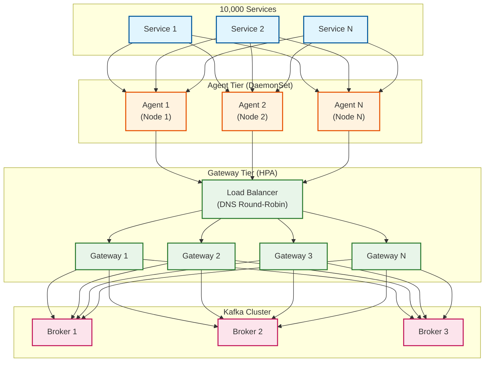
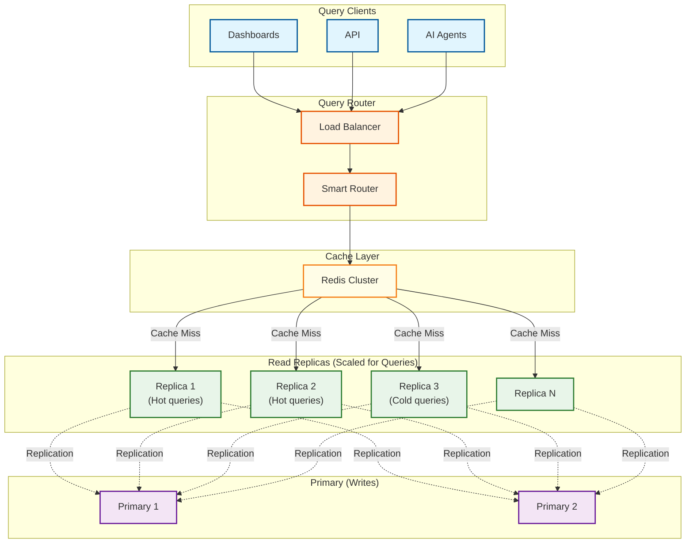

[← Back to Index](./00-index.md)

# Scalability & Reliability

## Scaling Strategy Overview

```
┌─────────────────────────────────────────────────────────────────┐
│                    SCALABILITY DIMENSIONS                       │
├─────────────────────────────────────────────────────────────────┤
│                                                                 │
│  INGESTION SCALE                                                │
│  ───────────────                                                │
│  • Horizontal: Add OTel collectors and Kafka partitions         │
│  • Target: 10M+ events/sec                                      │
│  • Bottleneck: Kafka throughput, collector CPU                  │
│                                                                 │
│  STORAGE SCALE                                                  │
│  ─────────────                                                  │
│  • Horizontal: Add ClickHouse shards                            │
│  • Vertical: Tiered storage (SSD → HDD → S3)                   │
│  • Target: Petabytes of data                                    │
│  • Bottleneck: Query fanout, cross-shard joins                 │
│                                                                 │
│  QUERY SCALE                                                    │
│  ───────────                                                    │
│  • Horizontal: Add ClickHouse replicas, query cache nodes       │
│  • Target: 10K+ queries/sec                                     │
│  • Bottleneck: Hot partition skew, cache invalidation           │
│                                                                 │
│  AI INFERENCE SCALE                                             │
│  ──────────────────                                             │
│  • Horizontal: Add GPU nodes for parallel inference             │
│  • Target: 100K anomaly checks/sec                              │
│  • Bottleneck: Model loading time, GPU memory                   │
│                                                                 │
└─────────────────────────────────────────────────────────────────┘
```

---

## Ingestion Scaling

### OTel Collector Scaling



### Horizontal Pod Autoscaler Configuration

```yaml
apiVersion: autoscaling/v2
kind: HorizontalPodAutoscaler
metadata:
  name: otel-gateway-hpa
spec:
  scaleTargetRef:
    apiVersion: apps/v1
    kind: Deployment
    name: otel-gateway
  minReplicas: 3
  maxReplicas: 50
  metrics:
    # Scale on CPU utilization
    - type: Resource
      resource:
        name: cpu
        target:
          type: Utilization
          averageUtilization: 70

    # Scale on memory utilization
    - type: Resource
      resource:
        name: memory
        target:
          type: Utilization
          averageUtilization: 80

    # Scale on custom metric: events per second
    - type: Pods
      pods:
        metric:
          name: otel_exporter_sent_spans_total_rate
        target:
          type: AverageValue
          averageValue: "50000"  # 50K spans/sec per pod

  behavior:
    scaleUp:
      stabilizationWindowSeconds: 60
      policies:
        - type: Pods
          value: 4
          periodSeconds: 60
    scaleDown:
      stabilizationWindowSeconds: 300
      policies:
        - type: Percent
          value: 10
          periodSeconds: 60
```

### Kafka Scaling for High Throughput

```yaml
# Kafka topic configuration for traces
apiVersion: kafka.strimzi.io/v1beta2
kind: KafkaTopic
metadata:
  name: traces
spec:
  partitions: 256  # High partition count for parallelism
  replicas: 3       # Replication for durability
  config:
    retention.ms: 86400000  # 24 hours
    retention.bytes: 1099511627776  # 1TB per partition
    segment.bytes: 1073741824  # 1GB segments
    min.insync.replicas: 2
    compression.type: zstd  # Best compression ratio
```

### Backpressure Handling

```python
class BackpressureController:
    """
    Handles backpressure when downstream systems are overwhelmed.
    """

    def __init__(self, config: BackpressureConfig):
        self.sample_rate = 1.0  # Start at 100%
        self.min_sample_rate = 0.01  # Never drop below 1%
        self.kafka_lag_threshold = config.kafka_lag_threshold
        self.clickhouse_queue_threshold = config.clickhouse_queue_threshold

    async def check_and_adjust(self):
        """Periodically check system health and adjust sampling."""
        while True:
            kafka_lag = await self.get_kafka_consumer_lag()
            ch_queue = await self.get_clickhouse_insert_queue()

            if kafka_lag > self.kafka_lag_threshold:
                # Reduce sampling to let system catch up
                self.sample_rate = max(
                    self.min_sample_rate,
                    self.sample_rate * 0.9
                )
                logger.warning(f"Backpressure: Kafka lag {kafka_lag}, reducing sample to {self.sample_rate}")

            elif ch_queue > self.clickhouse_queue_threshold:
                # ClickHouse can't keep up
                self.sample_rate = max(
                    self.min_sample_rate,
                    self.sample_rate * 0.8
                )
                logger.warning(f"Backpressure: CH queue {ch_queue}, reducing sample to {self.sample_rate}")

            elif kafka_lag < self.kafka_lag_threshold * 0.5 and self.sample_rate < 1.0:
                # System has capacity, increase sampling
                self.sample_rate = min(1.0, self.sample_rate * 1.1)
                logger.info(f"Backpressure easing: increasing sample to {self.sample_rate}")

            await asyncio.sleep(10)  # Check every 10 seconds

    def should_sample(self, event: Event) -> bool:
        """Apply current sampling rate."""
        # Always keep errors and slow requests
        if event.is_error or event.is_slow:
            return True

        return random.random() < self.sample_rate
```

---

## Storage Scaling

### ClickHouse Cluster Topology

```
┌─────────────────────────────────────────────────────────────────┐
│                 CLICKHOUSE CLUSTER TOPOLOGY                     │
├─────────────────────────────────────────────────────────────────┤
│                                                                 │
│  ┌─────────────────────────────────────────────────────────┐   │
│  │                    SHARD 1                               │   │
│  │  ┌──────────┐  ┌──────────┐  ┌──────────┐              │   │
│  │  │ Replica 1│  │ Replica 2│  │ Replica 3│              │   │
│  │  │ (Leader) │  │ (Follower)│  │ (Follower)│             │   │
│  │  └──────────┘  └──────────┘  └──────────┘              │   │
│  │       │              │              │                    │   │
│  │       └──────────────┼──────────────┘                    │   │
│  │                      ▼                                   │   │
│  │              ZooKeeper (Coordination)                    │   │
│  └─────────────────────────────────────────────────────────┘   │
│                                                                 │
│  ┌─────────────────────────────────────────────────────────┐   │
│  │                    SHARD 2                               │   │
│  │  ┌──────────┐  ┌──────────┐  ┌──────────┐              │   │
│  │  │ Replica 1│  │ Replica 2│  │ Replica 3│              │   │
│  │  └──────────┘  └──────────┘  └──────────┘              │   │
│  └─────────────────────────────────────────────────────────┘   │
│                                                                 │
│  ┌─────────────────────────────────────────────────────────┐   │
│  │                    SHARD N                               │   │
│  │  ┌──────────┐  ┌──────────┐  ┌──────────┐              │   │
│  │  │ Replica 1│  │ Replica 2│  │ Replica 3│              │   │
│  │  └──────────┘  └──────────┘  └──────────┘              │   │
│  └─────────────────────────────────────────────────────────┘   │
│                                                                 │
│  Sharding Key: cityHash64(trace_id) % num_shards               │
│  Ensures all spans of a trace land on same shard               │
│                                                                 │
└─────────────────────────────────────────────────────────────────┘
```

### Distributed Table Configuration

```sql
-- Local table on each shard
CREATE TABLE events_local ON CLUSTER '{cluster}'
(
    timestamp DateTime64(9),
    trace_id FixedString(32),
    span_id FixedString(16),
    service_name LowCardinality(String),
    duration_ns UInt64,
    -- ... other columns
)
ENGINE = ReplicatedMergeTree('/clickhouse/tables/{shard}/events', '{replica}')
PARTITION BY toDate(timestamp)
ORDER BY (service_name, toStartOfHour(timestamp), trace_id)
TTL toDateTime(timestamp) + INTERVAL 7 DAY TO DISK 'warm',
    toDateTime(timestamp) + INTERVAL 90 DAY TO DISK 'cold';

-- Distributed table for queries
CREATE TABLE events ON CLUSTER '{cluster}'
AS events_local
ENGINE = Distributed('{cluster}', default, events_local, cityHash64(trace_id));
```

### Tiered Storage Configuration

```xml
<!-- ClickHouse storage configuration -->
<storage_configuration>
    <disks>
        <hot>
            <path>/var/lib/clickhouse/hot/</path>
            <keep_free_space_bytes>10737418240</keep_free_space_bytes>
        </hot>
        <warm>
            <path>/var/lib/clickhouse/warm/</path>
            <keep_free_space_bytes>10737418240</keep_free_space_bytes>
        </warm>
        <cold>
            <type>s3</type>
            <endpoint>https://s3.us-west-2.amazonaws.com/observability-cold/</endpoint>
            <access_key_id>***</access_key_id>
            <secret_access_key>***</secret_access_key>
        </cold>
    </disks>

    <policies>
        <tiered>
            <volumes>
                <hot>
                    <disk>hot</disk>
                    <max_data_part_size_bytes>10737418240</max_data_part_size_bytes>
                </hot>
                <warm>
                    <disk>warm</disk>
                    <max_data_part_size_bytes>107374182400</max_data_part_size_bytes>
                </warm>
                <cold>
                    <disk>cold</disk>
                </cold>
            </volumes>
            <move_factor>0.1</move_factor>
        </tiered>
    </policies>
</storage_configuration>
```

---

## Query Layer Scaling

### Read Replica Architecture



### Query Routing Logic

```python
class SmartQueryRouter:
    """
    Routes queries to appropriate backends based on characteristics.
    """

    def route_query(self, query: Query) -> Backend:
        # Check cache first
        cache_key = self.compute_cache_key(query)
        cached_result = self.cache.get(cache_key)
        if cached_result:
            return CachedBackend(cached_result)

        # Route based on query characteristics
        if query.time_range.duration < timedelta(hours=1):
            # Recent data: use hot replicas
            return self.select_hot_replica()

        elif query.time_range.duration < timedelta(days=7):
            # Warm data: use any replica
            return self.select_any_replica()

        else:
            # Cold data: use dedicated cold query nodes
            return self.select_cold_replica()

    def select_hot_replica(self) -> Backend:
        """Select replica optimized for hot data queries."""
        replicas = self.get_healthy_replicas(tier="hot")
        # Use least-connections for load balancing
        return min(replicas, key=lambda r: r.active_connections)

    def select_cold_replica(self) -> Backend:
        """Select replica for cold data (S3-backed) queries."""
        replicas = self.get_healthy_replicas(tier="cold")
        # Cold queries are slower; use dedicated nodes
        return min(replicas, key=lambda r: r.queue_depth)
```

### Query Cache Strategy

```python
class QueryCacheManager:
    """
    Multi-layer caching for query results.
    """

    def __init__(self, redis: Redis):
        self.redis = redis
        self.local_cache = TTLCache(maxsize=1000, ttl=30)  # 30s local cache

    def get(self, query: Query) -> Optional[QueryResult]:
        cache_key = self.compute_key(query)

        # Layer 1: Local in-memory cache
        if cache_key in self.local_cache:
            return self.local_cache[cache_key]

        # Layer 2: Redis distributed cache
        cached = self.redis.get(cache_key)
        if cached:
            result = QueryResult.deserialize(cached)
            self.local_cache[cache_key] = result
            return result

        return None

    def set(self, query: Query, result: QueryResult):
        cache_key = self.compute_key(query)
        ttl = self.compute_ttl(query)

        # Don't cache queries for very recent data (still changing)
        if query.time_range.end > now() - timedelta(minutes=1):
            return

        serialized = result.serialize()

        # Set in both caches
        self.local_cache[cache_key] = result
        self.redis.setex(cache_key, ttl, serialized)

    def compute_ttl(self, query: Query) -> int:
        """
        Compute cache TTL based on data freshness.
        Older data can be cached longer.
        """
        age = now() - query.time_range.end

        if age < timedelta(hours=1):
            return 60  # 1 minute for recent data
        elif age < timedelta(days=1):
            return 300  # 5 minutes for day-old data
        elif age < timedelta(days=7):
            return 3600  # 1 hour for week-old data
        else:
            return 86400  # 24 hours for historical data
```

---

## AI Inference Scaling

### GPU Cluster Architecture

```
┌─────────────────────────────────────────────────────────────────┐
│                   AI INFERENCE CLUSTER                          │
├─────────────────────────────────────────────────────────────────┤
│                                                                 │
│  ┌─────────────────────────────────────────────────────────┐   │
│  │               INFERENCE GATEWAY                          │   │
│  │  • Request routing                                       │   │
│  │  • Load balancing                                        │   │
│  │  • Request batching                                      │   │
│  └───────────────────────────┬─────────────────────────────┘   │
│                              │                                  │
│          ┌───────────────────┼───────────────────┐             │
│          │                   │                   │              │
│          ▼                   ▼                   ▼              │
│  ┌──────────────┐   ┌──────────────┐   ┌──────────────┐       │
│  │  GPU Node 1  │   │  GPU Node 2  │   │  GPU Node N  │       │
│  │  ───────────  │   │  ───────────  │   │  ───────────  │       │
│  │  A100 × 8    │   │  A100 × 8    │   │  A100 × 8    │       │
│  │              │   │              │   │              │       │
│  │  Models:     │   │  Models:     │   │  Models:     │       │
│  │  • Anomaly   │   │  • Anomaly   │   │  • Anomaly   │       │
│  │  • RCA       │   │  • RCA       │   │  • RCA       │       │
│  │  • NLQ       │   │  • NLQ       │   │  • NLQ       │       │
│  └──────────────┘   └──────────────┘   └──────────────┘       │
│                                                                 │
│  ┌─────────────────────────────────────────────────────────┐   │
│  │               MODEL REGISTRY                             │   │
│  │  • Version management                                    │   │
│  │  • A/B testing                                          │   │
│  │  • Rollback capability                                  │   │
│  └─────────────────────────────────────────────────────────┘   │
│                                                                 │
└─────────────────────────────────────────────────────────────────┘
```

### Dynamic Batching for Inference

```python
class DynamicBatcher:
    """
    Batches inference requests for efficient GPU utilization.
    """

    def __init__(self, config: BatchConfig):
        self.max_batch_size = config.max_batch_size  # e.g., 64
        self.max_wait_ms = config.max_wait_ms  # e.g., 50ms
        self.pending_requests = asyncio.Queue()
        self.batch_ready = asyncio.Event()

    async def add_request(self, request: InferenceRequest) -> InferenceResult:
        """Add request to batch and wait for result."""
        future = asyncio.Future()
        await self.pending_requests.put((request, future))

        # Signal batcher if batch is full
        if self.pending_requests.qsize() >= self.max_batch_size:
            self.batch_ready.set()

        return await future

    async def batch_processor(self):
        """Process requests in batches."""
        while True:
            batch = []
            futures = []

            # Collect requests until batch is full or timeout
            try:
                deadline = asyncio.get_event_loop().time() + self.max_wait_ms / 1000

                while len(batch) < self.max_batch_size:
                    remaining = deadline - asyncio.get_event_loop().time()
                    if remaining <= 0:
                        break

                    try:
                        request, future = await asyncio.wait_for(
                            self.pending_requests.get(),
                            timeout=remaining
                        )
                        batch.append(request)
                        futures.append(future)
                    except asyncio.TimeoutError:
                        break

            except Exception as e:
                logger.error(f"Batch collection error: {e}")

            if batch:
                # Run batch inference
                try:
                    results = await self.run_batch_inference(batch)
                    for future, result in zip(futures, results):
                        future.set_result(result)
                except Exception as e:
                    for future in futures:
                        future.set_exception(e)

    async def run_batch_inference(self, batch: List[InferenceRequest]) -> List[InferenceResult]:
        """Run inference on GPU with batched inputs."""
        # Prepare batch tensor
        inputs = torch.stack([r.to_tensor() for r in batch])

        # Run model
        with torch.no_grad():
            outputs = self.model(inputs)

        # Parse outputs
        return [InferenceResult.from_tensor(o) for o in outputs]
```

---

## Reliability & Fault Tolerance

### Failure Modes and Mitigation

| Failure Mode | Impact | Detection | Mitigation |
|--------------|--------|-----------|------------|
| **OTel Agent Down** | Data loss from node | Health checks | DaemonSet auto-restart, buffering |
| **Gateway Overload** | Backpressure, sampling | CPU/memory metrics | HPA scale-out, load shedding |
| **Kafka Broker Down** | Reduced throughput | ISR monitoring | Replication, rack awareness |
| **ClickHouse Shard Down** | Queries fail for shard | Health endpoints | 3x replication, query retry |
| **AI Inference Failure** | No anomaly detection | Model health checks | Fallback to rule-based |
| **Redis Cache Down** | Slow queries | Sentinel monitoring | Replica promotion, bypass cache |

### Circuit Breaker Pattern

```python
class CircuitBreaker:
    """
    Circuit breaker for external dependencies.
    """

    def __init__(self, name: str, config: CircuitBreakerConfig):
        self.name = name
        self.failure_threshold = config.failure_threshold  # e.g., 5
        self.reset_timeout = config.reset_timeout  # e.g., 30 seconds
        self.half_open_requests = config.half_open_requests  # e.g., 3

        self.state = CircuitState.CLOSED
        self.failure_count = 0
        self.last_failure_time = None
        self.half_open_successes = 0

    async def call(self, func: Callable, *args, **kwargs) -> Any:
        if self.state == CircuitState.OPEN:
            if self._should_attempt_reset():
                self.state = CircuitState.HALF_OPEN
                self.half_open_successes = 0
            else:
                raise CircuitOpenError(self.name)

        try:
            result = await func(*args, **kwargs)
            self._record_success()
            return result
        except Exception as e:
            self._record_failure()
            raise

    def _record_success(self):
        if self.state == CircuitState.HALF_OPEN:
            self.half_open_successes += 1
            if self.half_open_successes >= self.half_open_requests:
                self.state = CircuitState.CLOSED
                self.failure_count = 0
                logger.info(f"Circuit {self.name} closed")
        else:
            self.failure_count = 0

    def _record_failure(self):
        self.failure_count += 1
        self.last_failure_time = time.time()

        if self.failure_count >= self.failure_threshold:
            self.state = CircuitState.OPEN
            logger.warning(f"Circuit {self.name} opened after {self.failure_count} failures")

    def _should_attempt_reset(self) -> bool:
        if self.last_failure_time is None:
            return True
        return time.time() - self.last_failure_time >= self.reset_timeout
```

### Disaster Recovery

```
┌─────────────────────────────────────────────────────────────────┐
│                    DISASTER RECOVERY                            │
├─────────────────────────────────────────────────────────────────┤
│                                                                 │
│  PRIMARY REGION (us-west-2)          DR REGION (us-east-1)     │
│  ──────────────────────────          ──────────────────────     │
│                                                                 │
│  ┌───────────────────┐              ┌───────────────────┐      │
│  │ OTel Collectors   │              │ OTel Collectors   │      │
│  │ (Active)          │              │ (Standby)         │      │
│  └─────────┬─────────┘              └───────────────────┘      │
│            │                                                    │
│            ▼                                                    │
│  ┌───────────────────┐              ┌───────────────────┐      │
│  │ Kafka Cluster     │───Mirror───▶│ Kafka Cluster     │      │
│  │ (Active)          │   Maker      │ (Passive)         │      │
│  └─────────┬─────────┘              └───────────────────┘      │
│            │                                                    │
│            ▼                                                    │
│  ┌───────────────────┐              ┌───────────────────┐      │
│  │ ClickHouse        │───Async────▶│ ClickHouse        │      │
│  │ Cluster (Active)  │   Repl      │ Cluster (Read)    │      │
│  └───────────────────┘              └───────────────────┘      │
│                                                                 │
│  RPO: < 5 minutes (async replication lag)                      │
│  RTO: < 30 minutes (DNS failover + warmup)                     │
│                                                                 │
│  FAILOVER PROCEDURE:                                            │
│  1. Detect primary region failure (health checks)               │
│  2. Promote DR Kafka to active                                  │
│  3. Update DNS to point to DR collectors                       │
│  4. Activate DR ClickHouse writes                              │
│  5. Start AI inference in DR region                            │
│                                                                 │
└─────────────────────────────────────────────────────────────────┘
```

### Data Durability Guarantees

| Component | Durability | Mechanism |
|-----------|------------|-----------|
| **Kafka** | 99.999999% | 3x replication, rack-aware, ISR=2 |
| **ClickHouse Hot** | 99.9999% | 3x replication, sync writes |
| **ClickHouse Cold** | 99.999999999% | S3 with 11 nines durability |
| **PostgreSQL (Actions)** | 99.9999% | Synchronous replication, PITR |
| **Redis Cache** | N/A (cache) | Persistence disabled, rebuild on failure |
