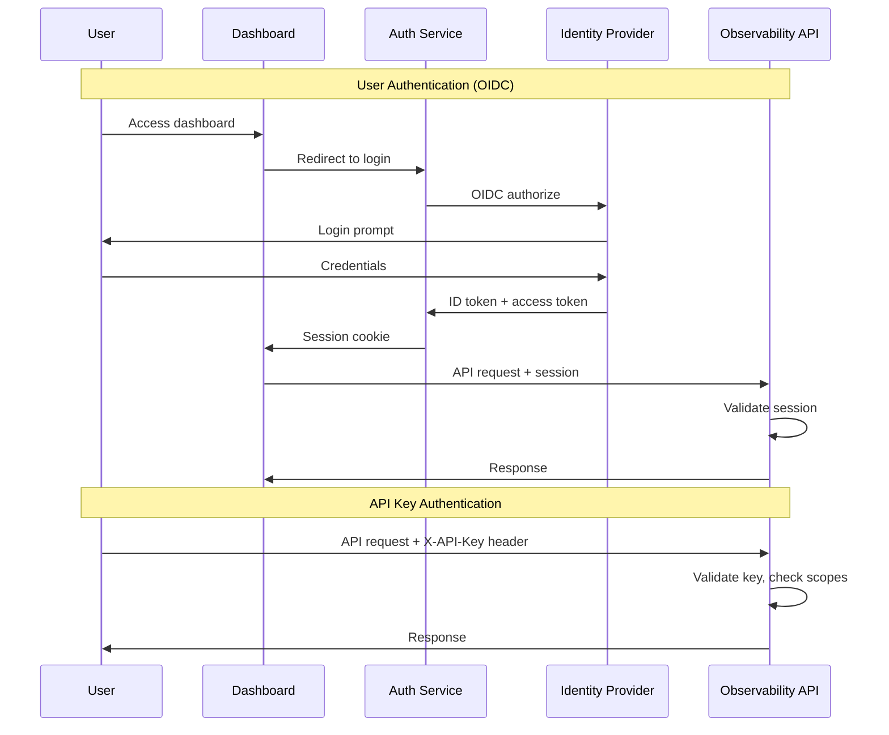
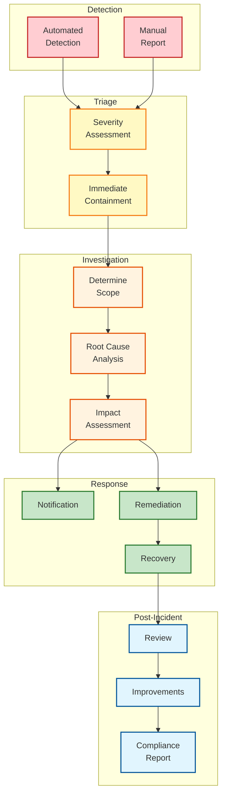

[← Back to Index](./00-index.md)

# Security & Compliance

## Security Architecture Overview

```
┌─────────────────────────────────────────────────────────────────┐
│                    SECURITY LAYERS                              │
├─────────────────────────────────────────────────────────────────┤
│                                                                 │
│  LAYER 1: NETWORK SECURITY                                      │
│  ─────────────────────────                                      │
│  • TLS 1.3 for all communications                               │
│  • mTLS between internal services                               │
│  • Private subnets for data plane                               │
│  • WAF for public endpoints                                     │
│                                                                 │
│  LAYER 2: IDENTITY & ACCESS                                     │
│  ─────────────────────────                                      │
│  • OIDC/SAML for user authentication                            │
│  • API keys with scoped permissions                             │
│  • Service accounts for automation                              │
│  • RBAC for all operations                                      │
│                                                                 │
│  LAYER 3: DATA PROTECTION                                       │
│  ─────────────────────────                                      │
│  • Encryption at rest (AES-256)                                 │
│  • PII detection and redaction                                  │
│  • Field-level encryption for sensitive data                    │
│  • Data masking in non-prod environments                        │
│                                                                 │
│  LAYER 4: AUDIT & MONITORING                                    │
│  ─────────────────────────                                      │
│  • Complete audit trail of all actions                          │
│  • AI decision logging for explainability                       │
│  • Access logs with user attribution                            │
│  • Anomaly detection for security events                        │
│                                                                 │
└─────────────────────────────────────────────────────────────────┘
```

---

## Authentication & Authorization

### Authentication Flows



### Role-Based Access Control (RBAC)

```yaml
# RBAC Configuration
roles:
  viewer:
    description: "Read-only access to observability data"
    permissions:
      - events:read
      - traces:read
      - metrics:read
      - dashboards:read
      - anomalies:read
      - investigations:read

  developer:
    description: "Developer with investigation capabilities"
    inherits: viewer
    permissions:
      - dashboards:write
      - queries:execute
      - investigations:create
      - feedback:submit

  operator:
    description: "Operator who can approve remediation actions"
    inherits: developer
    permissions:
      - actions:approve
      - actions:reject
      - runbooks:execute
      - alerts:acknowledge

  admin:
    description: "Full administrative access"
    inherits: operator
    permissions:
      - users:manage
      - roles:manage
      - integrations:manage
      - retention:configure
      - billing:view

  security_auditor:
    description: "Read-only access to audit logs"
    permissions:
      - audit_logs:read
      - access_logs:read
      - security_events:read
```

### Team-Based Isolation

```python
class TeamIsolation:
    """
    Ensures users can only access data from their team's services.
    """

    def __init__(self, team_service: TeamService):
        self.team_service = team_service

    def apply_filter(self, user: User, query: Query) -> Query:
        """
        Automatically add team filter to all queries.
        """
        # Get user's team memberships
        teams = self.team_service.get_user_teams(user.id)

        # Get services owned by those teams
        allowed_services = self.team_service.get_team_services(teams)

        # Admins and security auditors bypass team filter
        if user.has_role("admin") or user.has_role("security_auditor"):
            return query

        # Add service filter to query
        if query.service_filter:
            # Intersect with allowed services
            query.service_filter = list(
                set(query.service_filter) & set(allowed_services)
            )
        else:
            query.service_filter = allowed_services

        if not query.service_filter:
            raise PermissionDeniedError("No access to requested services")

        return query
```

---

## Data Privacy

### PII Detection and Handling

```
┌─────────────────────────────────────────────────────────────────┐
│                    PII HANDLING PIPELINE                        │
├─────────────────────────────────────────────────────────────────┤
│                                                                 │
│  STAGE 1: DETECTION (at ingestion)                              │
│  ─────────────────────────────────                              │
│                                                                 │
│  Event: {                                                       │
│    "user.email": "john@example.com",        ← PII detected      │
│    "user.id": "u123",                                           │
│    "credit_card": "4111-1111-1111-1111",    ← PII detected      │
│    "http.url": "/api/users?ssn=123-45-6789" ← PII in URL        │
│  }                                                              │
│                                                                 │
│  STAGE 2: CLASSIFICATION                                        │
│  ────────────────────────                                       │
│                                                                 │
│  PII Type          | Sensitivity | Default Action               │
│  ──────────────────|─────────────|──────────────                │
│  Email             | Medium      | Hash                         │
│  Credit Card       | High        | Redact                       │
│  SSN/National ID   | High        | Redact                       │
│  IP Address        | Low         | Keep (configurable)          │
│  Phone Number      | Medium      | Mask                         │
│  Name              | Medium      | Keep (configurable)          │
│                                                                 │
│  STAGE 3: ACTION                                                │
│  ───────────────                                                │
│                                                                 │
│  Processed: {                                                   │
│    "user.email": "sha256:a1b2c3...",        ← Hashed            │
│    "user.id": "u123",                       ← Kept              │
│    "credit_card": "[REDACTED]",             ← Redacted          │
│    "http.url": "/api/users?ssn=[REDACTED]"  ← URL sanitized     │
│  }                                                              │
│                                                                 │
└─────────────────────────────────────────────────────────────────┘
```

### PII Detection Implementation

```python
class PIIDetector:
    """
    Detects and classifies PII in telemetry data.
    """

    # Regex patterns for common PII
    PATTERNS = {
        "email": re.compile(r'\b[A-Za-z0-9._%+-]+@[A-Za-z0-9.-]+\.[A-Z|a-z]{2,}\b'),
        "credit_card": re.compile(r'\b(?:\d{4}[-\s]?){3}\d{4}\b'),
        "ssn": re.compile(r'\b\d{3}[-\s]?\d{2}[-\s]?\d{4}\b'),
        "phone": re.compile(r'\b(?:\+\d{1,3}[-.\s]?)?\(?\d{3}\)?[-.\s]?\d{3}[-.\s]?\d{4}\b'),
        "ip_v4": re.compile(r'\b(?:\d{1,3}\.){3}\d{1,3}\b'),
    }

    # High-risk attribute names
    SENSITIVE_KEYS = {
        "password", "secret", "token", "api_key", "authorization",
        "credit_card", "card_number", "cvv", "ssn", "social_security",
        "national_id", "passport", "driver_license"
    }

    def detect(self, event: Dict) -> List[PIIFinding]:
        findings = []

        for key, value in self._flatten(event).items():
            # Check key name
            if self._is_sensitive_key(key):
                findings.append(PIIFinding(
                    path=key,
                    type="sensitive_key",
                    confidence=0.95
                ))
                continue

            # Check value patterns
            if isinstance(value, str):
                for pii_type, pattern in self.PATTERNS.items():
                    if pattern.search(value):
                        findings.append(PIIFinding(
                            path=key,
                            type=pii_type,
                            confidence=0.9,
                            match=pattern.search(value).group()
                        ))

        return findings

    def process(self, event: Dict, config: PIIConfig) -> Dict:
        """Apply configured actions to detected PII."""
        findings = self.detect(event)

        for finding in findings:
            action = config.get_action(finding.type)

            if action == "redact":
                self._set_nested(event, finding.path, "[REDACTED]")
            elif action == "hash":
                original = self._get_nested(event, finding.path)
                hashed = hashlib.sha256(original.encode()).hexdigest()[:16]
                self._set_nested(event, finding.path, f"sha256:{hashed}")
            elif action == "mask":
                original = self._get_nested(event, finding.path)
                masked = original[:2] + "*" * (len(original) - 4) + original[-2:]
                self._set_nested(event, finding.path, masked)
            # action == "keep" → do nothing

        return event
```

### Data Retention Policies

```yaml
# Retention configuration by data type and sensitivity
retention_policies:
  # Telemetry data
  events:
    hot_tier: 7d
    warm_tier: 90d
    cold_tier: 2y
    pii_redacted: true  # PII removed before cold storage

  traces:
    hot_tier: 7d
    warm_tier: 30d
    cold_tier: 1y

  metrics:
    raw: 7d
    1min_rollup: 30d
    1hr_rollup: 1y
    1day_rollup: 5y

  # Investigation data
  anomalies:
    retention: 2y

  investigations:
    retention: 2y
    include_evidence: true

  # Sensitive operations
  remediation_actions:
    retention: 7y  # Compliance requirement
    include_audit_trail: true

  approvals:
    retention: 7y

  # Audit logs
  audit_logs:
    retention: 7y
    immutable: true  # Cannot be modified or deleted
```

---

## Encryption

### Encryption at Rest

| Data Type | Storage | Encryption | Key Management |
|-----------|---------|------------|----------------|
| Events/Traces | ClickHouse | AES-256-GCM | AWS KMS |
| Metrics | VictoriaMetrics | AES-256-GCM | AWS KMS |
| Cold Storage | S3 | SSE-KMS | AWS KMS |
| Actions/Approvals | PostgreSQL | TDE (AES-256) | AWS KMS |
| Cache | Redis | At-rest disabled | N/A (ephemeral) |
| Backups | S3 | SSE-KMS | Separate key |

### Encryption in Transit

```yaml
# TLS configuration
tls:
  minimum_version: "1.3"
  cipher_suites:
    - TLS_AES_256_GCM_SHA384
    - TLS_CHACHA20_POLY1305_SHA256
    - TLS_AES_128_GCM_SHA256

# mTLS for service-to-service
mtls:
  enabled: true
  ca_certificate: /etc/certs/ca.crt
  client_certificate: /etc/certs/client.crt
  client_key: /etc/certs/client.key
  verify_client: true

# Certificate rotation
certificate_rotation:
  auto_rotate: true
  rotation_period: 30d
  grace_period: 7d
```

### Field-Level Encryption

```python
class FieldLevelEncryption:
    """
    Encrypt specific fields that contain highly sensitive data.
    Used for data that must be stored but rarely accessed.
    """

    ENCRYPTED_FIELDS = [
        "attributes.authorization_header",
        "attributes.api_key",
        "attributes.password",
    ]

    def __init__(self, kms_client: KMSClient, key_id: str):
        self.kms = kms_client
        self.key_id = key_id

    def encrypt_fields(self, event: Dict) -> Dict:
        """Encrypt sensitive fields before storage."""
        for field_path in self.ENCRYPTED_FIELDS:
            value = self._get_nested(event, field_path)
            if value:
                encrypted = self._encrypt(value)
                self._set_nested(event, field_path, {
                    "__encrypted__": True,
                    "ciphertext": base64.b64encode(encrypted).decode(),
                    "key_id": self.key_id
                })
        return event

    def decrypt_fields(self, event: Dict, user: User) -> Dict:
        """Decrypt fields if user has permission."""
        if not user.has_permission("sensitive_data:decrypt"):
            # Return with placeholder
            for field_path in self.ENCRYPTED_FIELDS:
                value = self._get_nested(event, field_path)
                if value and value.get("__encrypted__"):
                    self._set_nested(event, field_path, "[ENCRYPTED]")
            return event

        # Decrypt for authorized users
        for field_path in self.ENCRYPTED_FIELDS:
            value = self._get_nested(event, field_path)
            if value and value.get("__encrypted__"):
                ciphertext = base64.b64decode(value["ciphertext"])
                decrypted = self._decrypt(ciphertext)
                self._set_nested(event, field_path, decrypted)

        return event
```

---

## Audit Trail

### Audit Log Schema

```sql
CREATE TABLE audit_log (
    id UUID PRIMARY KEY DEFAULT gen_random_uuid(),
    timestamp TIMESTAMPTZ NOT NULL DEFAULT NOW(),

    -- Who
    actor_type VARCHAR(20) NOT NULL,  -- 'user', 'service', 'ai_agent', 'system'
    actor_id VARCHAR(255) NOT NULL,
    actor_email VARCHAR(255),
    actor_ip INET,
    actor_user_agent TEXT,

    -- What
    action VARCHAR(100) NOT NULL,
    resource_type VARCHAR(50) NOT NULL,
    resource_id VARCHAR(255),
    resource_name VARCHAR(255),

    -- Context
    request_id VARCHAR(64),
    session_id VARCHAR(64),
    team_id VARCHAR(64),

    -- Details
    details JSONB,
    previous_state JSONB,
    new_state JSONB,

    -- Outcome
    status VARCHAR(20) NOT NULL,  -- 'success', 'failure', 'denied'
    error_message TEXT,

    -- Compliance
    data_classification VARCHAR(20),  -- 'public', 'internal', 'confidential', 'restricted'
    compliance_tags VARCHAR(50)[],    -- ['gdpr', 'hipaa', 'sox']

    -- Indexes
    INDEX idx_timestamp (timestamp),
    INDEX idx_actor (actor_id, timestamp),
    INDEX idx_resource (resource_type, resource_id, timestamp),
    INDEX idx_action (action, timestamp)
);

-- Immutability: No UPDATE or DELETE allowed
REVOKE UPDATE, DELETE ON audit_log FROM PUBLIC;
```

### Audit Events

```python
class AuditLogger:
    """
    Comprehensive audit logging for compliance.
    """

    # Actions that require audit logging
    AUDITED_ACTIONS = {
        # Data access
        "query.execute": "data_access",
        "trace.view": "data_access",
        "event.export": "data_access",

        # AI decisions
        "anomaly.detected": "ai_decision",
        "investigation.completed": "ai_decision",
        "action.proposed": "ai_decision",

        # Remediation
        "action.approved": "remediation",
        "action.rejected": "remediation",
        "action.executed": "remediation",
        "action.failed": "remediation",

        # Administration
        "user.created": "admin",
        "user.deleted": "admin",
        "role.assigned": "admin",
        "integration.configured": "admin",
        "retention.changed": "admin",

        # Security
        "login.success": "security",
        "login.failure": "security",
        "api_key.created": "security",
        "api_key.revoked": "security",
    }

    async def log(
        self,
        action: str,
        actor: Actor,
        resource: Resource,
        details: Dict = None,
        status: str = "success",
        error: str = None
    ):
        event = AuditEvent(
            timestamp=datetime.utcnow(),
            actor_type=actor.type,
            actor_id=actor.id,
            actor_email=actor.email,
            actor_ip=actor.ip,
            action=action,
            resource_type=resource.type,
            resource_id=resource.id,
            resource_name=resource.name,
            details=details,
            status=status,
            error_message=error,
            compliance_tags=self._get_compliance_tags(action, resource)
        )

        # Write to immutable audit log
        await self.audit_store.insert(event)

        # Real-time alerting for sensitive actions
        if action in ["action.executed", "user.deleted", "retention.changed"]:
            await self.alert_security_team(event)
```

---

## Compliance

### Compliance Matrix

| Requirement | SOC 2 | GDPR | HIPAA | Implementation |
|-------------|-------|------|-------|----------------|
| Access Control | ✓ | ✓ | ✓ | RBAC, team isolation |
| Encryption at Rest | ✓ | ✓ | ✓ | AES-256, KMS |
| Encryption in Transit | ✓ | ✓ | ✓ | TLS 1.3, mTLS |
| Audit Logging | ✓ | ✓ | ✓ | Immutable audit trail |
| Data Retention | ✓ | ✓ | ✓ | Configurable policies |
| Right to Erasure | - | ✓ | - | PII deletion workflow |
| Data Portability | - | ✓ | - | Export API |
| Breach Notification | ✓ | ✓ | ✓ | Automated detection |
| Minimum Necessary | - | - | ✓ | Role-based data access |
| BAA Support | - | - | ✓ | Customer agreements |

### GDPR Data Subject Requests

```python
class GDPRComplianceService:
    """
    Handle GDPR data subject requests.
    """

    async def handle_erasure_request(self, subject_id: str, requester: User):
        """
        Process right to erasure (Article 17) request.
        """
        # Verify requester is authorized
        if not self._verify_erasure_authority(requester, subject_id):
            raise UnauthorizedError("Not authorized to request erasure")

        # Find all data related to subject
        data_locations = await self._find_subject_data(subject_id)

        # Create erasure job
        job = ErasureJob(
            subject_id=subject_id,
            requested_by=requester.id,
            requested_at=datetime.utcnow(),
            locations=data_locations,
            status="pending"
        )

        # Queue for processing
        await self.erasure_queue.enqueue(job)

        # Audit log
        await self.audit.log(
            action="gdpr.erasure_requested",
            actor=requester,
            resource=Resource(type="data_subject", id=subject_id),
            details={"locations": len(data_locations)}
        )

        return job

    async def process_erasure_job(self, job: ErasureJob):
        """
        Execute data erasure across all storage systems.
        """
        for location in job.locations:
            try:
                if location.type == "clickhouse":
                    await self._delete_from_clickhouse(location, job.subject_id)
                elif location.type == "s3":
                    await self._delete_from_s3(location, job.subject_id)
                elif location.type == "postgresql":
                    await self._delete_from_postgresql(location, job.subject_id)

                location.status = "completed"
            except Exception as e:
                location.status = "failed"
                location.error = str(e)

        job.status = "completed" if all(l.status == "completed" for l in job.locations) else "partial"
        job.completed_at = datetime.utcnow()

        # Generate compliance certificate
        certificate = self._generate_erasure_certificate(job)

        await self.audit.log(
            action="gdpr.erasure_completed",
            actor=Actor(type="system", id="gdpr_service"),
            resource=Resource(type="erasure_job", id=job.id),
            details={"status": job.status, "certificate": certificate.id}
        )
```

### Security Incident Response



---

## Threat Model

### Attack Surface

| Attack Vector | Risk | Mitigation |
|---------------|------|------------|
| **API Authentication Bypass** | High | OAuth 2.0/OIDC, API key rotation, rate limiting |
| **Data Exfiltration** | High | Query limits, export approval, DLP |
| **Injection (SQL/NoSQL)** | Medium | Parameterized queries, input validation |
| **Privilege Escalation** | High | RBAC, principle of least privilege |
| **Insider Threat** | Medium | Audit logging, separation of duties |
| **Supply Chain** | Medium | Dependency scanning, SBOM |
| **Denial of Service** | Medium | Rate limiting, auto-scaling, WAF |
| **AI Model Poisoning** | Low | Model validation, anomaly detection on training data |

### Security Controls

```yaml
security_controls:
  authentication:
    - oauth2_oidc
    - mfa_required_for_admin
    - api_key_rotation_90d
    - session_timeout_8h

  authorization:
    - rbac_enforced
    - team_isolation
    - attribute_based_access
    - just_in_time_access

  data_protection:
    - encryption_at_rest
    - encryption_in_transit
    - pii_detection
    - field_level_encryption
    - data_masking_nonprod

  network:
    - waf_enabled
    - ddos_protection
    - private_subnets
    - vpc_peering
    - egress_filtering

  monitoring:
    - security_event_detection
    - anomaly_detection
    - failed_login_alerting
    - privileged_action_alerts

  compliance:
    - audit_logging
    - retention_policies
    - data_residency
    - breach_detection
```
