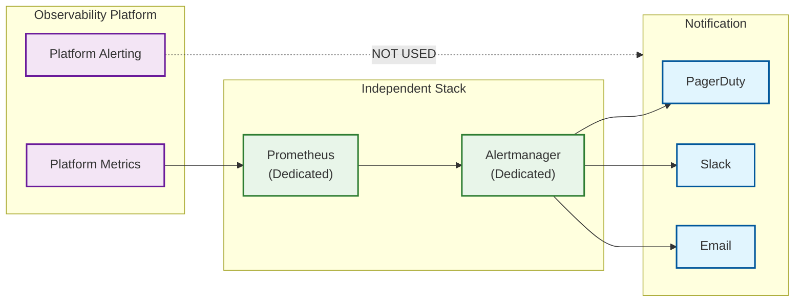

[← Back to Index](./00-index.md)

# Observability (Meta-Observability)

## The Observer Must Be Observed

An observability platform is itself a critical system that requires comprehensive monitoring. When the observability platform fails, engineers lose visibility into all other systems—making platform health paramount.

```
┌─────────────────────────────────────────────────────────────────┐
│              META-OBSERVABILITY PRINCIPLE                       │
├─────────────────────────────────────────────────────────────────┤
│                                                                 │
│  "Who watches the watchmen?"                                    │
│                                                                 │
│  The observability platform must:                               │
│  1. Monitor itself with independent infrastructure              │
│  2. Have separate alerting paths (not through itself)           │
│  3. Maintain health even when customer systems fail             │
│  4. Be the last system to go down during incidents              │
│                                                                 │
│  ┌───────────────────────────────────────────────────────────┐ │
│  │                                                           │ │
│  │   Customer Apps ─────▶ Observability ─────▶ Alerts        │ │
│  │                         Platform                          │ │
│  │                            │                              │ │
│  │                            │                              │ │
│  │                            ▼                              │ │
│  │   Independent ◀───── Meta-Monitoring ─────▶ Separate      │ │
│  │   Prometheus           (Self-hosted)        PagerDuty     │ │
│  │                                                           │ │
│  └───────────────────────────────────────────────────────────┘ │
│                                                                 │
└─────────────────────────────────────────────────────────────────┘
```

---

## Platform Health Metrics

### Ingestion Pipeline Metrics

| Metric | Description | Alert Threshold |
|--------|-------------|-----------------|
| `otel_collector_received_spans_total` | Total spans received | Rate drop > 50% |
| `otel_collector_dropped_spans_total` | Spans dropped due to errors | > 0.1% of received |
| `kafka_consumer_lag` | Lag in Kafka consumers | > 1M messages |
| `kafka_producer_request_latency_p99` | Producer write latency | > 100ms |
| `clickhouse_insert_rows_rate` | Rows inserted per second | Rate drop > 30% |
| `clickhouse_insert_latency_p99` | Insert latency | > 1s |

### Query Layer Metrics

| Metric | Description | Alert Threshold |
|--------|-------------|-----------------|
| `query_latency_p50` | Median query latency | > 100ms |
| `query_latency_p99` | P99 query latency | > 2s |
| `query_error_rate` | Failed queries / total | > 1% |
| `query_timeout_rate` | Timed out queries | > 0.1% |
| `cache_hit_ratio` | Redis cache hit rate | < 70% |
| `concurrent_queries` | Active queries | > 80% capacity |

### AI Layer Metrics

| Metric | Description | Alert Threshold |
|--------|-------------|-----------------|
| `anomaly_detection_latency_p99` | Time to detect anomaly | > 60s |
| `false_positive_rate` | False alerts / total alerts | > 10% |
| `investigation_completion_rate` | Investigations completed successfully | < 95% |
| `investigation_duration_p95` | Time to complete investigation | > 5 min |
| `model_inference_latency_p99` | ML model inference time | > 500ms |
| `model_staleness_hours` | Hours since baseline update | > 24h |

### Remediation Pipeline Metrics

| Metric | Description | Alert Threshold |
|--------|-------------|-----------------|
| `actions_pending_approval` | Actions waiting for approval | > 10 |
| `approval_latency_p95` | Time from proposal to decision | > 30 min |
| `action_execution_success_rate` | Successful executions | < 98% |
| `action_execution_duration_p95` | Execution time | > 5 min |

---

## Health Dashboards

### System Overview Dashboard

```
┌─────────────────────────────────────────────────────────────────┐
│                    PLATFORM HEALTH OVERVIEW                     │
├─────────────────────────────────────────────────────────────────┤
│                                                                 │
│  INGESTION          STORAGE           QUERY            AI      │
│  ──────────         ───────           ─────            ──      │
│  ████████ 98%      ████████ 95%     ████████ 99%    ████░░ 85% │
│  8.2M/s recv       1.2 PB used      1.8K QPS        12 invest  │
│  0.01% drop        45% capacity     P99: 450ms      FPR: 4.2%  │
│                                                                 │
│  ┌─────────────────────────────────────────────────────────┐   │
│  │ INGESTION RATE (24h)                                    │   │
│  │                                                         │   │
│  │  10M ─┬─────────────────────────────────────────────    │   │
│  │       │    ████████████████████████████████             │   │
│  │   5M ─┤ ███████████████████████████████████████████     │   │
│  │       │████████████████████████████████████████████     │   │
│  │    0 ─┴─────────────────────────────────────────────    │   │
│  │       00:00  04:00  08:00  12:00  16:00  20:00  24:00   │   │
│  └─────────────────────────────────────────────────────────┘   │
│                                                                 │
│  ┌─────────────────────────────────────────────────────────┐   │
│  │ RECENT ALERTS                                           │   │
│  │                                                         │   │
│  │ 🔴 10:45 - Kafka lag spike (resolved)                   │   │
│  │ 🟡 09:30 - Query latency elevated (investigating)       │   │
│  │ 🟢 08:15 - All systems nominal                          │   │
│  └─────────────────────────────────────────────────────────┘   │
│                                                                 │
└─────────────────────────────────────────────────────────────────┘
```

### Component Health Dashboard

```yaml
# Grafana dashboard configuration
dashboard:
  title: "Observability Platform Health"
  refresh: "10s"

  rows:
    - title: "Ingestion Health"
      panels:
        - type: stat
          title: "Events/sec"
          query: "sum(rate(otel_collector_received_spans_total[1m]))"
          thresholds:
            - value: 0
              color: red
            - value: 5000000
              color: yellow
            - value: 8000000
              color: green

        - type: graph
          title: "Kafka Consumer Lag"
          query: "kafka_consumer_group_lag{topic='traces'}"
          alert:
            condition: "> 1000000"
            for: "5m"

    - title: "Query Performance"
      panels:
        - type: heatmap
          title: "Query Latency Distribution"
          query: "histogram_quantile(0.99, query_duration_seconds_bucket)"

        - type: stat
          title: "Cache Hit Rate"
          query: "sum(rate(cache_hits_total[5m])) / sum(rate(cache_requests_total[5m]))"

    - title: "AI Health"
      panels:
        - type: stat
          title: "Active Investigations"
          query: "count(investigation_status{status='in_progress'})"

        - type: graph
          title: "False Positive Rate (7d rolling)"
          query: "sum(alert_feedback{type='false_positive'}) / sum(alert_total)"
```

---

## Alerting Strategy

### Alert Hierarchy

```
┌─────────────────────────────────────────────────────────────────┐
│                      ALERT HIERARCHY                            │
├─────────────────────────────────────────────────────────────────┤
│                                                                 │
│  SEVERITY 1: CRITICAL (Page immediately)                        │
│  ──────────────────────────────────────                         │
│  • Platform completely unavailable                              │
│  • Data loss occurring                                          │
│  • Security breach detected                                     │
│  • All AI detection stopped                                     │
│                                                                 │
│  SEVERITY 2: HIGH (Page during business hours)                  │
│  ─────────────────────────────────────────────                  │
│  • Ingestion rate dropped > 50%                                 │
│  • Query latency > 5x normal                                    │
│  • AI false positive rate > 20%                                 │
│  • Single region failure                                        │
│                                                                 │
│  SEVERITY 3: MEDIUM (Slack notification)                        │
│  ─────────────────────────────────────────                      │
│  • Kafka lag building (> 1M)                                    │
│  • Storage approaching capacity (> 80%)                         │
│  • Model staleness detected                                     │
│  • Single component degraded                                    │
│                                                                 │
│  SEVERITY 4: LOW (Dashboard/ticket)                             │
│  ────────────────────────────────────                           │
│  • Minor performance degradation                                │
│  • Non-critical component restart                               │
│  • Configuration drift detected                                 │
│                                                                 │
└─────────────────────────────────────────────────────────────────┘
```

### Alert Configuration

```yaml
# Prometheus alerting rules
groups:
  - name: observability_platform_critical
    rules:
      - alert: IngestionCompletelyDown
        expr: sum(rate(otel_collector_received_spans_total[5m])) == 0
        for: 2m
        labels:
          severity: critical
          team: platform
        annotations:
          summary: "No telemetry being ingested"
          description: "Ingestion rate is zero for 2 minutes"
          runbook: "https://runbooks.internal/ingestion-down"

      - alert: DataLossOccurring
        expr: rate(otel_collector_dropped_spans_total[5m]) / rate(otel_collector_received_spans_total[5m]) > 0.01
        for: 5m
        labels:
          severity: critical
        annotations:
          summary: "Data loss rate > 1%"
          description: "{{ $value | humanizePercentage }} of spans being dropped"

  - name: observability_platform_high
    rules:
      - alert: IngestionRateDropped
        expr: |
          sum(rate(otel_collector_received_spans_total[5m])) <
          sum(rate(otel_collector_received_spans_total[1h] offset 1h)) * 0.5
        for: 10m
        labels:
          severity: high
        annotations:
          summary: "Ingestion rate dropped > 50%"

      - alert: QueryLatencyHigh
        expr: histogram_quantile(0.99, query_duration_seconds_bucket) > 5
        for: 10m
        labels:
          severity: high
        annotations:
          summary: "P99 query latency > 5s"
```

### Independent Alerting Path



---

## AI Model Monitoring

### Model Performance Tracking

| Metric | Description | Target | Alert |
|--------|-------------|--------|-------|
| **Prediction Accuracy** | Anomalies confirmed vs total | > 90% | < 80% |
| **False Positive Rate** | False alerts / total alerts | < 5% | > 10% |
| **False Negative Rate** | Missed incidents / total incidents | < 2% | > 5% |
| **Model Latency** | Inference time | < 100ms P99 | > 500ms |
| **Baseline Freshness** | Time since baseline update | < 24h | > 48h |
| **Feature Drift** | Distribution shift in features | Low | High drift |

### Model Quality Dashboard

```
┌─────────────────────────────────────────────────────────────────┐
│                    AI MODEL HEALTH                              │
├─────────────────────────────────────────────────────────────────┤
│                                                                 │
│  ANOMALY DETECTION QUALITY (7d rolling)                         │
│  ────────────────────────────────────────                       │
│                                                                 │
│  True Positives:  ████████████████████████████████  89%        │
│  False Positives: ████░░░░░░░░░░░░░░░░░░░░░░░░░░░░   4%        │
│  False Negatives: ██░░░░░░░░░░░░░░░░░░░░░░░░░░░░░░   2%        │
│  Unknown:         ██░░░░░░░░░░░░░░░░░░░░░░░░░░░░░░   5%        │
│                                                                 │
│  ┌─────────────────────────────────────────────────────────┐   │
│  │ FALSE POSITIVE RATE TREND                               │   │
│  │                                                         │   │
│  │  10% ─┬─────────────────────────────────────────────    │   │
│  │       │█                                                │   │
│  │   5% ─┤ ██████████                                      │   │
│  │       │          ██████████████████████████████████     │   │
│  │    0% ─┴─────────────────────────────────────────────    │   │
│  │       -7d   -6d   -5d   -4d   -3d   -2d   -1d   now     │   │
│  └─────────────────────────────────────────────────────────┘   │
│                                                                 │
│  MODEL VERSIONS                                                 │
│  ──────────────                                                 │
│                                                                 │
│  checkout-service/latency                                       │
│    v2.3.1 (active)  - trained 4h ago  - accuracy: 91%          │
│    v2.3.0 (shadow)  - trained 28h ago - accuracy: 89%          │
│                                                                 │
│  payment-service/error_rate                                     │
│    v1.8.0 (active)  - trained 12h ago - accuracy: 94%          │
│                                                                 │
└─────────────────────────────────────────────────────────────────┘
```

### Feedback Loop Implementation

```python
class ModelFeedbackProcessor:
    """
    Processes human feedback to improve AI models.
    """

    async def process_feedback(self, feedback: AlertFeedback):
        """
        Record feedback and trigger model updates if needed.
        """
        # Record feedback
        await self.feedback_store.save(feedback)

        # Update quality metrics
        await self.update_quality_metrics(feedback)

        # Check if model needs retraining
        recent_feedback = await self.get_recent_feedback(
            model_id=feedback.model_id,
            window=timedelta(days=7)
        )

        false_positive_rate = self.calculate_fpr(recent_feedback)

        if false_positive_rate > 0.1:  # > 10% FPR
            # Trigger retraining with negative examples
            await self.trigger_retrain(
                model_id=feedback.model_id,
                reason="high_fpr",
                negative_examples=self.extract_false_positives(recent_feedback)
            )

            await self.alert_ml_team(
                f"Model {feedback.model_id} FPR exceeded 10%, retraining triggered"
            )

    async def update_quality_metrics(self, feedback: AlertFeedback):
        """Update real-time quality metrics based on feedback."""
        labels = {
            "model_id": feedback.model_id,
            "service": feedback.service,
            "feedback_type": feedback.type.value
        }

        if feedback.type == FeedbackType.TRUE_POSITIVE:
            self.metrics.true_positives.labels(**labels).inc()
        elif feedback.type == FeedbackType.FALSE_POSITIVE:
            self.metrics.false_positives.labels(**labels).inc()
        elif feedback.type == FeedbackType.FALSE_NEGATIVE:
            self.metrics.false_negatives.labels(**labels).inc()

        # Update rolling FPR gauge
        fpr = await self.calculate_rolling_fpr(feedback.model_id)
        self.metrics.fpr_gauge.labels(model_id=feedback.model_id).set(fpr)
```

---

## Capacity Planning

### Resource Utilization Tracking

```yaml
capacity_metrics:
  ingestion:
    - metric: otel_collector_cpu_percent
      current: 65%
      capacity: 80%
      growth_rate: "2%/week"
      runway: "7 weeks"

    - metric: kafka_partition_count
      current: 256
      capacity: 1024
      growth_rate: "0/week"
      runway: "Stable"

  storage:
    - metric: clickhouse_disk_used_percent
      current: 45%
      capacity: 80%
      growth_rate: "1%/week"
      runway: "35 weeks"

    - metric: s3_storage_bytes
      current: "1.2 PB"
      capacity: "Unlimited"
      growth_rate: "5 TB/day"
      cost: "$30,000/month"

  query:
    - metric: query_cluster_cpu_percent
      current: 55%
      capacity: 75%
      growth_rate: "3%/week"
      runway: "7 weeks"

  ai:
    - metric: gpu_utilization_percent
      current: 70%
      capacity: 85%
      growth_rate: "5%/week"
      runway: "3 weeks"
      action_required: true
```

### Capacity Alerts

```yaml
alerts:
  - name: StorageCapacityLow
    condition: clickhouse_disk_used_percent > 70
    severity: medium
    message: "ClickHouse storage at {{ value }}%, add capacity within 4 weeks"

  - name: GPUCapacityCritical
    condition: gpu_utilization_percent > 80
    severity: high
    message: "GPU cluster at {{ value }}%, scale up immediately"

  - name: IngestionHeadroomLow
    condition: |
      (otel_collector_cpu_percent > 70) or
      (kafka_consumer_lag > 500000)
    severity: medium
    message: "Ingestion approaching capacity, plan scaling"
```

---

## Runbooks

### Runbook: High Kafka Lag

```yaml
runbook:
  name: "High Kafka Consumer Lag"
  trigger: "kafka_consumer_lag > 1000000 for 10m"

  diagnosis:
    - step: "Check consumer group status"
      command: "kafka-consumer-groups.sh --describe --group observability-consumers"

    - step: "Check consumer pod health"
      command: "kubectl get pods -l app=stream-processor"

    - step: "Check ClickHouse insert queue"
      command: "SELECT * FROM system.asynchronous_inserts"

  common_causes:
    - cause: "Consumer pods crashed"
      resolution: "Check logs, restart pods"

    - cause: "ClickHouse insert slow"
      resolution: "Check CH health, scale up, or increase batch size"

    - cause: "Traffic spike"
      resolution: "Scale consumers, enable backpressure sampling"

  resolution:
    - step: "Scale stream processors"
      command: "kubectl scale deployment stream-processor --replicas=10"

    - step: "If still lagging, enable aggressive sampling"
      command: |
        kubectl set env deployment/otel-gateway \
          SAMPLING_RATE=0.1 \
          SAMPLING_KEEP_ERRORS=true
```

### Runbook: AI Detection Stopped

```yaml
runbook:
  name: "AI Anomaly Detection Stopped"
  trigger: "rate(anomalies_detected_total[10m]) == 0"

  diagnosis:
    - step: "Check AI inference pods"
      command: "kubectl get pods -l app=anomaly-detector"

    - step: "Check GPU availability"
      command: "nvidia-smi"

    - step: "Check model loading"
      command: "kubectl logs -l app=anomaly-detector | grep 'model loaded'"

  common_causes:
    - cause: "GPU node failure"
      resolution: "Check node status, drain and replace"

    - cause: "Model OOM"
      resolution: "Check memory, increase limits or reduce batch size"

    - cause: "Feature pipeline failure"
      resolution: "Check Flink jobs, restart if needed"

  resolution:
    - step: "Restart anomaly detector"
      command: "kubectl rollout restart deployment anomaly-detector"

    - step: "Verify detection resuming"
      command: "kubectl logs -f -l app=anomaly-detector | grep 'anomaly detected'"

    - step: "If GPU issue, drain node"
      command: |
        kubectl drain node-gpu-01 --ignore-daemonsets
        # Replace node via cloud provider
```
