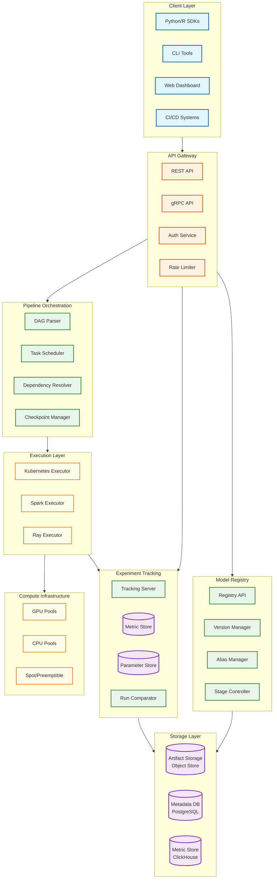

# MLOps Platform

## Overview

The **MLOps Platform** is an end-to-end infrastructure for managing the machine learning training lifecycle, from experimentation to production-ready model artifacts. It orchestrates training pipelines, tracks experiments with rich metadata, and maintains a versioned model registry with governance capabilities. Unlike serving infrastructure (covered in [3.2 ML Models Deployment System](../3.2-ml-models-deployment-system/00-index.md)), this system focuses on **reproducibility, collaboration, and the iterative nature of ML development**.

**Key Differentiator:** Comprehensive training lifecycle management with pipeline orchestration, experiment tracking supporting 100K+ runs per experiment, and a model registry with atomic alias management (@champion/@production) - enabling data scientists to iterate rapidly while maintaining production-grade governance.

---

## System Characteristics

| Characteristic | Value | Implication |
|----------------|-------|-------------|
| Traffic Pattern | Compute-intensive, bursty (training jobs) | Dynamic resource allocation, job queuing, spot instances |
| Latency Target | N/A (batch processing), <100ms for API | Optimize for throughput, not inference latency |
| Consistency Model | Strong (registry/aliases), Eventual (metrics) | ACID for model governance, buffered metric writes |
| Availability Target | 99.9% platform, jobs have retry/checkpoint | Graceful job recovery, checkpoint resumption |
| Resource Type | GPU/TPU clusters, distributed compute | Heterogeneous scheduling, cost optimization |
| Scale Target | 10K+ concurrent experiments, 100K+ runs | Horizontal scaling, tiered storage |

---

## Complexity Rating

| Component | Rating | Justification |
|-----------|--------|---------------|
| **Overall** | High | Multi-component orchestration + distributed training + metadata management |
| Pipeline Orchestrator | High | DAG scheduling, dependency resolution, distributed execution, checkpointing |
| Model Registry | Medium | Version control, artifact storage, alias management, stage transitions |
| Experiment Tracker | Medium | High-cardinality metrics, flexible schema, comparison tools |
| Feature Store Integration | High | Training-serving skew prevention, point-in-time retrieval |
| Hyperparameter Tuning | High | Search algorithms, early stopping, resource optimization |
| Artifact Storage | Medium | Large file handling, deduplication, lineage tracking |
| Compute Scheduler | High | GPU memory, distributed training, preemptible instances |

---

## Quick Navigation

| Document | Description |
|----------|-------------|
| [01 - Requirements & Estimations](./01-requirements-and-estimations.md) | Functional/non-functional requirements, capacity planning, SLOs |
| [02 - High-Level Design](./02-high-level-design.md) | Architecture, data flow, key decisions |
| [03 - Low-Level Design](./03-low-level-design.md) | Data model, APIs, core algorithms |
| [04 - Deep Dive & Bottlenecks](./04-deep-dive-and-bottlenecks.md) | Scheduler, tracker, registry internals |
| [05 - Scalability & Reliability](./05-scalability-and-reliability.md) | Scaling strategy, fault tolerance |
| [06 - Security & Compliance](./06-security-and-compliance.md) | Model governance, access control, compliance |
| [07 - Observability](./07-observability.md) | Metrics, drift detection, alerting |
| [08 - Interview Guide](./08-interview-guide.md) | 45-minute pacing, trap questions, trade-offs |

---

## Core Modules

| Module | Responsibility | Key Challenge |
|--------|----------------|---------------|
| **Pipeline Orchestrator** | DAG execution, scheduling, retries, distributed coordination | Checkpoint recovery, resource-aware placement |
| **Experiment Tracker** | Run logging, metric/artifact storage, comparison | High-cardinality data, flexible GenAI schema |
| **Model Registry** | Version control, aliases, staging workflow | Atomic alias updates, governance enforcement |
| **Artifact Store** | Binary storage, deduplication, CDN | Large files (100GB+ LLMs), efficient retrieval |
| **Metadata Store** | Lineage, parameters, environment capture | Queryable history, reproducibility |
| **Compute Scheduler** | Resource allocation, job placement, preemption | Heterogeneous hardware, cost optimization |
| **Feature Store Connector** | Training-serving consistency, point-in-time joins | Skew prevention, freshness management |

---

## Architecture Overview



---

## MLOps Platform vs ML Deployment System

| Aspect | MLOps Platform (This Design) | ML Deployment System (3.2) |
|--------|------------------------------|----------------------------|
| **Focus** | Training lifecycle, experimentation | Inference, real-time serving |
| **Primary Users** | Data scientists, ML engineers | ML engineers, SREs |
| **Latency Requirements** | N/A (batch), <100ms API | <100ms p99 inference |
| **Key Components** | Pipeline orchestrator, experiment tracker, model registry | Inference gateway, A/B router, model server |
| **Resource Optimization** | Training throughput, GPU utilization | Inference latency, dynamic batching |
| **Consistency Priority** | Strong for registry metadata | Eventual for model updates |
| **Scaling Triggers** | Job queue depth, concurrent experiments | QPS, GPU memory utilization |
| **Monitoring Focus** | Job success rate, resource utilization | Latency, prediction drift |

---

## MLOps Maturity Levels

| Level | Description | Platform Capabilities |
|-------|-------------|----------------------|
| **Level 0** | Manual ML | Jupyter notebooks, manual deployment |
| **Level 1** | ML Pipeline | Automated training, basic versioning |
| **Level 2** | CI/CD for ML | Automated testing, model validation |
| **Level 3** | Full MLOps | Continuous training, drift detection, auto-retraining |

This design targets **Level 2-3** capabilities with extensibility for advanced automation.

---

## When to Use This Design

**Use MLOps Platform When:**
- Multiple data scientists collaborating on experiments
- Need reproducibility and auditability
- Complex multi-step training pipelines
- Model governance and approval workflows required
- Hyperparameter tuning at scale
- Integration with feature stores needed
- CI/CD for ML models required

**Do NOT Use When:**
- Single-model, infrequent training (manual suffices)
- No reproducibility requirements
- Real-time inference focus (use 3.2 instead)
- Limited engineering resources for platform ops
- Small scale (<10 experiments/week)

---

## Technology Stack Reference

| Layer | Technology Options | Selection Criteria |
|-------|-------------------|-------------------|
| **Pipeline Orchestration** | Airflow, Dagster, Prefect, Kubeflow Pipelines | Maturity, asset-centric, K8s-native |
| **Experiment Tracking** | MLflow, Weights & Biases, Neptune.ai | Open-source vs managed, scale, UI |
| **Model Registry** | MLflow Registry, Kubeflow Model Registry | Integration, governance features |
| **Artifact Storage** | Object Storage (S3-compatible) | Durability, cost, CDN support |
| **Metadata Database** | PostgreSQL, MySQL | ACID, JSONB support |
| **Metric Storage** | ClickHouse, TimescaleDB, InfluxDB | High-cardinality, query performance |
| **Compute Orchestration** | Kubernetes, Ray, Spark | Distributed training, GPU support |
| **Feature Store** | Feast, Tecton, Hopsworks | Online/offline serving, freshness |

---

## Key Numbers

| Metric | Value | Context |
|--------|-------|---------|
| Pipeline submission latency | <5s | User experience |
| Experiment log write latency | <100ms | Real-time feedback during training |
| Model registry query latency | <200ms | API responsiveness |
| Artifact download throughput | >100MB/s | Large model retrieval |
| Concurrent experiments | 10,000+ | Enterprise scale |
| Runs per experiment | 100,000+ | Hyperparameter sweeps |
| Model versions | 1,000,000+ | Long-term storage |
| Checkpoint interval | 10-30 min | Recovery vs overhead trade-off |
| PSI drift threshold | 0.2 | Training-serving skew detection |

---

## Interview Readiness Checklist

- [ ] Can explain difference between MLOps (training) and ML Deployment (serving)
- [ ] Understand DAG scheduling and topological sort for pipelines
- [ ] Know experiment tracking data model (experiments, runs, metrics, artifacts)
- [ ] Can design model registry with aliases and stage transitions
- [ ] Understand training-serving skew and feature store role
- [ ] Know checkpoint strategies for long-running distributed training
- [ ] Can discuss trade-offs: Git vs custom versioning, YAML vs Python pipelines
- [ ] Understand high-cardinality metric storage challenges
- [ ] Can design for reproducibility (code, data, environment versioning)
- [ ] Know real-world MLOps platforms (Michelangelo, Metaflow, FBLearner)

---

## Real-World References

| Company | System | Key Innovation |
|---------|--------|----------------|
| **Uber** | Michelangelo | End-to-end ML platform, feature store, model serving |
| **Netflix** | Metaflow | Human-centric ML, Python-native, versioned data |
| **Airbnb** | Bighead | Unified training and serving, Zipline feature store |
| **Meta** | FBLearner Flow | Declarative workflows, massive scale (1M+ models) |
| **Google** | TFX / Vertex AI | Pipeline components, managed infrastructure |
| **LinkedIn** | Pro-ML | Feature marketplace, model governance |
| **Spotify** | Luigi + MLflow | Orchestration + tracking combination |
| **DoorDash** | Sibyl | Real-time features, model deployment |

---

## Quick Reference Card

```
+-----------------------------------------------------------------------+
|          MLOPS PLATFORM - QUICK REFERENCE                              |
+-----------------------------------------------------------------------+
|                                                                        |
|  CORE COMPONENTS                   KEY PATTERNS                        |
|  ----------------                  -------------                        |
|  * Pipeline Orchestrator           * DAG-based execution               |
|  * Experiment Tracker              * Immutable run artifacts           |
|  * Model Registry                  * Alias-based deployment            |
|  * Artifact Store                  * Checkpoint recovery               |
|  * Metadata Store                  * Tiered metric storage             |
|  * Compute Scheduler               * Feature store integration         |
|                                                                        |
+-----------------------------------------------------------------------+
|                                                                        |
|  SCALE TARGETS                     LATENCY TARGETS                     |
|  --------------                    ----------------                    |
|  * 10K+ concurrent experiments     * Pipeline submit: <5s              |
|  * 100K+ runs/experiment           * Metric write: <100ms              |
|  * 1M+ model versions              * Registry query: <200ms            |
|  * PB-scale artifact storage       * Artifact download: >100MB/s       |
|  * 99.9% platform availability                                         |
|                                                                        |
+-----------------------------------------------------------------------+
|                                                                        |
|  INTERVIEW KEYWORDS                                                    |
|  ------------------                                                    |
|  DAG orchestration, topological sort, experiment tracking,             |
|  model versioning, alias (@champion), stage transitions,               |
|  training-serving skew, feature store, point-in-time joins,            |
|  checkpoint recovery, distributed training, hyperparameter tuning,     |
|  reproducibility, lineage tracking, GitOps for ML, model governance    |
|                                                                        |
+-----------------------------------------------------------------------+
```

---

## Related Systems

- [3.2 ML Models Deployment System](../3.2-ml-models-deployment-system/00-index.md) - Inference and serving
- [3.5 Uber Michelangelo](../README.md) - Uber's ML platform case study (upcoming)
- [3.6 Netflix Metaflow](../README.md) - Netflix's ML workflow platform (upcoming)
- [2.6 Distributed Job Scheduler](../2.6-distributed-job-scheduler/00-index.md) - Job scheduling patterns
- [1.5 Distributed Log-Based Broker](../1.5-distributed-log-based-broker/00-index.md) - Event streaming for ML events
