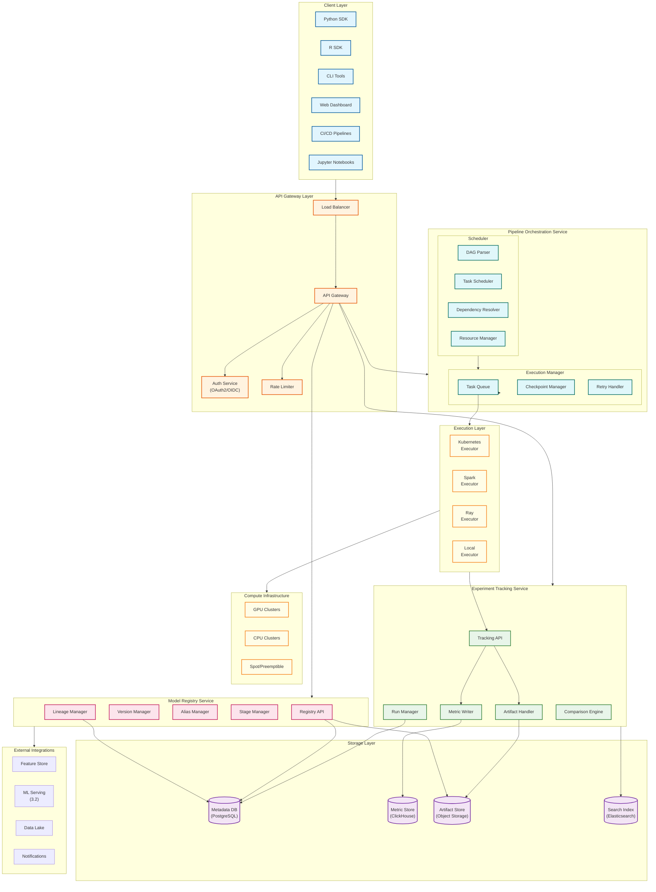
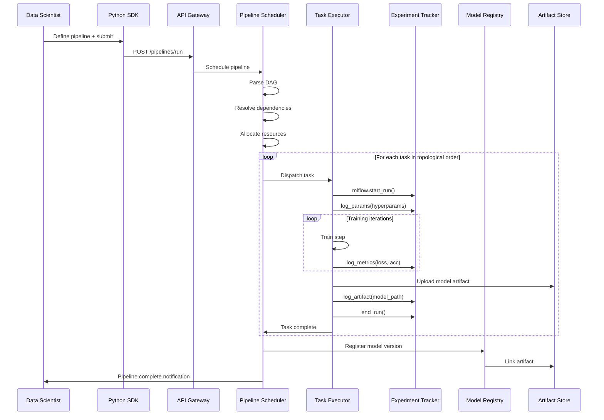
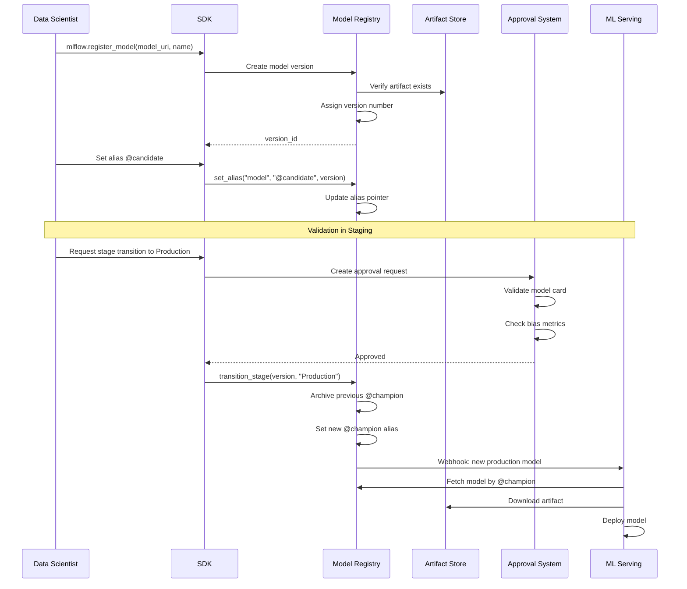
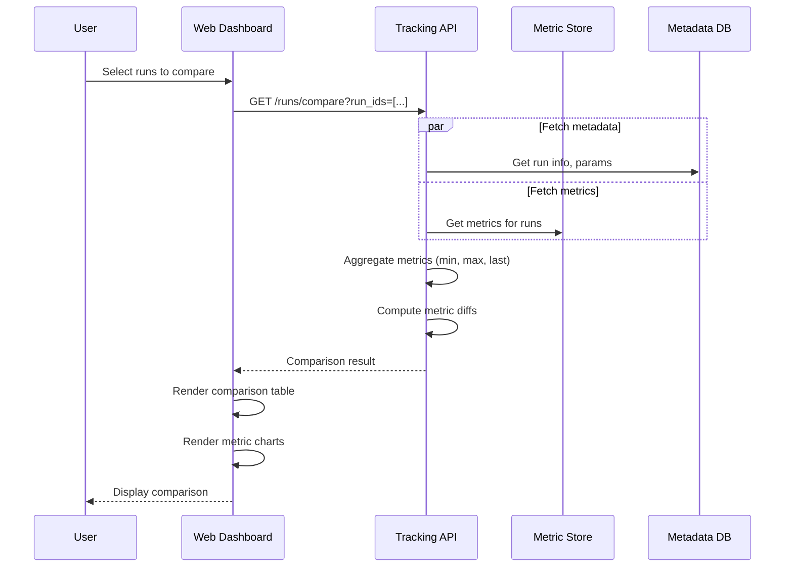
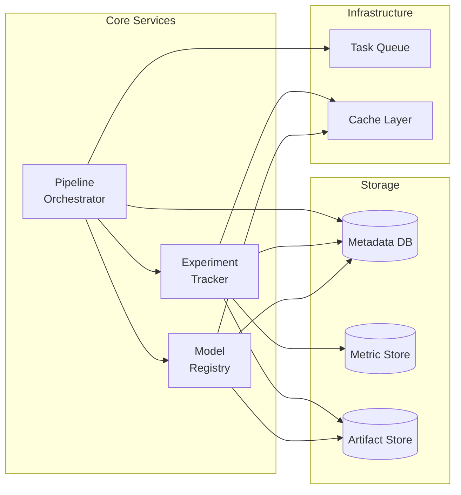
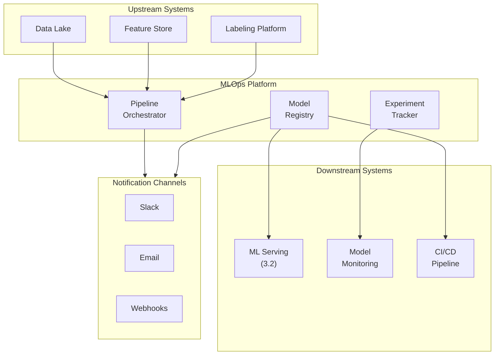
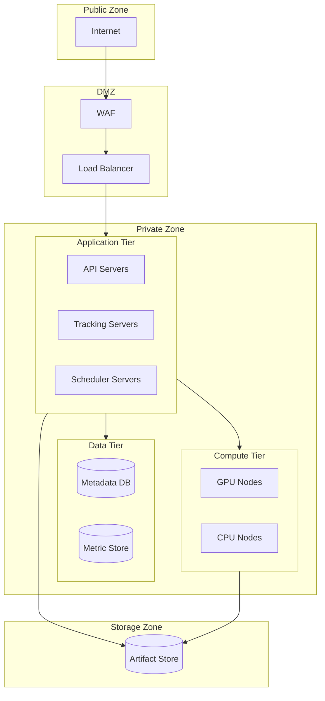
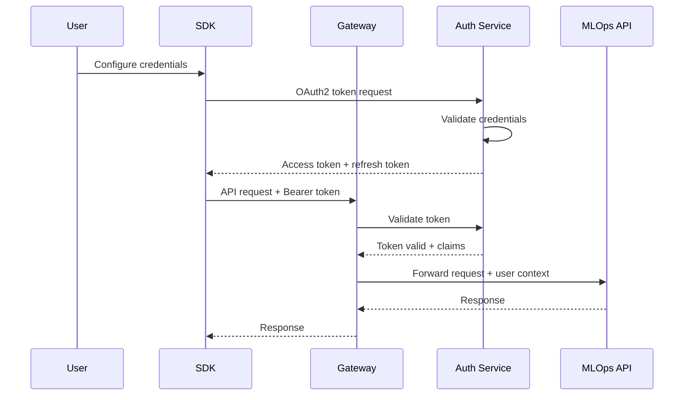

# High-Level Design

[Back to Index](./00-index.md)

---

## System Architecture

The MLOps Platform follows a modular architecture with clear separation between pipeline orchestration, experiment tracking, and model registry. Each component can scale independently while maintaining integration through well-defined APIs and shared storage.



---

## Data Flow Diagrams

### Training Pipeline Execution Flow



### Model Registration and Promotion Flow



### Experiment Comparison Flow



---

## Key Architectural Decisions

### Decision 1: Pipeline Definition Language

| Option | Pros | Cons |
|--------|------|------|
| **Python SDK (code-first)** | Full expressiveness, IDE support, testable | Harder to visualize, version control of DAG |
| **YAML (config-first)** | Declarative, easy visualization, GitOps friendly | Limited expressiveness, no conditionals |
| **Hybrid (Recommended)** | Best of both - Python compiles to YAML | Additional complexity |

**Decision:** Hybrid approach where Python SDK generates serializable DAG definitions.

```
# Python definition
@pipeline
def training_pipeline(learning_rate: float):
    data = prepare_data()
    model = train_model(data, lr=learning_rate)
    evaluate_model(model)

# Compiles to YAML for execution
pipeline:
  name: training_pipeline
  tasks:
    - id: prepare_data
      operator: python
    - id: train_model
      depends_on: [prepare_data]
      params: {lr: "{{learning_rate}}"}
    - id: evaluate_model
      depends_on: [train_model]
```

### Decision 2: Metric Storage Backend

| Option | Pros | Cons |
|--------|------|------|
| **PostgreSQL** | Simple, ACID, familiar | Poor for time-series, cardinality issues |
| **InfluxDB** | Time-series optimized | Limited query flexibility |
| **ClickHouse (Recommended)** | High cardinality, fast aggregations, SQL | Operational complexity |
| **TimescaleDB** | PostgreSQL compatible, time-series | Scaling challenges |

**Decision:** ClickHouse for metric storage due to:
- High-cardinality support (millions of unique run IDs)
- Fast analytical queries (aggregations, comparisons)
- Efficient compression for numeric time-series
- SQL compatibility for ad-hoc queries

### Decision 3: Model Registry Consistency

| Option | Pros | Cons |
|--------|------|------|
| **Eventual consistency** | Higher availability, simpler | Alias race conditions possible |
| **Strong consistency (Recommended)** | Atomic alias updates, no phantom reads | Slightly lower availability |

**Decision:** Strong consistency for model registry because:
- Alias updates must be atomic (only one @champion at a time)
- Production deployment depends on correct alias resolution
- Acceptable trade-off given registry is not high-throughput

### Decision 4: Artifact Storage Strategy

| Option | Pros | Cons |
|--------|------|------|
| **Inline in DB** | Simple, transactional | Size limits, backup complexity |
| **Object storage (Recommended)** | Scalable, cost-effective, CDN-ready | Eventual consistency, separate system |
| **Distributed FS (HDFS)** | Fast for large files | Operational overhead |

**Decision:** Object storage (S3-compatible) because:
- Unlimited scale for PB of model artifacts
- Built-in durability (11 9s)
- Cost-effective for large files
- CDN integration for fast downloads

### Decision 5: Executor Architecture

| Option | Pros | Cons |
|--------|------|------|
| **Push-based** | Lower latency, simpler workers | Scheduler bottleneck |
| **Pull-based (Recommended)** | Scalable, workers self-pace | Polling overhead |
| **Hybrid** | Adaptive | Complexity |

**Decision:** Pull-based with long-polling because:
- Executors pull tasks from queue when ready
- Natural backpressure handling
- Easy horizontal scaling
- Fault-tolerant (task requeue on failure)

---

## Architecture Pattern Checklist

| Pattern | Decision | Rationale |
|---------|----------|-----------|
| **Sync vs Async** | Async for pipeline execution, sync for API | Training is long-running |
| **Event-driven vs Request-response** | Event-driven (task completion triggers next) | DAG workflow pattern |
| **Push vs Pull** | Pull-based task execution | Executor scalability |
| **Stateless vs Stateful** | Stateless services, stateful storage | Horizontal scaling |
| **Read-heavy vs Write-heavy** | Write-heavy (metrics), read-heavy (registry) | Tiered storage strategy |
| **Real-time vs Batch** | Batch metric writes, real-time alerts | Efficiency vs freshness |

---

## Component Interactions

### Service Dependencies



### Failure Domain Isolation

| Service | Failure Impact | Isolation Strategy |
|---------|---------------|-------------------|
| Pipeline Scheduler | New jobs can't start | Leader election, job queue persists |
| Experiment Tracker | Metrics may buffer client-side | Client buffering, async writes |
| Model Registry | Can't promote models | Read replicas for queries |
| Metric Store | Historical queries fail | Hot/warm/cold tiering |
| Artifact Store | Can't download models | CDN caching, multi-region |

---

## Integration Points

### External System Integrations



### Integration Patterns

| Integration | Pattern | Protocol |
|-------------|---------|----------|
| Feature Store | SDK integration, point-in-time API | gRPC |
| Data Lake | URI-based references | S3/GCS protocol |
| ML Serving | Webhook on model promotion | HTTP + Object storage |
| CI/CD | API trigger, artifact download | REST API |
| Monitoring | Metric export, alert subscription | Prometheus/OpenTelemetry |

---

## Technology Mapping

### Recommended Stack

| Component | Primary Choice | Alternative |
|-----------|---------------|-------------|
| **API Gateway** | Kong / Envoy | NGINX Plus |
| **Pipeline Orchestrator** | Airflow / Dagster | Prefect, Kubeflow Pipelines |
| **Experiment Tracking** | MLflow | Weights & Biases, Neptune |
| **Model Registry** | MLflow Registry | Custom + Kubeflow |
| **Metadata Database** | PostgreSQL | CockroachDB |
| **Metric Storage** | ClickHouse | TimescaleDB |
| **Artifact Storage** | MinIO / S3-compatible | GCS, Azure Blob |
| **Task Queue** | Redis Streams / Kafka | RabbitMQ |
| **Search** | Elasticsearch | OpenSearch |
| **Cache** | Redis | Memcached |

---

## Security Architecture

### Network Topology



### Authentication Flow



---

## Deployment Architecture

### Multi-Environment Setup

```
┌─────────────────────────────────────────────────────────────────┐
│                     DEVELOPMENT                                  │
│  ┌──────────┐  ┌──────────┐  ┌──────────┐                      │
│  │ Tracking │  │ Registry │  │ Pipeline │  Local/Dev Cluster   │
│  └──────────┘  └──────────┘  └──────────┘                      │
└─────────────────────────────────────────────────────────────────┘
                              │
                              ▼ Promote artifacts
┌─────────────────────────────────────────────────────────────────┐
│                      STAGING                                     │
│  ┌──────────┐  ┌──────────┐  ┌──────────┐                      │
│  │ Tracking │  │ Registry │  │ Pipeline │  Staging Cluster     │
│  └──────────┘  └──────────┘  └──────────┘                      │
└─────────────────────────────────────────────────────────────────┘
                              │
                              ▼ Promote models (@champion)
┌─────────────────────────────────────────────────────────────────┐
│                     PRODUCTION                                   │
│  ┌──────────┐  ┌──────────┐  ┌──────────┐                      │
│  │ Tracking │  │ Registry │  │ Pipeline │  Prod Cluster        │
│  └──────────┘  └──────────┘  └──────────┘                      │
│                                              Multi-region       │
└─────────────────────────────────────────────────────────────────┘
```

### Kubernetes Deployment

```yaml
# Simplified deployment structure
namespace: mlops-platform

deployments:
  - name: tracking-server
    replicas: 6
    resources:
      cpu: 4
      memory: 16Gi
    hpa:
      min: 3
      max: 20
      metric: cpu_utilization
      target: 70%

  - name: registry-api
    replicas: 4
    resources:
      cpu: 2
      memory: 8Gi

  - name: pipeline-scheduler
    replicas: 3  # Leader election
    resources:
      cpu: 8
      memory: 32Gi

statefulsets:
  - name: metadata-postgres
    replicas: 3  # Primary + 2 replicas
    storage: 1Ti

  - name: metric-clickhouse
    replicas: 8
    storage: 4Ti per node
```
