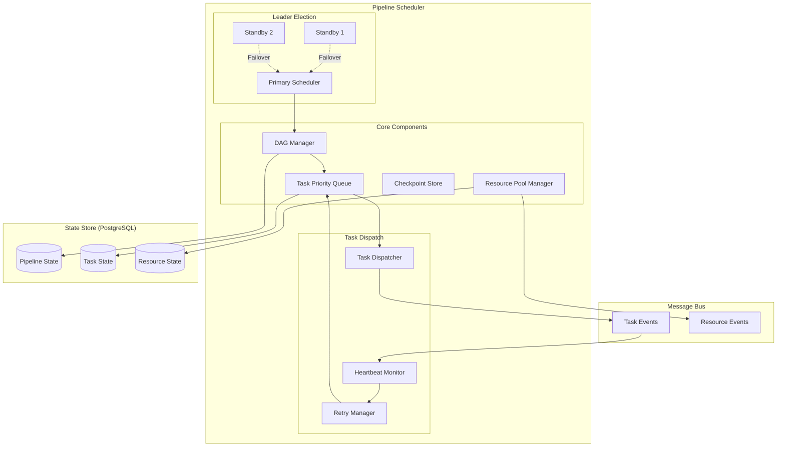
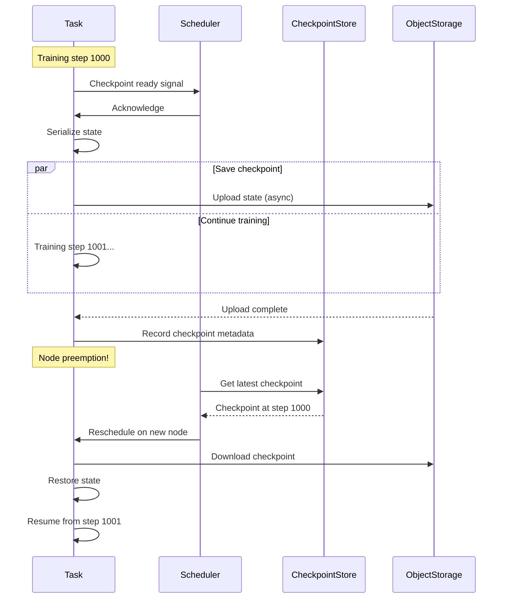
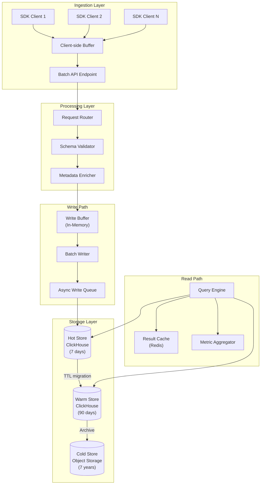
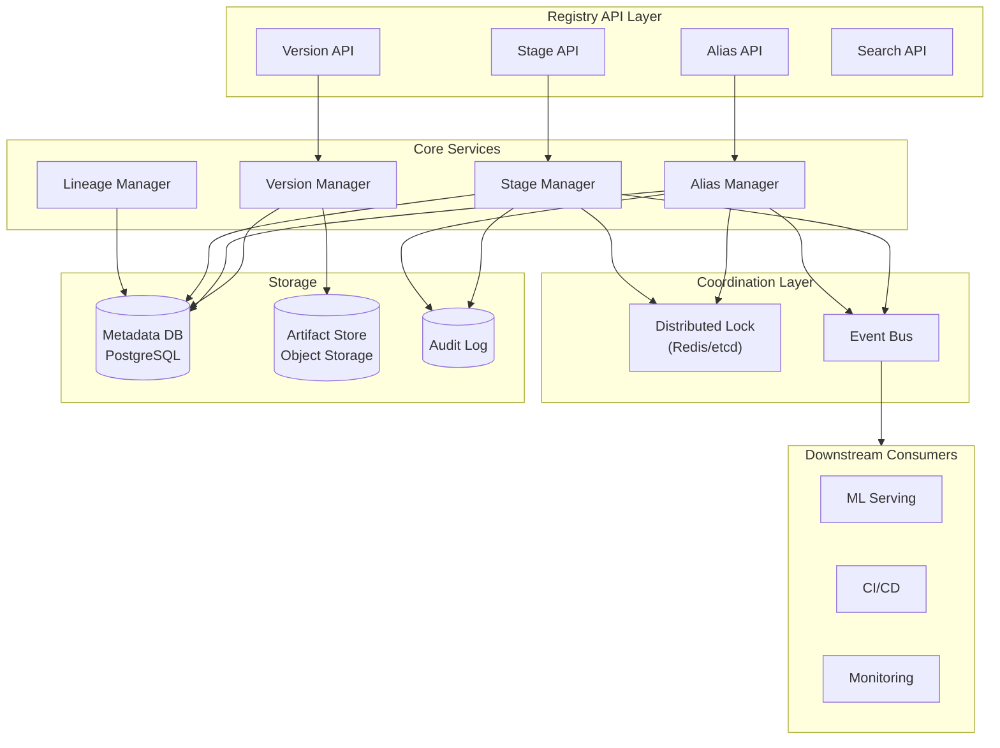
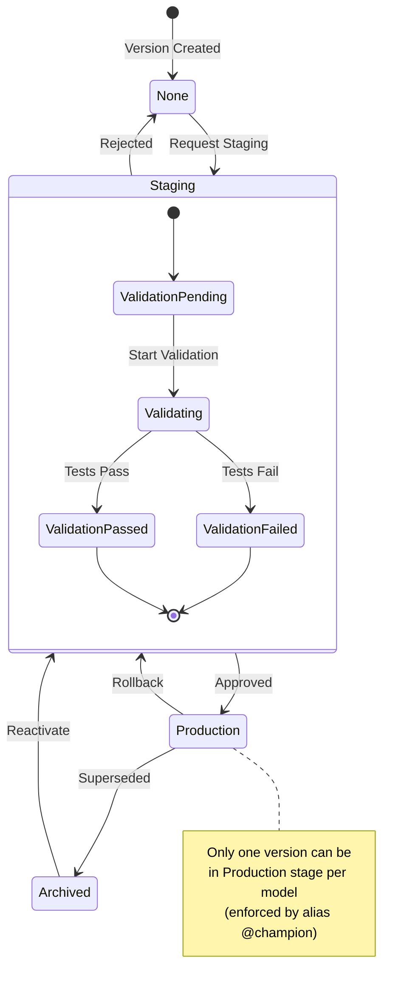

# Deep Dive and Bottlenecks

[Back to Index](./00-index.md)

---

## Critical Component Deep Dives

### Deep Dive 1: Training Pipeline Scheduler

#### Why This Component is Critical

The pipeline scheduler is the orchestration brain of the MLOps platform. It must:
- Handle complex DAG dependencies with thousands of tasks
- Manage heterogeneous compute resources (GPU, CPU, spot instances)
- Recover from failures without losing progress
- Support dynamic pipeline construction (hyperparameter sweeps)

#### Internal Architecture



#### Task Scheduling Algorithm Deep Dive

```
ALGORITHM AdvancedTaskScheduler

CONSTANTS:
    PRIORITY_WEIGHTS = {
        "deadline": 0.4,
        "wait_time": 0.3,
        "resource_efficiency": 0.2,
        "user_priority": 0.1
    }

DATA STRUCTURES:
    TaskPriorityQueue = Heap<Task> ordered by computed_priority DESC

    ResourcePool = {
        gpu_available: Map<NodeID, int>,
        cpu_available: Map<NodeID, int>,
        memory_available: Map<NodeID, int>,
        spot_nodes: Set<NodeID>,
        preemptible_tasks: Map<NodeID, List<TaskID>>
    }

FUNCTION compute_task_priority(task: Task) -> float:
    // Deadline urgency
    IF task.deadline:
        time_to_deadline = task.deadline - now()
        deadline_score = max(0, 1 - time_to_deadline / task.estimated_duration)
    ELSE:
        deadline_score = 0

    // Wait time fairness
    wait_time = now() - task.enqueue_time
    wait_score = min(1, wait_time / MAX_WAIT_TIME)

    // Resource efficiency (prefer tasks that fill GPU)
    IF task.resources.gpu > 0:
        efficiency_score = task.resources.gpu / 8  // Normalized to 8-GPU node
    ELSE:
        efficiency_score = 0.5  // CPU tasks are flexible

    // User-defined priority
    user_score = task.priority / MAX_PRIORITY

    // Weighted combination
    priority = (
        PRIORITY_WEIGHTS["deadline"] * deadline_score +
        PRIORITY_WEIGHTS["wait_time"] * wait_score +
        PRIORITY_WEIGHTS["resource_efficiency"] * efficiency_score +
        PRIORITY_WEIGHTS["user_priority"] * user_score
    )

    RETURN priority

FUNCTION find_best_node(task: Task, pool: ResourcePool) -> NodeID:
    candidates = []

    FOR node_id, resources IN pool:
        IF can_fit(task.resources, resources):
            // Score node fitness
            score = compute_node_score(task, node_id, resources)
            candidates.append((node_id, score))

    IF candidates IS empty:
        RETURN null

    // Sort by score descending
    candidates.sort(key=lambda x: x[1], reverse=True)
    RETURN candidates[0][0]

FUNCTION compute_node_score(task: Task, node: NodeID, resources: Resources) -> float:
    // Prefer nodes with exact GPU match (avoid fragmentation)
    IF task.resources.gpu > 0:
        gpu_waste = resources.gpu_available - task.resources.gpu
        fragmentation_penalty = gpu_waste * 0.1
    ELSE:
        fragmentation_penalty = 0

    // Prefer on-demand for critical tasks, spot for others
    IF task.is_checkpointable AND node IN pool.spot_nodes:
        cost_bonus = 0.3  // Spot is cheaper
    ELSE IF NOT task.is_checkpointable AND node NOT IN pool.spot_nodes:
        reliability_bonus = 0.2  // On-demand for non-checkpointable
    ELSE:
        cost_bonus = 0
        reliability_bonus = 0

    // Data locality bonus
    IF task.input_data_location == node.storage_location:
        locality_bonus = 0.2
    ELSE:
        locality_bonus = 0

    RETURN 1.0 - fragmentation_penalty + cost_bonus + reliability_bonus + locality_bonus

FUNCTION handle_spot_preemption(node: NodeID):
    // Spot instance being terminated - 2 minute warning
    preemptible_tasks = pool.preemptible_tasks[node]

    FOR task_id IN preemptible_tasks:
        task = get_task(task_id)

        // Trigger checkpoint
        IF task.supports_checkpoint:
            send_checkpoint_signal(task)
            wait_for_checkpoint(task, timeout=90s)

        // Mark for rescheduling
        task.status = PENDING
        task.retry_count += 1
        task_queue.push(task)

    // Remove node from pool
    pool.remove_node(node)
```

#### Failure Modes and Recovery

| Failure Mode | Detection | Recovery Strategy | RTO |
|--------------|-----------|-------------------|-----|
| Task timeout | Heartbeat miss | Kill + retry with checkpoint | 2-5 min |
| Task crash | Exit code != 0 | Retry with exponential backoff | 1-2 min |
| Node failure | Health check | Reschedule all tasks on node | 2-5 min |
| Scheduler crash | Leader lease expiry | Standby promotion | 30s |
| State store failure | Connection timeout | Read replica failover | 1 min |
| Spot preemption | Cloud event | Checkpoint + reschedule | 2-3 min |

#### Checkpoint Strategy



---

### Deep Dive 2: Experiment Tracker

#### Why This Component is Critical

The experiment tracker handles:
- High-throughput metric ingestion (100K+ writes/sec during distributed training)
- Flexible schema for diverse ML metrics (scalars, tensors, text, images)
- Complex queries for run comparison and analysis
- Long-term storage with efficient retention

#### Internal Architecture



#### High-Cardinality Metric Handling

```
ALGORITHM HighCardinalityMetricWriter

PROBLEM:
    - 100K+ unique run_ids per day
    - 1000+ metric keys per run
    - 10K+ steps per metric
    - Total: billions of data points

SOLUTION: Tiered Storage + Pre-Aggregation

WRITE PATH:

FUNCTION write_metrics(run_id: string, metrics: List<Metric>):
    // 1. Client-side batching (SDK)
    batch = collect_metrics(timeout=100ms, max_batch=1000)

    // 2. Validate and enrich
    FOR metric IN batch:
        validate_metric_schema(metric)
        metric.ingestion_time = now()
        metric.run_uuid = normalize_uuid(run_id)

    // 3. Write to hot store (ClickHouse)
    // ClickHouse handles high-cardinality well with proper schema
    clickhouse.insert("""
        INSERT INTO metric_hot (
            run_id, key, value, step, timestamp, ingestion_time
        ) VALUES
    """, batch)

    // 4. Update materialized views (async)
    // - metric_latest: Last value per key
    // - metric_summary: Min/max/avg aggregations

READ PATH:

FUNCTION query_run_metrics(run_id: string, keys: List<string>) -> MetricData:
    // Check cache first
    cache_key = f"metrics:{run_id}:{hash(keys)}"
    IF cached = cache.get(cache_key):
        RETURN cached

    // Determine storage tier based on run age
    run = get_run(run_id)
    age_days = (now() - run.start_time).days

    IF age_days <= 7:
        source = "metric_hot"
    ELSE IF age_days <= 90:
        source = "metric_warm"
    ELSE:
        // Cold storage - reconstruct from archived parquet
        RETURN query_cold_storage(run_id, keys)

    result = clickhouse.query(f"""
        SELECT key, groupArray(value) as values, groupArray(step) as steps
        FROM {source}
        WHERE run_id = '{run_id}' AND key IN ({keys})
        GROUP BY key
        ORDER BY key
    """)

    cache.set(cache_key, result, ttl=300s)
    RETURN result

TIERED STORAGE MIGRATION:

FUNCTION migrate_to_warm():
    // Run daily
    cutoff = now() - 7 days

    // Move data from hot to warm
    clickhouse.execute("""
        INSERT INTO metric_warm
        SELECT * FROM metric_hot
        WHERE timestamp < {cutoff}
    """)

    // Delete from hot
    clickhouse.execute("""
        ALTER TABLE metric_hot
        DELETE WHERE timestamp < {cutoff}
    """)

FUNCTION archive_to_cold():
    // Run weekly
    cutoff = now() - 90 days

    // Export to parquet in object storage
    runs_to_archive = clickhouse.query("""
        SELECT DISTINCT run_id FROM metric_warm
        WHERE timestamp < {cutoff}
    """)

    FOR run_id IN runs_to_archive:
        data = clickhouse.query(f"""
            SELECT * FROM metric_warm WHERE run_id = '{run_id}'
        """)

        // Write to object storage as parquet
        path = f"s3://archive/metrics/{run_id}/metrics.parquet"
        write_parquet(data, path)

        // Record in archive index
        database.insert("metric_archive_index", {
            run_id: run_id,
            path: path,
            archived_at: now()
        })

    // Delete from warm
    clickhouse.execute("""
        ALTER TABLE metric_warm
        DELETE WHERE timestamp < {cutoff}
    """)
```

#### Run Comparison Engine

```
ALGORITHM RunComparisonEngine

FUNCTION compare_runs(run_ids: List<string>, config: CompareConfig) -> ComparisonResult:
    // 1. Fetch run metadata
    runs = parallel_fetch([
        get_run(id) FOR id IN run_ids
    ])

    // 2. Fetch parameters
    params = parallel_fetch([
        get_params(id) FOR id IN run_ids
    ])

    // 3. Identify differing parameters
    param_diff = compute_param_diff(params)

    // 4. Fetch metrics for comparison
    metric_keys = config.metric_keys OR get_common_metric_keys(run_ids)

    metrics = parallel_fetch([
        get_metric_summary(id, metric_keys) FOR id IN run_ids
    ])

    // 5. Compute metric statistics
    metric_comparison = {}
    FOR key IN metric_keys:
        values = [m[key] FOR m IN metrics]
        metric_comparison[key] = {
            "values": values,
            "best_run": run_ids[argmax(values)] IF config.higher_is_better[key] ELSE run_ids[argmin(values)],
            "diff_pct": (max(values) - min(values)) / mean(values) * 100
        }

    // 6. Generate visualization data
    IF config.include_charts:
        charts = generate_comparison_charts(run_ids, metrics, config)
    ELSE:
        charts = null

    RETURN ComparisonResult(
        runs: runs,
        param_diff: param_diff,
        metric_comparison: metric_comparison,
        charts: charts
    )

FUNCTION get_metric_summary(run_id: string, keys: List<string>) -> dict:
    // Use pre-computed materialized view for efficiency
    result = clickhouse.query("""
        SELECT
            key,
            minMerge(min_value) as min,
            maxMerge(max_value) as max,
            avgMerge(avg_value) as avg,
            argMaxMerge(last_value, step) as last
        FROM metric_summary
        WHERE run_id = {run_id} AND key IN ({keys})
        GROUP BY key
    """)

    RETURN {row.key: row FOR row IN result}
```

---

### Deep Dive 3: Model Registry

#### Why This Component is Critical

The model registry is the source of truth for production ML models:
- Must provide atomic alias updates (no split-brain)
- Handles large artifacts (LLMs can be 100GB+)
- Enforces governance workflows
- Tracks lineage for compliance

#### Internal Architecture



#### Large Artifact Management

```
ALGORITHM LargeArtifactManager

CONSTANTS:
    CHUNK_SIZE = 100MB
    UPLOAD_PARALLELISM = 4
    CHECKSUM_ALGORITHM = SHA256

FUNCTION upload_model_artifact(model_path: string, version_id: string) -> ArtifactURI:
    // 1. Calculate file info
    file_size = get_file_size(model_path)
    num_chunks = ceil(file_size / CHUNK_SIZE)

    // 2. Check for existing artifact with same checksum (deduplication)
    file_checksum = calculate_checksum(model_path)
    existing = find_artifact_by_checksum(file_checksum)
    IF existing:
        // Dedup - just reference existing artifact
        link_artifact_to_version(existing.uri, version_id)
        RETURN existing.uri

    // 3. Initialize multipart upload
    artifact_uri = f"s3://models/{version_id}/model"
    upload_id = object_store.create_multipart_upload(artifact_uri)

    // 4. Upload chunks in parallel
    TRY:
        chunks = split_file(model_path, CHUNK_SIZE)
        upload_tasks = []

        FOR i, chunk IN enumerate(chunks):
            task = async_upload_chunk(upload_id, i + 1, chunk, artifact_uri)
            upload_tasks.append(task)

            // Limit parallelism
            IF len(upload_tasks) >= UPLOAD_PARALLELISM:
                await any_completed(upload_tasks)
                upload_tasks = [t FOR t IN upload_tasks IF NOT t.done]

        // Wait for all remaining
        await all(upload_tasks)

        // 5. Complete multipart upload
        parts = [task.result() FOR task IN upload_tasks]
        object_store.complete_multipart_upload(upload_id, parts)

        // 6. Record artifact metadata
        database.insert("artifact_metadata", {
            version_id: version_id,
            uri: artifact_uri,
            size: file_size,
            checksum: file_checksum,
            chunks: num_chunks
        })

        RETURN artifact_uri

    CATCH error:
        // Cleanup failed upload
        object_store.abort_multipart_upload(upload_id)
        RAISE error

FUNCTION download_model_artifact(uri: string, dest_path: string):
    // 1. Get artifact metadata
    metadata = get_artifact_metadata(uri)

    // 2. Parallel chunk download
    IF metadata.chunks > 1:
        download_tasks = []
        FOR i IN range(metadata.chunks):
            chunk_range = (i * CHUNK_SIZE, min((i + 1) * CHUNK_SIZE, metadata.size))
            task = async_download_chunk(uri, chunk_range, f"{dest_path}.part{i}")
            download_tasks.append(task)

        await all(download_tasks)

        // Merge chunks
        merge_chunks(dest_path, metadata.chunks)
    ELSE:
        object_store.download(uri, dest_path)

    // 3. Verify checksum
    IF calculate_checksum(dest_path) != metadata.checksum:
        RAISE ChecksumMismatchError()
```

#### Stage Transition Workflow



```
ALGORITHM StageTransitionWorkflow

FUNCTION transition_stage(
    model_name: string,
    version: string,
    target_stage: Stage,
    archive_existing: bool
) -> Result<void, Error>:

    // 1. Validate transition
    current_version = get_model_version(model_name, version)
    IF NOT is_valid_transition(current_version.stage, target_stage):
        RETURN Error("Invalid stage transition")

    // 2. Check governance requirements
    IF target_stage == PRODUCTION:
        // Model card required
        IF NOT has_model_card(current_version):
            RETURN Error("Model card required for production")

        // Bias check required
        IF NOT has_bias_validation(current_version):
            RETURN Error("Bias validation required")

        // Approval required
        IF NOT has_approval(current_version, "production"):
            RETURN Error("Manager approval required")

    // 3. Execute transition with lock
    lock_key = f"stage_transition:{model_name}"

    WITH distributed_lock(lock_key):
        WITH database.transaction():
            // Archive existing production version if requested
            IF target_stage == PRODUCTION AND archive_existing:
                existing_prod = get_version_by_stage(model_name, PRODUCTION)
                IF existing_prod:
                    update_version_stage(existing_prod.id, ARCHIVED)
                    record_audit("stage_change", existing_prod.id, PRODUCTION, ARCHIVED)

            // Update version stage
            update_version_stage(current_version.id, target_stage)
            record_audit("stage_change", current_version.id, current_version.stage, target_stage)

            // Update alias if transitioning to production
            IF target_stage == PRODUCTION:
                set_alias_internal(model_name, "@champion", version)

    // 4. Publish event
    publish_event(StageTransition {
        model: model_name,
        version: version,
        from_stage: current_version.stage,
        to_stage: target_stage
    })

    RETURN Ok()
```

---

## Bottleneck Analysis

### Bottleneck 1: Metric Write Throughput

**Problem:** During distributed training with 100+ workers, metric writes can spike to 100K+ per second.

**Symptoms:**
- API latency degradation
- Dropped metrics
- ClickHouse write buffer overflow

**Mitigation Strategies:**

```
1. Client-Side Batching
   - Buffer metrics locally for 100ms
   - Send in batches of 1000
   - Reduces API calls by 100x

2. Async Write Path
   - API returns immediately after buffering
   - Background workers flush to ClickHouse
   - Decouple ingestion from storage

3. Write Buffer Tuning
   ClickHouse settings:
   - max_insert_block_size: 1048576
   - max_insert_threads: 8
   - min_insert_block_size_rows: 10000

4. Horizontal Scaling
   - Add tracking server replicas
   - Shard ClickHouse by run_id hash
```

### Bottleneck 2: Large Model Artifact Upload

**Problem:** LLM models can be 50-100GB+, causing upload timeouts and memory issues.

**Symptoms:**
- Upload timeouts
- Memory exhaustion
- Slow version registration

**Mitigation Strategies:**

```
1. Chunked Upload
   - Split into 100MB chunks
   - Parallel upload (4 concurrent)
   - Resume on failure

2. Streaming Upload
   - Don't load entire file to memory
   - Stream chunks directly to object storage

3. Deduplication
   - Hash-based content addressing
   - Skip upload if identical artifact exists
   - Save ~30% storage for incremental training

4. CDN Integration
   - Pre-warm popular models at edge
   - Reduce download latency for serving
```

### Bottleneck 3: Experiment Search Performance

**Problem:** Searching across millions of runs with complex filters is slow.

**Symptoms:**
- Search timeouts
- High database CPU
- Poor user experience

**Mitigation Strategies:**

```
1. Materialized Views
   - Pre-compute metric aggregations
   - Latest value per metric key
   - Min/max/avg summaries

2. Search Index
   - Elasticsearch for full-text search
   - Index run metadata, params, tags
   - Sub-second search across millions

3. Query Optimization
   - Limit scan with time-based partitioning
   - Required filters: experiment_id OR time range
   - Index on common filter columns

4. Result Caching
   - Cache search results (5 min TTL)
   - Cache metric summaries
   - Invalidate on new runs
```

### Bottleneck 4: Scheduler State Management

**Problem:** With 1000+ concurrent jobs, scheduler state can become a bottleneck.

**Symptoms:**
- Slow task dispatching
- State store contention
- Leader election churn

**Mitigation Strategies:**

```
1. State Sharding
   - Partition pipelines by hash
   - Multiple scheduler instances
   - Each handles subset of pipelines

2. Optimistic Locking
   - Avoid distributed locks for reads
   - CAS-based updates
   - Retry on conflict

3. Event-Driven Updates
   - Task state changes via events
   - Reduce polling overhead
   - Lower state store load

4. In-Memory State
   - Cache active pipeline DAGs in memory
   - Sync from store on startup/failover
   - Reduces read load by 90%
```

---

## Concurrency and Race Conditions

### Race Condition 1: Alias Update Race

**Scenario:** Two requests try to set the same alias to different versions simultaneously.

**Risk:** Both succeed, leaving alias in inconsistent state.

**Solution:**

```
// Distributed lock prevents concurrent updates
lock = acquire_lock(f"alias:{model}:{alias}", timeout=30s)
try:
    // Read current state
    current = get_alias(model, alias)

    // Update atomically
    database.execute("""
        UPDATE model_alias
        SET version_id = $1, updated_at = NOW()
        WHERE model_id = $2 AND alias_name = $3
    """, [new_version, model_id, alias])
finally:
    release_lock(lock)
```

### Race Condition 2: Concurrent Metric Writes

**Scenario:** Multiple training workers write metrics for same run simultaneously.

**Risk:** Metric ordering issues, duplicate steps.

**Solution:**

```
// ClickHouse handles via ReplacingMergeTree
// Deduplication by (run_id, key, step, timestamp)
// Last write wins if exact duplicate
```

### Race Condition 3: Pipeline Task State Update

**Scenario:** Task heartbeat timeout occurs while task is completing.

**Risk:** Task marked as failed and retried despite success.

**Solution:**

```
// Optimistic concurrency control with version number
UPDATE task_instance
SET status = 'FINISHED', end_time = NOW(), version = version + 1
WHERE task_id = $1 AND version = $2

// If rows affected = 0, state changed (retry decision)
// If success, task completion wins over timeout
```

---

## Performance Characteristics

### Latency Breakdown

| Operation | Component | p50 | p95 | p99 |
|-----------|-----------|-----|-----|-----|
| Log metric batch (1000) | API + Buffer | 5ms | 20ms | 50ms |
| Get run | API + DB | 10ms | 30ms | 80ms |
| Search runs | API + DB + Cache | 50ms | 200ms | 500ms |
| Create model version | API + DB + Storage | 100ms | 500ms | 2s |
| Set alias | API + Lock + DB | 50ms | 100ms | 200ms |
| Download model (100MB) | Storage + Network | 1s | 3s | 5s |

### Throughput Limits

| Component | Limit | Scaling Strategy |
|-----------|-------|------------------|
| Tracking API | 50K req/s per instance | Horizontal scaling |
| Metric Writer | 100K metrics/s per instance | Add writer instances |
| ClickHouse Ingest | 500K rows/s per shard | Add shards |
| Registry API | 5K req/s per instance | Horizontal scaling |
| Object Storage | Limited by network | CDN, multi-region |
