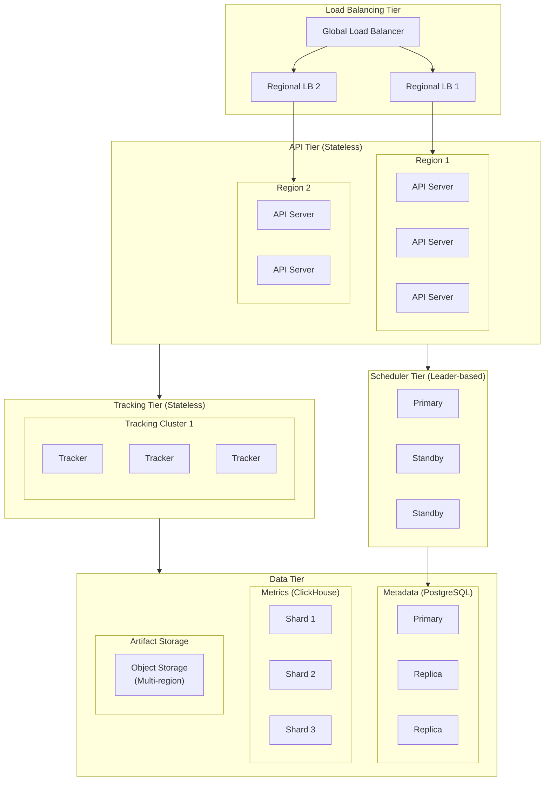
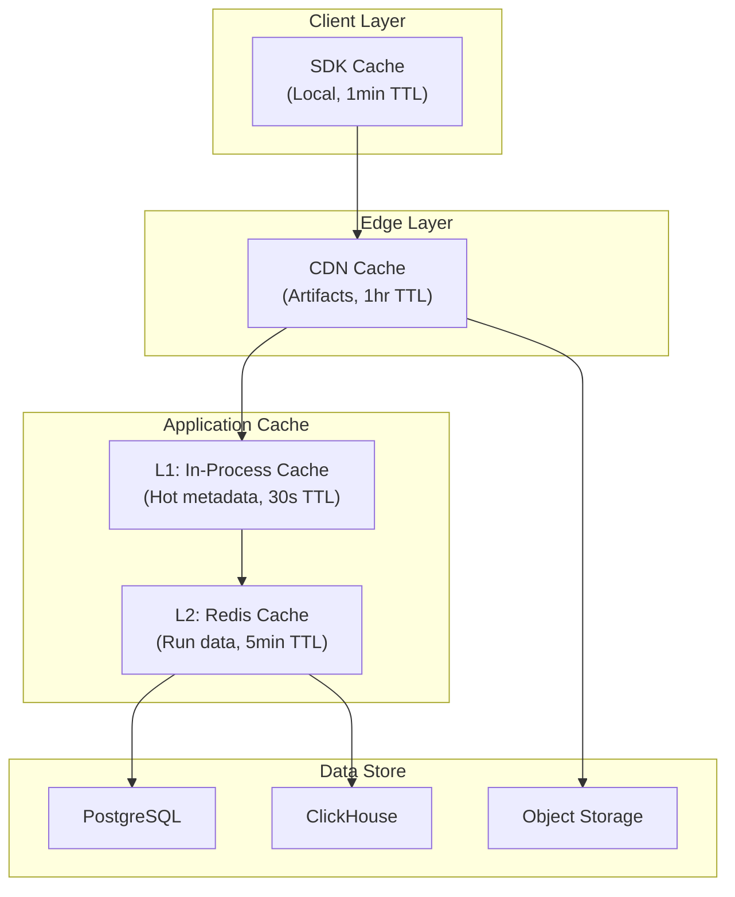
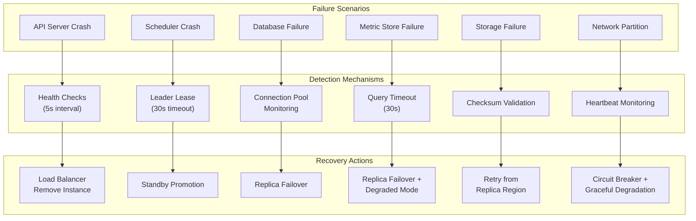
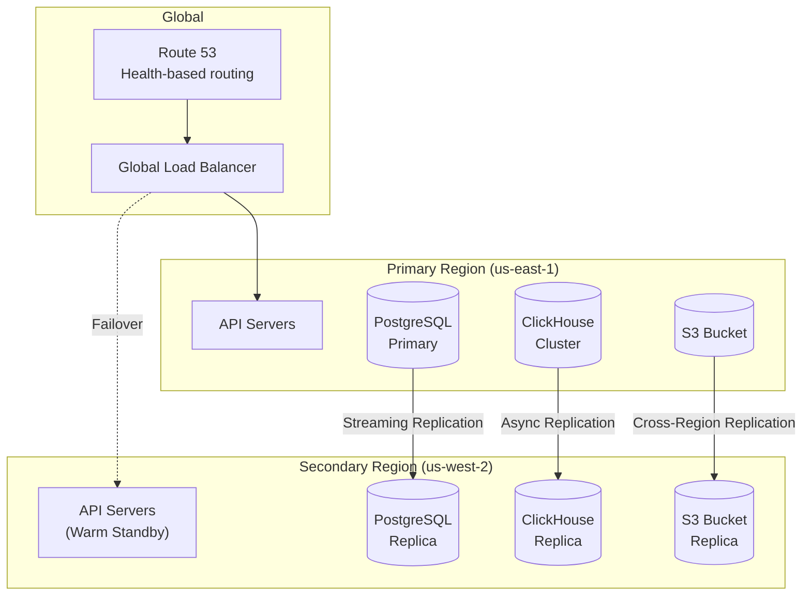

# Scalability and Reliability

[Back to Index](./00-index.md)

---

## Scalability Strategy

### Horizontal Scaling Architecture



### Component Scaling Strategies

| Component | Scaling Type | Trigger | Target |
|-----------|--------------|---------|--------|
| **Tracking Server** | Horizontal | CPU > 70% or QPS > 10K/instance | 3-50 instances |
| **Registry API** | Horizontal | CPU > 70% | 2-20 instances |
| **Pipeline Scheduler** | Leader + Standby | N/A (HA only) | 3 instances |
| **Metadata DB** | Vertical + Read Replicas | Connections > 80% | 1 primary + 2-5 replicas |
| **Metric Store** | Horizontal (sharding) | Storage > 70% | 3-20 shards |
| **Artifact Storage** | Automatic (managed) | N/A | Unlimited |

### Auto-Scaling Configuration

```yaml
# Kubernetes HPA Configuration
apiVersion: autoscaling/v2
kind: HorizontalPodAutoscaler
metadata:
  name: tracking-server-hpa
spec:
  scaleTargetRef:
    apiVersion: apps/v1
    kind: Deployment
    name: tracking-server
  minReplicas: 3
  maxReplicas: 50
  metrics:
    - type: Resource
      resource:
        name: cpu
        target:
          type: Utilization
          averageUtilization: 70
    - type: Pods
      pods:
        metric:
          name: http_requests_per_second
        target:
          type: AverageValue
          averageValue: 10000
  behavior:
    scaleUp:
      stabilizationWindowSeconds: 60
      policies:
        - type: Percent
          value: 100
          periodSeconds: 60
    scaleDown:
      stabilizationWindowSeconds: 300
      policies:
        - type: Percent
          value: 10
          periodSeconds: 60

---
apiVersion: autoscaling/v2
kind: HorizontalPodAutoscaler
metadata:
  name: registry-api-hpa
spec:
  scaleTargetRef:
    apiVersion: apps/v1
    kind: Deployment
    name: registry-api
  minReplicas: 2
  maxReplicas: 20
  metrics:
    - type: Resource
      resource:
        name: cpu
        target:
          type: Utilization
          averageUtilization: 70
```

### Database Scaling

#### PostgreSQL (Metadata Store)

```
Scaling Strategy: Vertical + Read Replicas + Connection Pooling

Tier 1 (< 1M runs):
- Primary: 8 vCPU, 32GB RAM, 500GB SSD
- Replicas: 2
- Connections: 200

Tier 2 (1M - 10M runs):
- Primary: 16 vCPU, 64GB RAM, 2TB SSD
- Replicas: 3
- Connections: 500
- Connection pooler: PgBouncer (2 instances)

Tier 3 (10M+ runs):
- Primary: 32 vCPU, 128GB RAM, 4TB SSD
- Replicas: 5
- Connections: 1000
- Consider: Partitioning by experiment_id or time
```

#### ClickHouse (Metric Store)

```
Scaling Strategy: Horizontal Sharding + Replication

Sharding Key: cityHash64(run_id) % num_shards

Tier 1 (< 100M metrics/day):
- Shards: 3
- Replicas per shard: 2
- Node: 16 vCPU, 64GB RAM, 2TB NVMe

Tier 2 (100M - 1B metrics/day):
- Shards: 8
- Replicas per shard: 2
- Node: 32 vCPU, 128GB RAM, 4TB NVMe

Tier 3 (1B+ metrics/day):
- Shards: 20
- Replicas per shard: 3
- Node: 64 vCPU, 256GB RAM, 8TB NVMe
```

---

## Caching Strategy

### Multi-Layer Cache Architecture



### Cache Configuration

| Layer | Data Type | TTL | Size | Invalidation |
|-------|-----------|-----|------|--------------|
| **SDK (L0)** | Recent run metrics | 1 min | 100MB | Time-based |
| **CDN** | Model artifacts | 1 hour | Unlimited | Version-based |
| **L1 (In-Process)** | Experiment metadata, Model registry | 30s | 1GB per instance | Time-based |
| **L2 (Redis)** | Run data, Search results | 5 min | 50GB cluster | Time + Event-based |

### Cache Invalidation Strategy

```
ALGORITHM CacheInvalidation

PATTERNS:

1. Time-Based (TTL)
   - Simplest approach
   - Used for: metrics, search results
   - Risk: Stale reads within TTL window

2. Event-Based
   - Publish invalidation events on write
   - Used for: model aliases, stage transitions
   - Implementation:
     ON alias_update(model, alias, version):
         redis.delete(f"model:{model}:alias:{alias}")
         redis.publish("cache_invalidation", {model, alias})

3. Version-Based
   - Include version in cache key
   - Used for: immutable artifacts
   - Key format: model:{model_id}:version:{version}:artifact

4. Write-Through
   - Update cache on write
   - Used for: frequently read metadata
   - Implementation:
     ON model_version_create(version):
         database.insert(version)
         redis.set(f"version:{version.id}", serialize(version))

INVALIDATION EVENTS:

Event: RunCompleted
  Invalidate:
    - experiment:{exp_id}:runs (list)
    - run:{run_id}:* (all run data)

Event: AliasUpdated
  Invalidate:
    - model:{model}:alias:{alias}
    - model:{model}:versions (list)

Event: StageTransitioned
  Invalidate:
    - model:{model}:version:{version}
    - model:{model}:stage:{stage}
```

---

## Fault Tolerance

### Failure Scenarios and Recovery



### Component Recovery Strategies

| Component | Failure | Detection Time | Recovery Strategy | RTO |
|-----------|---------|----------------|-------------------|-----|
| **Tracking Server** | Process crash | 5s | LB health check, auto-restart | 10s |
| **Registry API** | Process crash | 5s | LB health check, auto-restart | 10s |
| **Pipeline Scheduler** | Leader crash | 30s | Lease expiry, standby promotion | 30-60s |
| **Metadata DB (Primary)** | Instance failure | 30s | Automated failover to replica | 1-2 min |
| **Metric Store (Shard)** | Node failure | 30s | Replica promotion, rebalance | 2-5 min |
| **Object Storage** | Region failure | 60s | Cross-region replication, CDN | 1-5 min |

### Circuit Breaker Implementation

```
ALGORITHM CircuitBreaker

STATES:
    CLOSED: Normal operation, requests pass through
    OPEN: Failures exceeded threshold, requests fail fast
    HALF_OPEN: Testing if service recovered

CONFIG:
    failure_threshold = 5       // Failures before opening
    success_threshold = 3       // Successes to close from half-open
    timeout = 30s              // Time in open state before half-open
    window = 60s               // Time window for counting failures

STATE:
    state = CLOSED
    failure_count = 0
    success_count = 0
    last_failure_time = null
    last_state_change = now()

FUNCTION call(operation):
    IF state == OPEN:
        IF now() - last_state_change > timeout:
            transition_to(HALF_OPEN)
        ELSE:
            RAISE CircuitOpenError()

    TRY:
        result = operation()
        on_success()
        RETURN result
    CATCH error:
        on_failure()
        RAISE error

FUNCTION on_success():
    IF state == HALF_OPEN:
        success_count += 1
        IF success_count >= success_threshold:
            transition_to(CLOSED)
    ELSE IF state == CLOSED:
        failure_count = 0  // Reset on success

FUNCTION on_failure():
    failure_count += 1
    last_failure_time = now()

    IF state == CLOSED AND failure_count >= failure_threshold:
        transition_to(OPEN)
    ELSE IF state == HALF_OPEN:
        transition_to(OPEN)

FUNCTION transition_to(new_state):
    state = new_state
    last_state_change = now()
    failure_count = 0
    success_count = 0
    emit_metric("circuit_breaker_state_change", {state: new_state})
```

### Graceful Degradation Levels

```
LEVEL 0 - HEALTHY
  All services operational
  Full functionality available

LEVEL 1 - DEGRADED (Metric Store Issues)
  Trigger: Metric store latency > 1s or errors > 1%
  Actions:
    - Disable real-time metric streaming
    - Buffer metrics client-side
    - Show warning in UI
  Preserved: Run creation, model registry, search (cached)

LEVEL 2 - PARTIAL (Database Issues)
  Trigger: Primary DB failover or replica lag > 30s
  Actions:
    - Read-only mode for metadata
    - Queue writes for later processing
    - Disable search (stale results)
  Preserved: Read cached data, artifact downloads

LEVEL 3 - MINIMAL (Major Outage)
  Trigger: Primary + replicas down OR storage unavailable
  Actions:
    - Static error page
    - Queue all operations
    - Alert on-call
  Preserved: Nothing active, eventual recovery

IMPLEMENTATION:

class DegradationManager:
    def check_health(self):
        levels = []

        # Check metric store
        if self.metric_store.latency_p99 > 1000:
            levels.append(1)

        # Check database
        if self.database.is_failover or self.database.replica_lag > 30:
            levels.append(2)

        # Check storage
        if not self.storage.is_healthy:
            levels.append(3)

        return max(levels) if levels else 0

    def apply_degradation(self, level):
        if level >= 1:
            self.disable_metric_streaming()
        if level >= 2:
            self.enable_read_only_mode()
        if level >= 3:
            self.show_maintenance_page()
```

---

## Disaster Recovery

### Backup Strategy

| Data Type | Backup Method | Frequency | Retention | RPO |
|-----------|---------------|-----------|-----------|-----|
| **Metadata DB** | Continuous WAL + Daily snapshot | Continuous + Daily | 30 days | 0 (with streaming) |
| **Metric Store** | Daily incremental + Weekly full | Daily | 90 days | 24 hours |
| **Artifacts** | Cross-region replication | Real-time | Indefinite | 0 |
| **Configuration** | GitOps (version controlled) | On change | Indefinite | 0 |

### Multi-Region Architecture



### RTO/RPO Targets

| Scenario | RTO | RPO | Strategy |
|----------|-----|-----|----------|
| **Single instance failure** | 30s | 0 | Auto-restart, LB health check |
| **AZ failure** | 2 min | 0 | Multi-AZ deployment |
| **Region failure** | 15 min | 5 min | Cross-region failover |
| **Data corruption** | 4 hours | 24 hours | Point-in-time recovery |
| **Complete disaster** | 24 hours | 24 hours | Restore from backup |

### Failover Procedure

```
PROCEDURE RegionFailover

TRIGGER: Primary region health check fails for > 5 minutes

AUTOMATED STEPS (0-5 min):
1. DNS health check detects primary failure
2. Route 53 updates to point to secondary
3. Secondary API servers begin receiving traffic
4. PostgreSQL replica promoted to primary

MANUAL VALIDATION (5-15 min):
1. Verify secondary is receiving traffic
2. Check database promotion successful
3. Validate artifact storage accessible
4. Run smoke tests

POST-FAILOVER (15+ min):
1. Update monitoring dashboards
2. Notify stakeholders
3. Begin root cause analysis
4. Plan failback procedure

FAILBACK PROCEDURE:
1. Restore primary region services
2. Sync data from secondary to primary
3. Validate data consistency
4. Gradual traffic shift back to primary
5. Demote secondary back to replica
```

---

## Load Testing Results

### Benchmark Configuration

```yaml
test_environment:
  tracking_servers: 10
  registry_servers: 4
  postgres_primary: 16 vCPU, 64GB RAM
  postgres_replicas: 3
  clickhouse_nodes: 8
  duration: 1 hour

load_profile:
  concurrent_experiments: 5000
  runs_per_minute: 10000
  metrics_per_run: 100
  model_registrations_per_minute: 500
```

### Results

| Metric | Target | Achieved | Status |
|--------|--------|----------|--------|
| Metric write p99 latency | < 100ms | 45ms | PASS |
| Run creation p99 latency | < 500ms | 180ms | PASS |
| Search p99 latency | < 2s | 850ms | PASS |
| Model registration p99 latency | < 2s | 1.2s | PASS |
| Throughput (metrics/sec) | 100K | 150K | PASS |
| Error rate | < 0.1% | 0.02% | PASS |
| CPU utilization | < 80% | 65% | PASS |

### Bottlenecks Identified

1. **PostgreSQL connection exhaustion at 15K concurrent runs**
   - Solution: Added PgBouncer, increased max_connections

2. **ClickHouse merge throttling at 200K metrics/sec**
   - Solution: Increased merge threads, optimized batch sizes

3. **Object storage rate limiting at 5K uploads/min**
   - Solution: Implemented request queuing, exponential backoff
