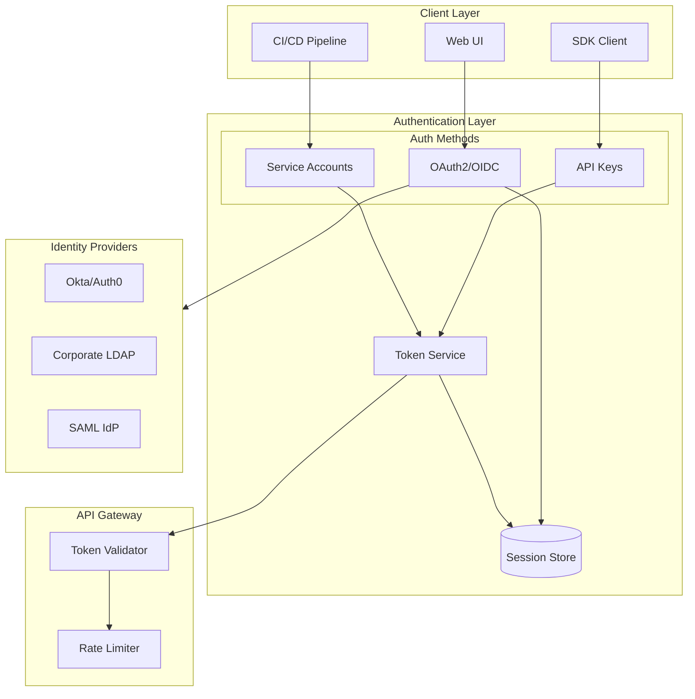
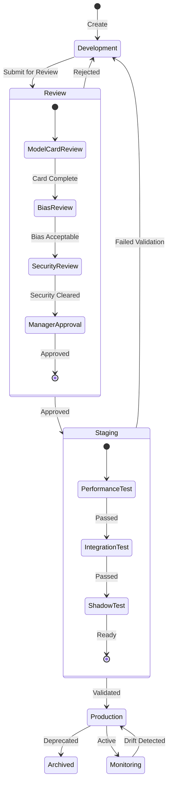
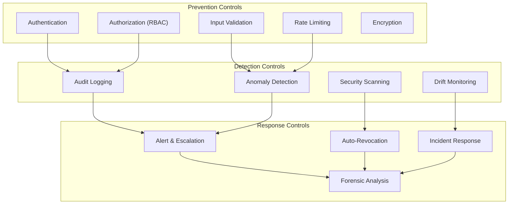

# Security and Compliance

[Back to Index](./00-index.md)

---

## Authentication and Authorization

### Authentication Architecture



### Authentication Methods

| Method | Use Case | Token Lifetime | Refresh |
|--------|----------|----------------|---------|
| **OAuth2/OIDC** | Web UI, Interactive | 1 hour | Yes (24h refresh) |
| **API Keys** | SDK, CLI | 90 days | Manual rotation |
| **Service Accounts** | CI/CD, Automation | 1 year | Manual rotation |
| **Personal Access Tokens** | Development | 30 days | Manual |

### Authorization Model (RBAC)

```yaml
# Role Definitions

roles:
  viewer:
    description: "Read-only access to experiments and models"
    permissions:
      - experiment:read
      - run:read
      - model:read
      - artifact:download

  data_scientist:
    description: "Create and manage experiments, register models"
    inherits: viewer
    permissions:
      - experiment:create
      - experiment:update
      - run:create
      - run:update
      - model:register
      - artifact:upload

  ml_engineer:
    description: "Full model lifecycle including production deployment"
    inherits: data_scientist
    permissions:
      - model:transition_staging
      - model:transition_production
      - model:set_alias
      - pipeline:create
      - pipeline:execute

  platform_admin:
    description: "Platform administration"
    inherits: ml_engineer
    permissions:
      - user:manage
      - team:manage
      - quota:manage
      - audit:read
      - config:manage
```

### Permission Enforcement

```
ALGORITHM PermissionChecker

FUNCTION check_permission(
    user: User,
    action: string,
    resource: Resource
) -> bool:

    // 1. Get user's roles (direct + team-inherited)
    roles = get_user_roles(user)
    team_roles = get_team_roles(user)
    all_roles = roles.union(team_roles)

    // 2. Get permissions for all roles
    permissions = {}
    FOR role IN all_roles:
        role_perms = get_role_permissions(role)
        permissions = permissions.union(role_perms)

    // 3. Check if action is permitted
    required_permission = f"{resource.type}:{action}"
    IF required_permission NOT IN permissions:
        RETURN false

    // 4. Check resource-level restrictions
    IF resource.team AND user.team != resource.team:
        IF NOT has_cross_team_permission(user, resource.team):
            RETURN false

    // 5. Check additional policies (e.g., approval required)
    IF action == "transition_production":
        IF NOT has_approval(resource, "production_deployment"):
            RETURN false

    RETURN true

// Example usage
IF NOT check_permission(user, "transition_production", model_version):
    RAISE PermissionDeniedError(
        f"User {user.id} cannot promote model to production"
    )
```

---

## Model Governance

### Model Lifecycle Governance



### Model Card Requirements

```yaml
# Required Model Card Schema for Production Promotion

model_card:
  # Basic Information (Required)
  model_details:
    name: string
    version: string
    type: enum[classification, regression, ranking, generative]
    description: string
    intended_use: string
    out_of_scope_use: string

  # Training Information (Required)
  training:
    dataset_name: string
    dataset_size: integer
    training_date: date
    training_duration_hours: number
    features_used: list[string]
    preprocessing_steps: list[string]

  # Performance Metrics (Required)
  performance:
    primary_metric: string
    primary_metric_value: number
    secondary_metrics: map[string, number]
    evaluation_dataset: string
    evaluation_date: date

  # Fairness & Bias (Required for Production)
  fairness:
    protected_attributes: list[string]
    fairness_metrics:
      - attribute: string
        metric: string
        value: number
        threshold: number
        status: enum[pass, fail, warning]

  # Limitations (Required)
  limitations:
    known_limitations: list[string]
    failure_modes: list[string]
    not_recommended_for: list[string]

  # Ownership (Required)
  ownership:
    owner: string
    team: string
    contact: string
    review_date: date
    next_review_date: date
```

### Approval Workflow

```
ALGORITHM ProductionApprovalWorkflow

FUNCTION request_production_approval(model_version: ModelVersion):
    // 1. Validate model card completeness
    model_card = get_model_card(model_version)
    validation_errors = validate_model_card(model_card)
    IF validation_errors:
        RETURN Error("Model card incomplete", validation_errors)

    // 2. Check automated gates
    gates = [
        check_performance_threshold(model_version),
        check_bias_metrics(model_version),
        check_security_scan(model_version),
        check_test_coverage(model_version)
    ]

    failed_gates = [g FOR g IN gates IF NOT g.passed]
    IF failed_gates:
        RETURN Error("Automated gates failed", failed_gates)

    // 3. Create approval request
    approval_request = ApprovalRequest(
        model_version: model_version,
        requester: current_user(),
        required_approvers: get_required_approvers(model_version),
        gates_status: gates,
        created_at: now()
    )

    database.insert("approval_request", approval_request)

    // 4. Notify approvers
    FOR approver IN approval_request.required_approvers:
        send_notification(approver, ApprovalRequestNotification(approval_request))

    RETURN approval_request.id

FUNCTION approve_production(approval_request_id: string, approver: User):
    request = database.get("approval_request", approval_request_id)

    // Validate approver is authorized
    IF approver NOT IN request.required_approvers:
        RETURN Error("Not authorized to approve")

    // Record approval
    database.insert("approval_decision", {
        request_id: approval_request_id,
        approver: approver,
        decision: "approved",
        timestamp: now()
    })

    // Check if all required approvals received
    approvals = get_approvals(approval_request_id)
    IF len(approvals) >= len(request.required_approvers):
        // Execute promotion
        transition_model_stage(
            request.model_version,
            stage="Production",
            archive_existing=true
        )

        // Audit log
        audit_log("model_production_approval", {
            model_version: request.model_version,
            approvals: approvals,
            gates_status: request.gates_status
        })
```

---

## Data Security

### Encryption Strategy

| Data State | Encryption Method | Key Management |
|------------|-------------------|----------------|
| **At Rest (DB)** | AES-256 | Managed service KMS |
| **At Rest (Artifacts)** | AES-256-GCM | Object storage encryption |
| **In Transit** | TLS 1.3 | Certificate manager |
| **Secrets** | AES-256-GCM | Vault/KMS |
| **Audit Logs** | AES-256 | Separate encryption key |

### Sensitive Data Handling

```
ALGORITHM SensitiveDataHandler

PATTERNS_TO_DETECT = [
    r'\b[A-Za-z0-9._%+-]+@[A-Za-z0-9.-]+\.[A-Z|a-z]{2,}\b',  // Email
    r'\b\d{3}-\d{2}-\d{4}\b',  // SSN
    r'\b\d{16}\b',  // Credit card
    r'(?i)(api[_-]?key|password|secret|token)\s*[:=]\s*\S+',  // Credentials
]

FUNCTION sanitize_params(params: Map<string, string>) -> Map<string, string>:
    sanitized = {}

    FOR key, value IN params:
        // Check if key suggests sensitive data
        IF is_sensitive_key(key):
            sanitized[key] = "[REDACTED]"
            CONTINUE

        // Check if value contains sensitive patterns
        FOR pattern IN PATTERNS_TO_DETECT:
            IF regex_match(pattern, value):
                sanitized[key] = "[REDACTED]"
                log_security_event("sensitive_data_detected", {key, pattern})
                BREAK
        ELSE:
            sanitized[key] = value

    RETURN sanitized

FUNCTION is_sensitive_key(key: string) -> bool:
    sensitive_keywords = ["password", "secret", "token", "api_key", "credential"]
    RETURN any(kw IN key.lower() FOR kw IN sensitive_keywords)

// Applied at ingestion
FUNCTION log_params(run_id: string, params: Map):
    sanitized = sanitize_params(params)
    database.insert("param", run_id, sanitized)
```

### Access Control for Artifacts

```
ALGORITHM ArtifactAccessControl

FUNCTION get_artifact(
    user: User,
    artifact_uri: string
) -> bytes:

    // 1. Parse artifact URI to get model/version info
    parsed = parse_artifact_uri(artifact_uri)

    // 2. Check user has permission to access model
    IF NOT check_permission(user, "artifact:download", parsed.model):
        log_security_event("unauthorized_artifact_access", {
            user: user.id,
            artifact: artifact_uri
        })
        RAISE PermissionDeniedError()

    // 3. Check if artifact is from restricted experiment
    IF is_restricted_experiment(parsed.experiment_id):
        IF NOT user_in_experiment_acl(user, parsed.experiment_id):
            RAISE PermissionDeniedError("Restricted experiment")

    // 4. Generate presigned URL with expiry
    presigned_url = object_storage.generate_presigned_url(
        artifact_uri,
        expiry=300s,  // 5 minute expiry
        condition={
            "ip": get_client_ip(),
            "user_agent": get_user_agent()
        }
    )

    // 5. Audit log
    audit_log("artifact_access", {
        user: user.id,
        artifact: artifact_uri,
        action: "download"
    })

    RETURN presigned_url
```

---

## Threat Model

### Threat Analysis

| Threat | Attack Vector | Impact | Likelihood | Mitigation |
|--------|---------------|--------|------------|------------|
| **Model Theft** | Unauthorized artifact download | High | Medium | Access control, audit logging, encryption |
| **Data Poisoning** | Malicious training data injection | Critical | Low | Data validation, lineage tracking |
| **Credential Theft** | API key exposure in code/logs | High | High | Key rotation, secret scanning, short-lived tokens |
| **Model Tampering** | Modify artifact after registration | Critical | Low | Immutable artifacts, checksums |
| **Denial of Service** | Resource exhaustion | Medium | Medium | Rate limiting, quotas |
| **Privilege Escalation** | Exploit role misconfig | High | Low | Least privilege, regular audits |

### Security Controls Matrix



### API Security

```yaml
# API Security Configuration

rate_limiting:
  default:
    requests_per_minute: 1000
    burst: 100
  authenticated:
    requests_per_minute: 10000
    burst: 500
  artifact_download:
    requests_per_minute: 100
    burst: 10
    size_limit_mb: 10000

input_validation:
  max_param_length: 5000
  max_metric_value: 1e38
  max_batch_size: 1000
  allowed_artifact_extensions:
    - .pkl
    - .joblib
    - .pt
    - .pth
    - .h5
    - .onnx
    - .safetensors

request_validation:
  require_content_type: true
  max_body_size_mb: 100
  require_idempotency_key: true  # For mutations
```

---

## Compliance

### Regulatory Requirements

| Regulation | Scope | Key Requirements | Implementation |
|------------|-------|------------------|----------------|
| **GDPR** | EU data subjects | Data minimization, right to deletion | Data retention policies, deletion APIs |
| **CCPA** | California residents | Data access, deletion rights | Similar to GDPR |
| **SOC 2** | Service organization | Security controls, availability | Audit logging, access controls |
| **HIPAA** | Healthcare data | PHI protection | Encryption, access controls, audit |
| **Model Regulations (EU AI Act)** | High-risk AI | Transparency, documentation | Model cards, lineage |

### Audit Logging

```sql
-- Audit Log Schema
CREATE TABLE audit_log (
    log_id UUID PRIMARY KEY DEFAULT gen_random_uuid(),
    timestamp TIMESTAMP WITH TIME ZONE DEFAULT NOW(),
    event_type VARCHAR(64) NOT NULL,
    actor_id VARCHAR(128) NOT NULL,
    actor_type VARCHAR(32) NOT NULL,  -- user, service, system
    resource_type VARCHAR(64) NOT NULL,
    resource_id VARCHAR(128) NOT NULL,
    action VARCHAR(64) NOT NULL,
    result VARCHAR(32) NOT NULL,  -- success, failure, denied
    details JSONB,
    ip_address INET,
    user_agent TEXT,
    request_id VARCHAR(64),

    -- Immutable log - no updates/deletes allowed
    -- Partitioned by month for retention management
) PARTITION BY RANGE (timestamp);

-- Indexes for common queries
CREATE INDEX idx_audit_timestamp ON audit_log(timestamp);
CREATE INDEX idx_audit_actor ON audit_log(actor_id, timestamp);
CREATE INDEX idx_audit_resource ON audit_log(resource_type, resource_id);
CREATE INDEX idx_audit_event_type ON audit_log(event_type);
```

### Audit Events

```yaml
audit_events:
  # Authentication
  - event: user_login
    fields: [user_id, method, ip_address, success]
  - event: user_logout
    fields: [user_id, session_duration]
  - event: api_key_created
    fields: [user_id, key_id, expiry]
  - event: api_key_revoked
    fields: [user_id, key_id, reason]

  # Experiment Tracking
  - event: experiment_created
    fields: [experiment_id, name, owner]
  - event: run_created
    fields: [run_id, experiment_id, user_id]
  - event: artifact_uploaded
    fields: [artifact_id, run_id, size, checksum]
  - event: artifact_downloaded
    fields: [artifact_id, user_id]

  # Model Registry
  - event: model_registered
    fields: [model_id, name, owner]
  - event: version_created
    fields: [version_id, model_id, run_id, artifact_uri]
  - event: stage_transition
    fields: [version_id, from_stage, to_stage, approver]
  - event: alias_updated
    fields: [model_id, alias, old_version, new_version]

  # Security
  - event: permission_denied
    fields: [user_id, action, resource, reason]
  - event: sensitive_data_detected
    fields: [context, pattern_type]
  - event: rate_limit_exceeded
    fields: [user_id, endpoint, limit]
```

### Data Retention Policy

```
POLICY DataRetention

DATA CATEGORIES:

1. Model Artifacts (Production)
   Retention: Indefinite
   Reason: Compliance, reproducibility
   Deletion: Manual with approval workflow

2. Model Artifacts (Non-production)
   Retention: 1 year after last access
   Reason: Storage optimization
   Deletion: Automated with notification

3. Experiment Metadata
   Retention: 7 years
   Reason: Regulatory compliance (financial services)
   Deletion: Automated after retention period

4. Metrics (Hot)
   Retention: 7 days
   Migration: To warm storage after TTL

5. Metrics (Warm)
   Retention: 90 days
   Migration: To cold storage after TTL

6. Metrics (Cold)
   Retention: 7 years
   Storage: Compressed parquet in object storage

7. Audit Logs
   Retention: 7 years
   Storage: Immutable, encrypted
   Access: Security team only

8. User Data
   Retention: Account lifetime + 90 days
   Deletion: On user request (GDPR) or account deletion

DELETION PROCEDURE:

FUNCTION handle_deletion_request(user_id: string):
    // 1. Verify identity
    verify_user_identity(user_id)

    // 2. Identify user's data
    experiments = get_user_experiments(user_id)
    runs = get_user_runs(user_id)
    models = get_user_models(user_id)

    // 3. Check for production models (cannot delete)
    production_models = [m FOR m IN models IF m.has_production_version]
    IF production_models:
        RETURN Error("Cannot delete user with production models. Transfer ownership first.")

    // 4. Schedule deletion
    FOR exp IN experiments:
        schedule_deletion("experiment", exp.id, delay=30days)
    FOR run IN runs:
        schedule_deletion("run", run.id, delay=30days)
    FOR model IN models:
        schedule_deletion("model", model.id, delay=30days)

    // 5. Anonymize immediately
    anonymize_user(user_id)

    // 6. Audit log
    audit_log("deletion_request_processed", {user_id, items_scheduled: len(experiments) + len(runs) + len(models)})
```

---

## Security Checklist

### Deployment Security

- [ ] TLS 1.3 enabled for all endpoints
- [ ] Database encryption at rest enabled
- [ ] Object storage encryption enabled
- [ ] Network policies restrict pod-to-pod traffic
- [ ] Secrets stored in vault/KMS, not environment variables
- [ ] Container images scanned for vulnerabilities
- [ ] No privileged containers
- [ ] Resource limits set on all pods

### Application Security

- [ ] Authentication required for all endpoints (except health)
- [ ] Authorization checks on all resource access
- [ ] Input validation on all API endpoints
- [ ] Rate limiting configured
- [ ] CORS properly configured
- [ ] SQL injection prevention (parameterized queries)
- [ ] XSS prevention (output encoding)
- [ ] CSRF protection for web UI

### Operational Security

- [ ] Audit logging enabled and immutable
- [ ] Security monitoring and alerting configured
- [ ] Incident response plan documented
- [ ] API key rotation policy enforced
- [ ] Regular security audits scheduled
- [ ] Penetration testing performed annually
- [ ] Security training for team members
