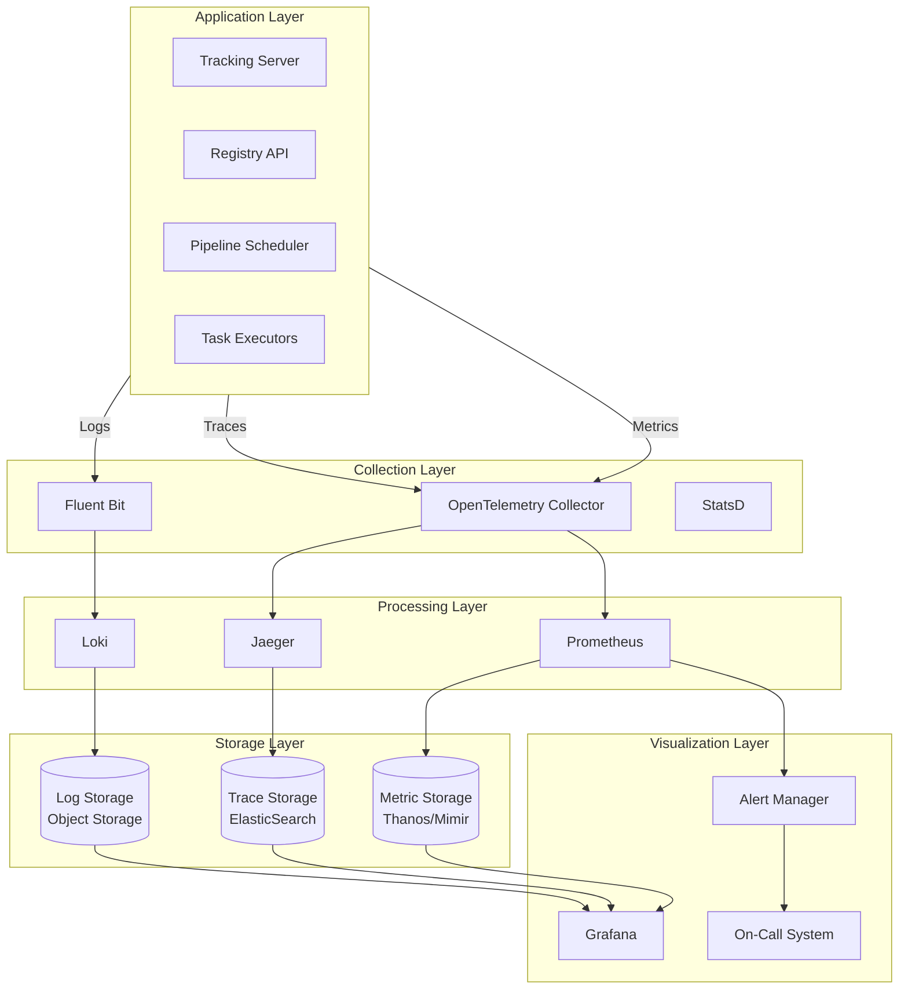
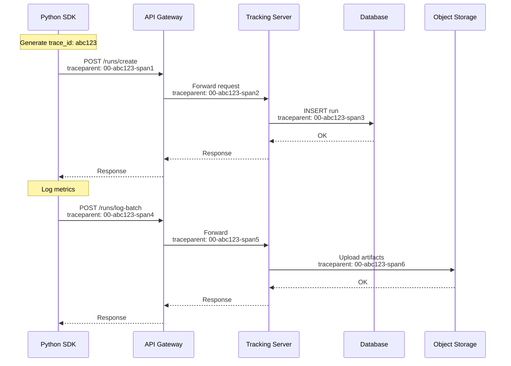

# Observability

[Back to Index](./00-index.md)

---

## Observability Architecture



---

## Metrics

### Platform Health Metrics

| Metric | Type | Labels | Description |
|--------|------|--------|-------------|
| `mlops_api_requests_total` | Counter | method, endpoint, status | Total API requests |
| `mlops_api_request_duration_seconds` | Histogram | method, endpoint | API latency distribution |
| `mlops_active_runs` | Gauge | experiment_id | Currently running experiments |
| `mlops_pipeline_jobs_total` | Counter | status, pipeline_name | Pipeline executions |
| `mlops_model_registrations_total` | Counter | model_name, stage | Model version registrations |

### Experiment Tracking Metrics

| Metric | Type | Labels | Description |
|--------|------|--------|-------------|
| `mlops_metrics_written_total` | Counter | - | Total metrics logged |
| `mlops_metrics_write_latency_seconds` | Histogram | - | Metric ingestion latency |
| `mlops_artifacts_uploaded_total` | Counter | type | Artifact uploads |
| `mlops_artifact_upload_bytes` | Counter | - | Total bytes uploaded |
| `mlops_experiments_active` | Gauge | - | Active experiments count |
| `mlops_runs_by_status` | Gauge | status | Runs per status |

### Pipeline Orchestration Metrics

| Metric | Type | Labels | Description |
|--------|------|--------|-------------|
| `mlops_pipeline_duration_seconds` | Histogram | pipeline_name | End-to-end pipeline duration |
| `mlops_task_duration_seconds` | Histogram | task_type | Individual task duration |
| `mlops_task_queue_depth` | Gauge | priority | Pending tasks in queue |
| `mlops_task_retries_total` | Counter | task_type, reason | Task retry count |
| `mlops_gpu_utilization` | Gauge | node_id | GPU utilization percentage |
| `mlops_checkpoint_size_bytes` | Histogram | - | Checkpoint sizes |

### Model Registry Metrics

| Metric | Type | Labels | Description |
|--------|------|--------|-------------|
| `mlops_models_total` | Gauge | - | Total registered models |
| `mlops_model_versions_total` | Gauge | model_name, stage | Versions per stage |
| `mlops_alias_updates_total` | Counter | model_name, alias | Alias updates |
| `mlops_stage_transitions_total` | Counter | from_stage, to_stage | Stage transitions |
| `mlops_artifact_download_duration_seconds` | Histogram | size_bucket | Download latency |

### SLI Metrics

```yaml
# Service Level Indicators

slis:
  # Availability SLI
  - name: api_availability
    metric: |
      sum(rate(mlops_api_requests_total{status!~"5.."}[5m])) /
      sum(rate(mlops_api_requests_total[5m]))
    target: 0.999

  # Latency SLI
  - name: api_latency_p99
    metric: |
      histogram_quantile(0.99,
        sum(rate(mlops_api_request_duration_seconds_bucket[5m])) by (le)
      )
    target: 0.2  # 200ms

  # Pipeline Success SLI
  - name: pipeline_success_rate
    metric: |
      sum(rate(mlops_pipeline_jobs_total{status="success"}[1h])) /
      sum(rate(mlops_pipeline_jobs_total[1h]))
    target: 0.995

  # Metric Ingestion SLI
  - name: metric_write_latency_p99
    metric: |
      histogram_quantile(0.99,
        sum(rate(mlops_metrics_write_latency_seconds_bucket[5m])) by (le)
      )
    target: 0.1  # 100ms
```

---

## Logging

### Log Format

```json
{
  "timestamp": "2026-01-24T10:30:00.123Z",
  "level": "INFO",
  "service": "tracking-server",
  "instance": "tracking-server-abc123",
  "trace_id": "a1b2c3d4e5f6",
  "span_id": "1234567890",
  "user_id": "user-456",
  "experiment_id": "exp-789",
  "run_id": "run-012",
  "message": "Metrics batch logged successfully",
  "metrics_count": 100,
  "latency_ms": 45
}
```

### Log Levels Strategy

| Level | Usage | Examples | Retention |
|-------|-------|----------|-----------|
| **ERROR** | System failures requiring attention | DB connection failed, artifact upload failed | 90 days |
| **WARN** | Degraded but functional | High latency, retry triggered | 30 days |
| **INFO** | Significant business events | Run started, model registered | 14 days |
| **DEBUG** | Detailed troubleshooting | SQL queries, API payloads | 3 days (dev only) |

### Structured Logging Configuration

```yaml
# Logging configuration

logging:
  format: json
  level: INFO
  sampling:
    enabled: true
    initial: 100        # Log all for first 100 req/sec
    thereafter: 10      # Then sample 1 in 10

  # Mandatory fields
  required_fields:
    - timestamp
    - level
    - service
    - trace_id
    - message

  # Sensitive data redaction
  redaction:
    patterns:
      - '\b[A-Za-z0-9._%+-]+@[A-Za-z0-9.-]+\.[A-Z|a-z]{2,}\b'  # Email
      - 'api[_-]?key[:=]\s*\S+'  # API keys
    replacement: "[REDACTED]"

  # Output destinations
  outputs:
    - type: stdout
      format: json
    - type: file
      path: /var/log/mlops/app.log
      rotation:
        max_size: 100MB
        max_files: 10
```

### Key Log Events

```yaml
log_events:
  # Pipeline Events
  pipeline_started:
    level: INFO
    fields: [pipeline_id, run_id, parameters, user_id]
    message: "Pipeline {pipeline_id} started"

  pipeline_completed:
    level: INFO
    fields: [pipeline_id, run_id, duration_seconds, status]
    message: "Pipeline {pipeline_id} completed with status {status}"

  task_failed:
    level: ERROR
    fields: [task_id, pipeline_run_id, error_message, retry_count]
    message: "Task {task_id} failed: {error_message}"

  # Experiment Events
  run_created:
    level: INFO
    fields: [run_id, experiment_id, user_id]
    message: "Run {run_id} created in experiment {experiment_id}"

  metrics_batch_logged:
    level: DEBUG
    fields: [run_id, metrics_count, latency_ms]
    message: "Logged {metrics_count} metrics for run {run_id}"

  # Registry Events
  model_version_created:
    level: INFO
    fields: [model_name, version, run_id, artifact_uri]
    message: "Model {model_name} version {version} created"

  stage_transition:
    level: INFO
    fields: [model_name, version, from_stage, to_stage, user_id]
    message: "Model {model_name}:{version} transitioned from {from_stage} to {to_stage}"

  alias_updated:
    level: INFO
    fields: [model_name, alias, old_version, new_version, user_id]
    message: "Alias {alias} for {model_name} updated to version {new_version}"
```

---

## Distributed Tracing

### Trace Propagation



### Span Configuration

```yaml
# OpenTelemetry configuration

tracing:
  service_name: mlops-platform
  sampling:
    type: probability
    probability: 0.1  # Sample 10% of traces
    always_sample_errors: true

  # Key spans to instrument
  spans:
    # API layer
    - name: http_request
      attributes: [http.method, http.url, http.status_code, user.id]

    # Business logic
    - name: run_create
      attributes: [experiment.id, run.id]

    - name: metrics_batch_write
      attributes: [run.id, metrics.count, batch.size]

    - name: model_version_create
      attributes: [model.name, version, artifact.size]

    - name: alias_update
      attributes: [model.name, alias, version]

    # Data layer
    - name: db_query
      attributes: [db.statement, db.operation, db.rows_affected]

    - name: storage_upload
      attributes: [storage.key, storage.size]

    - name: storage_download
      attributes: [storage.key, storage.size]
```

### Trace Analysis Queries

```sql
-- Find slow experiment runs
SELECT
  trace_id,
  operation_name,
  duration_ms,
  tags['experiment.id'] as experiment_id,
  tags['run.id'] as run_id
FROM spans
WHERE service_name = 'tracking-server'
  AND operation_name = 'run_create'
  AND duration_ms > 1000
  AND timestamp > NOW() - INTERVAL '1 hour'
ORDER BY duration_ms DESC
LIMIT 100;

-- Trace error patterns
SELECT
  tags['error.type'] as error_type,
  COUNT(*) as count,
  AVG(duration_ms) as avg_duration
FROM spans
WHERE service_name = 'mlops-platform'
  AND status = 'ERROR'
  AND timestamp > NOW() - INTERVAL '24 hours'
GROUP BY tags['error.type']
ORDER BY count DESC;
```

---

## Model Drift Detection

### Training-Serving Skew Monitoring

```
ALGORITHM SkewMonitor

METRICS:

1. Population Stability Index (PSI)
   - Measures distribution shift between training and serving
   - PSI < 0.1: No significant change
   - 0.1 <= PSI < 0.2: Moderate change, investigate
   - PSI >= 0.2: Significant change, action required

2. Kolmogorov-Smirnov Test (KS)
   - Measures maximum distance between CDFs
   - p-value < 0.05: Distributions significantly different

3. Jensen-Shannon Divergence
   - Symmetric measure of distribution similarity
   - Range: 0 (identical) to 1 (completely different)

FUNCTION calculate_psi(
    training_dist: Distribution,
    serving_dist: Distribution,
    buckets: int = 10
) -> float:

    // Bucket the distributions
    train_buckets = bucket_distribution(training_dist, buckets)
    serve_buckets = bucket_distribution(serving_dist, buckets)

    psi = 0.0
    FOR i IN range(buckets):
        train_pct = train_buckets[i] + 0.0001  // Avoid log(0)
        serve_pct = serve_buckets[i] + 0.0001

        psi += (serve_pct - train_pct) * ln(serve_pct / train_pct)

    RETURN psi

FUNCTION monitor_feature_skew(model_version: string):
    // Get training feature distributions
    training_stats = get_training_feature_stats(model_version)

    // Get recent serving feature distributions (last hour)
    serving_stats = get_serving_feature_stats(model_version, window="1h")

    skew_report = {}

    FOR feature IN training_stats.features:
        psi = calculate_psi(
            training_stats[feature],
            serving_stats[feature]
        )

        skew_report[feature] = {
            "psi": psi,
            "status": "OK" if psi < 0.1 else "WARN" if psi < 0.2 else "ALERT"
        }

        // Emit metric
        metrics.gauge("mlops_feature_psi", psi, {
            "model": model_version,
            "feature": feature
        })

        // Alert if significant
        IF psi >= 0.2:
            alert("feature_skew_detected", {
                "model": model_version,
                "feature": feature,
                "psi": psi
            })

    RETURN skew_report
```

### Model Performance Monitoring

```yaml
# Performance monitoring configuration

model_monitoring:
  # Metrics to track
  metrics:
    - name: prediction_latency
      type: histogram
      buckets: [10, 25, 50, 100, 250, 500, 1000]

    - name: prediction_throughput
      type: counter

    - name: prediction_accuracy
      type: gauge
      # Requires ground truth labels (delayed)

    - name: feature_missing_rate
      type: gauge
      per_feature: true

  # Drift detection
  drift_detection:
    enabled: true
    window_size: 1h
    comparison_window: 24h

    thresholds:
      psi_warning: 0.1
      psi_critical: 0.2
      ks_p_value: 0.05

  # Alerting
  alerts:
    - name: high_latency
      condition: histogram_quantile(0.99, prediction_latency) > 200
      for: 5m

    - name: accuracy_degradation
      condition: prediction_accuracy < 0.9
      for: 1h

    - name: feature_drift
      condition: feature_psi > 0.2
      for: 30m
```

---

## Alerting

### Alert Definitions

```yaml
groups:
  - name: mlops-platform
    rules:
      # API Availability
      - alert: APIHighErrorRate
        expr: |
          sum(rate(mlops_api_requests_total{status=~"5.."}[5m])) /
          sum(rate(mlops_api_requests_total[5m])) > 0.01
        for: 5m
        labels:
          severity: critical
        annotations:
          summary: "API error rate above 1%"
          runbook: "https://wiki/runbooks/api-errors"

      # API Latency
      - alert: APIHighLatency
        expr: |
          histogram_quantile(0.99,
            sum(rate(mlops_api_request_duration_seconds_bucket[5m])) by (le)
          ) > 0.5
        for: 5m
        labels:
          severity: warning
        annotations:
          summary: "API p99 latency above 500ms"

      # Pipeline Failures
      - alert: PipelineHighFailureRate
        expr: |
          sum(rate(mlops_pipeline_jobs_total{status="failed"}[1h])) /
          sum(rate(mlops_pipeline_jobs_total[1h])) > 0.05
        for: 15m
        labels:
          severity: warning
        annotations:
          summary: "Pipeline failure rate above 5%"

      # Metric Ingestion
      - alert: MetricIngestionBackpressure
        expr: |
          mlops_metric_write_queue_depth > 10000
        for: 5m
        labels:
          severity: warning
        annotations:
          summary: "Metric write queue backing up"

      # Database
      - alert: DatabaseHighConnections
        expr: |
          mlops_db_connections_active / mlops_db_connections_max > 0.8
        for: 5m
        labels:
          severity: warning
        annotations:
          summary: "Database connection pool > 80%"

      # Storage
      - alert: ArtifactStorageHighLatency
        expr: |
          histogram_quantile(0.99,
            sum(rate(mlops_artifact_download_duration_seconds_bucket[5m])) by (le)
          ) > 5
        for: 5m
        labels:
          severity: warning
        annotations:
          summary: "Artifact download p99 > 5s"

      # Model Drift
      - alert: ModelFeatureDrift
        expr: |
          mlops_feature_psi > 0.2
        for: 30m
        labels:
          severity: warning
        annotations:
          summary: "Significant feature drift detected for model {{ $labels.model }}"
```

### Alert Routing

```yaml
# AlertManager configuration

route:
  receiver: 'default'
  group_by: ['alertname', 'service']
  group_wait: 30s
  group_interval: 5m
  repeat_interval: 4h

  routes:
    # Critical alerts -> PagerDuty immediately
    - match:
        severity: critical
      receiver: 'pagerduty'
      continue: true

    # Model drift -> ML team Slack
    - match:
        alertname: ModelFeatureDrift
      receiver: 'ml-team-slack'

    # Pipeline failures -> Data team
    - match_re:
        alertname: Pipeline.*
      receiver: 'data-team-slack'

receivers:
  - name: 'default'
    slack_configs:
      - channel: '#mlops-alerts'
        send_resolved: true

  - name: 'pagerduty'
    pagerduty_configs:
      - service_key: '<key>'
        severity: critical

  - name: 'ml-team-slack'
    slack_configs:
      - channel: '#ml-team-alerts'

  - name: 'data-team-slack'
    slack_configs:
      - channel: '#data-team-alerts'
```

---

## Dashboard Design

### Platform Overview Dashboard

```
┌────────────────────────────────────────────────────────────────────────┐
│  MLOPS PLATFORM OVERVIEW                             [Last 24h] [▼]    │
├────────────────────────────────────────────────────────────────────────┤
│                                                                        │
│  ┌──────────────┐  ┌──────────────┐  ┌──────────────┐  ┌──────────────┐
│  │ API Success  │  │ Active Runs  │  │ Pipeline     │  │ Models in    │
│  │    99.8%     │  │   1,234      │  │ Success Rate │  │ Production   │
│  │   ▲ 0.1%     │  │   ▲ 15%      │  │    97.2%     │  │     156      │
│  └──────────────┘  └──────────────┘  └──────────────┘  └──────────────┘
│                                                                        │
├────────────────────────────────────────────────────────────────────────┤
│  API LATENCY (p50 / p95 / p99)                                         │
│  ═══════════════════════════════════════════════════════════════════  │
│                                                                        │
│  │    p99 ────────────────────────────────                            │
│  │    p95 ─────────────────────────                                   │
│  │    p50 ────────────────                                            │
│  └──────────────────────────────────────────────> Time                │
│                                                                        │
├──────────────────────────────┬─────────────────────────────────────────┤
│  PIPELINE STATUS             │  MODEL REGISTRY ACTIVITY                │
│  ═══════════════             │  ═══════════════════════                │
│                              │                                         │
│  Running:  ████████  45      │  Versions Today:  89                   │
│  Pending:  ████      12      │  Production:      3                    │
│  Failed:   ██         6      │  Aliases Updated: 7                    │
│  Success:  ████████████ 156  │                                         │
│                              │  Top Models:                            │
│                              │  1. fraud-detector (23 versions)       │
│                              │  2. recommender (18 versions)          │
│                              │  3. nlp-classifier (12 versions)       │
│                              │                                         │
├──────────────────────────────┴─────────────────────────────────────────┤
│  METRIC INGESTION                                                      │
│  ═══════════════                                                       │
│                                                                        │
│  Writes/sec:  45,230  │  Queue Depth:  234  │  Write Latency p99: 45ms │
│                                                                        │
│  │    ╭──────────────────────────────────────────╮                    │
│  │    │                                          │                    │
│  │    │    Writes per second over 24 hours       │                    │
│  │    ╰──────────────────────────────────────────╯                    │
│  └──────────────────────────────────────────────────> Time            │
│                                                                        │
└────────────────────────────────────────────────────────────────────────┘
```

### Experiment Deep Dive Dashboard

```
┌────────────────────────────────────────────────────────────────────────┐
│  EXPERIMENT: fraud-detection-v3                    [Experiment ID: 123]│
├────────────────────────────────────────────────────────────────────────┤
│                                                                        │
│  Owner: alice@company.com    Created: 2026-01-20    Runs: 1,234       │
│                                                                        │
├────────────────────────────────────────────────────────────────────────┤
│  RUN METRICS COMPARISON                                                │
│  ═══════════════════════                                               │
│                                                                        │
│  Run ID      │ accuracy │ f1_score │ latency_ms │ Status   │ Duration │
│  ────────────┼──────────┼──────────┼────────────┼──────────┼──────────│
│  run-abc123  │   0.956  │   0.943  │     45     │ FINISHED │   2.3h   │
│  run-def456  │   0.948  │   0.935  │     52     │ FINISHED │   2.1h   │
│  run-ghi789  │   0.962  │   0.951  │     48     │ RUNNING  │   1.2h   │
│                                                                        │
├────────────────────────────────────────────────────────────────────────┤
│  METRIC TRENDS                                                         │
│  ═════════════                                                         │
│                                                                        │
│  │  accuracy                                                          │
│  │  ╭─────────────────────────────────────────╮                       │
│  │  │    run-ghi789 (best)                    │                       │
│  │  │    run-abc123                           │                       │
│  │  │    run-def456                           │                       │
│  │  ╰─────────────────────────────────────────╯                       │
│  └─────────────────────────────────────────────> training step        │
│                                                                        │
├────────────────────────────────────────────────────────────────────────┤
│  PARAMETER DISTRIBUTION                                                │
│  ══════════════════════                                                │
│                                                                        │
│  learning_rate: [0.001, 0.01, 0.1]   max_depth: [4, 6, 8, 10]        │
│  batch_size: [32, 64, 128]           n_estimators: [100, 200, 500]    │
│                                                                        │
└────────────────────────────────────────────────────────────────────────┘
```

---

## Runbooks

### Runbook: High API Error Rate

```markdown
# Runbook: API High Error Rate

## Alert
APIHighErrorRate - API error rate above 1%

## Impact
Users unable to log experiments, register models, or access artifacts.

## Investigation Steps

1. **Check error distribution**
   ```
   Query: sum by (endpoint, status) (rate(mlops_api_requests_total{status=~"5.."}[5m]))
   ```
   - Identify which endpoints are failing
   - Check if specific error codes dominate (500 vs 502 vs 503)

2. **Check recent deployments**
   - Review deployment history for last 2 hours
   - Check if errors correlate with deployment time

3. **Check downstream dependencies**
   - Database connectivity: `mlops_db_connections_active`
   - Object storage: `mlops_storage_request_errors`
   - External services: Check service mesh metrics

4. **Check resource utilization**
   - CPU/Memory of API pods
   - Database connections and query latency

## Mitigation

### If database issue:
- Check connection pool exhaustion
- Consider scaling read replicas
- Implement circuit breaker if not already

### If deployment issue:
- Rollback to previous version
- Investigate diff between versions

### If traffic spike:
- Enable aggressive rate limiting
- Scale API horizontally

## Resolution
- Document root cause
- Create ticket for permanent fix
- Update monitoring if gap identified
```

### Runbook: Pipeline Scheduler Failover

```markdown
# Runbook: Pipeline Scheduler Failover

## Alert
SchedulerLeaderLost - Scheduler leader lease expired

## Impact
New pipelines won't start; running pipelines continue but won't progress tasks.

## Automatic Recovery
Scheduler uses leader election - standby should promote automatically within 30s.

## Investigation Steps

1. **Verify standby promoted**
   ```
   kubectl get pods -l app=pipeline-scheduler -o wide
   kubectl logs <new-leader-pod> | grep "acquired lease"
   ```

2. **If no leader elected:**
   - Check etcd/coordination service health
   - Verify network connectivity between scheduler pods
   - Check pod resource limits (OOM?)

3. **Check pipeline state recovery**
   - Verify active pipelines resumed
   - Check task queue depth returning to normal

## Manual Intervention

If automatic recovery fails:

1. Identify healthiest scheduler pod
2. Delete other scheduler pods to force re-election
3. If persistent, restart all scheduler pods
4. Verify state store (PostgreSQL) is healthy

## Post-Incident
- Review leader election timeout settings
- Check if network partition caused issue
- Verify monitoring covers election events
```
