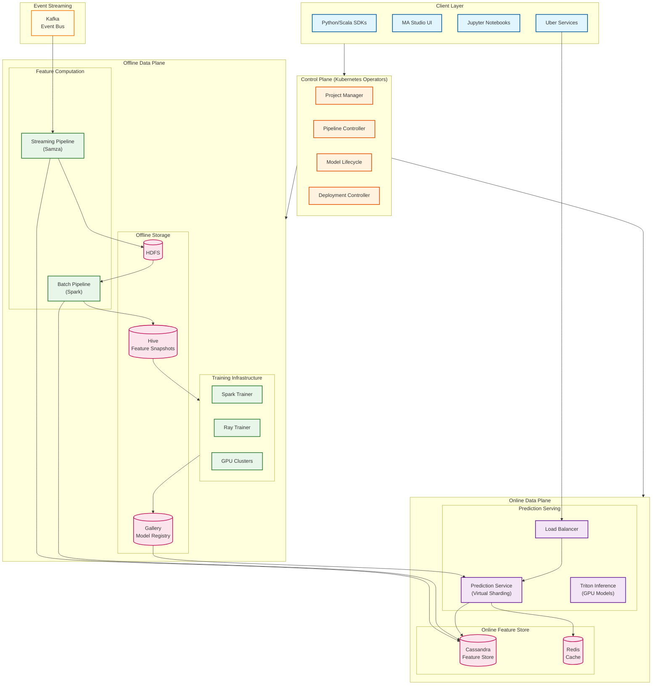

# Uber Michelangelo ML Platform

## Overview

**Uber Michelangelo** is a pioneering end-to-end machine learning platform that revolutionized enterprise ML infrastructure. Launched in 2017, it became the blueprint for modern ML platforms, directly inspiring the feature store movement and influencing platforms like Tecton (founded by ex-Michelangelo engineers). The platform manages 5,000+ production models serving **10 million real-time predictions per second** across Uber's core business functions including dynamic pricing, ETA estimation, fraud detection, and driver-rider matching.

**Key Differentiator:** Michelangelo introduced the concept of a unified ML platform with an integrated feature store (Palette), solving the "hidden technical debt" problem where engineers previously built fragmented, one-off ML systems. The platform spans the entire ML lifecycle from feature engineering to production serving, with recent evolution (2024-2026) adding full LLMOps capabilities through the GenAI Gateway.

---

## System Characteristics

| Characteristic | Value | Implication |
|----------------|-------|-------------|
| Traffic Pattern | Mixed: Bursty training + Sustained serving | Separate compute pools, auto-scaling per workload type |
| Serving Latency | P95 < 5ms (no features), P95 < 10ms (with Cassandra) | Online feature store critical path optimization |
| Consistency Model | Strong (model registry), Eventual (features) | Dual-store architecture with different guarantees |
| Availability Target | 99.99% for Tier 1 models | Multi-region deployment, graceful degradation |
| Scale Target | 10M predictions/sec, 5,000+ models | Horizontal scaling, virtual model sharding |
| Data Processing | Lambda architecture (batch + streaming) | Unified offline/online feature computation |

---

## Complexity Rating

| Component | Rating | Justification |
|-----------|--------|---------------|
| **Overall** | Very High | End-to-end platform integrating feature store, training, registry, and serving at massive scale |
| Palette Feature Store | Very High | Dual-store architecture, custom DSL, 20,000+ features, millisecond serving |
| Gallery Model Registry | High | Version control, metadata tracking, lineage, governance |
| Canvas (Model-as-Code) | Medium | Docker packaging, Bazel builds, CI/CD integration |
| Online Prediction Service | Very High | 10M QPS, sub-10ms latency, virtual model sharding |
| Distributed Training | High | Spark/Ray clusters, GPU scheduling, checkpointing |
| GenAI Gateway (2024+) | High | Multi-provider LLM routing, fine-tuning, guardrails |

---

## Quick Navigation

| Document | Description |
|----------|-------------|
| [01 - Requirements & Estimations](./01-requirements-and-estimations.md) | Functional/non-functional requirements, capacity planning, SLOs |
| [02 - High-Level Design](./02-high-level-design.md) | Three-plane architecture, data flow, key decisions |
| [03 - Low-Level Design](./03-low-level-design.md) | Data models, APIs, feature DSL, algorithms |
| [04 - Deep Dive & Bottlenecks](./04-deep-dive-and-bottlenecks.md) | Palette internals, serving optimization, training pipelines |
| [05 - Scalability & Reliability](./05-scalability-and-reliability.md) | Scaling strategies, fault tolerance, disaster recovery |
| [06 - Security & Compliance](./06-security-and-compliance.md) | Project tiering, access control, model governance |
| [07 - Observability](./07-observability.md) | Metrics, logging, tracing, drift detection |
| [08 - Interview Guide](./08-interview-guide.md) | 45-minute pacing, trap questions, trade-offs |

---

## Core Components

| Component | Responsibility | Key Innovation |
|-----------|----------------|----------------|
| **Palette** | Feature store with dual offline/online architecture | Pioneered feature store concept; 20,000+ reusable features |
| **Gallery** | Model registry with versioning and metadata | Comprehensive lineage tracking, reproducibility |
| **Canvas** | Model-as-code framework | Immutable Docker artifacts, Bazel builds |
| **MA Studio** | Unified development environment | Single UI for entire ML lifecycle |
| **Prediction Service** | Online model serving | Virtual sharding, 10M QPS at <10ms P95 |
| **Training Service** | Distributed model training | Spark/Ray clusters, GPU scheduling |
| **GenAI Gateway** | LLM access and orchestration | Multi-provider routing, 60+ use cases |

---

## Architecture Overview



---

## Michelangelo Evolution

| Version | Era | Key Capabilities |
|---------|-----|------------------|
| **1.0** | 2017 | Core platform: feature store, training, serving |
| **2.0** | 2019-2021 | Project tiering, Canvas (model-as-code), deep learning support |
| **3.0** | 2022-2024 | LLMOps, GenAI Gateway, Kubernetes migration, Ray adoption |
| **Current** | 2024-2026 | Full generative AI support, 60+ LLM use cases, unified ML/LLM platform |

---

## Project Tiering System

| Tier | Business Impact | Examples | SLA Target |
|------|-----------------|----------|------------|
| **Tier 1** | Critical user path | ETA, pricing, fraud, matching | 99.99% availability |
| **Tier 2** | High-impact functions | Recommendations, search ranking | 99.9% availability |
| **Tier 3** | Medium-impact | Analytics, forecasting | 99.5% availability |
| **Tier 4** | Experimental | Research, prototypes | Best effort |

---

## Key Numbers

| Metric | Value | Context |
|--------|-------|---------|
| Production models | 5,000+ | Across all Uber business units |
| Predictions/second | 10M+ | Peak serving load |
| P95 serving latency | < 10ms | With Cassandra feature lookup |
| P95 serving latency | < 5ms | Without feature lookup |
| Training jobs/month | 20,000+ | Across all teams |
| Features in store | 20,000+ | Reusable across projects |
| Active ML projects | 400+ | Using Michelangelo |
| LLM use cases | 60+ | Via GenAI Gateway |
| Network bandwidth | 100GB/s | Per GPU server (2024 upgrade) |

---

## Why Michelangelo Matters (Historical Context)

**Before Michelangelo (Pre-2017):**
- Engineers built custom, one-off ML systems
- No uniform pipelines for training/prediction data
- Translating local models to production consumed enormous resources
- No existing tooling for large-scale distributed training at Uber's scale

**Michelangelo's Impact:**
- Pioneered the **Feature Store** concept (Palette)
- Established the **ML Platform** as a product category
- Tecton (enterprise feature store) was founded by Michelangelo creators
- Influenced design of: Netflix Metaflow, Airbnb BigHead, Meta FBLearner

---

## Interview Readiness Checklist

- [ ] Can explain Michelangelo's three-plane architecture (Control, Offline, Online)
- [ ] Understand Palette's dual-store design (Hive offline + Cassandra online)
- [ ] Know why feature stores exist and the training-serving consistency problem
- [ ] Can describe virtual model sharding for multi-model serving
- [ ] Understand project tiering and its impact on SLAs
- [ ] Know the evolution from Spark to Ray for training/inference
- [ ] Can discuss Lambda architecture for feature computation
- [ ] Understand Gallery's role in model versioning and lineage
- [ ] Know how Canvas enables model-as-code workflows
- [ ] Can explain GenAI Gateway's role in LLMOps (2024+)

---

## Related Systems

- [3.4 MLOps Platform](../3.4-mlops-platform/00-index.md) - Generic MLOps concepts
- [3.2 ML Models Deployment System](../3.2-ml-models-deployment-system/00-index.md) - Serving infrastructure
- [3.6 Netflix Metaflow](../README.md) - Alternative ML workflow approach (upcoming)
- [3.16 Feature Store Design](../README.md) - Generic feature store patterns (upcoming)
- [1.3 Distributed Key-Value Store](../1.3-distributed-key-value-store/00-index.md) - Cassandra patterns

---

## Quick Reference Card

```
+-----------------------------------------------------------------------+
|          UBER MICHELANGELO - QUICK REFERENCE                          |
+-----------------------------------------------------------------------+
|                                                                        |
|  CORE COMPONENTS                   SCALE TARGETS                       |
|  ----------------                  --------------                       |
|  * Palette (Feature Store)         * 10M predictions/sec               |
|  * Gallery (Model Registry)        * 5,000+ production models          |
|  * Canvas (Model-as-Code)          * 20,000+ features                  |
|  * MA Studio (Dev Environment)     * P95 < 10ms latency                |
|  * Prediction Service              * 99.99% Tier 1 availability        |
|  * GenAI Gateway (LLMOps)          * 60+ LLM use cases                 |
|                                                                        |
+-----------------------------------------------------------------------+
|                                                                        |
|  TECHNICAL STACK                   KEY PATTERNS                        |
|  ---------------                   -------------                        |
|  * Spark/Ray (Training)            * Lambda architecture               |
|  * Samza (Streaming)               * Dual-store feature store          |
|  * Kafka (Event Bus)               * Virtual model sharding            |
|  * Cassandra (Online Store)        * Project tiering                   |
|  * Hive (Offline Store)            * Model-as-code                     |
|  * Kubernetes Operators            * Kubernetes operator pattern       |
|                                                                        |
+-----------------------------------------------------------------------+
|                                                                        |
|  INTERVIEW KEYWORDS                                                    |
|  ------------------                                                    |
|  Feature store, training-serving consistency, Palette, Gallery,        |
|  Canvas, dual-store architecture, virtual sharding, project tiering,   |
|  Lambda architecture, Cassandra, Hive, Spark, Ray, Samza, Kafka,       |
|  GenAI Gateway, LLMOps, model versioning, feature DSL, online store,   |
|  offline store, batch features, streaming features, model-as-code      |
|                                                                        |
+-----------------------------------------------------------------------+
```

---

## References

- [Meet Michelangelo: Uber's Machine Learning Platform](https://www.uber.com/blog/michelangelo-machine-learning-platform/) - Original announcement (2017)
- [Scaling Machine Learning at Uber with Michelangelo](https://www.uber.com/blog/scaling-michelangelo/) - Scale insights
- [From Predictive to Generative - Michelangelo's AI Journey](https://www.uber.com/blog/from-predictive-to-generative-ai/) - LLMOps evolution (2024)
- [Michelangelo Palette: A Feature Engineering Platform](https://www.infoq.com/presentations/michelangelo-palette-uber/) - InfoQ presentation
- [Gallery: A Machine Learning Model Management System](https://openproceedings.org/2020/conf/edbt/paper_217.pdf) - EDBT 2020 paper
- [Navigating the LLM Landscape: Uber's GenAI Gateway](https://www.uber.com/blog/genai-gateway/) - GenAI capabilities (2024)
- [Uber's Journey to Ray on Kubernetes](https://www.uber.com/blog/ubers-journey-to-ray-on-kubernetes-ray-setup/) - Infrastructure modernization
