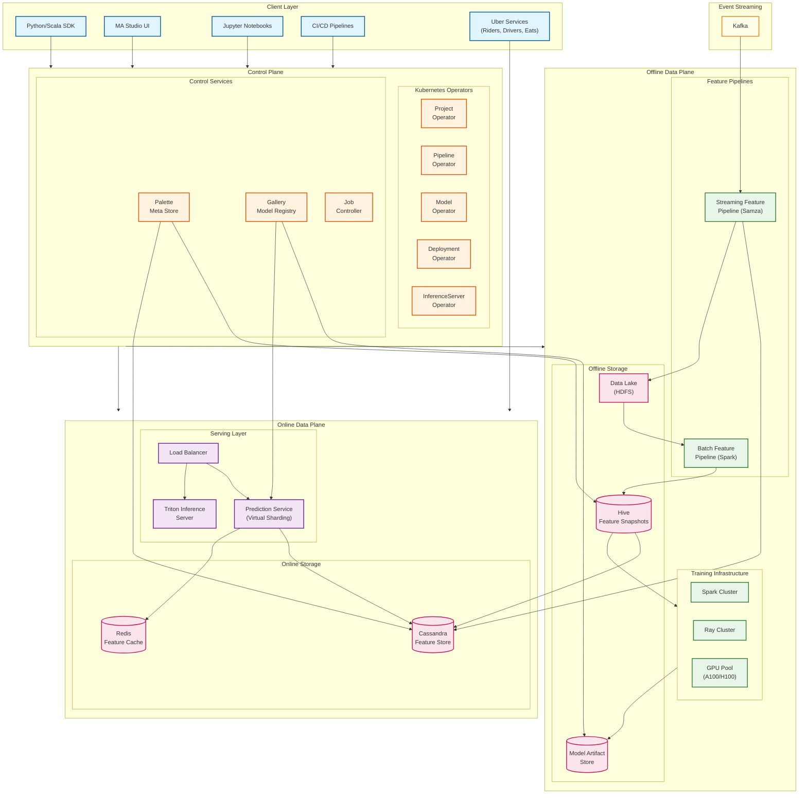
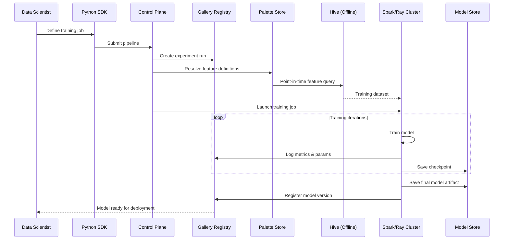
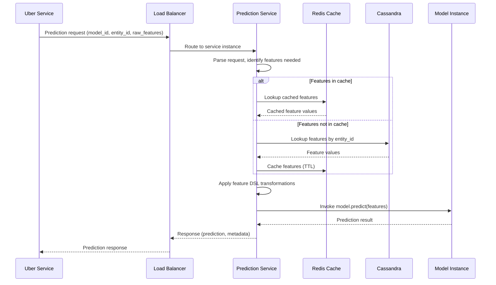
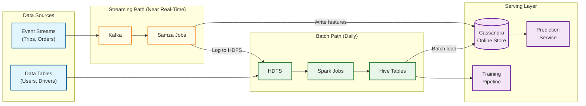
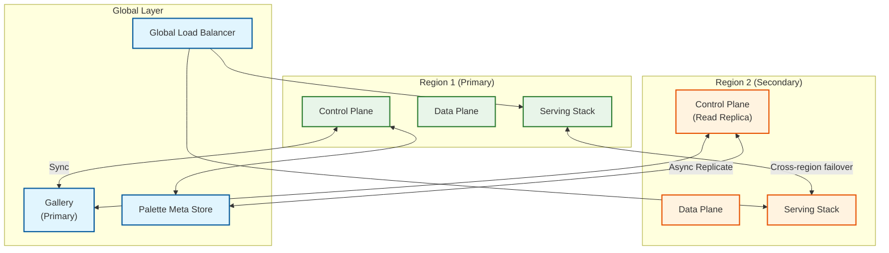

# High-Level Design

## System Architecture

Michelangelo's architecture is organized into **three distinct planes** that separate concerns and enable independent scaling:

---

## Three-Plane Architecture

### Control Plane

**Purpose:** Manages the lifecycle of all ML entities using Kubernetes operators.

| Component | Responsibility |
|-----------|----------------|
| **Project Operator** | Manages project lifecycle, tiering, resource quotas |
| **Pipeline Operator** | Orchestrates feature and training pipelines |
| **Model Operator** | Handles model versioning, staging, promotion |
| **Deployment Operator** | Manages model deployments to serving infrastructure |
| **InferenceServer Operator** | Controls prediction service instances |
| **Palette Meta Store** | Feature metadata, schema, lineage tracking |
| **Gallery** | Model registry, artifacts, experiment tracking |
| **Job Controller** | Federates jobs across Kubernetes clusters |

**Key Design Decision:** Kubernetes operators provide standardized API conventions across all ML entities, leveraging Kubernetes' built-in machinery (API server, etcd, controller manager).

### Offline Data Plane

**Purpose:** Heavy computation workloads for feature engineering and model training.

| Component | Responsibility |
|-----------|----------------|
| **Batch Feature Pipeline** | Spark-based computation of historical features |
| **Streaming Feature Pipeline** | Samza-based real-time feature aggregation |
| **Spark Cluster** | Distributed training for traditional ML (XGBoost, etc.) |
| **Ray Cluster** | Distributed training for deep learning, LLMs |
| **GPU Pool** | Shared GPU resources (A100/H100) for training |
| **Data Lake (HDFS)** | Raw data and intermediate results |
| **Hive** | Feature snapshots for offline serving |
| **Model Artifact Store** | Versioned model binaries |

### Online Data Plane

**Purpose:** Real-time prediction serving with millisecond latency.

| Component | Responsibility |
|-----------|----------------|
| **Load Balancer** | Request routing, health checks |
| **Prediction Service** | Model inference with virtual sharding |
| **Triton Inference Server** | GPU-accelerated inference for DL models |
| **Cassandra** | Online feature store (primary) |
| **Redis** | Feature cache for ultra-low latency |

---

## Data Flow Diagrams

### Training Pipeline Flow

### Online Prediction Flow

### Feature Computation Flow (Lambda Architecture)

---

## Key Architectural Decisions

### 1. Lambda Architecture for Features

| Decision | Lambda Architecture (Batch + Streaming) |
|----------|----------------------------------------|
| **Context** | Features need both historical accuracy and real-time freshness |
| **Options Considered** | Kappa (streaming only), Batch only, Lambda |
| **Choice** | Lambda: Dual batch + streaming paths |
| **Rationale** | Batch provides accurate historical data for training; streaming provides fresh data for serving |
| **Trade-off** | Operational complexity of maintaining two systems; mitigated by shared DSL |

### 2. Dual-Store Feature Architecture

| Decision | Hive (Offline) + Cassandra (Online) |
|----------|-------------------------------------|
| **Context** | Training needs point-in-time joins; serving needs low latency |
| **Options Considered** | Single store, Virtual feature store, Physical dual-store |
| **Choice** | Physical dual-store with materialization |
| **Rationale** | Optimized storage engine for each use case; Hive for analytical queries, Cassandra for key-value lookups |
| **Trade-off** | Data duplication; mitigated by automated sync pipelines |

### 3. Virtual Model Sharding

| Decision | Multi-model per prediction service instance |
|----------|-------------------------------------------|
| **Context** | 5,000+ models need efficient hosting |
| **Options Considered** | One model per container, dedicated instances, virtual sharding |
| **Choice** | Virtual sharding: multiple models per instance |
| **Rationale** | Better resource utilization; models loaded on-demand or at startup |
| **Trade-off** | Complexity in memory management; requires careful scheduling |

### 4. Kubernetes Operators as Control Plane

| Decision | Custom Kubernetes operators for ML entities |
|----------|-------------------------------------------|
| **Context** | Need standardized lifecycle management across ML primitives |
| **Options Considered** | Custom control plane, Kubeflow, Kubernetes operators |
| **Choice** | Custom Kubernetes operators |
| **Rationale** | Leverage K8s API machinery; standardized conventions; extensibility |
| **Trade-off** | Requires K8s expertise; operator maintenance overhead |

### 5. Ray Migration for Training/Inference

| Decision | Migrate from Spark to Ray (2024) |
|----------|----------------------------------|
| **Context** | Deep learning and LLM workloads don't fit Spark's batch model |
| **Options Considered** | Keep Spark, Dask, Ray |
| **Choice** | Ray for DL/LLM; Spark retained for traditional ML |
| **Rationale** | Ray's native Python, actor model, GPU support better for modern ML |
| **Trade-off** | Migration effort; dual-stack maintenance during transition |

---

## Architecture Pattern Checklist

| Pattern | Decision | Rationale |
|---------|----------|-----------|
| **Sync vs Async** | Both | Sync for predictions; async for training/feature computation |
| **Event-driven vs Request-response** | Both | Event-driven for features; request-response for predictions |
| **Push vs Pull** | Pull-based serving | Features pulled on-demand; push for feature store updates |
| **Stateless vs Stateful** | Stateless serving | Models loaded from shared storage; enables horizontal scaling |
| **Read vs Write optimization** | Read-heavy serving | Cassandra optimized for reads; write-heavy in batch paths |
| **Real-time vs Batch** | Lambda (both) | Streaming for freshness; batch for accuracy |
| **Edge vs Origin** | Origin-centric | All processing at datacenter; edge only for routing |

---

## Component Interaction Matrix

| From \ To | Prediction Service | Cassandra | Hive | Spark/Ray | Kafka | Gallery |
|-----------|-------------------|-----------|------|-----------|-------|---------|
| **Uber Services** | Sync (predict) | - | - | - | Async (events) | - |
| **Prediction Service** | - | Sync (lookup) | - | - | - | Read (model) |
| **Training Pipeline** | - | - | Read (features) | Execute | - | Write (metrics) |
| **Feature Pipeline** | - | Write | Write | Execute | Consume | - |
| **Control Plane** | Manage | - | - | Schedule | - | Manage |

---

## Deployment Architecture

### Multi-Region Topology

---

## Technology Stack Summary

| Layer | Component | Technology | Purpose |
|-------|-----------|------------|---------|
| **Client** | SDK | Python, Scala | API interaction |
| **Client** | UI | MA Studio (React) | Visual workflow |
| **Control** | Orchestration | Kubernetes Operators | Lifecycle management |
| **Control** | Metadata | PostgreSQL, etcd | Persistent state |
| **Offline** | Batch Processing | Apache Spark | Feature computation, training |
| **Offline** | Stream Processing | Apache Samza | Real-time features |
| **Offline** | Storage | HDFS, Hive | Data lake, feature snapshots |
| **Offline** | Training | Ray, PyTorch | Distributed DL training |
| **Online** | Serving | Java (custom) | Low-latency predictions |
| **Online** | GPU Serving | Triton | DL model inference |
| **Online** | Feature Store | Cassandra, Redis | Online features |
| **Streaming** | Event Bus | Apache Kafka | Event transport |

---

## Design Principles

1. **Training-Serving Consistency:** Same features and transformations used in training and serving
2. **Model-as-Code:** All model definitions version-controlled and reproducible
3. **Project Tiering:** Resource allocation based on business impact
4. **Unified Platform:** Single system for entire ML lifecycle
5. **Self-Service:** Data scientists can deploy without platform team involvement
6. **Operator Pattern:** Declarative management of ML resources
