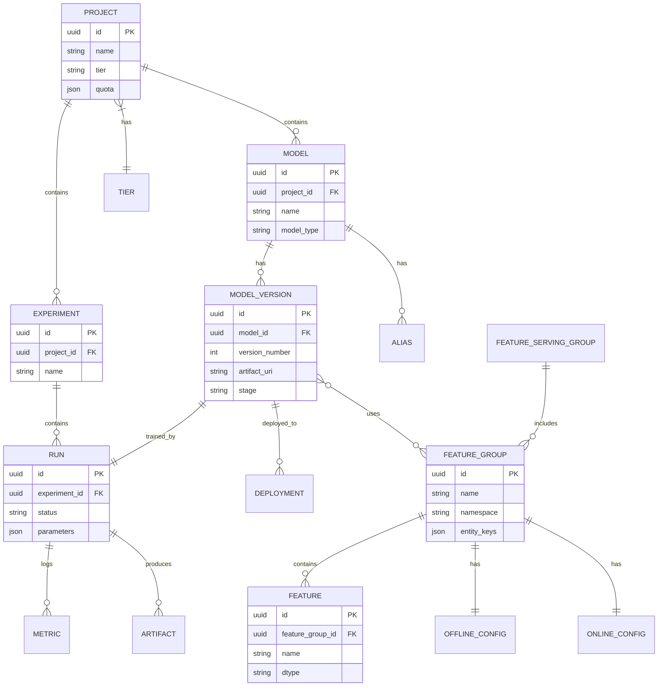

# Low-Level Design

## Data Model

### Palette Feature Store Schema

#### FeatureGroup

Logical table containing related features, backed by physical storage.

```
FeatureGroup {
    id: UUID
    name: String                    // e.g., "driver_features"
    namespace: String               // e.g., "rideshare"
    description: String
    owner_team: String

    // Schema
    entity_keys: List<Column>       // Primary keys (e.g., driver_id)
    features: List<FeatureColumn>   // Feature definitions
    timestamp_column: String        // For point-in-time joins

    // Storage configuration
    offline_config: OfflineConfig
    online_config: OnlineConfig

    // Metadata
    created_at: Timestamp
    updated_at: Timestamp
    version: Integer
    tags: Map<String, String>
}

FeatureColumn {
    name: String
    dtype: DataType                 // INT, FLOAT, STRING, VECTOR, etc.
    description: String
    default_value: Any
    transformation: DSLExpression   // Optional DSL transformation
    freshness_sla: Duration         // Expected update frequency
}

OfflineConfig {
    storage_type: "HIVE"
    database: String
    table: String
    partition_keys: List<String>    // e.g., ["dt"]
    file_format: "PARQUET" | "ORC"
    retention_days: Integer
}

OnlineConfig {
    storage_type: "CASSANDRA" | "REDIS"
    keyspace: String
    table: String
    ttl_seconds: Integer
    replication_factor: Integer
    consistency_level: "ONE" | "QUORUM" | "LOCAL_QUORUM"
}
```

#### FeatureServingGroup

Logical serving unit with SLA guarantees.

```
FeatureServingGroup {
    id: UUID
    name: String
    feature_groups: List<FeatureGroupRef>

    // SLA configuration
    latency_sla_ms: Integer         // e.g., 10
    throughput_qps: Integer         // e.g., 1000000
    availability_target: Float      // e.g., 0.9999

    // Backing storage
    storage_cluster: ClusterRef
    cache_config: CacheConfig

    // Access control
    allowed_projects: List<ProjectRef>
}

CacheConfig {
    enabled: Boolean
    cache_type: "REDIS" | "LOCAL"
    ttl_seconds: Integer
    max_size_mb: Integer
}
```

### Gallery Model Registry Schema

#### Model

```
Model {
    id: UUID
    name: String                    // e.g., "eta_prediction_v2"
    project_id: ProjectRef
    description: String
    owner_team: String

    // Classification
    model_type: "CLASSIFICATION" | "REGRESSION" | "RANKING" | "LLM"
    framework: "XGBOOST" | "PYTORCH" | "TENSORFLOW" | "SKLEARN"

    // Versions
    versions: List<ModelVersion>
    latest_version: ModelVersionRef

    // Aliases for deployment
    aliases: Map<String, ModelVersionRef>  // e.g., {"production": v5, "canary": v6}

    // Metadata
    created_at: Timestamp
    updated_at: Timestamp
    tags: Map<String, String>
}

ModelVersion {
    id: UUID
    model_id: ModelRef
    version_number: Integer

    // Artifact
    artifact_uri: String            // Path to model binary
    artifact_hash: String           // SHA256 for integrity
    artifact_size_bytes: Long

    // Training context
    training_run_id: RunRef
    training_data_version: String
    feature_schema: FeatureSchema
    hyperparameters: Map<String, Any>

    // Metrics
    metrics: Map<String, Float>     // e.g., {"auc": 0.95, "rmse": 0.12}

    // Environment
    dependencies: List<Dependency>
    docker_image: String

    // Governance
    stage: "NONE" | "STAGING" | "PRODUCTION" | "ARCHIVED"
    approved_by: String
    approved_at: Timestamp

    created_at: Timestamp
}

FeatureSchema {
    input_features: List<FeatureSpec>
    output_schema: OutputSpec
}

FeatureSpec {
    name: String
    dtype: DataType
    source: "RAW" | "PALETTE" | "DERIVED"
    feature_group_ref: FeatureGroupRef  // If from Palette
    transformation: DSLExpression       // If derived
}
```

#### Experiment Run

```
Run {
    id: UUID
    experiment_id: ExperimentRef
    name: String

    // Execution
    status: "PENDING" | "RUNNING" | "COMPLETED" | "FAILED"
    start_time: Timestamp
    end_time: Timestamp

    // Configuration
    parameters: Map<String, Any>
    tags: Map<String, String>

    // Results
    metrics: List<Metric>
    artifacts: List<Artifact>

    // Lineage
    parent_run_id: RunRef           // For nested runs
    source_code_version: String     // Git commit
    data_version: String
}

Metric {
    key: String
    value: Float
    timestamp: Timestamp
    step: Integer                   // Training iteration
}
```

### Project Tiering Schema

```
Project {
    id: UUID
    name: String
    description: String
    owner_team: String

    // Tiering
    tier: "TIER_1" | "TIER_2" | "TIER_3" | "TIER_4"
    tier_justification: String

    // Resource quotas
    quota: ResourceQuota

    // Models
    models: List<ModelRef>

    // Access
    members: List<Member>

    created_at: Timestamp
}

ResourceQuota {
    max_training_gpu_hours: Integer
    max_concurrent_training_jobs: Integer
    max_serving_replicas: Integer
    max_models: Integer
    storage_quota_gb: Integer
}
```

---

## Entity Relationship Diagram



---

## API Design

### Feature Store API (Palette)

#### Get Features (Online)

```
GET /v1/features/online

Request:
{
    "feature_group": "driver_features",
    "entity_keys": {
        "driver_id": "driver_123"
    },
    "features": ["trip_count_7d", "rating_avg", "acceptance_rate"],
    "include_metadata": false
}

Response:
{
    "features": {
        "trip_count_7d": 42,
        "rating_avg": 4.85,
        "acceptance_rate": 0.92
    },
    "metadata": {
        "freshness_ms": 1250,
        "source": "cassandra"
    }
}

Latency Target: P95 < 5ms
```

#### Get Features (Batch/Offline)

```
POST /v1/features/offline

Request:
{
    "feature_group": "driver_features",
    "entity_keys_dataset": "hdfs://data/driver_ids.parquet",
    "features": ["trip_count_7d", "rating_avg"],
    "timestamp_column": "event_time",
    "output_path": "hdfs://output/training_data/"
}

Response:
{
    "job_id": "feature_job_456",
    "status": "SUBMITTED",
    "estimated_completion": "2024-01-15T10:30:00Z"
}
```

#### Create Feature Group

```
POST /v1/feature-groups

Request:
{
    "name": "rider_features",
    "namespace": "rideshare",
    "entity_keys": [
        {"name": "rider_id", "dtype": "STRING"}
    ],
    "features": [
        {
            "name": "lifetime_trips",
            "dtype": "INT",
            "description": "Total trips taken by rider"
        },
        {
            "name": "avg_trip_distance_km",
            "dtype": "FLOAT",
            "transformation": "AVG(trip_distance) OVER (PARTITION BY rider_id)"
        }
    ],
    "offline_config": {
        "database": "palette",
        "table": "rider_features",
        "partition_keys": ["dt"]
    },
    "online_config": {
        "storage_type": "CASSANDRA",
        "keyspace": "palette_rideshare",
        "ttl_seconds": 86400
    }
}

Response:
{
    "id": "fg_789",
    "name": "rider_features",
    "status": "CREATED",
    "pipelines": {
        "batch_pipeline_id": "pipeline_abc",
        "streaming_pipeline_id": "pipeline_def"
    }
}
```

### Model Registry API (Gallery)

#### Register Model Version

```
POST /v1/models/{model_id}/versions

Request:
{
    "artifact_uri": "s3://models/eta_v6/model.pkl",
    "training_run_id": "run_123",
    "metrics": {
        "rmse": 2.34,
        "mae": 1.89,
        "r2": 0.94
    },
    "hyperparameters": {
        "learning_rate": 0.01,
        "max_depth": 6,
        "n_estimators": 100
    },
    "feature_schema": {
        "input_features": [
            {"name": "distance_km", "dtype": "FLOAT", "source": "RAW"},
            {"name": "driver_rating", "dtype": "FLOAT", "source": "PALETTE"}
        ]
    },
    "docker_image": "michelangelo/xgboost:1.7.0"
}

Response:
{
    "id": "mv_456",
    "model_id": "model_eta",
    "version_number": 6,
    "stage": "NONE",
    "created_at": "2024-01-15T10:00:00Z"
}
```

#### Transition Model Stage

```
POST /v1/models/{model_id}/versions/{version}/stage

Request:
{
    "stage": "PRODUCTION",
    "approval_notes": "Passed A/B test with 2% ETA improvement"
}

Response:
{
    "version": 6,
    "previous_stage": "STAGING",
    "new_stage": "PRODUCTION",
    "transitioned_at": "2024-01-15T12:00:00Z",
    "approved_by": "user@uber.com"
}
```

#### Set Model Alias

```
POST /v1/models/{model_id}/aliases

Request:
{
    "alias": "champion",
    "version": 6
}

Response:
{
    "alias": "champion",
    "version": 6,
    "previous_version": 5,
    "updated_at": "2024-01-15T12:05:00Z"
}
```

### Prediction API

#### Online Prediction

```
POST /v1/predictions

Request:
{
    "model": "eta_prediction",
    "model_version": "champion",      // Alias or version number
    "instances": [
        {
            "pickup_lat": 37.7749,
            "pickup_lng": -122.4194,
            "dropoff_lat": 37.8044,
            "dropoff_lng": -122.2712,
            "rider_id": "rider_123",
            "driver_id": "driver_456"
        }
    ],
    "parameters": {
        "include_confidence": true
    }
}

Response:
{
    "predictions": [
        {
            "eta_seconds": 1245,
            "confidence": 0.87,
            "model_version": 6
        }
    ],
    "metadata": {
        "latency_ms": 8,
        "features_from_palette": ["driver_rating", "rider_lifetime_trips"]
    }
}

Latency Target: P95 < 10ms
```

### Training API

#### Submit Training Job

```
POST /v1/training/jobs

Request:
{
    "project_id": "proj_eta",
    "experiment_name": "eta_v6_experiment",
    "run_name": "xgboost_tuning_run_1",

    "training_config": {
        "framework": "XGBOOST",
        "entry_point": "train.py",
        "source_code": "git://github.com/uber/eta-model@v1.2.0",

        "hyperparameters": {
            "learning_rate": 0.01,
            "max_depth": 6,
            "n_estimators": 100
        },

        "data_config": {
            "training_data": "palette://rideshare.training_dataset",
            "validation_split": 0.2,
            "feature_groups": ["driver_features", "rider_features", "geo_features"]
        }
    },

    "resource_config": {
        "instance_type": "GPU_LARGE",
        "instance_count": 4,
        "timeout_hours": 6
    }
}

Response:
{
    "job_id": "job_789",
    "run_id": "run_456",
    "status": "SUBMITTED",
    "tracking_url": "https://ma-studio.uber.com/runs/run_456"
}
```

---

## Core Algorithms

### Feature DSL Compilation

Palette uses a Scala-based DSL for feature transformations that compiles to both batch (Spark) and streaming (Samza) execution.

```
ALGORITHM: CompileFeatureDSL(dsl_expression)

INPUT: DSL expression string
OUTPUT: Execution plan for batch and streaming

PROCEDURE:
    1. PARSE dsl_expression into AST
       ast = Parser.parse(dsl_expression)

    2. VALIDATE semantic correctness
       FOR each node IN ast.traverse():
           IF node.type == FEATURE_REF:
               VALIDATE feature exists in Palette
           IF node.type == AGGREGATION:
               VALIDATE window specification
           IF node.type == UDF:
               VALIDATE UDF registered

    3. OPTIMIZE AST
       ast = PushDownPredicates(ast)
       ast = MergeAggregations(ast)
       ast = PruneUnusedColumns(ast)

    4. GENERATE execution plans
       batch_plan = GenerateSparkPlan(ast)
       stream_plan = GenerateSamzaPlan(ast)

    5. VALIDATE consistency
       ASSERT batch_plan.output_schema == stream_plan.output_schema

    RETURN {
        batch_plan: batch_plan,
        stream_plan: stream_plan,
        output_schema: ast.output_schema
    }

COMPLEXITY: O(n) where n = AST nodes
```

### Online Feature Lookup with Caching

```
ALGORITHM: LookupFeaturesOnline(entity_keys, feature_names)

INPUT:
    entity_keys: Map of entity key values
    feature_names: List of feature names to retrieve
OUTPUT: Map of feature name to value

PROCEDURE:
    result = {}
    cache_key = Hash(entity_keys, feature_names)

    1. CHECK local cache (L1)
       IF LocalCache.contains(cache_key):
           RETURN LocalCache.get(cache_key)

    2. CHECK Redis cache (L2)
       IF RedisCache.contains(cache_key):
           result = RedisCache.get(cache_key)
           LocalCache.put(cache_key, result, TTL=60s)
           RETURN result

    3. QUERY Cassandra (primary store)
       FOR each feature_group IN GroupByFeatureGroup(feature_names):
           partition_key = BuildPartitionKey(entity_keys, feature_group)

           query = "SELECT {features} FROM {table} WHERE {keys}"
           rows = Cassandra.execute(query, CONSISTENCY=LOCAL_QUORUM)

           IF rows.isEmpty():
               // Use default values
               FOR each feature IN feature_group.features:
                   result[feature.name] = feature.default_value
           ELSE:
               FOR each feature IN rows[0]:
                   result[feature.name] = feature.value

    4. APPLY transformations
       FOR each feature IN feature_names:
           IF feature.has_transformation:
               result[feature.name] = ApplyDSL(feature.transformation, result)

    5. CACHE results
       RedisCache.put(cache_key, result, TTL=300s)
       LocalCache.put(cache_key, result, TTL=60s)

    RETURN result

COMPLEXITY: O(g) Cassandra queries where g = number of feature groups
LATENCY: P95 < 5ms with cache hit, P95 < 10ms with Cassandra
```

### Virtual Model Sharding

```
ALGORITHM: RouteToModelInstance(request)

INPUT: Prediction request with model_id
OUTPUT: Selected prediction service instance

PROCEDURE:
    1. RESOLVE model reference
       IF request.model_version is alias:
           version = Gallery.resolveAlias(request.model_id, request.model_version)
       ELSE:
           version = request.model_version

       model_key = "{model_id}:{version}"

    2. GET model placement
       placement = ModelPlacementCache.get(model_key)

       IF placement is NULL:
           // Model not currently loaded anywhere
           placement = ScheduleModelLoad(model_key)

    3. SELECT instance using weighted routing
       healthy_instances = placement.instances.filter(i => i.health == HEALTHY)

       IF healthy_instances.isEmpty():
           THROW ModelUnavailableException

       // Weighted by current load
       weights = []
       FOR each instance IN healthy_instances:
           weight = 1.0 / (instance.current_qps / instance.capacity_qps + 0.1)
           weights.append(weight)

       selected = WeightedRandomSelect(healthy_instances, weights)

    4. RETURN selected instance

COMPLEXITY: O(n) where n = number of instances hosting model
```

### Model Loading Strategy

```
ALGORITHM: LoadModel(model_key, instance)

INPUT:
    model_key: Unique model identifier (model_id:version)
    instance: Prediction service instance
OUTPUT: Loaded model ready for inference

PROCEDURE:
    1. CHECK memory availability
       model_metadata = Gallery.getModelMetadata(model_key)
       required_memory = model_metadata.artifact_size * MEMORY_MULTIPLIER

       IF instance.available_memory < required_memory:
           // Evict least recently used models
           evicted = EvictLRU(instance, required_memory)
           Log.info("Evicted models: {evicted}")

    2. DOWNLOAD model artifact
       artifact_path = model_metadata.artifact_uri
       local_path = "/tmp/models/{model_key}"

       // Parallel download with checksum verification
       DownloadWithRetry(artifact_path, local_path, max_retries=3)
       ASSERT SHA256(local_path) == model_metadata.artifact_hash

    3. LOAD model into memory
       framework = model_metadata.framework

       SWITCH framework:
           CASE "XGBOOST":
               model = XGBoostLoader.load(local_path)
           CASE "PYTORCH":
               model = PyTorchLoader.load(local_path, device=SelectDevice())
           CASE "SKLEARN":
               model = SklearnLoader.load(local_path)

    4. WARM UP model
       // Run inference on dummy data to initialize lazy components
       dummy_input = GenerateDummyInput(model_metadata.feature_schema)
       model.predict(dummy_input)

    5. REGISTER model
       instance.loaded_models[model_key] = {
           model: model,
           loaded_at: Now(),
           last_used: Now(),
           memory_bytes: required_memory
       }

       ModelPlacementCache.register(model_key, instance.id)

    RETURN model

COMPLEXITY: O(model_size) for download, O(1) for registration
```

### Point-in-Time Feature Join

```
ALGORITHM: PointInTimeJoin(entity_df, feature_groups, timestamp_col)

INPUT:
    entity_df: DataFrame with entity keys and timestamps
    feature_groups: List of feature groups to join
    timestamp_col: Column name for event timestamp
OUTPUT: DataFrame with features joined at correct point in time

PROCEDURE:
    result_df = entity_df

    FOR each fg IN feature_groups:
        1. LOAD feature group snapshots
           feature_df = Hive.load(fg.offline_config.table)

        2. BUILD temporal join condition
           // Get features as of the timestamp, not future data
           join_condition = []

           FOR each key IN fg.entity_keys:
               join_condition.append(entity_df[key.name] == feature_df[key.name])

           // Temporal condition: feature timestamp <= event timestamp
           join_condition.append(feature_df[fg.timestamp_column] <= entity_df[timestamp_col])

        3. WINDOW to get latest feature before timestamp
           windowed_df = feature_df
               .withColumn("row_num",
                   ROW_NUMBER().over(
                       Window.partitionBy(fg.entity_keys)
                             .orderBy(DESC(fg.timestamp_column))
                   ))
               .filter("row_num = 1")

        4. JOIN with entity DataFrame
           result_df = result_df.join(
               windowed_df.select(fg.entity_keys + fg.features),
               on=fg.entity_keys,
               how="left"
           )

        5. FILL missing with defaults
           FOR each feature IN fg.features:
               result_df = result_df.fillna(feature.default_value, subset=[feature.name])

    RETURN result_df

COMPLEXITY: O(n * m * log(m)) where n = entity rows, m = feature rows per entity
```

---

## API Versioning Strategy

| Strategy | Implementation |
|----------|----------------|
| **URL Path Versioning** | `/v1/`, `/v2/` prefix in all endpoints |
| **Backwards Compatibility** | New fields optional; deprecated fields supported for 6 months |
| **Breaking Changes** | Major version bump with migration guide |
| **Feature Flags** | Gradual rollout of new API features |

---

## Idempotency Handling

| Operation | Idempotency Key | Behavior |
|-----------|-----------------|----------|
| Register Model Version | `model_id + artifact_hash` | Return existing if same hash |
| Submit Training Job | `client_request_id` | Return existing job if duplicate |
| Create Feature Group | `namespace + name` | Fail if exists (use update) |
| Prediction Request | None (stateless) | Always execute |

---

## Rate Limiting

| Endpoint Category | Rate Limit | Scope |
|-------------------|------------|-------|
| Prediction API | 100K QPS | Per model |
| Feature Lookup | 1M QPS | Per feature group |
| Training Submission | 100/min | Per project |
| Model Registry Writes | 1000/min | Per project |
| Metadata Reads | 10K/min | Per user |
