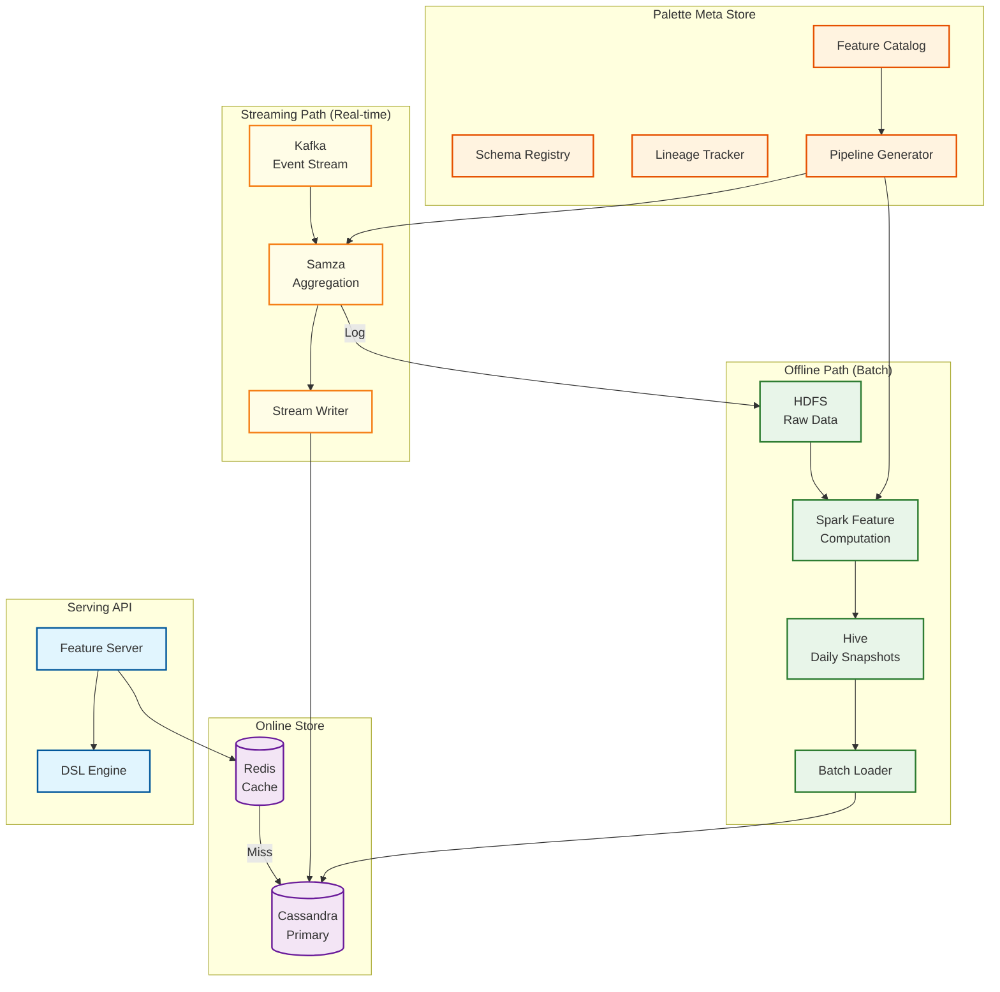
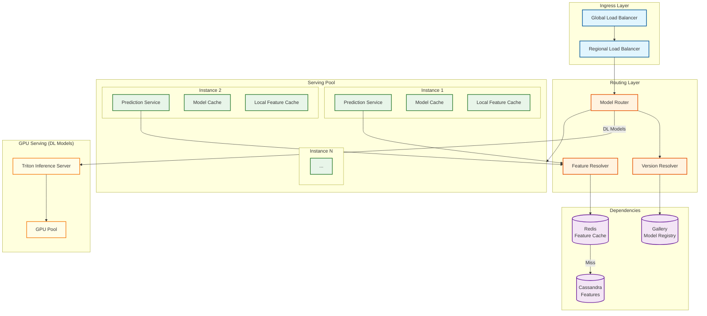
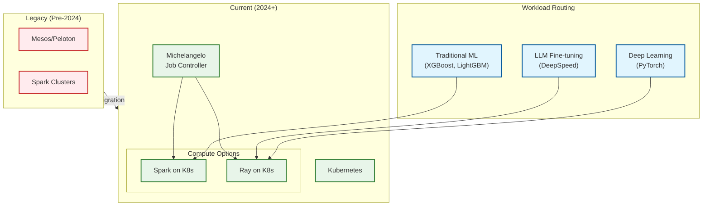

# Deep Dive & Bottlenecks

## Critical Component 1: Palette Feature Store

### Why Critical

The feature store is the **most important component** in Michelangelo because:
1. **Training-Serving Consistency:** Features used during training must match serving exactly
2. **Latency on Critical Path:** Every prediction requires feature lookups
3. **Scale Impact:** 20,000+ features serving 10M predictions/second
4. **Cost Multiplier:** Feature computation runs continuously (batch + streaming)

### Internal Architecture



### Dual-Store Design Details

| Aspect | Offline Store (Hive) | Online Store (Cassandra) |
|--------|---------------------|--------------------------|
| **Purpose** | Training data, historical analysis | Real-time serving |
| **Storage Model** | Columnar (Parquet) | Wide-column KV |
| **Update Frequency** | Daily snapshots | Real-time streaming |
| **Query Pattern** | Full scans, joins | Point lookups by key |
| **Latency** | Seconds to minutes | < 5ms P95 |
| **Consistency** | Strong (immutable snapshots) | Eventual (tunable) |
| **Retention** | Years | Days to weeks (TTL) |

### Cassandra Schema Design

```
-- Feature table per feature group
CREATE TABLE palette_rideshare.driver_features (
    driver_id TEXT,
    feature_timestamp TIMESTAMP,

    -- Features
    trip_count_7d INT,
    rating_avg FLOAT,
    acceptance_rate FLOAT,
    cancellation_rate FLOAT,
    avg_trip_distance FLOAT,

    -- Metadata
    updated_at TIMESTAMP,

    PRIMARY KEY ((driver_id), feature_timestamp)
) WITH CLUSTERING ORDER BY (feature_timestamp DESC)
  AND default_time_to_live = 604800;  -- 7 days TTL

-- Optimized for: "Get latest features for driver_id"
-- Query: SELECT * FROM driver_features WHERE driver_id = ? LIMIT 1
```

### Failure Modes & Handling

| Failure Mode | Impact | Mitigation |
|--------------|--------|------------|
| **Cassandra node down** | Increased latency, potential timeouts | Multi-DC replication, LOCAL_QUORUM reads |
| **Streaming pipeline lag** | Stale features in online store | Alert on lag > SLA, fallback to batch values |
| **Batch pipeline failure** | No fresh training data | Retry with backoff, use previous snapshot |
| **Feature schema change** | Incompatible features | Schema versioning, backwards compatibility |
| **Hot partition** | Degraded latency for popular entities | Virtual partitioning, caching |

---

## Critical Component 2: Model Serving at 10M QPS

### Why Critical

The prediction service handles all real-time ML inference for Uber's core functions:
1. **User-Facing Latency:** Directly impacts rider/driver experience
2. **Business Critical:** ETA, pricing, matching are Tier 1
3. **Scale:** 10M predictions/second at peak
4. **Cost:** Largest compute footprint in the platform

### Internal Architecture



### Virtual Model Sharding Details

**Problem:** 5,000+ models cannot each have dedicated servers.

**Solution:** Multiple models per prediction service instance with intelligent placement.

```
PLACEMENT STRATEGY:

1. MODEL GROUPING
   - Group models by similar memory footprint
   - Co-locate models with similar request patterns
   - Separate Tier 1 from lower tiers

2. INSTANCE SIZING
   - Large instances: 10-50 models (high memory)
   - Medium instances: 5-20 models
   - GPU instances: 1-5 DL models

3. LOADING POLICIES
   - EAGER: Tier 1 models loaded at startup
   - LAZY: Tier 3-4 models loaded on first request
   - PREEMPTIVE: Load based on predicted traffic

4. EVICTION POLICY
   - LRU within tier
   - Never evict Tier 1 during peak
   - Grace period before eviction (5 min)
```

### Latency Breakdown

| Stage | P50 | P95 | P99 | Optimization |
|-------|-----|-----|-----|--------------|
| Request parsing | 0.1ms | 0.2ms | 0.5ms | Pre-compiled parsers |
| Model routing | 0.1ms | 0.3ms | 0.5ms | Cached routing table |
| Feature lookup (cache hit) | 0.5ms | 1ms | 2ms | Local + Redis cache |
| Feature lookup (cache miss) | 2ms | 5ms | 10ms | Cassandra optimization |
| Feature transformation | 0.2ms | 0.5ms | 1ms | Pre-compiled DSL |
| Model inference | 1ms | 2ms | 5ms | Optimized runtimes |
| Response serialization | 0.1ms | 0.2ms | 0.5ms | Protocol buffers |
| **Total (cache hit)** | **2ms** | **4ms** | **8ms** | - |
| **Total (cache miss)** | **4ms** | **8ms** | **15ms** | - |

### Failure Modes & Handling

| Failure Mode | Impact | Mitigation |
|--------------|--------|------------|
| **Model loading failure** | Cannot serve new model version | Rollback to previous version, alert |
| **Feature lookup timeout** | Degraded predictions | Use default features, circuit breaker |
| **Instance crash** | Temporary capacity loss | Health checks, auto-scaling, model redistribution |
| **Memory exhaustion** | OOM kills | Memory limits, eviction policies |
| **Model version mismatch** | Inconsistent predictions | Atomic alias updates, version pinning |

---

## Critical Component 3: Distributed Training with Ray/Spark

### Why Critical

Training infrastructure enables the creation of all 5,000+ models:
1. **Iteration Speed:** Faster training = faster model improvements
2. **Resource Cost:** GPUs are expensive; utilization matters
3. **Reproducibility:** Training must be deterministic and auditable
4. **Scale:** Some models require billions of training samples

### Architecture Evolution



### Job Controller Design

The Michelangelo Job Controller federates training jobs across multiple Kubernetes clusters:

```
JOB CONTROLLER WORKFLOW:

1. JOB SUBMISSION
   - Validate job configuration
   - Resolve feature and data dependencies
   - Estimate resource requirements

2. CLUSTER SELECTION
   cluster = SelectCluster(job)
   CRITERIA:
   - Available capacity (CPU, GPU, memory)
   - Data locality (prefer cluster near data)
   - Job priority (Tier 1 gets priority)
   - Cost optimization (spot instances for Tier 3-4)

3. JOB CREATION
   IF job.framework == SPARK:
       CreateSparkApplication(job, cluster)
   ELSE IF job.framework == RAY:
       CreateRayJob(job, cluster)

4. MONITORING
   WHILE job.status != COMPLETED:
       - Track progress metrics
       - Log to Gallery
       - Handle failures (retry, checkpoint restore)

5. COMPLETION
   - Archive logs
   - Register model artifacts
   - Clean up resources
```

### Checkpointing Strategy

```
CHECKPOINT STRATEGY:

1. FREQUENCY DECISION
   checkpoint_interval = MAX(
       MIN_INTERVAL,                    // 10 minutes minimum
       training_time_estimate * 0.1     // 10% of total time
   )

2. CHECKPOINT CONTENTS
   checkpoint = {
       model_state: serialize(model.parameters),
       optimizer_state: serialize(optimizer.state),
       training_state: {
           epoch: current_epoch,
           step: global_step,
           best_metric: best_validation_metric
       },
       random_state: {
           numpy: np.random.get_state(),
           torch: torch.get_rng_state(),
           python: random.getstate()
       }
   }

3. STORAGE
   - Write to distributed storage (HDFS/Object Store)
   - Keep last N checkpoints (default: 3)
   - Replicate across availability zones

4. RECOVERY
   ON job_restart:
       latest_checkpoint = FindLatestCheckpoint(job_id)
       IF latest_checkpoint:
           RestoreFromCheckpoint(latest_checkpoint)
           Log.info("Resumed from step {step}")
       ELSE:
           StartFromScratch()
```

### Failure Modes & Handling

| Failure Mode | Impact | Mitigation |
|--------------|--------|------------|
| **Node preemption** | Training interruption | Checkpointing, spot instance handling |
| **OOM during training** | Job failure | Memory profiling, gradient checkpointing |
| **Data pipeline failure** | Blocked training | Cached datasets, pipeline retries |
| **Straggler workers** | Slow distributed training | Elastic scaling, worker replacement |
| **Checkpoint corruption** | Lost progress | Multiple checkpoint copies, validation |

---

## Bottleneck Analysis

### Bottleneck 1: Feature Store Cassandra Latency

**Symptoms:**
- P99 latency spikes above 20ms
- Increased prediction timeouts
- Feature lookup errors

**Root Causes:**

| Cause | Detection | Mitigation |
|-------|-----------|------------|
| Hot partitions | Uneven read distribution | Virtual partitioning, better partition keys |
| Compaction storms | High disk I/O during compaction | Off-peak compaction scheduling |
| GC pauses | JVM GC metrics spike | Tune heap size, use G1GC |
| Cross-DC reads | Elevated latency from remote DC | LOCAL_QUORUM consistency |
| Large rows | Slow reads for wide rows | Column TTLs, row splitting |

**Mitigation Strategy:**

```
LATENCY OPTIMIZATION CHECKLIST:

1. CACHING LAYER
   - L1: In-process cache (100ms TTL)
   - L2: Redis cluster (5 min TTL)
   - Cache hit ratio target: > 95%

2. QUERY OPTIMIZATION
   - Prepared statements for all queries
   - Token-aware routing
   - Speculative execution for retries

3. DATA MODEL
   - Partition size < 100MB
   - Avoid wide partitions (> 100K columns)
   - TTL to prevent unbounded growth

4. CLUSTER TUNING
   - Compaction: LeveledCompactionStrategy
   - Read repair: 0% (handled by anti-entropy)
   - Compression: LZ4 for speed
```

### Bottleneck 2: Model Loading Latency

**Symptoms:**
- Cold start latency > 30 seconds
- Memory pressure during deployment
- Request queuing during model updates

**Root Causes:**

| Cause | Detection | Mitigation |
|-------|-----------|------------|
| Large model artifacts | Download time dominates | CDN caching, pre-warming |
| Slow deserialization | CPU spike during load | Optimized serialization formats |
| Framework initialization | One-time setup cost | Lazy initialization, warm pools |
| Memory fragmentation | Allocation failures | Memory pools, defragmentation |

**Mitigation Strategy:**

```
MODEL LOADING OPTIMIZATION:

1. PRE-WARMING
   - Load Tier 1 models at instance startup
   - Pre-fetch models based on traffic prediction
   - Shadow loading during low-traffic periods

2. ARTIFACT OPTIMIZATION
   - Model quantization (FP32 -> FP16/INT8)
   - Model pruning for smaller size
   - Artifact compression with fast decompression

3. LOADING PARALLELISM
   - Parallel download + load for multiple models
   - Async loading with request queuing
   - Progressive loading (load hot paths first)

4. MEMORY MANAGEMENT
   - Memory pools for model allocations
   - Shared memory for common model components
   - Memory-mapped model files
```

### Bottleneck 3: Training Job Scheduling

**Symptoms:**
- Long queue times for training jobs
- GPU underutilization
- Priority inversion (Tier 4 blocking Tier 1)

**Root Causes:**

| Cause | Detection | Mitigation |
|-------|-----------|------------|
| Resource fragmentation | Small gaps unusable | Bin packing algorithms |
| Priority queue starvation | Low priority jobs never run | Fair share scheduling |
| Gang scheduling failures | Partial allocation timeouts | Elastic training, backfill |
| Data locality issues | Cross-DC data transfer | Data-aware scheduling |

**Mitigation Strategy:**

```
SCHEDULING OPTIMIZATION:

1. PRIORITY QUEUES
   - Queue per tier with weight ratios
   - Tier 1: 50%, Tier 2: 30%, Tier 3: 15%, Tier 4: 5%
   - Preemption allowed for Tier 1

2. RESOURCE PACKING
   - First-fit decreasing bin packing
   - Consider CPU, GPU, memory together
   - Reserve headroom for Tier 1 bursts

3. ELASTIC TRAINING
   - Allow jobs to start with partial resources
   - Scale up when resources available
   - Checkpoint before scale down

4. SPOT INSTANCE STRATEGY
   - Tier 3-4 jobs on spot instances
   - Automatic checkpoint on preemption notice
   - Fallback to on-demand for Tier 1-2
```

---

## Concurrency & Race Conditions

### Race Condition 1: Model Alias Update

**Scenario:** Updating model alias while predictions are in-flight.

```
PROBLEM:
    T1: Request arrives, resolves alias "production" -> v5
    T2: Alias updated "production" -> v6
    T3: T1 completes prediction with v5 (stale)

SOLUTION: Read-Your-Writes for Deployments
    1. Alias updates are atomic (single key update)
    2. Prediction service caches alias resolution (short TTL)
    3. Accept brief inconsistency window (< cache TTL)
    4. Critical updates trigger cache invalidation

IMPLEMENTATION:
    UpdateAlias(model_id, alias, new_version):
        // Atomic update in Gallery
        Gallery.atomicUpdate(alias_key, new_version)

        // Broadcast invalidation
        CacheInvalidator.broadcast(alias_key)

        // Wait for propagation (optional for critical updates)
        IF critical:
            WaitForPropagation(alias_key, timeout=5s)
```

### Race Condition 2: Feature Update During Prediction

**Scenario:** Streaming feature update arrives during prediction.

```
PROBLEM:
    T1: Prediction request for entity E starts
    T2: Feature F for entity E updated (streaming)
    T3: Prediction reads feature F (which version?)

SOLUTION: Snapshot Isolation
    1. Prediction reads are point-in-time snapshots
    2. Cassandra provides read-your-writes within session
    3. Accept eventual consistency for features (by design)

IMPLEMENTATION:
    GetFeaturesForPrediction(entity_id, features):
        // Single read timestamp for all features
        read_timestamp = Now()

        // Batch read with consistent timestamp
        result = Cassandra.batchRead(
            entity_id,
            features,
            timestamp=read_timestamp,
            consistency=LOCAL_QUORUM
        )

        RETURN result
```

### Race Condition 3: Concurrent Model Deployments

**Scenario:** Two deployments for same model trigger simultaneously.

```
PROBLEM:
    T1: Deploy v6 started
    T2: Deploy v7 started (before v6 complete)
    T3: Instances have mixed v6/v7 (inconsistent)

SOLUTION: Deployment Locking
    1. Acquire distributed lock per model before deployment
    2. Queue subsequent deployments
    3. Deployment is atomic (all-or-nothing)

IMPLEMENTATION:
    DeployModel(model_id, version):
        lock_key = "deploy_lock:{model_id}"

        // Acquire exclusive lock
        IF NOT DistributedLock.acquire(lock_key, timeout=5m):
            THROW DeploymentInProgressException

        TRY:
            // Check for conflicting deployment
            current_deployment = GetActiveDeployment(model_id)
            IF current_deployment AND current_deployment.status == IN_PROGRESS:
                THROW ConflictException

            // Execute deployment
            ExecuteDeployment(model_id, version)
        FINALLY:
            DistributedLock.release(lock_key)
```

---

## Performance Tuning Recommendations

### Feature Store Tuning

| Parameter | Recommended Value | Rationale |
|-----------|-------------------|-----------|
| Cassandra read consistency | LOCAL_QUORUM | Balance latency vs consistency |
| Redis cache TTL | 300 seconds | Balance freshness vs hit rate |
| Local cache size | 10,000 entries | Fit hot features in memory |
| Batch size for bulk reads | 100 features | Amortize round-trip overhead |

### Serving Tuning

| Parameter | Recommended Value | Rationale |
|-----------|-------------------|-----------|
| Thread pool size | 2 * CPU cores | Maximize throughput |
| Connection pool (Cassandra) | 50 per instance | Handle burst without creating connections |
| Request timeout | 100ms | Fast fail for SLA |
| Model cache size | 80% of heap | Maximize model residence |

### Training Tuning

| Parameter | Recommended Value | Rationale |
|-----------|-------------------|-----------|
| Checkpoint interval | 15 minutes | Balance recovery vs overhead |
| Worker count | Data partitions / 4 | Good parallelism without overhead |
| Batch size | Largest fitting in memory | Maximize GPU utilization |
| Learning rate warmup | 1000 steps | Stable training start |
