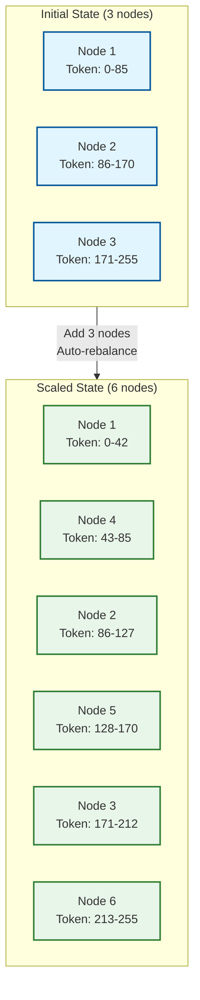
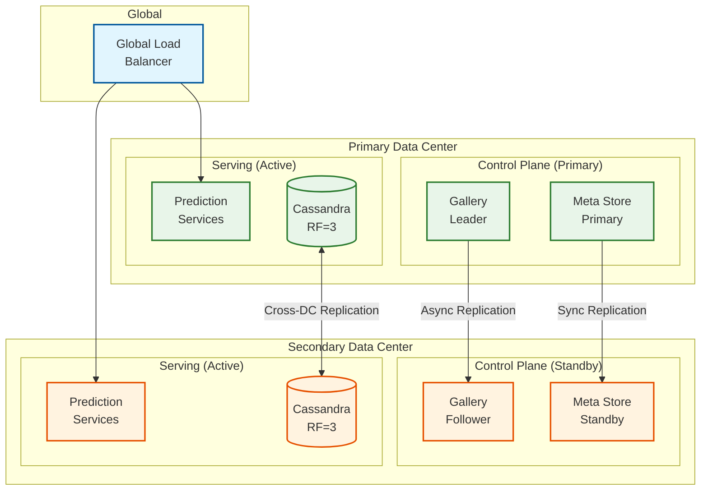
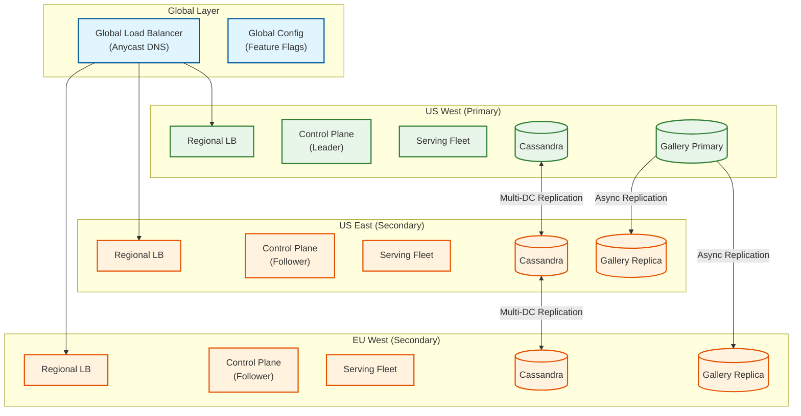

# Scalability & Reliability

## Scalability Strategy

### Horizontal vs Vertical Scaling

| Component | Scaling Approach | Rationale |
|-----------|-----------------|-----------|
| **Prediction Service** | Horizontal | Stateless; add instances for more QPS |
| **Feature Store (Cassandra)** | Horizontal | Add nodes; data auto-rebalances |
| **Feature Store (Redis)** | Horizontal | Redis Cluster with sharding |
| **Training Clusters** | Horizontal | Add nodes to Spark/Ray clusters |
| **Control Plane** | Vertical + Horizontal | Scale up for latency; out for throughput |
| **Kafka** | Horizontal | Add partitions and brokers |

### Auto-Scaling Configuration

#### Prediction Service Auto-Scaling

```
SCALING POLICY: Prediction Service

METRICS:
    - qps_per_instance: Current requests per second per instance
    - cpu_utilization: Average CPU usage
    - memory_utilization: Average memory usage
    - latency_p95: 95th percentile response time

SCALE OUT TRIGGERS:
    IF qps_per_instance > 40000 FOR 2 minutes:
        scale_out(instances * 1.5)

    IF cpu_utilization > 70% FOR 5 minutes:
        scale_out(instances * 1.2)

    IF latency_p95 > 8ms FOR 3 minutes:
        scale_out(instances * 1.3)

SCALE IN TRIGGERS:
    IF qps_per_instance < 20000 FOR 10 minutes:
        scale_in(instances * 0.8)

    IF cpu_utilization < 30% FOR 15 minutes:
        scale_in(instances * 0.7)

CONSTRAINTS:
    min_instances: 10 (per model tier)
    max_instances: 1000
    cooldown_period: 5 minutes
    scale_increment: At least 2 instances

TIER-SPECIFIC OVERRIDES:
    Tier 1:
        - min_instances: 50
        - scale_out_threshold_qps: 30000 (more aggressive)
        - cooldown_period: 3 minutes
    Tier 4:
        - min_instances: 2
        - scale_out_threshold_qps: 50000 (less aggressive)
```

#### Training Cluster Auto-Scaling

```
SCALING POLICY: Training Cluster

METRICS:
    - queue_depth: Pending training jobs
    - gpu_utilization: Cluster-wide GPU usage
    - queue_wait_time_p95: 95th percentile wait time

SCALE OUT TRIGGERS:
    IF queue_depth > 100 AND queue_wait_time_p95 > 30 minutes:
        add_nodes(min(queue_depth / 10, 50))

    IF gpu_utilization > 85% FOR 30 minutes:
        add_nodes(current_nodes * 0.2)

SCALE IN TRIGGERS:
    IF queue_depth < 10 AND gpu_utilization < 40% FOR 2 hours:
        remove_nodes(current_nodes * 0.3)

CONSTRAINTS:
    min_nodes: 20 (base capacity)
    max_nodes: 500
    scale_down_delay: 30 minutes (avoid thrashing)
    prefer_spot: true (for Tier 3-4 jobs)
```

### Database Scaling Strategy

#### Cassandra Feature Store Scaling



**Scaling Triggers:**
| Metric | Threshold | Action |
|--------|-----------|--------|
| Read latency P99 | > 15ms sustained | Add nodes |
| Disk utilization | > 70% | Add nodes or increase disk |
| CPU utilization | > 60% sustained | Add nodes |
| Compaction backlog | > 100 SSTables | Add nodes |

**Scaling Procedure:**
1. Add new nodes to cluster (automatic token assignment)
2. Wait for streaming to complete (data redistribution)
3. Verify read latency returns to normal
4. Decommission old nodes if replacing

### Caching Layers

```
CACHING HIERARCHY:

Level 1: In-Process Cache (Caffeine)
    - Capacity: 10,000 entries per instance
    - TTL: 60 seconds
    - Eviction: LRU with size-based limit
    - Hit rate target: 40%

Level 2: Distributed Cache (Redis Cluster)
    - Capacity: 500 GB total
    - TTL: 300 seconds
    - Replication: 1 replica per shard
    - Hit rate target: 60%

Level 3: Primary Store (Cassandra)
    - Capacity: Unlimited (scaled horizontally)
    - TTL: Per-feature configuration
    - Always authoritative source

CACHE WARMING STRATEGY:
    1. On instance startup:
       - Load top 1000 hot features from Redis
       - Pre-populate L1 cache

    2. Background refresh:
       - Track feature access patterns
       - Proactively refresh approaching-expiry entries
       - Prefetch correlated features
```

### Hot Spot Mitigation

**Problem:** Certain entities (popular drivers, restaurants) cause hot partitions.

**Solutions:**

```
HOT SPOT MITIGATION STRATEGIES:

1. VIRTUAL PARTITIONING
   // Instead of: partition_key = entity_id
   // Use: partition_key = entity_id + hash(entity_id) % N

   GetPartitionKey(entity_id):
       virtual_partition = Hash(entity_id) % 10
       RETURN "{entity_id}:{virtual_partition}"

   ReadFeatures(entity_id, features):
       // Read from all virtual partitions, merge results
       results = []
       FOR i IN 0..9:
           partition_key = "{entity_id}:{i}"
           results.append(Cassandra.read(partition_key))
       RETURN Merge(results)

2. CACHING HOT ENTITIES
   // Aggressive caching for entities with high QPS
   hot_entity_threshold = 1000 QPS

   IF EntityQPS(entity_id) > hot_entity_threshold:
       cache_ttl = 600 seconds  // 10 minutes
   ELSE:
       cache_ttl = 60 seconds

3. READ REPLICAS FOR HOT FEATURES
   // Replicate hot feature groups to dedicated read replicas
   hot_feature_groups = ["driver_features", "restaurant_features"]

   FOR fg IN hot_feature_groups:
       CreateReadReplicas(fg, replica_count=3)
       RouteReads(fg, replicas, load_balanced=true)
```

---

## Reliability & Fault Tolerance

### Single Points of Failure (SPOF) Analysis

| Component | SPOF Risk | Mitigation |
|-----------|-----------|------------|
| **Gallery (Model Registry)** | High | Multi-AZ deployment, read replicas |
| **Palette Meta Store** | High | Multi-AZ PostgreSQL, standby |
| **Prediction Load Balancer** | Medium | Redundant LBs, DNS failover |
| **Kafka Cluster** | Medium | Multi-broker, replication factor 3 |
| **Cassandra** | Low | Native multi-node replication |
| **Training Scheduler** | Medium | Leader election, standby |

### Redundancy Strategy



### Failover Mechanisms

#### Prediction Service Failover

```
FAILOVER STRATEGY: Prediction Service

1. HEALTH CHECK
   health_check:
       endpoint: /health
       interval: 5 seconds
       timeout: 2 seconds
       unhealthy_threshold: 3 consecutive failures
       healthy_threshold: 2 consecutive successes

2. INSTANCE FAILOVER
   ON instance_unhealthy(instance):
       // Remove from load balancer
       LoadBalancer.remove(instance)

       // Redistribute models
       models = instance.loaded_models
       FOR model IN models:
           healthy_instances = GetHealthyInstances(model)
           IF healthy_instances.count < min_replicas:
               ScheduleModelLoad(model, SelectNewInstance())

       // Alert if capacity below threshold
       IF cluster_capacity < 80%:
           Alert("Prediction cluster capacity low")

3. REGIONAL FAILOVER
   ON region_unhealthy(region):
       // Update DNS to route away
       DNS.updateWeight(region, weight=0)

       // Notify dependent services
       Broadcast("REGION_FAILOVER", region)

       // Scale up healthy regions
       FOR healthy_region IN GetHealthyRegions():
           ScaleUp(healthy_region, factor=1.5)
```

#### Feature Store Failover

```
FAILOVER STRATEGY: Feature Store

1. CASSANDRA NODE FAILURE
   // Handled automatically by Cassandra
   // Reads served by replicas (RF=3)
   // Hints stored for failed node
   // Repairs run on recovery

2. CASSANDRA DC FAILURE
   ON dc_failure(dc):
       // Automatically handled by LOCAL_QUORUM
       // Reads/writes continue in surviving DC
       // Async replication catches up on recovery

3. REDIS CACHE FAILURE
   ON redis_failure(node):
       // Failover to replica (Redis Sentinel/Cluster)
       // Increased Cassandra load during transition
       // Alert for capacity planning

4. COMPLETE CACHE FAILURE
   ON cache_cluster_failure():
       // Circuit breaker engages
       // Direct reads to Cassandra
       // Increased latency (P95: 10ms -> 15ms)
       // Alert: Critical
```

### Circuit Breaker Patterns

```
CIRCUIT BREAKER: Feature Lookup

STATES:
    CLOSED: Normal operation, all requests pass through
    OPEN: Failure threshold exceeded, fast-fail all requests
    HALF_OPEN: Testing if service recovered

CONFIGURATION:
    failure_threshold: 50% of requests in window
    window_size: 100 requests
    timeout: 30 seconds (OPEN -> HALF_OPEN)
    half_open_requests: 10 (test requests)

IMPLEMENTATION:
    CLASS FeatureLookupCircuitBreaker:
        state = CLOSED
        failure_count = 0
        success_count = 0
        last_failure_time = null

        FUNCTION execute(request):
            IF state == OPEN:
                IF Now() - last_failure_time > timeout:
                    state = HALF_OPEN
                ELSE:
                    RETURN default_features(request)

            TRY:
                result = DoFeatureLookup(request)
                OnSuccess()
                RETURN result
            CATCH TimeoutException, ServiceUnavailableException:
                OnFailure()
                RETURN default_features(request)

        FUNCTION OnSuccess():
            IF state == HALF_OPEN:
                success_count++
                IF success_count >= half_open_requests:
                    state = CLOSED
                    ResetCounters()

        FUNCTION OnFailure():
            failure_count++
            last_failure_time = Now()
            IF FailureRate() > failure_threshold:
                state = OPEN
                Alert("Circuit breaker opened for feature lookup")
```

### Retry Strategies

```
RETRY STRATEGY: Exponential Backoff with Jitter

FUNCTION RetryWithBackoff(operation, max_retries=3):
    base_delay = 100ms
    max_delay = 5000ms

    FOR attempt IN 1..max_retries:
        TRY:
            RETURN operation()
        CATCH RetryableException as e:
            IF attempt == max_retries:
                THROW e

            // Exponential backoff with jitter
            delay = MIN(base_delay * (2 ^ attempt), max_delay)
            jitter = Random(0, delay * 0.1)
            actual_delay = delay + jitter

            Log.warn("Retry {attempt}/{max_retries}, waiting {actual_delay}ms")
            Sleep(actual_delay)

RETRYABLE EXCEPTIONS:
    - TimeoutException
    - TemporaryUnavailableException
    - RateLimitedException

NON-RETRYABLE EXCEPTIONS:
    - InvalidRequestException
    - AuthenticationException
    - NotFoundException
```

### Graceful Degradation

```
DEGRADATION LEVELS:

LEVEL 0: NORMAL
    - All features enabled
    - Full model capabilities
    - Real-time feature updates

LEVEL 1: FEATURE DEGRADATION
    Trigger: Feature store latency > 15ms P95
    Actions:
        - Disable non-critical features
        - Use cached/stale features
        - Skip feature transformations

LEVEL 2: MODEL DEGRADATION
    Trigger: Prediction latency > 20ms P95
    Actions:
        - Route to simpler fallback models
        - Reduce model ensemble size
        - Skip secondary model calls

LEVEL 3: SERVICE DEGRADATION
    Trigger: Error rate > 1%
    Actions:
        - Return cached predictions
        - Use rule-based fallbacks
        - Reject non-critical traffic

LEVEL 4: EMERGENCY
    Trigger: Error rate > 5% OR availability < 99%
    Actions:
        - Static fallback responses
        - Shed load aggressively
        - Page on-call immediately
```

### Bulkhead Pattern

```
BULKHEAD CONFIGURATION:

1. THREAD POOL ISOLATION
   pools:
       tier1_predictions:
           max_threads: 100
           queue_size: 500
           rejection_policy: CALLER_RUNS

       tier2_predictions:
           max_threads: 50
           queue_size: 200
           rejection_policy: ABORT

       feature_lookups:
           max_threads: 200
           queue_size: 1000
           rejection_policy: ABORT

       training_api:
           max_threads: 20
           queue_size: 100
           rejection_policy: ABORT

2. CONNECTION POOL ISOLATION
   cassandra_pools:
       feature_reads: 100 connections
       feature_writes: 50 connections

   redis_pools:
       cache_reads: 200 connections
       cache_writes: 100 connections

3. INSTANCE ISOLATION
   // Tier 1 models on dedicated instances
   tier1_instances: 30% of fleet (dedicated)
   tier2_instances: 40% of fleet (shared)
   tier3_4_instances: 30% of fleet (shared, spot)
```

---

## Disaster Recovery

### RTO & RPO Targets

| Component | RPO | RTO | Strategy |
|-----------|-----|-----|----------|
| **Model Registry** | 0 (synchronous) | 5 minutes | Active-passive with sync replication |
| **Feature Store (Online)** | 5 minutes | 10 minutes | Multi-DC active-active |
| **Feature Store (Offline)** | 1 hour | 4 hours | Cross-region snapshots |
| **Training Checkpoints** | 15 minutes | 30 minutes | Replicated object storage |
| **Prediction Service** | N/A (stateless) | 2 minutes | Auto-scaling in surviving region |

### Backup Strategy

```
BACKUP SCHEDULE:

1. MODEL REGISTRY (Gallery)
   - Continuous: Transaction log shipping
   - Hourly: Incremental backup
   - Daily: Full backup
   - Retention: 90 days

2. FEATURE METADATA (Palette Meta Store)
   - Continuous: WAL archiving
   - Hourly: Incremental backup
   - Daily: Full backup
   - Retention: 30 days

3. FEATURE DATA (Cassandra)
   - Hourly: Incremental snapshots
   - Daily: Full snapshots
   - Weekly: Cross-region copy
   - Retention: 7 days (online), 1 year (archived)

4. MODEL ARTIFACTS
   - On creation: Immediate replication to 3 regions
   - Daily: Integrity verification
   - Retention: Forever (versioned)

5. TRAINING DATA
   - Daily: Incremental backup to cold storage
   - Weekly: Full backup
   - Retention: 1 year (hot), 7 years (cold)
```

### Multi-Region Architecture



### DR Runbook

```
DISASTER RECOVERY RUNBOOK: Regional Failure

DETECTION (Automated):
    - Health check failures > 50% in region
    - Latency P99 > 100ms for 5 minutes
    - Error rate > 5% for 3 minutes

AUTOMATED RESPONSE:
    1. DNS failover (immediate)
       - Remove failed region from DNS
       - Increase weights for healthy regions

    2. Capacity scaling (within 5 minutes)
       - Scale up healthy regions by 50%
       - Priority to Tier 1 model capacity

    3. Alerting
       - Page on-call
       - Notify stakeholders

MANUAL RESPONSE:
    1. Assess impact (within 15 minutes)
       - Identify affected models
       - Determine data loss (if any)

    2. Validate failover (within 30 minutes)
       - Confirm traffic shifted
       - Verify prediction accuracy
       - Check feature freshness

    3. Recovery (within 4 hours)
       - Restore failed region
       - Resync data from healthy region
       - Gradual traffic shift back

POST-INCIDENT:
    - Incident report within 24 hours
    - Root cause analysis within 72 hours
    - Remediation plan within 1 week
```

---

## Capacity Planning

### Growth Projections

| Metric | Current | Year 1 | Year 3 | Year 5 |
|--------|---------|--------|--------|--------|
| Predictions/second | 10M | 15M | 30M | 50M |
| Production models | 5,000 | 8,000 | 15,000 | 25,000 |
| Features in store | 20,000 | 35,000 | 60,000 | 100,000 |
| Training jobs/month | 20,000 | 35,000 | 60,000 | 100,000 |
| LLM use cases | 60 | 200 | 500 | 1,000 |

### Infrastructure Scaling Plan

| Component | Current Capacity | Year 1 | Year 3 |
|-----------|-----------------|--------|--------|
| Prediction servers | 200 | 300 | 600 |
| Cassandra nodes | 50 | 80 | 150 |
| GPU nodes (training) | 500 | 800 | 1,500 |
| Storage (total) | 1 PB | 2 PB | 5 PB |
