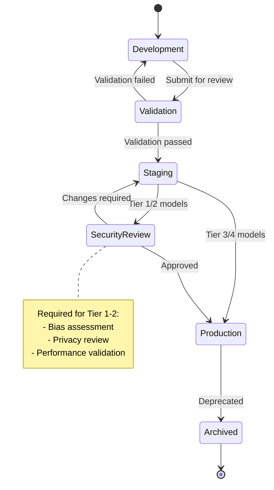

# Security & Compliance

## Authentication & Authorization

### Authentication Mechanisms

| Component | Auth Method | Details |
|-----------|-------------|---------|
| **MA Studio UI** | SSO (OIDC) | Corporate identity provider integration |
| **SDK/CLI** | API Keys + OAuth2 | Service accounts for automation |
| **Service-to-Service** | mTLS | Mutual TLS between internal services |
| **Prediction API** | API Keys | Per-service keys with rate limits |
| **Training Jobs** | Service Identity | Kubernetes service accounts |

### Authorization Model

Michelangelo uses a **hybrid RBAC + ABAC** model:

```
AUTHORIZATION MODEL:

1. RBAC (Role-Based Access Control)
   Roles:
       - Platform Admin: Full system access
       - Project Owner: Full project access, member management
       - ML Engineer: Model training, deployment
       - Data Scientist: Experimentation, read access
       - Viewer: Read-only access

   Permissions Matrix:
   +------------------+-------+-------+--------+--------+--------+
   | Operation        | Admin | Owner | ML Eng | DS     | Viewer |
   +------------------+-------+-------+--------+--------+--------+
   | Create Project   | Yes   | No    | No     | No     | No     |
   | Manage Members   | Yes   | Yes   | No     | No     | No     |
   | Deploy Model     | Yes   | Yes   | Yes    | No     | No     |
   | Train Model      | Yes   | Yes   | Yes    | Yes    | No     |
   | View Metrics     | Yes   | Yes   | Yes    | Yes    | Yes    |
   | Access Features  | Yes   | Yes   | Yes    | Yes    | Yes    |
   +------------------+-------+-------+--------+--------+--------+

2. ABAC (Attribute-Based Access Control)
   Attributes:
       - project.tier: Tier 1-4
       - user.team: Team membership
       - resource.sensitivity: Public, Internal, Confidential
       - environment: Dev, Staging, Production

   Policy Examples:
       - "Only Tier 1 project owners can deploy to production"
       - "Only team members can access confidential features"
       - "Data scientists cannot modify Tier 1 model configs"

3. PROJECT-LEVEL ISOLATION
   Each project has:
       - Dedicated namespace in Kubernetes
       - Isolated feature group access
       - Separate resource quotas
       - Independent audit logs
```

### Token Management

```
TOKEN LIFECYCLE:

1. API KEY GENERATION
   - Generated via MA Studio or CLI
   - Scoped to specific project and permissions
   - Stored hashed in database
   - Prefix for easy identification: "mk_live_" or "mk_test_"

2. TOKEN REFRESH (OAuth2)
   - Access token TTL: 1 hour
   - Refresh token TTL: 30 days
   - Automatic rotation on use
   - Revocation on logout or security event

3. SERVICE ACCOUNT TOKENS
   - Kubernetes service account tokens for training jobs
   - Auto-rotated by Kubernetes
   - Bound to specific namespace

4. EMERGENCY REVOCATION
   ON security_incident:
       - Immediate revocation via API
       - Propagation to all edge caches (< 60 seconds)
       - Force re-authentication
```

---

## Data Security

### Encryption at Rest

| Data Type | Encryption | Key Management |
|-----------|------------|----------------|
| Model Artifacts | AES-256-GCM | Centralized KMS, per-project keys |
| Feature Data (Cassandra) | AES-256 | Cluster-level encryption |
| Training Data (HDFS) | AES-256 | HDFS Transparent Encryption |
| Metadata (PostgreSQL) | AES-256 | Database TDE |
| Secrets | AES-256-GCM | Dedicated secrets manager |

### Encryption in Transit

```
TLS CONFIGURATION:

1. EXTERNAL TRAFFIC
   - TLS 1.3 minimum
   - HSTS enabled
   - Certificate pinning for SDKs

2. INTERNAL TRAFFIC
   - mTLS for all service-to-service
   - Certificate rotation every 24 hours
   - Managed by service mesh

3. DATABASE CONNECTIONS
   - TLS required for all connections
   - Client certificate authentication

4. KAFKA
   - SASL_SSL for authentication + encryption
   - Per-topic ACLs
```

### PII Handling

```
PII PROTECTION FRAMEWORK:

1. DATA CLASSIFICATION
   Classes:
       - PUBLIC: Non-sensitive, can be logged
       - INTERNAL: Business data, limited logging
       - CONFIDENTIAL: PII, encrypted at rest, no logging
       - RESTRICTED: Highly sensitive (payment, identity)

2. FEATURE-LEVEL PII TAGGING
   FeatureDefinition:
       name: "user_email"
       pii_classification: CONFIDENTIAL
       allowed_uses: ["model_training"]
       prohibited_uses: ["logging", "debugging"]
       retention_days: 90
       anonymization: "hash_sha256"

3. ACCESS CONTROLS
   // Only approved models can access PII features
   IF feature.pii_classification >= CONFIDENTIAL:
       RequireApproval(model, feature)
       LogAccess(user, model, feature)

4. DATA MASKING
   // Production data masked in non-prod environments
   NonProdData:
       - Email: user***@domain.com
       - Phone: ***-***-1234
       - Name: J*** D***
       - Location: City level only
```

### Data Anonymization

```
ANONYMIZATION TECHNIQUES:

1. K-ANONYMITY FOR FEATURES
   // Ensure any record matches at least k others
   FeatureAnonymizer:
       min_k: 5
       quasi_identifiers: [age, zipcode, gender]
       generalization:
           age: round_to_10
           zipcode: truncate_to_3_digits

2. DIFFERENTIAL PRIVACY FOR AGGREGATES
   // Add noise to aggregate features
   DifferentialPrivacy:
       epsilon: 1.0
       delta: 1e-5
       mechanism: GAUSSIAN

3. TOKENIZATION FOR IDENTIFIERS
   // Replace identifiers with tokens
   Tokenizer:
       input: user_id
       output: tokenized_user_id
       salt: per_project_salt
       format_preserving: true

4. SYNTHETIC DATA FOR TESTING
   // Generate synthetic features for development
   SyntheticGenerator:
       source_distribution: production_stats
       pii_fields: RANDOMIZED
       correlations: PRESERVED
```

---

## Threat Model

### Top Attack Vectors

| # | Attack Vector | Severity | Likelihood | Risk |
|---|---------------|----------|------------|------|
| 1 | Model Poisoning | Critical | Medium | High |
| 2 | Feature Manipulation | Critical | Medium | High |
| 3 | Unauthorized Model Deployment | High | Low | Medium |
| 4 | Data Exfiltration via Models | High | Medium | High |
| 5 | Inference API Abuse | Medium | High | Medium |

### Detailed Threat Analysis

#### Threat 1: Model Poisoning

```
THREAT: Model Poisoning

DESCRIPTION:
    Attacker manipulates training data or process to create
    a model that behaves maliciously in production.

ATTACK SCENARIOS:
    1. Training data injection (backdoor triggers)
    2. Gradient manipulation during distributed training
    3. Model artifact tampering

IMPACT:
    - Incorrect predictions for targeted inputs
    - Financial loss (pricing, fraud)
    - Safety risks (ETA, matching)

MITIGATIONS:
    1. DATA VALIDATION
       - Schema enforcement on training data
       - Statistical anomaly detection
       - Data provenance tracking

    2. TRAINING INTEGRITY
       - Reproducible training environments
       - Checksum verification of dependencies
       - Isolated training containers

    3. MODEL VALIDATION
       - Automated validation suite before deployment
       - Shadow deployment comparison
       - Human review for Tier 1 models

    4. ARTIFACT PROTECTION
       - Signed model artifacts
       - Immutable artifact storage
       - Verification before serving
```

#### Threat 2: Feature Manipulation

```
THREAT: Feature Manipulation

DESCRIPTION:
    Attacker modifies feature values to influence predictions
    (e.g., fake driver ratings, manipulated locations).

ATTACK SCENARIOS:
    1. Direct feature store writes (compromised service)
    2. Event stream injection (Kafka)
    3. Source data manipulation

IMPACT:
    - Model evasion (fraud bypassing detection)
    - Unfair advantage (surge pricing manipulation)
    - Safety risks (fake safety scores)

MITIGATIONS:
    1. WRITE ACCESS CONTROLS
       - Strict ACLs on feature store writes
       - Only authorized pipelines can write
       - No direct write access for users

    2. INPUT VALIDATION
       - Range checks on feature values
       - Rate limiting on updates per entity
       - Anomaly detection on feature changes

    3. AUDIT LOGGING
       - Full audit trail of all feature updates
       - Alerting on suspicious patterns
       - Forensic investigation capability

    4. FEATURE SIGNING
       - Cryptographic signatures on feature updates
       - Verification of signature chain
       - Reject unsigned features
```

#### Threat 3: Data Exfiltration via Models

```
THREAT: Data Exfiltration

DESCRIPTION:
    Attacker extracts training data or sensitive information
    by querying the model (membership inference, model inversion).

ATTACK SCENARIOS:
    1. Membership inference (was X in training data?)
    2. Model inversion (reconstruct training samples)
    3. Model extraction (steal model weights)

IMPACT:
    - Privacy violations
    - Regulatory penalties (GDPR)
    - Competitive intelligence loss

MITIGATIONS:
    1. DIFFERENTIAL PRIVACY
       - DP-SGD during training
       - Noise injection in outputs
       - Privacy budget tracking

    2. OUTPUT PERTURBATION
       - Round predictions to reduce precision
       - Add calibrated noise
       - Limit prediction confidence exposure

    3. RATE LIMITING
       - Per-user query limits
       - Detection of systematic probing
       - Block suspicious query patterns

    4. MODEL ACCESS CONTROLS
       - Restrict raw model weight access
       - No model download for external users
       - Watermarking for leak detection
```

### DDoS Protection

```
DDOS PROTECTION LAYERS:

1. NETWORK LAYER (L3/L4)
   - Global anycast for distributed absorption
   - BGP-based traffic scrubbing
   - Automatic blackholing of attack sources

2. APPLICATION LAYER (L7)
   - Rate limiting per API key
   - Request validation and filtering
   - CAPTCHA for suspicious clients

3. PREDICTION API SPECIFIC
   - Model-level rate limits
   - Request complexity scoring
   - Slow client detection and blocking

RATE LIMITS:
    +---------------------+------------------+------------------+
    | Endpoint            | Per-Key Limit    | Global Limit     |
    +---------------------+------------------+------------------+
    | Predictions         | 10,000 QPS       | 10,000,000 QPS   |
    | Feature Lookups     | 50,000 QPS       | 5,000,000 QPS    |
    | Training Submission | 100 per hour     | 10,000 per hour  |
    | Model Registry      | 1,000 per minute | 100,000 per min  |
    +---------------------+------------------+------------------+
```

---

## Model Governance

### Project Tiering & Access Control

```
PROJECT TIERING GOVERNANCE:

TIER 1 (Critical):
    Requirements:
        - Executive sponsor sign-off
        - Security review completed
        - Disaster recovery plan approved
        - 24/7 on-call rotation established

    Controls:
        - Mandatory code review for all changes
        - Automated deployment gates
        - Shadow deployment required before production
        - Change freeze during peak hours

TIER 2 (High Impact):
    Requirements:
        - Team lead approval
        - Basic security review
        - Documented rollback procedure

    Controls:
        - Code review required
        - Automated testing gates
        - Canary deployment

TIER 3-4 (Standard/Experimental):
    Requirements:
        - Self-service with guardrails
        - Automated compliance checks

    Controls:
        - Automated testing
        - Resource limits enforced
```

### Model Approval Workflow



### Audit Trail

```
AUDIT LOGGING REQUIREMENTS:

1. MODEL LIFECYCLE EVENTS
   Logged events:
       - Model creation
       - Version registration
       - Stage transitions
       - Alias updates
       - Deployments
       - Deprecation

   Log schema:
       {
           event_type: "MODEL_DEPLOYED",
           timestamp: "2024-01-15T10:30:00Z",
           actor: "user@uber.com",
           resource: "models/eta_prediction/versions/6",
           action: "DEPLOY",
           details: {
               target_environment: "production",
               previous_version: 5,
               approval_ticket: "JIRA-1234"
           },
           source_ip: "10.0.1.50",
           user_agent: "michelangelo-sdk/2.0"
       }

2. DATA ACCESS EVENTS
   Logged events:
       - Feature group access
       - Training data reads
       - Model artifact downloads
       - PII feature access

3. SECURITY EVENTS
   Logged events:
       - Authentication failures
       - Authorization denials
       - Token revocations
       - Suspicious activity

4. RETENTION
   - Standard logs: 90 days hot, 2 years cold
   - Security logs: 1 year hot, 7 years cold
   - Compliance logs: 7 years (immutable)
```

---

## Compliance Considerations

### GDPR Compliance

| Requirement | Implementation |
|-------------|----------------|
| **Right to Access** | Export all features and predictions for a user |
| **Right to Erasure** | Delete user data from feature store and training sets |
| **Data Minimization** | Feature TTLs, purpose limitation in metadata |
| **Consent Management** | Feature-level consent flags |
| **Data Portability** | Standard export formats (JSON, CSV) |

### SOC 2 Compliance

| Control | Implementation |
|---------|----------------|
| **Access Control** | RBAC + ABAC, MFA for admin access |
| **Change Management** | Approval workflows, audit trails |
| **Risk Assessment** | Threat modeling, penetration testing |
| **Incident Response** | Documented procedures, regular drills |
| **Monitoring** | Continuous security monitoring, alerting |

### ML-Specific Compliance

```
ML GOVERNANCE FRAMEWORK:

1. MODEL CARDS
   Required documentation for each production model:
       - Model purpose and intended use
       - Training data description
       - Performance metrics by demographic
       - Known limitations
       - Ethical considerations

2. BIAS MONITORING
   Automated checks:
       - Demographic parity
       - Equalized odds
       - Disparate impact ratio

   Thresholds:
       - Alert: Ratio < 0.9
       - Block deployment: Ratio < 0.8

3. EXPLAINABILITY
   Requirements:
       - Feature importance available for all models
       - SHAP values for Tier 1 predictions
       - Audit trail for high-impact decisions

4. MODEL DRIFT DETECTION
   Continuous monitoring:
       - Input distribution drift (PSI > 0.2)
       - Output distribution drift
       - Performance degradation
       - Auto-retraining triggers
```

---

## GenAI Gateway Security (LLMOps)

### LLM-Specific Security Controls

```
GENAI GATEWAY SECURITY:

1. PROMPT INJECTION PREVENTION
   - Input sanitization
   - Prompt templating (user input isolated)
   - Output validation
   - Instruction hierarchy enforcement

2. CONTENT SAFETY
   - Pre-inference content filtering
   - Post-inference toxicity detection
   - PII detection and redaction
   - Copyright content blocking

3. RATE LIMITING (LLM-specific)
   - Token-based limits (not just request count)
   - Cost-based quotas per team
   - Concurrent request limits

4. AUDIT AND MONITORING
   - Full prompt/response logging (encrypted)
   - Token usage tracking
   - Cost attribution
   - Anomaly detection on usage patterns

5. MODEL ACCESS CONTROLS
   - Per-model authorization
   - Capability restrictions (no code execution)
   - Output length limits
```

### Provider Security

```
MULTI-PROVIDER SECURITY:

1. CREDENTIAL MANAGEMENT
   - Secrets manager for API keys
   - Automatic rotation
   - Provider-specific scoping

2. DATA RESIDENCY
   - Route requests based on data classification
   - EU data stays in EU providers
   - On-premise for restricted data

3. PROVIDER FAILOVER
   - Automatic failover to alternate providers
   - Consistent security policies across providers
   - Audit logging regardless of provider
```
