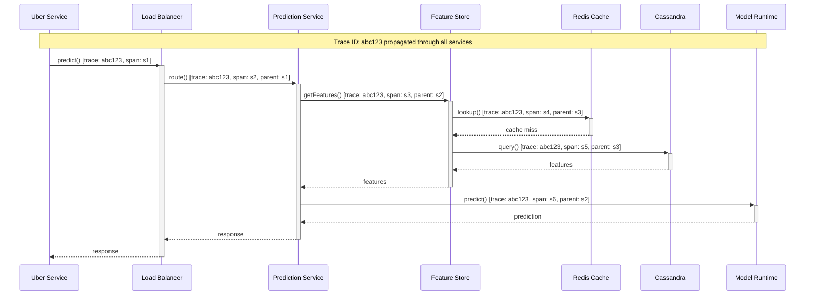
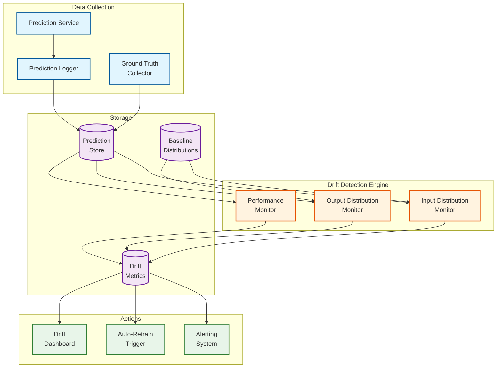

# Observability

## Metrics Strategy

### Key Metrics (USE/RED)

#### Prediction Service Metrics

| Category | Metric | Description | Alert Threshold |
|----------|--------|-------------|-----------------|
| **Rate** | `predictions_total` | Total predictions served | N/A (monitoring) |
| **Rate** | `predictions_per_model` | Predictions by model | N/A (monitoring) |
| **Errors** | `prediction_errors_total` | Failed predictions | > 0.1% of requests |
| **Duration** | `prediction_latency_seconds` | End-to-end latency | P95 > 10ms |
| **Utilization** | `model_memory_bytes` | Memory per model | > 80% of allocation |
| **Utilization** | `cpu_utilization` | CPU usage | > 70% sustained |
| **Saturation** | `request_queue_depth` | Pending requests | > 100 |

#### Feature Store Metrics

| Category | Metric | Description | Alert Threshold |
|----------|--------|-------------|-----------------|
| **Rate** | `feature_lookups_total` | Feature reads | N/A (monitoring) |
| **Errors** | `feature_lookup_errors` | Failed lookups | > 0.01% |
| **Duration** | `feature_lookup_latency` | Cassandra read latency | P95 > 5ms |
| **Duration** | `cache_hit_latency` | Redis cache latency | P95 > 1ms |
| **Utilization** | `cache_hit_ratio` | Cache effectiveness | < 90% |
| **Freshness** | `feature_staleness_seconds` | Time since update | > SLA per feature |

#### Training Metrics

| Category | Metric | Description | Alert Threshold |
|----------|--------|-------------|-----------------|
| **Rate** | `training_jobs_submitted` | Jobs submitted | N/A (monitoring) |
| **Errors** | `training_jobs_failed` | Failed jobs | > 5% |
| **Duration** | `training_job_duration` | Job completion time | > 2x median |
| **Utilization** | `gpu_utilization` | GPU usage | < 50% sustained |
| **Saturation** | `training_queue_depth` | Pending jobs | > 100 |
| **Saturation** | `queue_wait_time` | Time in queue | P95 > 30 min |

### Dashboard Design

```
DASHBOARD: Michelangelo Overview

+------------------------------------------------------------------+
|                     PREDICTION SERVICE                             |
+------------------------------------------------------------------+
| [QPS Graph]          | [Latency Heatmap]      | [Error Rate]     |
| Current: 8.5M/s      | P50: 3ms, P95: 8ms     | 0.02%           |
| Peak: 10.2M/s        | P99: 15ms              |                  |
+------------------------------------------------------------------+

+------------------------------------------------------------------+
|                     FEATURE STORE                                  |
+------------------------------------------------------------------+
| [Cache Hit Rate]     | [Cassandra Latency]    | [Freshness]      |
| 94.2%               | P95: 4ms               | All SLAs met     |
+------------------------------------------------------------------+

+------------------------------------------------------------------+
|                     TRAINING                                       |
+------------------------------------------------------------------+
| [Active Jobs]        | [Queue Depth]          | [GPU Utilization]|
| 234                  | 45 pending             | 78%              |
+------------------------------------------------------------------+

+------------------------------------------------------------------+
|                     MODEL HEALTH                                   |
+------------------------------------------------------------------+
| [Models in Prod]     | [Drift Alerts]         | [Stale Models]   |
| 5,234                | 12 warnings            | 3 critical       |
+------------------------------------------------------------------+
```

### Model Performance Metrics

```
MODEL-SPECIFIC METRICS:

1. ACCURACY METRICS
   - Classification: precision, recall, F1, AUC-ROC
   - Regression: RMSE, MAE, R²
   - Ranking: NDCG, MRR

2. DRIFT METRICS
   - PSI (Population Stability Index): Input distribution shift
   - CSI (Characteristic Stability Index): Output distribution shift
   - Performance degradation: Accuracy delta from baseline

3. BUSINESS METRICS
   - ETA models: Actual vs predicted correlation
   - Pricing models: Revenue impact
   - Fraud models: False positive/negative rates

4. OPERATIONAL METRICS
   - Inference latency per model
   - Memory footprint
   - Prediction volume
```

---

## Logging Strategy

### What to Log

| Component | Log Events | Level | Retention |
|-----------|------------|-------|-----------|
| **Prediction Service** | Request/response metadata, errors | INFO/ERROR | 30 days |
| **Feature Store** | Lookup patterns, cache misses, errors | INFO/ERROR | 14 days |
| **Training** | Job lifecycle, metrics, errors | INFO/ERROR | 90 days |
| **Model Registry** | All mutations, access | INFO | 1 year |
| **Security** | Auth events, access denials | WARN/ERROR | 7 years |

### Structured Logging Format

```
LOG SCHEMA: Prediction Request

{
    "timestamp": "2024-01-15T10:30:00.123Z",
    "level": "INFO",
    "service": "prediction-service",
    "instance_id": "ps-west-001",

    "trace_id": "abc123def456",
    "span_id": "span789",
    "parent_span_id": "span456",

    "event": "PREDICTION_COMPLETED",

    "request": {
        "model_id": "eta_prediction",
        "model_version": 6,
        "entity_id": "rider_123",  // Hashed if PII
        "feature_count": 15
    },

    "response": {
        "prediction": 1245,  // Not logged for sensitive models
        "latency_ms": 8,
        "cache_hit": true
    },

    "context": {
        "region": "us-west-2",
        "client_service": "rider-app",
        "api_version": "v1"
    }
}
```

### Log Levels Strategy

```
LOG LEVEL GUIDELINES:

ERROR:
    - Prediction failures
    - Feature lookup failures after retries
    - Model loading failures
    - Data corruption detected

WARN:
    - High latency (> 2x SLO)
    - Cache miss rate spike
    - Approaching resource limits
    - Drift detection alerts

INFO:
    - Request completion (sampled at 1%)
    - Model deployments
    - Configuration changes
    - Job completions

DEBUG:
    - Full request/response (dev only)
    - Detailed timing breakdown
    - Cache operations

SAMPLING STRATEGY:
    - Errors: 100% logged
    - Warnings: 100% logged
    - Info: 1% sampled (higher for debugging)
    - Debug: Disabled in production
```

---

## Distributed Tracing

### Trace Propagation



### Key Spans to Instrument

| Span Name | Component | Purpose |
|-----------|-----------|---------|
| `http.request` | Load Balancer | Ingress timing |
| `prediction.route` | Prediction Service | Model routing |
| `feature.lookup` | Feature Service | Overall feature time |
| `cache.get` | Redis | Cache lookup |
| `cassandra.query` | Cassandra Client | Database query |
| `model.inference` | Model Runtime | Pure inference time |
| `feature.transform` | DSL Engine | Transformation time |

### Trace Sampling

```
SAMPLING CONFIGURATION:

1. HEAD-BASED SAMPLING
   // Decide at trace start
   default_sample_rate: 1%  // 1 in 100 traces

2. PRIORITY SAMPLING
   // Always sample certain conditions
   always_sample:
       - error == true
       - latency > 50ms
       - model_tier == "TIER_1"
       - debug_flag == true

3. TAIL-BASED SAMPLING
   // Decide after trace completes
   keep_if:
       - any_span.error == true
       - total_duration > 100ms
       - specific_tag_present

4. ADAPTIVE SAMPLING
   // Adjust based on volume
   IF qps > 1_000_000:
       sample_rate = 0.1%
   ELSE IF qps > 100_000:
       sample_rate = 1%
   ELSE:
       sample_rate = 10%
```

---

## Alerting Strategy

### Critical Alerts (Page-Worthy)

| Alert | Condition | Severity | Response |
|-------|-----------|----------|----------|
| **Prediction Availability** | Error rate > 1% for 2 min | P1 | Immediate page |
| **Tier 1 Model Down** | No successful predictions for 1 min | P1 | Immediate page |
| **Feature Store Unavailable** | Lookup errors > 5% | P1 | Immediate page |
| **Prediction Latency** | P95 > 50ms for 5 min | P1 | Immediate page |
| **Model Registry Down** | API errors > 50% | P1 | Page within 15 min |

### Warning Alerts

| Alert | Condition | Severity | Response |
|-------|-----------|----------|----------|
| **Elevated Latency** | P95 > 15ms for 10 min | P2 | Investigate within 1 hour |
| **Cache Hit Rate Low** | < 85% for 15 min | P2 | Investigate within 1 hour |
| **Model Drift Detected** | PSI > 0.2 | P2 | Review within 24 hours |
| **Training Queue Backup** | > 200 jobs for 30 min | P2 | Investigate within 2 hours |
| **GPU Underutilization** | < 40% for 1 hour | P3 | Review in next standup |

### Alert Routing

```
ALERT ROUTING RULES:

1. BY SEVERITY
   P1 (Critical):
       - PagerDuty immediate escalation
       - Slack #ml-platform-incidents
       - Auto-create incident ticket

   P2 (Warning):
       - Slack #ml-platform-alerts
       - Create ticket for investigation

   P3 (Info):
       - Slack #ml-platform-metrics
       - Weekly review

2. BY COMPONENT
   Prediction Service:
       - Primary: ml-serving-oncall@uber.com
       - Escalation: ml-platform-leads@uber.com

   Feature Store:
       - Primary: data-platform-oncall@uber.com
       - Escalation: data-platform-leads@uber.com

   Training:
       - Primary: ml-training-oncall@uber.com
       - Escalation: ml-platform-leads@uber.com

3. BY TIME
   Business hours (9am-6pm):
       - Slack first, page if no response in 15 min
   After hours:
       - P1: Immediate page
       - P2: Slack only, page if escalated
       - P3: Next business day
```

---

## Model Drift Detection

### Drift Monitoring Architecture



### Drift Metrics

```
DRIFT DETECTION ALGORITHMS:

1. POPULATION STABILITY INDEX (PSI)
   // Measure input distribution shift

   FUNCTION CalculatePSI(baseline, current):
       psi = 0
       FOR each bucket IN distribution_buckets:
           baseline_pct = baseline.bucket_percentage(bucket)
           current_pct = current.bucket_percentage(bucket)

           IF baseline_pct > 0 AND current_pct > 0:
               psi += (current_pct - baseline_pct) * ln(current_pct / baseline_pct)

       RETURN psi

   INTERPRETATION:
       PSI < 0.1:  No significant shift
       PSI 0.1-0.2: Moderate shift, investigate
       PSI > 0.2:  Significant shift, action required

2. KOLMOGOROV-SMIRNOV TEST
   // Statistical test for distribution difference

   FUNCTION KSTest(baseline, current):
       D = max(|F_baseline(x) - F_current(x)|)
       p_value = CalculatePValue(D, n_baseline, n_current)
       RETURN {statistic: D, p_value: p_value}

   THRESHOLD: p_value < 0.05 indicates drift

3. FEATURE DRIFT SCORE
   // Aggregate drift across all features

   FUNCTION FeatureDriftScore(model):
       scores = []
       FOR each feature IN model.input_features:
           psi = CalculatePSI(feature.baseline, feature.current)
           importance = feature.importance_weight
           scores.append(psi * importance)

       RETURN weighted_average(scores)

4. PERFORMANCE DRIFT
   // Actual vs predicted comparison (when ground truth available)

   FUNCTION PerformanceDrift(predictions, actuals):
       current_metric = CalculateMetric(predictions, actuals)
       baseline_metric = model.baseline_performance

       drift = (baseline_metric - current_metric) / baseline_metric
       RETURN drift

   THRESHOLD: drift > 5% indicates performance degradation
```

### Auto-Retraining Triggers

```
AUTO-RETRAIN POLICY:

TRIGGERS:
    1. DRIFT-BASED
       IF model.psi_score > 0.2 FOR 7 consecutive days:
           TriggerRetrain(model, reason="input_drift")

    2. PERFORMANCE-BASED
       IF model.performance_drift > 0.05:
           TriggerRetrain(model, reason="performance_degradation")

    3. SCHEDULE-BASED
       IF days_since_last_train > model.max_age_days:
           TriggerRetrain(model, reason="scheduled")

    4. DATA-BASED
       IF new_training_data > threshold:
           TriggerRetrain(model, reason="new_data_available")

RETRAIN WORKFLOW:
    1. Create new experiment run
    2. Train with latest data
    3. Validate against baseline
    4. IF validation_passed:
           Deploy to staging
           Run shadow comparison
           IF shadow_passed:
               Promote to production
       ELSE:
           Alert model owner
           Keep current model

GUARDRAILS:
    - Max 1 auto-retrain per model per day
    - Human approval required for Tier 1 models
    - Automatic rollback if performance degrades
```

---

## Runbook References

### Runbook: High Prediction Latency

```
RUNBOOK: High Prediction Latency

SYMPTOMS:
    - Alert: prediction_latency_p95 > 15ms
    - User reports of slow ETA/pricing

DIAGNOSIS STEPS:

1. CHECK OVERALL HEALTH
   dashboard: michelangelo-overview
   Look for: Error spikes, traffic anomalies

2. IDENTIFY AFFECTED MODELS
   query: prediction_latency_p95 BY model_id
   Find: Which models are slow?

3. CHECK FEATURE STORE
   query: feature_lookup_latency_p95
   Look for: Cassandra latency, cache hit rate

4. CHECK MODEL-SPECIFIC ISSUES
   query: model_inference_latency BY model_id
   Look for: Specific slow models

REMEDIATION:

IF feature_store_slow:
    - Check Cassandra cluster health
    - Verify no compaction storms
    - Consider adding nodes

IF specific_model_slow:
    - Check model size (memory)
    - Verify model not loading repeatedly
    - Consider model optimization

IF traffic_spike:
    - Verify auto-scaling triggered
    - Manual scale if needed
    - Enable request shedding if critical

ESCALATION:
    - 15 min no resolution: Page secondary
    - 30 min no resolution: Page leads
    - 1 hour no resolution: Incident commander
```

### Runbook: Model Deployment Failure

```
RUNBOOK: Model Deployment Failure

SYMPTOMS:
    - Deployment stuck in PENDING
    - Model not serving after deployment
    - Version mismatch in predictions

DIAGNOSIS STEPS:

1. CHECK DEPLOYMENT STATUS
   command: ma model deployment status --model-id <id>
   Look for: Error messages, stuck states

2. CHECK GALLERY REGISTRY
   command: ma model versions --model-id <id>
   Verify: Version exists, artifact valid

3. CHECK PREDICTION SERVICE LOGS
   query: logs | model_id=<id> | level=ERROR
   Look for: Loading errors, OOM

4. CHECK RESOURCE AVAILABILITY
   dashboard: k8s-resource-usage
   Look for: Memory pressure, pod failures

REMEDIATION:

IF artifact_missing:
    - Re-upload model artifact
    - Verify checksums match

IF oom_during_load:
    - Check model size vs instance memory
    - Request larger instances or smaller model

IF deployment_timeout:
    - Increase deployment timeout
    - Check network connectivity to artifact store

IF version_mismatch:
    - Clear alias cache
    - Force refresh routing table

ESCALATION:
    - Tier 1 model: Immediate escalation
    - Tier 2-4: 30 min troubleshooting then escalate
```

---

## Observability Costs

### Log Volume Estimation

| Log Type | Volume | Retention | Monthly Cost |
|----------|--------|-----------|--------------|
| Prediction logs (sampled) | 100 TB/month | 30 days | $5,000 |
| Feature store logs | 50 TB/month | 14 days | $2,000 |
| Training logs | 10 TB/month | 90 days | $1,500 |
| Security/audit logs | 5 TB/month | 7 years | $500/month + archive |
| **Total** | ~165 TB/month | - | ~$9,000/month |

### Cost Optimization

```
OBSERVABILITY COST OPTIMIZATION:

1. LOG SAMPLING
   - Sample INFO logs at 1%
   - Full sampling for errors only
   - Saves ~60% of log volume

2. METRIC AGGREGATION
   - Pre-aggregate at source
   - Roll up old data (1min -> 5min -> 1hour)
   - Saves ~40% of metric storage

3. TRACE SAMPLING
   - Adaptive sampling based on traffic
   - Keep only interesting traces
   - Saves ~80% of trace storage

4. TIERED STORAGE
   - Hot: 7 days (SSD)
   - Warm: 30 days (HDD)
   - Cold: 1+ year (Object storage)
   - Saves ~50% of storage costs
```
