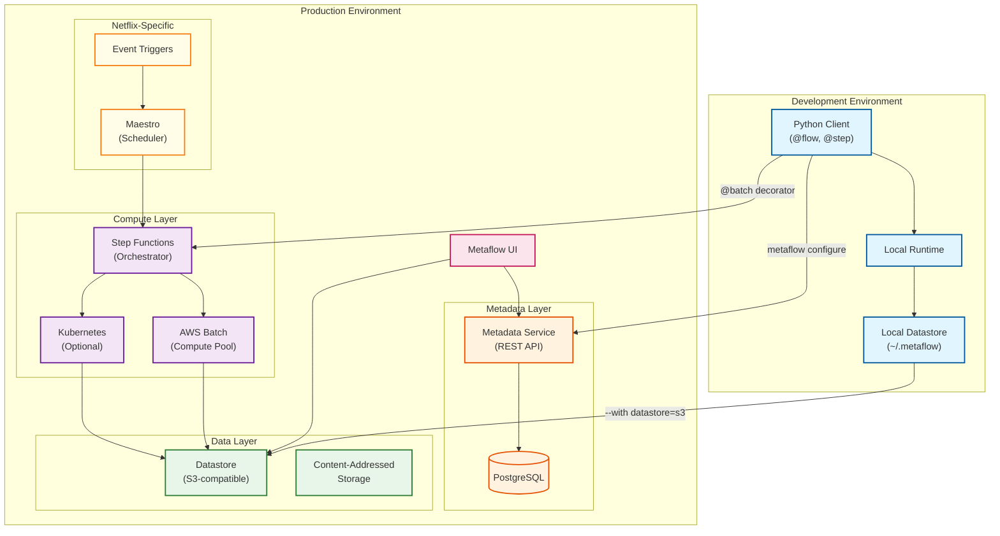

# Netflix Metaflow ML Workflow Platform

## Overview

**Netflix Metaflow** is an open-source, human-centric Python framework for building, managing, and deploying production-grade ML/AI and data science workflows. Originally developed at Netflix and now supported by Outerbounds, Metaflow enables data scientists to write workflows as pure Python code using decorators, with seamless scaling from laptop to cloud. The platform powers **3,000+ projects at Netflix**, executing hundreds of millions of data-intensive jobs processing petabytes of data annually.

**Key Differentiator:** Unlike infrastructure-first ML platforms, Metaflow prioritizes developer experience with its "minimal ops" philosophy. The same Python script runs identically on a laptop for development and on cloud infrastructure (AWS Batch, Kubernetes) for production, with automatic checkpointing, data versioning, and resume capabilities built into the framework itself.

---

## System Characteristics

| Characteristic | Value | Implication |
|----------------|-------|-------------|
| Traffic Pattern | Compute-intensive, DAG-based batch workflows | Step-level checkpointing, not real-time serving |
| Latency Sensitivity | N/A (batch-focused) | Optimize for throughput and reliability, not latency |
| Consistency Model | Strong (metadata), Eventual (artifacts) | Content-addressed storage enables deduplication |
| Availability Target | 99.9% for Metadata Service | Resume capability handles transient failures |
| State Management | External (Metadata Service + Datastore) | Stateless workers, durable state in S3/PostgreSQL |
| Execution Model | Two-environment (local + cloud) | Same code, different compute resources |

---

## Complexity Rating

| Component | Rating | Justification |
|-----------|--------|---------------|
| **Overall** | Medium-High | Workflow orchestration with multi-environment execution and automatic state management |
| DAG Execution Engine | High | Topological execution, branching, foreach parallelism, conditional paths |
| Checkpointing System | Medium | Step-level automatic + optional in-task checkpointing |
| Data Versioning | Medium | Content-addressed storage with lineage tracking |
| Metadata Service | Medium | Run/step/task/artifact tracking, PostgreSQL-backed |
| Compute Integration | Medium-High | AWS Batch, Kubernetes, Step Functions integration |
| Client SDK | Low-Medium | Python decorators, minimal boilerplate |

---

## Quick Navigation

| Document | Description |
|----------|-------------|
| [01 - Requirements & Estimations](./01-requirements-and-estimations.md) | Functional/non-functional requirements, capacity planning, SLOs |
| [02 - High-Level Design](./02-high-level-design.md) | Two-environment architecture, data flow, key decisions |
| [03 - Low-Level Design](./03-low-level-design.md) | Data models, APIs, DAG algorithms, state machine |
| [04 - Deep Dive & Bottlenecks](./04-deep-dive-and-bottlenecks.md) | Checkpointing, data versioning, bottleneck analysis |
| [05 - Scalability & Reliability](./05-scalability-and-reliability.md) | Scaling strategies, fault tolerance, disaster recovery |
| [06 - Security & Compliance](./06-security-and-compliance.md) | Namespaces, access control, threat model |
| [07 - Observability](./07-observability.md) | Metrics, logging, tracing, Metaflow UI |
| [08 - Interview Guide](./08-interview-guide.md) | 45-minute pacing, trap questions, trade-offs |

---

## Core Components

| Component | Responsibility | Key Innovation |
|-----------|----------------|----------------|
| **Metaflow Client** | DAG parsing, local/cloud execution, artifact management | Pure Python decorators, no YAML/DSL |
| **Metadata Service** | Run/step/task tracking, lineage, query API | Thin wrapper over PostgreSQL, enables reproducibility |
| **Datastore** | Versioned artifact storage | Content-addressed S3 storage, automatic deduplication |
| **Compute Layer** | Step execution on cloud resources | AWS Batch, Kubernetes, Step Functions integration |
| **Maestro (Netflix)** | Production scheduling and orchestration | Event triggers, cross-workflow dependencies |
| **Metaflow UI** | Visualization and debugging | Real-time DAG progress, artifact browser |

---

## Architecture Overview



---

## Metaflow Philosophy

| Principle | Description | Implementation |
|-----------|-------------|----------------|
| **Human-Centric** | Designed for data scientists, not ops engineers | Python decorators, not YAML configs |
| **Minimal Ops** | Reduce operational burden to near-zero | Automatic checkpointing, built-in resume |
| **Local-First** | Develop locally, deploy to cloud unchanged | Same code runs on laptop and cloud |
| **Convention Over Configuration** | Sensible defaults, opt-in complexity | Works out of the box, customizable via decorators |
| **Frictionless Iteration** | Change code without infrastructure redeployment | Dynamic DAG parsing, no pre-registration |
| **Data Versioning** | Every artifact automatically versioned | Content-addressed storage, lineage tracking |

---

## Platform Comparison

| Aspect | Metaflow | Airflow | Kubeflow | MLflow |
|--------|----------|---------|----------|--------|
| **Primary Focus** | ML workflow orchestration | General DAG scheduling | End-to-end ML on K8s | Experiment tracking |
| **Target User** | Data Scientist | Data Engineer | ML Engineer | ML Engineer |
| **DSL** | Python decorators | Python/YAML DAGs | YAML + SDK | Python API |
| **Local Execution** | First-class | Requires LocalExecutor | Requires minikube | Works locally |
| **Cloud Scaling** | Seamless (@batch, @kubernetes) | Manual configuration | K8s-native | External |
| **Data Versioning** | Automatic, built-in | Manual | Manual | Limited |
| **Resume** | Built-in, automatic | Manual | Limited | N/A |
| **Checkpointing** | Automatic per step | N/A | Limited | N/A |
| **Learning Curve** | Low (pure Python) | Medium | High (K8s expertise) | Low |
| **Infrastructure** | AWS-native, K8s optional | Standalone | K8s required | Standalone |
| **Complementary** | - | Yes (can schedule Metaflow) | Different focus | Yes (tracking) |

---

## Key Numbers

| Metric | Value | Context |
|--------|-------|---------|
| Netflix projects | 3,000+ | Active Metaflow projects |
| Jobs executed | 100M+ | Annually across all projects |
| Data processed | Petabytes | Per year at Netflix scale |
| Contributors | 200+ | Open-source community |
| Stars (GitHub) | 8,000+ | As of 2026 |
| Outerbounds customers | 100+ | Enterprise adopters |

---

## Metaflow Evolution

| Version | Era | Key Capabilities |
|---------|-----|------------------|
| **1.0** | 2019 | Open-source release, AWS Batch integration |
| **2.0** | 2020-2021 | Kubernetes support, Cards visualization |
| **2.x** | 2022-2024 | Azure/GCP support, improved S3 performance |
| **Current** | 2025-2026 | Config system (2.13), Spin command (2.19), enhanced checkpointing |

### Recent Enhancements (2025-2026)

| Feature | Version | Description |
|---------|---------|-------------|
| Config System | 2.13 | Unified flow configuration, decorator settings |
| Spin Command | 2.19 | Execute single step with preserved state (notebook-like) |
| In-Task Checkpointing | 2.x | @checkpoint decorator for long-running steps |
| Multi-Cloud | 2.x | First-class Azure and GCP support |

---

## Interview Readiness Checklist

- [ ] Can explain the two-environment model (development + production)
- [ ] Understand DAG execution semantics (linear, branch, foreach, conditional)
- [ ] Know how step-level checkpointing enables resume
- [ ] Can describe content-addressed artifact storage
- [ ] Understand the difference between Metaflow and Airflow/Kubeflow
- [ ] Know the role of Metadata Service vs Datastore
- [ ] Can explain the @batch and @kubernetes decorators
- [ ] Understand foreach parallelism and its limitations
- [ ] Know the resume algorithm (clone artifacts, re-execute from failure)
- [ ] Can discuss trade-offs: Python DSL vs YAML, external state vs embedded

---

## Related Systems

- [3.4 MLOps Platform](../3.4-mlops-platform/00-index.md) - Generic MLOps concepts
- [3.5 Uber Michelangelo](../3.5-uber-michelangelo-ml-platform/00-index.md) - Feature store-centric ML platform
- [3.7 Netflix Runway](../README.md) - Model lifecycle management (upcoming)
- [2.6 Distributed Job Scheduler](../2.6-distributed-job-scheduler/00-index.md) - General scheduling patterns
- [1.18 Event Sourcing System](../1.18-event-sourcing-system/00-index.md) - Event-driven patterns

---

## Quick Reference Card

```
+-----------------------------------------------------------------------+
|          NETFLIX METAFLOW - QUICK REFERENCE                           |
+-----------------------------------------------------------------------+
|                                                                        |
|  CORE COMPONENTS                   SCALE TARGETS                       |
|  ----------------                  --------------                       |
|  * Metaflow Client (Python)        * 3,000+ projects (Netflix)         |
|  * Metadata Service (PostgreSQL)   * 100M+ jobs/year                   |
|  * Datastore (S3-compatible)       * Petabytes of data                 |
|  * Compute Layer (Batch/K8s)       * Resume from any checkpoint        |
|  * Metaflow UI                     * 99.9% metadata availability       |
|                                                                        |
+-----------------------------------------------------------------------+
|                                                                        |
|  UNIQUE VALUE PROPS                DECORATOR REFERENCE                 |
|  ------------------                --------------------                 |
|  * Python-native DSL               @flow        - Define workflow      |
|  * Seamless local-to-cloud         @step        - Define step          |
|  * Automatic data versioning       @batch       - Run on AWS Batch     |
|  * Built-in resume capability      @kubernetes  - Run on K8s           |
|  * Step-level checkpointing        @resources   - CPU/memory/GPU       |
|  * Content-addressed storage       @retry       - Retry on failure     |
|                                    @checkpoint  - In-task checkpoint   |
|                                                                        |
+-----------------------------------------------------------------------+
|                                                                        |
|  INTERVIEW KEYWORDS                                                    |
|  ------------------                                                    |
|  DAG execution, checkpointing, resume, content-addressed storage,      |
|  two-environment model, Python decorators, foreach parallelism,        |
|  Metadata Service, Datastore, S3, AWS Batch, Kubernetes, lineage,      |
|  artifact versioning, step semantics, local-to-cloud, minimal ops,     |
|  human-centric design, convention over configuration, Outerbounds      |
|                                                                        |
+-----------------------------------------------------------------------+
```

---

## References

- [Metaflow Official Documentation](https://docs.metaflow.org/) - Comprehensive guides and tutorials
- [Open Sourcing Metaflow - Netflix Tech Blog](https://netflixtechblog.com/open-sourcing-metaflow-a-human-centric-framework-for-data-science-fa72e04a5d9) - Original announcement (2019)
- [Supporting Diverse ML Systems at Netflix](https://netflixtechblog.com/supporting-diverse-ml-systems-at-netflix-2d2e6b6d205d) - Architecture insights
- [Supercharging ML Development with Spin](https://netflixtechblog.com/supercharging-the-ml-and-ai-development-experience-at-netflix-b2d5b95c63eb) - Recent enhancements (2024)
- [Netflix Metaflow Configuration](https://www.infoq.com/news/2025/01/netflix-metaflow-configuration/) - Config system (2025)
- [Metaflow GitHub Repository](https://github.com/Netflix/metaflow) - Open-source codebase
- [Outerbounds Documentation](https://docs.outerbounds.com/) - Enterprise features and deployment
- [Getting Started with Metaflow on AWS](https://aws.amazon.com/blogs/opensource/getting-started-with-the-open-source-data-science-tool-metaflow-on-aws/) - AWS integration guide
