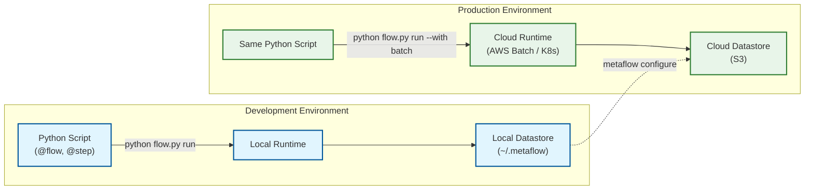
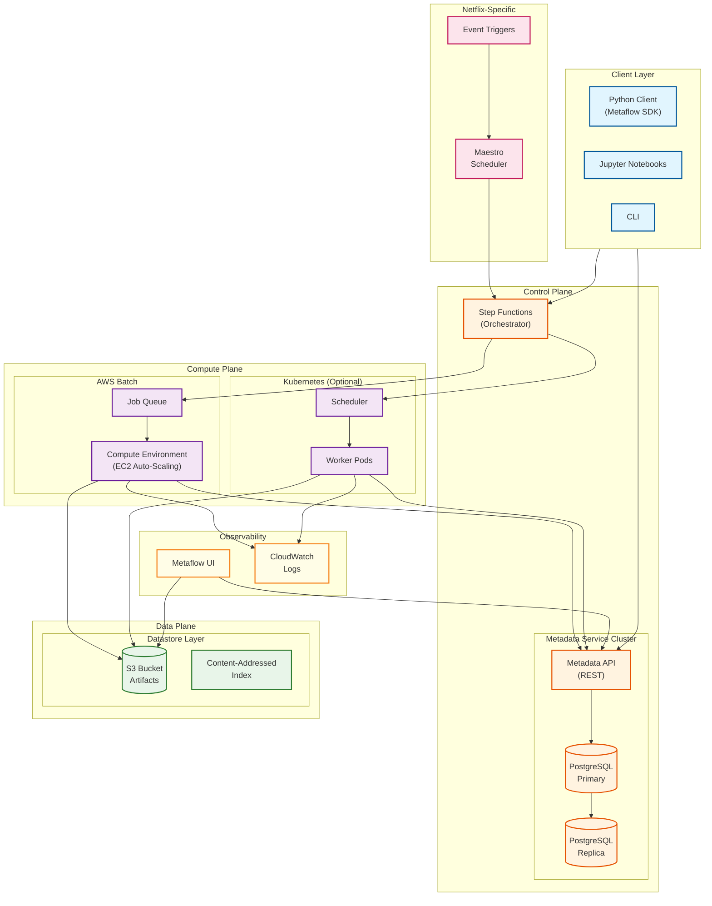
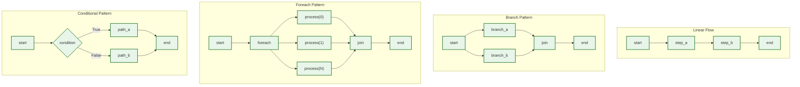
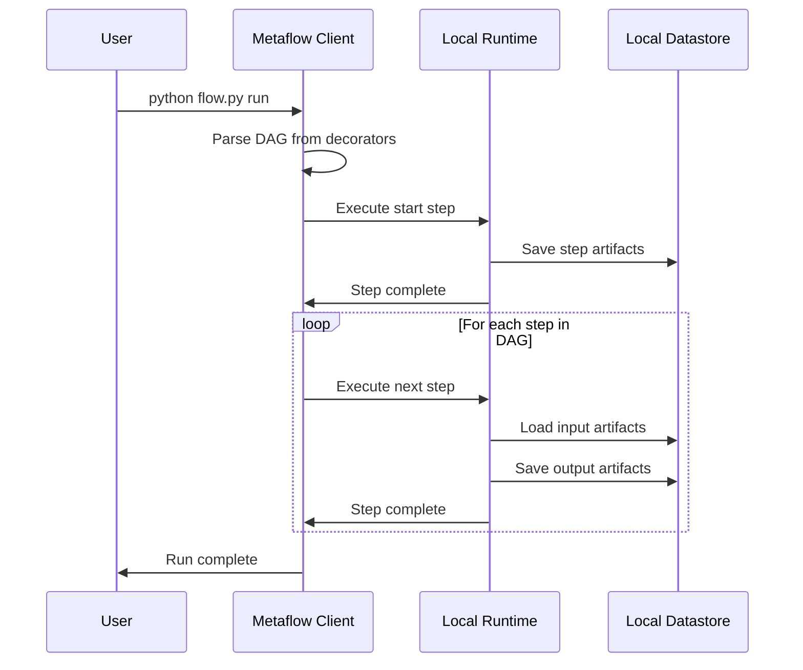
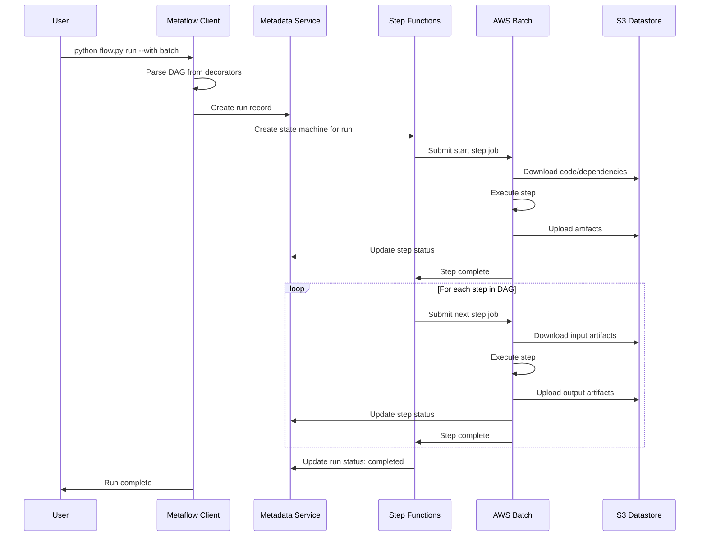
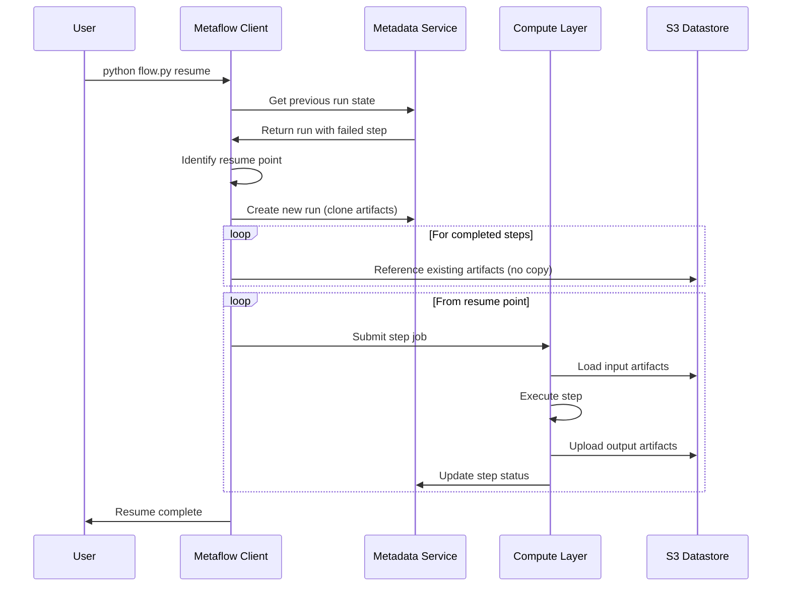
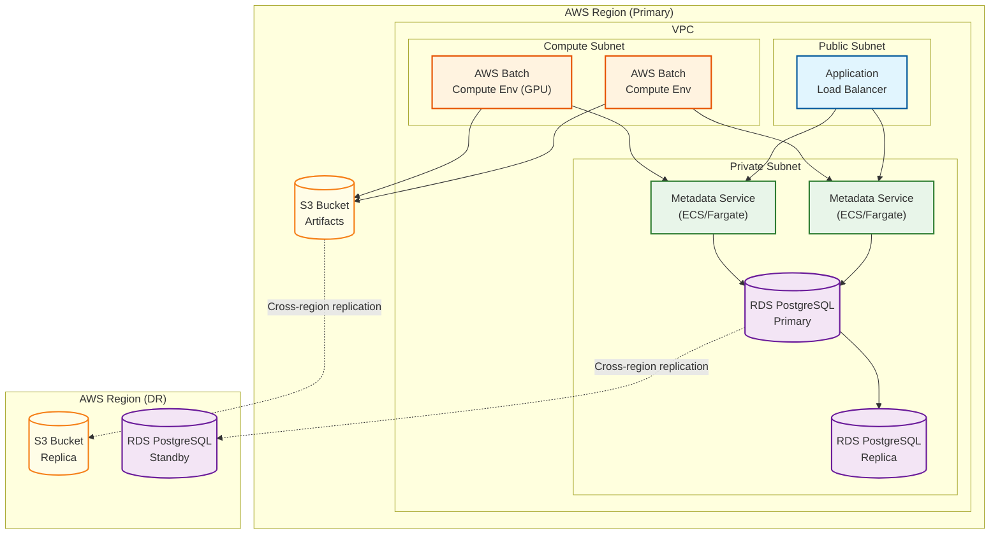

# High-Level Design

## Two-Environment Architecture

Metaflow's defining characteristic is the **two-environment model** where the same Python code executes identically in both development (laptop) and production (cloud) environments.

### Environment Characteristics

| Aspect | Development | Production |
|--------|-------------|------------|
| Execution | Local machine | AWS Batch / Kubernetes |
| State Storage | Local filesystem | S3 / Cloud blob storage |
| Metadata | Local SQLite or remote service | PostgreSQL via Metadata Service |
| Scaling | Single machine | Auto-scaling compute pools |
| Use Case | Iteration, debugging | Scheduled jobs, large-scale training |

---

## System Architecture

---

## Component Responsibilities

| Component | Responsibility | Key Characteristics |
|-----------|----------------|---------------------|
| **Metaflow Client** | DAG parsing, step invocation, artifact serialization | Stateless, runs in user process |
| **Metadata Service** | Track flows, runs, steps, tasks, artifacts | Thin REST API over PostgreSQL |
| **PostgreSQL** | Store metadata with ACID guarantees | Primary + read replicas |
| **Datastore (S3)** | Store versioned artifacts | Content-addressed, immutable |
| **Step Functions** | Orchestrate multi-step execution in cloud | State machine per run |
| **AWS Batch** | Execute steps in containers | Auto-scaling compute pool |
| **Kubernetes** | Alternative compute backend | Pod-per-task execution |
| **Metaflow UI** | Visualize runs, browse artifacts | Read-only, queries metadata/datastore |
| **Maestro (Netflix)** | Production scheduling | Event-driven, cross-workflow dependencies |

---

## DAG Execution Patterns

Metaflow supports multiple DAG patterns through Python decorators and control flow.

### Pattern Semantics

| Pattern | Decorator/Syntax | Semantics |
|---------|------------------|-----------|
| **Linear** | `self.next(step_b)` | Sequential execution, artifacts passed forward |
| **Branch** | `self.next(step_a, step_b)` | Parallel execution, join step receives all branches |
| **Foreach** | `self.next(step, foreach='items')` | Parallel tasks per item, join aggregates results |
| **Conditional** | Python if/else in step | Choose one path at runtime |

---

## Data Flow Diagrams

### Local Execution Flow

### Cloud Execution Flow (@batch)

### Resume Flow

---

## Key Architectural Decisions

### Decision 1: Python Decorators vs YAML DSL

| Context | Options | Choice | Rationale | Trade-off |
|---------|---------|--------|-----------|-----------|
| Workflow definition language | YAML/JSON (Airflow), Python DSL (Prefect), Decorators (Metaflow) | Python decorators | Minimal learning curve for data scientists, IDE support, type checking | Less explicit structure, harder to visualize statically |

### Decision 2: External State vs Embedded State

| Context | Options | Choice | Rationale | Trade-off |
|---------|---------|--------|-----------|-----------|
| State management | In-process (embedded), External services | External (Metadata Service + S3) | Stateless workers, durable checkpoints, resume capability | Network overhead, additional services to operate |

### Decision 3: Content-Addressed vs Path-Based Storage

| Context | Options | Choice | Rationale | Trade-off |
|---------|---------|--------|-----------|-----------|
| Artifact storage | Path-based (run/step/artifact), Content-addressed (SHA256) | Content-addressed | Automatic deduplication, immutability, cache-friendly | Garbage collection complexity, less intuitive browsing |

### Decision 4: Step Functions vs Custom Orchestrator

| Context | Options | Choice | Rationale | Trade-off |
|---------|---------|--------|-----------|-----------|
| Cloud orchestration | Build custom, Use Step Functions, Use Kubernetes CRDs | AWS Step Functions (default) | Managed, reliable, integrates with Batch | AWS lock-in, cost at scale |

### Decision 5: Foreach Implementation

| Context | Options | Choice | Rationale | Trade-off |
|---------|---------|--------|-----------|-----------|
| Parallel fan-out | Sequential loop, Spark/Ray, Native parallel | Native parallel tasks | Simplicity, no external dependency for moderate parallelism | Orchestration overhead at high cardinality (>10K items) |

---

## Architecture Pattern Checklist

| Pattern | Decision | Implementation |
|---------|----------|----------------|
| **Sync vs Async** | Async | Steps execute asynchronously, client polls for completion |
| **Event-Driven vs Request-Response** | Hybrid | Step Functions event-driven, Client API request-response |
| **Push vs Pull** | Pull | Workers pull code/artifacts from S3 |
| **Stateless vs Stateful** | Stateless workers | All state in Metadata Service + Datastore |
| **Read-Heavy vs Write-Heavy** | Balanced | Writes during execution, reads for queries/resume |
| **Real-time vs Batch** | Batch | Designed for batch ML workflows, not streaming |
| **Centralized vs Distributed** | Centralized metadata | Single Metadata Service, distributed compute |
| **Edge vs Origin** | Origin | Compute in cloud regions, not edge |

---

## Deployment Topology

---

## Technology Stack

| Layer | Component | Technology | Purpose |
|-------|-----------|------------|---------|
| **Client** | SDK | Python 3.8+ | Workflow definition and execution |
| **Client** | Serialization | Pickle, Cloudpickle | Artifact serialization |
| **Control** | Metadata Service | Python (Flask/FastAPI) | REST API for metadata |
| **Control** | Metadata Store | PostgreSQL 13+ | ACID metadata storage |
| **Control** | Orchestrator | AWS Step Functions | State machine execution |
| **Data** | Artifact Store | Amazon S3 | Blob storage |
| **Data** | Content Hash | SHA256 | Deduplication |
| **Compute** | Batch | AWS Batch | Container execution |
| **Compute** | Container | Kubernetes | Alternative compute |
| **Compute** | Container Registry | Amazon ECR | Docker image storage |
| **Observe** | UI | React + Python backend | Visualization |
| **Observe** | Logs | CloudWatch Logs | Log aggregation |

---

## Integration Points

| Integration | Type | Purpose |
|-------------|------|---------|
| **AWS Batch** | Native | Primary compute backend |
| **Kubernetes** | Native | Alternative compute backend |
| **AWS Step Functions** | Native | Production orchestration |
| **Amazon S3** | Native | Artifact storage |
| **PostgreSQL** | Native | Metadata storage |
| **MLflow** | Plugin | Experiment tracking |
| **Weights & Biases** | Plugin | Experiment tracking |
| **Airflow** | External | Can schedule Metaflow runs |
| **Argo Workflows** | Plugin | Kubernetes orchestration |
| **Dask/Ray** | Step-level | Distributed compute within steps |
