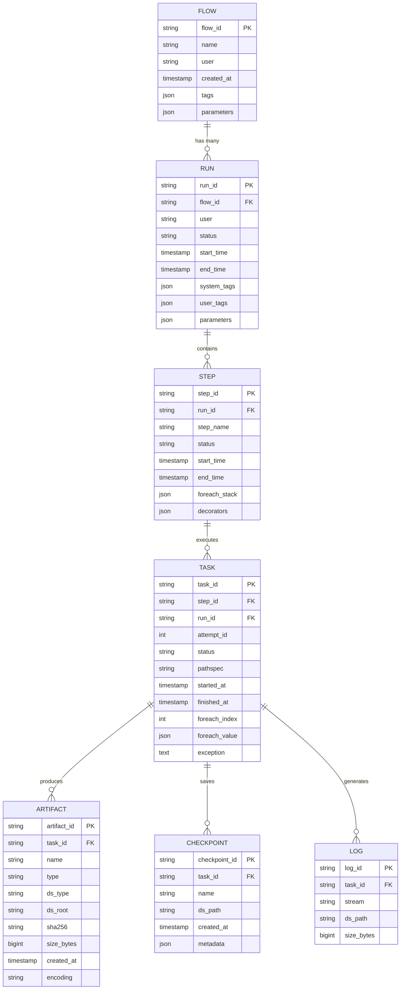
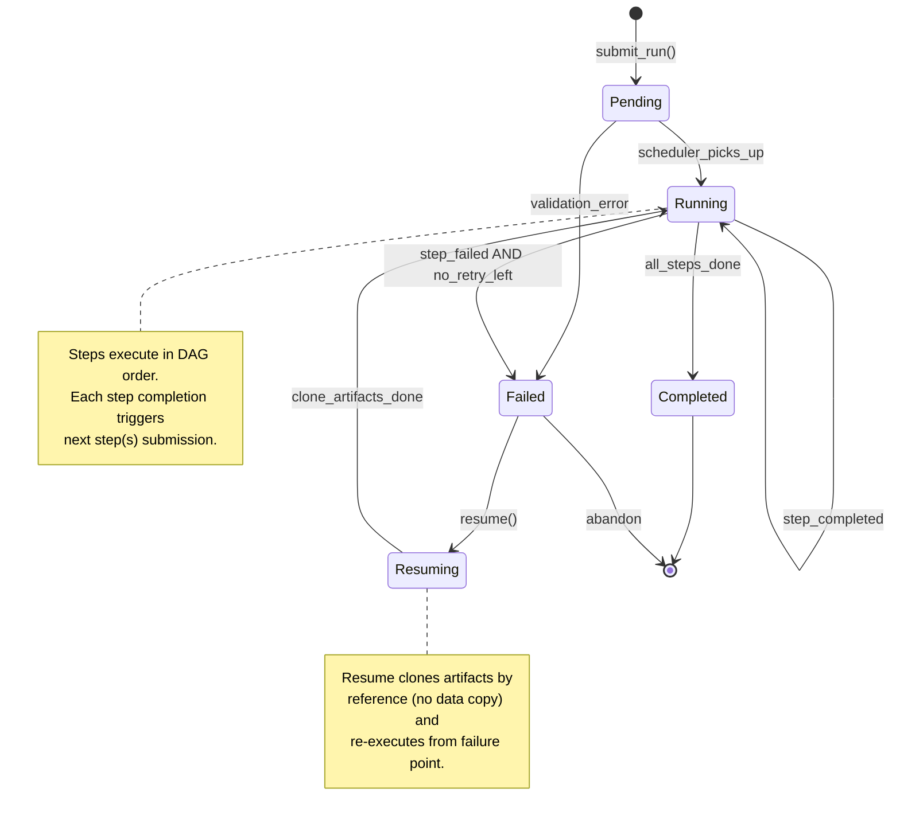
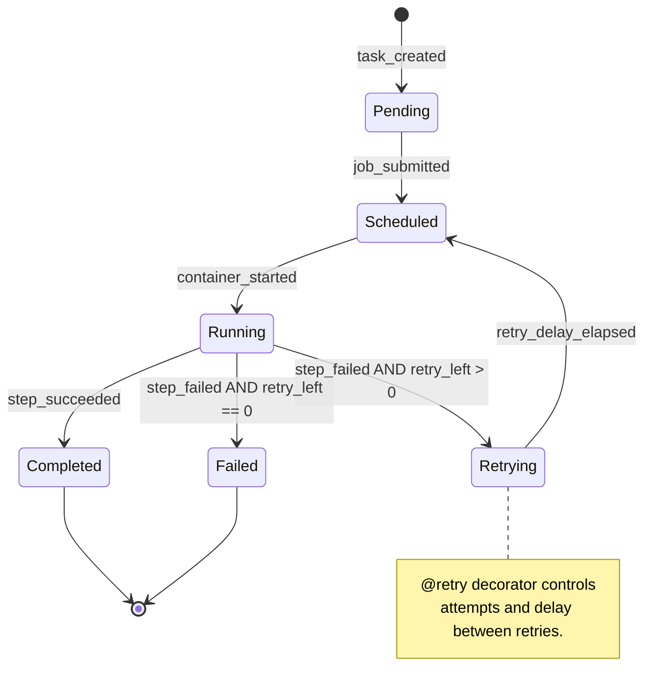

# Low-Level Design

## Data Model

### Core Entities

```
FLOW
├── flow_id (PK)          : string      # Unique identifier (flow class name)
├── name                  : string      # Human-readable name
├── user                  : string      # Creator username
├── created_at            : timestamp   # First run timestamp
├── tags                  : json        # User-defined tags
└── parameters            : json        # Default parameter schema

RUN
├── run_id (PK)           : string      # Unique identifier (e.g., "1706123456789")
├── flow_id (FK)          : string      # Parent flow
├── user                  : string      # User who initiated
├── status                : enum        # pending | running | completed | failed
├── start_time            : timestamp   # Execution start
├── end_time              : timestamp   # Execution end (nullable)
├── system_tags           : json        # Auto-generated tags (scheduler, runtime)
├── user_tags             : json        # User-defined tags
└── parameters            : json        # Runtime parameters

STEP
├── step_id (PK)          : string      # Composite: run_id + step_name
├── run_id (FK)           : string      # Parent run
├── step_name             : string      # Step function name
├── status                : enum        # pending | running | completed | failed
├── start_time            : timestamp   # Step start
├── end_time              : timestamp   # Step end (nullable)
├── foreach_stack         : json        # Foreach context (nullable)
└── decorators            : json        # Applied decorators (@batch, @resources, etc.)

TASK
├── task_id (PK)          : string      # Unique within step
├── step_id (FK)          : string      # Parent step
├── run_id (FK)           : string      # Parent run
├── attempt_id            : integer     # Retry attempt number (0, 1, 2, ...)
├── status                : enum        # pending | running | completed | failed
├── pathspec              : string      # Full path: flow/run/step/task
├── started_at            : timestamp   # Task start
├── finished_at           : timestamp   # Task end (nullable)
├── foreach_index         : integer     # Index in foreach (nullable)
├── foreach_value         : json        # Value in foreach (nullable)
└── exception             : text        # Error message if failed

ARTIFACT
├── artifact_id (PK)      : string      # Unique identifier
├── task_id (FK)          : string      # Parent task
├── name                  : string      # Artifact name (self.x)
├── type                  : string      # Python type name
├── ds_type               : string      # Datastore type (s3, local)
├── ds_root               : string      # Datastore root path
├── sha256                : string      # Content hash
├── size_bytes            : bigint      # Artifact size
├── created_at            : timestamp   # Creation time
└── encoding              : string      # Serialization format (pickle, json)
```

### Entity Relationship Diagram



---

## Storage Patterns

### Metadata Storage (PostgreSQL)

| Table | Partition Strategy | Retention | Indexes |
|-------|-------------------|-----------|---------|
| flows | None (small table) | Permanent | flow_id (PK), user + created_at |
| runs | Range by start_time | Permanent | run_id (PK), flow_id, status, user + start_time |
| steps | Range by run_id | Permanent | step_id (PK), run_id, status |
| tasks | Range by run_id | Permanent | task_id (PK), step_id, run_id, pathspec |
| artifacts | Range by run_id | Configurable | artifact_id (PK), task_id, sha256 |

### Artifact Storage (S3)

| Data Type | Key Pattern | TTL | Example |
|-----------|-------------|-----|---------|
| Artifacts | `data/{sha256[:2]}/{sha256[2:4]}/{sha256}` | Configurable | `data/ab/cd/abcd1234...` |
| Checkpoints | `checkpoints/{run_id}/{step}/{task}/{name}` | Run lifetime + 7d | `checkpoints/1234/train/0/model.pt` |
| Logs | `logs/{run_id}/{step}/{task}/{stream}` | 90 days | `logs/1234/train/0/stdout` |
| Code | `code/{sha256}` | Permanent | `code/ef56...` |

### Content-Addressed Storage Design

```
Artifact Upload:
1. Serialize object (pickle/custom)
2. Compute SHA256 of serialized bytes
3. Check if sha256 exists in datastore
   - If exists: skip upload, return reference
   - If not: upload to s3://bucket/data/{sha256[:2]}/{sha256[2:4]}/{sha256}
4. Record artifact metadata in Metadata Service
```

---

## API Design

### Python Decorator API

```
# Flow Definition Decorators
@flow                          # Mark class as a Metaflow flow
@project(name="myproject")     # Group flows into a project

# Step Definition Decorators
@step                          # Mark method as a step
@card                          # Attach visualization to step

# Compute Decorators
@batch                         # Execute on AWS Batch
@kubernetes                    # Execute on Kubernetes
@resources(cpu=4, memory=16000, gpu=1)  # Specify resources

# Environment Decorators
@conda(python="3.10")          # Specify Conda environment
@conda_base(packages={"pandas": "2.0"})  # Base packages
@pypi(packages={"numpy": "1.24"})        # Pip packages

# Reliability Decorators
@retry(times=3, minutes_between_retries=5)  # Retry on failure
@timeout(minutes=60)           # Step timeout
@catch(var="error")            # Catch exceptions

# Checkpointing Decorators
@checkpoint                    # Enable in-task checkpointing

# Transition Methods
self.next(step_a)              # Linear transition
self.next(step_a, step_b)      # Branch (parallel)
self.next(step_a, foreach="items")  # Foreach fan-out
self.merge_artifacts(inputs)   # Merge in join step
```

### Metadata Service REST API

```
# Flow Operations
GET    /flows                      # List all flows
GET    /flows/{flow_id}            # Get flow details
GET    /flows/{flow_id}/runs       # List runs for flow

# Run Operations
POST   /runs                       # Create new run
GET    /runs/{run_id}              # Get run details
PUT    /runs/{run_id}              # Update run (status, tags)
GET    /runs/{run_id}/steps        # List steps in run
GET    /runs/{run_id}/artifacts    # List all artifacts in run

# Step Operations
GET    /runs/{run_id}/steps/{step_name}          # Get step details
GET    /runs/{run_id}/steps/{step_name}/tasks    # List tasks in step

# Task Operations
POST   /tasks                      # Create task record
PUT    /tasks/{task_id}            # Update task (status, exception)
GET    /tasks/{task_id}/artifacts  # List artifacts for task

# Artifact Operations
POST   /artifacts                  # Register artifact
GET    /artifacts/{artifact_id}    # Get artifact metadata
GET    /artifacts/by-hash/{sha256} # Lookup by content hash

# Search Operations
GET    /search?flow={flow}&user={user}&tag={tag}&status={status}
```

### API Request/Response Examples

**Create Run:**
```
POST /runs
Content-Type: application/json

{
  "flow_id": "TrainingFlow",
  "user": "alice",
  "parameters": {
    "epochs": 100,
    "learning_rate": 0.001
  },
  "tags": ["experiment-v2"]
}

Response:
{
  "run_id": "1706123456789",
  "flow_id": "TrainingFlow",
  "status": "pending",
  "start_time": "2026-01-24T10:30:00Z",
  "pathspec": "TrainingFlow/1706123456789"
}
```

**Register Artifact:**
```
POST /artifacts
Content-Type: application/json

{
  "task_id": "12345",
  "name": "model",
  "type": "sklearn.ensemble.RandomForestClassifier",
  "sha256": "abcd1234...",
  "size_bytes": 52428800,
  "ds_type": "s3",
  "ds_root": "s3://metaflow-data",
  "encoding": "pickle"
}

Response:
{
  "artifact_id": "art_67890",
  "created_at": "2026-01-24T10:35:00Z",
  "ds_path": "s3://metaflow-data/data/ab/cd/abcd1234..."
}
```

---

## Core Algorithms

### DAG Topological Execution

```
FUNCTION execute_flow(flow_class, parameters, resume_run_id=None):
    // Parse DAG from flow class decorators
    dag = parse_dag_from_decorators(flow_class)

    // Validate DAG structure
    IF NOT is_valid_dag(dag):
        RAISE DAGValidationError("Invalid DAG structure")

    // Handle resume if specified
    IF resume_run_id IS NOT NULL:
        previous_run = metadata_service.get_run(resume_run_id)
        resume_point = find_first_failed_step(previous_run)
        completed_artifacts = clone_completed_artifacts(previous_run, resume_point)
    ELSE:
        resume_point = "start"
        completed_artifacts = {}

    // Create new run record
    run = metadata_service.create_run(flow_class.name, parameters)

    // Get topological order
    execution_order = topological_sort(dag, starting_from=resume_point)

    // Execute steps
    FOR step IN execution_order:
        // Check for foreach
        IF step.has_foreach:
            results = execute_foreach(step, run, completed_artifacts)
        ELSE:
            results = execute_step(step, run, completed_artifacts)

        // Update completed artifacts
        completed_artifacts[step.name] = results

        // Handle branches
        IF step.has_branches:
            FOR branch IN step.branches:
                // Branches execute in parallel
                submit_async(branch, run, completed_artifacts)

    // Wait for all parallel branches
    wait_for_completion(run)

    RETURN run

FUNCTION topological_sort(dag, starting_from="start"):
    // Kahn's algorithm for topological sort
    in_degree = {}
    FOR node IN dag.nodes:
        in_degree[node] = len(dag.predecessors(node))

    queue = [n for n in dag.nodes if in_degree[n] == 0]
    result = []

    // Skip nodes before starting_from for resume
    skip_mode = (starting_from != "start")

    WHILE queue:
        node = queue.pop(0)

        IF node == starting_from:
            skip_mode = False

        IF NOT skip_mode:
            result.append(node)

        FOR successor IN dag.successors(node):
            in_degree[successor] -= 1
            IF in_degree[successor] == 0:
                queue.append(successor)

    RETURN result
```

**Complexity:** O(V + E) where V = number of steps, E = number of transitions

### Content-Addressed Artifact Storage

```
FUNCTION store_artifact(data, name, task_id):
    // Serialize data
    serialized = serialize(data)  // pickle or custom serializer

    // Compute content hash
    content_hash = sha256(serialized)

    // Check for existing artifact (deduplication)
    existing = datastore.exists(content_hash)
    IF existing:
        LOG("Artifact already exists, skipping upload")
    ELSE:
        // Compute storage path
        path = format("data/{}/{}/{}",
                      content_hash[0:2],   // First 2 chars
                      content_hash[2:4],   // Next 2 chars
                      content_hash)        // Full hash

        // Upload to datastore
        datastore.put(path, serialized)

    // Register in metadata service
    artifact = metadata_service.create_artifact(
        task_id=task_id,
        name=name,
        sha256=content_hash,
        size_bytes=len(serialized),
        type=type(data).__name__
    )

    RETURN artifact

FUNCTION load_artifact(artifact_id):
    // Get metadata
    artifact = metadata_service.get_artifact(artifact_id)

    // Compute storage path from hash
    path = format("data/{}/{}/{}",
                  artifact.sha256[0:2],
                  artifact.sha256[2:4],
                  artifact.sha256)

    // Download from datastore
    serialized = datastore.get(path)

    // Verify integrity
    IF sha256(serialized) != artifact.sha256:
        RAISE IntegrityError("Artifact corrupted")

    // Deserialize
    data = deserialize(serialized)

    RETURN data
```

**Complexity:** O(data_size) for hashing and serialization

### Resume Algorithm

```
FUNCTION resume_run(original_run_id, step_name=None):
    // Load original run state
    original_run = metadata_service.get_run(original_run_id)

    IF original_run.status == "completed":
        RAISE Error("Cannot resume completed run")

    // Determine resume point
    IF step_name IS NOT NULL:
        resume_from = step_name
    ELSE:
        resume_from = find_first_failed_step(original_run)

    // Get completed steps before resume point
    dag = parse_dag_from_flow(original_run.flow_id)
    completed_steps = get_steps_before(dag, resume_from)

    // Create new run
    new_run = metadata_service.create_run(
        flow_id=original_run.flow_id,
        parameters=original_run.parameters,
        origin_run_id=original_run_id
    )

    // Clone artifacts from completed steps (by reference, no data copy)
    FOR step IN completed_steps:
        FOR task IN get_tasks(original_run, step):
            FOR artifact IN task.artifacts:
                metadata_service.create_artifact_reference(
                    new_run=new_run,
                    step=step,
                    original_artifact=artifact
                )

    // Execute from resume point
    execute_flow_from_step(
        run=new_run,
        start_step=resume_from,
        cloned_artifacts=completed_steps
    )

    RETURN new_run

FUNCTION find_first_failed_step(run):
    dag = parse_dag_from_flow(run.flow_id)
    execution_order = topological_sort(dag)

    FOR step IN execution_order:
        step_status = metadata_service.get_step_status(run, step)
        IF step_status IN ["failed", "pending"]:
            RETURN step

    RETURN NULL  // All steps completed
```

**Complexity:** O(completed_steps) for cloning references

### Foreach Parallel Expansion

```
FUNCTION execute_foreach(step, run, input_artifacts):
    // Get foreach items from parent step
    items = input_artifacts[step.foreach_source]

    IF len(items) > MAX_FOREACH_CARDINALITY:
        RAISE Error("Foreach cardinality exceeds limit")

    // Create tasks for each item
    tasks = []
    FOR i, item IN enumerate(items):
        task = metadata_service.create_task(
            run_id=run.run_id,
            step_name=step.name,
            foreach_index=i,
            foreach_value=item
        )
        tasks.append(task)

    // Submit to compute layer
    IF step.decorator == "@batch":
        job_ids = batch_client.submit_array_job(
            tasks=tasks,
            step=step,
            run=run
        )
    ELSE:
        job_ids = []
        FOR task IN tasks:
            job_id = compute_layer.submit(task, step, run)
            job_ids.append(job_id)

    // Wait for all tasks with timeout
    results = wait_for_all(job_ids, timeout=step.timeout)

    // Check for failures
    failed = [r for r in results if r.status == "failed"]
    IF failed AND NOT step.allow_partial:
        RAISE ForeachError("Some foreach tasks failed", failed)

    // Aggregate results for join step
    aggregated = {}
    FOR result IN results:
        FOR name, artifact IN result.artifacts.items():
            IF name NOT IN aggregated:
                aggregated[name] = []
            aggregated[name].append(artifact)

    RETURN aggregated

FUNCTION execute_join(step, run, foreach_results):
    // In join step, self.inputs contains all foreach results
    // Merge artifacts from all foreach tasks

    merged_artifacts = {}
    FOR name, artifacts IN foreach_results.items():
        merged_artifacts[name] = artifacts  // List of all values

    // Execute join step with merged inputs
    result = execute_step_with_inputs(step, run, merged_artifacts)

    RETURN result
```

**Complexity:** O(N) where N = number of foreach items

### Step Checkpointing

```
FUNCTION execute_step_with_checkpointing(step, task, input_artifacts):
    // Load input artifacts
    FOR name, artifact IN input_artifacts.items():
        setattr(task.context, name, load_artifact(artifact.artifact_id))

    // Check for in-task checkpoint
    IF step.has_checkpoint_decorator:
        checkpoint = load_latest_checkpoint(task)
        IF checkpoint:
            restore_from_checkpoint(task.context, checkpoint)

    TRY:
        // Execute step function
        step.function(task.context)

        // Step completed - automatic checkpoint
        save_step_checkpoint(task, task.context)

    CATCH exception:
        // Save partial progress if checkpointing enabled
        IF step.has_checkpoint_decorator:
            save_emergency_checkpoint(task, task.context)

        RAISE exception

    // Extract output artifacts (instance variables)
    output_artifacts = {}
    FOR name IN step.output_names:
        value = getattr(task.context, name)
        artifact = store_artifact(value, name, task.task_id)
        output_artifacts[name] = artifact

    RETURN output_artifacts

FUNCTION save_step_checkpoint(task, context):
    // Serialize all instance variables
    state = {}
    FOR name IN dir(context):
        IF NOT name.startswith("_"):
            state[name] = getattr(context, name)

    checkpoint_path = format("checkpoints/{}/{}/{}/state",
                             task.run_id, task.step_name, task.task_id)

    datastore.put(checkpoint_path, serialize(state))

    metadata_service.record_checkpoint(
        task_id=task.task_id,
        path=checkpoint_path
    )
```

---

## State Machine: Run Lifecycle



### Task State Machine



---

## Indexing Strategy

| Index | Table | Columns | Purpose |
|-------|-------|---------|---------|
| pk_flows | flows | flow_id | Primary lookup |
| idx_flows_user | flows | user, created_at DESC | List user's flows |
| pk_runs | runs | run_id | Primary lookup |
| idx_runs_flow | runs | flow_id, start_time DESC | List runs for flow |
| idx_runs_status | runs | status, start_time DESC | Find running/failed runs |
| idx_runs_user | runs | user, start_time DESC | User's recent runs |
| pk_steps | steps | step_id | Primary lookup |
| idx_steps_run | steps | run_id | List steps in run |
| pk_tasks | tasks | task_id | Primary lookup |
| idx_tasks_step | tasks | step_id | List tasks in step |
| idx_tasks_pathspec | tasks | pathspec | Lookup by full path |
| pk_artifacts | artifacts | artifact_id | Primary lookup |
| idx_artifacts_task | artifacts | task_id | List artifacts for task |
| idx_artifacts_hash | artifacts | sha256 | Deduplication lookup |

### Query Patterns

| Query | Expected Frequency | Index Used |
|-------|-------------------|------------|
| Get run by ID | High | pk_runs |
| List runs for flow | High | idx_runs_flow |
| Find failed runs | Medium | idx_runs_status |
| Get artifacts for task | High | idx_artifacts_task |
| Check artifact exists | High | idx_artifacts_hash |
| Get user's recent runs | Medium | idx_runs_user |

---

## Serialization Formats

| Data Type | Default Serializer | Alternative | Notes |
|-----------|-------------------|-------------|-------|
| Python objects | Pickle (cloudpickle) | Dill | Default for arbitrary objects |
| Pandas DataFrame | Pickle | Parquet (with decorator) | Parquet for interoperability |
| NumPy array | Pickle | NPZ | NPZ for large arrays |
| Primitive types | Pickle | JSON | JSON for small primitives |
| Large models | Pickle | Custom (PyTorch, TF) | Framework-specific for efficiency |

### Serialization Decision Tree

```
FUNCTION choose_serializer(data):
    IF is_primitive(data):
        RETURN JSONSerializer
    ELSE IF is_dataframe(data) AND size(data) > 100MB:
        RETURN ParquetSerializer
    ELSE IF is_numpy_array(data) AND size(data) > 100MB:
        RETURN NPZSerializer
    ELSE IF is_pytorch_model(data):
        RETURN TorchSerializer
    ELSE:
        RETURN PickleSerializer  // Default fallback
```
