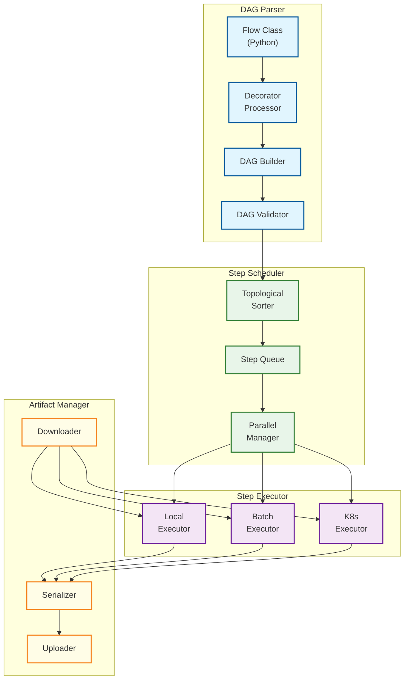
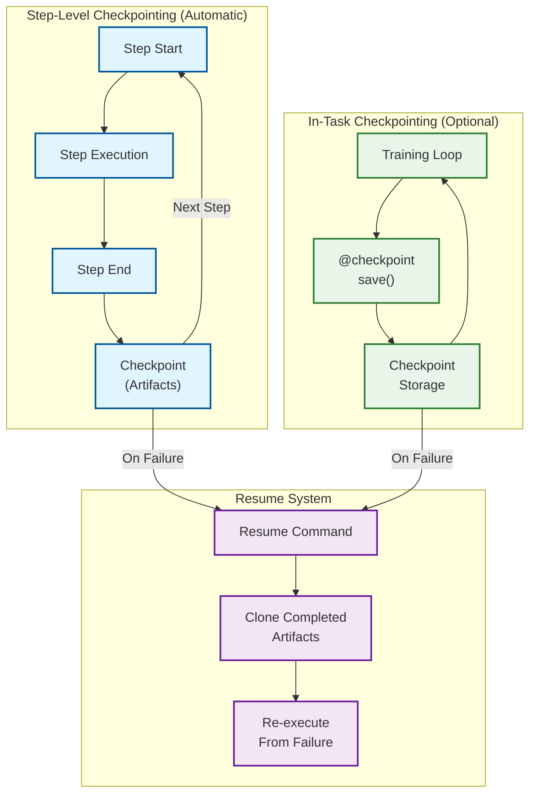
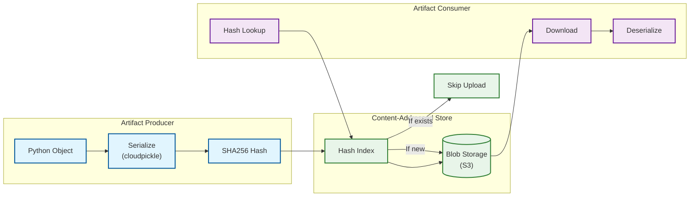
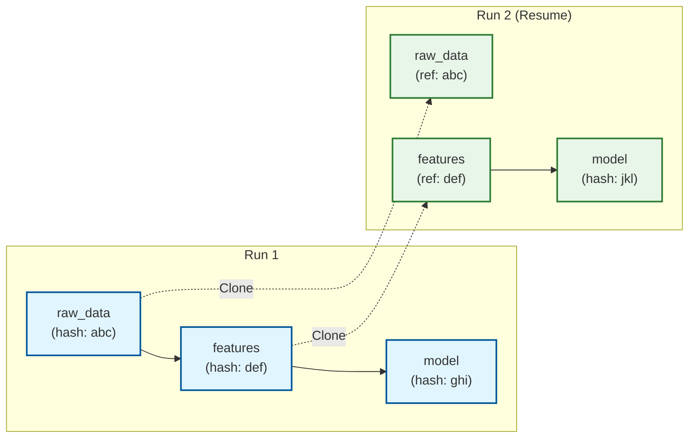

# Deep Dive and Bottlenecks

## Deep Dive 1: DAG Execution Engine

### Why This Component is Critical

The DAG Execution Engine is the heart of Metaflow. It transforms Python decorators into executable workflows, manages step transitions, handles parallel execution (branches and foreach), and coordinates with the compute layer. Every workflow execution depends on correct DAG parsing, scheduling, and artifact propagation.

### Internal Architecture



### Step Semantics

| Semantic | Description | Implementation |
|----------|-------------|----------------|
| **Atomicity** | Steps either complete fully or fail entirely | Try/catch around step function, rollback on failure |
| **Isolation** | Steps cannot access other step's in-progress state | Artifacts only visible after step completion |
| **Checkpoint Boundary** | Each step is an automatic checkpoint | State persisted to datastore on success |
| **Artifact Passing** | Instance variables become artifacts | Serialize self.x at step end, deserialize at step start |

### Transition Types

```
Linear Transition:
    self.next(step_b)
    -> step_a completes
    -> artifacts saved
    -> step_b scheduled
    -> step_b loads step_a artifacts

Branch Transition:
    self.next(step_a, step_b)
    -> parent completes
    -> artifacts saved
    -> step_a AND step_b scheduled in parallel
    -> both inherit parent artifacts

Join Transition:
    @step
    def join(self, inputs):
    -> waits for ALL incoming branches
    -> inputs contains list of branch results
    -> self.merge_artifacts() to resolve conflicts

Foreach Transition:
    self.next(step_a, foreach='items')
    -> parent completes
    -> len(self.items) tasks created
    -> each task receives one item
    -> join step receives list of all results
```

### Failure Modes and Handling

| Failure Mode | Impact | Detection | Handling |
|--------------|--------|-----------|----------|
| Step exception | Task fails | Python exception | @retry decorator, resume from checkpoint |
| Container OOM | Task killed | Exit code 137 | @resources for larger memory, resume |
| Network timeout | Artifact upload fails | Timeout exception | Retry with backoff, idempotent upload |
| Metadata service down | Status update fails | Connection error | Queue locally, retry on recovery |
| Orphaned foreach task | Partial results | Timeout waiting | Configurable: fail-fast or continue |
| DAG parse error | Run fails before start | Validation error | Fail fast with clear error message |

### Race Conditions

| Scenario | Risk | Mitigation |
|----------|------|------------|
| Concurrent artifact uploads (same hash) | Duplicate data | Content-addressing makes duplicates identical |
| Parallel status updates | Lost update | Optimistic locking with version field |
| Resume during active run | Inconsistent state | Check run status before resume |
| Multiple clients same run | Conflicts | Run ownership, single active execution |

---

## Deep Dive 2: Checkpointing and Resume System

### Why This Component is Critical

Checkpointing enables Metaflow's key value proposition: never lose work due to failures. Data scientists can run multi-hour training jobs knowing that a failure at step 8 won't require re-running steps 1-7. This dramatically reduces iteration time and compute costs.

### Two-Level Checkpointing Architecture



### Step-Level Checkpointing (Automatic)

Every step boundary is an automatic checkpoint:

```
Step Execution Flow:
1. Load input artifacts from previous step(s)
2. Execute step function
3. [On Success] Serialize all instance variables as artifacts
4. [On Success] Update step status to "completed"
5. [On Failure] Step status remains "failed", previous checkpoints intact
```

**What Gets Checkpointed:**
- All instance variables (self.x) that are serializable
- Explicit: variables assigned in step
- Implicit: variables inherited from previous steps

**What Doesn't Get Checkpointed:**
- Local variables (stack variables)
- Open file handles, database connections
- Running threads/processes

### In-Task Checkpointing (@checkpoint)

For long-running steps (e.g., multi-hour training), the @checkpoint decorator enables manual checkpointing within a step:

```
@checkpoint(key="training")
@step
def train(self):
    model = load_or_restore_model()

    for epoch in range(self.epochs):
        train_one_epoch(model, epoch)

        # Manual checkpoint every 10 epochs
        if epoch % 10 == 0:
            current.checkpoint.save(model=model, epoch=epoch)

    self.model = model
```

### Resume Policies

| Policy | Behavior | Use Case |
|--------|----------|----------|
| **Default** | Resume from first failed step, use cached artifacts | Production jobs with failures |
| **Eager** | Resume from specific step, re-execute even if previously succeeded | Development and debugging |
| **From Origin** | Resume using specific run's artifacts | Reproducibility testing |

### Resume Algorithm Details

```
FUNCTION resume(origin_run_id, step=None, eager=False):
    origin = load_run(origin_run_id)

    IF step IS NULL:
        step = find_first_failed_or_pending(origin)

    // Determine which steps to clone vs re-execute
    dag = parse_dag(origin.flow)
    to_clone = get_predecessors(dag, step)
    to_execute = [step] + get_successors(dag, step)

    IF eager:
        // Eager mode: re-execute specified step even if completed
        to_clone = get_strict_predecessors(dag, step)
        to_execute = [step] + get_successors(dag, step)

    // Create new run
    new_run = create_run(origin.flow, origin.parameters)

    // Clone artifacts (by reference, O(1) per artifact)
    FOR step_name IN to_clone:
        clone_step_artifacts(origin, new_run, step_name)

    // Execute remaining steps
    execute_from(new_run, to_execute[0])

    RETURN new_run
```

### Checkpoint Storage Design

| Checkpoint Type | Storage Path | Retention |
|-----------------|--------------|-----------|
| Step checkpoint | `{run}/steps/{step}/checkpoint` | Permanent (part of run) |
| In-task checkpoint | `{run}/tasks/{task}/checkpoints/{name}` | Run lifetime + 7 days |
| Emergency checkpoint | `{run}/tasks/{task}/emergency_checkpoint` | 24 hours |

---

## Deep Dive 3: Data Versioning and Artifacts

### Why This Component is Critical

Data versioning enables reproducibility, deduplication, and lineage tracking. Every piece of data flowing through a Metaflow pipeline is versioned, allowing users to: (1) reproduce any historical run exactly, (2) avoid storing duplicate data, (3) trace model predictions back to training data.

### Content-Addressed Storage Architecture



### Deduplication Mechanics

```
Upload Path:
1. Serialize object to bytes
2. Compute SHA256(bytes) = content_hash
3. Check metadata: EXISTS(artifact WHERE sha256 = content_hash)?
   - Yes: Create reference to existing blob
   - No: Upload bytes to s3://bucket/data/{hash[0:2]}/{hash[2:4]}/{hash}
4. Record artifact metadata: (name, content_hash, size, type, task_id)

Deduplication Scenarios:
- Same data in different runs: Single copy stored
- Unchanged self.x across steps: Single copy, multiple references
- Model checkpoint resaved: Detects identical hash, skips upload
```

### Lineage Tracking



### Lineage Queries

| Query | Implementation | Use Case |
|-------|----------------|----------|
| "What data produced this model?" | Traverse artifact references backward | Debugging model issues |
| "Which runs used this dataset?" | Query artifacts by sha256 | Impact analysis |
| "Diff between run A and run B?" | Compare artifact hashes | Experiment comparison |

---

## Bottleneck Analysis

### Bottleneck 1: Metadata Service Overload

**Problem:**
Large foreach (10K+ items) generates massive metadata write traffic. Each task writes multiple records: task creation, task start, task completion, artifact registration.

**Symptoms:**
- Metadata API latency increases (P99 > 500ms)
- PostgreSQL CPU saturation
- Step transitions slow down

**Calculations:**
```
Foreach with 10,000 items:
- Task records: 10,000
- Status updates: 30,000 (pending → running → completed)
- Artifact records: 30,000 (3 artifacts per task)
- Total writes: 70,000 in burst

At 1000 writes/sec capacity:
- Burst duration: 70 seconds
- During burst: API latency spikes
```

**Mitigations:**

| Mitigation | Implementation | Trade-off |
|------------|----------------|-----------|
| Batched writes | Aggregate 100 writes into single transaction | Slight delay in visibility |
| Local queuing | Queue writes in compute worker, flush periodically | Risk of lost updates on crash |
| Read replicas | Scale reads to replicas, writes to primary | Replication lag (100ms) |
| Sharding | Shard by flow_id or run_id | Operational complexity |

**Recommended Approach:**
```
1. Client-side batching: Aggregate writes, flush every 1s or 100 records
2. Async writes: Non-blocking metadata updates from compute workers
3. Metadata read replicas: Scale reads to 3+ replicas
4. Rate limiting: Cap foreach at 10K items, suggest hierarchical foreach
```

### Bottleneck 2: Large Artifact Transfers

**Problem:**
ML workflows often produce large artifacts (models: 1-10GB, datasets: 100GB+). Transferring these between steps creates latency and bandwidth bottlenecks.

**Symptoms:**
- Step startup time dominated by artifact download
- S3 bandwidth costs escalate
- Network saturation in compute environments

**Calculations:**
```
10GB model artifact:
- Upload time (1 Gbps): 80 seconds
- Download time (1 Gbps): 80 seconds
- Per-step overhead: 160 seconds

With S3 Transfer Acceleration:
- Upload time: 40 seconds
- Download time: 40 seconds
- 50% improvement
```

**Mitigations:**

| Mitigation | Implementation | Trade-off |
|------------|----------------|-----------|
| Data locality | Execute steps in same AZ as data | Reduced scheduling flexibility |
| Streaming | Stream artifacts instead of full download | Complexity, not always possible |
| Compression | Compress before upload | CPU overhead |
| Lazy loading | Load artifacts on first access | Unpredictable latency |
| Reference passing | Pass S3 paths, not data | User code changes required |

**Recommended Approach:**
```
1. Enable S3 Transfer Acceleration for uploads
2. Use compute in same region as S3 bucket
3. Compress artifacts >100MB (gzip/lz4)
4. For >10GB artifacts: suggest streaming API or reference passing
5. Cache recently used artifacts in local SSD (when available)
```

### Bottleneck 3: Foreach Cardinality Explosion

**Problem:**
Users attempt foreach over millions of items, creating orchestration overhead that exceeds actual compute.

**Symptoms:**
- Step Functions state machine explodes in size
- Batch job queue overwhelmed
- Metadata service overloaded (see Bottleneck 1)

**Calculations:**
```
1,000,000 foreach items:
- Step Functions state: 1M transitions (exceeds 25,000 limit)
- Batch job submissions: 1M (hours to submit)
- Metadata records: 7M (unsustainable)

Orchestration overhead per item: ~100ms
Total overhead: 100,000 seconds = 27 hours
```

**Mitigations:**

| Mitigation | Implementation | Trade-off |
|------------|----------------|-----------|
| Hard limit | Reject foreach > 10K items | Restricts valid use cases |
| Hierarchical foreach | Batch items into groups, foreach over groups | User code changes |
| External parallelism | Delegate to Spark/Ray from single step | Additional dependency |
| Array jobs | Use Batch array jobs (1 submission → N tasks) | Batch-specific |

**Recommended Approach:**
```
1. Default limit: 10,000 foreach items
2. Configurable limit with warning: up to 100,000
3. For >100K items: require explicit @large_foreach decorator
4. @large_foreach uses Batch array jobs (1 submission)
5. For >1M items: suggest Spark/Dask within single step
```

---

## Concurrency and Locking

### Concurrency Model

| Level | Parallelism | Isolation |
|-------|-------------|-----------|
| Runs | Multiple runs of same flow concurrently | Separate namespaces, no conflicts |
| Branches | Parallel steps within single run | Shared artifacts from parent only |
| Foreach | Parallel tasks within single step | Each task gets single item, join aggregates |
| Within step | User-managed (threads, multiprocessing) | No Metaflow isolation |

### Locking Strategies

| Scenario | Locking | Implementation |
|----------|---------|----------------|
| Run creation | None | Run IDs are unique (timestamp-based) |
| Artifact upload | None | Content-addressed = idempotent |
| Metadata update | Optimistic | Version field, retry on conflict |
| Resume | Advisory | Check run status before resume |

### No Distributed Locking

Metaflow deliberately avoids distributed locking:
- Content-addressed storage makes writes idempotent
- Run/step/task IDs are generated to be globally unique
- Conflicts are rare and resolved by retry

This simplifies the architecture but requires careful ID generation and idempotent operations.

---

## Failure Recovery Matrix

| Failure | Detection | Immediate Action | Long-term Recovery |
|---------|-----------|------------------|-------------------|
| Step exception | Exit code | @retry if configured | Resume from checkpoint |
| Container crash | Exit code 137/143 | @retry | Resume with more resources |
| Network partition | Timeout | Retry with backoff | Resume after network recovery |
| S3 unavailable | SDK exception | Exponential backoff | Wait for S3 recovery |
| Metadata service down | Connection error | Queue writes locally | Flush queue on recovery |
| Step Functions throttle | API exception | Back off, retry | Increase service limits |
| Batch queue full | Job pending | Wait | Scale compute environment |
