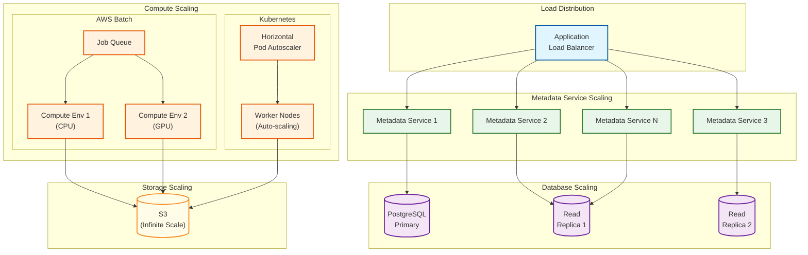
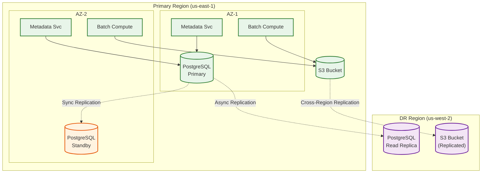
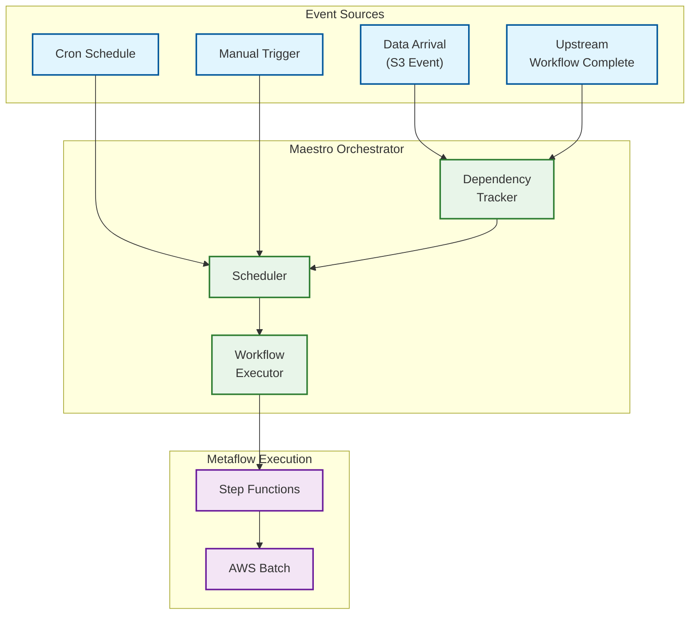

# Scalability and Reliability

## Scalability

### Horizontal Scaling Strategy



### Component Scaling

| Component | Scaling Type | Trigger | Strategy |
|-----------|--------------|---------|----------|
| Metadata Service | Horizontal | CPU > 70%, Latency P99 > 100ms | Add instances behind ALB |
| PostgreSQL Reads | Horizontal | Read IOPS > 5000 | Add read replicas |
| PostgreSQL Writes | Vertical | Write IOPS > 3000 | Upgrade instance class |
| AWS Batch (CPU) | Horizontal | Queue depth > 100 | Auto-scaling compute environment |
| AWS Batch (GPU) | Horizontal | Queue depth > 10 | Auto-scaling with GPU instances |
| Kubernetes | Horizontal | Pod CPU > 70% | HPA + Cluster Autoscaler |
| S3 | N/A | N/A | Managed service, infinite scale |

### Auto-Scaling Configuration

```
# AWS Batch Compute Environment
compute_environment:
  type: MANAGED
  minvCpus: 0
  maxvCpus: 10000
  desiredvCpus: 100
  instanceTypes:
    - c6i.xlarge    # 4 vCPU, 8 GB
    - c6i.4xlarge   # 16 vCPU, 32 GB
    - c6i.8xlarge   # 32 vCPU, 64 GB
  allocationStrategy: BEST_FIT_PROGRESSIVE

  # GPU Environment
  gpu_environment:
    instanceTypes:
      - p4d.24xlarge  # 8x A100 GPUs
      - g5.xlarge     # 1x A10G GPU
    minvCpus: 0
    maxvCpus: 2000

# Kubernetes HPA
horizontalPodAutoscaler:
  apiVersion: autoscaling/v2
  spec:
    scaleTargetRef:
      kind: Deployment
      name: metaflow-worker
    minReplicas: 5
    maxReplicas: 500
    metrics:
      - type: Resource
        resource:
          name: cpu
          targetAverageUtilization: 70
```

### Database Scaling Strategy

| Scenario | Current | Threshold | Action |
|----------|---------|-----------|--------|
| Read-heavy | 1 primary + 1 replica | Read latency > 50ms | Add replica |
| Write-heavy | db.r6g.xlarge | Write latency > 100ms | Upgrade to 2xlarge |
| Storage growth | 500 GB | 80% capacity | Enable auto-expand |
| Cross-region | Single region | DR requirement | Add standby in second region |

### Hot Spot Mitigation

| Hot Spot | Symptom | Mitigation |
|----------|---------|------------|
| Popular flow | High read traffic for single flow | Cache flow metadata in Redis |
| Large run | Many artifacts for single run | Partition artifact queries |
| Burst foreach | Massive write spike | Rate limit + batching |
| Active user | Single user's queries dominate | Per-user query quotas |

---

## Reliability and Fault Tolerance

### Single Points of Failure (SPOF) Analysis

| Component | SPOF Risk | Mitigation | Residual Risk |
|-----------|-----------|------------|---------------|
| Metadata Service | High | Multi-instance behind ALB, health checks | Low: ALB failover < 30s |
| PostgreSQL Primary | High | Automated failover to standby (RDS Multi-AZ) | Low: Failover < 60s |
| S3 | Very Low | Managed service, 11 nines durability | Negligible |
| Step Functions | Low | Managed service, multi-AZ | Low |
| AWS Batch | Medium | Multi-AZ compute environment | Low: Jobs re-queued |
| Kubernetes | Medium | Multi-node, pod anti-affinity | Low: Pod rescheduling |

### Redundancy Strategy



### Failover Mechanisms

| Component | Failover Mechanism | RTO | RPO |
|-----------|-------------------|-----|-----|
| Metadata Service | ALB health check → route to healthy instance | < 30s | 0 |
| PostgreSQL (AZ) | RDS Multi-AZ automatic failover | < 60s | 0 |
| PostgreSQL (Region) | Manual promotion of read replica | < 1 hour | < 5 min |
| S3 | N/A (managed) | N/A | 0 |
| AWS Batch | Job re-queue on instance failure | < 5 min | 0 (checkpointed) |
| Step Functions | N/A (managed, durable) | N/A | 0 |

### Retry Strategy

```
# Metaflow Retry Decorator
@retry(times=3, minutes_between_retries=2)
@step
def train(self):
    # If this step fails, Metaflow will:
    # 1. Wait 2 minutes
    # 2. Retry the step (attempt 2)
    # 3. Wait 2 minutes
    # 4. Retry the step (attempt 3)
    # 5. If still failing, mark step as failed
    pass

# Exponential Backoff for Infrastructure
retry_config:
  initial_delay_seconds: 1
  max_delay_seconds: 300
  multiplier: 2
  jitter: 0.1

  # Retry sequence: 1s, 2s, 4s, 8s, 16s, 32s, 64s, 128s, 256s, 300s (cap)
```

### Retry Configuration by Error Type

| Error Type | Retry | Max Attempts | Backoff | Notes |
|------------|-------|--------------|---------|-------|
| Transient network | Yes | 5 | Exponential | S3, metadata API |
| Rate limit | Yes | 10 | Exponential with jitter | Add jitter to spread load |
| Resource unavailable | Yes | 3 | Linear (5 min) | Batch capacity |
| Validation error | No | 0 | N/A | Fail fast |
| User code exception | Configurable | @retry setting | Configurable | User decision |
| OOM killed | Yes | 2 | N/A | Suggest larger instance |

### Circuit Breaker Pattern

```
FUNCTION circuit_breaker(service_call, threshold=5, reset_timeout=60):
    state = CLOSED
    failure_count = 0
    last_failure_time = NULL

    FUNCTION execute():
        IF state == OPEN:
            IF now() - last_failure_time > reset_timeout:
                state = HALF_OPEN
            ELSE:
                RAISE CircuitOpenError

        TRY:
            result = service_call()
            IF state == HALF_OPEN:
                state = CLOSED
                failure_count = 0
            RETURN result

        CATCH exception:
            failure_count += 1
            last_failure_time = now()

            IF failure_count >= threshold:
                state = OPEN

            RAISE exception
```

**Applied to:**
- Metadata Service calls from compute workers
- S3 operations during high-error periods
- External service integrations

### Graceful Degradation

| Failure Scenario | Degraded Behavior | User Impact |
|------------------|-------------------|-------------|
| Metadata Service down | Continue execution, queue status updates | Delayed visibility in UI |
| S3 slow | Retry with backoff, extend timeout | Slower step transitions |
| Step Functions throttled | Queue submissions locally | Delayed cloud execution |
| PostgreSQL read replica lag | Route reads to primary | Increased primary load |

### Bulkhead Pattern

Isolate failures to prevent cascade:

```
Resource Pools:
- metadata_pool: 50 connections (for metadata queries)
- artifact_pool: 100 connections (for S3 operations)
- compute_pool: Rate limit to 1000 job submissions/min

Pool Isolation:
- Metadata service overload doesn't block artifact uploads
- High artifact traffic doesn't exhaust metadata connections
- Burst job submissions don't overwhelm Batch API
```

---

## Disaster Recovery

### Recovery Objectives

| Tier | Use Case | RTO | RPO | Strategy |
|------|----------|-----|-----|----------|
| Tier 1 | Business-critical pipelines | < 1 hour | 0 | Active-passive with auto-failover |
| Tier 2 | Important pipelines | < 4 hours | < 15 min | Warm standby |
| Tier 3 | Development/experimental | < 24 hours | < 1 hour | Backup/restore |

### Backup Strategy

| Data | Backup Method | Frequency | Retention |
|------|---------------|-----------|-----------|
| PostgreSQL | Automated snapshots | Daily + continuous WAL | 35 days |
| S3 artifacts | Cross-region replication | Continuous | Same as source |
| S3 artifacts | Versioning | Continuous | 90 days |
| Configuration | Git (Infrastructure as Code) | On change | Permanent |

### DR Runbook

```
DISASTER RECOVERY PROCEDURE

1. DETECTION
   - Automated: CloudWatch alarms trigger on region failure
   - Manual: Ops team identifies extended outage (> 15 min)

2. DECISION
   - If RTO < remaining outage estimate: Initiate failover
   - If RTO > remaining outage estimate: Wait for recovery

3. FAILOVER TO DR REGION
   a. Promote PostgreSQL read replica to primary
      - RDS Console: Actions → Promote
      - Wait for promotion (< 10 min)

   b. Update DNS to point to DR region
      - Route 53: Update metadata service endpoint
      - TTL: 60 seconds

   c. Verify S3 replication caught up
      - Check replication metrics
      - Verify recent artifacts accessible

   d. Start Metadata Service in DR region
      - Deploy from same infrastructure code
      - Point to promoted database

   e. Notify users
      - Status page update
      - Slack/email notification

4. VERIFICATION
   - Submit test run
   - Verify metadata service responds
   - Verify artifact storage works
   - Check UI accessibility

5. POST-FAILOVER
   - Monitor for issues
   - Begin planning failback when primary recovers
```

### Multi-Region Considerations

| Aspect | Active-Passive | Active-Active |
|--------|----------------|---------------|
| Complexity | Medium | High |
| Cost | 1.3x (warm standby) | 2x (full duplication) |
| RTO | < 1 hour | < 5 minutes |
| RPO | < 5 minutes | 0 (with conflict resolution) |
| Recommended for | Most deployments | Global teams, ultra-high availability |

**Metaflow Recommendation:** Active-passive with automated failover. The checkpoint/resume model means RPO is effectively 0 for compute (just resume from last checkpoint).

---

## Netflix Maestro Integration

### Production Orchestration

At Netflix scale, Metaflow runs are scheduled and coordinated by **Maestro**, Netflix's production workflow orchestrator:



### Maestro Capabilities

| Capability | Description | Metaflow Benefit |
|------------|-------------|------------------|
| Cron scheduling | Schedule runs at specific times | Daily model retraining |
| Event triggers | Start runs on data arrival | Real-time pipeline updates |
| Dependencies | Wait for upstream workflows | Complex pipeline orchestration |
| Concurrency control | Limit parallel runs | Resource management |
| Alerting | Notify on failure | Operational visibility |
| SLA monitoring | Track run duration vs target | Performance tracking |

### Integration Pattern (Open-Source Alternative)

For non-Netflix deployments, similar functionality via Airflow:

```
# Airflow DAG that schedules Metaflow
from airflow import DAG
from airflow.operators.bash import BashOperator

dag = DAG('metaflow_training', schedule_interval='@daily')

run_metaflow = BashOperator(
    task_id='run_training_flow',
    bash_command='python training_flow.py --with batch run',
    dag=dag
)
```
