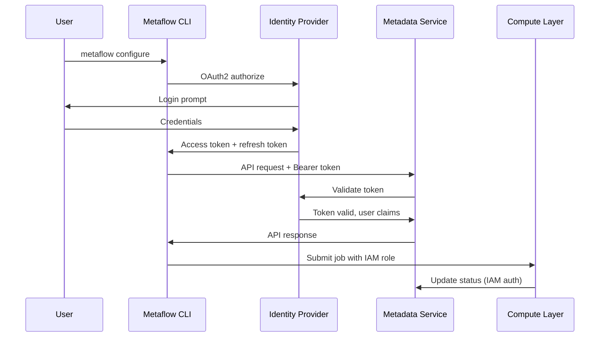
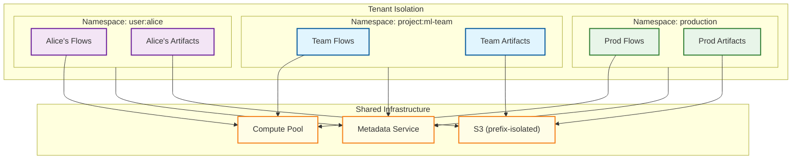
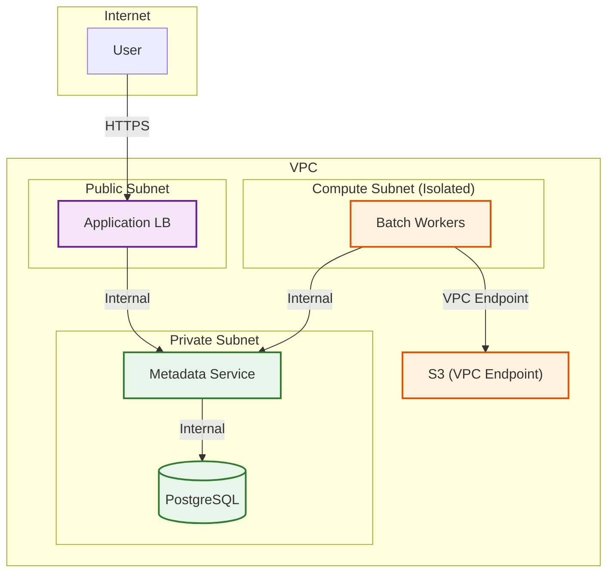

# Security and Compliance

## Authentication and Authorization

### Authentication Mechanisms

| Method | Use Case | Implementation |
|--------|----------|----------------|
| **OAuth2/OIDC** | User authentication for UI and API | Integration with identity provider (Okta, Auth0) |
| **IAM Roles** | Service-to-service authentication | AWS IAM roles for Batch workers, metadata service |
| **API Keys** | Programmatic access | Long-lived keys for CI/CD systems |
| **Service Accounts** | Kubernetes workloads | K8s service accounts with IRSA |

### Authentication Flow



### Authorization Model

Metaflow uses a **namespace-based** authorization model:

| Namespace Type | Pattern | Access Control |
|----------------|---------|----------------|
| **User** | `user:{username}` | Only the user can read/write |
| **Production** | `production` | Designated production users |
| **Project** | `project:{project_name}` | Project team members |
| **Global** | `global` | All authenticated users (read), admins (write) |

### Namespace Configuration

```
# User namespace (default for development)
metaflow configure --namespace user:alice

# Production namespace
metaflow configure --namespace production

# Project namespace
metaflow configure --namespace project:recommendation-system
```

### Permission Matrix

| Action | User Namespace | Production | Project | Global |
|--------|---------------|------------|---------|--------|
| Create run | Owner only | Prod users | Project members | Admins |
| View run | Owner only | All users | Project members | All users |
| Resume run | Owner only | Prod users | Project members | Admins |
| Delete run | Owner only | Admins | Project admins | Admins |
| View artifacts | Owner only | All users | Project members | All users |

### Role-Based Access Control (RBAC)

| Role | Capabilities | Typical Assignment |
|------|--------------|-------------------|
| **Viewer** | Read runs, artifacts, metadata | All authenticated users |
| **Developer** | Viewer + create runs in user namespace | Data scientists |
| **Deployer** | Developer + deploy to production namespace | ML engineers |
| **Admin** | Full access, delete operations, user management | Platform team |

---

## Data Security

### Encryption at Rest

| Data Type | Encryption Method | Key Management |
|-----------|-------------------|----------------|
| Artifacts (S3) | SSE-S3 or SSE-KMS | AWS-managed or customer-managed CMK |
| Metadata (RDS) | RDS encryption | AWS-managed KMS key |
| Checkpoints | Same as artifacts | Same as artifacts |
| Logs | CloudWatch encryption | AWS-managed key |

### Encryption Configuration

```
# S3 Bucket Policy for SSE-KMS
{
  "Version": "2012-10-17",
  "Statement": [
    {
      "Effect": "Deny",
      "Principal": "*",
      "Action": "s3:PutObject",
      "Resource": "arn:aws:s3:::metaflow-artifacts/*",
      "Condition": {
        "StringNotEquals": {
          "s3:x-amz-server-side-encryption": "aws:kms"
        }
      }
    }
  ]
}
```

### Encryption in Transit

| Connection | Protocol | Certificate |
|------------|----------|-------------|
| Client → Metadata Service | HTTPS (TLS 1.3) | ACM certificate |
| Client → S3 | HTTPS (TLS 1.3) | AWS-managed |
| Batch → Metadata Service | HTTPS (TLS 1.3) | ACM certificate |
| Batch → S3 | HTTPS (TLS 1.3) | AWS-managed |

### Secrets Management

**Challenge:** ML workflows often require credentials (database passwords, API keys, cloud credentials).

**Solution:** @secrets decorator with backend integration:

```
# Secrets configuration (supports multiple backends)
secrets:
  default_backend: aws_secrets_manager
  backends:
    aws_secrets_manager:
      region: us-east-1
    vault:
      address: https://vault.internal.company.com
      auth_method: kubernetes

# Usage in flow
@secrets(sources=["aws-secrets-manager://db-credentials"])
@step
def load_data(self):
    import os
    db_password = os.environ["DB_PASSWORD"]  # Injected by @secrets
```

### Secrets Backend Comparison

| Backend | Pros | Cons | Recommended For |
|---------|------|------|-----------------|
| AWS Secrets Manager | Native AWS, rotation | Cost at scale | AWS deployments |
| HashiCorp Vault | Feature-rich, multi-cloud | Operational overhead | Enterprise, multi-cloud |
| Kubernetes Secrets | Simple, native | Base64 only, limited rotation | K8s-native deployments |
| Environment Variables | Simple | Visible in process list, no rotation | Development only |

---

## Namespace and Tenant Isolation

### Multi-Tenant Architecture



### Isolation Mechanisms

| Isolation Type | Mechanism | Enforcement |
|----------------|-----------|-------------|
| Data isolation | S3 prefix per namespace | IAM policies |
| Metadata isolation | Namespace column in all tables | Query filters |
| Compute isolation | Separate Batch queues (optional) | Queue assignment |
| Network isolation | VPC per tenant (optional) | VPC peering |

### Resource Quotas

| Resource | Default Quota | Purpose |
|----------|---------------|---------|
| Active runs | 100 per namespace | Prevent runaway jobs |
| Foreach cardinality | 10,000 per step | Limit orchestration overhead |
| Artifact size | 50 GB per artifact | Prevent storage abuse |
| Total storage | 10 TB per namespace | Cost control |
| Concurrent compute | 1,000 vCPU per namespace | Fair sharing |

---

## Threat Model

### Attack Vectors and Mitigations

| Attack Vector | Description | Likelihood | Impact | Mitigation |
|---------------|-------------|------------|--------|------------|
| **Code injection via artifacts** | Malicious pickle payload | Medium | High | Sandboxed deserialization, allowlist types |
| **Privilege escalation** | Escape container to host | Low | Critical | gVisor/Firecracker, minimal container privileges |
| **Data exfiltration** | Extract artifacts to external location | Medium | High | VPC isolation, egress controls, audit logging |
| **Denial of Service** | Exhaust compute/storage | Medium | Medium | Rate limiting, quotas, cost alerts |
| **Credential theft** | Steal IAM role credentials | Low | High | Short-lived credentials, credential isolation |
| **Man-in-the-middle** | Intercept API traffic | Low | High | TLS everywhere, certificate pinning |

### Pickle Deserialization Security

**Risk:** Python pickle can execute arbitrary code during deserialization.

**Mitigations:**

1. **Restricted unpickler:**
   ```
   ALLOWED_MODULES = ['numpy', 'pandas', 'sklearn', ...]
   BLOCKED_MODULES = ['os', 'subprocess', 'socket', ...]

   class SafeUnpickler:
       def find_class(self, module, name):
           if module in BLOCKED_MODULES:
               raise SecurityError("Blocked module")
           return super().find_class(module, name)
   ```

2. **Sandbox execution:** Run deserialization in isolated container

3. **Content scanning:** Scan artifacts for known malicious patterns

4. **User awareness:** Document risks, recommend alternatives (JSON, Parquet)

### Container Security

| Control | Implementation | Purpose |
|---------|----------------|---------|
| Non-root user | `USER 1000` in Dockerfile | Reduce privilege |
| Read-only filesystem | `readOnlyRootFilesystem: true` | Prevent modification |
| No new privileges | `allowPrivilegeEscalation: false` | Prevent escalation |
| Resource limits | CPU/memory limits | Prevent resource abuse |
| Network policy | Egress allowlist | Prevent data exfiltration |
| Seccomp profile | Restrict syscalls | Reduce attack surface |

### Network Security



### Security Controls

| Layer | Control | Implementation |
|-------|---------|----------------|
| Network | VPC isolation | Private subnets for compute |
| Network | Security groups | Allowlist ingress/egress |
| Network | VPC endpoints | Private access to S3 |
| Network | WAF | Protect ALB from web attacks |
| Application | Authentication | OAuth2/OIDC |
| Application | Authorization | Namespace-based RBAC |
| Application | Rate limiting | API gateway rate limits |
| Data | Encryption at rest | KMS-managed keys |
| Data | Encryption in transit | TLS 1.3 |
| Audit | CloudTrail | API call logging |
| Audit | Access logs | ALB access logs |

---

## Compliance

### GDPR Compliance

| Requirement | Implementation |
|-------------|----------------|
| Data minimization | Configure artifact retention policies |
| Right to erasure | Namespace deletion workflow |
| Data portability | Export artifacts via Client API |
| Access logging | Audit trail in metadata |
| Data locality | Region-specific S3 buckets |

### SOC 2 Compliance

| Control | Implementation |
|---------|----------------|
| Access control | RBAC, namespace isolation |
| Audit logging | CloudTrail, metadata audit trail |
| Change management | Infrastructure as Code (Terraform) |
| Incident response | Alerting, runbooks |
| Encryption | At rest and in transit |

### HIPAA Compliance (Healthcare)

| Requirement | Implementation |
|-------------|----------------|
| PHI encryption | SSE-KMS with customer-managed CMK |
| Access controls | Strict RBAC, audit logging |
| Audit trails | Comprehensive logging of all access |
| BAA | Ensure AWS BAA in place |
| Minimum necessary | Namespace isolation, data masking |

### Data Retention and Lifecycle

```
# S3 Lifecycle Policy
lifecycle_rules:
  - id: artifact_retention
    prefix: "data/"
    transitions:
      - days: 30
        storage_class: STANDARD_IA
      - days: 90
        storage_class: GLACIER
    expiration:
      days: 365
    noncurrent_version_expiration:
      days: 30

  - id: checkpoint_cleanup
    prefix: "checkpoints/"
    expiration:
      days: 7

  - id: log_cleanup
    prefix: "logs/"
    expiration:
      days: 90
```

---

## Audit Logging

### Audit Events

| Event | Logged Data | Retention |
|-------|-------------|-----------|
| Run created | User, flow, parameters, timestamp | 1 year |
| Run completed/failed | Status, duration, error (if any) | 1 year |
| Artifact accessed | User, artifact ID, timestamp | 90 days |
| Resume triggered | User, original run, resume point | 1 year |
| Namespace access | User, namespace, action | 1 year |
| Configuration change | User, old/new config | Permanent |

### Audit Log Format

```
{
  "timestamp": "2026-01-24T10:30:00Z",
  "event_type": "artifact.accessed",
  "user": "alice@company.com",
  "namespace": "production",
  "resource": {
    "type": "artifact",
    "id": "art_12345",
    "flow": "TrainingFlow",
    "run": "1706123456789"
  },
  "action": "download",
  "source_ip": "10.0.1.50",
  "user_agent": "metaflow-client/2.19.0"
}
```

### Audit Queries

| Query | Purpose | Example |
|-------|---------|---------|
| Who accessed artifact X? | Data lineage investigation | `SELECT * FROM audit WHERE resource.id = 'X'` |
| What did user Y do? | User activity review | `SELECT * FROM audit WHERE user = 'Y'` |
| Failed runs in production | Incident investigation | `SELECT * FROM audit WHERE event_type = 'run.failed' AND namespace = 'production'` |
