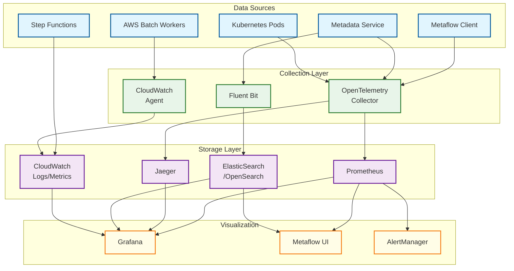
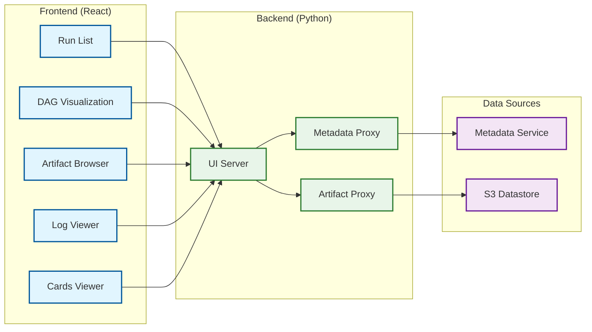

# Observability

## Observability Architecture



---

## Metrics (USE/RED)

### Key Metrics

| Metric | Type | Labels | Description |
|--------|------|--------|-------------|
| `metaflow_runs_total` | Counter | flow_name, status, namespace | Total runs by status |
| `metaflow_runs_active` | Gauge | flow_name, namespace | Currently running runs |
| `metaflow_run_duration_seconds` | Histogram | flow_name, status | Run duration distribution |
| `metaflow_steps_total` | Counter | flow_name, step_name, status | Steps executed |
| `metaflow_step_duration_seconds` | Histogram | flow_name, step_name | Step duration |
| `metaflow_tasks_total` | Counter | flow_name, step_name, status | Tasks executed |
| `metaflow_foreach_cardinality` | Histogram | flow_name, step_name | Foreach item counts |
| `metaflow_artifacts_total` | Counter | flow_name | Artifacts created |
| `metaflow_artifact_size_bytes` | Histogram | flow_name | Artifact sizes |
| `metaflow_retries_total` | Counter | flow_name, step_name, error_type | Retry counts |
| `metaflow_checkpoints_total` | Counter | flow_name, step_name | Checkpoints saved |
| `metaflow_resume_total` | Counter | flow_name, success | Resume operations |

### USE Metrics (Utilization, Saturation, Errors)

| Resource | Utilization | Saturation | Errors |
|----------|-------------|------------|--------|
| Metadata Service | `metadata_cpu_percent` | `metadata_request_queue_length` | `metadata_errors_total` |
| PostgreSQL | `postgres_active_connections` | `postgres_waiting_queries` | `postgres_query_errors` |
| S3 | `s3_request_rate` | N/A (managed) | `s3_errors_total` |
| AWS Batch | `batch_running_jobs` | `batch_pending_jobs` | `batch_failed_jobs` |
| Kubernetes | `k8s_pod_cpu_usage` | `k8s_pending_pods` | `k8s_pod_restarts` |

### RED Metrics (Rate, Errors, Duration)

| Service | Rate | Errors | Duration |
|---------|------|--------|----------|
| Metadata API | `metadata_requests_per_second` | `metadata_error_rate` | `metadata_latency_p99` |
| Artifact Operations | `artifact_operations_per_second` | `artifact_error_rate` | `artifact_upload_latency_p99` |
| Step Execution | `steps_completed_per_minute` | `step_failure_rate` | `step_duration_p99` |

### Prometheus Configuration

```yaml
# prometheus.yml
scrape_configs:
  - job_name: 'metaflow-metadata-service'
    kubernetes_sd_configs:
      - role: pod
    relabel_configs:
      - source_labels: [__meta_kubernetes_pod_label_app]
        regex: metaflow-metadata-service
        action: keep
    scrape_interval: 15s

  - job_name: 'metaflow-workers'
    ec2_sd_configs:
      - region: us-east-1
        filters:
          - name: tag:metaflow
            values: ["worker"]
    scrape_interval: 30s
```

---

## Logging

### Log Levels

| Level | Usage | Examples |
|-------|-------|----------|
| ERROR | Unrecoverable failures | Step exception, artifact upload failed after retries |
| WARN | Recoverable issues | Retry triggered, slow query, approaching quota |
| INFO | Normal operations | Run started, step completed, artifact uploaded |
| DEBUG | Detailed debugging | Parameter values, API request/response |

### Structured Log Format

```json
{
  "timestamp": "2026-01-24T10:30:00.123Z",
  "level": "INFO",
  "logger": "metaflow.step_executor",
  "message": "Step completed successfully",
  "context": {
    "flow_name": "TrainingFlow",
    "run_id": "1706123456789",
    "step_name": "train",
    "task_id": "12345",
    "attempt": 0,
    "duration_seconds": 120.5
  },
  "trace_id": "abc123def456",
  "span_id": "789xyz"
}
```

### Key Log Events

| Event | Level | Message Pattern | Searchable Fields |
|-------|-------|-----------------|-------------------|
| Run start | INFO | "Run started" | flow_name, run_id, user |
| Step start | INFO | "Step started" | flow_name, run_id, step_name |
| Step complete | INFO | "Step completed" | step_name, duration |
| Step failed | ERROR | "Step failed" | step_name, error_type, exception |
| Artifact uploaded | INFO | "Artifact uploaded" | artifact_name, size_bytes, sha256 |
| Resume triggered | INFO | "Resume initiated" | original_run_id, resume_step |
| Retry triggered | WARN | "Retrying step" | step_name, attempt, error |
| Quota warning | WARN | "Approaching quota limit" | quota_type, current, limit |

### Log Aggregation

```yaml
# Fluent Bit Configuration
[INPUT]
    Name              tail
    Path              /var/log/metaflow/*.log
    Parser            json
    Tag               metaflow.*

[FILTER]
    Name              modify
    Match             metaflow.*
    Add               environment production
    Add               service metaflow

[OUTPUT]
    Name              es
    Match             metaflow.*
    Host              elasticsearch.internal
    Port              9200
    Index             metaflow-logs
    Type              _doc
```

---

## Distributed Tracing

### Trace Propagation

Metaflow propagates trace context across:
- Client → Metadata Service
- Step Functions → Batch/K8s workers
- Workers → S3 (artifact operations)
- Workers → Metadata Service (status updates)

### Key Spans

| Span Name | Parent | Description |
|-----------|--------|-------------|
| `metaflow.run` | Root | Entire run execution |
| `metaflow.step` | `run` | Single step execution |
| `metaflow.task` | `step` | Single task (foreach item) |
| `metaflow.artifact.upload` | `task` | Artifact upload to S3 |
| `metaflow.artifact.download` | `task` | Artifact download from S3 |
| `metaflow.metadata.write` | `task` | Metadata service write |
| `metaflow.compute.schedule` | `step` | Job scheduling (Batch/K8s) |
| `metaflow.checkpoint.save` | `task` | Checkpoint save |

### Trace Example

```
metaflow.run (flow=TrainingFlow, run_id=123)
├── metaflow.step (step=start)
│   ├── metaflow.task (task=0)
│   │   ├── metaflow.artifact.download (name=config)
│   │   ├── [user code execution]
│   │   └── metaflow.artifact.upload (name=data)
│   └── metaflow.metadata.write (status=completed)
├── metaflow.step (step=train)
│   ├── metaflow.compute.schedule (backend=batch)
│   ├── metaflow.task (task=0)
│   │   ├── metaflow.artifact.download (name=data)
│   │   ├── [user code execution]
│   │   ├── metaflow.checkpoint.save (epoch=50)
│   │   └── metaflow.artifact.upload (name=model)
│   └── metaflow.metadata.write (status=completed)
└── metaflow.step (step=end)
    └── ...
```

### Jaeger Configuration

```yaml
# OpenTelemetry Collector for Jaeger
receivers:
  otlp:
    protocols:
      grpc:
      http:

processors:
  batch:
    timeout: 1s
    send_batch_size: 1024

exporters:
  jaeger:
    endpoint: jaeger-collector:14250
    tls:
      insecure: true

service:
  pipelines:
    traces:
      receivers: [otlp]
      processors: [batch]
      exporters: [jaeger]
```

---

## Alerting

### Alert Rules

```yaml
# Prometheus Alert Rules
groups:
  - name: metaflow-critical
    rules:
      - alert: MetadataServiceDown
        expr: up{job="metaflow-metadata-service"} == 0
        for: 2m
        labels:
          severity: critical
        annotations:
          summary: "Metadata service is down"
          description: "Metaflow metadata service has been down for more than 2 minutes"

      - alert: HighRunFailureRate
        expr: rate(metaflow_runs_total{status="failed"}[1h]) / rate(metaflow_runs_total[1h]) > 0.1
        for: 15m
        labels:
          severity: warning
        annotations:
          summary: "High run failure rate"
          description: "Run failure rate is above 10% for the past 15 minutes"

      - alert: ArtifactUploadLatencyHigh
        expr: histogram_quantile(0.99, rate(metaflow_artifact_upload_seconds_bucket[5m])) > 10
        for: 10m
        labels:
          severity: warning
        annotations:
          summary: "Artifact upload latency is high"
          description: "P99 artifact upload latency exceeds 10 seconds"

      - alert: BatchQueueBacklog
        expr: batch_pending_jobs > 1000
        for: 30m
        labels:
          severity: warning
        annotations:
          summary: "AWS Batch queue backlog growing"
          description: "More than 1000 jobs pending in Batch queue"

  - name: metaflow-capacity
    rules:
      - alert: PostgresConnectionsNearLimit
        expr: postgres_active_connections / postgres_max_connections > 0.8
        for: 10m
        labels:
          severity: warning
        annotations:
          summary: "PostgreSQL connections near limit"

      - alert: StorageQuotaExceeded
        expr: metaflow_storage_used_bytes / metaflow_storage_quota_bytes > 0.9
        for: 1h
        labels:
          severity: warning
        annotations:
          summary: "Storage quota nearly exhausted"
```

### Alert Severity Levels

| Severity | Criteria | Response | Notification |
|----------|----------|----------|--------------|
| Critical | Service unavailable | Immediate (24/7) | PagerDuty, Slack |
| Warning | Degraded performance | Business hours | Slack, Email |
| Info | Notable events | No response needed | Dashboard only |

### Runbook References

| Alert | Runbook Link |
|-------|--------------|
| MetadataServiceDown | `runbooks/metadata-service-recovery.md` |
| HighRunFailureRate | `runbooks/investigate-run-failures.md` |
| BatchQueueBacklog | `runbooks/scale-batch-compute.md` |
| PostgresConnectionsNearLimit | `runbooks/postgres-connection-pool.md` |

---

## Metaflow UI

### UI Architecture



### UI Features

| Feature | Description | Data Source |
|---------|-------------|-------------|
| **Run List** | Filter/search runs by flow, user, status | Metadata Service |
| **DAG View** | Real-time visualization of step execution | Metadata Service |
| **Artifact Browser** | View and download artifacts | S3 via proxy |
| **Log Viewer** | Stream step logs in real-time | CloudWatch / S3 |
| **Cards** | View @card visualizations | S3 (HTML cards) |
| **Timeline** | Gantt chart of step execution | Metadata Service |
| **Parameters** | View run parameters | Metadata Service |
| **Tags** | Filter by system/user tags | Metadata Service |

### Real-Time Updates

```
WebSocket Protocol for Live Updates:

1. Client connects: ws://ui-server/ws/runs/{run_id}
2. Server subscribes to metadata changes
3. On step status change:
   - Server pushes: {"event": "step_status", "step": "train", "status": "completed"}
4. Client updates DAG visualization
5. On run completion:
   - Server pushes: {"event": "run_complete", "status": "completed"}
   - Connection closes
```

---

## Dashboard Design

### Overview Dashboard

| Panel | Metric | Visualization |
|-------|--------|---------------|
| Active Runs | `metaflow_runs_active` | Single stat |
| Run Success Rate (24h) | `metaflow_runs_total{status="completed"}` | Gauge |
| Runs by Status | `metaflow_runs_total` by status | Pie chart |
| Run Duration (P50, P95, P99) | `metaflow_run_duration_seconds` | Time series |
| Steps/min | `rate(metaflow_steps_total[5m])` | Time series |
| Top Flows by Runs | `topk(10, metaflow_runs_total)` | Table |

### Infrastructure Dashboard

| Panel | Metric | Visualization |
|-------|--------|---------------|
| Metadata API Latency | `metadata_latency_seconds` | Heatmap |
| Metadata Error Rate | `metadata_errors_total` | Time series |
| S3 Request Rate | `s3_requests_total` | Time series |
| Batch Running Jobs | `batch_running_jobs` | Time series |
| Batch Pending Jobs | `batch_pending_jobs` | Time series |
| PostgreSQL Connections | `postgres_active_connections` | Gauge |

### Flow-Specific Dashboard

| Panel | Metric | Visualization |
|-------|--------|---------------|
| Run History | `metaflow_runs_total{flow_name="X"}` | Time series |
| Step Durations | `metaflow_step_duration_seconds{flow_name="X"}` | Boxplot |
| Failure Rate by Step | `metaflow_steps_total{status="failed"}` | Bar chart |
| Artifact Sizes | `metaflow_artifact_size_bytes` | Histogram |
| Resource Usage | CPU/memory per step | Time series |
