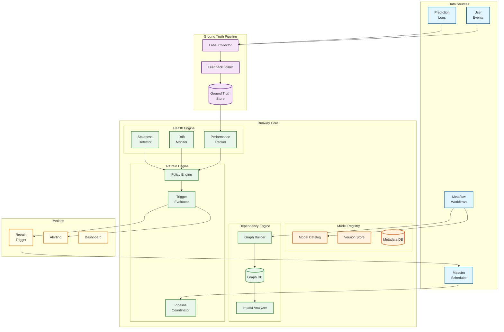
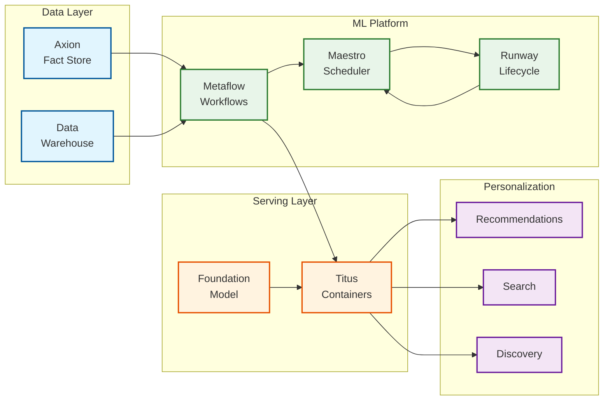
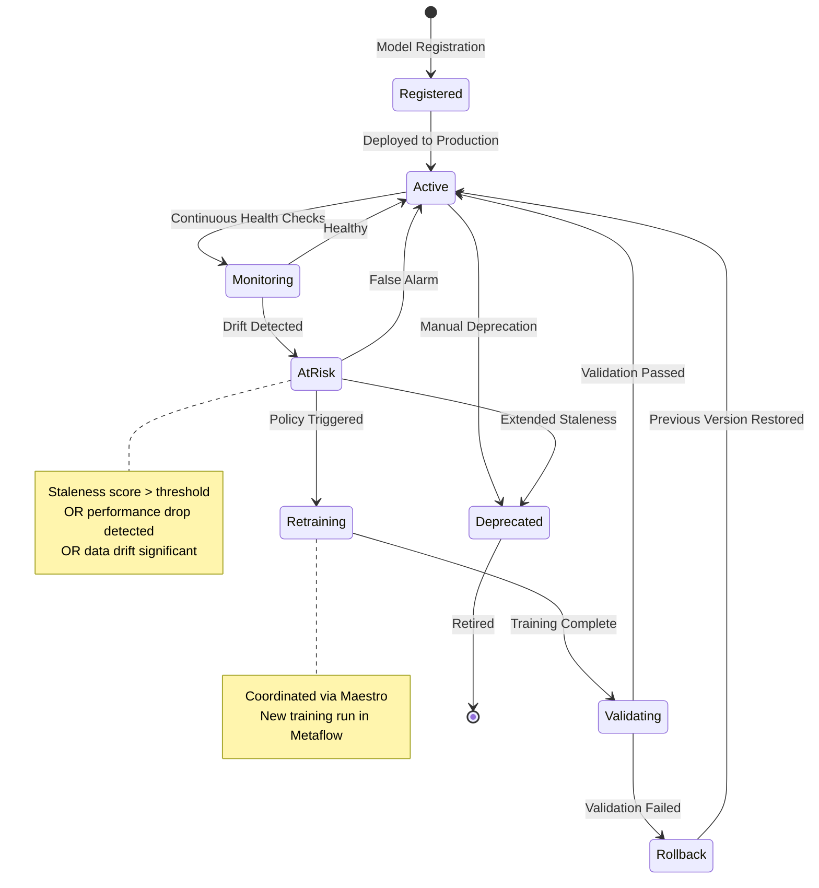

# Netflix Runway Model Lifecycle Management

## Overview

**Netflix Runway** is a model lifecycle management system responsible for managing the health and freshness of all ML models driving Netflix personalization. Presented at USENIX OpML '20 by Eugen Cepoi and Liping Peng from Netflix's Personalization Infrastructure team, Runway addresses the critical challenge of maintaining hundreds of production ML models over time - detecting when models become stale, discovering dependencies between models, collecting ground truth for performance measurement, and automatically triggering retraining when needed.

**Key Differentiator:** While Metaflow handles "how to run" ML pipelines and Maestro handles "when to run" them, Runway focuses on "what is the health of deployed models" - the post-deployment lifecycle that determines whether a model is still serving its purpose effectively.

---

## System Characteristics

| Characteristic | Value | Implication |
|----------------|-------|-------------|
| Traffic Pattern | Event-driven + periodic scans | Background processing, not real-time serving |
| Latency Sensitivity | Low (async operations) | Optimize for accuracy over speed |
| Consistency Model | Eventual (metrics), Strong (registry) | Daily aggregations acceptable for drift metrics |
| Availability Target | 99.9% for Model Registry | Staleness detection can tolerate brief delays |
| State Management | Event-sourced | Full audit trail of model state transitions |
| Scale Target | 500+ models, 100K+ workflows | Graph with thousands of dependency edges |

---

## Complexity Rating

| Component | Rating | Justification |
|-----------|--------|---------------|
| **Overall** | High | Combines graph-based dependency tracking with statistical drift detection algorithms |
| Model Registry | Medium | CRUD operations with versioning, lineage tracking, and policy management |
| Dependency Graph Engine | High | DAG construction, cycle detection, impact analysis, auto-discovery |
| Staleness Detection | Very High | Multi-signal drift detection (PSI, KL divergence, performance), statistical rigor |
| Ground Truth Collection | High | Delayed label handling, streaming/batch joins, attribution windows |
| Auto-Retraining Engine | High | Policy evaluation, trigger coordination, cascade management |
| Maestro Integration | Medium | Event-driven workflow triggering, status synchronization |

---

## Quick Navigation

| Document | Description |
|----------|-------------|
| [01 - Requirements & Estimations](./01-requirements-and-estimations.md) | Functional/non-functional requirements, capacity planning, SLOs |
| [02 - High-Level Design](./02-high-level-design.md) | Architecture diagrams, data flow, key decisions |
| [03 - Low-Level Design](./03-low-level-design.md) | Data models, APIs, algorithms (PSI, KL divergence, staleness fusion) |
| [04 - Deep Dive & Bottlenecks](./04-deep-dive-and-bottlenecks.md) | Dependency graph, ground truth pipeline, staleness engine |
| [05 - Scalability & Reliability](./05-scalability-and-reliability.md) | Scaling strategies, fault tolerance, disaster recovery |
| [06 - Security & Compliance](./06-security-and-compliance.md) | Model governance, access control, audit logging |
| [07 - Observability](./07-observability.md) | Metrics, dashboards, drift monitoring, alerting |
| [08 - Interview Guide](./08-interview-guide.md) | 45-minute pacing, trap questions, trade-offs |

---

## Core Components

| Component | Responsibility | Key Innovation |
|-----------|----------------|----------------|
| **Model Registry** | Centralized catalog of all deployed models | Stores dependency metadata alongside versioning, not just artifacts |
| **Dependency Graph Engine** | Discover and maintain model relationships | Auto-discovery from Metaflow lineage, not manual declaration |
| **Ground Truth Collector** | Gather actual outcomes for predictions | Handles delayed labels with attribution windows |
| **Staleness Detector** | Monitor data drift, concept drift, performance decay | Multi-signal fusion with configurable policies |
| **Retraining Orchestrator** | Trigger and coordinate model retraining | Policy-based decisions, not just threshold crossings |
| **Maestro Integration** | Workflow coordination and scheduling | Event-driven triggers into existing orchestration |

---

## Architecture Overview



---

## Netflix ML Ecosystem Integration

Runway operates as part of Netflix's broader ML infrastructure:



---

## Runway vs Related Systems

| Aspect | Runway | Metaflow | Maestro | MLflow |
|--------|--------|----------|---------|--------|
| **Primary Focus** | Model lifecycle health | Workflow orchestration | Job scheduling | Experiment tracking |
| **Key Question Answered** | "Is this model still healthy?" | "How to run this pipeline?" | "When to run this job?" | "What experiments ran?" |
| **Staleness Detection** | Core feature | N/A | N/A | Limited |
| **Dependency Graph** | Yes, auto-discovered | Workflow lineage only | Job dependencies | N/A |
| **Ground Truth** | Built-in collection | N/A | N/A | Manual logging |
| **Auto-Retraining** | Policy-based triggers | Manual | Schedule-based | N/A |
| **Integration** | Consumes Metaflow/Maestro | Standalone | Standalone | Standalone |

---

## Key Numbers

| Metric | Value | Context |
|--------|-------|---------|
| Netflix subscribers | 300M+ | Global personalization at scale |
| Production models | 500+ | Personalization, discovery, search |
| Metaflow projects | 3,000+ | Training pipelines generating models |
| Daily predictions | Billions | Ground truth collection volume |
| Recommendation contribution | 80%+ | Of all viewing hours |
| Foundation model refresh | Daily | Fine-tuning with embedding stability |
| Maestro workflows | 100K+ | Concurrent workflow capacity |

---

## Model Lifecycle States



---

## Interview Readiness Checklist

- [ ] Explain the difference between Runway (lifecycle) and Metaflow (workflow)
- [ ] Understand dependency graph construction from pipeline lineage
- [ ] Know staleness detection techniques (PSI, KL divergence, performance drift)
- [ ] Describe ground truth collection challenges with delayed labels
- [ ] Explain auto-retraining policy engine vs simple threshold triggers
- [ ] Know how cascading staleness is detected via dependency graph
- [ ] Understand embedding stability challenges for foundation models
- [ ] Describe trade-offs: accuracy vs latency in staleness detection
- [ ] Know integration patterns with Maestro for retraining coordination
- [ ] Explain canary deployments and rollback strategies for retrained models

---

## Quick Reference Card

```
+-----------------------------------------------------------------------+
|          NETFLIX RUNWAY - QUICK REFERENCE                              |
+-----------------------------------------------------------------------+
|                                                                        |
|  CORE COMPONENTS                   SCALE TARGETS                       |
|  ----------------                  --------------                       |
|  * Model Registry                  * 500+ registered models            |
|  * Dependency Graph Engine         * 5,000+ dependency edges           |
|  * Ground Truth Collector          * Billions of predictions/day       |
|  * Staleness Detector              * <1 hour detection latency         |
|  * Retraining Orchestrator         * 50+ concurrent retrains           |
|  * Maestro Integration             * 100K+ workflows                   |
|                                                                        |
+-----------------------------------------------------------------------+
|                                                                        |
|  STALENESS SIGNALS                 TRIGGER TYPES                       |
|  -----------------                 --------------                       |
|  * Age-based (days since train)    * Performance threshold             |
|  * Data drift (PSI on inputs)      * Drift threshold                   |
|  * Concept drift (output shift)    * Scheduled                         |
|  * Performance drop (vs baseline)  * Manual                            |
|  * Embedding instability           * Cascade (upstream stale)          |
|                                                                        |
+-----------------------------------------------------------------------+
|                                                                        |
|  INTERVIEW KEYWORDS                                                    |
|  ------------------                                                    |
|  Model registry, dependency graph, staleness detection, drift,         |
|  PSI, KL divergence, ground truth, delayed labels, auto-retraining,   |
|  policy engine, Maestro integration, cascade analysis, embedding       |
|  stability, canary deployment, rollback, model health monitoring       |
|                                                                        |
+-----------------------------------------------------------------------+
```

---

## Related Systems

- [3.4 MLOps Platform](../3.4-mlops-platform/00-index.md) - Generic MLOps patterns and concepts
- [3.5 Uber Michelangelo](../3.5-uber-michelangelo-ml-platform/00-index.md) - Feature store-centric ML platform
- [3.6 Netflix Metaflow](../3.6-netflix-metaflow-ml-workflow-platform/00-index.md) - Workflow orchestration framework
- [2.6 Distributed Job Scheduler](../2.6-distributed-job-scheduler/00-index.md) - General scheduling patterns
- [1.18 Event Sourcing System](../1.18-event-sourcing-system/00-index.md) - Event-driven state management

---

## References

- [Runway - Model Lifecycle Management at Netflix | USENIX OpML '20](https://www.usenix.org/conference/opml20/presentation/cepoi) - Original presentation
- [Supporting Diverse ML Systems at Netflix](https://netflixtechblog.com/supporting-diverse-ml-systems-at-netflix-2d2e6b6d205d) - ML platform overview
- [ML Observability at Netflix](https://netflixtechblog.com/ml-observability-bring-transparency-to-payments-and-beyond-33073e260a38) - Monitoring practices
- [Maestro: Netflix's Workflow Orchestrator](https://netflixtechblog.com/maestro-netflixs-workflow-orchestrator-ee13a06f9c78) - Scheduler integration
- [Evolution of ML Fact Store (Axion)](https://netflixtechblog.com/evolution-of-ml-fact-store-5941d3231762) - Training-serving consistency
- [Foundation Model for Personalized Recommendation](https://netflixtechblog.com/foundation-model-for-personalized-recommendation-1a0bd8e02d39) - Unified model approach
- [Integrating Netflix's Foundation Model](https://netflixtechblog.medium.com/integrating-netflixs-foundation-model-into-personalization-applications-cf176b5860eb) - Embedding stability
- [Netflix Maestro GitHub](https://github.com/Netflix/maestro) - Open-source orchestrator
