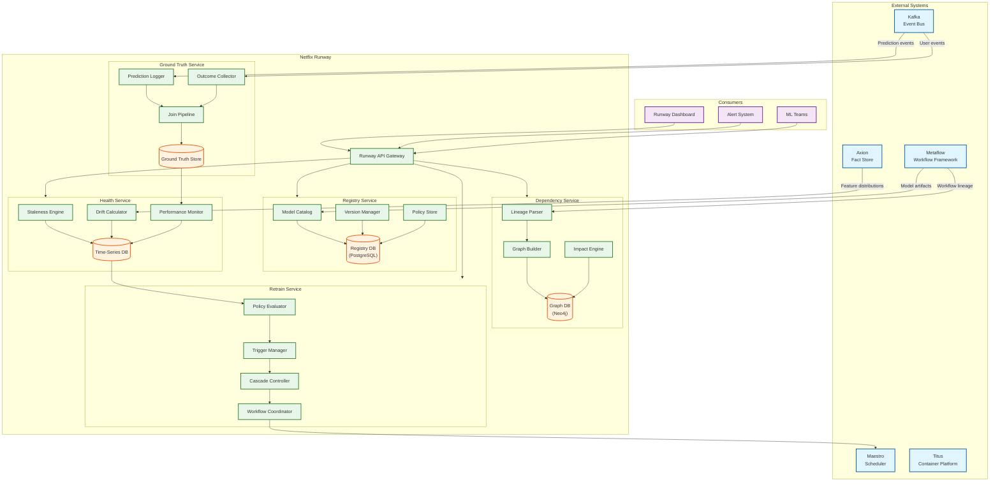
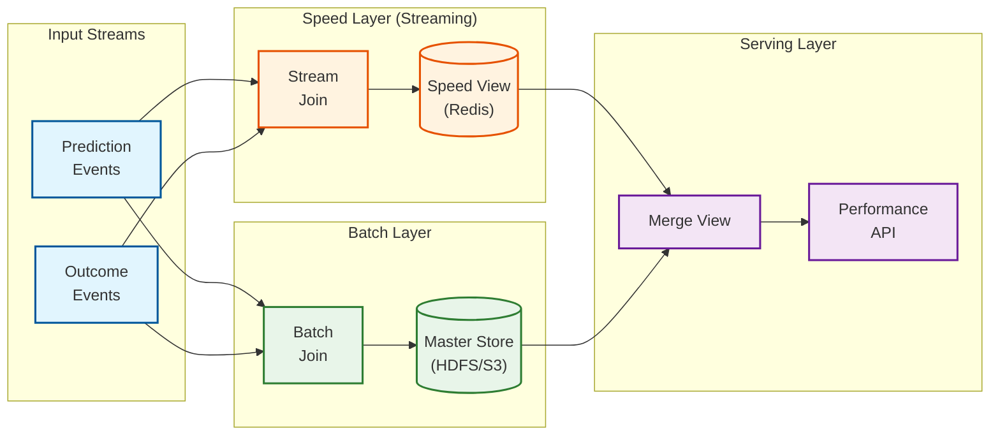
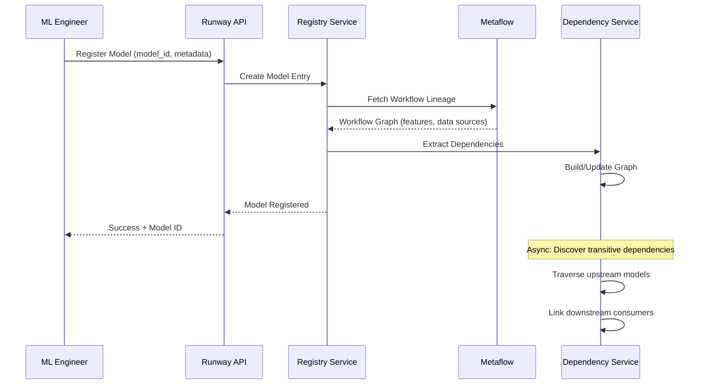
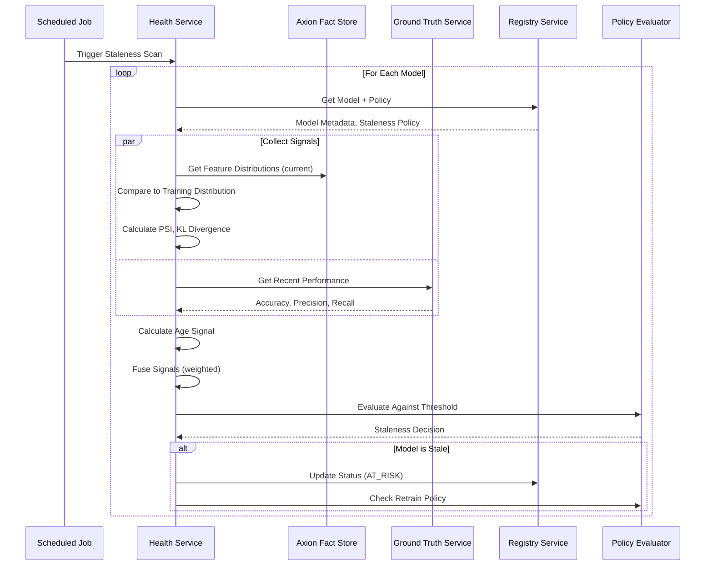
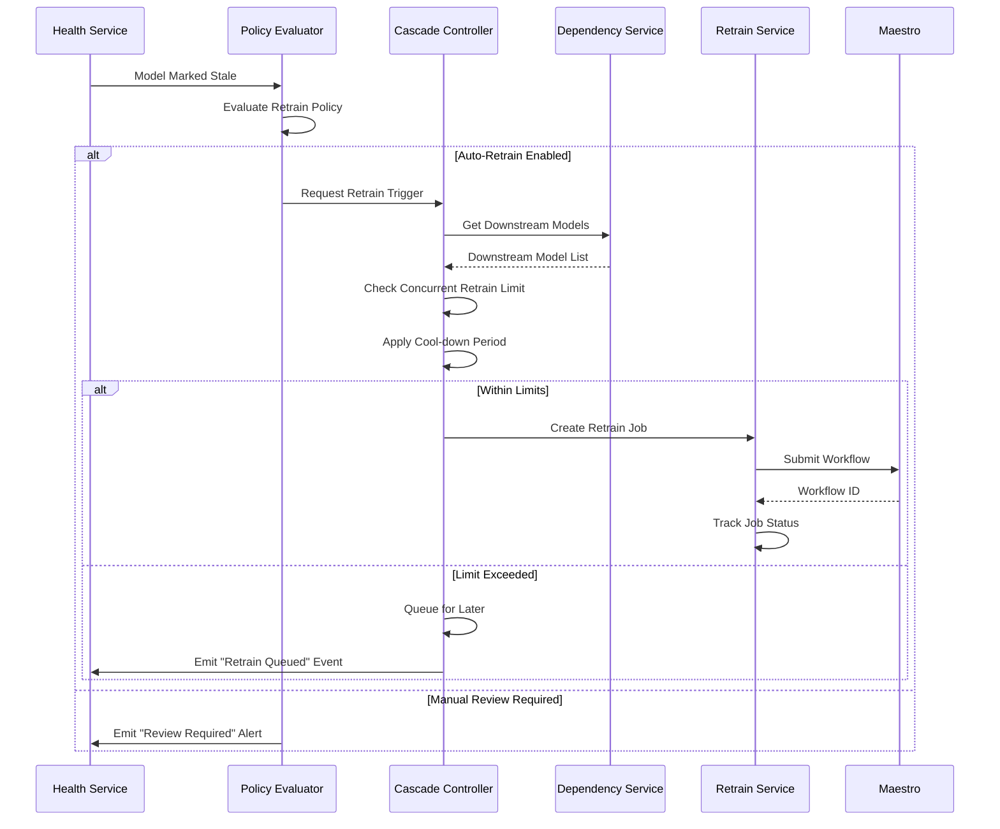
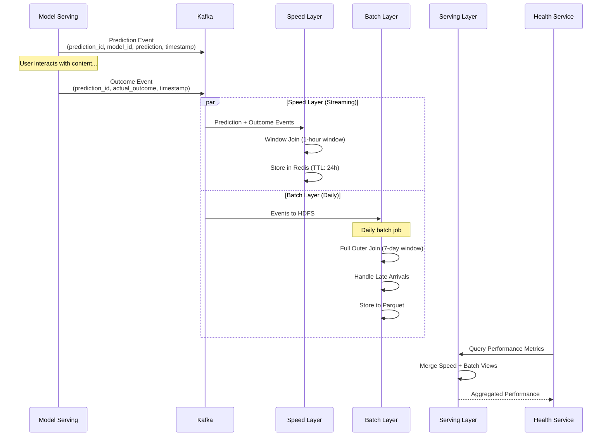
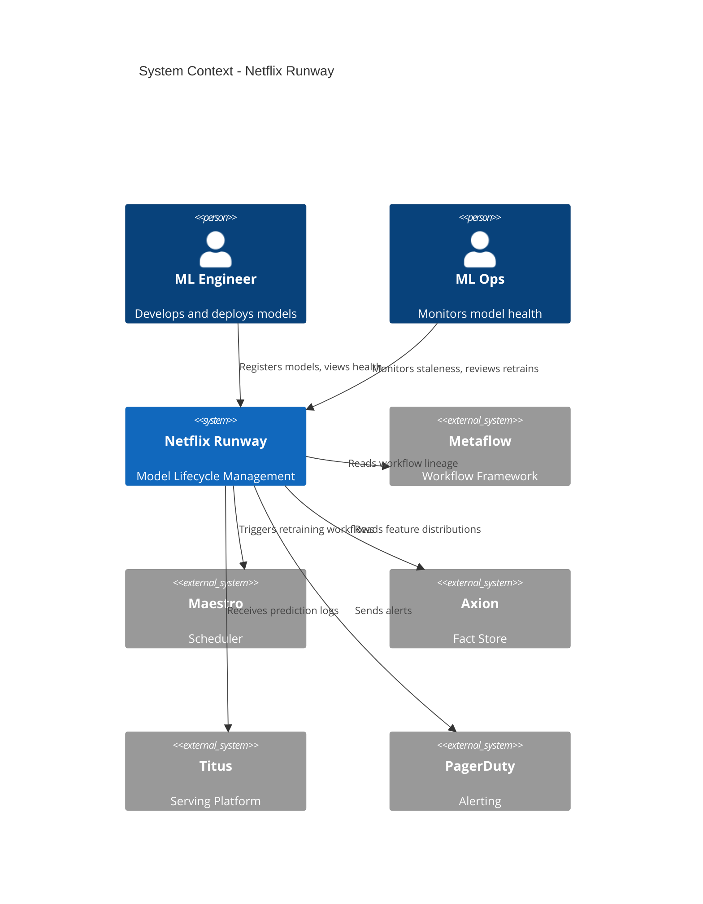

# High-Level Design

## Architecture Overview

Netflix Runway consists of five core subsystems that work together to manage model lifecycle:



---

## Key Architectural Decisions

### Decision 1: Separate Services vs Monolith

| Option | Pros | Cons |
|--------|------|------|
| **Monolith** | Simple deployment, shared state | Hard to scale independently |
| **Microservices** | Independent scaling, team ownership | Complexity, network calls |

**Decision: Domain-based Services (5 services)**

- Registry, Dependency, Health, Ground Truth, and Retrain services
- Each service owns its data store
- Services communicate via Kafka events + synchronous API for queries
- Rationale: Different scaling requirements (ground truth is write-heavy, registry is read-heavy)

### Decision 2: Dependency Storage

| Option | Pros | Cons |
|--------|------|------|
| **Relational (PostgreSQL)** | ACID, familiar | Poor graph traversal |
| **Graph Database (Neo4j)** | Native graph queries, fast traversal | Additional infrastructure |
| **Document Store** | Flexible schema | No native graph support |

**Decision: Graph Database (Neo4j/JanusGraph)**

- Dependencies are inherently a graph: models -> features -> data sources
- Impact analysis requires multi-hop traversal
- Cypher queries naturally express upstream/downstream relationships
- Rationale: Graph queries like "find all models affected by this feature change" are core operations

### Decision 3: Ground Truth Architecture

| Option | Pros | Cons |
|--------|------|------|
| **Batch Only** | Simple, accurate | High latency (24h+) |
| **Streaming Only** | Low latency | Complex, potential accuracy issues |
| **Lambda Architecture** | Best of both | Dual pipeline complexity |

**Decision: Lambda Architecture (Streaming + Batch)**



- Speed layer: Approximate ground truth within hours for fast feedback
- Batch layer: Accurate ground truth with late-arriving labels
- Serving layer: Merges both views, prefers batch when available
- Rationale: Some signals need fast feedback, but accuracy matters for retraining decisions

### Decision 4: Staleness Detection Approach

| Option | Pros | Cons |
|--------|------|------|
| **Single Metric (Age)** | Simple | Misses performance issues |
| **Single Metric (Performance)** | Direct measure | Delayed feedback |
| **Multi-Signal Fusion** | Comprehensive | Complex thresholding |

**Decision: Multi-Signal Fusion with Configurable Policies**

- Combine age, data drift (PSI), concept drift (KL), and performance metrics
- Each model defines a staleness policy with weighted signals
- Policy engine evaluates composite staleness score
- Rationale: Different models have different staleness profiles; one-size-fits-all doesn't work

### Decision 5: Retraining Coordination

| Option | Pros | Cons |
|--------|------|------|
| **Direct Metaflow Trigger** | Simple | Bypasses scheduling |
| **Maestro Integration** | Unified scheduling, resource management | Additional dependency |
| **Custom Scheduler** | Full control | Duplicate functionality |

**Decision: Maestro Integration**

- Runway evaluates retraining policies and creates trigger requests
- Maestro handles actual workflow scheduling and resource allocation
- Benefits from Maestro's queue management, priority, and SLO enforcement
- Rationale: Maestro already handles 100K+ workflows; no need to rebuild scheduling

---

## Data Flow

### Model Registration Flow



### Staleness Detection Flow



### Retraining Trigger Flow



### Ground Truth Collection Flow



---

## Component Responsibilities

### Registry Service

| Component | Responsibility |
|-----------|---------------|
| **Model Catalog** | CRUD operations for model metadata, search, listing |
| **Version Manager** | Track model versions, artifacts, training runs |
| **Policy Store** | Store staleness and retrain policies per model |
| **Registry DB** | Persistent storage (PostgreSQL) |

### Dependency Service

| Component | Responsibility |
|-----------|---------------|
| **Lineage Parser** | Extract dependencies from Metaflow workflow metadata |
| **Graph Builder** | Construct and update dependency graph |
| **Impact Engine** | Compute upstream/downstream impact analysis |
| **Graph DB** | Store dependency relationships (Neo4j) |

### Health Service

| Component | Responsibility |
|-----------|---------------|
| **Staleness Engine** | Orchestrate periodic staleness checks |
| **Drift Calculator** | Compute PSI, KL divergence from distributions |
| **Performance Monitor** | Track model accuracy, precision, recall over time |
| **Metrics DB** | Time-series storage for historical metrics |

### Ground Truth Service

| Component | Responsibility |
|-----------|---------------|
| **Prediction Logger** | Capture predictions from serving layer |
| **Outcome Collector** | Capture user behavior/outcomes |
| **Join Pipeline** | Match predictions to outcomes |
| **Ground Truth DB** | Store joined prediction-outcome pairs |

### Retrain Service

| Component | Responsibility |
|-----------|---------------|
| **Policy Evaluator** | Evaluate retrain policies against staleness signals |
| **Trigger Manager** | Create and track retrain job requests |
| **Cascade Controller** | Prevent cascading retrains, manage queue |
| **Workflow Coordinator** | Interface with Maestro for execution |

---

## Architecture Pattern Checklist

| Pattern | Decision | Rationale |
|---------|----------|-----------|
| Sync vs Async | **Both** | Sync for queries, async for events (Kafka) |
| Event-driven vs Request-response | **Event-driven** for data flow | Predictions/outcomes flow as events |
| Push vs Pull | **Pull** for staleness, **Push** for alerts | Scheduled scans + event-driven notifications |
| Stateless vs Stateful | **Stateless services** | State in databases, services horizontally scalable |
| Read-heavy vs Write-heavy | **Read-heavy** (Registry), **Write-heavy** (Ground Truth) | Different scaling per service |
| Real-time vs Batch | **Both** (Lambda architecture) | Speed layer + batch layer for ground truth |
| Edge vs Origin | **Origin only** | Lifecycle management is centralized |

---

## Integration Points

### Metaflow Integration

```
Direction: Runway <- Metaflow (read)
Data: Workflow lineage, model artifacts, training metadata
Method: Metaflow Metadata Service API
Frequency: On model registration, on workflow completion
```

### Maestro Integration

```
Direction: Runway -> Maestro (write)
Data: Retrain workflow triggers
Method: Maestro REST API
Frequency: On retrain decision (avg 25/day)
```

### Axion Integration

```
Direction: Runway <- Axion (read)
Data: Feature distributions (current production)
Method: Axion Query API
Frequency: Hourly for drift calculation
```

### Kafka Integration

```
Topics:
  - runway.predictions: Prediction events from serving
  - runway.outcomes: User behavior/outcome events
  - runway.staleness: Staleness status changes
  - runway.retrains: Retrain trigger events

Consumer Groups:
  - runway-ground-truth: Consumes predictions + outcomes
  - runway-alerts: Consumes staleness events
```

---

## Failure Scenarios and Handling

| Scenario | Impact | Handling |
|----------|--------|----------|
| Metaflow unavailable | Cannot register new models | Queue registrations, retry with backoff |
| Maestro unavailable | Cannot trigger retrains | Queue triggers, alert ops, manual fallback |
| Graph DB unavailable | No dependency queries | Serve from cache, degrade to model-only view |
| Ground Truth pipeline lag | Delayed performance metrics | Fall back to drift-only staleness |
| Kafka consumer lag | Delayed ground truth | Monitor lag, scale consumers |

---

## System Context Diagram


