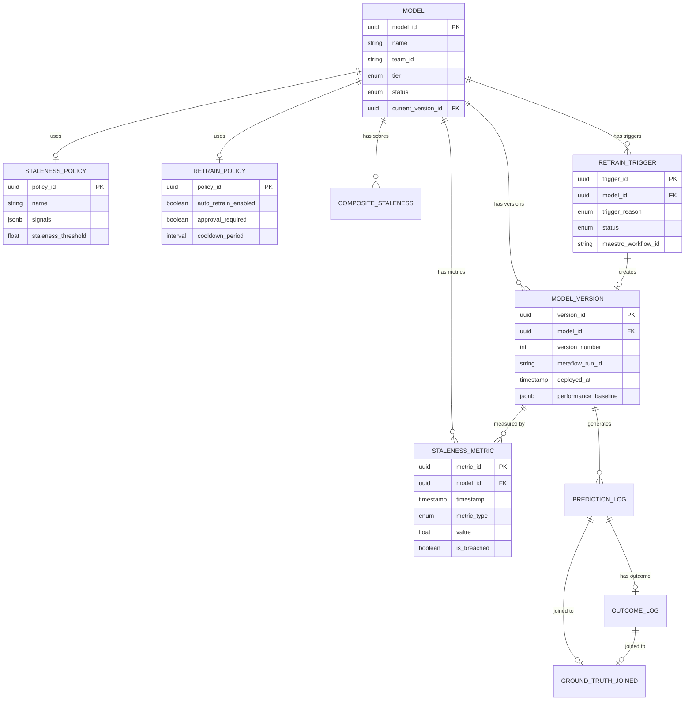

# Low-Level Design

## Data Models

### Model Registry Schema

```
MODEL
├── model_id (PK)           : UUID         # Unique identifier
├── name                    : VARCHAR(255) # Human-readable name
├── description             : TEXT         # Model purpose
├── team_id                 : VARCHAR(100) # Owning team
├── tier                    : ENUM         # tier_1, tier_2, tier_3, tier_4
├── type                    : ENUM         # ranker, classifier, regressor, embedding
├── created_at              : TIMESTAMP
├── updated_at              : TIMESTAMP
├── current_version_id (FK) : UUID         # Active production version
├── staleness_policy_id (FK): UUID         # Staleness detection config
├── retrain_policy_id (FK)  : UUID         # Auto-retrain config
├── status                  : ENUM         # registered, active, at_risk, retraining, deprecated
└── metadata                : JSONB        # Extensible properties

MODEL_VERSION
├── version_id (PK)         : UUID
├── model_id (FK)           : UUID
├── version_number          : INTEGER      # Sequential version
├── metaflow_run_id         : VARCHAR(100) # Training workflow run
├── artifact_path           : VARCHAR(500) # Storage path (S3/GCS)
├── created_at              : TIMESTAMP
├── deployed_at             : TIMESTAMP    # When promoted to production
├── retired_at              : TIMESTAMP    # When replaced (nullable)
├── training_data_snapshot  : VARCHAR(100) # Data version used for training
├── training_features       : JSONB        # Feature list with versions
├── performance_baseline    : JSONB        # Metrics at deployment
├── embedding_signature     : VARCHAR(64)  # Hash for stability tracking
└── validation_results      : JSONB        # Training validation metrics

STALENESS_POLICY
├── policy_id (PK)          : UUID
├── name                    : VARCHAR(255)
├── signals                 : JSONB        # Signal weights and thresholds
│   └── {
│         "age": {"weight": 0.2, "max_days": 30},
│         "data_drift": {"weight": 0.3, "psi_threshold": 0.25},
│         "concept_drift": {"weight": 0.3, "kl_threshold": 0.1},
│         "performance": {"weight": 0.2, "drop_threshold": 0.05}
│       }
├── staleness_threshold     : FLOAT        # Composite score threshold (0-1)
├── evaluation_frequency    : INTERVAL     # How often to check
└── created_at              : TIMESTAMP

RETRAIN_POLICY
├── policy_id (PK)          : UUID
├── name                    : VARCHAR(255)
├── auto_retrain_enabled    : BOOLEAN
├── approval_required       : BOOLEAN      # Human-in-loop for Tier 1
├── max_concurrent_retrains : INTEGER      # Per model limit
├── cooldown_period         : INTERVAL     # Min time between retrains
├── canary_percentage       : FLOAT        # Initial rollout %
├── rollback_threshold      : FLOAT        # Auto-rollback performance drop
└── created_at              : TIMESTAMP
```

### Dependency Graph Schema (Neo4j)

```
NODE: Model
├── model_id               : String (PK)
├── name                   : String
├── team_id                : String
├── status                 : String
└── type                   : String

NODE: Feature
├── feature_id             : String (PK)
├── name                   : String
├── source_system          : String
└── data_type              : String

NODE: DataSource
├── source_id              : String (PK)
├── name                   : String
├── type                   : String     # table, stream, api
└── location               : String

RELATIONSHIP: DEPENDS_ON (Model -> Model)
├── dependency_type        : String     # input, embedding, ensemble
├── discovered_at          : DateTime
└── discovery_method       : String     # auto, manual

RELATIONSHIP: USES_FEATURE (Model -> Feature)
├── feature_version        : String
├── is_required            : Boolean
└── discovered_at          : DateTime

RELATIONSHIP: CONSUMES (Model -> DataSource)
├── consumption_type       : String     # training, inference
└── discovered_at          : DateTime

RELATIONSHIP: PRODUCES (Model -> Feature)
├── feature_version        : String
└── created_at             : DateTime
```

### Staleness Metrics Schema (Time-Series)

```
STALENESS_METRIC
├── metric_id (PK)          : UUID
├── model_id (FK)           : UUID
├── version_id (FK)         : UUID
├── timestamp               : TIMESTAMP
├── metric_type             : ENUM        # age, psi, kl_divergence, performance
├── value                   : FLOAT
├── threshold               : FLOAT       # From policy
├── is_breached             : BOOLEAN
├── details                 : JSONB       # Feature-level breakdown
│   └── {
│         "feature_contributions": {
│           "user_age": 0.12,
│           "watch_history": 0.08
│         }
│       }
└── evaluation_duration_ms  : INTEGER

COMPOSITE_STALENESS
├── record_id (PK)          : UUID
├── model_id (FK)           : UUID
├── timestamp               : TIMESTAMP
├── staleness_score         : FLOAT       # Weighted composite (0-1)
├── signal_scores           : JSONB       # Individual signal values
├── is_stale                : BOOLEAN
├── policy_id (FK)          : UUID
└── triggered_retrain       : BOOLEAN
```

### Ground Truth Schema

```
PREDICTION_LOG
├── prediction_id (PK)      : UUID
├── model_id (FK)           : UUID
├── version_id (FK)         : UUID
├── member_id               : VARCHAR(50) # Hashed user identifier
├── context_id              : VARCHAR(100)# Request context
├── prediction_timestamp    : TIMESTAMP
├── prediction_value        : JSONB       # Model output
├── confidence_score        : FLOAT
├── features_hash           : VARCHAR(64) # For reproducibility
└── partition_date          : DATE        # For efficient queries

OUTCOME_LOG
├── outcome_id (PK)         : UUID
├── prediction_id (FK)      : UUID
├── outcome_timestamp       : TIMESTAMP
├── outcome_value           : JSONB       # Actual result
├── outcome_type            : ENUM        # click, watch, purchase, explicit
├── label_delay_seconds     : INTEGER     # Time from prediction to outcome
└── partition_date          : DATE

GROUND_TRUTH_JOINED
├── record_id (PK)          : UUID
├── prediction_id           : UUID
├── model_id (FK)           : UUID
├── prediction_timestamp    : TIMESTAMP
├── prediction_value        : JSONB
├── outcome_value           : JSONB
├── outcome_timestamp       : TIMESTAMP
├── is_correct              : BOOLEAN     # Computed correctness
├── join_source             : ENUM        # speed_layer, batch_layer
├── partition_date          : DATE
└── created_at              : TIMESTAMP
```

### Retrain Job Schema

```
RETRAIN_TRIGGER
├── trigger_id (PK)         : UUID
├── model_id (FK)           : UUID
├── version_id (FK)         : UUID        # Version being replaced
├── triggered_at            : TIMESTAMP
├── trigger_reason          : ENUM        # drift, performance, schedule, manual, cascade
├── trigger_details         : JSONB       # Staleness metrics at trigger time
├── policy_id (FK)          : UUID
├── requested_by            : VARCHAR(100)# User or "system"
├── status                  : ENUM        # pending, queued, running, validating, completed, failed, rolled_back
├── maestro_workflow_id     : VARCHAR(100)
├── new_version_id (FK)     : UUID        # Created version (nullable)
├── validation_results      : JSONB
├── completed_at            : TIMESTAMP
└── error_message           : TEXT
```

---

## Entity Relationship Diagram



---

## API Design

### Model Registry API

```yaml
# Register a new model
POST /api/v1/models
Request:
  name: string (required)
  description: string
  team_id: string (required)
  tier: enum [tier_1, tier_2, tier_3, tier_4]
  type: enum [ranker, classifier, regressor, embedding]
  staleness_policy_id: uuid
  retrain_policy_id: uuid
  metadata: object
Response:
  model_id: uuid
  created_at: timestamp

# Get model details
GET /api/v1/models/{model_id}
Response:
  model_id: uuid
  name: string
  team_id: string
  tier: enum
  status: enum
  current_version: object
  staleness_policy: object
  retrain_policy: object

# List models with filters
GET /api/v1/models?team_id={team}&status={status}&tier={tier}
Response:
  models: array
  total_count: integer
  pagination: object

# Update model
PATCH /api/v1/models/{model_id}
Request:
  staleness_policy_id: uuid
  retrain_policy_id: uuid
  status: enum
Response:
  model_id: uuid
  updated_at: timestamp

# Register new model version
POST /api/v1/models/{model_id}/versions
Request:
  metaflow_run_id: string (required)
  artifact_path: string (required)
  training_data_snapshot: string
  training_features: object
Response:
  version_id: uuid
  version_number: integer

# Promote version to production
POST /api/v1/models/{model_id}/versions/{version_id}/deploy
Request:
  canary_percentage: float (optional, default from policy)
Response:
  deployment_id: uuid
  status: enum
```

### Dependency API

```yaml
# Get model dependencies
GET /api/v1/dependencies/models/{model_id}
Query Params:
  direction: enum [upstream, downstream, both]
  depth: integer (default: 2, max: 5)
Response:
  model_id: uuid
  upstream_models: array
  downstream_models: array
  features: array
  data_sources: array

# Get impact analysis
GET /api/v1/dependencies/models/{model_id}/impact
Response:
  affected_models: array
    - model_id: uuid
      name: string
      impact_type: enum [direct, transitive]
      path_length: integer
  total_affected: integer

# Add manual dependency
POST /api/v1/dependencies
Request:
  source_type: enum [model, feature, data_source]
  source_id: string
  target_type: enum [model, feature, data_source]
  target_id: string
  dependency_type: string
Response:
  edge_id: uuid
  created_at: timestamp

# Refresh dependencies from lineage
POST /api/v1/dependencies/models/{model_id}/refresh
Response:
  edges_added: integer
  edges_removed: integer
  last_refresh: timestamp
```

### Health API

```yaml
# Get model health status
GET /api/v1/health/models/{model_id}
Response:
  model_id: uuid
  status: enum [healthy, at_risk, stale, unknown]
  staleness_score: float
  signals:
    age_days: integer
    data_drift_psi: float
    concept_drift_kl: float
    performance_drop: float
  last_evaluated: timestamp
  next_evaluation: timestamp

# Get historical staleness metrics
GET /api/v1/health/models/{model_id}/metrics
Query Params:
  start_time: timestamp
  end_time: timestamp
  metric_type: enum [all, psi, kl, performance, age]
Response:
  model_id: uuid
  metrics: array
    - timestamp: timestamp
      metric_type: string
      value: float
      threshold: float
      is_breached: boolean

# Get model performance
GET /api/v1/health/models/{model_id}/performance
Query Params:
  start_time: timestamp
  end_time: timestamp
  granularity: enum [hourly, daily, weekly]
Response:
  model_id: uuid
  metrics:
    accuracy: array
    precision: array
    recall: array
    auc: array
  ground_truth_coverage: float
```

### Retrain API

```yaml
# Trigger manual retrain
POST /api/v1/retrain/models/{model_id}
Request:
  reason: string
  priority: enum [low, normal, high]
Response:
  trigger_id: uuid
  status: enum
  queued_position: integer

# Get retrain status
GET /api/v1/retrain/triggers/{trigger_id}
Response:
  trigger_id: uuid
  model_id: uuid
  status: enum
  trigger_reason: enum
  triggered_at: timestamp
  maestro_workflow_id: string
  validation_results: object
  new_version_id: uuid

# List retrain history
GET /api/v1/retrain/models/{model_id}/history
Query Params:
  status: enum
  limit: integer
Response:
  triggers: array
  total_count: integer

# Approve pending retrain (Tier 1 models)
POST /api/v1/retrain/triggers/{trigger_id}/approve
Request:
  approved_by: string
  comment: string
Response:
  trigger_id: uuid
  status: enum

# Rollback to previous version
POST /api/v1/retrain/models/{model_id}/rollback
Request:
  target_version_id: uuid (optional, defaults to previous)
  reason: string
Response:
  rollback_id: uuid
  status: enum
```

---

## Core Algorithms

### Algorithm 1: PSI (Population Stability Index) Calculation

PSI measures distribution shift between training and current production data.

```
FUNCTION CalculatePSI(training_distribution, current_distribution, num_bins):
    """
    Calculate Population Stability Index for distribution drift detection.
    PSI < 0.1: No significant shift
    PSI 0.1-0.25: Moderate shift, monitor
    PSI > 0.25: Significant shift, investigate/retrain

    Time Complexity: O(n) where n is number of data points
    Space Complexity: O(b) where b is number of bins
    """

    INPUT:
        training_distribution: Array of values from training data
        current_distribution: Array of values from production data
        num_bins: Number of bins for discretization (default: 10)

    OUTPUT:
        psi_value: Float (0 to infinity, typically < 1)
        bin_contributions: Array of per-bin PSI contributions

    ALGORITHM:
        // Step 1: Create bins from training distribution
        bins = CreateQuantileBins(training_distribution, num_bins)

        // Step 2: Calculate percentage in each bin for training
        training_percentages = []
        FOR each bin IN bins:
            count = CountValuesInBin(training_distribution, bin)
            percentage = count / Length(training_distribution)
            training_percentages.Append(Max(percentage, 0.0001))  // Avoid division by zero

        // Step 3: Calculate percentage in each bin for current
        current_percentages = []
        FOR each bin IN bins:
            count = CountValuesInBin(current_distribution, bin)
            percentage = count / Length(current_distribution)
            current_percentages.Append(Max(percentage, 0.0001))

        // Step 4: Calculate PSI
        psi_value = 0
        bin_contributions = []

        FOR i FROM 0 TO num_bins - 1:
            train_pct = training_percentages[i]
            curr_pct = current_percentages[i]

            contribution = (curr_pct - train_pct) * Ln(curr_pct / train_pct)
            bin_contributions.Append(contribution)
            psi_value += contribution

        RETURN psi_value, bin_contributions

FUNCTION CreateQuantileBins(distribution, num_bins):
    sorted_values = Sort(distribution)
    bin_edges = []

    FOR i FROM 0 TO num_bins:
        percentile = i / num_bins
        index = Floor(percentile * (Length(sorted_values) - 1))
        bin_edges.Append(sorted_values[index])

    RETURN bin_edges
```

### Algorithm 2: KL Divergence for Concept Drift

```
FUNCTION CalculateKLDivergence(P, Q):
    """
    Calculate KL Divergence between two probability distributions.
    Measures how distribution P diverges from reference distribution Q.
    KL(P||Q) = 0 means distributions are identical.

    Time Complexity: O(n)
    Space Complexity: O(1)
    """

    INPUT:
        P: Current distribution (array of probabilities, sum to 1)
        Q: Reference distribution (array of probabilities, sum to 1)

    OUTPUT:
        kl_divergence: Float (0 to infinity)

    PRECONDITION:
        Length(P) == Length(Q)
        Sum(P) ≈ 1.0
        Sum(Q) ≈ 1.0

    ALGORITHM:
        kl_divergence = 0
        epsilon = 1e-10  // Smoothing to avoid log(0)

        FOR i FROM 0 TO Length(P) - 1:
            p_i = Max(P[i], epsilon)
            q_i = Max(Q[i], epsilon)

            kl_divergence += p_i * Ln(p_i / q_i)

        RETURN kl_divergence

FUNCTION CalculateSymmetricKL(P, Q):
    """
    Symmetric version: average of KL(P||Q) and KL(Q||P)
    """
    RETURN (CalculateKLDivergence(P, Q) + CalculateKLDivergence(Q, P)) / 2
```

### Algorithm 3: Staleness Score Fusion

```
FUNCTION CalculateStalenessScore(model, policy):
    """
    Calculate composite staleness score from multiple signals.

    Time Complexity: O(f) where f is number of features for drift
    Space Complexity: O(s) where s is number of signals
    """

    INPUT:
        model: Model object with current metrics
        policy: StalenessPolicy with signal weights and thresholds

    OUTPUT:
        staleness_score: Float (0 to 1)
        is_stale: Boolean
        signal_breakdown: Dict of individual signal scores

    ALGORITHM:
        signal_scores = {}

        // Signal 1: Age-based staleness
        days_since_retrain = DaysBetween(model.last_retrained, Now())
        max_age = policy.signals.age.max_days
        signal_scores["age"] = Min(1.0, days_since_retrain / max_age)

        // Signal 2: Data drift (PSI on input features)
        IF model.has_feature_distributions:
            psi_values = []
            FOR each feature IN model.features:
                training_dist = GetTrainingDistribution(model, feature)
                current_dist = GetCurrentDistribution(model, feature)
                psi, _ = CalculatePSI(training_dist, current_dist, 10)
                psi_values.Append(psi)

            // Use max PSI across features (most drifted feature)
            max_psi = Max(psi_values)
            psi_threshold = policy.signals.data_drift.psi_threshold
            signal_scores["data_drift"] = Min(1.0, max_psi / psi_threshold)
        ELSE:
            signal_scores["data_drift"] = 0  // Unknown

        // Signal 3: Concept drift (output distribution)
        IF model.has_output_distributions:
            training_output = model.training_output_distribution
            current_output = GetCurrentOutputDistribution(model)
            kl_value = CalculateSymmetricKL(training_output, current_output)
            kl_threshold = policy.signals.concept_drift.kl_threshold
            signal_scores["concept_drift"] = Min(1.0, kl_value / kl_threshold)
        ELSE:
            signal_scores["concept_drift"] = 0

        // Signal 4: Performance degradation
        IF model.has_ground_truth:
            baseline_metric = model.performance_baseline.primary_metric
            current_metric = GetCurrentPerformance(model).primary_metric

            IF baseline_metric > 0:
                drop = Max(0, (baseline_metric - current_metric) / baseline_metric)
                drop_threshold = policy.signals.performance.drop_threshold
                signal_scores["performance"] = Min(1.0, drop / drop_threshold)
            ELSE:
                signal_scores["performance"] = 0
        ELSE:
            signal_scores["performance"] = 0  // No ground truth available

        // Weighted combination
        staleness_score = 0
        total_weight = 0

        FOR signal_name, score IN signal_scores:
            weight = policy.signals[signal_name].weight
            staleness_score += weight * score
            total_weight += weight

        IF total_weight > 0:
            staleness_score = staleness_score / total_weight

        is_stale = staleness_score >= policy.staleness_threshold

        RETURN staleness_score, is_stale, signal_scores
```

### Algorithm 4: Dependency Graph Traversal (Impact Analysis)

```
FUNCTION GetDownstreamImpact(model_id, graph_db, max_depth):
    """
    Find all models that depend on the given model (directly or transitively).
    Uses BFS for level-order traversal.

    Time Complexity: O(V + E) where V is vertices, E is edges
    Space Complexity: O(V)
    """

    INPUT:
        model_id: UUID of the source model
        graph_db: Graph database connection
        max_depth: Maximum traversal depth

    OUTPUT:
        affected_models: List of (model_id, depth, path)

    ALGORITHM:
        visited = Set()
        queue = Queue()
        affected_models = []

        // Initialize with direct dependents
        queue.Enqueue((model_id, 0, [model_id]))
        visited.Add(model_id)

        WHILE NOT queue.IsEmpty():
            current_id, depth, path = queue.Dequeue()

            IF depth > 0:  // Don't include source model
                affected_models.Append({
                    "model_id": current_id,
                    "depth": depth,
                    "path": path,
                    "impact_type": "direct" IF depth == 1 ELSE "transitive"
                })

            IF depth >= max_depth:
                CONTINUE

            // Get downstream models (models that depend on current)
            query = """
                MATCH (m:Model {model_id: $current_id})<-[:DEPENDS_ON]-(dependent:Model)
                RETURN dependent.model_id AS dependent_id
            """
            dependents = graph_db.Execute(query, {current_id: current_id})

            FOR dependent IN dependents:
                IF dependent.dependent_id NOT IN visited:
                    visited.Add(dependent.dependent_id)
                    new_path = path + [dependent.dependent_id]
                    queue.Enqueue((dependent.dependent_id, depth + 1, new_path))

        RETURN affected_models

FUNCTION GetUpstreamDependencies(model_id, graph_db, max_depth):
    """
    Find all models that this model depends on.
    """
    // Similar to GetDownstreamImpact but reverse edge direction
    // MATCH (m:Model {model_id: $id})-[:DEPENDS_ON]->(upstream:Model)
```

### Algorithm 5: Delayed Label Join (Ground Truth)

```
FUNCTION JoinPredictionsWithOutcomes(predictions_stream, outcomes_stream, config):
    """
    Join prediction events with outcome events using time-windowed join.
    Handles late-arriving outcomes with configurable attribution window.

    Time Complexity: O(n log n) for sorting within windows
    Space Complexity: O(w) where w is window size
    """

    INPUT:
        predictions_stream: Stream of prediction events
        outcomes_stream: Stream of outcome events
        config: {
            attribution_window: Duration,  // e.g., 7 days
            watermark_delay: Duration,     // e.g., 1 hour
            join_keys: [prediction_id]
        }

    OUTPUT:
        joined_stream: Stream of (prediction, outcome) pairs

    ALGORITHM:
        // Maintain sliding window buffers
        prediction_buffer = TimeWindowedMap(config.attribution_window)
        pending_outcomes = TimeWindowedMap(config.attribution_window)

        // Process prediction events
        ON prediction_event FROM predictions_stream:
            prediction_buffer.Put(
                prediction_event.prediction_id,
                prediction_event,
                prediction_event.timestamp
            )

            // Check for pending outcomes
            IF pending_outcomes.Contains(prediction_event.prediction_id):
                outcome = pending_outcomes.Remove(prediction_event.prediction_id)
                EMIT JoinedRecord(prediction_event, outcome)

        // Process outcome events
        ON outcome_event FROM outcomes_stream:
            prediction_id = outcome_event.prediction_id

            IF prediction_buffer.Contains(prediction_id):
                prediction = prediction_buffer.Get(prediction_id)

                // Validate attribution window
                delay = outcome_event.timestamp - prediction.timestamp
                IF delay <= config.attribution_window:
                    EMIT JoinedRecord(prediction, outcome_event)
                ELSE:
                    // Log late arrival, optionally emit with flag
                    LogLateOutcome(prediction_id, delay)
            ELSE:
                // Outcome arrived before prediction (race condition)
                // or prediction already expired
                pending_outcomes.Put(prediction_id, outcome_event, outcome_event.timestamp)

        // Watermark handling for completeness
        ON watermark(timestamp) FROM predictions_stream:
            expired_predictions = prediction_buffer.ExpireBefore(
                timestamp - config.attribution_window - config.watermark_delay
            )

            FOR prediction IN expired_predictions:
                IF NOT prediction.has_outcome:
                    // Emit with null outcome (for coverage tracking)
                    EMIT JoinedRecord(prediction, NULL)

FUNCTION JoinedRecord(prediction, outcome):
    RETURN {
        prediction_id: prediction.prediction_id,
        model_id: prediction.model_id,
        prediction_timestamp: prediction.timestamp,
        prediction_value: prediction.value,
        outcome_value: outcome.value IF outcome ELSE NULL,
        outcome_timestamp: outcome.timestamp IF outcome ELSE NULL,
        is_correct: CalculateCorrectness(prediction.value, outcome.value) IF outcome ELSE NULL,
        label_delay_seconds: (outcome.timestamp - prediction.timestamp).seconds IF outcome ELSE NULL
    }
```

### Algorithm 6: Cascade Retrain Prevention

```
FUNCTION EvaluateRetrainRequest(model_id, trigger_reason, cascade_controller):
    """
    Evaluate whether a retrain request should proceed, considering:
    - Concurrent retrain limits
    - Cooldown periods
    - Cascade prevention

    Time Complexity: O(d) where d is dependency depth
    Space Complexity: O(n) where n is number of active retrains
    """

    INPUT:
        model_id: UUID of model to retrain
        trigger_reason: Enum (drift, performance, cascade, manual)
        cascade_controller: Controller state

    OUTPUT:
        decision: Enum (PROCEED, QUEUE, REJECT)
        reason: String

    ALGORITHM:
        model = GetModel(model_id)
        policy = model.retrain_policy

        // Check 1: Cooldown period
        last_retrain = GetLastRetrainTime(model_id)
        IF last_retrain IS NOT NULL:
            time_since_last = Now() - last_retrain
            IF time_since_last < policy.cooldown_period:
                RETURN (REJECT, "Cooldown period not elapsed")

        // Check 2: Model-level concurrent limit
        active_retrains = GetActiveRetrains(model_id)
        IF Length(active_retrains) >= policy.max_concurrent_retrains:
            RETURN (QUEUE, "Max concurrent retrains for model")

        // Check 3: System-wide concurrent limit
        total_active = cascade_controller.GetTotalActiveRetrains()
        IF total_active >= cascade_controller.max_system_concurrent:
            RETURN (QUEUE, "System capacity reached")

        // Check 4: Cascade detection
        IF trigger_reason == "cascade":
            // Count how many upstream models are currently retraining
            upstream_models = GetUpstreamDependencies(model_id, depth=2)
            retraining_upstream = 0

            FOR upstream IN upstream_models:
                IF IsRetraining(upstream.model_id):
                    retraining_upstream += 1

            // If many upstream models are retraining, wait
            IF retraining_upstream >= cascade_controller.cascade_threshold:
                RETURN (QUEUE, "Waiting for upstream retrains to complete")

        // Check 5: Approval required (Tier 1)
        IF model.tier == "tier_1" AND policy.approval_required:
            IF NOT HasApproval(model_id):
                CreateApprovalRequest(model_id, trigger_reason)
                RETURN (QUEUE, "Awaiting human approval")

        // All checks passed
        RETURN (PROCEED, "OK")

FUNCTION ProcessRetrainQueue(cascade_controller):
    """
    Process queued retrain requests in priority order.
    """
    queue = cascade_controller.GetSortedQueue()  // Sorted by priority, wait time

    FOR request IN queue:
        decision, reason = EvaluateRetrainRequest(
            request.model_id,
            request.trigger_reason,
            cascade_controller
        )

        IF decision == PROCEED:
            cascade_controller.RemoveFromQueue(request)
            TriggerRetrain(request)
        ELSE IF decision == REJECT:
            cascade_controller.RemoveFromQueue(request)
            NotifyRejection(request, reason)
        // QUEUE: Leave in queue for next iteration
```

---

## Indexing Strategy

### PostgreSQL (Registry DB)

```sql
-- Model lookup by ID (primary)
CREATE INDEX idx_models_id ON models(model_id);

-- Model search by team and status
CREATE INDEX idx_models_team_status ON models(team_id, status);

-- Model search by tier (for SLA management)
CREATE INDEX idx_models_tier ON models(tier);

-- Version lookup by model
CREATE INDEX idx_versions_model ON model_versions(model_id, version_number DESC);

-- Active version lookup
CREATE INDEX idx_versions_deployed ON model_versions(model_id, deployed_at DESC)
    WHERE retired_at IS NULL;

-- Retrain triggers by model and status
CREATE INDEX idx_triggers_model_status ON retrain_triggers(model_id, status);

-- Metrics by model and time (for time-range queries)
CREATE INDEX idx_metrics_model_time ON staleness_metrics(model_id, timestamp DESC);
```

### Neo4j (Graph DB)

```cypher
-- Model node lookup
CREATE INDEX model_id_index FOR (m:Model) ON (m.model_id);

-- Feature node lookup
CREATE INDEX feature_id_index FOR (f:Feature) ON (f.feature_id);

-- Team-based model lookup
CREATE INDEX model_team_index FOR (m:Model) ON (m.team_id);

-- Status-based filtering
CREATE INDEX model_status_index FOR (m:Model) ON (m.status);
```

### Time-Series DB (Metrics)

```
-- Partition by model_id and time
-- Retention: 1 year
-- Aggregation: Roll up hourly -> daily -> weekly after 30 days
```

---

## Data Retention Policy

| Data Type | Retention | Rationale |
|-----------|-----------|-----------|
| Model metadata | Forever | Audit trail |
| Model versions | Forever | Reproducibility |
| Staleness metrics (raw) | 90 days | Recent drift analysis |
| Staleness metrics (daily avg) | 1 year | Long-term trends |
| Ground truth (raw) | 90 days | Performance calculation |
| Ground truth (aggregated) | 1 year | Historical performance |
| Retrain triggers | 2 years | Compliance, analysis |
| Dependency graph | Forever | Historical lineage |
