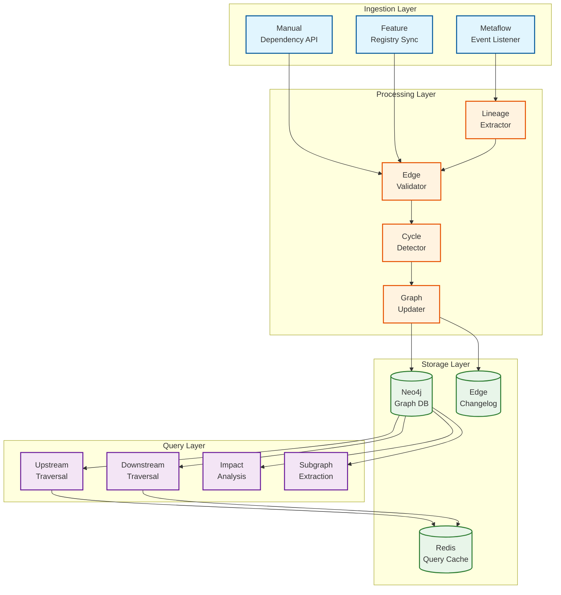
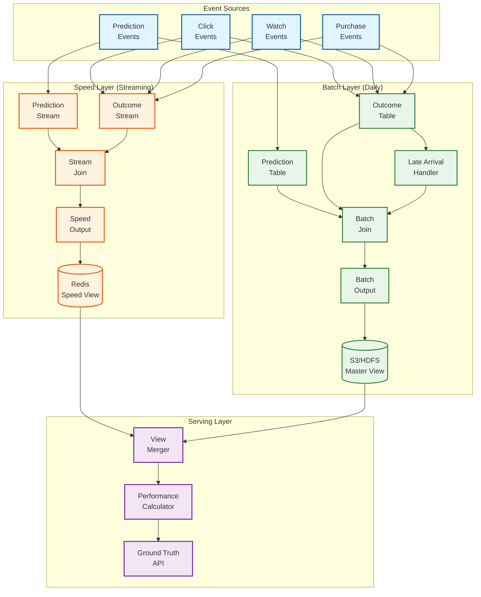
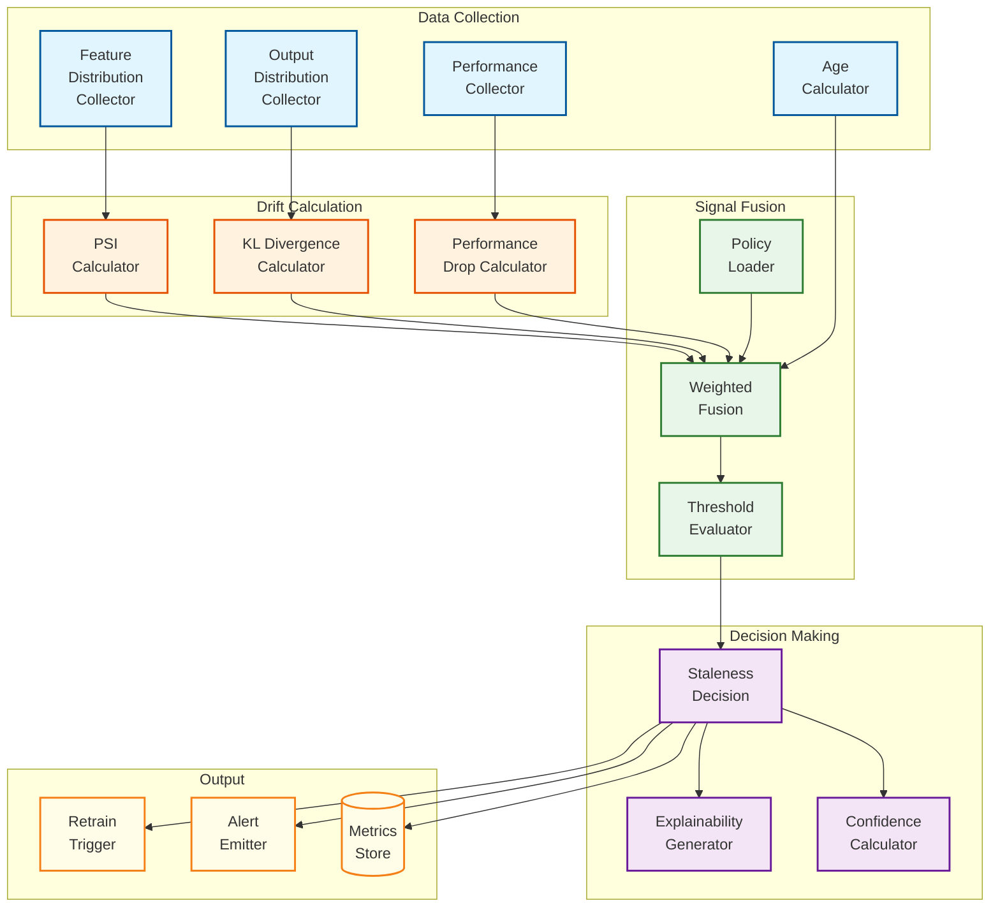

# Deep Dive & Bottlenecks

## Critical Component 1: Dependency Graph Engine

### Why This Component is Critical

The Dependency Graph Engine is the backbone of Runway's impact analysis and cascade detection capabilities. It enables:

1. **Impact Analysis**: When a model changes, understand what downstream models are affected
2. **Cascade Staleness**: If an upstream model becomes stale, propagate staleness to dependents
3. **Feature Lineage**: Track which features flow into which models
4. **Root Cause Analysis**: When a model degrades, trace back to potential upstream causes

### Internal Architecture



### How It Works Internally

**1. Lineage Extraction from Metaflow**

When a Metaflow workflow completes, it emits metadata including:
- Input datasets/tables consumed
- Features used (from Axion fact store)
- Upstream model outputs consumed (if any)
- Output artifacts produced

The Lineage Extractor parses this metadata and creates candidate edges:

```
Workflow: train_recommendation_model_v2
  Inputs:
    - table: user_profiles (DataSource)
    - table: content_metadata (DataSource)
    - feature_set: user_embeddings (from model: user_embedding_model)
    - feature_set: content_features (Feature)
  Outputs:
    - model: recommendation_model_v2

Generated Edges:
  recommendation_model_v2 --CONSUMES--> user_profiles
  recommendation_model_v2 --CONSUMES--> content_metadata
  recommendation_model_v2 --DEPENDS_ON--> user_embedding_model
  recommendation_model_v2 --USES_FEATURE--> content_features
```

**2. Edge Validation**

Before adding edges to the graph:
- Validate that referenced nodes exist (or create them)
- Check for duplicate edges
- Verify edge types are valid

**3. Cycle Detection**

The graph must remain a DAG (Directed Acyclic Graph). Before adding edges:

```
FUNCTION DetectCycle(graph, new_edge):
    // new_edge: (source, target)
    // Would adding source->target create a cycle?

    // Check if target can reach source (would create cycle)
    visited = Set()
    stack = [new_edge.target]

    WHILE stack is not empty:
        current = stack.Pop()
        IF current == new_edge.source:
            RETURN TRUE  // Cycle detected

        IF current NOT IN visited:
            visited.Add(current)
            FOR neighbor IN graph.GetOutgoingNeighbors(current):
                stack.Push(neighbor)

    RETURN FALSE  // No cycle
```

**4. Query Execution**

Cypher queries for common operations:

```cypher
// Upstream dependencies (what does this model depend on?)
MATCH path = (m:Model {model_id: $model_id})-[:DEPENDS_ON|USES_FEATURE|CONSUMES*1..3]->(upstream)
RETURN upstream, length(path) as depth, nodes(path) as path_nodes

// Downstream impact (what depends on this model?)
MATCH path = (m:Model {model_id: $model_id})<-[:DEPENDS_ON*1..3]-(downstream:Model)
RETURN downstream, length(path) as depth

// Feature usage across models
MATCH (m:Model)-[:USES_FEATURE]->(f:Feature {feature_id: $feature_id})
RETURN m.model_id, m.name, m.team_id
```

### Failure Modes

| Failure Mode | Symptoms | Detection | Mitigation |
|--------------|----------|-----------|------------|
| **Stale Lineage** | Dependencies out of sync with actual usage | Compare graph to recent Metaflow runs | Periodic reconciliation job |
| **Orphaned Nodes** | Nodes with no edges (deprecated models) | Graph cleanup query | Scheduled garbage collection |
| **Cycle Introduction** | Graph becomes cyclic | Cycle detection at write time | Reject edge, alert operator |
| **Query Timeout** | Deep traversals timeout | Query duration monitoring | Limit depth, use materialized views |
| **Graph DB Unavailable** | No dependency queries | Health checks | Serve from cache, degrade gracefully |

### Mitigation Strategies

**1. Stale Lineage Prevention**

```
SCHEDULED JOB: ReconcileLineage
  FREQUENCY: Daily
  PROCESS:
    FOR each model in active_models:
      recent_runs = GetMetaflowRuns(model, last_30_days)
      expected_edges = ExtractEdgesFromRuns(recent_runs)
      actual_edges = GetCurrentEdges(model)

      IF expected_edges != actual_edges:
        LogDiscrepancy(model, expected_edges, actual_edges)
        UpdateGraph(model, expected_edges)
```

**2. Query Caching**

```
CACHE STRATEGY:
  - Cache impact analysis results for 15 minutes
  - Invalidate on graph write
  - Use Redis for cache layer
  - Serve stale on DB failure (with warning)
```

---

## Critical Component 2: Ground Truth Collection Pipeline

### Why This Component is Critical

Ground truth is the foundation for performance-based staleness detection. Without accurate ground truth:
- Cannot measure actual model performance
- Cannot detect concept drift (only data drift)
- Retraining decisions based on incomplete signals

### Internal Architecture



### How It Works Internally

**1. Prediction Logging**

When a model makes a prediction in production:

```
PredictionEvent:
  prediction_id: "pred_abc123"
  model_id: "model_xyz"
  version_id: "v42"
  member_id: "member_hash_456"
  content_id: "content_789"
  prediction: { "score": 0.87, "rank": 3 }
  timestamp: "2026-01-24T10:30:00Z"
  context: { "page": "homepage", "row": "top_picks" }
```

**2. Outcome Collection**

User behavior generates outcome events:

```
OutcomeEvent:
  event_id: "evt_def456"
  prediction_id: "pred_abc123"  // Links to prediction
  member_id: "member_hash_456"
  content_id: "content_789"
  outcome_type: "watch_started"
  outcome_value: { "duration_seconds": 3600 }
  timestamp: "2026-01-24T11:15:00Z"  // 45 min after prediction
```

**3. Speed Layer Join (Streaming)**

```
StreamJoin Configuration:
  - Join window: 1 hour (for fast feedback)
  - Watermark delay: 5 minutes
  - Output to Redis with 24-hour TTL

Join Logic:
  ON prediction_event:
    Store in prediction_buffer keyed by prediction_id

  ON outcome_event:
    IF prediction_buffer.contains(outcome.prediction_id):
      prediction = prediction_buffer.get(prediction_id)
      joined = JoinRecord(prediction, outcome)
      Emit(joined)
      Store to Redis
```

**4. Batch Layer Join (Daily)**

```
BatchJoin Configuration:
  - Join window: 7 days (for late arrivals)
  - Run frequency: Daily at 02:00 UTC
  - Output to S3/HDFS partitioned by date

Join Logic (Spark):
  predictions = LoadPredictions(date_range=last_7_days)
  outcomes = LoadOutcomes(date_range=last_7_days)

  joined = predictions
    .leftOuterJoin(outcomes, on="prediction_id")
    .select(
      prediction_id,
      model_id,
      prediction_timestamp,
      prediction_value,
      outcome_value,
      outcome_timestamp,
      label_delay = outcome_timestamp - prediction_timestamp
    )

  // Handle predictions without outcomes
  unjoined = predictions
    .filter(prediction_id NOT IN joined)
    .withColumn(outcome_value, NULL)
    .withColumn(is_missing_outcome, TRUE)

  // Combine and deduplicate
  final = joined.union(unjoined).dropDuplicates(["prediction_id"])
```

**5. View Merging**

```
FUNCTION GetPerformanceMetrics(model_id, time_range):
    // Prefer batch data (more accurate, handles late arrivals)
    batch_data = S3.Query(model_id, time_range)

    // Use speed data only for recent window not yet in batch
    recent_window = Now() - 24 hours
    speed_data = Redis.Query(model_id, recent_window)

    // Merge: batch takes precedence
    merged = batch_data
    FOR record IN speed_data:
        IF record.prediction_timestamp > batch_data.max_timestamp:
            merged.Add(record)

    RETURN CalculateMetrics(merged)
```

### Failure Modes

| Failure Mode | Symptoms | Detection | Mitigation |
|--------------|----------|-----------|------------|
| **Missing Predictions** | Low ground truth coverage | Coverage metric drops | Alert, investigate logging |
| **Missing Outcomes** | Can't calculate performance | High null rate in joins | Accept partial data, flag uncertainty |
| **Late Arrivals** | Inaccurate real-time metrics | Compare speed vs batch | Trust batch, use speed as approximation |
| **Prediction-Outcome Skew** | Wrong outcomes joined | Validate via sampling | Strict ID matching, audit logs |
| **Kafka Consumer Lag** | Delayed ground truth | Consumer lag monitoring | Scale consumers, alert on threshold |

### Delayed Label Handling

Different models have different label delay profiles:

| Model Type | Typical Label Delay | Handling Strategy |
|------------|---------------------|-------------------|
| Click prediction | Seconds to minutes | Speed layer sufficient |
| Watch completion | Hours | Speed layer with 1-hour window |
| Subscription churn | 7-30 days | Batch layer only, accept delay |
| Content quality | Weeks to months | Extended batch window, imputation |

For models with long label delays:

```
FUNCTION HandleDelayedLabels(model_id, expected_delay):
    IF expected_delay > 7 days:
        // Use proxy metrics until labels arrive
        proxy_metrics = {
            "click_through_rate": GetRecentCTR(model_id),
            "engagement_score": GetEngagementProxy(model_id),
            "prediction_distribution": GetPredictionDistribution(model_id)
        }

        // Mark performance metrics as "provisional"
        RETURN PerformanceResult(
            metrics=proxy_metrics,
            confidence="low",
            reason="Label delay exceeds 7 days, using proxy metrics"
        )
    ELSE:
        RETURN PerformanceResult(metrics=actual_metrics, confidence="high")
```

---

## Critical Component 3: Staleness Detection Engine

### Why This Component is Critical

The Staleness Detection Engine is the decision-making brain of Runway. It:
- Continuously evaluates model health across multiple signals
- Triggers alerts and retraining decisions
- Must balance sensitivity (catch real problems) vs. specificity (avoid false alarms)

### Internal Architecture



### How It Works Internally

**1. Signal Collection Schedule**

```
SCHEDULE: StalenessEvaluationJob
  FOR Tier 1 models: Every 15 minutes
  FOR Tier 2 models: Every 1 hour
  FOR Tier 3 models: Every 4 hours
  FOR Tier 4 models: Every 24 hours
```

**2. Feature Distribution Collection**

```
FUNCTION CollectFeatureDistributions(model):
    training_snapshot = model.current_version.training_data_snapshot
    training_distributions = Axion.GetDistributions(
        features=model.features,
        snapshot=training_snapshot
    )

    current_distributions = Axion.GetDistributions(
        features=model.features,
        time_range=last_24_hours
    )

    RETURN (training_distributions, current_distributions)
```

**3. Multi-Signal Evaluation**

```
FUNCTION EvaluateStaleness(model):
    policy = LoadPolicy(model.staleness_policy_id)
    signals = {}

    // Collect all signals
    signals.age = CalculateAgeStaleness(model, policy)
    signals.data_drift = CalculateDataDrift(model, policy)
    signals.concept_drift = CalculateConceptDrift(model, policy)
    signals.performance = CalculatePerformanceDrop(model, policy)

    // Calculate confidence based on data availability
    confidence = CalculateConfidence(signals)

    // Weighted fusion
    staleness_score = FuseSignals(signals, policy.weights)

    // Threshold evaluation
    is_stale = staleness_score >= policy.staleness_threshold

    // Generate explanation
    explanation = GenerateExplanation(signals, staleness_score, policy)

    RETURN StalenessResult(
        model_id=model.model_id,
        staleness_score=staleness_score,
        is_stale=is_stale,
        signals=signals,
        confidence=confidence,
        explanation=explanation
    )
```

**4. Confidence Calculation**

Not all signals are always available. Confidence reflects data quality:

```
FUNCTION CalculateConfidence(signals):
    available_weight = 0
    total_weight = 0

    signal_availability = {
        "age": TRUE,  // Always available
        "data_drift": signals.data_drift.has_data,
        "concept_drift": signals.concept_drift.has_data,
        "performance": signals.performance.has_ground_truth
    }

    FOR signal_name, is_available IN signal_availability:
        weight = policy.weights[signal_name]
        total_weight += weight
        IF is_available:
            available_weight += weight

    confidence = available_weight / total_weight

    // Classify confidence level
    IF confidence >= 0.8:
        RETURN ("high", confidence)
    ELSE IF confidence >= 0.5:
        RETURN ("medium", confidence)
    ELSE:
        RETURN ("low", confidence)
```

**5. Explainability Generation**

```
FUNCTION GenerateExplanation(signals, staleness_score, policy):
    explanation = {
        "summary": "",
        "contributing_factors": [],
        "recommendations": []
    }

    // Find top contributing signals
    sorted_signals = SortByContribution(signals, policy.weights)

    IF staleness_score >= policy.staleness_threshold:
        explanation.summary = "Model is STALE"
        top_signal = sorted_signals[0]

        IF top_signal.name == "data_drift":
            top_features = GetTopDriftingFeatures(signals.data_drift, limit=3)
            explanation.contributing_factors.Append(
                f"Data drift detected in features: {top_features}"
            )
            explanation.recommendations.Append(
                "Review feature pipelines for changes"
            )

        IF top_signal.name == "performance":
            drop_pct = signals.performance.drop_percentage * 100
            explanation.contributing_factors.Append(
                f"Performance dropped {drop_pct:.1f}% from baseline"
            )
            explanation.recommendations.Append(
                "Investigate recent user behavior changes"
            )

    ELSE:
        explanation.summary = "Model is HEALTHY"
        explanation.contributing_factors.Append(
            f"All signals within acceptable thresholds"
        )

    RETURN explanation
```

### Failure Modes

| Failure Mode | Symptoms | Detection | Mitigation |
|--------------|----------|-----------|------------|
| **False Positives** | Too many stale alerts | Track retrain success rate | Tune thresholds, add cooldown |
| **False Negatives** | Stale models not detected | Monitor downstream impact | Lower thresholds for critical models |
| **Signal Unavailable** | Can't evaluate staleness | Confidence score drops | Fall back to available signals |
| **Threshold Gaming** | Teams set thresholds too high | Audit policy changes | Require approval for Tier 1 policies |
| **Seasonality Misdetection** | Drift during holidays | Historical comparison | Seasonal adjustment factors |

### Statistical Rigor

**Handling Noise in Drift Detection:**

```
FUNCTION DetectSignificantDrift(training_dist, current_dist):
    // Bootstrap confidence interval for PSI
    bootstrap_psi_values = []

    FOR i FROM 1 TO 1000:
        sample_current = RandomSample(current_dist, with_replacement=True)
        psi = CalculatePSI(training_dist, sample_current)
        bootstrap_psi_values.Append(psi)

    p5 = Percentile(bootstrap_psi_values, 5)
    p95 = Percentile(bootstrap_psi_values, 95)

    // Drift is significant if lower bound exceeds threshold
    is_significant = p5 > threshold

    RETURN DriftResult(
        psi=Mean(bootstrap_psi_values),
        confidence_interval=(p5, p95),
        is_significant=is_significant
    )
```

---

## Bottleneck Analysis

### Bottleneck 1: Ground Truth Join Lag

**Symptoms:**
- Delayed performance metrics (>24 hours)
- Speed layer diverging significantly from batch layer

**Root Causes:**
- High prediction volume overwhelming join pipeline
- Kafka consumer lag
- Late-arriving outcomes exceeding window

**Mitigation Strategies:**

| Strategy | Implementation | Trade-off |
|----------|----------------|-----------|
| **Sampling** | Sample 1% of predictions for ground truth | Lose granularity, gain throughput |
| **Streaming Join** | Use Flink/Spark Streaming | Complex, requires tuning |
| **Partition by Model** | Separate topics per model tier | More infrastructure, better isolation |
| **Prioritize Tier 1** | Faster pipeline for critical models | Two-tier complexity |

### Bottleneck 2: Dependency Graph Query Performance

**Symptoms:**
- Impact analysis queries timeout (>500ms)
- Dashboard slow to load dependency views

**Root Causes:**
- Deep graph traversal (many hops)
- Large fan-out (models with many dependents)
- Cold cache after graph update

**Mitigation Strategies:**

| Strategy | Implementation | Trade-off |
|----------|----------------|-----------|
| **Materialized Views** | Pre-compute impact for common queries | Staleness vs. speed |
| **Depth Limits** | Cap traversal at 3-5 hops | May miss distant impacts |
| **Caching** | Redis cache with 15-min TTL | Cache invalidation complexity |
| **Async Computation** | Pre-compute on graph update | Eventual consistency |

### Bottleneck 3: Staleness Computation at Scale

**Symptoms:**
- Staleness scan taking >30 minutes
- Some models evaluated less frequently than policy requires

**Root Causes:**
- Feature distribution queries slow (Axion)
- PSI calculation expensive for high-dimensional features
- Sequential model evaluation

**Mitigation Strategies:**

| Strategy | Implementation | Trade-off |
|----------|----------------|-----------|
| **Pre-aggregation** | Store hourly distribution summaries | Storage cost |
| **Feature Sampling** | Sample features for drift calculation | Accuracy loss |
| **Parallel Evaluation** | Evaluate models concurrently | Resource spikes |
| **Tiered Scheduling** | Tier 1 hourly, Tier 4 daily | SLA differentiation |

---

## Concurrency & Race Conditions

### Race Condition 1: Concurrent Retraining Triggers

**Scenario:** Multiple staleness evaluations trigger retrain for same model simultaneously.

**Problem:**
```
Thread 1: EvaluateStaleness(model_A) -> STALE -> TriggerRetrain(model_A)
Thread 2: EvaluateStaleness(model_A) -> STALE -> TriggerRetrain(model_A)
Result: Two retrain jobs for same model
```

**Solution: Optimistic Locking**
```
FUNCTION TriggerRetrain(model_id):
    // Try to acquire retrain lock
    lock_key = f"retrain_lock:{model_id}"
    acquired = Redis.SetNX(lock_key, Now(), TTL=4_hours)

    IF NOT acquired:
        // Check if existing retrain is still valid
        existing = GetActiveRetrain(model_id)
        IF existing AND existing.status IN (pending, running):
            RETURN AlreadyRetrainingError()

    // Proceed with retrain
    CreateRetrainTrigger(model_id)
```

### Race Condition 2: Graph Updates During Queries

**Scenario:** Graph updated while impact analysis query is running.

**Problem:**
- Query may return inconsistent results
- Traversal may hit nodes being modified

**Solution: Read Snapshots**
```
FUNCTION QueryImpact(model_id):
    // Use Neo4j read transaction with snapshot isolation
    WITH graph_db.BeginReadTransaction() AS tx:
        result = tx.Run(impact_query, {model_id: model_id})
        RETURN result.Data()
    // Transaction ensures consistent view during query
```

### Race Condition 3: Ground Truth Arrival Order

**Scenario:** Outcome arrives before prediction (network reordering).

**Problem:**
```
Time 0: Outcome event arrives (prediction_id=X)
Time 1: Prediction event arrives (prediction_id=X)
Result: Outcome dropped (no matching prediction)
```

**Solution: Bidirectional Buffer**
```
FUNCTION ProcessEvent(event):
    IF event.type == "prediction":
        IF pending_outcomes.Contains(event.prediction_id):
            outcome = pending_outcomes.Remove(event.prediction_id)
            Emit(JoinedRecord(event, outcome))
        ELSE:
            prediction_buffer.Put(event.prediction_id, event)

    ELSE IF event.type == "outcome":
        IF prediction_buffer.Contains(event.prediction_id):
            prediction = prediction_buffer.Get(event.prediction_id)
            Emit(JoinedRecord(prediction, event))
        ELSE:
            // Outcome arrived first, buffer it briefly
            pending_outcomes.Put(event.prediction_id, event, TTL=5_minutes)
```

### Race Condition 4: Model Version Switch During Evaluation

**Scenario:** New model version deployed while staleness evaluation in progress.

**Problem:**
- Evaluation started with version N
- Version N+1 deployed mid-evaluation
- Metrics attributed to wrong version

**Solution: Version Pinning**
```
FUNCTION EvaluateStaleness(model_id):
    // Pin version at start of evaluation
    version_id = GetCurrentVersion(model_id)

    // All subsequent queries use pinned version
    metrics = CollectMetrics(model_id, version_id)
    result = CalculateStaleness(metrics, version_id)

    // Verify version still current before storing
    IF GetCurrentVersion(model_id) != version_id:
        // Version changed, discard results
        Log("Version changed during evaluation, discarding")
        RETURN

    StoreResult(result)
```
