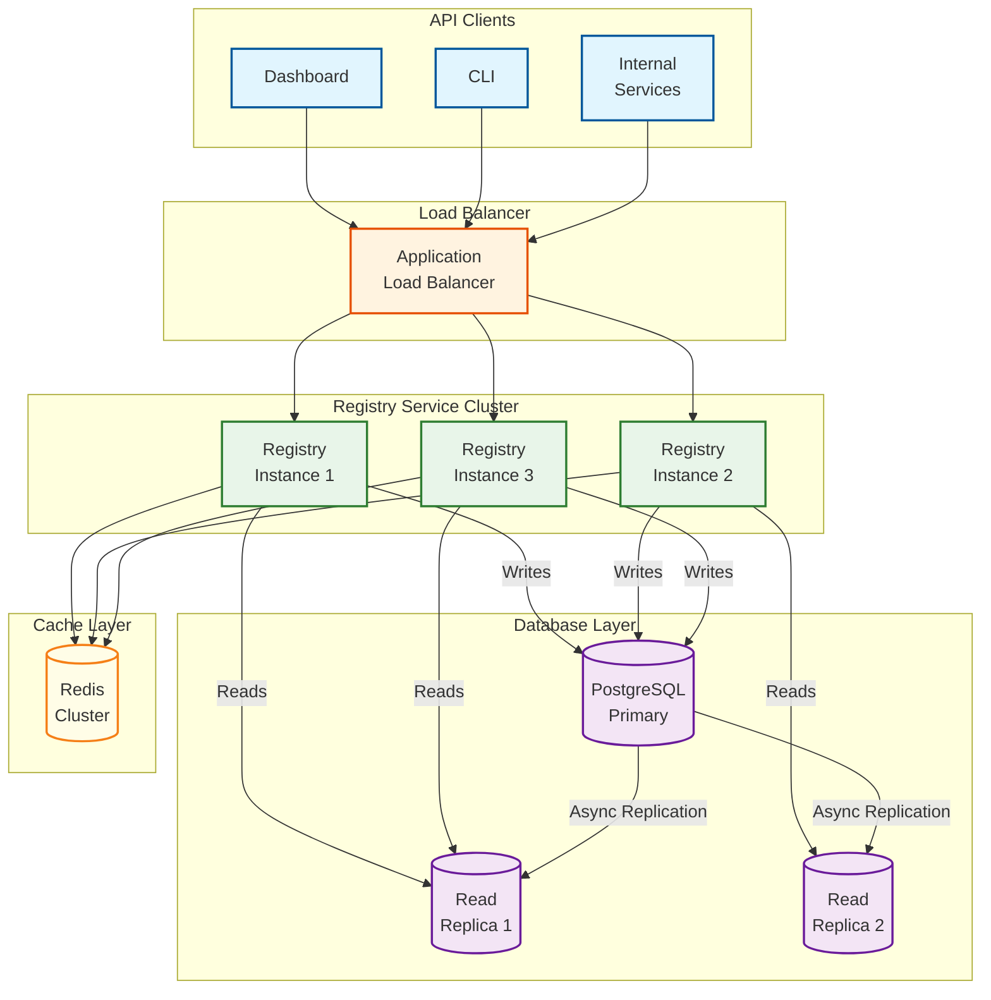
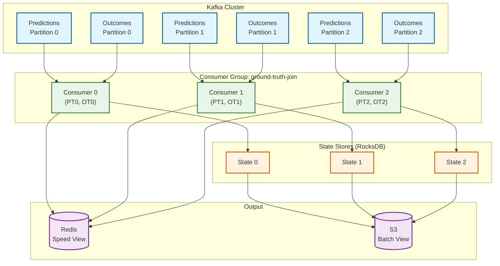
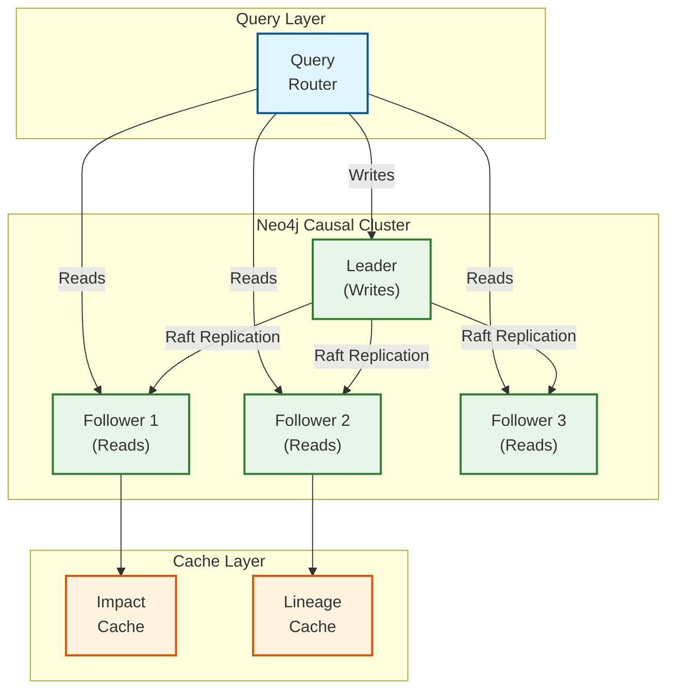
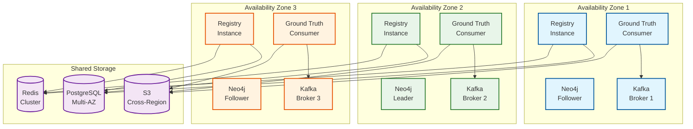
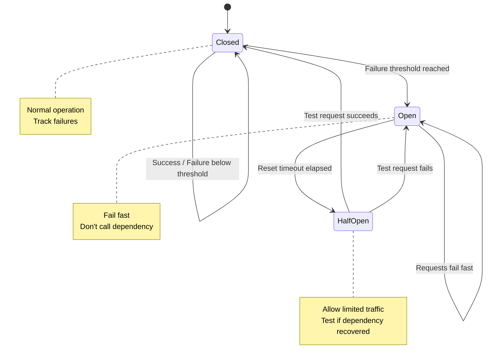
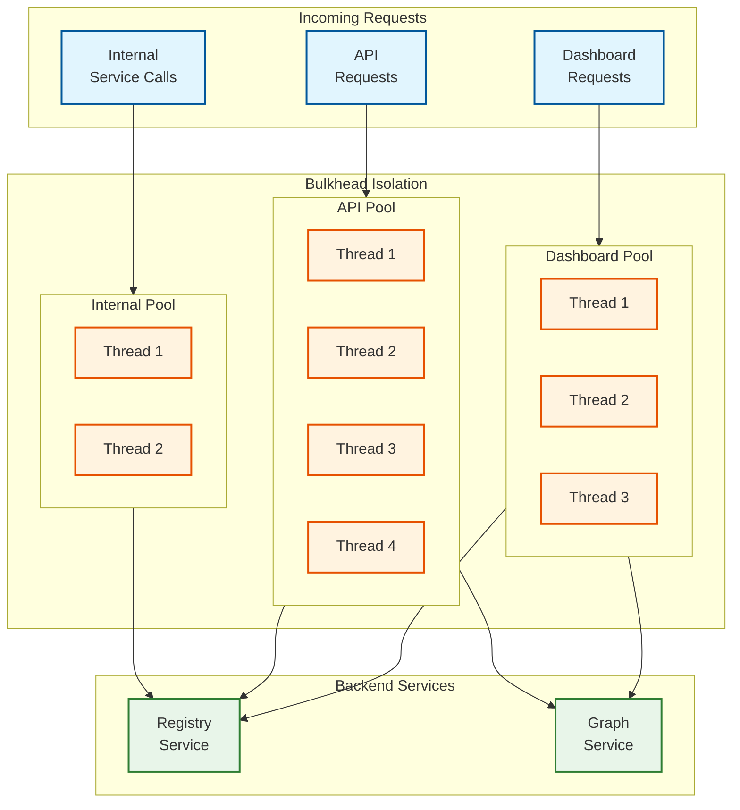
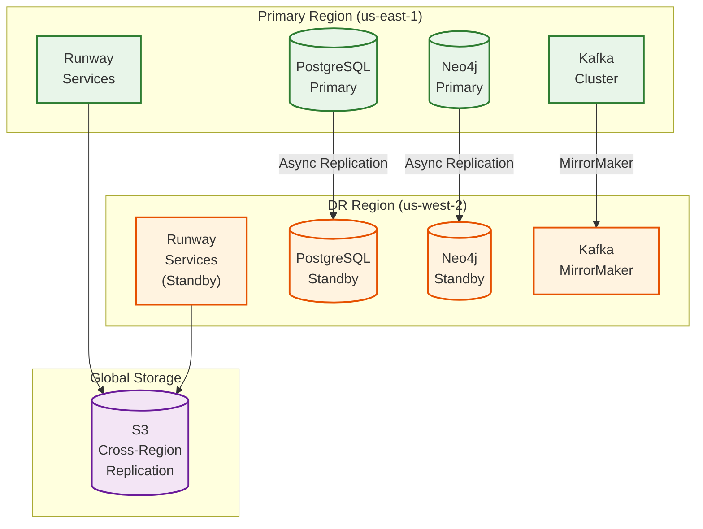

# Scalability & Reliability

## Scalability Strategy

### Component-Level Scaling

| Component | Scaling Type | Trigger | Strategy |
|-----------|--------------|---------|----------|
| **Registry Service** | Horizontal | Read QPS > 100 | Add read replicas, load balance |
| **Dependency Service** | Horizontal | Query latency > 200ms | Neo4j read replicas, caching |
| **Health Service** | Horizontal | Model count > 500 | Partition by model tier |
| **Ground Truth Pipeline** | Horizontal | Prediction volume | Kafka partitions, parallel consumers |
| **Retrain Service** | Vertical + Queue | Concurrent jobs > 20 | Queue-based, resource limits |

### Registry Service Scaling



**Scaling Triggers:**
- CPU utilization > 70% for 5 minutes
- Response latency p99 > 200ms
- Request queue depth > 100

**Scaling Actions:**
- Add instances (horizontal)
- Increase read replica count
- Expand Redis cluster

### Ground Truth Pipeline Scaling



**Scaling Strategy:**
- Partition key: `model_id` (ensures predictions and outcomes for same model go to same partition)
- Initial partitions: 16
- Scale to 64 partitions at 1B predictions/day
- Consumer parallelism matches partition count

**Auto-scaling Configuration:**
```yaml
kafka:
  topics:
    predictions:
      partitions: 16
      replication_factor: 3
      retention_ms: 604800000  # 7 days
    outcomes:
      partitions: 16
      replication_factor: 3
      retention_ms: 604800000

consumer_group:
  ground_truth_join:
    min_instances: 4
    max_instances: 32
    scale_up_threshold:
      consumer_lag_seconds: 300
    scale_down_threshold:
      consumer_lag_seconds: 30
```

### Dependency Graph Scaling



**Scaling Approach:**
- Neo4j Causal Cluster with 1 leader + 3 followers
- Read replicas for query load
- Materialized views for common impact queries
- Cache layer for hot paths

---

## Reliability Strategy

### Single Points of Failure (SPOF) Analysis

| Component | SPOF Risk | Mitigation |
|-----------|-----------|------------|
| Registry DB (PostgreSQL) | High | Multi-AZ primary + read replicas |
| Graph DB (Neo4j) | Medium | Causal cluster with auto-failover |
| Ground Truth Store (S3) | Low | S3 provides 11 9s durability |
| Kafka Cluster | Medium | 3-node cluster, replication factor 3 |
| Maestro Integration | High | Circuit breaker, queue retries |
| Redis Cache | Low | Redis Cluster mode, degradation to DB |

### Redundancy Architecture



### Failover Mechanisms

**Registry Service Failover:**
```
HEALTH_CHECK:
  - Endpoint: /health
  - Interval: 10 seconds
  - Unhealthy threshold: 3 consecutive failures
  - Action: Remove from load balancer

DATABASE_FAILOVER:
  - Automatic failover with Multi-AZ PostgreSQL
  - Failover time: < 60 seconds
  - Application: Connection pooler handles reconnection
```

**Maestro Integration Failover:**
```
CIRCUIT_BREAKER_CONFIG:
  failure_threshold: 5        # Open after 5 failures
  success_threshold: 3        # Close after 3 successes
  timeout: 30 seconds        # Request timeout
  half_open_requests: 1      # Test requests when half-open
  reset_timeout: 60 seconds  # Time before half-open

ON_CIRCUIT_OPEN:
  - Queue retrain requests to dead letter queue
  - Alert on-call
  - Retry from queue when circuit closes
```

### Circuit Breaker Pattern



**Implementation:**
```
CLASS CircuitBreaker:
    state = CLOSED
    failure_count = 0
    last_failure_time = null
    config = CircuitBreakerConfig

    FUNCTION Execute(operation):
        IF state == OPEN:
            IF Now() - last_failure_time > config.reset_timeout:
                state = HALF_OPEN
            ELSE:
                RAISE CircuitOpenException()

        TRY:
            result = operation()

            IF state == HALF_OPEN:
                success_count += 1
                IF success_count >= config.success_threshold:
                    state = CLOSED
                    failure_count = 0

            RETURN result

        CATCH exception:
            failure_count += 1
            last_failure_time = Now()

            IF failure_count >= config.failure_threshold:
                state = OPEN
                EmitAlert("Circuit opened for Maestro")

            RAISE exception
```

### Retry Strategies

**Exponential Backoff with Jitter:**
```
FUNCTION RetryWithBackoff(operation, max_retries=5):
    FOR attempt FROM 1 TO max_retries:
        TRY:
            RETURN operation()
        CATCH RetryableException AS e:
            IF attempt == max_retries:
                RAISE e

            // Exponential backoff with jitter
            base_delay = 1 second
            max_delay = 60 seconds
            delay = Min(base_delay * (2 ^ attempt), max_delay)
            jitter = Random(0, delay * 0.1)
            actual_delay = delay + jitter

            Sleep(actual_delay)

RETRYABLE_EXCEPTIONS:
  - ConnectionTimeout
  - ServiceUnavailable
  - RateLimitExceeded

NON_RETRYABLE_EXCEPTIONS:
  - InvalidRequest
  - AuthenticationFailed
  - ResourceNotFound
```

### Graceful Degradation

| Scenario | Degraded Behavior | User Impact |
|----------|-------------------|-------------|
| **Neo4j unavailable** | Serve from cache, disable impact analysis | No new dependency queries |
| **Ground truth delayed** | Use drift-only staleness | Less accurate staleness |
| **Maestro unavailable** | Queue retrains, manual fallback | Delayed retraining |
| **Axion unavailable** | Skip drift calculation, use age + performance | Higher staleness uncertainty |
| **Redis unavailable** | Direct DB queries | Higher latency |

**Degradation Implementation:**
```
FUNCTION GetModelDependencies(model_id):
    TRY:
        // Try primary path
        RETURN GraphDB.Query(model_id)
    CATCH GraphDBUnavailable:
        // Degraded path 1: Cache
        cached = Cache.Get(f"deps:{model_id}")
        IF cached:
            LogDegradation("Serving dependencies from cache")
            RETURN cached WITH stale_warning=True

        // Degraded path 2: Return empty with warning
        LogDegradation("Dependencies unavailable")
        RETURN EmptyDependencies() WITH unavailable_warning=True
```

### Bulkhead Pattern

Isolate different workloads to prevent cascade failures:



**Configuration:**
```yaml
bulkheads:
  dashboard:
    max_concurrent: 50
    max_wait_time: 5s
    priority: low
  api:
    max_concurrent: 100
    max_wait_time: 10s
    priority: medium
  internal:
    max_concurrent: 30
    max_wait_time: 3s
    priority: high
```

---

## Disaster Recovery

### Recovery Objectives

| Metric | Target | Strategy |
|--------|--------|----------|
| **RTO (Recovery Time Objective)** | < 1 hour | Automated failover, hot standby |
| **RPO (Recovery Point Objective)** | < 5 minutes | Synchronous replication for critical data |

### Backup Strategy

| Data Type | Backup Frequency | Retention | Storage |
|-----------|------------------|-----------|---------|
| Registry DB | Continuous (streaming) | 30 days | Cross-region S3 |
| Graph DB | Daily snapshot | 7 days | Cross-region S3 |
| Ground Truth | N/A (source of truth is Kafka) | 7 days in Kafka | Kafka retention |
| Staleness Metrics | Daily snapshot | 90 days | S3 |
| Configuration | Git-versioned | Forever | Git repository |

### Multi-Region Considerations



### Disaster Recovery Runbook

```
RUNBOOK: Primary Region Failure

1. DETECTION (Automated)
   - Health check failures > 3 minutes
   - Alert: "Primary region unhealthy"

2. ASSESSMENT (5 minutes)
   - Confirm region-wide outage vs service-specific
   - Check replication lag to DR

3. FAILOVER DECISION (5 minutes)
   - If lag < 5 minutes: Proceed with failover
   - If lag > 5 minutes: Assess data loss risk

4. EXECUTE FAILOVER (15 minutes)
   a. Update DNS to DR region
   b. Promote DR database to primary
   c. Start DR services
   d. Verify connectivity

5. VALIDATION (15 minutes)
   - Run smoke tests
   - Verify staleness detection working
   - Confirm Maestro integration

6. COMMUNICATION (Ongoing)
   - Status page update
   - Stakeholder notification

TOTAL RTO TARGET: < 1 hour
```

### Data Consistency During Failover

```
FUNCTION ValidatePostFailover():
    // Check registry consistency
    model_count = DRDB.Count("models")
    IF model_count == 0:
        RAISE CriticalError("No models in DR database")

    // Check graph consistency
    graph_nodes = DRGraph.Count("Model")
    IF Abs(graph_nodes - model_count) > model_count * 0.01:
        LogWarning("Graph/Registry mismatch, triggering reconciliation")
        ScheduleReconciliation()

    // Check Kafka consumer positions
    consumer_lag = Kafka.GetConsumerLag("ground_truth_join")
    IF consumer_lag > 1_hour:
        LogWarning("High consumer lag, ground truth may be delayed")

    RETURN HealthStatus(
        registry="healthy",
        graph="healthy" IF no_mismatch ELSE "degraded",
        ground_truth="healthy" IF lag < 1_hour ELSE "degraded"
    )
```

---

## Capacity Planning

### Growth Projections

| Metric | Current | Year 1 | Year 2 | Year 3 |
|--------|---------|--------|--------|--------|
| Production Models | 500 | 750 | 1,000 | 1,500 |
| Daily Predictions | 10B | 15B | 25B | 40B |
| Dependency Edges | 5,000 | 8,000 | 12,000 | 20,000 |
| Retraining Jobs/Day | 25 | 40 | 60 | 100 |

### Infrastructure Scaling Plan

| Component | Current | Year 1 | Year 2 | Year 3 |
|-----------|---------|--------|--------|--------|
| Registry Instances | 3 | 4 | 6 | 8 |
| Ground Truth Consumers | 8 | 16 | 32 | 48 |
| Neo4j Cluster Size | 4 | 4 | 6 | 8 |
| Kafka Partitions | 16 | 32 | 64 | 96 |
| PostgreSQL Size | db.r5.xlarge | db.r5.2xlarge | db.r5.4xlarge | db.r5.8xlarge |

### Cost Projections

| Category | Monthly Cost (Current) | Year 1 | Year 2 | Year 3 |
|----------|------------------------|--------|--------|--------|
| Compute | $8,000 | $12,000 | $18,000 | $28,000 |
| Storage | $3,000 | $5,000 | $8,000 | $15,000 |
| Database | $5,000 | $8,000 | $12,000 | $18,000 |
| Kafka | $4,000 | $6,000 | $10,000 | $16,000 |
| **Total** | **$20,000** | **$31,000** | **$48,000** | **$77,000** |
