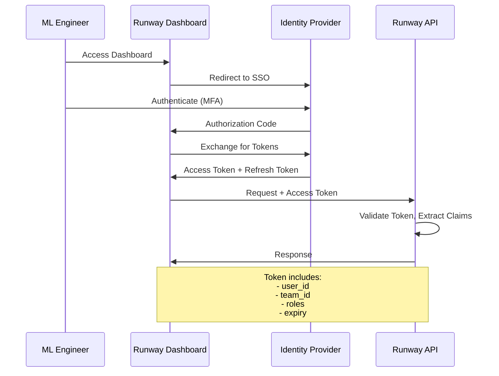
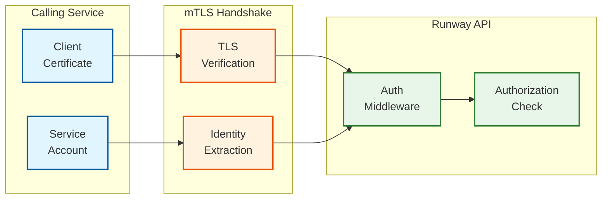
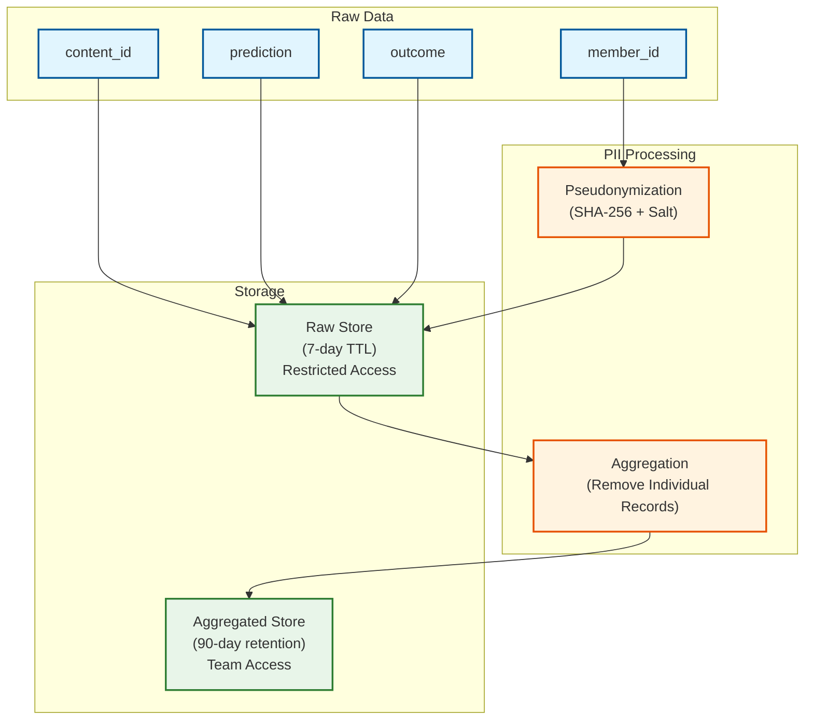
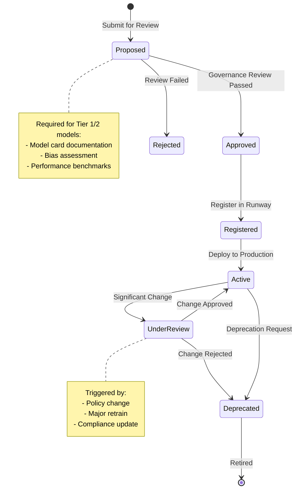
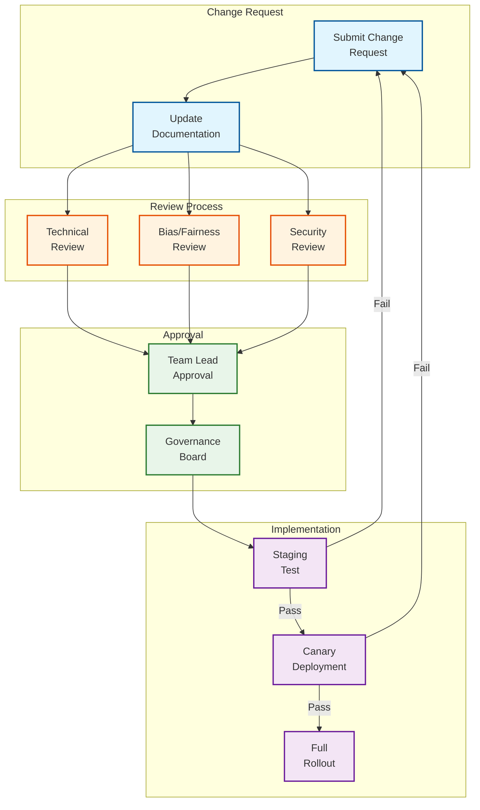

# Security & Compliance

## Authentication & Authorization

### Authentication Mechanisms

| Client Type | Authentication Method | Token Lifetime |
|-------------|----------------------|----------------|
| Human Users (Dashboard) | OAuth 2.0 / OIDC (SSO) | 8 hours |
| Service-to-Service | mTLS + Service Account | Certificate rotation: 24 hours |
| CLI Tools | API Keys + Short-lived Tokens | 1 hour |
| Scheduled Jobs | Service Account (Workload Identity) | Per-execution |

### OAuth 2.0 Flow (Human Users)



### Service-to-Service Authentication



### Authorization Model (RBAC + ABAC)

**Role Hierarchy:**

```
ROLES:
├── runway_admin
│   └── Full system access
├── team_lead
│   └── Team-level model management + policy changes
├── ml_engineer
│   └── Model CRUD, view dependencies, trigger manual retrains
├── ml_observer
│   └── Read-only access to all models
└── service_account
    └── Programmatic access with specific scopes
```

**Permission Matrix:**

| Action | Admin | Team Lead | ML Engineer | Observer | Service |
|--------|-------|-----------|-------------|----------|---------|
| Register model | Yes | Team only | Team only | No | Scoped |
| Update model | Yes | Team only | Own models | No | Scoped |
| Delete model | Yes | Team only | No | No | No |
| View any model | Yes | Yes | Yes | Yes | Scoped |
| Update staleness policy | Yes | Team only | No | No | No |
| Trigger manual retrain | Yes | Team only | Own models | No | No |
| Approve Tier 1 retrain | Yes | Team only | No | No | No |
| View dependencies | Yes | Yes | Yes | Yes | Scoped |
| Modify dependencies | Yes | Team only | No | No | No |
| Access ground truth | Yes | Team only | Team only | Team only | Scoped |
| System configuration | Yes | No | No | No | No |

**Attribute-Based Policies (ABAC):**

```
POLICY: ModelAccessPolicy
  WHEN:
    action IN [read, update, delete]
    resource.type == "model"
  ALLOW IF:
    user.role == "admin"
    OR (user.team_id == resource.team_id AND user.role IN ["team_lead", "ml_engineer"])
    OR (user.user_id == resource.owner_id)
    OR (user.role == "observer" AND action == "read")

POLICY: TierOneRetrainApproval
  WHEN:
    action == "approve_retrain"
    resource.type == "retrain_trigger"
    resource.model.tier == "tier_1"
  ALLOW IF:
    user.role == "admin"
    OR (user.role == "team_lead" AND user.team_id == resource.model.team_id)
  DENY IF:
    user.user_id == resource.triggered_by  // No self-approval
```

### Token Structure (JWT)

```json
{
  "header": {
    "alg": "RS256",
    "typ": "JWT",
    "kid": "key-2026-01"
  },
  "payload": {
    "sub": "user:alice@netflix.com",
    "iss": "https://auth.netflix.com",
    "aud": "runway-api",
    "exp": 1737756000,
    "iat": 1737727200,
    "nbf": 1737727200,
    "jti": "unique-token-id",
    "claims": {
      "user_id": "alice@netflix.com",
      "team_id": "personalization",
      "roles": ["ml_engineer"],
      "scopes": ["models:read", "models:write", "retrains:trigger"]
    }
  }
}
```

---

## Data Security

### Encryption at Rest

| Data Store | Encryption Method | Key Management |
|------------|-------------------|----------------|
| PostgreSQL (Registry) | Transparent Data Encryption (TDE) | Managed key rotation |
| Neo4j (Graph) | Filesystem encryption | Managed keys |
| S3 (Ground Truth) | SSE-KMS | Customer-managed KMS key |
| Redis (Cache) | At-rest encryption | Managed keys |
| Kafka | Broker-side encryption | Managed keys |

### Encryption in Transit

```
ALL COMMUNICATIONS:
  - TLS 1.3 minimum
  - mTLS for service-to-service
  - Certificate pinning for external services

CIPHER SUITES (Priority Order):
  1. TLS_AES_256_GCM_SHA384
  2. TLS_CHACHA20_POLY1305_SHA256
  3. TLS_AES_128_GCM_SHA256
```

### PII Handling in Ground Truth

Ground truth data contains user behavior, which may include PII:



**PII Data Flow:**

1. **Collection**: member_id pseudonymized at collection (SHA-256 with rotating salt)
2. **Storage**: Raw data retained 7 days with restricted access
3. **Aggregation**: Performance metrics aggregated daily, individual records removed
4. **Access**: Teams access aggregated metrics, not individual predictions

**Data Masking:**
```
FUNCTION MaskMemberID(member_id, context):
    // Pseudonymize with context-specific salt
    salt = GetRotatingSalt(context.date)
    pseudonymized = SHA256(member_id + salt)
    RETURN pseudonymized[:16]  // Truncate for additional privacy

FUNCTION GetRotatingSalt(date):
    // Salt rotates monthly, preventing long-term tracking
    month_key = Format(date, "YYYY-MM")
    RETURN HMAC(master_secret, month_key)
```

---

## Threat Model

### Attack Vectors and Mitigations

| Attack Vector | Description | Likelihood | Impact | Mitigation |
|---------------|-------------|------------|--------|------------|
| **Model Poisoning** | Attacker triggers malicious retrain with bad data | Medium | High | Data validation, Tier 1 approval, rollback |
| **Unauthorized Access** | Access to models outside team scope | Medium | Medium | RBAC, audit logging, alerting |
| **Dependency Manipulation** | Inject false dependencies to cause cascading retrains | Low | Medium | Manual dependency approval, anomaly detection |
| **Ground Truth Manipulation** | Inject fake outcomes to game performance metrics | Low | High | Input validation, source authentication |
| **DoS on Retrain Queue** | Flood retrain requests to exhaust resources | Medium | Medium | Rate limiting, priority queues |
| **Credential Theft** | Stolen API keys or tokens | Medium | High | Short-lived tokens, key rotation, MFA |

### Threat Mitigation Details

**1. Model Poisoning Prevention:**

```
FUNCTION ValidateRetrainRequest(trigger):
    // Check data quality
    training_data = GetTrainingDataSnapshot(trigger.new_data_snapshot)

    IF training_data.row_count < MIN_TRAINING_SAMPLES:
        REJECT("Insufficient training data")

    IF training_data.has_outliers > OUTLIER_THRESHOLD:
        REJECT("Excessive outliers in training data")

    // Check for sudden distribution shift (potential poisoning)
    previous_data = GetTrainingDataSnapshot(trigger.model.current_version)
    data_shift = CalculateDistributionShift(previous_data, training_data)

    IF data_shift > POISONING_THRESHOLD:
        REQUIRE_MANUAL_APPROVAL("Significant data shift detected")

    // Tier 1 models always require approval
    IF trigger.model.tier == "tier_1":
        REQUIRE_MANUAL_APPROVAL("Tier 1 model")

    RETURN APPROVED
```

**2. Rate Limiting:**

```yaml
rate_limits:
  model_registration:
    limit: 10 per team per hour
    burst: 3

  manual_retrain_trigger:
    limit: 5 per model per day
    burst: 2

  api_requests:
    limit: 1000 per user per minute
    burst: 100

  service_account:
    limit: 10000 per service per minute
    burst: 1000
```

**3. Input Validation:**

```
FUNCTION ValidateModelRegistration(request):
    // Schema validation
    IF NOT ValidateSchema(request, MODEL_REGISTRATION_SCHEMA):
        REJECT("Invalid request schema")

    // Name validation (prevent injection)
    IF NOT MatchesPattern(request.name, SAFE_NAME_PATTERN):
        REJECT("Invalid model name")

    // Artifact path validation
    IF NOT IsAllowedStoragePath(request.artifact_path):
        REJECT("Artifact path not in allowed locations")

    // Team validation
    IF NOT UserBelongsToTeam(current_user, request.team_id):
        REJECT("User not authorized for team")

    RETURN VALID
```

---

## Model Governance

### Model Lifecycle Governance



### Model Documentation Requirements

| Model Tier | Required Documentation | Review Frequency |
|------------|------------------------|------------------|
| Tier 1 | Full model card, bias assessment, security review | Quarterly |
| Tier 2 | Model card, basic bias check | Semi-annually |
| Tier 3 | Model card | Annually |
| Tier 4 | Basic description | None |

**Model Card Template:**

```markdown
# Model Card: [Model Name]

## Model Details
- **Model ID:** [UUID]
- **Owner:** [Team]
- **Tier:** [1-4]
- **Type:** [ranker/classifier/regressor/embedding]
- **Created:** [Date]
- **Last Retrained:** [Date]

## Intended Use
- **Primary Use Case:** [Description]
- **Users:** [Who uses this model's predictions]
- **Out of Scope:** [What this model should NOT be used for]

## Training Data
- **Data Sources:** [List]
- **Data Size:** [Records/Time Range]
- **Data Freshness:** [How recent]

## Performance Metrics
- **Primary Metric:** [Name: Value]
- **Secondary Metrics:** [List]
- **Baseline Comparison:** [vs previous version]

## Ethical Considerations
- **Bias Assessment:** [Results]
- **Fairness Metrics:** [By demographic]
- **Known Limitations:** [List]

## Maintenance
- **Staleness Policy:** [Policy Name]
- **Retrain Frequency:** [Expected]
- **Monitoring:** [Dashboard Link]
```

### Change Management

**Tier 1 Model Change Process:**



---

## Audit Logging

### Audit Events

| Event Category | Events | Retention |
|----------------|--------|-----------|
| **Authentication** | Login, logout, token refresh, failed auth | 1 year |
| **Authorization** | Access granted, access denied, privilege escalation | 1 year |
| **Model Lifecycle** | Create, update, delete, deploy, deprecate | 5 years |
| **Retrain Actions** | Trigger, approve, reject, complete, rollback | 5 years |
| **Policy Changes** | Create, update policy | 5 years |
| **Dependency Changes** | Edge added, edge removed | 2 years |
| **System Config** | Any configuration change | 5 years |

### Audit Log Schema

```json
{
  "event_id": "uuid",
  "timestamp": "2026-01-24T10:30:00.000Z",
  "event_type": "model.retrain.triggered",
  "actor": {
    "type": "user",
    "id": "alice@netflix.com",
    "ip_address": "10.0.1.50",
    "user_agent": "runway-cli/1.0"
  },
  "resource": {
    "type": "model",
    "id": "model-uuid",
    "name": "recommendation_ranker_v2"
  },
  "action": {
    "name": "trigger_retrain",
    "reason": "manual",
    "parameters": {
      "priority": "normal"
    }
  },
  "result": {
    "status": "success",
    "trigger_id": "trigger-uuid"
  },
  "context": {
    "request_id": "req-uuid",
    "session_id": "session-uuid",
    "source_service": "runway-api"
  }
}
```

### Audit Dashboard Queries

```
COMMON QUERIES:

-- Failed authentication attempts (last 24h)
SELECT actor.id, COUNT(*) as attempts, MAX(timestamp)
FROM audit_logs
WHERE event_type = 'auth.login.failed'
  AND timestamp > NOW() - INTERVAL '24 hours'
GROUP BY actor.id
HAVING COUNT(*) > 5

-- Tier 1 model changes (last 30 days)
SELECT timestamp, actor.id, resource.name, action.name
FROM audit_logs
WHERE resource.type = 'model'
  AND resource.tier = 'tier_1'
  AND event_type LIKE 'model.%'
  AND timestamp > NOW() - INTERVAL '30 days'
ORDER BY timestamp DESC

-- Policy changes requiring review
SELECT *
FROM audit_logs
WHERE event_type LIKE 'policy.%'
  AND timestamp > NOW() - INTERVAL '7 days'
ORDER BY timestamp DESC
```

---

## Compliance

### Regulatory Frameworks

| Framework | Applicability | Key Requirements |
|-----------|---------------|------------------|
| **GDPR** | EU user data | Data minimization, right to deletion, consent |
| **CCPA** | California user data | Disclosure, opt-out, data deletion |
| **SOC 2 Type II** | Enterprise customers | Security controls, availability, confidentiality |
| **ISO 27001** | Information security | ISMS, risk management, controls |

### GDPR Compliance

**Data Subject Rights:**

| Right | Implementation |
|-------|----------------|
| **Right to Access** | Export user's model interactions via API |
| **Right to Deletion** | Purge pseudonymized data on request |
| **Right to Portability** | Export in machine-readable format |
| **Right to Object** | Opt-out of model training data |

**Data Minimization:**

```
PRINCIPLE: Collect only what's necessary for model performance monitoring

IMPLEMENTATION:
- Pseudonymize member_id at collection
- Aggregate individual records after 7 days
- Retain aggregated metrics only for performance calculation
- No raw prediction content stored long-term
```

### SOC 2 Controls

| Control Area | Runway Implementation |
|--------------|----------------------|
| **CC6.1: Logical Access** | RBAC, MFA, SSO integration |
| **CC6.2: Access Provisioning** | Automated team-based access |
| **CC6.3: Access Removal** | Automated de-provisioning on team change |
| **CC7.1: Security Events** | Comprehensive audit logging |
| **CC7.2: Anomaly Detection** | Alerting on unusual access patterns |
| **CC8.1: Change Management** | Tier 1 approval workflows |
| **A1.2: Disaster Recovery** | Multi-AZ, cross-region backup |

### Compliance Reporting

```
AUTOMATED REPORTS:

Weekly:
- Authentication summary (successes, failures, MFA usage)
- Access denied events
- Tier 1 model changes

Monthly:
- Full audit log summary
- Policy change inventory
- Data retention compliance check

Quarterly:
- SOC 2 control effectiveness review
- GDPR data subject request summary
- Model governance review summary

Annually:
- Full security assessment
- Penetration test results
- Compliance certification renewal
```
