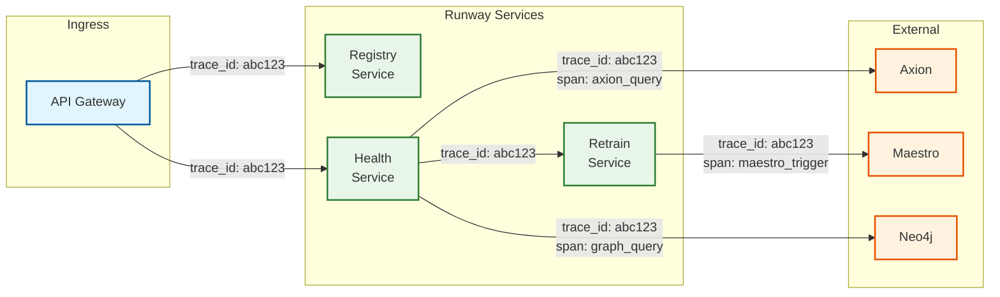
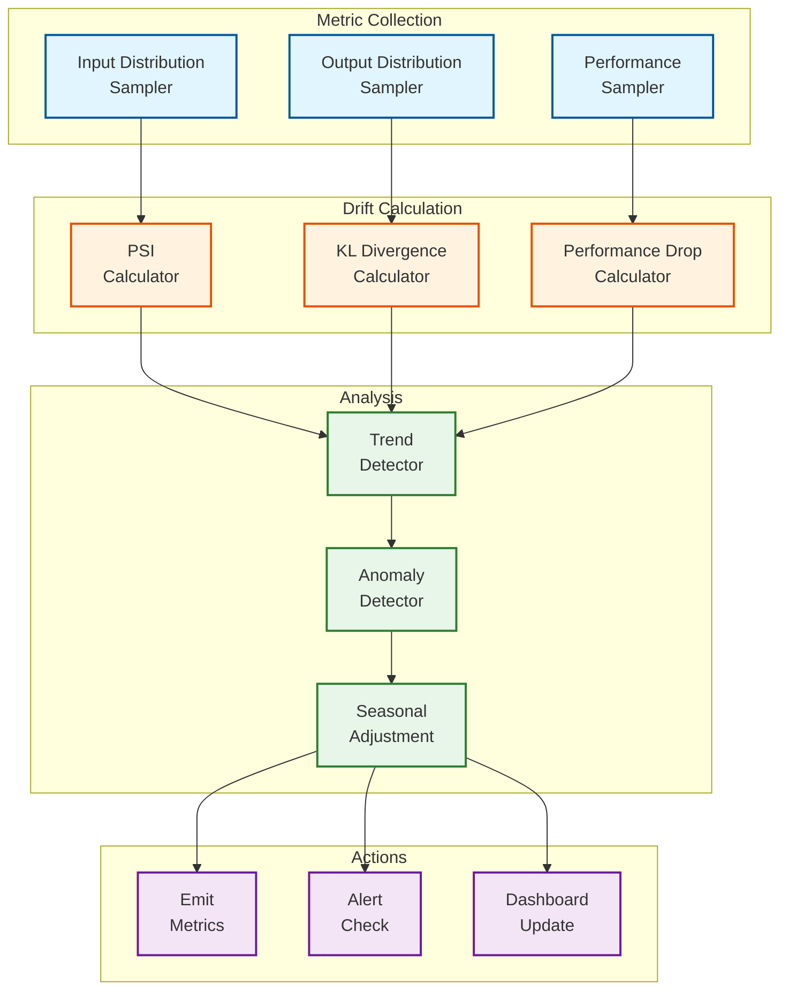

# Observability

## Metrics Strategy

### Key Metrics (RED + USE)

**RED Metrics (Request-oriented):**

| Metric | Description | Alert Threshold |
|--------|-------------|-----------------|
| `runway_api_request_rate` | API requests per second | N/A (informational) |
| `runway_api_error_rate` | Percentage of failed requests | > 1% for 5 min |
| `runway_api_latency_p99` | 99th percentile latency | > 500ms |

**USE Metrics (Resource-oriented):**

| Metric | Description | Alert Threshold |
|--------|-------------|-----------------|
| `runway_cpu_utilization` | CPU usage across instances | > 80% for 10 min |
| `runway_memory_utilization` | Memory usage | > 85% |
| `runway_db_connections_used` | Active DB connections | > 80% of pool |
| `runway_kafka_consumer_lag` | Consumer lag in seconds | > 300 seconds |

### Business Metrics

| Metric | Description | Dashboard |
|--------|-------------|-----------|
| `models_total` | Total registered models | Overview |
| `models_by_status` | Models grouped by health status | Overview |
| `models_stale_count` | Number of stale models | Overview |
| `staleness_evaluations_total` | Staleness checks performed | Health |
| `retrains_triggered_total` | Retraining jobs triggered | Retraining |
| `retrains_success_rate` | Percentage of successful retrains | Retraining |
| `ground_truth_coverage` | Predictions with outcomes | Ground Truth |
| `ground_truth_join_latency_p50` | Median label delay | Ground Truth |

### Staleness-Specific Metrics

| Metric | Description | Labels |
|--------|-------------|--------|
| `staleness_score` | Composite staleness score (0-1) | model_id, version_id |
| `staleness_signal_age_days` | Days since last retrain | model_id |
| `staleness_signal_psi` | PSI drift value | model_id, feature |
| `staleness_signal_kl` | KL divergence value | model_id |
| `staleness_signal_performance_drop` | Performance degradation % | model_id |
| `staleness_evaluation_duration_ms` | Time to evaluate staleness | model_id, tier |
| `staleness_threshold_breaches_total` | Threshold breach count | model_id, signal_type |

---

## Dashboard Design

### Main Dashboard: Runway Overview

```
+------------------------------------------------------------------+
|                    RUNWAY MODEL HEALTH OVERVIEW                   |
+------------------------------------------------------------------+
|                                                                    |
| [Total Models]     [Healthy]       [At Risk]        [Stale]       |
|     523              468 (89%)       43 (8%)         12 (3%)      |
|                                                                    |
+------------------------------------------------------------------+

+------------------------------------------------------------------+
|              MODEL STATUS BY TIER                                  |
+------------------------------------------------------------------+
| Tier 1 (Critical)  | ████████████████░░ | 45/52  (87% healthy)   |
| Tier 2 (Important) | █████████████████░ | 156/172 (91% healthy)  |
| Tier 3 (Standard)  | ██████████████████ | 189/201 (94% healthy)  |
| Tier 4 (Experim.)  | ████████████░░░░░░ | 78/98  (80% healthy)   |
+------------------------------------------------------------------+

+------------------------------------------------------------------+
|              STALENESS TREND (Last 30 Days)                        |
+------------------------------------------------------------------+
|  15% |                                                             |
|      |    ****                                                     |
|  10% |  **    **                                                   |
|      | *        **                                                 |
|   5% |*           ****                                             |
|      |                ******************************               |
|   0% +---------------------------------------------------> Days   |
|        1    5    10   15   20   25   30                           |
+------------------------------------------------------------------+

+------------------------------------------------------------------+
|              RETRAINING ACTIVITY (Last 7 Days)                     |
+------------------------------------------------------------------+
| [Triggered]  [Completed]  [Failed]  [Queued]  [Avg Duration]      |
|    45           42           2         1         2.3 hours        |
+------------------------------------------------------------------+
```

### Health Dashboard: Model Health Deep Dive

```
+------------------------------------------------------------------+
|              MODEL HEALTH: recommendation_ranker_v2                |
+------------------------------------------------------------------+
| Model ID: abc-123   | Team: personalization | Tier: 1            |
| Status: AT_RISK     | Last Retrain: 18 days ago                  |
+------------------------------------------------------------------+

+------------------------------------------------------------------+
|              STALENESS SCORE BREAKDOWN                             |
+------------------------------------------------------------------+
| Overall Score: 0.72 / 1.0 (Threshold: 0.60)  [EXCEEDED]           |
|                                                                    |
| Signal          | Weight | Score | Status    | Contribution       |
|-----------------|--------|-------|-----------|-------------------|
| Age             | 0.20   | 0.60  | OK        | 0.12              |
| Data Drift (PSI)| 0.30   | 0.85  | BREACHED  | 0.26              |
| Concept Drift   | 0.30   | 0.70  | WARNING   | 0.21              |
| Performance     | 0.20   | 0.65  | WARNING   | 0.13              |
+------------------------------------------------------------------+

+------------------------------------------------------------------+
|              TOP DRIFTING FEATURES                                 |
+------------------------------------------------------------------+
| Feature              | PSI     | Training Mean | Current Mean     |
|----------------------|---------|---------------|-----------------|
| user_watch_history   | 0.31    | 45.2          | 62.8            |
| content_popularity   | 0.22    | 0.15          | 0.23            |
| time_of_day_bucket   | 0.18    | 2.1           | 2.8             |
+------------------------------------------------------------------+

+------------------------------------------------------------------+
|              PERFORMANCE TREND (Last 30 Days)                      |
+------------------------------------------------------------------+
| AUC  |                                                             |
| 0.82 |********                                                     |
| 0.80 |        *****                                                |
| 0.78 |             ****                                            |
| 0.76 |                 ******                                      |
| 0.74 |                       **************************           |
|      +---------------------------------------------------> Days   |
|         Baseline: 0.82      Current: 0.75                         |
+------------------------------------------------------------------+
```

### Ground Truth Dashboard

```
+------------------------------------------------------------------+
|              GROUND TRUTH PIPELINE HEALTH                          |
+------------------------------------------------------------------+
|                                                                    |
| [Predictions/Day]   [Outcomes/Day]   [Join Rate]   [Avg Delay]   |
|     2.1B               1.8B            86%          4.2 hours    |
|                                                                    |
+------------------------------------------------------------------+

+------------------------------------------------------------------+
|              JOIN LATENCY DISTRIBUTION                             |
+------------------------------------------------------------------+
| Hours |                                                            |
|   24+ |  █                                                        |
| 12-24 |  ███                                                      |
|  6-12 |  ██████                                                   |
|   3-6 |  ████████████                                             |
|   1-3 |  ████████████████████                                     |
|   <1  |  ████████████████████████████████████                     |
|       +---------------------------------------------------------- |
|          0%    10%    20%    30%    40%    50%                   |
+------------------------------------------------------------------+

+------------------------------------------------------------------+
|              COVERAGE BY MODEL TIER                                |
+------------------------------------------------------------------+
| Tier 1 | ██████████████████░░ | 92% coverage                     |
| Tier 2 | █████████████████░░░ | 88% coverage                     |
| Tier 3 | ████████████████░░░░ | 82% coverage                     |
| Tier 4 | ███████████░░░░░░░░░ | 65% coverage                     |
+------------------------------------------------------------------+

+------------------------------------------------------------------+
|              KAFKA CONSUMER LAG                                    |
+------------------------------------------------------------------+
| Consumer Group           | Lag (seconds) | Status                |
|--------------------------|---------------|----------------------|
| ground-truth-predictions |     45        | OK                   |
| ground-truth-outcomes    |     120       | WARNING              |
| ground-truth-join        |     30        | OK                   |
+------------------------------------------------------------------+
```

### Retraining Dashboard

```
+------------------------------------------------------------------+
|              RETRAINING ACTIVITY                                   |
+------------------------------------------------------------------+
|                                                                    |
| ACTIVE RETRAINS                                                   |
| +--------------+------------+----------+--------+---------------+ |
| | Model        | Triggered  | Status   | Progress| ETA          | |
| +--------------+------------+----------+--------+---------------+ |
| | ranker_v2    | 2h ago     | Training | 65%    | 45 min       | |
| | embed_model  | 1h ago     | Validating| 90%   | 10 min       | |
| | classifier_a | 30m ago    | Queued   | 0%     | ~2 hours     | |
| +--------------+------------+----------+--------+---------------+ |
|                                                                    |
+------------------------------------------------------------------+

+------------------------------------------------------------------+
|              RETRAIN TRIGGER REASONS (Last 30 Days)                |
+------------------------------------------------------------------+
|                                                                    |
| [PIE CHART]                                                       |
|                                                                    |
|   Data Drift: 45%  ████████████████                               |
|   Performance: 30% ███████████                                    |
|   Manual: 15%      ██████                                         |
|   Scheduled: 8%    ███                                            |
|   Cascade: 2%      █                                              |
|                                                                    |
+------------------------------------------------------------------+

+------------------------------------------------------------------+
|              RETRAIN SUCCESS RATE BY TIER                          |
+------------------------------------------------------------------+
| Tier 1 | ██████████████████░░ | 95% (38/40)                      |
| Tier 2 | █████████████████░░░ | 92% (55/60)                      |
| Tier 3 | ████████████████░░░░ | 88% (44/50)                      |
| Tier 4 | ████████████░░░░░░░░ | 75% (30/40)                      |
+------------------------------------------------------------------+
```

---

## Logging Strategy

### Log Levels

| Level | Usage | Examples |
|-------|-------|----------|
| **ERROR** | Failures requiring attention | DB connection failed, retrain job failed |
| **WARN** | Potential issues | Staleness threshold approaching, high latency |
| **INFO** | Normal operations | Model registered, retrain triggered |
| **DEBUG** | Detailed debugging | Query parameters, intermediate calculations |

### Structured Logging Format

```json
{
  "timestamp": "2026-01-24T10:30:00.123Z",
  "level": "INFO",
  "service": "runway-health-service",
  "instance_id": "health-service-abc123",
  "trace_id": "abc123def456",
  "span_id": "span789",
  "event": "staleness_evaluation_completed",
  "model_id": "model-uuid",
  "version_id": "version-uuid",
  "staleness_score": 0.72,
  "is_stale": true,
  "signals": {
    "age": 0.60,
    "data_drift": 0.85,
    "concept_drift": 0.70,
    "performance": 0.65
  },
  "duration_ms": 450,
  "context": {
    "team_id": "personalization",
    "tier": "tier_1"
  }
}
```

### Log Categories

| Category | Retention | Storage |
|----------|-----------|---------|
| Application logs | 30 days | Elasticsearch |
| Audit logs | 1 year | S3 (immutable) |
| Error logs | 90 days | Elasticsearch |
| Debug logs | 7 days | Elasticsearch (sampled) |

### Key Log Queries

```
# Models marked stale in last 24 hours
service:runway-health-service AND event:staleness_evaluation_completed AND is_stale:true AND @timestamp:[now-24h TO now]

# Retrain failures
service:runway-retrain-service AND level:ERROR AND event:retrain_failed

# Slow staleness evaluations (>1 second)
service:runway-health-service AND event:staleness_evaluation_completed AND duration_ms:>1000

# Ground truth join errors
service:runway-ground-truth AND level:ERROR

# API errors by endpoint
service:runway-api AND level:ERROR | stats count by endpoint
```

---

## Distributed Tracing

### Trace Propagation



### Key Spans to Instrument

| Span Name | Service | Purpose |
|-----------|---------|---------|
| `api.request` | API Gateway | Full request lifecycle |
| `registry.get_model` | Registry | Model lookup |
| `registry.create_model` | Registry | Model registration |
| `health.evaluate_staleness` | Health | Full staleness evaluation |
| `health.calculate_psi` | Health | PSI calculation |
| `health.calculate_kl` | Health | KL divergence calculation |
| `axion.get_distributions` | Health | Feature distribution fetch |
| `graph.query_dependencies` | Dependency | Graph traversal |
| `ground_truth.join` | Ground Truth | Prediction-outcome join |
| `retrain.trigger` | Retrain | Retrain job trigger |
| `maestro.submit_workflow` | Retrain | Maestro API call |

### Example Trace

```
Trace ID: abc123def456

[api.request] 450ms
├── [registry.get_model] 15ms
├── [health.evaluate_staleness] 380ms
│   ├── [axion.get_distributions] 120ms
│   │   └── (external call to Axion)
│   ├── [health.calculate_psi] 85ms
│   │   ├── feature: user_watch_history 25ms
│   │   ├── feature: content_popularity 30ms
│   │   └── feature: time_of_day 30ms
│   ├── [health.calculate_kl] 45ms
│   ├── [ground_truth.get_performance] 80ms
│   │   └── (query to ground truth store)
│   └── [health.fusion] 50ms
└── [response] 5ms
```

---

## Alerting Strategy

### Alert Severity Levels

| Severity | Response Time | Examples |
|----------|---------------|----------|
| **P1 (Critical)** | 15 minutes | Registry DB down, all staleness evaluations failing |
| **P2 (High)** | 1 hour | Ground truth pipeline stopped, Maestro integration down |
| **P3 (Medium)** | 4 hours | High staleness rate, slow evaluations |
| **P4 (Low)** | Next business day | Tier 4 model issues, non-critical errors |

### Alert Definitions

```yaml
alerts:
  # P1: Critical
  - name: registry_db_unavailable
    severity: P1
    condition: runway_registry_db_health == 0
    for: 2m
    summary: "Registry database is unavailable"
    runbook: "https://runbooks.netflix.com/runway/registry-db-down"

  - name: staleness_evaluation_complete_failure
    severity: P1
    condition: rate(staleness_evaluations_failed_total[5m]) / rate(staleness_evaluations_total[5m]) > 0.5
    for: 5m
    summary: "More than 50% of staleness evaluations failing"
    runbook: "https://runbooks.netflix.com/runway/staleness-failure"

  # P2: High
  - name: ground_truth_pipeline_lag
    severity: P2
    condition: runway_kafka_consumer_lag_seconds{consumer_group="ground-truth-join"} > 3600
    for: 15m
    summary: "Ground truth pipeline lag exceeds 1 hour"
    runbook: "https://runbooks.netflix.com/runway/ground-truth-lag"

  - name: maestro_integration_failing
    severity: P2
    condition: runway_circuit_breaker_state{dependency="maestro"} == 1
    for: 5m
    summary: "Maestro circuit breaker is open"
    runbook: "https://runbooks.netflix.com/runway/maestro-circuit-open"

  # P3: Medium
  - name: high_staleness_rate
    severity: P3
    condition: (count(staleness_score > 0.6) / count(staleness_score)) > 0.15
    for: 30m
    summary: "More than 15% of models are stale or at risk"
    runbook: "https://runbooks.netflix.com/runway/high-staleness"

  - name: slow_staleness_evaluation
    severity: P3
    condition: histogram_quantile(0.99, staleness_evaluation_duration_ms) > 5000
    for: 15m
    summary: "Staleness evaluations taking >5 seconds (p99)"
    runbook: "https://runbooks.netflix.com/runway/slow-evaluation"

  # P4: Low
  - name: tier4_model_failures
    severity: P4
    condition: count(retrain_status{tier="tier_4"} == "failed") > 5
    for: 1h
    summary: "Multiple Tier 4 model retraining failures"
    runbook: "https://runbooks.netflix.com/runway/tier4-failures"
```

### Alert Routing

```yaml
routing:
  p1_alerts:
    receivers:
      - pagerduty: runway-oncall
      - slack: #runway-alerts-critical
    escalation:
      - after: 15m
        to: runway-manager

  p2_alerts:
    receivers:
      - pagerduty: runway-oncall (low urgency)
      - slack: #runway-alerts

  p3_alerts:
    receivers:
      - slack: #runway-alerts
      - email: runway-team@netflix.com

  p4_alerts:
    receivers:
      - slack: #runway-notifications
```

---

## Drift Detection Monitoring

### Drift Monitoring Pipeline



### Drift Dashboard

```
+------------------------------------------------------------------+
|              DRIFT MONITORING: Global View                         |
+------------------------------------------------------------------+

+------------------------------------------------------------------+
|              PSI DISTRIBUTION ACROSS MODELS                        |
+------------------------------------------------------------------+
|                                                                    |
|       PSI Thresholds:  <0.1 (OK)  0.1-0.25 (Monitor)  >0.25 (Alert)|
|                                                                    |
| PSI Range | Model Count | Percentage                               |
|-----------|-------------|------------------------------------------|
| < 0.10    |    412      | ████████████████████████████████ 79%    |
| 0.10-0.15 |     65      | █████ 12%                                |
| 0.15-0.25 |     32      | ███ 6%                                   |
| > 0.25    |     14      | █ 3%                                     |
|                                                                    |
+------------------------------------------------------------------+

+------------------------------------------------------------------+
|              TOP DRIFTING MODELS                                   |
+------------------------------------------------------------------+
| Rank | Model                  | Max PSI | Top Feature              |
|------|------------------------|---------|--------------------------|
| 1    | content_similarity     | 0.42    | embedding_distance       |
| 2    | user_preference_v3     | 0.38    | watch_history_length     |
| 3    | new_release_ranker     | 0.35    | days_since_release       |
| 4    | homepage_ranker_v2     | 0.31    | user_activity_score      |
| 5    | search_relevance       | 0.29    | query_embedding          |
+------------------------------------------------------------------+

+------------------------------------------------------------------+
|              DRIFT TREND (Last 30 Days)                            |
+------------------------------------------------------------------+
|                                                                    |
| Avg PSI |                                                          |
|   0.20  |                                    *                     |
|   0.15  |                                 ***  *                   |
|   0.10  |      ***          ************       ***                |
|   0.05  | *****   **********                      *******          |
|   0.00  +---------------------------------------------------> Days |
|           1    5    10   15   20   25   30                        |
|                                                                    |
| [Note: Spike on day 22 correlated with holiday traffic pattern]   |
+------------------------------------------------------------------+
```

---

## SLO Dashboard

```
+------------------------------------------------------------------+
|              RUNWAY SERVICE LEVEL OBJECTIVES                       |
+------------------------------------------------------------------+

+------------------------------------------------------------------+
|              SLO: Staleness Detection Freshness                    |
|              Target: 99% models evaluated within 1 hour            |
+------------------------------------------------------------------+
| Current: 99.2%  | Budget Remaining: 72%  | Status: OK             |
|                                                                    |
| [████████████████████████████████████████████░░░░] 99.2%          |
|                                                                    |
| 30-Day Trend: Stable                                              |
+------------------------------------------------------------------+

+------------------------------------------------------------------+
|              SLO: Registry API Availability                        |
|              Target: 99.9% uptime                                  |
+------------------------------------------------------------------+
| Current: 99.95% | Budget Remaining: 85%  | Status: OK             |
|                                                                    |
| [█████████████████████████████████████████████░░░] 99.95%         |
|                                                                    |
| 30-Day Trend: Improving                                           |
+------------------------------------------------------------------+

+------------------------------------------------------------------+
|              SLO: Ground Truth Coverage                            |
|              Target: 95% predictions with outcomes                 |
+------------------------------------------------------------------+
| Current: 93.8%  | Budget Remaining: 45%  | Status: AT RISK        |
|                                                                    |
| [████████████████████████████████████████░░░░░░░░] 93.8%          |
|                                                                    |
| 30-Day Trend: Declining (investigating)                           |
+------------------------------------------------------------------+

+------------------------------------------------------------------+
|              SLO: Retrain Success Rate                             |
|              Target: 95% retrains complete successfully            |
+------------------------------------------------------------------+
| Current: 97.5%  | Budget Remaining: 90%  | Status: OK             |
|                                                                    |
| [███████████████████████████████████████████████░░] 97.5%         |
|                                                                    |
| 30-Day Trend: Stable                                              |
+------------------------------------------------------------------+
```

---

## Runbook References

| Alert | Runbook | Key Steps |
|-------|---------|-----------|
| registry_db_unavailable | [Link](https://runbooks.netflix.com/runway/registry-db-down) | 1. Check DB health 2. Failover if needed 3. Verify replication |
| staleness_evaluation_failure | [Link](https://runbooks.netflix.com/runway/staleness-failure) | 1. Check Axion connectivity 2. Review error logs 3. Restart health service |
| ground_truth_lag | [Link](https://runbooks.netflix.com/runway/ground-truth-lag) | 1. Check Kafka consumer 2. Scale consumers 3. Clear backlog |
| maestro_circuit_open | [Link](https://runbooks.netflix.com/runway/maestro-circuit-open) | 1. Check Maestro status 2. Verify network 3. Queue retrains |
| high_staleness_rate | [Link](https://runbooks.netflix.com/runway/high-staleness) | 1. Identify affected models 2. Check for upstream changes 3. Prioritize retrains |
