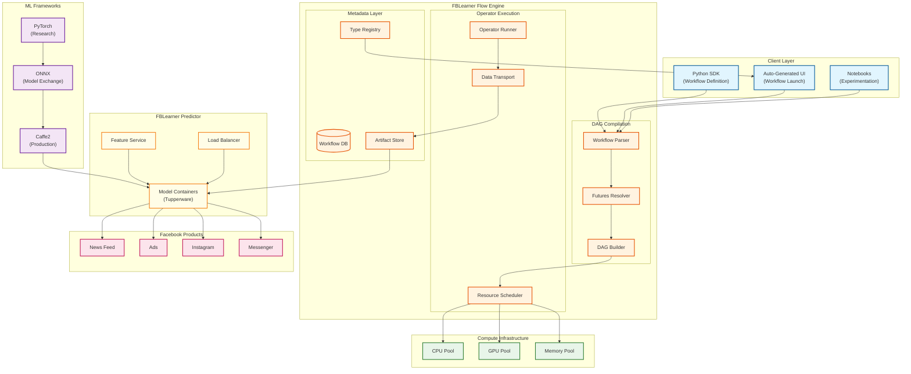
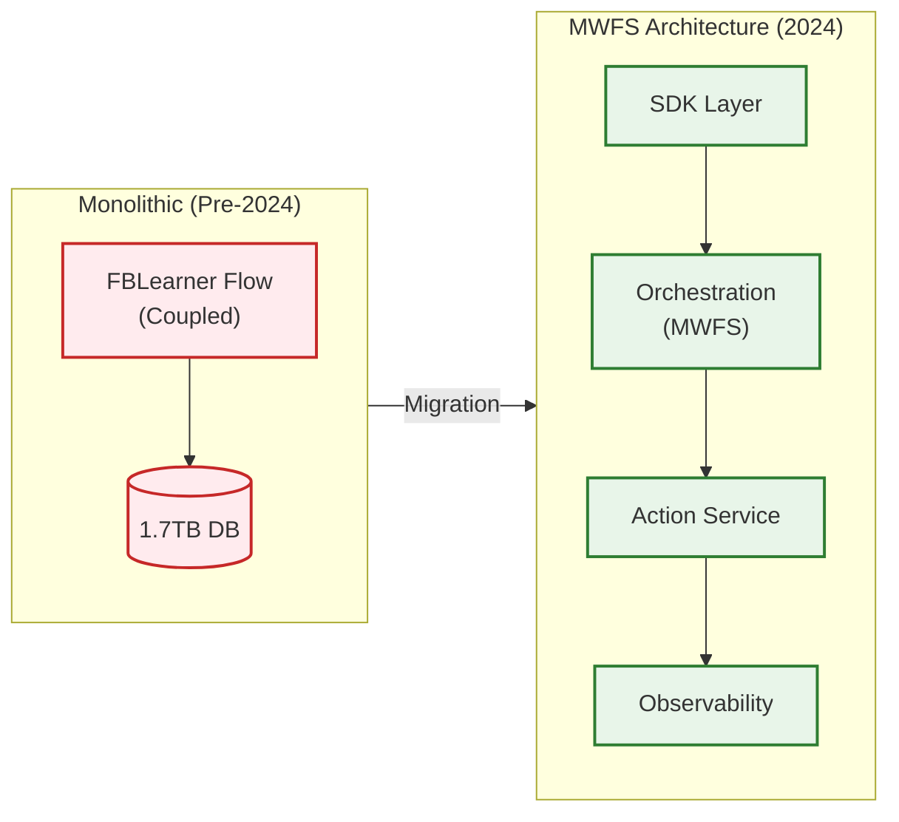
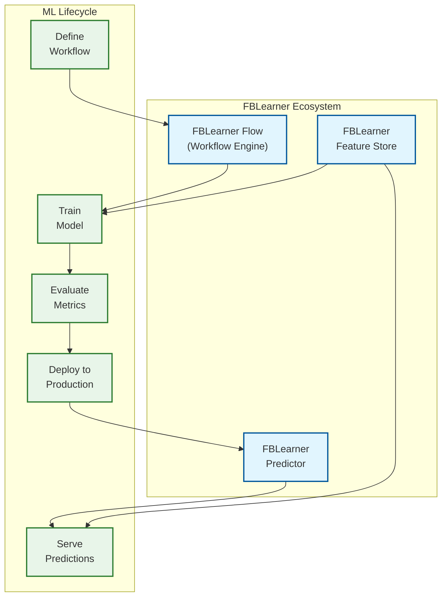

# Meta FBLearner Flow Declarative ML Platform

## Overview

**Meta FBLearner Flow** is the pioneering declarative ML platform that became Facebook's AI backbone, publicly announced in May 2016. The platform introduced the revolutionary **futures-based execution model** that enables automatic DAG parallelization from sequential-looking Python code. FBLearner Flow achieved its mission of putting **"ML in the hands of every engineer"**, training **1M+ models** and serving **6M+ predictions per second** across Facebook's products including News Feed, Ads, Instagram, and Messenger.

**Key Differentiator:** Unlike imperative ML frameworks, FBLearner Flow's two-stage compilation separates DAG construction from execution. Operators return futures instead of results, allowing the system to build a complete dependency graph before execution and automatically parallelize independent operations. Combined with its **auto UI generation** from typed workflow schemas, engineers can launch ML workflows without writing any frontend code.

---

## System Characteristics

| Characteristic | Value | Implication |
|----------------|-------|-------------|
| Traffic Pattern | Mixed: Batch training + Real-time inference | Separate compute pools for training vs serving |
| Execution Model | Futures-based, two-stage compilation | DAG built before execution, automatic parallelization |
| Latency Sensitivity | Training: Low, Inference: High (ms-level) | Predictor optimized separately from Flow |
| Consistency Model | Strong (workflow state), Eventual (metrics) | Atomic operator completion semantics |
| Availability Target | 99.9% for Predictor, 99.5% for training | Predictor is user-facing critical path |
| State Management | External (workflow metadata DB) | Enables replay, debugging, and auditing |

---

## Complexity Rating

| Component | Rating | Justification |
|-----------|--------|---------------|
| **Overall** | Very High | Futures-based execution + custom type system + auto UI + multi-framework support |
| DAG Compiler | Very High | Two-stage compilation, futures resolution, parallel path detection |
| Operator Framework | High | Resource declaration, code deployment, data transport between operators |
| Custom Type System | High | Semantic ML types, workflow-agnostic interpretation, UI rendering |
| Auto UI Generator | Medium-High | Type-to-form mapping, validation, plugin system |
| Resource Scheduler | High | GPU/CPU/memory allocation, fairness across 1,100+ teams |
| FBLearner Predictor | Very High | 6M QPS, containerized models, auto-scaling |
| MWFS (2024 Evolution) | High | Event-driven orchestration, separation of concerns |

---

## Quick Navigation

| Document | Description |
|----------|-------------|
| [01 - Requirements & Estimations](./01-requirements-and-estimations.md) | Functional/non-functional requirements, capacity planning, SLOs |
| [02 - High-Level Design](./02-high-level-design.md) | Architecture diagrams, data flow, key decisions |
| [03 - Low-Level Design](./03-low-level-design.md) | Data models, APIs, algorithms (pseudocode) |
| [04 - Deep Dive & Bottlenecks](./04-deep-dive-and-bottlenecks.md) | Futures compiler, resource scheduler, auto UI |
| [05 - Scalability & Reliability](./05-scalability-and-reliability.md) | Scaling strategies, fault tolerance, MWFS evolution |
| [06 - Security & Compliance](./06-security-and-compliance.md) | Multi-tenancy, access control, threat model |
| [07 - Observability](./07-observability.md) | Metrics, logging, tracing, alerting |
| [08 - Interview Guide](./08-interview-guide.md) | 45-minute pacing, trap questions, trade-offs |

---

## Core Components

| Component | Responsibility | Key Innovation |
|-----------|----------------|----------------|
| **Workflow Engine** | Parse declarative Python workflows, manage execution | Futures-based DAG compilation |
| **Operator Framework** | Reusable computation units with typed I/O | Resource declaration, automatic code deployment |
| **Custom Type System** | Semantic types for ML data (features, datasets) | Enables auto UI and workflow-agnostic tooling |
| **Auto UI Generator** | Generate launch forms from workflow schemas | No frontend code required for workflow launching |
| **Resource Scheduler** | Allocate GPU/CPU/memory to operators | Fairness scheduling across teams |
| **FBLearner Feature Store** | Feature creation and serving | Training-serving consistency |
| **FBLearner Predictor** | Real-time model inference | Containerized, auto-scaling, 6M QPS |
| **MWFS (Meta Workflow Service)** | Modern orchestration layer (2024) | Event-driven, horizontally scalable |

---

## Architecture Overview



---

## Platform Evolution

| Era | Version | Key Capabilities |
|-----|---------|------------------|
| **2016** | 1.0 | Original launch: declarative workflows, futures-based execution, auto UI |
| **2017-2019** | 1.x | Feature store integration, Predictor scaling, PyTorch support |
| **2020-2022** | 2.x | ONNX integration, expanded GPU support, experiment management |
| **2023-2024** | MWFS | Meta Workflow Service: event-driven, separated orchestration, 20K+ operator support |
| **2025-2026** | Current | LLM fine-tuning integration, 350K+ H100 GPU infrastructure |

### MWFS Evolution (2023-2024)

The original monolithic architecture faced critical limitations:
- **Database bottleneck**: ~1.7TB monolithic database
- **Tight coupling**: Pipeline authoring, orchestration, and execution intertwined
- **Scaling limits**: Could not support 20K+ operator pipelines

**MWFS Solution:**



---

## Platform Comparison

| Aspect | FBLearner Flow | Michelangelo | Metaflow |
|--------|----------------|--------------|----------|
| **Company** | Meta (Facebook) | Uber | Netflix |
| **Announced** | May 2016 | Late 2017 | 2019 |
| **Primary Innovation** | Futures-based DAG, Auto UI | Feature Store (Palette) | Python decorators, Resume |
| **Scale** | 1M+ models, 6M pred/s | 10M pred/s, 5K models | 3K projects, 100M jobs/yr |
| **Execution Model** | Two-stage compilation | Pipeline-based | Step-based DAG |
| **UI Generation** | Automatic from types | Manual configuration | Manual + Cards |
| **Framework Support** | PyTorch + Caffe2 + ONNX | Spark + Ray | Any Python |
| **Feature Store** | Integrated | Palette (pioneered) | External |
| **Open Source** | No | No | Yes |

---

## Key Numbers

| Metric | Value | Context |
|--------|-------|---------|
| Models trained (total) | 1M+ | Since 2016 launch |
| Models trained/month | 600K+ | Typical monthly volume |
| Data entries/model | 2.3B | Average training data size |
| Predictions/second | 6M+ | Peak production inference |
| Teams using platform | 1,100+ | Across Meta |
| Engineer adoption | 25-50% | Of Facebook engineering |
| GPU infrastructure (2024) | 350K H100s | Supporting training workloads |

---

## FBLearner Ecosystem



---

## Interview Readiness Checklist

- [ ] Explain the futures-based two-stage execution model
- [ ] Understand how automatic DAG parallelization works
- [ ] Know the custom type system and its role in auto UI generation
- [ ] Describe operator abstraction and resource declaration
- [ ] Compare FBLearner (2016) vs Michelangelo (2017) vs Metaflow (2019)
- [ ] Understand PyTorch ↔ Caffe2 ↔ ONNX framework integration
- [ ] Know the evolution from monolithic to MWFS architecture
- [ ] Describe FBLearner Predictor's role in serving 6M QPS
- [ ] Understand multi-tenancy challenges with 1,100+ teams
- [ ] Know the scale: 1M+ models, 600K models/month, 2.3B entries/model

---

## Quick Reference Card

```
+-----------------------------------------------------------------------+
|          META FBLEARNER FLOW - QUICK REFERENCE                         |
+-----------------------------------------------------------------------+
|                                                                        |
|  CORE COMPONENTS                   SCALE TARGETS                       |
|  ----------------                  --------------                       |
|  * Workflow Engine (Futures)       * 1M+ total models trained          |
|  * Operator Framework              * 600K models/month                 |
|  * Custom Type System              * 6M predictions/second             |
|  * Auto UI Generator               * 1,100+ teams                      |
|  * Resource Scheduler              * 25-50% engineer adoption          |
|  * FBLearner Predictor             * 350K H100 GPUs (2024)             |
|                                                                        |
+-----------------------------------------------------------------------+
|                                                                        |
|  KEY INNOVATIONS                   FRAMEWORK SUPPORT                   |
|  ---------------                   ------------------                   |
|  * Futures-based execution         * PyTorch (research)                |
|  * Automatic DAG parallelization   * Caffe2 (production)               |
|  * Auto UI from typed schemas      * ONNX (model exchange)             |
|  * Two-stage compilation           * TensorFlow, MxNet (limited)       |
|  * Operator reusability            * Custom operators                  |
|                                                                        |
+-----------------------------------------------------------------------+
|                                                                        |
|  INTERVIEW KEYWORDS                                                    |
|  ------------------                                                    |
|  Futures-based execution, two-stage compilation, DAG parallelization,  |
|  custom type system, auto UI generation, operator abstraction,         |
|  resource scheduler, FBLearner Predictor, Caffe2, PyTorch, ONNX,       |
|  MWFS, event-driven orchestration, feature store, model serving,       |
|  Tupperware containers, multi-tenancy, fairness scheduling             |
|                                                                        |
+-----------------------------------------------------------------------+
```

---

## Related Systems

- [3.4 MLOps Platform](../3.4-mlops-platform/00-index.md) - Generic MLOps concepts
- [3.5 Uber Michelangelo](../3.5-uber-michelangelo-ml-platform/00-index.md) - Feature store-centric ML platform
- [3.6 Netflix Metaflow](../3.6-netflix-metaflow-ml-workflow-platform/00-index.md) - Python-native workflow orchestration
- [3.7 Netflix Runway](../3.7-netflix-runway-model-lifecycle/00-index.md) - Model lifecycle management
- [2.6 Distributed Job Scheduler](../2.6-distributed-job-scheduler/00-index.md) - General scheduling patterns

---

## References

- [Introducing FBLearner Flow: Facebook's AI Backbone](https://engineering.fb.com/2016/05/09/core-infra/introducing-fblearner-flow-facebook-s-ai-backbone/) - Meta Engineering Blog (2016)
- [Machine Learning at Scale: FBLearner Flow](https://atscaleconference.com/videos/machine-learning-at-scale-fblearner-flow/) - At Scale Conference
- [Evolution of AI Training Orchestration with Serverless Ecosystem](https://atscaleconference.com/evolution-of-ai-training-orchestration-with-serverless-ecosystem/) - At Scale Conference (2024)
- [Applied Machine Learning at Facebook: A Datacenter Infrastructure Perspective](https://abelay.github.io/6828seminar/papers/hazelwood:ml.pdf) - Academic Paper
- [Meta's Infrastructure Evolution and the Advent of AI](https://engineering.fb.com/2025/09/29/data-infrastructure/metas-infrastructure-evolution-and-the-advent-of-ai/) - Meta Engineering Blog (2025)
- [ML Platform @ Facebook](https://www.truefoundry.com/blog/ml-platform-at-facebook) - True ML Talks
