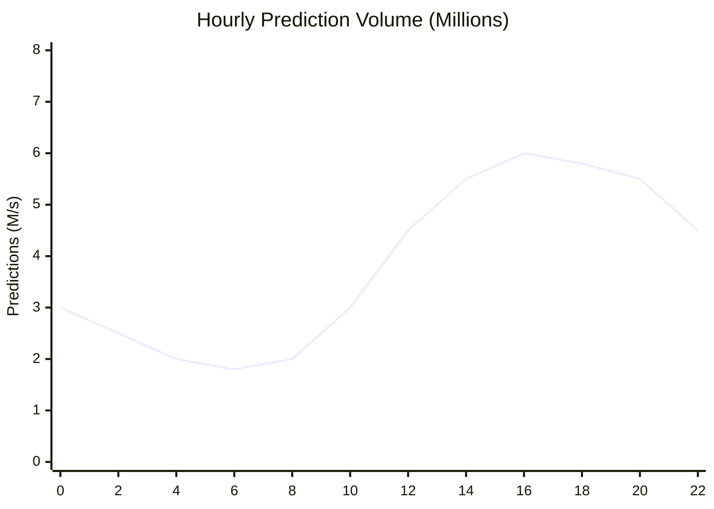

# Requirements & Estimations

## Functional Requirements

### Core Features (Must Have)

| Feature | Description | Priority |
|---------|-------------|----------|
| **Declarative Workflow Definition** | Python-based workflow syntax with operator composition | P0 |
| **Futures-Based Execution** | Two-stage compilation: DAG construction then execution | P0 |
| **Automatic DAG Parallelization** | Detect and execute independent operators concurrently | P0 |
| **Operator Framework** | Reusable computation units with typed inputs/outputs | P0 |
| **Resource Management** | CPU/GPU/memory allocation based on operator declarations | P0 |
| **Auto UI Generation** | Automatic form generation from typed workflow schemas | P0 |
| **Model Training** | Support neural networks, GBDT, logistic regression, etc. | P0 |
| **Model Deployment** | Push trained models to FBLearner Predictor | P0 |
| **Experiment Tracking** | Version workflows, compare experiments, track metrics | P1 |
| **Feature Store Integration** | Connect with FBLearner Feature Store for training/serving | P1 |

### Operator Capabilities

| Capability | Description |
|------------|-------------|
| **Data Splitting** | Split datasets for train/validation/test |
| **Feature Engineering** | Transform and combine features |
| **Model Training** | Train models using various frameworks |
| **Model Evaluation** | Compute metrics (accuracy, AUC, precision, recall) |
| **Model Export** | Export to ONNX/Caffe2 for production |
| **Hyperparameter Tuning** | Parameter sweeps, AutoML |
| **Custom Operators** | User-defined operators with typed I/O |

### Workflow Features

| Feature | Description |
|---------|-------------|
| **Parameter Sweeps** | Run workflows with multiple parameter combinations |
| **Conditional Execution** | Branch based on runtime conditions |
| **Workflow Versioning** | Track and compare workflow versions |
| **Reproducibility** | Reproduce any past workflow execution |
| **Resumability** | Resume failed workflows from last checkpoint |

---

## Out of Scope

| Feature | Reason |
|---------|--------|
| Real-time serving | Handled by FBLearner Predictor separately |
| Feature engineering pipelines | Handled by FBLearner Feature Store |
| Data labeling | Separate annotation tools |
| A/B testing runtime | Separate experimentation platform |
| Model interpretability | Separate tooling (but metrics supported) |

---

## Non-Functional Requirements

### CAP Theorem Position

**Choice: AP (Availability + Partition Tolerance)**

| Aspect | Decision | Justification |
|--------|----------|---------------|
| **Consistency** | Eventual for metrics, Strong for workflow state | Training jobs can tolerate eventual metric aggregation |
| **Availability** | High priority | Engineers blocked if platform unavailable |
| **Partition Tolerance** | Required | Distributed execution across data centers |

### Consistency Model

| Data Type | Model | Rationale |
|-----------|-------|-----------|
| Workflow State | Strong | Must accurately reflect execution progress |
| Operator Results | Strong | Downstream operators depend on upstream completion |
| Metrics/Logs | Eventual | Aggregation windows acceptable |
| Model Artifacts | Strong | Deployment requires correct model version |

### Availability Targets

| Component | Target | Justification |
|-----------|--------|---------------|
| Workflow Submission | 99.9% | Critical for engineer productivity |
| DAG Execution | 99.5% | Individual failures retryable |
| FBLearner Predictor | 99.99% | User-facing critical path |
| UI (Auto-generated) | 99.9% | Engineers need workflow launch capability |
| Metadata Service | 99.9% | Required for experiment tracking |

### Latency Targets

| Operation | P50 | P95 | P99 |
|-----------|-----|-----|-----|
| Workflow submission | 100ms | 500ms | 1s |
| DAG compilation | 1s | 5s | 30s (large DAGs) |
| Operator start (after ready) | 10s | 60s | 5min (GPU queue) |
| Model prediction (Predictor) | 5ms | 20ms | 100ms |
| UI form generation | 200ms | 500ms | 1s |

### Durability Guarantees

| Data | Guarantee | Mechanism |
|------|-----------|-----------|
| Workflow definitions | 99.999% | Replicated database |
| Model artifacts | 99.999999% | Distributed object storage |
| Training logs | 99.99% | Retained for 90 days |
| Metrics | 99.99% | Time-series database with replication |

---

## Capacity Estimations

### Training Scale

| Metric | Value | Calculation |
|--------|-------|-------------|
| Models trained (total) | 1M+ | Historical accumulation since 2016 |
| Models/month | 600,000 | 600K typical monthly volume |
| Models/day | 20,000 | 600K / 30 days |
| Models/hour | 833 | 20K / 24 hours |
| Concurrent training jobs | 5,000 | ~6 hours avg training × 833 starts/hr |

### Data Scale

| Metric | Value | Calculation |
|--------|-------|-------------|
| Data entries/model (avg) | 2.3B | Per research paper |
| Training data/month | 1.38E+15 | 2.3B × 600K models |
| Storage/model (avg) | 500 MB | Model weights + metadata |
| New model storage/month | 300 TB | 500 MB × 600K models |
| Model storage (5 years) | 18 PB | 300 TB × 12 × 5 years |

### Inference Scale (FBLearner Predictor)

| Metric | Value | Calculation |
|--------|-------|-------------|
| Predictions/second | 6M+ | Peak production load |
| Predictions/day | 518B | 6M × 86,400 seconds |
| Deployed models | 100K+ | Active in Predictor |
| Average model size | 100 MB | Compressed production format |
| Model serving memory | 10 TB | 100K × 100 MB |

### Compute Resources

| Resource | Value | Context |
|----------|-------|---------|
| GPU pool (2024) | 350K H100s | Portfolio equivalent ~600K H100s |
| CPU cores | 10M+ | Shared pool across Meta |
| Memory pool | 100+ PB | Distributed across data centers |
| Network bandwidth | 100 GB/s | Per GPU server (2024 upgrade) |

### Team Scale

| Metric | Value | Calculation |
|--------|-------|-------------|
| Teams using FBLearner | 1,100+ | Across all Meta products |
| Active engineers | 5,000-10,000 | 25-50% of FB engineering |
| Workflows launched/day | 50,000+ | ~50 per team avg |
| Concurrent workflows | 10,000+ | Peak active executions |

---

## SLOs / SLAs

### Training Platform SLOs

| Metric | Target | Measurement |
|--------|--------|-------------|
| Workflow submission success | 99.9% | Successful submissions / total attempts |
| DAG compilation success | 99.5% | Successful compilations / submissions |
| Operator execution success | 95% | Successful operators / scheduled (before retries) |
| End-to-end workflow success | 90% | Successful completions / submissions |
| Workflow completion latency | P90 < 24h | For typical training workflows |

### Predictor (Serving) SLOs

| Metric | Target | Measurement |
|--------|--------|-------------|
| Availability | 99.99% | Uptime per month |
| Latency (P50) | < 5ms | End-to-end prediction |
| Latency (P99) | < 100ms | Including feature lookup |
| Throughput | 6M+ QPS | Sustained peak capacity |
| Error rate | < 0.1% | Non-2xx responses |

### Resource Fairness SLOs

| Metric | Target | Measurement |
|--------|--------|-------------|
| GPU allocation fairness | < 10% deviation | Per-team allocation vs entitlement |
| Queue wait time (P95) | < 1 hour | GPU job scheduling |
| Priority job preemption | < 5 minutes | High-priority job start time |

---

## Traffic Patterns

### Training Traffic

```mermaid
gantt
    title Daily Training Traffic Pattern
    dateFormat HH:mm
    axisFormat %H:%M

    section Traffic
    Low (Night US)      :00:00, 6h
    Ramp Up (Morning)   :06:00, 3h
    Peak (Business)     :09:00, 8h
    Sustained (Evening) :17:00, 4h
    Taper (Night)       :21:00, 3h
```

### Inference Traffic

---

## Growth Projections

| Metric | Current (2026) | Year 1 | Year 3 | Year 5 |
|--------|---------------|--------|--------|--------|
| Models/month | 600K | 800K | 1.5M | 3M |
| Predictions/second | 6M | 10M | 25M | 50M |
| Teams | 1,100 | 1,300 | 1,800 | 2,500 |
| GPU pool | 350K H100 | 500K | 1M+ | 2M+ |
| Model storage | 18 PB | 25 PB | 60 PB | 150 PB |

### Growth Drivers

1. **LLM Fine-tuning**: Increased model customization requirements
2. **New Products**: Threads, AI assistants, AR/VR applications
3. **Model Complexity**: Larger models, more frequent retraining
4. **Geographic Expansion**: More localized models per region
5. **Democratization**: More engineers adopting ML in their work

---

## Constraints

### Technical Constraints

| Constraint | Impact | Mitigation |
|------------|--------|------------|
| GPU availability | Queue wait times | Priority scheduling, preemption |
| Network bandwidth | Large model transfer | Model compression, caching |
| Memory limits | Large batch sizes | Gradient accumulation, sharding |
| Storage IOPS | Checkpoint performance | SSD tiers, batched writes |

### Organizational Constraints

| Constraint | Impact | Mitigation |
|------------|--------|------------|
| Multi-tenancy (1,100+ teams) | Fairness, isolation | Per-team quotas, sandboxing |
| Diverse skill levels | Platform complexity | Auto UI, sensible defaults |
| Framework preferences | Support burden | ONNX standardization |
| Compliance requirements | Data handling | Access controls, audit logs |

---

## Success Metrics

### Adoption Metrics

| Metric | Target | Current |
|--------|--------|---------|
| % of FB engineers using FBLearner | > 50% | 25-50% |
| Teams onboarded | > 1,500 | 1,100+ |
| Workflows/engineer/month | > 10 | ~8 |
| Time to first model (new user) | < 1 day | ~2 days |

### Efficiency Metrics

| Metric | Target | Current |
|--------|--------|---------|
| GPU utilization | > 80% | ~70% |
| Workflow success rate | > 95% | ~90% |
| Model time-to-production | < 1 week | ~2 weeks |
| Experiment iteration time | < 1 hour | ~2 hours |

### Quality Metrics

| Metric | Target | Current |
|--------|--------|---------|
| Predictor latency (P99) | < 50ms | ~100ms |
| Model freshness | < 24h stale | ~12h |
| Feature-training consistency | > 99.9% | 99.5% |
| Reproducibility rate | > 99% | 98% |
