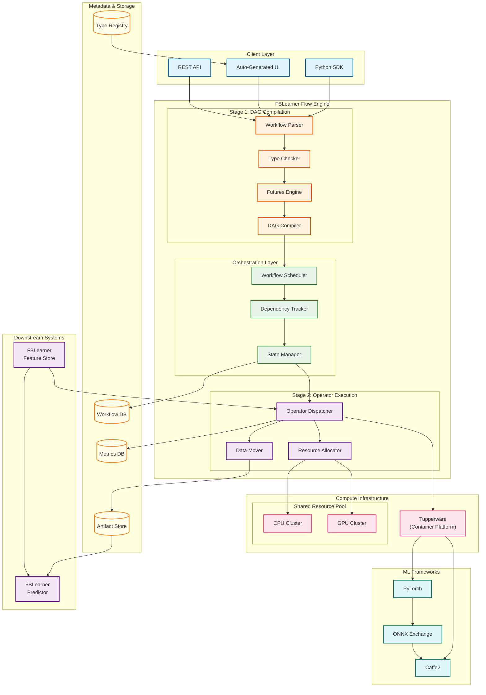
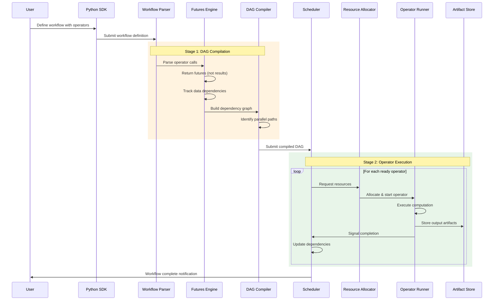
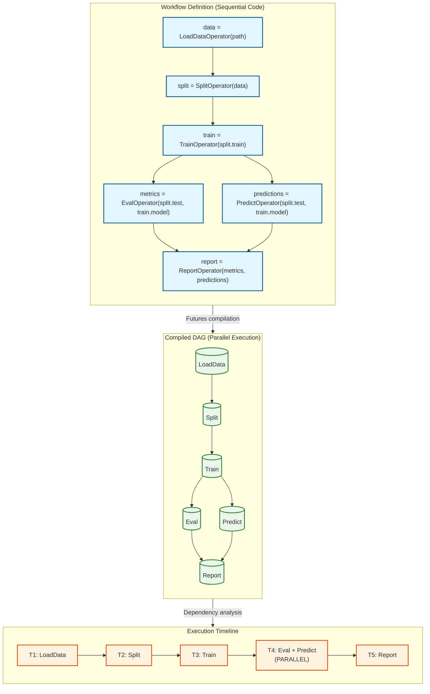
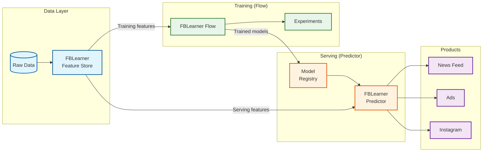
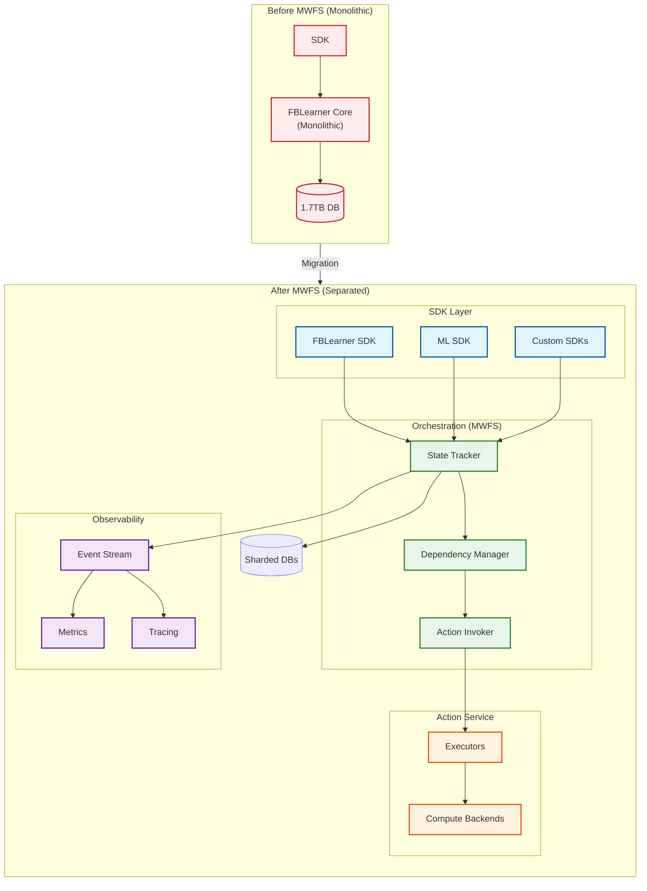
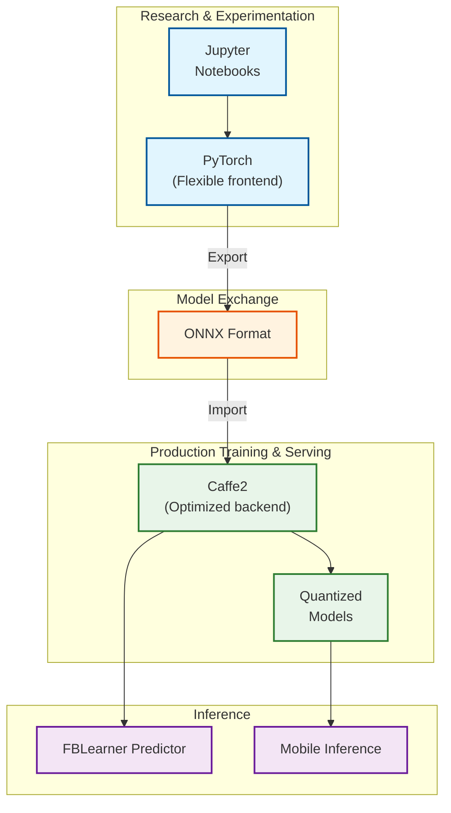
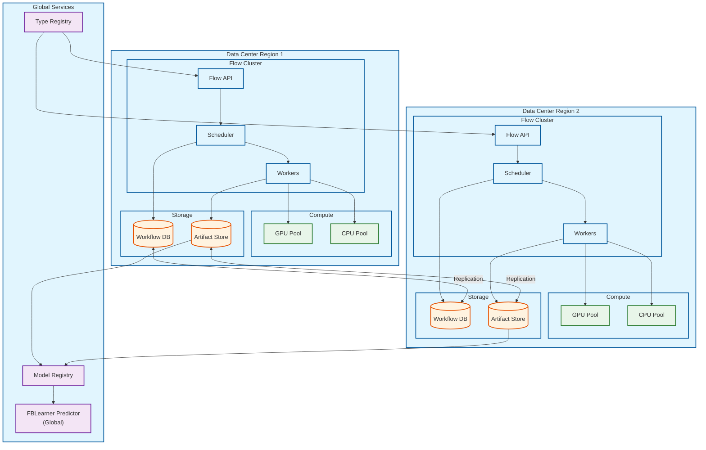

# High-Level Design

## Architecture Overview

FBLearner Flow's architecture centers on its revolutionary **futures-based execution model**. The system separates workflow definition from execution through a two-stage compilation process, enabling automatic parallelization of independent operators without requiring explicit orchestration code.



---

## Core Data Flow

### Training Workflow Execution



### Futures-Based Parallel Execution



---

## Key Architectural Decisions

### 1. Futures-Based Execution Model

| Option | Pros | Cons | Decision |
|--------|------|------|----------|
| **Futures (Chosen)** | Automatic parallelization, sequential code style | More complex runtime | **Selected** |
| Eager Execution | Simple mental model | Manual parallelization | Rejected |
| Explicit DAG (Airflow-style) | Clear dependencies | Verbose, error-prone | Rejected |

**Justification:** Futures allow engineers to write natural, sequential-looking Python code while the system automatically identifies and exploits parallelism. This reduces cognitive load and eliminates manual dependency management errors.

### 2. Two-Stage Compilation

| Aspect | Stage 1: DAG Compilation | Stage 2: Execution |
|--------|--------------------------|-------------------|
| **Purpose** | Build complete dependency graph | Execute operators |
| **Output** | DAG with typed edges | Artifacts, metrics |
| **Timing** | Before any execution | After full DAG built |
| **Benefit** | Global optimization possible | Efficient scheduling |

**Justification:** Separating compilation from execution enables global DAG optimization (identifying all parallel paths) before committing any compute resources.

### 3. Operator Abstraction

| Option | Pros | Cons | Decision |
|--------|------|------|----------|
| **Typed Operators (Chosen)** | Reusability, auto UI, validation | Type system overhead | **Selected** |
| Raw Functions | Simple, flexible | No tooling support | Rejected |
| Task Graphs | Fine-grained | Too low-level | Rejected |

**Justification:** Strongly-typed operators enable automatic UI generation, type checking at compile time, and a rich library of reusable components.

### 4. Custom Type System

| Option | Pros | Cons | Decision |
|--------|------|------|----------|
| **Custom ML Types (Chosen)** | Semantic meaning, auto UI | Learning curve | **Selected** |
| Python Types | Standard, familiar | Not rich enough for ML | Rejected |
| Protocol Buffers | Cross-language | Verbose for ML data | Rejected |

**Justification:** Custom types like `FeatureSet`, `Dataset`, `Model` carry semantic meaning that enables workflow-agnostic tooling and automatic UI rendering.

### 5. Resource Declaration Model

| Option | Pros | Cons | Decision |
|--------|------|------|----------|
| **Declarative (Chosen)** | Auto-allocation, fairness | Less control | **Selected** |
| Manual Allocation | Full control | Error-prone, unfair | Rejected |
| Auto-detect | Zero config | Unpredictable | Rejected |

**Justification:** Operators declare their resource needs (CPU, GPU, memory), and the platform handles allocation with fairness across teams.

---

## Architecture Pattern Checklist

| Pattern | Decision | Justification |
|---------|----------|---------------|
| Sync vs Async | **Async** | Long-running training jobs, event-driven completion |
| Event-driven vs Request-response | **Event-driven** | Operator completion triggers downstream execution |
| Push vs Pull | **Pull** | Operators pull data when ready to execute |
| Stateless vs Stateful | **Stateless operators** | State externalized to artifact store |
| Read-heavy vs Write-heavy | **Write-heavy (training)** | Large model artifacts, logs, metrics |
| Real-time vs Batch | **Batch (training)** | Training is batch; serving is separate system |
| Edge vs Origin | **Origin** | Centralized training in data centers |

---

## Component Deep Dive

### Workflow Parser

Parses Python workflow definitions and initiates the futures resolution process.

```
Responsibilities:
├── Parse workflow class and methods
├── Extract operator calls and parameters
├── Validate type annotations
├── Initialize futures tracking
└── Generate workflow metadata
```

### Futures Engine

The core innovation: tracks operator calls and builds the dependency graph without executing.

```
Responsibilities:
├── Intercept operator __call__ methods
├── Return Future objects instead of results
├── Track data dependencies between futures
├── Build adjacency list for DAG compiler
└── Detect cycles (error condition)
```

### DAG Compiler

Transforms futures into an optimized execution plan.

```
Responsibilities:
├── Topologically sort operators
├── Identify parallel execution paths
├── Optimize data locality
├── Generate execution schedule
└── Annotate with resource requirements
```

### Resource Allocator

Matches operator requirements to available resources with fairness.

```
Responsibilities:
├── Parse operator resource declarations
├── Query available pool capacity
├── Implement fairness scheduling
├── Handle priority and preemption
└── Track utilization metrics
```

### Auto UI Generator

Generates launch interfaces from typed workflow schemas.

```
Responsibilities:
├── Parse workflow input schema
├── Map types to UI components
├── Generate validation rules
├── Render typeaheads for complex types
└── Support custom plugins per team
```

---

## FBLearner Ecosystem Integration



---

## MWFS Evolution (2024)

The Meta Workflow Service (MWFS) represents the modern evolution of FBLearner Flow's orchestration layer.



### MWFS Design Principles

| Principle | Description | Benefit |
|-----------|-------------|---------|
| **Separation of Concerns** | SDK, orchestration, execution, observability are separate | Independent scaling, evolution |
| **Event-Driven** | State changes emit events | Real-time observability |
| **Horizontally Scalable** | SQL + distributed queues | No single point of bottleneck |
| **Backend Agnostic** | Action Service abstracts execution | New backends without core changes |

---

## Framework Integration



### Framework Roles

| Framework | Role | Characteristics |
|-----------|------|-----------------|
| **PyTorch** | Research, exploration | Flexible, eager execution, rapid iteration |
| **Caffe2** | Production training & serving | Async execution, quantization, performance |
| **ONNX** | Model exchange | Framework interoperability |
| **TensorFlow** | Limited support | Legacy, some specialized models |

---

## Deployment Topology


