# Deep Dive & Bottlenecks

## Critical Component 1: Futures-Based DAG Compiler

### Why This Is Critical

The futures-based DAG compiler is the heart of FBLearner Flow's innovation. It enables engineers to write sequential-looking Python code that automatically executes in parallel. This component directly impacts:

- **Developer productivity**: Sequential code is easier to write and reason about
- **Execution efficiency**: Automatic parallelization maximizes resource utilization
- **Correctness**: Compile-time dependency validation prevents runtime errors

### How It Works Internally



```mermaid
sequenceDiagram
    participant Code as User Code
    participant Proxy as Operator Proxy
    participant Futures as Futures Engine
    participant Graph as DAG Builder

    Code->>Proxy: train_op = TrainOperator(data)
    Proxy->>Futures: Create Future(train_op_id)
    Futures->>Futures: Register operator metadata
    Futures-->>Proxy: Return Future object
    Proxy-->>Code: Return Future (not result)

    Code->>Proxy: eval_op = EvalOperator(train_op.model)
    Proxy->>Futures: Create Future(eval_op_id)
    Futures->>Futures: Detect dependency on train_op
    Futures->>Graph: Add edge: train_op → eval_op
    Futures-->>Proxy: Return Future object
    Proxy-->>Code: Return Future (not result)

    Note over Code,Graph: No execution has happened yet

    Code->>Futures: workflow.run()
    Futures->>Graph: Finalize DAG
    Graph->>Graph: Validate (no cycles)
    Graph->>Graph: Compute parallel levels
    Graph-->>Futures: Compiled DAG
    Futures->>Futures: Begin execution
```

### Internal Data Structures

```
FuturesEngine {
    operator_registry:    Map<OperatorID, OperatorMetadata>
    futures_map:          Map<FutureID, Future>
    dependency_edges:     List<(FutureID, FutureID)>
    execution_context:    ExecutionContext

    // Methods
    create_future(operator_call) -> Future
    resolve_input(input_spec) -> (FutureID | Literal)
    finalize_dag() -> CompiledDAG
}

Future {
    future_id:            UUID
    operator_id:          UUID
    output_name:          String (optional)
    resolved_value:       Any (null until execution)
    is_resolved:          Boolean

    // Attribute access returns new futures
    __getattr__(name) -> Future
}
```

### Parallel Path Detection

The DAG compiler uses topological levels to identify parallel execution opportunities:

```
ALGORITHM DetectParallelPaths(dag)
    // Compute levels via BFS from roots
    levels = {}
    FOR each root IN dag.get_roots():
        levels[root] = 0

    FOR level FROM 0 TO max_level:
        FOR each node AT level:
            FOR each child IN node.children:
                levels[child] = max(levels.get(child, 0), level + 1)

    // Group nodes by level
    level_groups = group_by(dag.nodes, key=levels)

    // All nodes at the same level can run in parallel
    FOR each level, nodes IN level_groups:
        IF len(nodes) > 1:
            mark_parallel_group(nodes)

    RETURN level_groups
```

### Failure Modes

| Failure Mode | Cause | Detection | Recovery |
|--------------|-------|-----------|----------|
| Cyclic dependency | User error in workflow definition | Compile-time cycle detection | Reject workflow, report cycle path |
| Type mismatch | Incompatible operator connections | Compile-time type checking | Reject with type error details |
| Missing dependency | Referencing undefined operator | Compile-time validation | Reject with undefined reference error |
| Large DAG compilation timeout | DAG too complex (20K+ operators) | Compilation timeout | MWFS migration for large DAGs |

---

## Critical Component 2: Resource Scheduler

### Why This Is Critical

The resource scheduler manages the shared pool of CPUs, GPUs, and memory across 1,100+ teams. Poor scheduling leads to:

- **Wasted resources**: Low utilization while jobs wait
- **Unfairness**: Some teams monopolizing resources
- **Long queue times**: Blocked engineer productivity
- **Priority inversion**: Critical jobs delayed by low-priority work

### How It Works Internally


### Multi-Dimensional Resource Matching

GPUs, CPUs, and memory must be allocated together:

```
ALGORITHM MultiDimensionalMatch(request, pool)
    // Score each worker by fit
    scores = []

    FOR each worker IN pool.workers:
        IF NOT can_fit(worker, request):
            CONTINUE

        score = compute_fit_score(worker, request)
        scores.append((worker, score))

    // Sort by best fit (minimize waste)
    scores.sort(by=score, descending=True)

    IF scores.empty():
        RETURN NULL

    best_worker = scores[0].worker
    RETURN allocate_from_worker(best_worker, request)

FUNCTION compute_fit_score(worker, request)
    // Penalize wasted resources
    cpu_waste = (worker.available_cpus - request.cpu_cores) / worker.total_cpus
    mem_waste = (worker.available_memory - request.memory_gb) / worker.total_memory
    gpu_waste = (worker.available_gpus - request.gpu_count) / worker.total_gpus

    // Prefer workers with minimal waste
    score = 1.0 - (0.3 * cpu_waste + 0.3 * mem_waste + 0.4 * gpu_waste)

    // Bonus for GPU locality (multi-GPU training)
    IF request.gpu_count > 1 AND worker.available_gpus >= request.gpu_count:
        score += 0.2

    RETURN score
```

### Fairness Scheduling Algorithm

```
ALGORITHM FairnessScheduler(queue, pool, quotas)
    // Compute current usage per team
    usage = compute_team_usage(pool)

    // Compute fair share violations
    violations = {}
    FOR each team IN quotas:
        expected_share = quotas[team].fair_share
        actual_usage = usage.get(team, 0) / pool.total_capacity
        violations[team] = actual_usage - expected_share

    // Priority = base_priority - (violation * fairness_weight)
    FOR each job IN queue:
        team = job.team
        job.effective_priority = job.base_priority - (violations[team] * FAIRNESS_WEIGHT)

    // Sort queue by effective priority
    queue.sort(by=effective_priority, descending=True)

    // Schedule in priority order
    scheduled = []
    FOR each job IN queue:
        IF can_allocate(job, pool):
            allocation = allocate(job, pool)
            scheduled.append((job, allocation))
            update_usage(usage, job.team, allocation)

    RETURN scheduled
```

### Failure Modes

| Failure Mode | Cause | Detection | Recovery |
|--------------|-------|-----------|----------|
| Resource exhaustion | High demand | Queue depth monitoring | Backpressure, priority scheduling |
| Worker failure | Hardware/network issues | Heartbeat timeout | Reassign jobs, retry |
| Quota exceeded | Team over-usage | Real-time quota tracking | Queue job with lower priority |
| Priority inversion | Low-priority job holding resources | Long-running job detection | Preemption for critical jobs |
| Deadlock | Circular resource waiting | Timeout detection | Force release, reschedule |

---

## Critical Component 3: Auto UI Generator

### Why This Is Critical

Auto UI generation is FBLearner's "secret weapon" for democratizing ML. It enables:

- **Zero frontend code**: Engineers launch workflows without UI development
- **Consistent UX**: All workflows share familiar interface patterns
- **Validation**: Type-based validation prevents common input errors
- **Discoverability**: Rich autocomplete for datasets, features, models

### How It Works Internally


### Type-to-Component Mapping

```
TYPE_COMPONENT_MAP = {
    "Dataset": {
        component: "DatasetSelector",
        features: ["autocomplete", "preview", "schema_display"],
        autocomplete_source: "/api/datasets",
        preview_api: "/api/datasets/{id}/preview"
    },

    "FeatureSet": {
        component: "FeatureSetSelector",
        features: ["autocomplete", "multi_select", "feature_stats"],
        autocomplete_source: "/api/feature-store/feature-sets",
        stat_api: "/api/feature-store/feature-sets/{id}/stats"
    },

    "Model": {
        component: "ModelSelector",
        features: ["autocomplete", "version_selector", "metrics_preview"],
        autocomplete_source: "/api/models",
        metrics_api: "/api/models/{id}/metrics"
    },

    "HyperparameterSet": {
        component: "HyperparameterEditor",
        features: ["nested_form", "defaults", "range_validation"],
        schema_driven: true
    },

    "Date": {
        component: "DatePicker",
        features: ["calendar", "range_picker"],
        default: "today"
    },

    "Enum": {
        component: "Select",
        features: ["searchable"],
        options_from_type: true
    }
}
```

### Plugin System for Team Customization

```
ALGORITHM RenderWithPlugins(ui_schema, team_plugins)
    rendered_form = base_render(ui_schema)

    FOR each field IN ui_schema.fields:
        // Check for team-specific plugin
        plugin = team_plugins.get(field.type)

        IF plugin != NULL:
            // Replace standard component with custom
            custom_component = plugin.render(field)
            rendered_form.replace_field(field.name, custom_component)

        // Check for team-specific validators
        custom_validators = team_plugins.get_validators(field.type)
        IF custom_validators != NULL:
            rendered_form.add_validators(field.name, custom_validators)

    // Add team-specific actions
    FOR each action IN team_plugins.custom_actions:
        rendered_form.add_action_button(action)

    RETURN rendered_form
```

### Failure Modes

| Failure Mode | Cause | Detection | Recovery |
|--------------|-------|-----------|----------|
| Unknown type | New type not in registry | Schema parsing error | Fall back to TextInput |
| Autocomplete service down | Backend failure | Timeout/error response | Cached suggestions, manual input |
| Invalid plugin | Plugin code error | Plugin sandbox error | Disable plugin, use default |
| Schema too complex | Deeply nested types | Render timeout | Simplified view, manual JSON input |

---

## Concurrency & Race Conditions

### Race Condition 1: Operator Output Collision

**Scenario:** Multiple operators write to same artifact path.


**Solution:** Content-addressed storage with execution-scoped namespaces.

```
artifact_path = f"/{execution_id}/{operator_id}/{output_name}/{content_hash}"
```

### Race Condition 2: Resource Double-Allocation

**Scenario:** Two schedulers allocate the same GPU.

**Solution:** Distributed locking with lease-based allocation.

```
ALGORITHM AtomicAllocation(resource_id, job_id)
    lock = acquire_lock(f"resource:{resource_id}", timeout=5s)

    IF lock == NULL:
        RETURN RETRY_LATER

    TRY:
        IF is_available(resource_id):
            mark_allocated(resource_id, job_id)
            RETURN SUCCESS
        ELSE:
            RETURN UNAVAILABLE
    FINALLY:
        release_lock(lock)
```

### Race Condition 3: DAG State Update Conflict

**Scenario:** Multiple node completions update DAG state simultaneously.

**Solution:** Optimistic locking with version numbers.

```
ALGORITHM UpdateNodeState(execution_id, node_id, new_status)
    WHILE TRUE:
        current = load_execution_state(execution_id)
        version = current.version

        // Apply update
        updated = current.copy()
        updated.nodes[node_id].status = new_status
        updated.version = version + 1

        // Conditional write
        success = compare_and_swap(execution_id, version, updated)

        IF success:
            RETURN updated
        ELSE:
            // Retry with fresh state
            CONTINUE
```

---

## Bottleneck Analysis

### Bottleneck 1: Monolithic Database (Pre-MWFS)

**Problem:** Original FBLearner used a single ~1.7TB database for all workflow state.


**Impact:**
- Write contention during peak hours
- Read latency spikes
- Backup/recovery complexity
- Schema migration downtime

**Mitigation (MWFS Solution):**


### Bottleneck 2: GPU Queue Starvation

**Problem:** Large jobs monopolize GPUs, starving smaller jobs.

**Impact:**
- Long queue times for small experiments
- Unfair resource distribution
- Reduced iteration speed

**Mitigation:**

```
ALGORITHM AntiStarvationScheduler(queue, pool)
    // Track job wait times
    FOR each job IN queue:
        job.wait_time = now() - job.submitted_at

    // Boost priority for long-waiting jobs
    FOR each job IN queue:
        IF job.wait_time > STARVATION_THRESHOLD:
            job.priority_boost = log(job.wait_time / STARVATION_THRESHOLD)
            job.effective_priority += job.priority_boost

    // Consider preemption for starving jobs
    IF high_priority_starving_jobs_exist():
        preempt_low_priority_jobs()
```

### Bottleneck 3: Large DAG Compilation

**Problem:** DAGs with 20K+ operators exceed compilation time limits.

**Impact:**
- Workflow submission failures
- Complex ML pipelines unsupported
- Engineers resort to manual orchestration

**Mitigation:**

1. **Incremental Compilation:** Compile sub-DAGs independently
2. **Caching:** Cache compiled operator subgraphs
3. **MWFS Migration:** Separate compilation from orchestration

```
ALGORITHM IncrementalCompilation(large_workflow)
    // Identify sub-DAG boundaries
    partitions = partition_dag(large_workflow, max_size=1000)

    compiled_partitions = []
    FOR each partition IN partitions:
        // Check cache
        cache_key = hash(partition.operators)
        IF cache.has(cache_key):
            compiled = cache.get(cache_key)
        ELSE:
            compiled = compile_partition(partition)
            cache.set(cache_key, compiled)

        compiled_partitions.append(compiled)

    // Stitch partitions into full DAG
    full_dag = stitch_partitions(compiled_partitions)
    RETURN full_dag
```

---

## Bottleneck Summary

| Bottleneck | Severity | Root Cause | Solution | Status |
|------------|----------|------------|----------|--------|
| Monolithic DB | Critical | Single point of contention | MWFS sharded architecture | Resolved (2024) |
| GPU starvation | High | Large job monopolization | Anti-starvation scheduling, preemption | Mitigated |
| Large DAG compilation | High | O(V+E) scaling | Incremental compilation, caching | Mitigated |
| Network bandwidth | Medium | Large model transfers | Compression, caching | Mitigated |
| Feature store latency | Medium | Remote feature lookups | Co-located caching | Ongoing |
