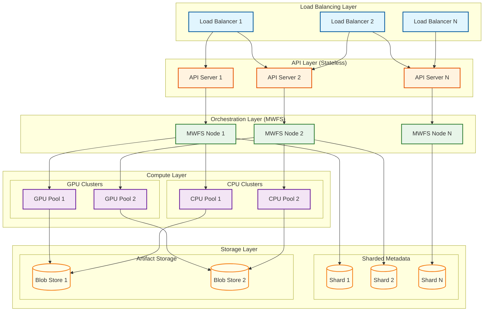
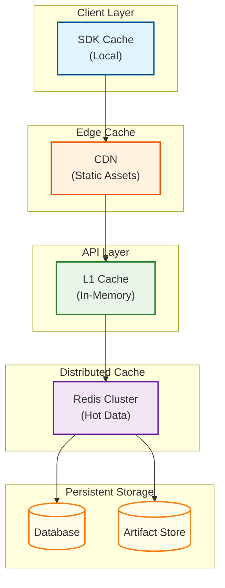
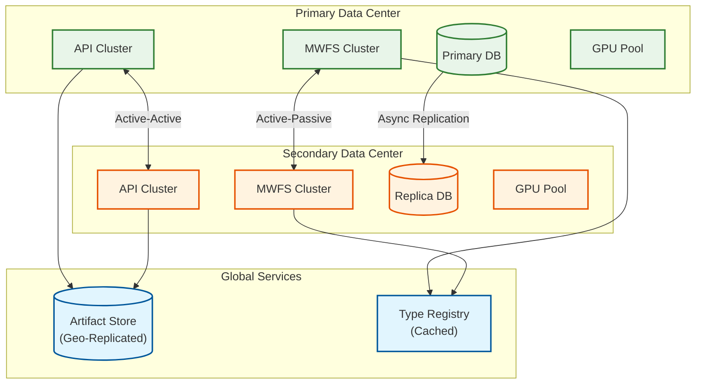
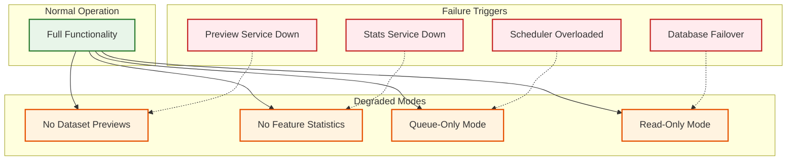
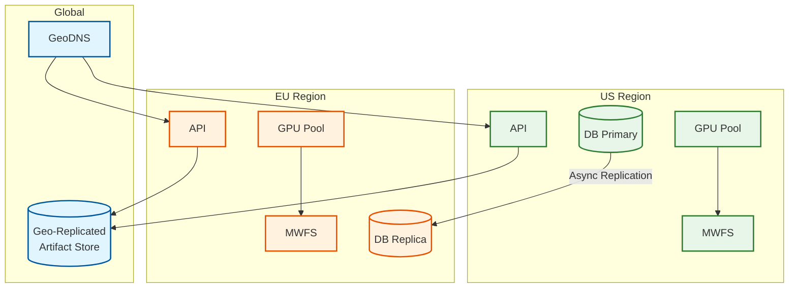

# Scalability & Reliability

## Scalability Strategy

### Horizontal Scaling Architecture

FBLearner Flow scales horizontally across all layers to support 1,100+ teams and 600K+ models/month.



### Scaling Dimensions

| Dimension | Scaling Mechanism | Trigger | Target |
|-----------|-------------------|---------|--------|
| API Servers | Horizontal (add instances) | CPU > 70% | < 100ms P99 latency |
| MWFS Nodes | Horizontal (partition by team) | Queue depth > 1000 | < 1s scheduling latency |
| GPU Workers | Horizontal (add nodes) | Queue wait > 1hr | < 30min queue time |
| CPU Workers | Horizontal (auto-scale) | Utilization > 80% | < 10min queue time |
| Database Shards | Horizontal (add shards) | Shard size > 500GB | < 50ms query P99 |
| Artifact Storage | Horizontal (geo-distributed) | Capacity planning | Unlimited |

### Database Sharding Strategy

**Shard Key: Team ID**

```
FUNCTION route_to_shard(team_id, total_shards)
    // Consistent hashing for even distribution
    hash = murmur3_hash(team_id)
    shard_index = hash % total_shards
    RETURN shard_index

// Team-specific queries hit single shard
// Cross-team queries (admin) use scatter-gather
```

**Benefits:**
- Team isolation: One team's load doesn't affect others
- Locality: All team data co-located
- Scale: Add shards as teams grow

**Trade-offs:**
- Cross-team queries require scatter-gather
- Team size imbalance may cause hot shards
- Rebalancing requires data migration

### Auto-Scaling Configuration

```yaml
# API Layer Auto-Scaling
api_autoscaler:
  min_replicas: 10
  max_replicas: 100
  metrics:
    - type: cpu
      target_utilization: 70%
    - type: request_latency_p99
      target: 100ms
  scale_up:
    cooldown: 60s
    increment: 20%
  scale_down:
    cooldown: 300s
    decrement: 10%

# GPU Pool Auto-Scaling (slower due to provisioning)
gpu_autoscaler:
  min_nodes: 1000
  max_nodes: 5000
  metrics:
    - type: queue_wait_time_p95
      target: 30m
    - type: utilization
      target: 85%
  scale_up:
    cooldown: 600s  # GPU provisioning is slow
    increment: 100 nodes
  scale_down:
    cooldown: 3600s  # Keep capacity to avoid churn
    decrement: 50 nodes
```

---

## Caching Strategy

### Multi-Layer Caching



### Cache Usage by Data Type

| Data Type | Cache Layer | TTL | Invalidation |
|-----------|-------------|-----|--------------|
| Type Registry | CDN + L1 | 1 hour | Version-based |
| Workflow Definitions | Redis | 15 min | On update |
| Execution Status | L1 | 5 sec | Real-time events |
| Feature Statistics | Redis | 1 hour | Daily refresh |
| Model Metadata | Redis | 30 min | On deployment |
| Artifact Hashes | L1 + Redis | Permanent | Content-addressed (never changes) |

### Hot Spot Mitigation

```
ALGORITHM MitigateHotSpots(cache, request)
    key = request.cache_key

    // Check if key is hot (high access rate)
    access_rate = get_access_rate(key)

    IF access_rate > HOT_THRESHOLD:
        // Replicate hot key across multiple cache nodes
        replica_count = min(access_rate / HOT_THRESHOLD, MAX_REPLICAS)
        replicated_keys = create_replicas(key, replica_count)

        // Randomly select a replica to spread load
        selected_key = random_choice(replicated_keys)
        RETURN cache.get(selected_key)
    ELSE:
        RETURN cache.get(key)

// For extremely hot data (e.g., popular model metadata)
// Use read-through cache with local in-memory copy
```

---

## Fault Tolerance

### Single Points of Failure (SPOF) Analysis

| Component | SPOF Risk | Mitigation |
|-----------|-----------|------------|
| API Layer | Low | Multiple stateless instances behind LB |
| MWFS Orchestrator | Medium | Active-passive with leader election |
| Database | Low (post-MWFS) | Sharded, replicated within shard |
| Artifact Store | Low | Distributed object storage with replication |
| Type Registry | Medium | Cached at multiple layers, readonly |
| GPU Scheduler | Medium | Multiple scheduler instances, partitioned |

### Redundancy Strategy



### Failover Mechanisms

**API Layer Failover:**
```
ALGORITHM APIFailover(request)
    primary_endpoints = get_healthy_endpoints(PRIMARY_DC)

    IF primary_endpoints.not_empty():
        RETURN route_to(random_choice(primary_endpoints))

    // Primary DC unavailable
    secondary_endpoints = get_healthy_endpoints(SECONDARY_DC)

    IF secondary_endpoints.not_empty():
        log_failover_event(PRIMARY_DC, SECONDARY_DC)
        RETURN route_to(random_choice(secondary_endpoints))

    // Both DCs unavailable
    RETURN ServiceUnavailableError()
```

**MWFS Leader Election:**
```
ALGORITHM MWFSLeaderElection(nodes)
    // Using distributed consensus (e.g., Raft/Paxos)
    current_term = get_current_term()

    WHILE TRUE:
        leader = elect_leader(nodes, current_term)

        IF leader == self:
            // I am the leader
            start_processing_workflows()
            send_heartbeats_to_followers()
        ELSE:
            // I am a follower
            replicate_state_from_leader(leader)
            wait_for_leader_heartbeat(timeout=5s)

            IF heartbeat_timeout:
                // Leader may have failed
                current_term += 1
                CONTINUE  // Start new election
```

### Circuit Breaker Pattern

```
ALGORITHM CircuitBreaker(service_call, config)
    state = get_circuit_state(service_call.service_name)

    SWITCH state:
        CASE CLOSED:
            TRY:
                result = execute(service_call)
                record_success(service_call.service_name)
                RETURN result
            CATCH error:
                record_failure(service_call.service_name)
                IF failure_count > config.failure_threshold:
                    open_circuit(service_call.service_name)
                RAISE error

        CASE OPEN:
            IF time_since_opened > config.reset_timeout:
                set_state(service_call.service_name, HALF_OPEN)
                // Fall through to HALF_OPEN
            ELSE:
                RAISE CircuitOpenError("Service unavailable")

        CASE HALF_OPEN:
            TRY:
                result = execute(service_call)
                close_circuit(service_call.service_name)
                RETURN result
            CATCH error:
                open_circuit(service_call.service_name)
                RAISE error

// Configuration per service
circuit_configs = {
    "database": {failure_threshold: 5, reset_timeout: 30s},
    "gpu_scheduler": {failure_threshold: 3, reset_timeout: 60s},
    "feature_store": {failure_threshold: 10, reset_timeout: 15s}
}
```

### Retry Strategy with Exponential Backoff

```
ALGORITHM RetryWithBackoff(operation, config)
    attempt = 0

    WHILE attempt < config.max_retries:
        TRY:
            RETURN operation()
        CATCH RetryableError as error:
            attempt += 1

            IF attempt >= config.max_retries:
                RAISE MaxRetriesExceededError(error)

            // Exponential backoff with jitter
            base_delay = config.initial_delay * (2 ^ attempt)
            jitter = random(0, base_delay * 0.1)
            delay = min(base_delay + jitter, config.max_delay)

            log(f"Retry {attempt}/{config.max_retries} after {delay}ms")
            sleep(delay)

// Retry configuration
retry_configs = {
    "operator_execution": {
        max_retries: 3,
        initial_delay: 1000ms,
        max_delay: 30000ms,
        retryable_errors: [TimeoutError, ResourceUnavailableError]
    },
    "artifact_upload": {
        max_retries: 5,
        initial_delay: 500ms,
        max_delay: 60000ms,
        retryable_errors: [NetworkError, StorageTemporaryError]
    }
}
```

### Graceful Degradation



**Degradation Policies:**

| Trigger | Degradation Mode | User Impact | Auto-Recovery |
|---------|------------------|-------------|---------------|
| Preview service down | Disable dataset previews | Minor - can still launch | Yes, on health check pass |
| Stats service down | Show cached stats only | Minor - stale stats | Yes, on health check pass |
| Scheduler overloaded | Queue-only mode | Medium - delayed starts | Yes, when queue drains |
| Database failover | Read-only mode | High - no new workflows | Yes, on failover complete |
| GPU exhaustion | CPU-only mode | High - no GPU training | Manual - capacity planning |

---

## Disaster Recovery

### RTO and RPO Targets

| Component | RTO | RPO | Mechanism |
|-----------|-----|-----|-----------|
| Workflow Metadata | 1 hour | 0 (sync replication) | Cross-DC sync replication |
| Execution State | 4 hours | 15 minutes | Async replication + logs |
| Artifacts | 8 hours | 0 | Geo-replicated object storage |
| Type Registry | 30 minutes | 0 | Cached + backed by DB |
| Running Jobs | N/A | Checkpoint interval | Checkpoint-based recovery |

### Backup Strategy

```
BACKUP_SCHEDULE = {
    "workflow_metadata": {
        frequency: "continuous",
        retention: "90 days",
        type: "incremental"
    },
    "execution_state": {
        frequency: "hourly",
        retention: "30 days",
        type: "snapshot"
    },
    "artifacts": {
        frequency: "on_write",
        retention: "1 year",
        type: "replicated"
    },
    "full_backup": {
        frequency: "weekly",
        retention: "1 year",
        type: "full"
    }
}
```

### Recovery Procedures

**Scenario 1: Single Shard Failure**
```
1. Detect shard unavailable (automated monitoring)
2. Route traffic to replica shard
3. Promote replica to primary
4. Provision new replica
5. Resync data to new replica
6. Update routing table

Estimated RTO: 5-15 minutes (automated)
```

**Scenario 2: Full Data Center Failure**
```
1. Detect DC failure (multiple service health checks)
2. Trigger DNS failover to secondary DC
3. Promote secondary DB replicas to primary
4. Scale up secondary DC capacity
5. Resume operations in secondary DC
6. Queue non-critical workloads until capacity restored

Estimated RTO: 30-60 minutes
```

**Scenario 3: Artifact Store Corruption**
```
1. Detect corruption (checksum validation)
2. Identify affected artifacts
3. Restore from geo-replicated copy
4. Validate restored artifacts
5. Invalidate caches
6. Notify affected workflows

Estimated RTO: 1-4 hours depending on data volume
```

### Multi-Region Considerations



**Cross-Region Trade-offs:**

| Aspect | Within Region | Cross-Region |
|--------|---------------|--------------|
| Latency | < 10ms | 50-150ms |
| Consistency | Strong | Eventual |
| Failover | Automatic | Manual/Semi-auto |
| Cost | Lower | Higher (egress) |
