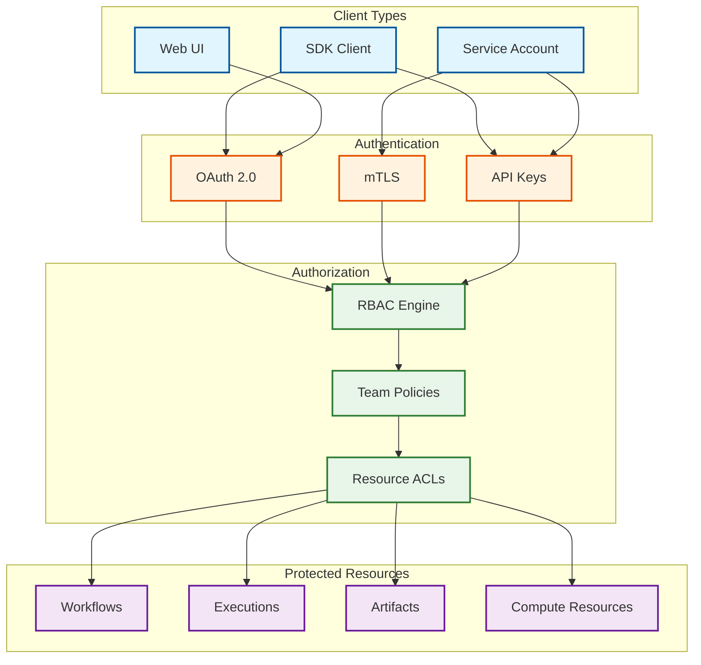
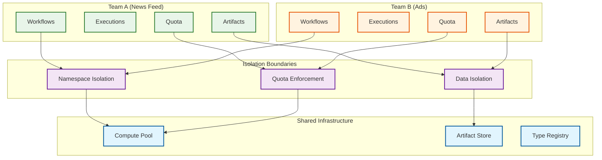
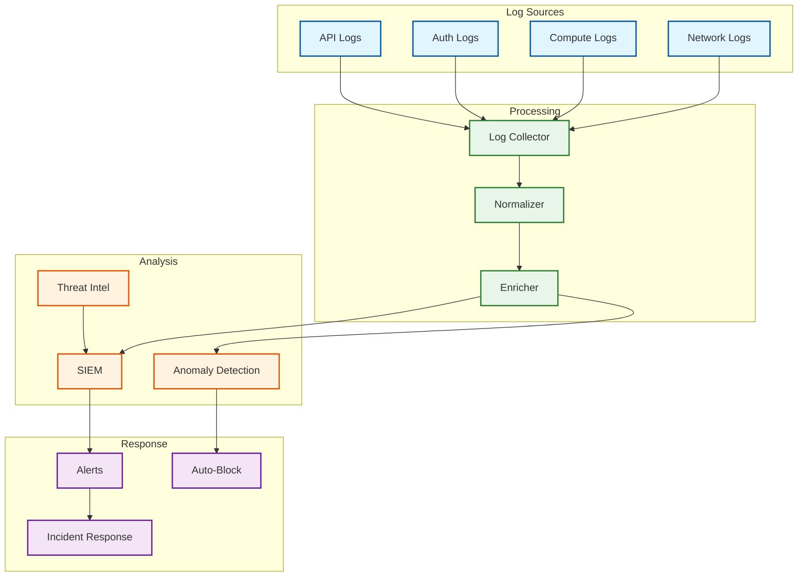

# Security & Compliance

## Authentication & Authorization

### Authentication Mechanisms



### Authentication Flows

**Human Users (OAuth 2.0 + Internal SSO):**
```
1. User accesses FBLearner UI
2. Redirect to internal SSO (OAuth 2.0 provider)
3. User authenticates with credentials + MFA
4. SSO returns authorization code
5. UI exchanges code for access token + refresh token
6. Access token includes user identity and group memberships
7. Token validated on each API request
```

**Service Accounts (mTLS):**
```
1. Service has X.509 certificate signed by internal CA
2. Service establishes mTLS connection to FBLearner API
3. API validates certificate chain
4. API extracts service identity from certificate CN/SAN
5. Service identity mapped to permissions
```

### Authorization Model (RBAC)

```
// Role Definitions
ROLES = {
    "workflow_admin": {
        permissions: [
            "workflow:create",
            "workflow:read",
            "workflow:update",
            "workflow:delete",
            "execution:create",
            "execution:read",
            "execution:cancel"
        ]
    },
    "workflow_developer": {
        permissions: [
            "workflow:create",
            "workflow:read",
            "workflow:update",
            "execution:create",
            "execution:read"
        ]
    },
    "workflow_viewer": {
        permissions: [
            "workflow:read",
            "execution:read"
        ]
    },
    "compute_admin": {
        permissions: [
            "compute:manage_quotas",
            "compute:preempt_jobs",
            "compute:view_all_jobs"
        ]
    }
}

// Team-Based Access
TEAM_ASSIGNMENTS = {
    "team:news_feed_ml": {
        members: ["user:alice", "user:bob"],
        roles: ["workflow_admin"],
        resources: ["workflow:nf_*", "execution:nf_*"]
    }
}
```

### Permission Check Algorithm

```
ALGORITHM CheckPermission(user, action, resource)
    // Get user's team memberships
    teams = get_user_teams(user)

    // Get all roles from team assignments
    roles = []
    FOR each team IN teams:
        team_roles = get_team_roles(team)
        roles.extend(team_roles)

    // Check if any role grants the requested permission
    FOR each role IN roles:
        IF role.permissions.contains(action):
            // Check resource scope
            IF matches_resource_scope(role, resource):
                log_access_granted(user, action, resource)
                RETURN ALLOWED

    log_access_denied(user, action, resource)
    RETURN DENIED

FUNCTION matches_resource_scope(role, resource)
    FOR each pattern IN role.resource_patterns:
        IF glob_match(pattern, resource):
            RETURN TRUE
    RETURN FALSE
```

---

## Multi-Tenancy Security

### Team Isolation Model



### Isolation Mechanisms

| Layer | Mechanism | Enforcement |
|-------|-----------|-------------|
| **Namespace** | Team-prefixed resource IDs | API validation |
| **Compute** | Containerized operator execution | Tupperware isolation |
| **Data** | Team-scoped storage paths | Object store ACLs |
| **Network** | VPC segmentation | Network policies |
| **Secrets** | Per-team secret namespaces | Secret manager ACLs |

### Quota Enforcement

```
ALGORITHM EnforceQuota(team, resource_request)
    quota = get_team_quota(team)
    current_usage = get_current_usage(team)

    // Check each resource dimension
    FOR resource_type IN [CPU, GPU, MEMORY, STORAGE]:
        requested = resource_request.get(resource_type, 0)
        used = current_usage.get(resource_type, 0)
        limit = quota.get(resource_type, 0)

        IF used + requested > limit:
            RETURN QuotaExceededError(
                resource_type=resource_type,
                requested=requested,
                used=used,
                limit=limit
            )

    // Reserve quota
    reserve_quota(team, resource_request)
    RETURN ALLOWED
```

---

## Data Security

### Encryption

**At Rest:**
| Data Type | Encryption | Key Management |
|-----------|------------|----------------|
| Workflow metadata | AES-256 | Internal KMS |
| Model artifacts | AES-256 | Per-team keys |
| Training data | AES-256 | Dataset-specific keys |
| Logs | AES-256 | Shared key |
| Secrets | AES-256-GCM | Dedicated secret store |

**In Transit:**
| Communication Path | Encryption | Certificate Management |
|--------------------|------------|------------------------|
| Client → API | TLS 1.3 | Internal CA |
| API → Database | mTLS | Internal CA |
| Operator → Artifact Store | TLS 1.3 | Internal CA |
| Cross-DC replication | mTLS | Internal CA |

### Sensitive Data Handling

```
DATA_CLASSIFICATION = {
    "public": {
        examples: ["public model architectures", "type definitions"],
        encryption: "in_transit",
        access: "any_authenticated_user",
        retention: "indefinite"
    },
    "internal": {
        examples: ["model weights", "training metrics"],
        encryption: "at_rest_and_transit",
        access: "team_members",
        retention: "3_years"
    },
    "confidential": {
        examples: ["user data features", "PII-derived models"],
        encryption: "at_rest_and_transit",
        access: "approved_team_members",
        retention: "1_year",
        audit: "all_access_logged"
    },
    "restricted": {
        examples: ["raw PII", "financial data"],
        encryption: "at_rest_and_transit_with_dedicated_keys",
        access: "explicit_approval_required",
        retention: "minimum_necessary",
        audit: "all_access_logged_and_reviewed"
    }
}
```

### Data Masking and Anonymization

```
ALGORITHM MaskSensitiveData(data, context)
    classification = get_data_classification(data)
    user_clearance = get_user_clearance(context.user)

    IF classification.level > user_clearance:
        // Apply masking based on data type
        SWITCH data.type:
            CASE "user_id":
                RETURN hash_with_salt(data.value)
            CASE "email":
                RETURN mask_email(data.value)  // j***@example.com
            CASE "feature_value":
                RETURN apply_differential_privacy(data.value)
            DEFAULT:
                RETURN "[REDACTED]"

    RETURN data.value
```

---

## Threat Model

### Top Security Threats

| Threat | Description | Likelihood | Impact | Mitigation |
|--------|-------------|------------|--------|------------|
| **Code Injection** | Malicious code in custom operators | Medium | Critical | Sandboxed execution, code review |
| **Data Exfiltration** | Unauthorized access to training data | Medium | Critical | ACLs, audit logging, DLP |
| **Resource Abuse** | Crypto mining in compute pool | Low | High | Resource monitoring, anomaly detection |
| **Model Theft** | Stealing proprietary models | Medium | High | Artifact ACLs, download audit |
| **Privilege Escalation** | Gaining unauthorized permissions | Low | Critical | RBAC, least privilege, audit |
| **Supply Chain Attack** | Malicious dependencies in operators | Medium | Critical | Dependency scanning, pinned versions |

### Threat Mitigation Details

**Code Injection Prevention:**
```
OPERATOR_SANDBOX_CONFIG = {
    // Container isolation
    container_runtime: "gVisor",  // Kernel isolation
    seccomp_profile: "strict",
    capabilities: ["NET_BIND_SERVICE"],  // Minimal capabilities
    read_only_rootfs: true,

    // Resource limits
    max_memory: "32GB",
    max_cpu: "16 cores",
    max_runtime: "24 hours",
    max_network_egress: "10GB",

    // Network restrictions
    allowed_egress: [
        "artifact-store.internal",
        "feature-store.internal",
        "metrics.internal"
    ],
    blocked_egress: ["*"]  // Default deny
}
```

**Data Exfiltration Prevention:**
```
DLP_POLICIES = {
    // Artifact download restrictions
    "artifact_download": {
        max_downloads_per_hour: 10,
        require_approval_for: ["models > 1GB", "datasets"],
        audit_all: true
    },

    // Network egress monitoring
    "network_egress": {
        monitor_patterns: [
            "base64_encoded_large_payloads",
            "known_exfil_endpoints",
            "unusual_destination_ips"
        ],
        alert_threshold: "medium",
        block_threshold: "high"
    }
}
```

### Rate Limiting & DDoS Protection

```
RATE_LIMITS = {
    "api_requests": {
        per_user: "1000/minute",
        per_team: "10000/minute",
        global: "100000/minute"
    },
    "workflow_submissions": {
        per_user: "100/hour",
        per_team: "1000/hour"
    },
    "artifact_downloads": {
        per_user: "10/hour",
        per_team: "100/hour"
    },
    "compute_requests": {
        per_team: "based_on_quota"
    }
}

// Progressive rate limiting
ALGORITHM AdaptiveRateLimit(request, user)
    current_rate = get_request_rate(user)
    limit = get_rate_limit(request.type, user)

    IF current_rate > limit * 0.8:
        // Approaching limit, add delay
        add_request_delay(current_rate / limit * 100ms)

    IF current_rate > limit:
        // Over limit, reject
        RETURN RateLimitError(retry_after=60s)

    RETURN ALLOWED
```

---

## Audit & Compliance

### Audit Logging

```
AUDIT_LOG_SCHEMA = {
    timestamp: ISO8601,
    event_id: UUID,
    event_type: String,  // e.g., "workflow.create", "artifact.download"
    actor: {
        user_id: String,
        team_id: String,
        ip_address: String,
        user_agent: String
    },
    resource: {
        type: String,
        id: String,
        owner_team: String
    },
    action: String,  // e.g., "create", "read", "update", "delete"
    result: String,  // "success", "denied", "error"
    details: Map<String, Any>,  // Action-specific details
    request_id: UUID
}

// Events that trigger audit logging
AUDITED_EVENTS = [
    "workflow.create",
    "workflow.update",
    "workflow.delete",
    "execution.launch",
    "execution.cancel",
    "artifact.download",
    "artifact.delete",
    "permission.grant",
    "permission.revoke",
    "quota.modify",
    "secret.access"
]
```

### Compliance Requirements

| Regulation | Requirement | Implementation |
|------------|-------------|----------------|
| **GDPR** | Data subject rights | Data export/deletion APIs |
| **CCPA** | Right to know/delete | User data audit trail |
| **SOC 2** | Access controls | RBAC, audit logging |
| **Internal Policy** | Data classification | Classification tags, ACLs |

### Data Retention Policies

```
RETENTION_POLICIES = {
    "audit_logs": {
        retention: "7 years",
        immutable: true,
        storage: "cold_archive"
    },
    "execution_logs": {
        retention: "90 days",
        compaction: "after 30 days",
        storage: "warm"
    },
    "model_artifacts": {
        retention: "based_on_team_policy",
        default: "1 year",
        max: "5 years"
    },
    "training_data": {
        retention: "based_on_data_classification",
        pii_data: "minimum_necessary"
    }
}
```

### Security Monitoring



### Security Alerts

| Alert | Trigger | Severity | Response |
|-------|---------|----------|----------|
| Failed auth spike | > 10 failures/minute | High | Block IP, notify user |
| Unusual data access | Access outside normal pattern | Medium | Investigate, audit |
| Resource abuse | Mining indicators | High | Terminate, block team |
| Privilege escalation | Role change without approval | Critical | Revert, investigate |
| Data exfiltration | Large download spike | Critical | Block, investigate |
