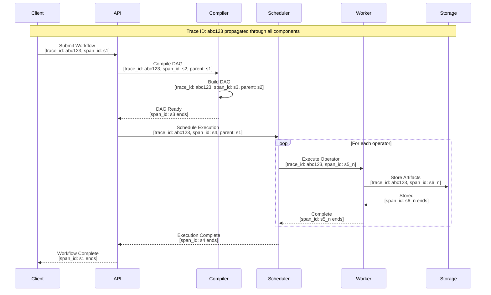

# Observability

## Metrics Strategy

### USE Method (Resources)

| Resource | Utilization | Saturation | Errors |
|----------|-------------|------------|--------|
| **CPU Pool** | % cores in use | Queue depth | Failed allocations |
| **GPU Pool** | % GPUs in use | Queue wait time | OOM errors |
| **Memory** | % memory used | Swap usage | OOM kills |
| **Network** | Bandwidth % | Packet drops | Connection errors |
| **Storage** | Capacity % | IOPS queue | Write failures |

### RED Method (Services)

| Service | Rate | Errors | Duration |
|---------|------|--------|----------|
| **Workflow API** | Requests/sec | 4xx/5xx rate | P50/P95/P99 latency |
| **DAG Compiler** | Compilations/sec | Compilation failures | Compilation time |
| **Scheduler** | Jobs scheduled/sec | Scheduling failures | Queue wait time |
| **Operator Executor** | Operators/sec | Operator failures | Execution time |
| **Artifact Store** | Reads & writes/sec | Storage errors | Transfer time |

### Key Metrics Dashboard

```mermaid
flowchart TB
    subgraph Platform["Platform Health"]
        direction TB
        API["API Health<br/>99.9% uptime"]
        Scheduler["Scheduler Health<br/>< 1s latency"]
        Compute["Compute Health<br/>70% utilization"]
    end

    subgraph Workloads["Workload Metrics"]
        direction TB
        Queue["Queue Depth<br/>5,000 pending"]
        Running["Running Jobs<br/>10,000 active"]
        Completed["Completion Rate<br/>90% success"]
    end

    subgraph Resources["Resource Metrics"]
        direction TB
        GPU["GPU Utilization<br/>75%"]
        CPU["CPU Utilization<br/>65%"]
        Memory["Memory Usage<br/>60%"]
    end

    subgraph Teams["Team Metrics"]
        direction TB
        TeamUsage["Per-Team Usage"]
        Quotas["Quota Status"]
        Fairness["Fairness Score"]
    end

    classDef platform fill:#e8f5e9,stroke:#2e7d32,stroke-width:2px
    classDef workload fill:#fff3e0,stroke:#e65100,stroke-width:2px
    classDef resource fill:#e1f5fe,stroke:#01579b,stroke-width:2px
    classDef team fill:#f3e5f5,stroke:#6a1b9a,stroke-width:2px

    class API,Scheduler,Compute platform
    class Queue,Running,Completed workload
    class GPU,CPU,Memory resource
    class TeamUsage,Quotas,Fairness team
```



### Metric Definitions

```
// Platform Health Metrics
METRICS = {
    // API Metrics
    "fblearner_api_requests_total": {
        type: "counter",
        labels: ["method", "endpoint", "status_code"],
        description: "Total API requests"
    },
    "fblearner_api_request_duration_seconds": {
        type: "histogram",
        labels: ["method", "endpoint"],
        buckets: [0.01, 0.05, 0.1, 0.5, 1, 5, 10],
        description: "API request latency"
    },

    // Workflow Metrics
    "fblearner_workflows_submitted_total": {
        type: "counter",
        labels: ["team", "workflow_type"],
        description: "Total workflows submitted"
    },
    "fblearner_workflows_completed_total": {
        type: "counter",
        labels: ["team", "status"],  // status: success, failed, cancelled
        description: "Total workflows completed"
    },
    "fblearner_workflow_duration_seconds": {
        type: "histogram",
        labels: ["team", "workflow_type"],
        buckets: [60, 300, 900, 3600, 14400, 86400],
        description: "Workflow execution duration"
    },

    // Operator Metrics
    "fblearner_operators_running": {
        type: "gauge",
        labels: ["operator_type", "team"],
        description: "Currently running operators"
    },
    "fblearner_operator_duration_seconds": {
        type: "histogram",
        labels: ["operator_type"],
        buckets: [1, 10, 60, 300, 900, 3600],
        description: "Operator execution duration"
    },

    // Resource Metrics
    "fblearner_gpu_utilization_percent": {
        type: "gauge",
        labels: ["pool", "gpu_type"],
        description: "GPU utilization percentage"
    },
    "fblearner_queue_depth": {
        type: "gauge",
        labels: ["priority", "resource_type"],
        description: "Jobs waiting in queue"
    },
    "fblearner_queue_wait_seconds": {
        type: "histogram",
        labels: ["priority", "resource_type"],
        buckets: [60, 300, 900, 1800, 3600, 7200],
        description: "Time spent waiting in queue"
    },

    // Team Metrics
    "fblearner_team_quota_usage_percent": {
        type: "gauge",
        labels: ["team", "resource_type"],
        description: "Team quota utilization"
    },
    "fblearner_team_jobs_total": {
        type: "counter",
        labels: ["team", "status"],
        description: "Total jobs per team"
    }
}
```

---

## Logging Strategy

### Log Levels

| Level | Usage | Examples | Retention |
|-------|-------|----------|-----------|
| **ERROR** | System failures requiring attention | Operator crash, DB connection failure | 90 days |
| **WARN** | Potential issues, degraded state | High queue depth, approaching quota | 30 days |
| **INFO** | Normal operations, state changes | Workflow started/completed, deployment | 14 days |
| **DEBUG** | Detailed troubleshooting | DAG compilation details, scheduling decisions | 3 days |
| **TRACE** | Very verbose debugging | Individual operator I/O, data transfers | 1 day |

### Structured Logging Format

```json
{
    "timestamp": "2026-01-24T10:15:30.123Z",
    "level": "INFO",
    "service": "fblearner-scheduler",
    "instance": "scheduler-pod-abc123",
    "trace_id": "abc123def456",
    "span_id": "span789",
    "message": "Operator scheduled for execution",
    "context": {
        "workflow_id": "wf-12345",
        "execution_id": "exec-67890",
        "operator_id": "op-train-001",
        "team": "news_feed_ml",
        "user": "alice@fb.com"
    },
    "metrics": {
        "queue_wait_ms": 1234,
        "allocated_gpus": 4,
        "allocated_memory_gb": 32
    }
}
```

### Log Categories

```
LOG_CATEGORIES = {
    "workflow_lifecycle": {
        events: ["submitted", "compiled", "started", "completed", "failed", "cancelled"],
        includes: ["workflow_id", "team", "user", "duration", "status"]
    },
    "operator_execution": {
        events: ["scheduled", "started", "checkpoint", "completed", "failed", "retried"],
        includes: ["operator_id", "execution_id", "worker", "resources", "duration"]
    },
    "resource_allocation": {
        events: ["requested", "queued", "allocated", "released"],
        includes: ["resource_type", "amount", "team", "wait_time"]
    },
    "security": {
        events: ["auth_success", "auth_failure", "permission_denied", "data_access"],
        includes: ["user", "action", "resource", "ip_address", "result"]
    },
    "system_health": {
        events: ["component_up", "component_down", "degraded", "recovered"],
        includes: ["component", "status", "details"]
    }
}
```

---

## Distributed Tracing

### Trace Propagation



### Key Spans to Instrument

| Span Name | Parent | Key Attributes |
|-----------|--------|----------------|
| `workflow.submit` | - | workflow_id, team, user |
| `dag.compile` | workflow.submit | operator_count, compile_duration |
| `dag.validate` | dag.compile | validation_errors |
| `execution.schedule` | workflow.submit | execution_id |
| `operator.queue` | execution.schedule | operator_id, wait_time |
| `operator.execute` | operator.queue | worker_id, resources |
| `artifact.upload` | operator.execute | artifact_id, size |
| `artifact.download` | operator.execute | artifact_id, size |

### Trace Sampling Strategy

```
SAMPLING_CONFIG = {
    // Always sample
    "always_sample": [
        "error",           // All errors
        "slow",            // > P99 latency
        "high_priority"    // Tier 1 workflows
    ],

    // Probabilistic sampling
    "sample_rate": {
        "default": 0.01,           // 1% of normal requests
        "debug_team": 0.10,        // 10% for teams debugging
        "workflow_submit": 0.05,   // 5% of submissions
        "operator_execute": 0.001  // 0.1% of operator executions (high volume)
    },

    // Adaptive sampling
    "adaptive": {
        "target_traces_per_minute": 1000,
        "min_rate": 0.001,
        "max_rate": 0.10
    }
}
```

---

## Alerting

### Alert Severity Levels

| Severity | Description | Response Time | Notification |
|----------|-------------|---------------|--------------|
| **P0 (Critical)** | Service down, data loss risk | Immediate | Page on-call |
| **P1 (High)** | Significant degradation | 15 minutes | Page on-call |
| **P2 (Medium)** | Minor degradation | 1 hour | Slack alert |
| **P3 (Low)** | Non-urgent issue | Next business day | Ticket |

### Critical Alerts (P0/P1)

```yaml
alerts:
  - name: fblearner_api_down
    severity: P0
    condition: |
      sum(rate(fblearner_api_requests_total{status_code="200"}[5m])) == 0
    for: 2m
    annotations:
      summary: "FBLearner API is not responding"
      runbook: "https://runbooks/fblearner-api-down"

  - name: fblearner_error_rate_high
    severity: P1
    condition: |
      sum(rate(fblearner_api_requests_total{status_code=~"5.."}[5m])) /
      sum(rate(fblearner_api_requests_total[5m])) > 0.05
    for: 5m
    annotations:
      summary: "FBLearner API error rate > 5%"
      runbook: "https://runbooks/fblearner-high-errors"

  - name: fblearner_scheduler_stuck
    severity: P1
    condition: |
      increase(fblearner_operators_scheduled_total[10m]) == 0
      AND fblearner_queue_depth > 0
    for: 10m
    annotations:
      summary: "Scheduler not scheduling jobs despite queue"
      runbook: "https://runbooks/scheduler-stuck"

  - name: fblearner_gpu_exhaustion
    severity: P1
    condition: |
      fblearner_gpu_utilization_percent > 95
      AND fblearner_queue_wait_seconds{quantile="0.95"} > 3600
    for: 30m
    annotations:
      summary: "GPU pool exhausted, long queue times"
      runbook: "https://runbooks/gpu-exhaustion"
```

### Warning Alerts (P2/P3)

```yaml
alerts:
  - name: fblearner_queue_growing
    severity: P2
    condition: |
      delta(fblearner_queue_depth[1h]) > 1000
    for: 1h
    annotations:
      summary: "Job queue growing rapidly"

  - name: fblearner_workflow_success_rate_low
    severity: P2
    condition: |
      sum(rate(fblearner_workflows_completed_total{status="success"}[1h])) /
      sum(rate(fblearner_workflows_completed_total[1h])) < 0.85
    for: 2h
    annotations:
      summary: "Workflow success rate below 85%"

  - name: fblearner_team_quota_near_limit
    severity: P3
    condition: |
      fblearner_team_quota_usage_percent > 90
    for: 1h
    labels:
      team: "{{ $labels.team }}"
    annotations:
      summary: "Team {{ $labels.team }} near quota limit"

  - name: fblearner_dag_compilation_slow
    severity: P3
    condition: |
      histogram_quantile(0.95, rate(fblearner_dag_compile_duration_seconds_bucket[1h])) > 30
    for: 1h
    annotations:
      summary: "DAG compilation P95 > 30 seconds"
```

---

## Dashboard Design

### Executive Summary Dashboard

```
┌─────────────────────────────────────────────────────────────────────────┐
│                    FBLearner Flow - Executive Summary                   │
├─────────────────────────────────────────────────────────────────────────┤
│                                                                         │
│  ┌─────────────┐  ┌─────────────┐  ┌─────────────┐  ┌─────────────┐    │
│  │   Models    │  │ Predictions │  │    Teams    │  │  GPU Usage  │    │
│  │  Trained    │  │  Per Second │  │   Active    │  │             │    │
│  │             │  │             │  │             │  │             │    │
│  │  600K/mo    │  │    6M+      │  │   1,100+    │  │    75%      │    │
│  │    ↑ 5%     │  │    ↔ 0%    │  │    ↑ 2%     │  │    ↑ 3%     │    │
│  └─────────────┘  └─────────────┘  └─────────────┘  └─────────────┘    │
│                                                                         │
│  ┌─────────────────────────────────────────────────────────────────┐   │
│  │                    Workflow Success Rate (24h)                   │   │
│  │  ████████████████████████████████████████████░░░░░  90%         │   │
│  └─────────────────────────────────────────────────────────────────┘   │
│                                                                         │
│  ┌─────────────────────────────────────────────────────────────────┐   │
│  │                    Platform Health Status                        │   │
│  │  API: ✓  Scheduler: ✓  Compute: ✓  Storage: ✓  Predictor: ✓     │   │
│  └─────────────────────────────────────────────────────────────────┘   │
│                                                                         │
└─────────────────────────────────────────────────────────────────────────┘
```

### Operations Dashboard

```
┌─────────────────────────────────────────────────────────────────────────┐
│                    FBLearner Flow - Operations                          │
├─────────────────────────────────────────────────────────────────────────┤
│                                                                         │
│  Queue Status                        Resource Utilization               │
│  ┌───────────────────────────┐      ┌───────────────────────────┐      │
│  │ Pending:     5,234        │      │ GPU:  ████████████░░░ 75%│      │
│  │ Running:    10,567        │      │ CPU:  ██████████░░░░░ 65%│      │
│  │ P95 Wait:   23 min        │      │ Mem:  ████████░░░░░░░ 55%│      │
│  └───────────────────────────┘      └───────────────────────────┘      │
│                                                                         │
│  API Latency (P99)                   Error Rate                         │
│  ┌───────────────────────────┐      ┌───────────────────────────┐      │
│  │     100ms                 │      │     0.5%                  │      │
│  │  ┌──────────────────┐    │      │  ┌──────────────────┐    │      │
│  │  │▁▁▂▂▃▃▂▂▁▁▂▂▃▃▂▁  │    │      │  │▁▁▁▁▁▂▁▁▁▁▁▁▁▁▁▁  │    │      │
│  │  └──────────────────┘    │      │  └──────────────────┘    │      │
│  │  12h ago          now    │      │  12h ago          now    │      │
│  └───────────────────────────┘      └───────────────────────────┘      │
│                                                                         │
│  Top Teams by Usage (24h)           Recent Failures                     │
│  ┌───────────────────────────┐      ┌───────────────────────────┐      │
│  │ 1. news_feed_ml    15%   │      │ OOM in TrainOp (12)      │      │
│  │ 2. ads_ranking     12%   │      │ Timeout in EvalOp (8)    │      │
│  │ 3. instagram_rec   10%   │      │ Data load fail (5)       │      │
│  │ 4. messenger_ai     8%   │      │ GPU alloc fail (3)       │      │
│  │ 5. marketplace      7%   │      │                          │      │
│  └───────────────────────────┘      └───────────────────────────┘      │
│                                                                         │
└─────────────────────────────────────────────────────────────────────────┘
```

### Workflow Debugging Dashboard

```
┌─────────────────────────────────────────────────────────────────────────┐
│                    Workflow Execution: exec-12345                        │
├─────────────────────────────────────────────────────────────────────────┤
│                                                                         │
│  Status: RUNNING          Started: 2h 15m ago      Team: news_feed_ml  │
│                                                                         │
│  DAG Visualization                                                      │
│  ┌─────────────────────────────────────────────────────────────────┐   │
│  │                                                                   │   │
│  │    [LoadData]──────►[Split]──────►[Train]──────►[Eval]           │   │
│  │        ✓               ✓            ⟳             ○              │   │
│  │        5m              2m          1h 45m         -              │   │
│  │                                      │                            │   │
│  │                                      └──────────►[Predict]        │   │
│  │                                                      ○            │   │
│  │                                                      -            │   │
│  │                                                                   │   │
│  │    ✓ = completed    ⟳ = running    ○ = pending    ✗ = failed     │   │
│  └─────────────────────────────────────────────────────────────────┘   │
│                                                                         │
│  Current Operator: Train                                                │
│  ┌─────────────────────────────────────────────────────────────────┐   │
│  │ Worker: gpu-worker-42        GPUs: 4x H100      Memory: 32GB    │   │
│  │ Progress: Epoch 45/100       Loss: 0.0234       ETA: 45 min     │   │
│  └─────────────────────────────────────────────────────────────────┘   │
│                                                                         │
│  Logs (Train operator):                                                 │
│  ┌─────────────────────────────────────────────────────────────────┐   │
│  │ 10:15:30 INFO  Starting epoch 45                                │   │
│  │ 10:15:31 INFO  Batch 1/1000 loss=0.0245                        │   │
│  │ 10:15:32 INFO  Batch 2/1000 loss=0.0241                        │   │
│  │ ...                                                             │   │
│  └─────────────────────────────────────────────────────────────────┘   │
│                                                                         │
└─────────────────────────────────────────────────────────────────────────┘
```

---

## Runbook References

### Common Issues and Resolution

| Issue | Symptoms | Investigation | Resolution |
|-------|----------|---------------|------------|
| **API Latency Spike** | P99 > 500ms | Check DB queries, cache hit rate | Scale API, optimize queries |
| **Queue Backup** | Growing queue, long wait | Check scheduler logs, resource pool | Add capacity, rebalance |
| **Operator OOM** | Operator failed with OOM | Check memory usage, input size | Increase memory allocation |
| **GPU Allocation Failure** | Jobs stuck in queue | Check GPU pool status | Scale pool, check for hoarding |
| **DAG Compilation Timeout** | Large workflows failing | Check DAG complexity | Use MWFS, simplify DAG |

### Escalation Path

```
Level 1: On-Call Engineer
    ↓ (15 min unresolved)
Level 2: Platform Team Lead
    ↓ (30 min unresolved)
Level 3: Engineering Manager + SRE Lead
    ↓ (1 hour unresolved)
Level 4: VP Engineering (P0 only)
```
