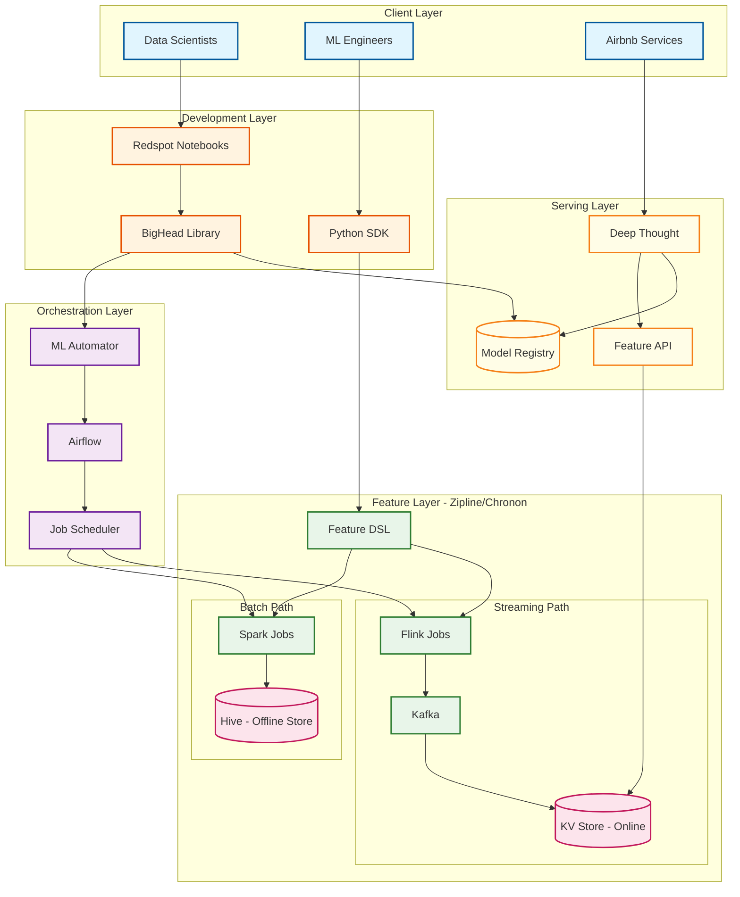

# Airbnb BigHead ML Platform

## Overview

Airbnb BigHead is an end-to-end machine learning platform that pioneered the concept of **train-serve consistency** through its revolutionary Zipline/Chronon feature store. The platform encompasses the entire ML lifecycle from declarative feature engineering to real-time serving, with unique innovations in automatic DAG generation (ML Automator) and containerized development environments (Redspot notebooks). BigHead's open-source composition approach (Python/Docker/Kubernetes/Spark/Airflow) contrasts with proprietary ML platforms, enabling flexibility while maintaining production-grade reliability.

---

## System Characteristics

| Characteristic | Value | Implication |
|----------------|-------|-------------|
| **Traffic Pattern** | Mixed: Batch training + Real-time serving | Separate compute paths with unified feature definitions |
| **Serving Latency** | P99 < 10ms (features), P99 < 30ms (predictions) | Online feature store is critical path |
| **Consistency Model** | Strong (offline features), Eventual (online features) | Point-in-time correctness for training, freshness for serving |
| **Availability Target** | 99.9% for critical models | Multi-zone deployment with graceful degradation |
| **Scale Target** | 30,000+ features, millions of predictions/day | Horizontal scaling across all layers |
| **Data Processing** | Declarative feature engineering | Single DSL compiles to batch (Spark) and streaming (Flink) |

---

## Key Differentiators

| Differentiator | Description | Impact |
|----------------|-------------|--------|
| **Zipline/Chronon Feature Store** | Declarative DSL ensuring same feature computation in training and serving | Eliminates #1 ML production bug (train-serve skew) |
| **ML Automator** | Automatic Airflow DAG generation from Python code | 80% reduction in pipeline boilerplate |
| **Deep Thought** | Kubernetes-native real-time inference with native feature integration | Sub-30ms predictions with consistent features |
| **Open-Source Composition** | Built on Spark, Flink, Kafka, Kubernetes, Airflow | No vendor lock-in, community-driven improvements |
| **Point-in-Time Correctness** | Temporal joins preventing data leakage in training | Accurate model evaluation, faster iteration |

---

## Architecture Overview



---

## Core Components

| Component | Layer | Responsibility | Key Innovation |
|-----------|-------|----------------|----------------|
| **Zipline/Chronon** | Feature | Declarative feature engineering and serving | Single DSL for batch + streaming with point-in-time correctness |
| **Deep Thought** | Serving | Real-time model inference | Native feature integration, multi-framework support |
| **ML Automator** | Orchestration | Automatic DAG generation | Python code → Airflow DAG conversion |
| **Redspot** | Development | Containerized Jupyter notebooks | Docker-based reproducible environments |
| **BigHead Library** | Development | Scikit-learn pipeline wrapper | DAG-based workflow definition |
| **BigHead Service/UI** | Management | Model lifecycle management | Version control, deployment tracking |

---

## Key Numbers

| Metric | Value | Context |
|--------|-------|---------|
| **Features in Store** | 30,000+ | 10x growth in 3 years (from 3,000) |
| **Feature Adoption** | 99% | Percentage of Airbnb features on Chronon |
| **Development Time** | Days (was months) | Platform impact on ML iteration speed |
| **P99 Feature Serving** | < 10ms | Online feature lookup latency |
| **P99 Prediction** | < 30ms | End-to-end inference latency |
| **Framework Support** | 5+ | TensorFlow, PyTorch, XGBoost, scikit-learn, MXNet |
| **Open Source (Chronon)** | April 2024 | Adopted by Netflix, Stripe, Uber, OpenAI |

---

## Complexity Rating

| Component | Rating | Justification |
|-----------|--------|---------------|
| **Overall** | Very High | End-to-end platform with novel train-serve consistency approach |
| **Zipline/Chronon** | Very High | Declarative DSL compiling to batch + streaming, point-in-time joins |
| **Deep Thought** | High | Kubernetes-native serving, multi-framework, sub-30ms latency |
| **ML Automator** | High | AST parsing, DAG generation, Airflow integration |
| **BigHead Library** | Medium | Scikit-learn wrapper with DAG workflow |
| **Redspot** | Medium | Docker containerization, JupyterHub extension |

---

## Quick Navigation

| Document | Focus Area |
|----------|------------|
| [01 - Requirements & Estimations](./01-requirements-and-estimations.md) | Functional/non-functional requirements, capacity planning, SLOs |
| [02 - High-Level Design](./02-high-level-design.md) | 5-layer architecture, data flow, technology decisions |
| [03 - Low-Level Design](./03-low-level-design.md) | Schemas, APIs, algorithms (point-in-time join, DSL compilation) |
| [04 - Deep Dive & Bottlenecks](./04-deep-dive-and-bottlenecks.md) | Zipline internals, Deep Thought, ML Automator, bottleneck analysis |
| [05 - Scalability & Reliability](./05-scalability-and-reliability.md) | Scaling strategies, fault tolerance, disaster recovery |
| [06 - Security & Compliance](./06-security-and-compliance.md) | AuthN/AuthZ, encryption, threat model, compliance |
| [07 - Observability](./07-observability.md) | Metrics, logging, tracing, alerting, drift detection |
| [08 - Interview Guide](./08-interview-guide.md) | Pacing, trade-offs, trap questions, quick reference |

---

## Interview Readiness Checklist

- [ ] Can explain BigHead's 5-layer architecture and component responsibilities
- [ ] Understand Zipline/Chronon's declarative DSL and train-serve consistency approach
- [ ] Know how the same DSL compiles to both Spark (batch) and Flink (streaming)
- [ ] Can describe point-in-time correctness and why it prevents data leakage
- [ ] Understand ML Automator's automatic DAG generation from Python code
- [ ] Can explain Deep Thought's Kubernetes-native serving architecture
- [ ] Know the difference between offline store (Hive) and online store (KV)
- [ ] Understand Lambda architecture for feature freshness vs accuracy trade-off
- [ ] Can discuss trade-offs: declarative vs imperative, auto vs manual DAGs
- [ ] Know BigHead's evolution: Zipline → Chronon → Open Source (2024)

---

## Evolution Timeline

| Year | Milestone |
|------|-----------|
| **2016** | Pre-BigHead: 8-12 weeks to build models, Aerosolve only |
| **2017** | Zipline feature store development begins |
| **2018** | BigHead platform launch, months to days development time |
| **2019** | ML Automator automatic DAG generation |
| **2022** | Zipline renamed to Chronon, open-source effort begins |
| **2024** | Chronon open-sourced (April), adopted by Netflix, Stripe, Uber |

---

## Quick Reference Card

```
+-------------------------------------------------------------------------+
|               AIRBNB BIGHEAD ML PLATFORM - QUICK REFERENCE              |
+-------------------------------------------------------------------------+
| KEY NUMBERS                         | ARCHITECTURE (5 Layers)           |
| * 30,000+ features                  | 1. Client: DS, MLE, Services      |
| * 99% feature adoption              | 2. Development: Redspot, Library  |
| * Months → Days dev time            | 3. Orchestration: ML Automator    |
| * P99 < 10ms feature serving        | 4. Feature: Zipline/Chronon       |
| * P99 < 30ms predictions            | 5. Serving: Deep Thought          |
+-------------------------------------------------------------------------+
| CORE COMPONENTS                     | KEY PATTERNS                      |
| * Zipline/Chronon (Feature Store)   | * Train-serve consistency         |
| * Deep Thought (Serving)            | * Point-in-time correctness       |
| * ML Automator (DAG Generation)     | * Declarative feature DSL         |
| * Redspot (Notebooks)               | * Lambda architecture (batch+stream)|
| * BigHead Library (Pipelines)       | * Automatic DAG generation        |
+-------------------------------------------------------------------------+
| TRADE-OFFS                          | INTERVIEW FOCUS AREAS             |
| * Declarative DSL vs Imperative     | * Why train-serve consistency?    |
| * Auto DAG vs Manual Airflow        | * How point-in-time joins work    |
| * K8s-native vs Custom serving      | * DSL → Spark/Flink compilation   |
| * Open-source vs Proprietary        | * Deep Thought latency breakdown  |
+-------------------------------------------------------------------------+
| TECH STACK: Python, Spark, Flink, Kafka, Hive, Kubernetes, Airflow      |
+-------------------------------------------------------------------------+
```

---

## References

### Airbnb Engineering
- [Bighead: Airbnb's End-to-End ML Platform](https://www.datacouncil.ai/talks/bighead-airbnbs-end-to-end-machine-learning-platform) - Data Council SF 2019
- [Zipline: Airbnb's Declarative Feature Engineering Framework](https://www.databricks.com/session_eu19/zipline-airbnbs-declarative-feature-engineering-framework) - Spark Summit 2019
- [Automated Machine Learning at Airbnb](https://medium.com/airbnb-engineering/automated-machine-learning-a-paradigm-shift-that-accelerates-data-scientist-productivity-airbnb-f1f8a10d61f8) - Airbnb Tech Blog

### Chronon Open Source
- [Chronon Official Documentation](https://chronon.ai/) - Feature platform documentation
- [Chronon GitHub Repository](https://github.com/airbnb/chronon) - Open-source codebase
- [Chronon Open Source Announcement](https://www.infoq.com/news/2024/04/airbnb-chronon-open-sourced/) - InfoQ, April 2024

### Conference Talks
- [Bighead: Airbnb's ML Platform](https://twimlai.com/podcast/twimlai/bighead-airbnbs-machine-learning-platform-atul-kale/) - TWIML Podcast
- [Zipline: A Declarative Feature Engineering Library](https://www.thestrangeloop.com/2019/zipline---a-declarative-feature-engineering-library.html) - Strange Loop 2019
